# 46：容器与智能体 🚀


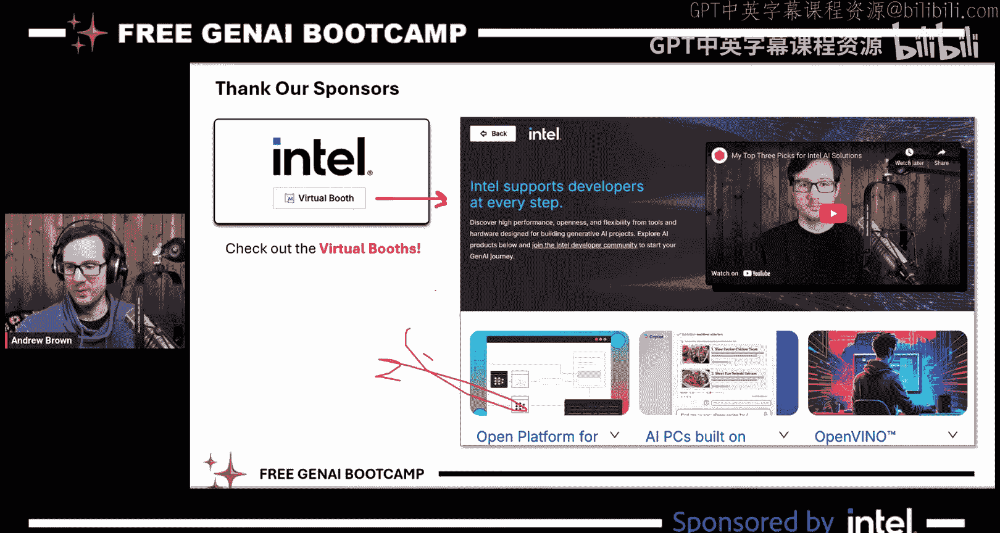

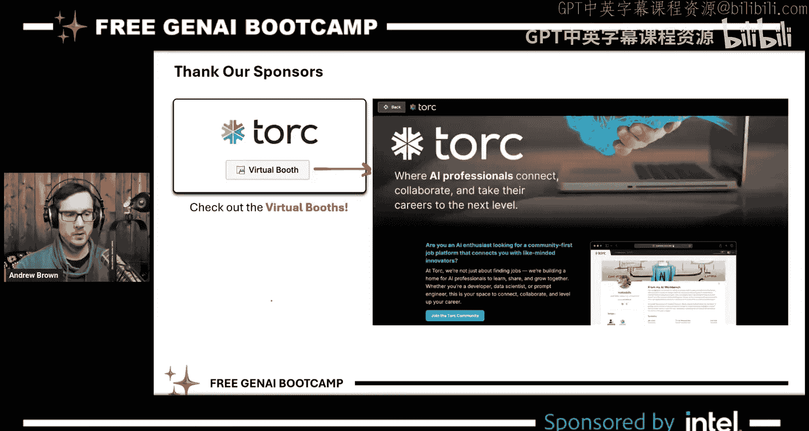

## 概述
在本节课中，我们将学习如何将生成式AI应用容器化，并构建具有自主能力的智能体。我们将深入探讨OPA（Open Platform for AI）的架构，理解其微服务与“大服务”的概念，并尝试从头开始构建一个简单的服务。

---

## 欢迎与课程介绍 👋

大家好，我是Andrew Brown，欢迎来到免费的生成式AI训练营。这是我们的第3周。本周将非常有趣，也可能充满挑战，这取决于直播后的进展，但希望会是顺利的一周。

在开始之前，请允许我提醒一下：如果您有听力障碍，在LinkedIn上观看直播是更好的选择，因为那里提供实时字幕。我们也会尽力在后续视频中提供字幕。

今天我们的嘉宾讲师James Spurin可能会加入，他是云原生领域的专家，专注于Docker、Kubernetes和容器技术。他是CNCF大使和Docker Captain。如果他能来，将会非常精彩；如果不能，就由我来和大家一起学习。

---

## 赞助商与工具介绍 💼

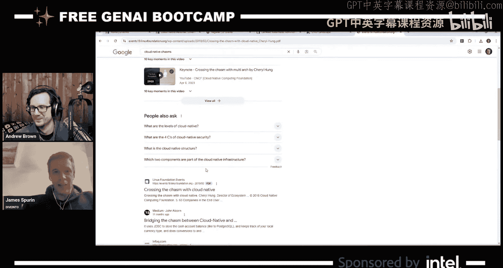

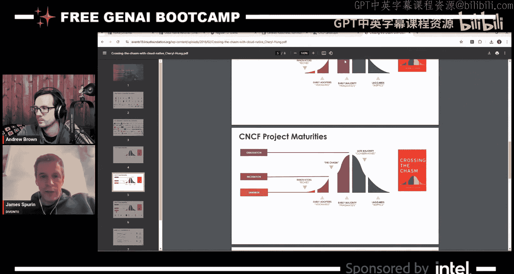

首先，感谢我们的赞助商：
*   **Intel**：我们使用的部分软件，特别是OPA，与Intel有渊源。OPA最初由Intel创建，现在是Linux基金会的一个项目。
*   **Torque**：请创建您的Torque开发者档案。我们在训练营中新增了职业指南部分，我录制了更多关于简历优化和Torque使用的视频。
*   **CodeRabbit**：这是一个AI工具，可以自动为你的Pull Request生成摘要，方便代码审查。我们今天会尝试使用它。

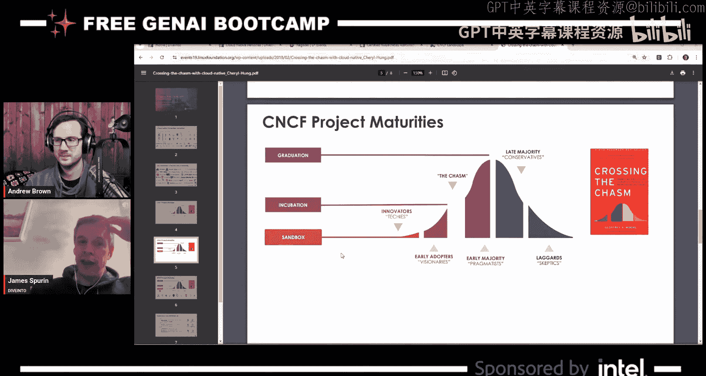

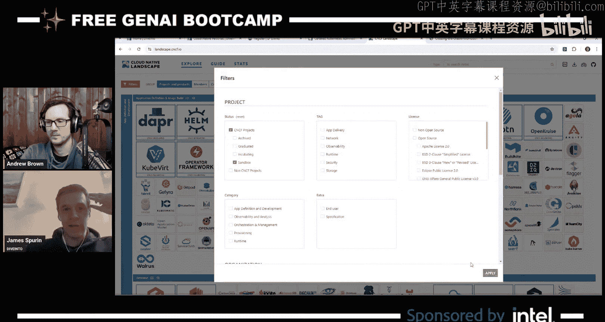

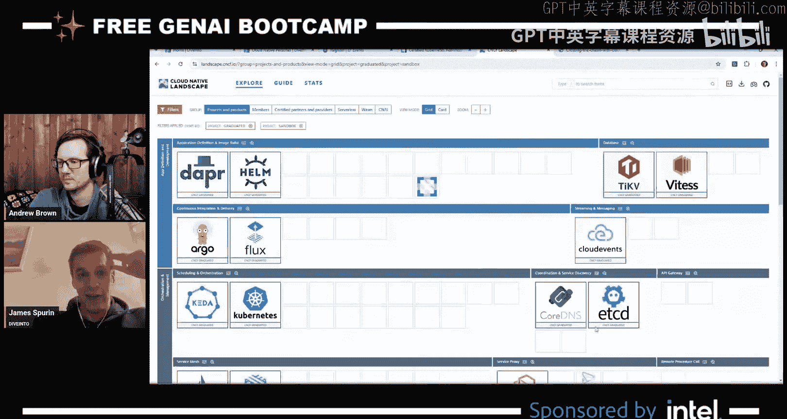

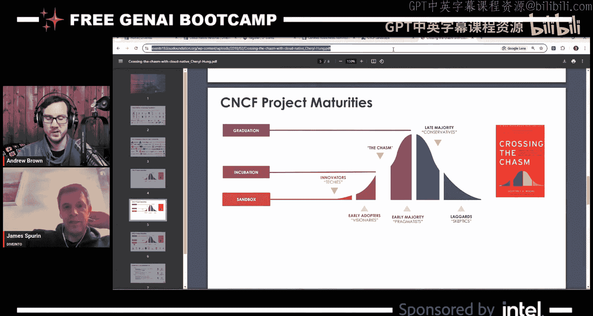

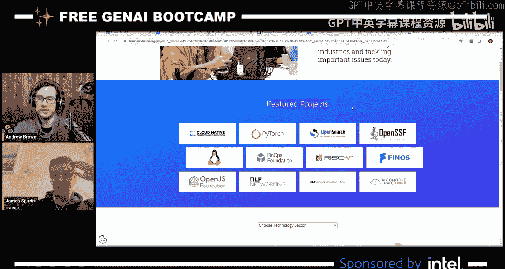

---

## 本周学习目标与作业 📋

本周的主题是**容器与智能体**。核心学习内容包括：
1.  **构建自定义大服务**：使用OPA。
2.  **构建具有自主能力的智能体**。
3.  **尝试CodeRabbit**：生成代码审查摘要。

作业如下：
*   **作业1**：使用OPA构建一个自定义的大服务。
*   **作业2**：构建一个具有自主能力的智能体。
*   **作业3**：尝试使用CodeRabbit生成PR摘要。

---

## 什么是云原生？ ☁️

在深入技术细节之前，让我们先和James探讨一下“云原生”的概念。这是一个经常被提及但定义多样的术语。

**James的观点**：
云原生不仅仅关乎基础设施（如Kubernetes），更是一种哲学和文化。它强调：
*   **驱动变革**：拥抱DevOps、自动化和效率。
*   **架构特性**：应用应具备自愈、自动化、对事件快速响应等能力。
*   **项目生态**：CNCF（云原生计算基金会）拥有庞大的项目生态，从沙盒阶段到孵化阶段，再到毕业阶段（如Kubernetes、Prometheus）。这些项目协同工作，构成了云原生技术栈。

**简单来说**：云原生是关于利用一系列现代化工具和最佳实践，以可扩展、弹性和自动化的方式构建和运行应用。

---

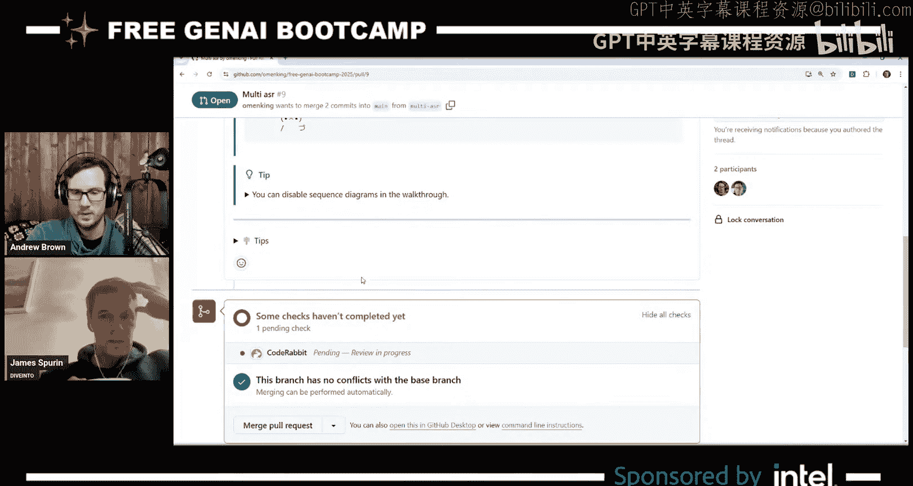

## 深入OPA架构 🏗️

上一节我们介绍了云原生的概念，本节中我们来看看本周的核心工具之一：OPA。许多同学在之前尝试OPA时遇到了困难，主要是因为文档较少。让我们一起来剖析它的架构，理解其工作原理。

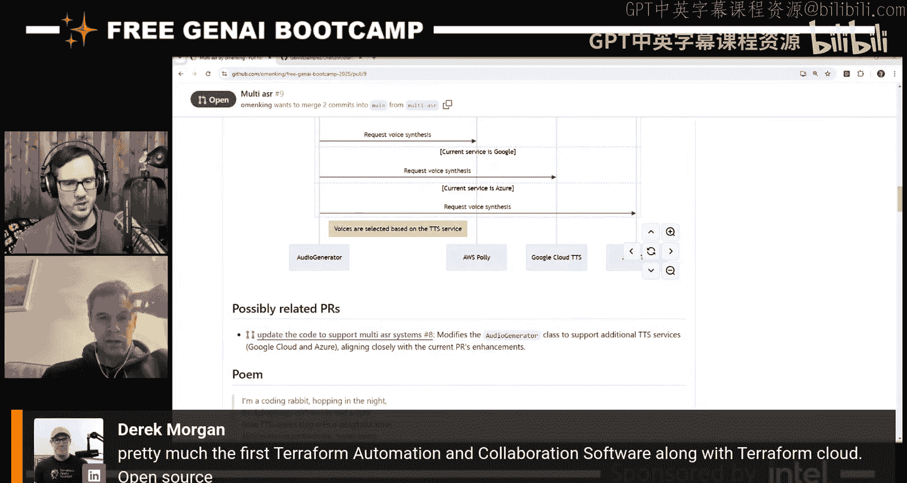

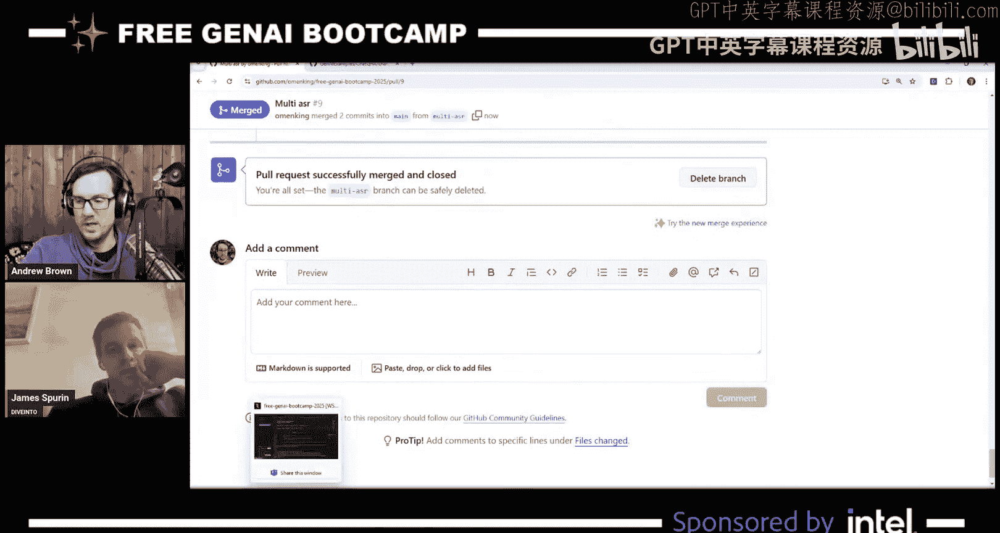

OPA的核心思想是**编排**。它本身不直接运行AI模型（如LLM、嵌入模型），而是作为一个协调层，坐在这些模型服务的前面。

### OPA的核心组件
OPA主要包含两个重要的代码仓库：
1.  `gen-examples`：包含将各个组件组合成现有架构的示例。
2.  `gen-comps`：包含构成生成式AI工作负载的各个组件。

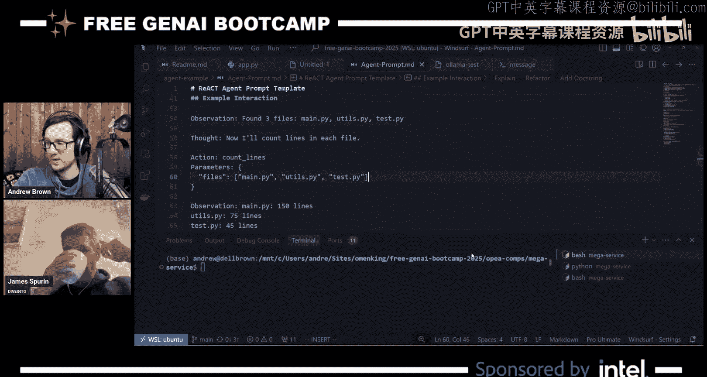

**关键理解**：`gen-comps`中的组件（如`LLM`, `Embeddings`）并不是直接部署模型的服务，而是连接到这些模型服务的**网关或包装器**。你需要自己通过Docker Compose或Kubernetes来运行模型服务（如Ollama、TGI、vLLM），然后OPA组件作为前端与它们交互。

### 以Chat Q&A为例
`gen-examples`中的`chat_qna`示例是一个“大服务”。它展示了如何将多个微服务编排成一个完整的工作流。

**工作流程**：
1.  用户通过UI或API发送请求。
2.  请求首先到达**嵌入微服务**，将文本转换为向量。
3.  向量被发送到**检索微服务**，从向量数据库（如Redis）中查找相关内容。
4.  结果可能经过**重排微服务**进行优化。
5.  最终，问题和相关上下文被发送到**LLM微服务**，获取答案并返回。

这个流程是通过一个有向无环图来定义的。

---

## 代码解析：从Chat Q&A看OPA实现 🔍

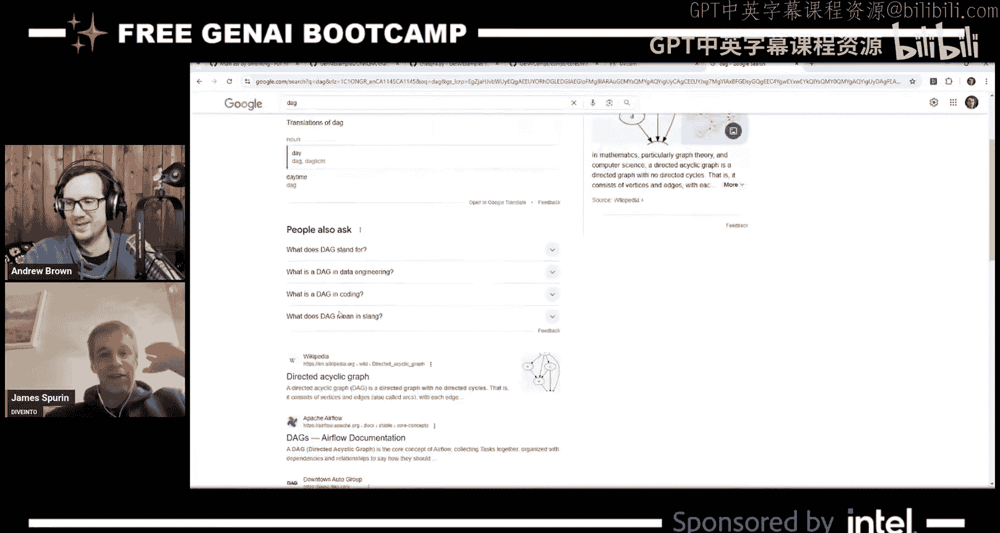

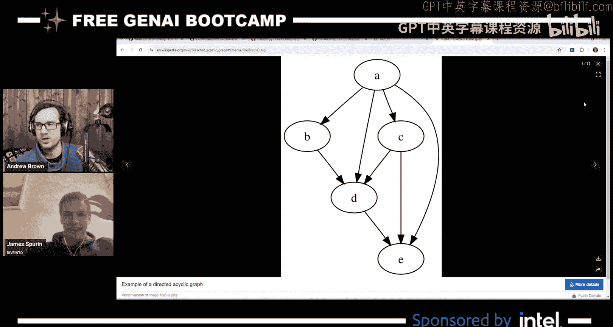

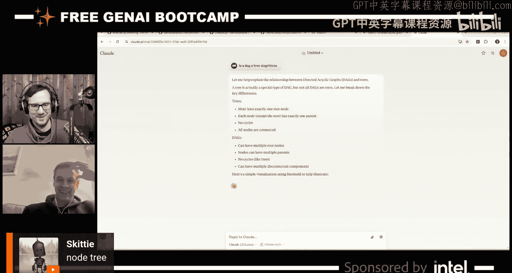

上一节我们介绍了OPA的宏观架构，本节中我们深入到代码层面，看看一个具体的“大服务”是如何实现的。我们将以`chat_qna.py`为例。

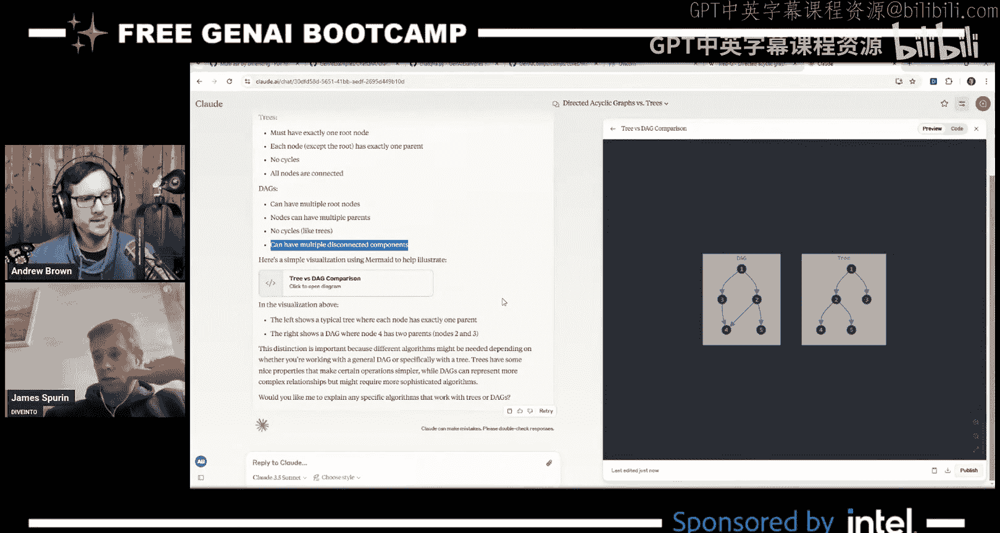

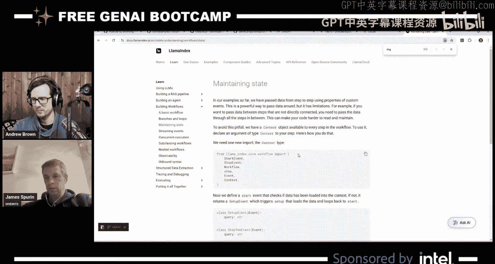

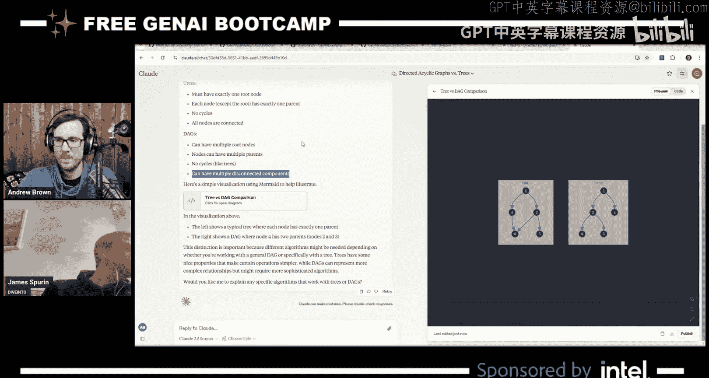

### 核心类结构
一个典型的OPA大服务包含三个主要部分：
1.  **初始化 (`__init__`)**：创建服务编排器。
2.  **添加远程服务 (`add_remote_services`)**：定义并注册各个微服务（如嵌入、检索、LLM）及其工作流。
3.  **启动服务 (`start`)**：启动大服务本身，使其成为一个可访问的API端点。

以下是代码框架：
```python
class ChatQNAService:
    def __init__(self):
        # 创建服务编排器，它是大服务的核心
        self.service_orchestrator = ServiceOrchestrator()
        self.endpoint = “/chat”
        self.host = “0.0.0.0”
        self.port = 8888

    def add_remote_services(self):
        # 定义并添加各个微服务
        embedding_svc = MicroService(name=“embedding”, endpoint=“/v1/embed”)
        retriever_svc = MicroService(name=“retriever”, endpoint=“/v1/retrieve”)
        llm_svc = MicroService(name=“llm”, endpoint=“/v1/chat/completions”)

        # 将微服务添加到编排器，并定义执行流程
        self.service_orchestrator.add(embedding_svc)
        self.service_orchestrator.add(retriever_svc)
        self.service_orchestrator.add(llm_svc)
        self.service_orchestrator.flow(embedding_svc, retriever_svc)
        self.service_orchestrator.flow(retriever_svc, llm_svc)

    def start(self):
        # 将大服务本身也定义为一个微服务，作为入口点
        mega_service = MicroService(name=“mega”, service_type=ServiceType.MEGA)
        mega_service.add_route(“post”, self.endpoint, self.handle_request)
        mega_service.start(host=self.host, port=self.port)

    async def handle_request(self, request: Request):
        # 处理传入的请求，触发编排的工作流
        data = await request.json()
        # 将数据转换为标准化格式（如ChatCompletionRequest）
        # 调用服务编排器执行工作流
        result = await self.service_orchestrator.schedule(data)
        # 处理并返回结果
        return JSONResponse(content=result)
```

### 理解“微服务”与“大服务”
*   **微服务**：在OPA语境下，一个微服务通常是一个简单的FastAPI应用，它封装了对某个特定功能（如调用LLM）的请求。它通过`MicroService`类定义。
*   **大服务**：大服务本身也被定义为一个`MicroService`，但其类型是`ServiceType.MEGA`。它是整个应用的**入口点**，负责接收初始请求，并通过`ServiceOrchestrator`调度定义好的工作流（DAG）。

### 数据流与调试心得
最复杂的部分通常是`handle_request`函数。你需要理解传入的数据格式（通常是OpenAI API兼容格式），并将其转换为OPA内部使用的标准化数据结构（如`ChatCompletionRequest`）。

**调试技巧**：当链式调用出错时，关键在于定位问题发生在哪个环节。可以尝试直接向某个微服务（如运行在端口9009的LLM服务）发送请求，以验证其输入输出是否符合预期。OPA的编排器在底层只是简单地将数据作为JSON通过HTTP POST转发到下一个微服务。

---

## 动手实践：从零构建一个简化版大服务 🛠️

上一节我们解析了现有代码，本节中我们尝试动手，从零开始构建一个极简版的大服务，以便更好地理解整个过程。

### 步骤1：创建项目骨架
我们创建一个新的Python文件，例如`simple_mega.py`，并定义基本的类结构。

```python
# simple_mega.py
from comps import ServiceOrchestrator, MicroService, ServiceType
from fastapi import FastAPI, Request
from fastapi.responses import JSONResponse

class SimpleMegaService:
    def __init__(self):
        self.service_orchestrator = ServiceOrchestrator()
        self.endpoint = “/ask”
        self.host = “0.0.0.0”
        self.port = 8000

    def add_remote_services(self):
        # 暂时留空，我们先构建一个直接返回响应的服务
        print(“添加远程服务（当前无）”)

    def start(self):
        # 创建大服务作为入口点
        mega_service = MicroService(name=“simple_mega”, service_type=ServiceType.MEGA)
        mega_service.add_route(“post”, self.endpoint, self.handle_request)
        mega_service.start(host=self.host, port=self.port)
        print(f“服务启动在 http://{self.host}:{self.port}{self.endpoint}”)

    async def handle_request(self, request: Request):
        # 一个简单的处理函数，直接回显接收到的数据
        data = await request.json()
        return JSONResponse(content={“message”: “请求已收到”, “your_data”: data})

if __name__ == “__main__”:
    service = SimpleMegaService()
    service.add_remote_services()
    service.start()
```

### 步骤2：创建依赖文件并运行
创建一个`requirements.txt`文件，然后安装依赖并运行服务。

```bash
# requirements.txt
gen-comps
fastapi
uvicorn
```

```bash
pip install -r requirements.txt
python simple_mega.py
```

如果一切顺利，服务将在`http://localhost:8000/ask`启动。你可以使用curl进行测试：

```bash
curl -X POST http://localhost:8000/ask \
  -H “Content-Type: application/json” \
  -d ‘{“messages”: [{“role”: “user”, “content”: “Hello!”}], “model”: “llama3”}’
```

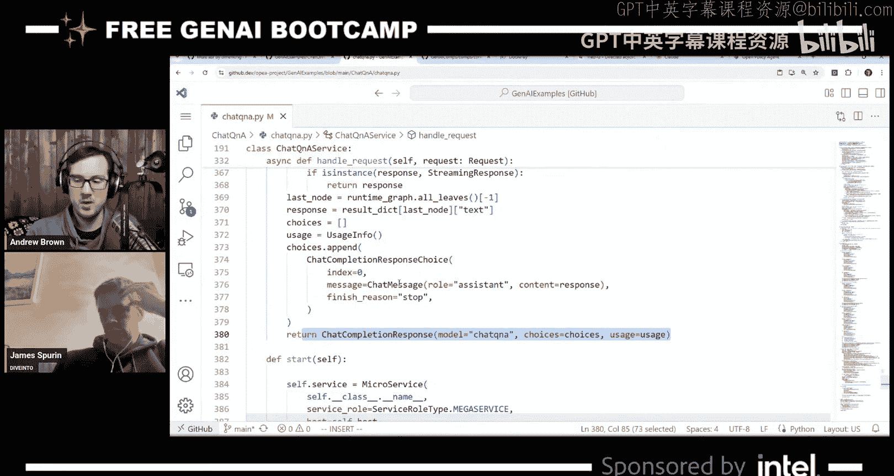

你应该会收到一个包含你发送数据的响应。

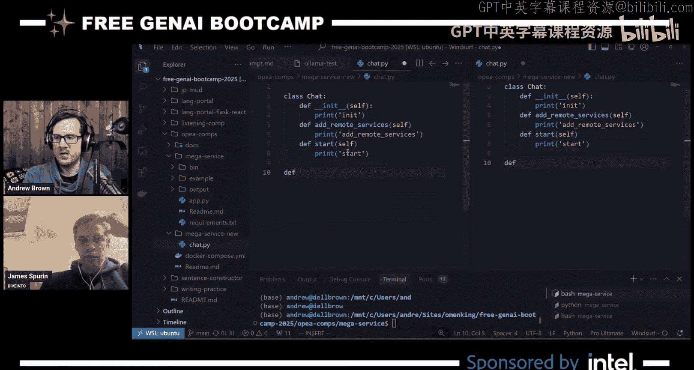

---

## 容器化部署 📦

上一节我们成功创建了一个简单的服务，本节中我们来看看如何将其容器化，以便于部署和分发。

### 创建Dockerfile
Dockerfile定义了如何构建我们的应用镜像。

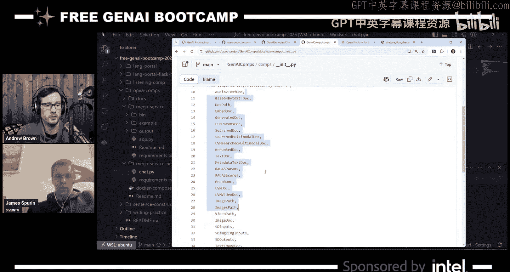

```dockerfile
# Dockerfile
FROM python:3.11-slim
WORKDIR /app
COPY requirements.txt .
RUN pip install --no-cache-dir -r requirements.txt
COPY . .
EXPOSE 8000
CMD [“python”, “simple_mega.py”]
```

### 创建Docker Compose文件
Docker Compose可以方便地定义和运行多容器应用。对于我们的简单服务，一个服务就够了。

```yaml
# docker-compose.yml
version: ‘3.8’
services:
  simple-mega-service:
    build: .
    container_name: simple-mega
    ports:
      - “8000:8000”
    # 可以在这里定义网络，如果需要连接其他容器（如数据库、LLM服务）
    # networks:
    #   - my-network

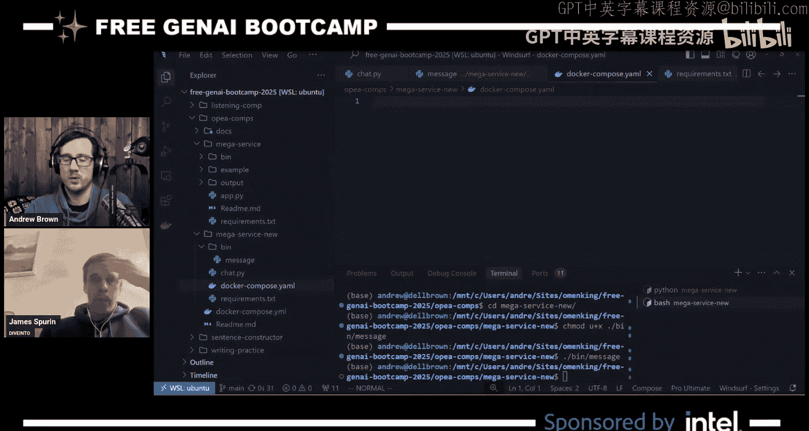

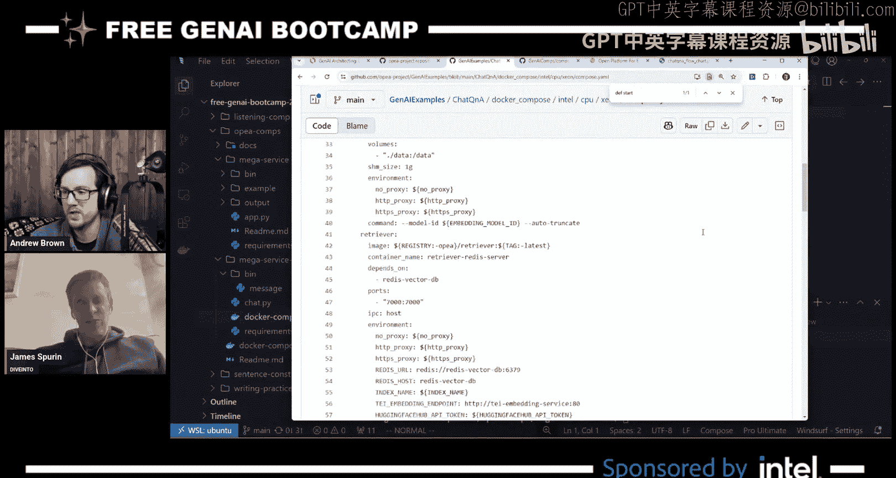

# 可选：定义自定义网络
# networks:
#   my-network:
#     driver: bridge
```

### 构建并运行
在包含`Dockerfile`和`docker-compose.yml`的目录下，运行：

```bash
docker-compose up --build
```

这将构建镜像并启动容器。现在，你的服务已经在容器中运行，可以通过宿主机的8000端口访问。

**网络说明**：如果需要让这个服务与其他的OPA组件（如Ollama容器）通信，你需要在`docker-compose.yml`中定义一个共享网络，并将所有相关服务连接到这个网络，这样它们就可以通过服务名称相互访问。

---

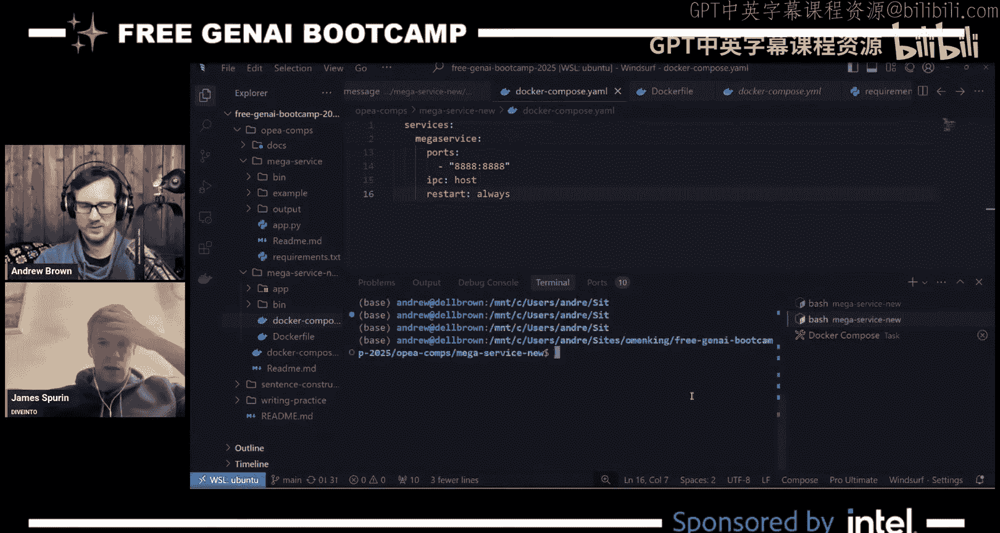

## 总结与回顾 🎯

本节课中我们一起学习了生成式AI应用容器化与智能体构建的基础。

*   **核心概念**：我们探讨了**云原生**的哲学，并深入了解了**OPA**作为AI服务编排平台的架构。关键点是理解其“微服务”作为网关、“大服务”作为入口点、以及**服务编排器**通过**有向无环图**管理工作流的模式。
*   **代码实践**：我们解析了`chat_qna`示例的代码结构，并动手从零构建了一个极简的**大服务**，理解了其初始化、添加服务和启动的流程。
*   **容器化**：我们学习了如何使用**Dockerfile**和**Docker Compose**将Python应用容器化，为生产环境部署做好准备。
*   **工具使用**：我们还介绍了**CodeRabbit**这类AI辅助代码审查工具，它们可以提高开发效率。

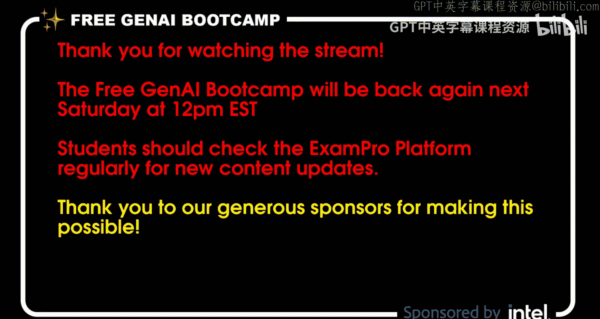

通过本周的学习，你应该能够理解如何将复杂的AI应用拆分为可管理的组件，并使用现代云原生工具进行编排和部署。这为构建更复杂、可扩展的生成式AI应用打下了坚实的基础。