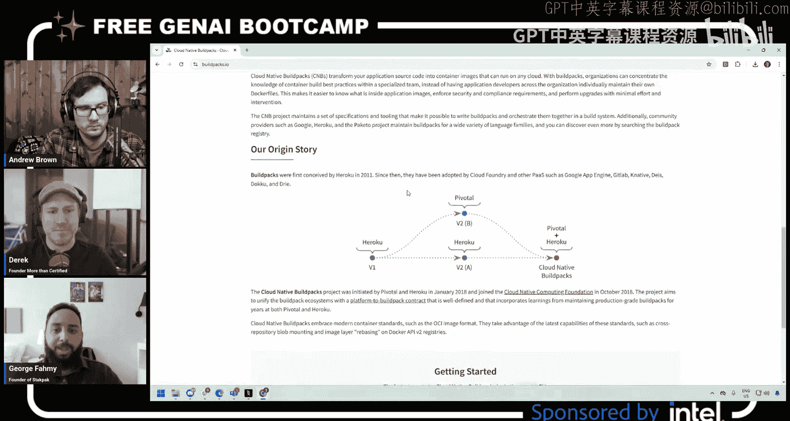
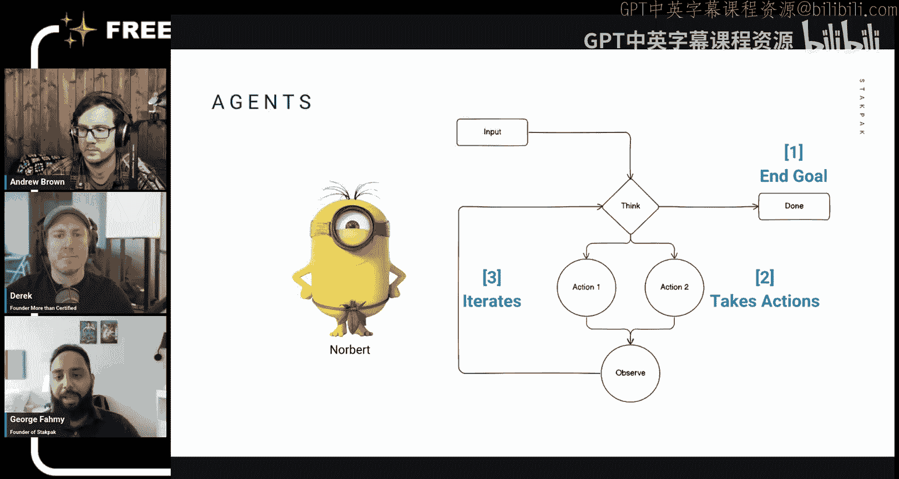
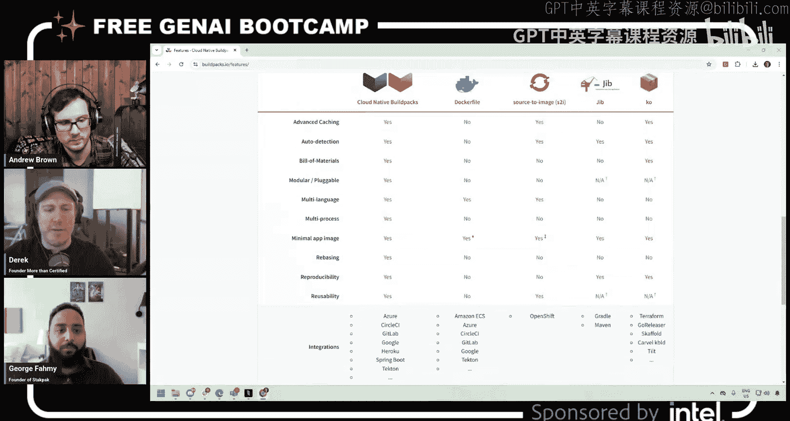
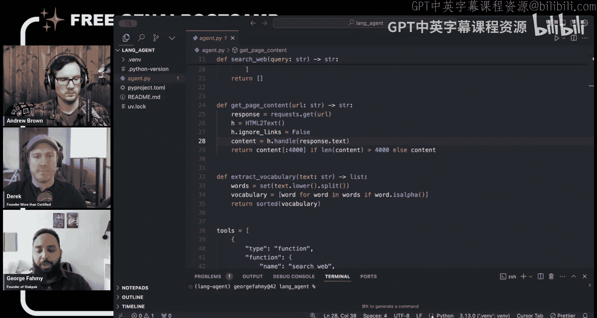
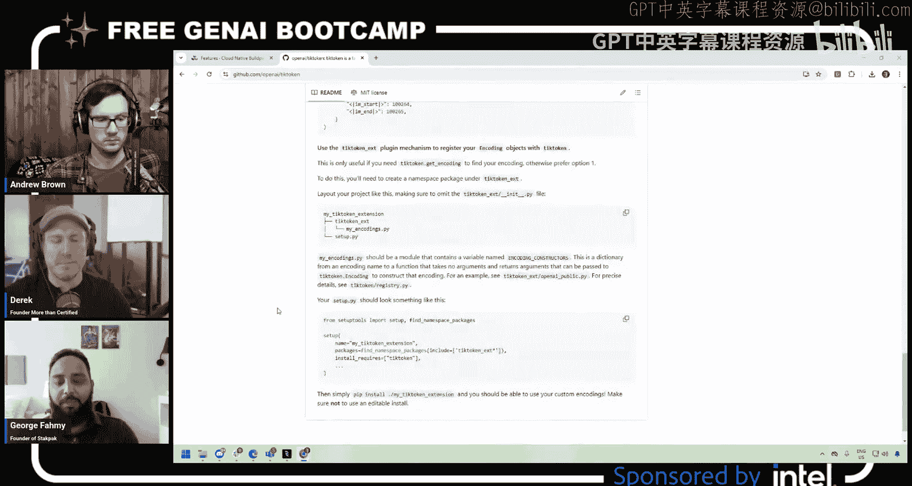
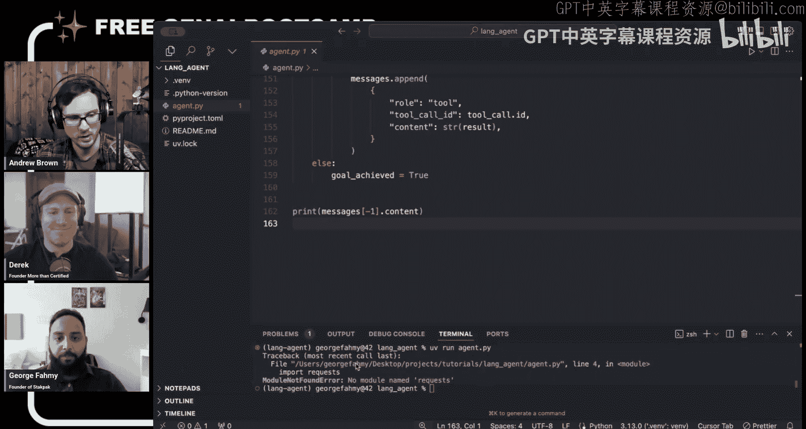
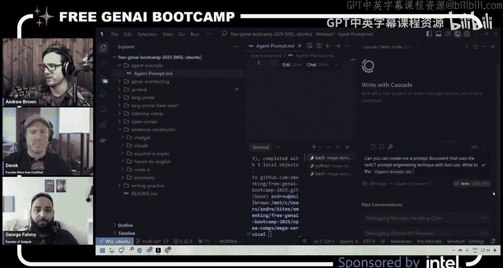
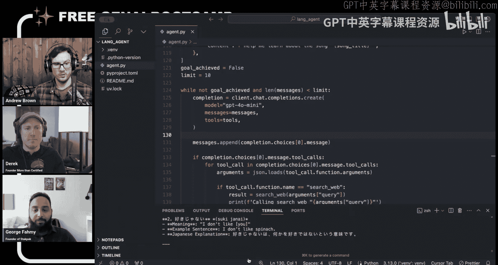

# 47：智能体（Agents）入门教程 🧠

在本节课中，我们将学习什么是智能体（Agents），它与传统LLM应用的区别，并通过一个构建“歌词学习助手”智能体的代码示例，来理解其核心概念和工作原理。

---

## 什么是智能体？🤖

上一节我们介绍了结构化JSON输出。本节中，我们来看看一个不同的主题：智能体工作流。

智能体是一种能够自主执行任务、影响外部世界并持续迭代直至达成目标的系统。它与构建常规的LLM应用有本质区别。常规LLM应用具有特定、固定的工作流程，而智能体则更加灵活，能够处理更复杂的问题，因为它可以反复尝试、探索和调整。




一个最简单的智能体可以定义为具备以下三个要素的系统：
1.  **目标**：它有一个需要达成的目标（例如，“找到香蕉”或“服从命令”）。
2.  **行动**：它可以执行能够影响外部世界的操作。
3.  **迭代**：它会持续循环执行，直到达成目标。






这就像一个“终结者”，不达目的誓不罢休。智能体拥有“自主性”，因为它能自行决定采取何种行动以及何时停止。

---

## 为何需要智能体？💡

智能体适用于解决那些无法一次性成功、需要反复试错的复杂问题。例如，在构建容器镜像（Dockerfile）时，尤其是处理像Cloud Native Buildpacks这样需要适配各种不同运行环境的应用时，首次尝试往往失败。这时就需要一个智能体来尝试生成Dockerfile、构建镜像、运行测试、观察结果，并根据反馈进行迭代，直到应用成功运行。

如果问题本身是直接明了的，那么可能就不需要智能体。但当问题涉及“尝试-观察-调整”的循环时，智能体就是一个很好的解决方案。





---

## 构建一个简单的智能体：歌词学习助手 🎵

为了直观地理解智能体，我们将构建一个“歌词学习助手”。这个智能体的目标是：根据用户母语、想学习的外语以及歌曲名称，自动从互联网上查找歌词，提取关键生词，并用双语进行解释，帮助用户学习这首歌。

以下是构建此智能体的核心步骤和代码逻辑。

### 第一步：定义智能体可用的工具（行动）

智能体需要通过“工具”来与外部世界交互。我们的智能体定义了三个基本工具：

1.  **搜索网络**：接收查询字符串，执行搜索并返回结果（标题和URL）。
2.  **获取页面内容**：接收URL，抓取网页并提取纯文本内容（限制字符数以避免消耗过多token）。
3.  **提取词汇**：接收文本，从中提取出单词列表。

以下是定义这些工具的代码框架。我们使用OpenAI风格的函数调用格式来描述每个工具，这有助于LLM理解何时以及如何调用它们。



```python
# 工具定义示例（搜索网络）
tools = [
    {
        "type": "function",
        "function": {
            "name": "search_web",
            "description": "在互联网上搜索信息。",
            "parameters": {
                "type": "object",
                "properties": {
                    "query": {
                        "type": "string",
                        "description": "搜索查询词。"
                    }
                },
                "required": ["query"]
            }
        }
    },
    # ... 其他工具（get_page_content, extract_vocabulary）的定义方式类似
]
```

**关键点**：每个工具都有名称、描述和参数模式。LLM会根据描述来决定在什么情况下调用哪个工具。



### 第二步：设置智能体的目标和初始输入

我们需要告诉智能体它的角色、任务以及初始信息。

```python
system_prompt = “你是一个有帮助的语言导师，帮助用户通过歌曲学习外语。”
user_input = {
    “native_language”: “英语”，
    “target_language”: “德语”，
    “song_title”: “99 Luftballons”
}
```


### 第三步：实现智能体的控制循环 🌀

这是智能体的核心。循环将持续运行，直到达成目标或达到迭代次数上限。

```python
max_iterations = 10
goal_achieved = False
messages = [系统提示和用户输入]

for iteration in range(max_iterations):
    if goal_achieved:
        break

    # 1. 调用LLM，传入当前消息历史和可用工具列表
    response = client.chat.completions.create(
        model=“gpt-4o-mini”，
        messages=messages，
        tools=tools，
        tool_choice=“auto” # 让模型自行决定是否调用工具
    )

    message = response.choices[0].message
    messages.append(message) # 将模型的思考加入历史

    # 2. 检查模型是否决定调用工具
    if message.tool_calls:
        for tool_call in message.tool_calls:
            # 根据 tool_call.function.name 决定调用哪个函数
            function_name = tool_call.function.name
            function_args = json.loads(tool_call.function.arguments)

            # 3. 执行对应的工具函数
            if function_name == “search_web”:
                result = search_web(**function_args)
            elif function_name == “get_page_content”:
                result = get_page_content(**function_args)
            # ... 处理其他工具

            # 4. 将工具执行的结果作为观察反馈给LLM
            messages.append({
                “role”: “tool”，
                “tool_call_id”: tool_call.id，
                “content”: str(result)
            })
    else:
        # 模型没有调用工具，意味着它认为任务已完成，准备输出最终答案
        goal_achieved = True
        final_output = message.content

# 循环结束，输出最终结果
print(final_output)
```

**循环逻辑解析**：
*   LLM根据当前对话历史和目标，决定下一步行动（调用工具或直接回答）。
*   如果调用工具，则执行该工具（如搜索网络），并将**执行结果**作为新的消息附加到对话历史中。这模拟了智能体“观察”其行动对世界的影响。
*   如果没有调用工具，则认为智能体已得出最终结论，循环终止。
*   设置迭代上限（如10次）是为了防止智能体陷入无限循环，消耗过多资源。

### 运行示例

当我们运行智能体学习德语歌曲“99 Luftballons”时，其执行流程可能如下：
1.  智能体决定调用 `search_web`，查询“99 Luftballons lyrics”。
2.  从搜索结果中选择一个链接，调用 `get_page_content` 获取歌词文本。
3.  调用 `extract_vocabulary` 从歌词中提取生词。
4.  最终，智能体不调用任何工具，而是直接输出对生词的解释、例句以及歌曲相关的趣味知识。

---

## 挑战与进阶思考 🧩

在构建智能体的实践中，我们会遇到一些挑战，例如：
*   **任务分解**：对于复杂任务（如从日语歌词中正确分词），单个工具可能不够智能。解决方案可以是设计更精细的工具，或者引入“子智能体”概念，将复杂任务委托给另一个专门的智能体处理。
*   **上下文管理**：需要精心设计如何将工具执行的结果（观察）有效地反馈给智能体，以帮助其进行后续决策。
*   **停止条件**：清晰定义目标对于智能体判断何时停止至关重要，否则需要依赖迭代次数限制。

现代的LLM（如GPT-4o）通常内置了对工具调用的良好支持，开发者无需在提示词中详细教导其使用格式，只需通过API提供工具定义即可。这使得构建智能体比过去（如ReAct范式刚提出时）更加简单。

---

## 总结 📚

本节课中我们一起学习了智能体（Agents）的核心概念。我们了解到：
*   智能体是具有**目标**、能执行**行动**并持续**迭代**的自主系统。
*   它与传统固定流程的LLM应用不同，更适合解决需要试错的复杂问题。
*   我们通过构建一个“歌词学习助手”智能体，拆解了其核心组成部分：**工具定义**、**目标与提示设置**以及最重要的**控制循环**逻辑。
*   智能体通过工具与外界交互，并根据执行结果的反馈来调整后续行动，直至完成任务。



智能体是构建高级AI应用的重要范式，它打开了解决更开放、更动态问题的大门。希望本教程能帮助你迈出构建自己智能体的第一步！