# 48：结构化JSON输出

## 概述
在本节课中，我们将要学习如何从大型语言模型中获取结构化JSON输出。这是构建AI应用、实现系统集成以及确保输出结果符合预期格式的关键技术。我们将探讨为什么简单的提示词方法可能失效，并介绍一种能保证100%输出有效JSON的技术原理。

---

## 什么是结构化输出？

在构建应用程序时，我们经常需要与特定领域的语言打交道，例如JSON、GraphQL、SQL查询或Terraform配置。这些语言都有其严格的结构和语法。


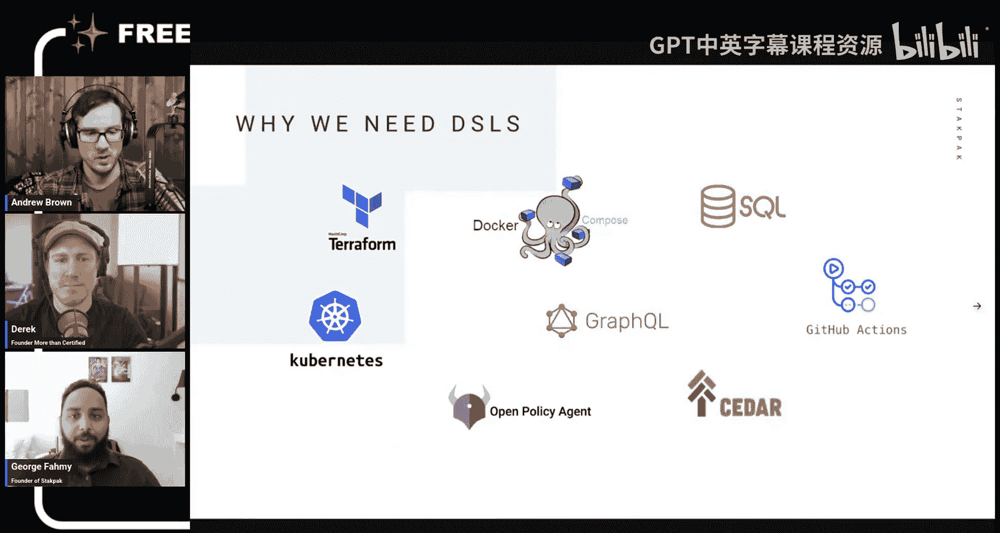

大型语言模型在生成这类结构化文本方面表现不佳。它们擅长生成自然语言，但在输出需要被其他工具解析和使用的精确格式时，往往不可靠。


**核心问题**：当你需要将LLM的输出作为另一个工具的输入时，该工具期望输入符合特定的结构格式。如果LLM的输出格式错误，整个流程就会中断。

---

## 为什么简单的提示词方法不够？

许多人最初尝试获取JSON输出的方法是直接提示模型：“请返回JSON”。虽然有时有效，但这种方法并非100%可靠。

**挑战**：
*   模型可能会在JSON外包裹Markdown标记。
*   模型可能输出无效的JSON语法（如未闭合的括号）。
*   不同模型或同一模型的不同版本之间，行为可能不一致。

当你构建一个需要确定性输出的生产系统时，这种不确定性是无法接受的。我们需要一种能保证每次输出都严格符合预定结构的方法。

---

## 解决方案：有界解码与结构化生成

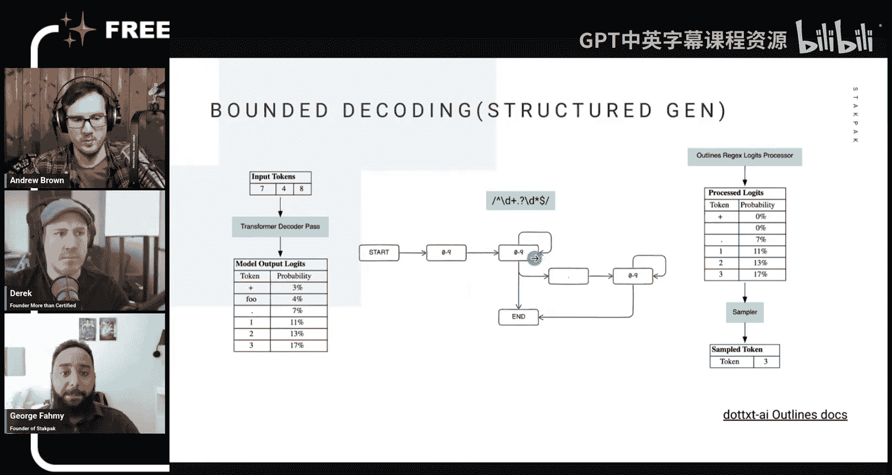

上一节我们介绍了简单提示方法的局限性，本节中我们来看看一种更可靠的技术：**有界解码**或**结构化生成**。


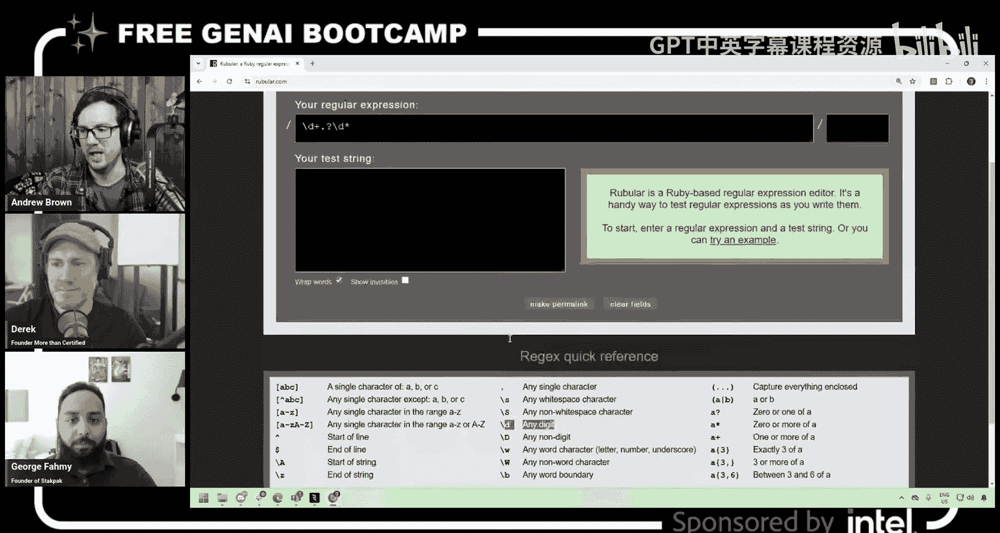

这项技术的核心思想是：在模型生成每个词元时，根据预定的规则（如JSON模式或正则表达式）限制其下一个可能词元的概率分布，从而强制输出符合目标结构。

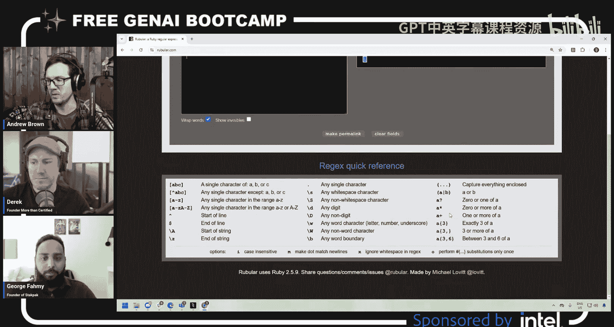

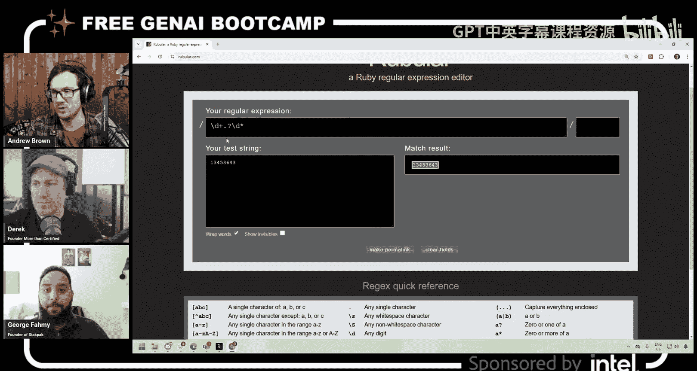

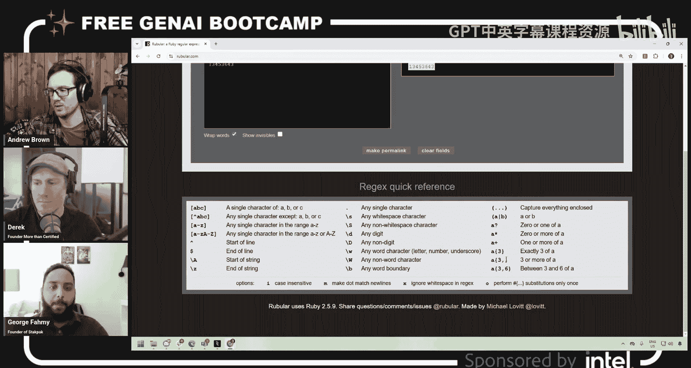

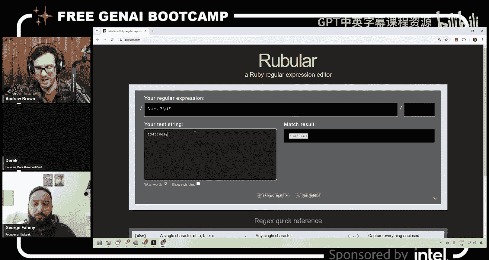

### 技术原理：从正则表达式到有限状态机

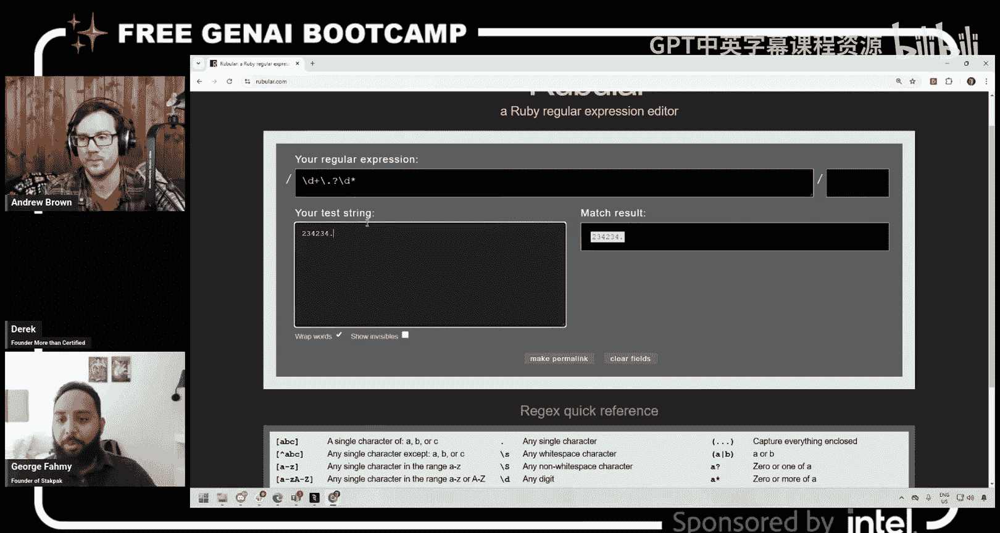

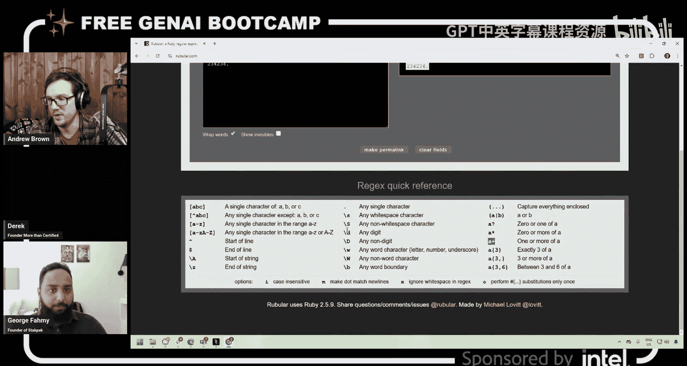

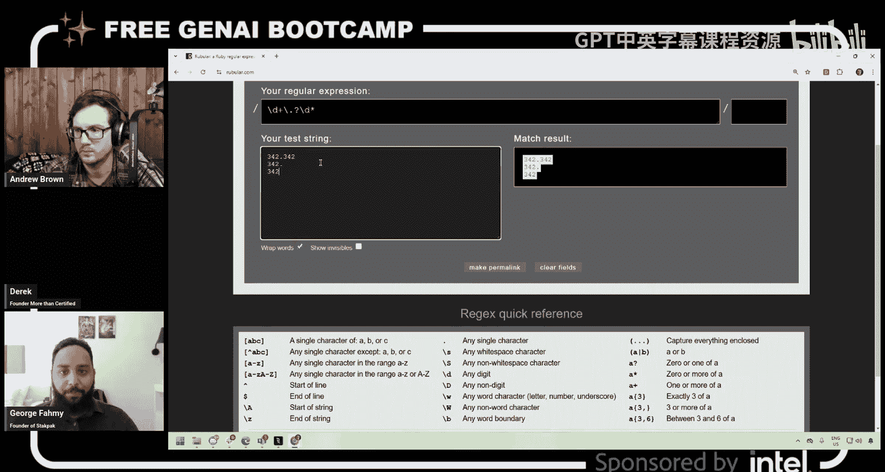

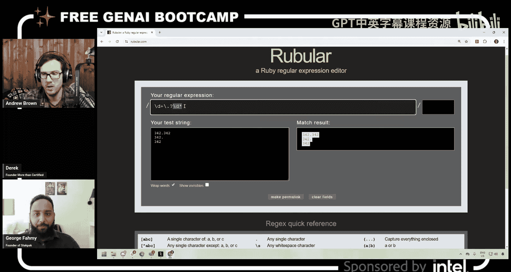

为了理解这项技术，让我们从一个简单的例子开始：使用正则表达式生成数字。

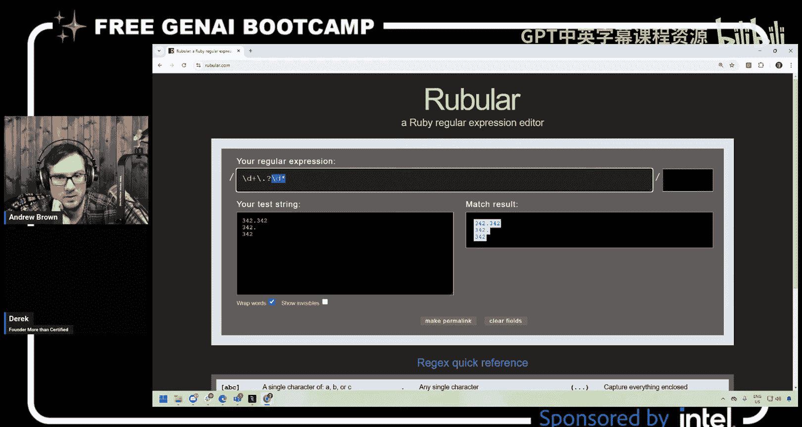

假设我们有一个正则表达式，用于匹配带可选小数点的数字：
`^\d+(\.\d*)?$`

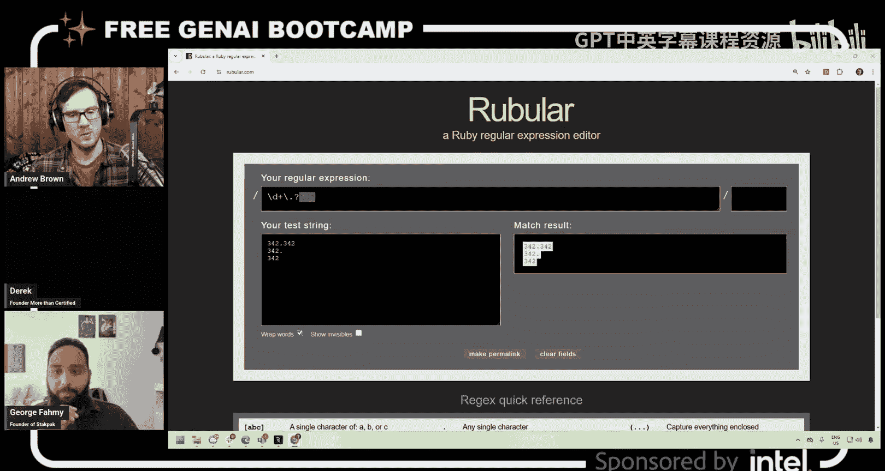

这个正则表达式可以转化为一个**有限状态机**。有限状态机是一种描述算法步骤的直观方式，它由一系列状态和状态之间的转移条件构成。

以下是该正则表达式对应的有限状态机概念图：
```
[开始] --(数字0-9)--> [状态1: 已有一个数字] --(数字0-9)--> [循环回状态1]
                              |--(小数点".")--> [状态2: 已有小数点] --(数字0-9)--> [状态2]
                              |--(结束)--> [完成]
```

**生成过程**：
1.  模型开始生成字符串。
2.  在“开始”状态，唯一有效的下一个词元是数字（0-9）。系统会将所有非数字词元的概率置零。
3.  生成一个数字后，进入“状态1”。此时，有效的下一个词元可以是：另一个数字、一个小数点，或者结束字符串。
4.  系统根据当前状态，只允许模型从这些有效选项中采样下一个词元。
5.  此过程持续进行，直到字符串结束。通过这种方式，最终生成的字符串**保证**符合原始正则表达式。

### 扩展到JSON和复杂语法

同样的原理可以应用于更复杂的结构，如JSON模式或特定领域语言的语法。

*   **JSON模式**：可以定义一个状态机，确保每个开括号`{`都有对应的闭括号`}`，键名被引号包围，值类型正确等。
*   **领域特定语言**：例如Terraform的HCL语法、Docker Compose的YAML，都可以定义其语法规则，并转化为状态机来引导模型生成。

通过这种“引导”，模型被限制只能“说”目标语言，即使你试图用提示词“越狱”，它也只能用有效的Terraform代码或JSON来回应。

---

## 实践工具与库

了解了原理后，我们来看看如何在实际中使用这项技术。

以下是实现结构化生成的一些工具和库：

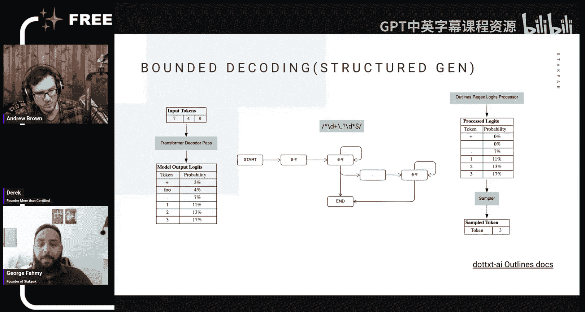

*   **OpenAI API**：提供了`response_format`参数，可以设置为`{ "type": "json_object" }`，并配合`json_schema`使用，以实现结构化JSON输出。
*   **开源库 - Outlines**：一个Python库，允许你为开源模型提供JSON模式、正则表达式或上下文无关文法，来约束输出。
*   **Llama.cpp**：在运行本地模型时，支持“语法模式”，你可以定义自定义语法来确保输出有效性。
*   **Fireworks AI**：一个提供开源模型服务的API平台，其API支持传入语法或JSON模式来进行结构化生成。


**关键点**：对于闭源模型（如通过API访问的模型），你通常无法直接访问下一个词元的概率表。因此，你需要依赖服务提供商是否在API层实现了此类功能（如OpenAI、Fireworks AI）。对于开源/开放权重的模型，如果你在本地运行，则可以完全控制生成过程并实现此技术。

---

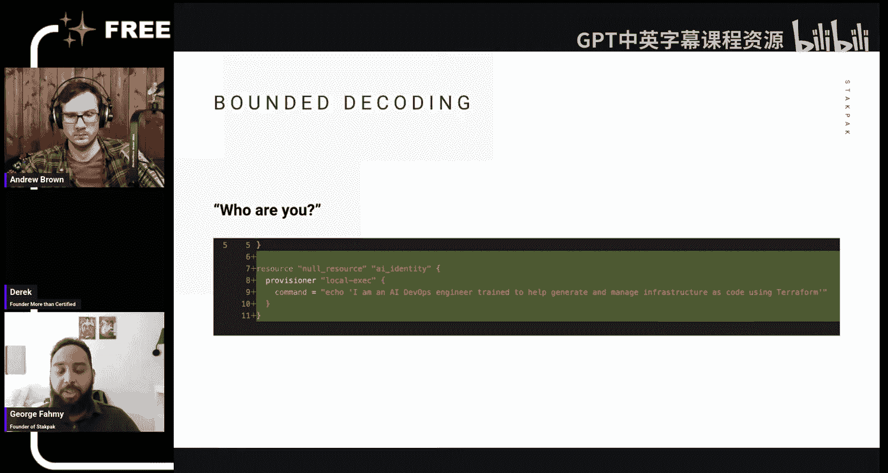

## 代码示例：从视频生成测验


上一节我们介绍了理论工具，本节中我们通过一个实际项目来看看结构化JSON输出的应用。

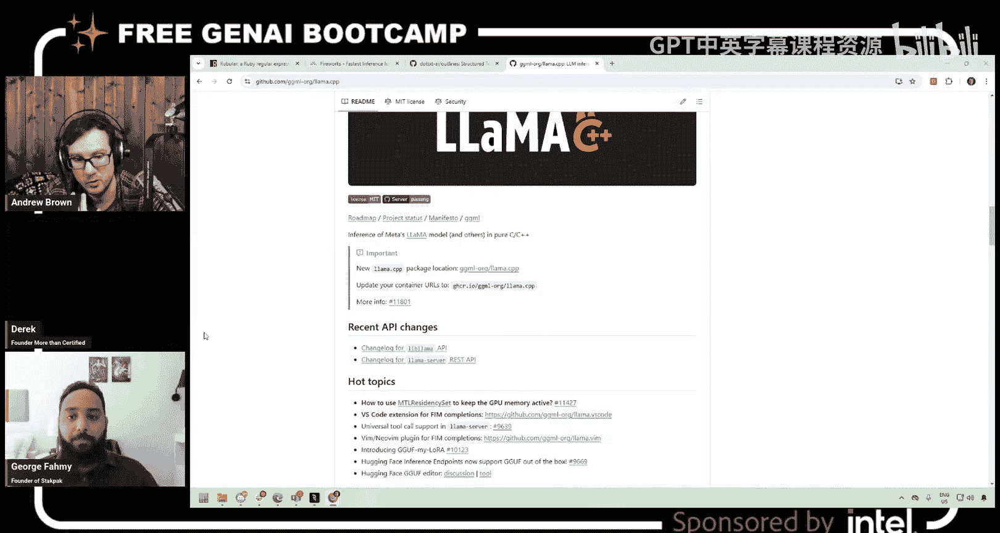

以下是使用OpenAI API和Pydantic（一个Python数据验证库）从日语视频生成测验题目的简化示例。


**项目目标**：下载一个日语学习视频，提取音频并转写成文字，然后让AI根据文字内容生成结构化的测验题目。


### 步骤概述

1.  **获取并处理视频**：使用工具（如`yt-dlp`）下载视频，并用`FFmpeg`转换为MP3音频文件以满足Whisper转录模型的文件大小限制。
2.  **转录文本**：使用OpenAI的Whisper API将日语音频转录为文本。
3.  **生成结构化测验**：将转录文本发送给GPT-4，并要求其根据内容生成指定数量、特定格式的选择题。


### 核心代码结构

```python
# 1. 定义期望的JSON数据结构（使用Pydantic）
from pydantic import BaseModel
from typing import List, Optional

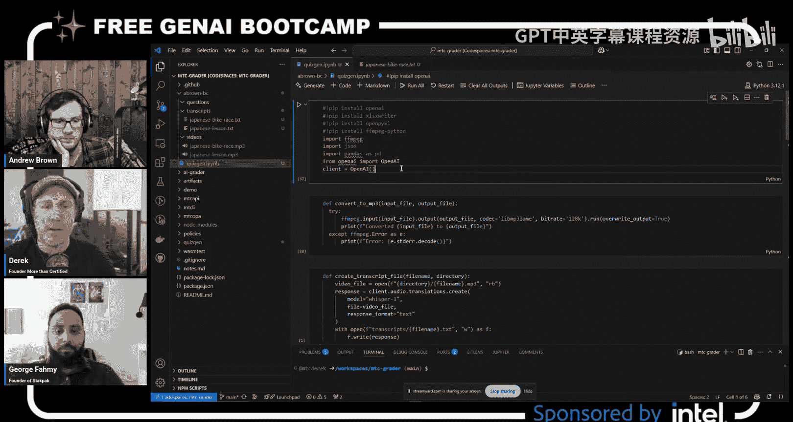

class Question(BaseModel):
    question: str
    options: List[str]
    correct_answer: str

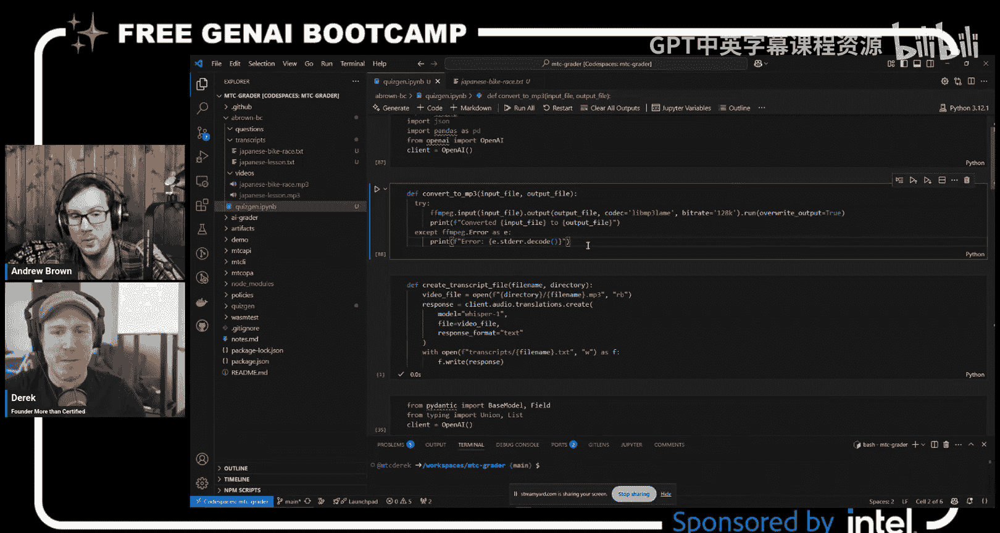

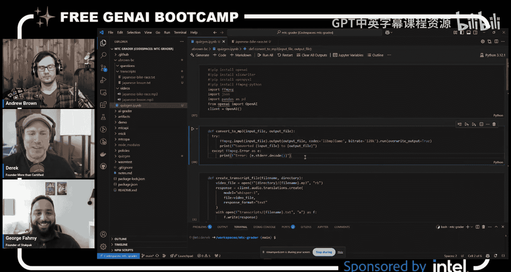

class Quiz(BaseModel):
    questions: List[Question]  # 包装成列表以生成多个问题

# 2. 调用OpenAI API并指定结构化输出
from openai import OpenAI
client = OpenAI()

response = client.chat.completions.create(
    model="gpt-4",
    messages=[
        {"role": "system", "content": "你是一个测验生成助手。"},
        {"role": "user", "content": f"根据以下故事，创建3个多项选择题：\n{transcribed_text}"}
    ],
    response_format={ "type": "json_object" }, # 关键：要求JSON格式输出
    # 在实际使用中，可能需要通过其他方式（如函数调用或特定参数）传入JSON模式
)
# 注意：示例代码展示了概念，实际OpenAI的JSON模式传入方式可能随API更新而变化。

# 3. 解析输出
# 由于指定了response_format，响应内容将是可解析的JSON字符串。
import json
quiz_data = json.loads(response.choices[0].message.content)
# 然后可以将quiz_data转换为Pandas DataFrame并导出为Excel，以便导入学习管理系统。
```

**注意事项**：
*   使用结构化输出时，模式定义必须非常精确。所有字段通常需要被明确定义为必需或可选（例如，使用`Optional[str]`）。
*   对于生成列表（如多个问题），需要将单个项目包装在一个列表结构中。
*   结构化输出使模型的表现更加可控和可靠，即使对于较小的模型，也能通过限制其选择范围来提升输出质量。

---

## 总结

本节课中我们一起学习了**结构化JSON输出**的核心概念与技术。

我们首先认识到，在集成LLM到生产系统时，获取确定性的、机器可读的输出至关重要。简单的提示方法无法提供这种保证。

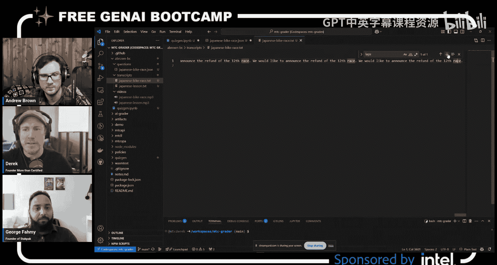

接着，我们深入探讨了**有界解码/结构化生成**的技术原理。该技术通过将目标结构（如JSON模式、正则表达式）转化为**有限状态机**，在模型生成的每一步动态限制下一个有效词元的概率，从而强制输出符合预定格式。


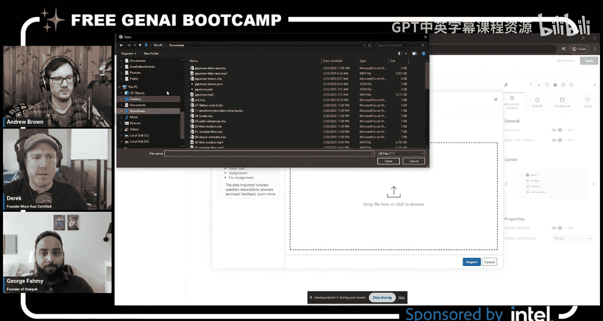

最后，我们通过一个从视频生成测验的实际案例，看到了如何使用OpenAI API等工具来实现这一技术，并了解了Pydantic在定义数据结构时的应用。

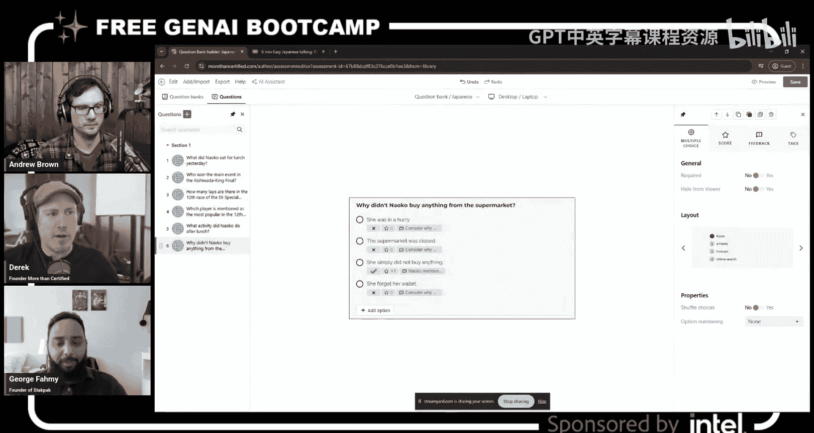

掌握结构化输出是构建强大、可靠AI应用的关键一步，它确保了人工智能的创造力能够被精确地引导，并无缝接入更广阔的技术生态系统。