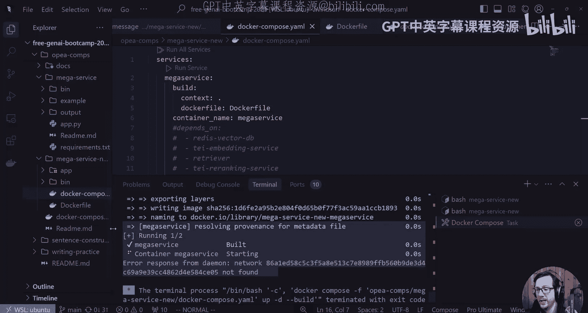
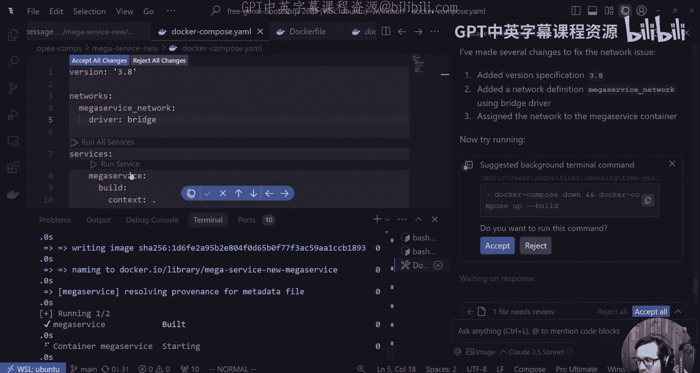
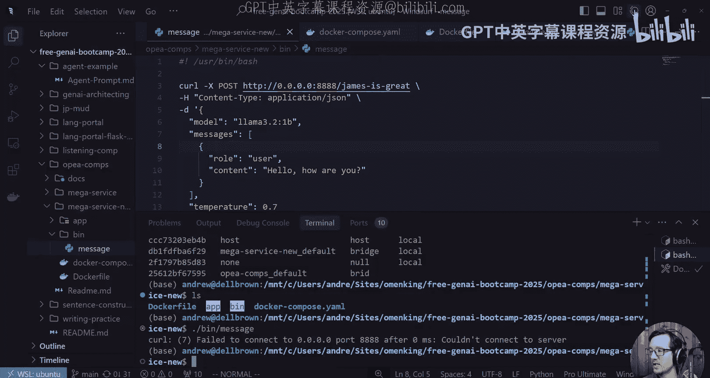
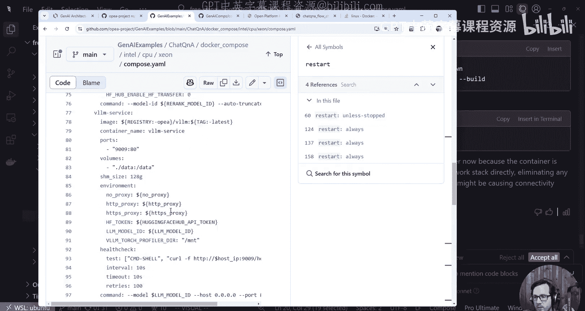
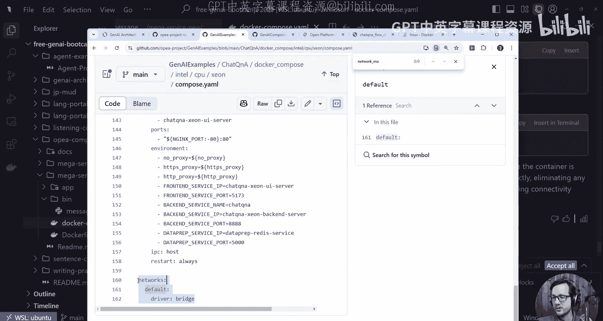
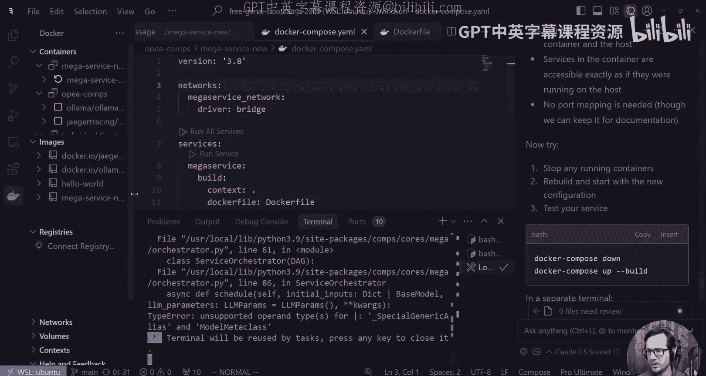
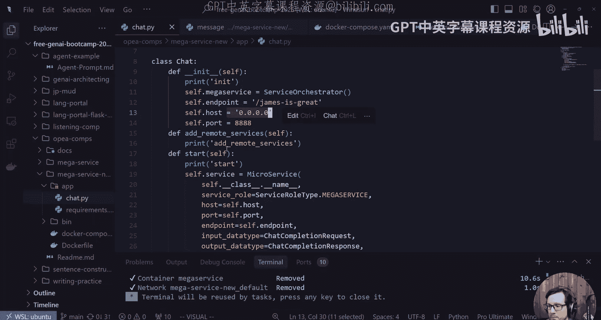
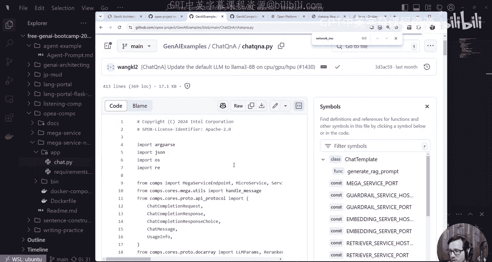
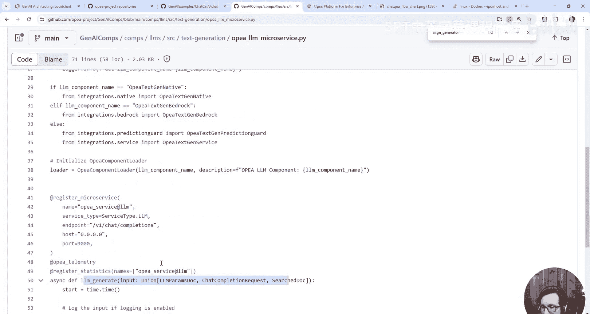

# 49：解决Docker网络问题并探索OPEA架构

## 概述

在本节课中，我们将继续处理直播中遇到的Docker网络问题，并深入探索OPEA（Open Platform for Enterprise AI）架构中服务注册与组件调用的机制。我们将学习如何诊断和解决容器网络连接问题，并理解如何通过覆盖特定方法来定制AI服务的行为。



## 从直播遗留问题开始

上一节我们遇到了Docker网络配置问题，导致服务无法正常启动和访问。本节中，我们首先来解决这个网络连接问题。

我注意到网络配置存在一些问题。我不确定具体原因，但可以看到这里创建了很多网络资源。目前尚不清楚为何网络部分如此棘手。



我已经完全移除了这里的网络配置部分。现在尝试执行 `docker compose up` 命令，可能仍会遇到相同的问题。

执行后显示错误响应：未找到网络。我不确定为何会出现此问题，但我们将继续尝试解决。

## 诊断网络问题

以下是诊断和解决网络问题的步骤。

首先，我复制了错误信息并尝试寻求帮助，因为网络本应正常工作。错误信息是“Docker无法找到网络，需要在docker-compose.yml文件中定义网络”。但我们之前已经定义了一个网络。

问题可能出在版本声明上。它要求一个非常具体的格式。我们可以按照要求进行调整。



我在docker-compose.yml中添加了以下网络配置：

```yaml
networks:
  default:
    name: mega_service_network
```

这个配置看起来有点简单，但我们可以先尝试。我将停止当前服务并重新启动。

现在执行 `docker compose up`，观察结果。

## 测试服务端点

服务现在已启动。这很好，虽然我不确定具体做了什么特殊操作。可能之前配置中的点号（.）导致了问题。

既然服务正在运行，我们应该测试我们的端点。我们之前已经创建并使用过它，但现在需要将其指向服务运行的位置。



如果使用桥接模式，我不确定端口8888是否已暴露。让我们尝试ping这个端口。

我执行了 `curl localhost:8888`，但连接失败。这有点令人困惑，因为顶层还有一个docker-compose文件。

为了减少干扰，我将相关文件移到了正确的位置。回到终端，执行 `bin/message` 脚本，它尝试连接 `0.0.0.0:8888`，但同样失败。



## 解决主机访问问题

核心问题是：我的主机机器如何访问容器内的服务？

建议是使用 `localhost` 或 `127.0.0.1` 来修改脚本。但之前使用的是 `0.0.0.0`，这有什么区别吗？`0.0.0.0` 表示监听所有可用接口。

从主机连接时，需要连接到映射的端口。为什么改成 `localhost` 会修复问题？这可能与网络模式有关。

查看docker-compose文件，发现另一个服务配置了 `network_mode: host`。但我不确定是否希望这样更改。

`network_mode: host` 让容器共享主机的网络命名空间，这移除了网络隔离层，可能带来安全风险。这不是理想的方式。

我们的服务配置是桥接模式，但使用的是默认桥接。也许问题在于没有正确连接到默认网络。

我尝试将网络模式改为 `default`。修改docker-compose文件，将网络配置更改为：



```yaml
networks:
  default:
    external: true
```

然后执行 `docker compose down` 和 `docker compose up`。但出现了错误：“验证compose网络服务失败，不允许额外的顶级服务‘networks’”。

可能是缩进错误。修复缩进后，它创建了一个名称奇怪的新默认网络。我们不如直接指定一个我们喜欢的名称。

## 发现根本问题

我认为问题可能不在于主机访问，而在于服务本身在不断重启。通过 `docker ps` 命令查看，发现容器状态为“11秒前重启”。

我们可以查看日志来了解服务内部发生了什么问题。

执行 `docker logs [容器ID]`，发现了关键错误信息：“Unsupported operand types for generic models”。

这可能是Python版本问题。当前使用的是Python 3.9，这个版本比较旧。我决定将其升级到更可靠的Python 3.10。



修改Dockerfile中的基础镜像：



```dockerfile
FROM python:3.10-slim
```

然后重新构建镜像并启动：`docker compose up --build`。这次服务成功启动并保持运行，不再重启。Python版本确实是问题之一。

## 探索OPEA架构与组件

现在服务正常运行，我们可以继续探索OPEA架构。我们将回到应用程序代码 `chat.py`。

我们已经启动了自定义端点，IP地址为 `localhost`，端口为 `8888`。现在需要开始添加远程服务。

查看另一个示例 `chat_qa`，它包含了多个组件。在 `chat_qa` 目录下的 `tgi_qa` 文件中，有许多内容。

我们看到有 `align_inputs` 和 `align_outputs` 等方法。这些是我们可以覆盖（override）的钩子函数。

为了理解这些函数如何被调用，我们查看核心代码。在 `core` 目录下的 `components` 中，所有组件都继承自一个基础组件。

在 `mega_service` 的 `microservice` 模块中，寻找可以被覆盖的函数。我看到了 `register_microservice`。

在 `orchestrator` 中，找到了 `execute_align_inputs` 和 `execute_align_outputs` 方法。注释说明“在mega服务定义中覆盖此方法”。

这些方法在 `chat_template` 中被覆盖。覆盖的方式如下：

```python
def align_inputs(self, inputs: dict, runtime_graph: dict, service_type: str, lm_params: dict):
    if service_type == "embedding":
        # 预处理逻辑
    elif service_type == "retriever":
        # 预处理逻辑
    elif service_type == "llm":
        # 将TGI格式转换为统一的OpenAI格式
    return inputs
```

`align_inputs` 在预处理阶段被调用，它根据服务类型（embedding、retriever、llm）对输入进行标准化处理。`align_outputs` 则在执行后处理输出。

`align_generator` 方法在生成流式响应时被调用。这些钩子函数为我们提供了修改数据流的机会。

## 理解组件加载机制

我们的服务目前只使用了LLM组件，但我们可以使其更复杂，例如添加检索器（retriever）和重排序器（reranker）。

一个关键问题是：系统如何知道使用哪个具体组件？例如，当我们调用LLM时，它如何选择正确的实现？

查看 `core/components` 目录，里面有各种组件的实现。以 `llm` 组件为例，它专门用于文本生成。

该组件目录下有一个 `Dockerfile` 和一个入口点脚本。这是一个独立的容器。

Dockerfile中安装了Python 3.11，并设置了入口点为 `openai_llm_microservice.py`。

查看这个入口点文件，它导入了 `comps` 模块，使用了自定义日志，并调用了 `register_microservice` 函数。这正是我们之前寻找的服务注册点。

它还初始化了OpenTelemetry（用于可观测性）和LLM生成器。这解释了组件是如何被注册和发现的。

## 总结



本节课中，我们一起学习并解决了Docker容器的网络连接问题，发现并修复了因Python版本不兼容导致的服务重启问题。随后，我们深入探索了OPEA架构，理解了 `align_inputs`、`align_outputs` 和 `align_generator` 等钩子函数的作用和调用时机，它们允许我们在数据处理的不同阶段进行自定义干预。最后，我们查看了组件加载机制，明白了服务是如何通过 `register_microservice` 进行注册，从而被系统发现和调用的。这些知识为我们后续构建和定制更复杂的AI服务管道奠定了基础。