# 55：多模态视觉语言体验生成器 🎨

在本节课中，我们将学习如何利用一个现有的参考工具包，在AI PC上创建一个语言学习项目，并将其改造为一个有趣的沉浸式语言学习应用。我们将探索其背后的技术栈、代码实现，并学习如何调整它以支持不同的语言。

---

## 概述

本教程将引导你完成一个多模态AI沉浸式体验生成器的搭建。该应用能够将语音输入（例如中文）转录为文本，利用大语言模型丰富描述，并最终生成相应的沉浸式图像，从而辅助语言学习。整个过程在本地AI PC上离线运行。

---

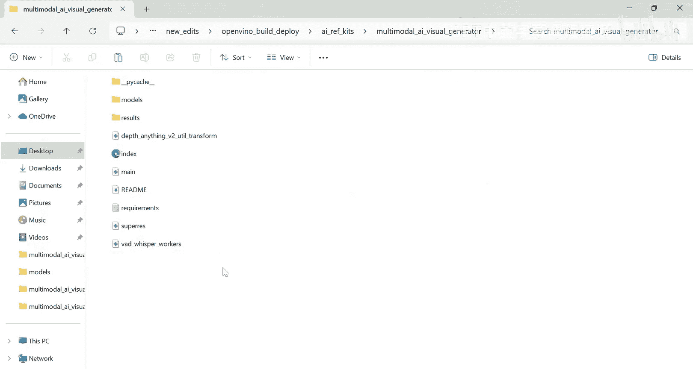

## 获取与设置项目

首先，我们需要获取项目代码并进行基础设置。

项目源码位于OpenVINO Build & Deploy仓库的`AI Reference Kits`目录下，具体是`multimodal AI visual generator`部分。你可以通过克隆仓库或下载ZIP文件的方式获取代码。

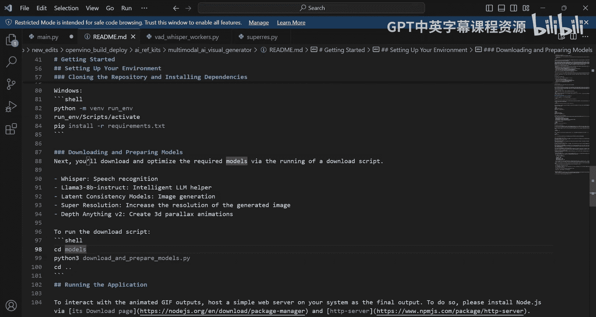

以下是获取代码后的关键步骤：

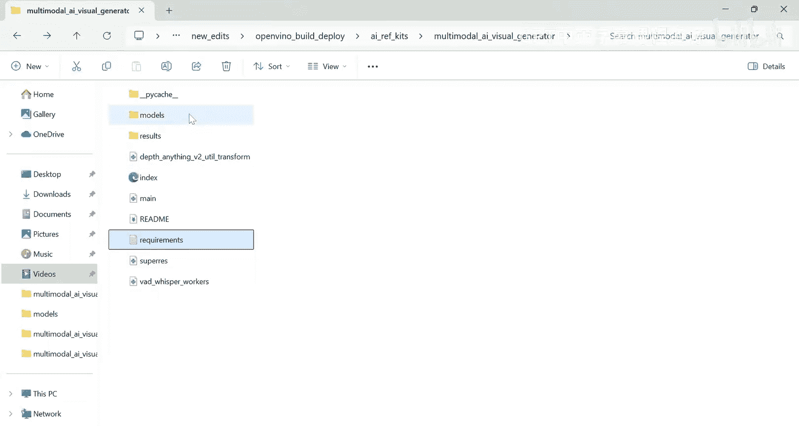

1.  **创建虚拟环境**：根据你的操作系统（Windows或Linux），使用`python -m venv`或`conda`创建一个虚拟环境。
2.  **安装依赖**：激活虚拟环境后，运行`pip install -r requirements.txt`来安装所有必要的Python库，例如`optimum-intel`, `numpy`, `transformers`, `diffusers`等。

这些步骤确保了你的开发环境拥有运行应用所需的所有工具和库。

---

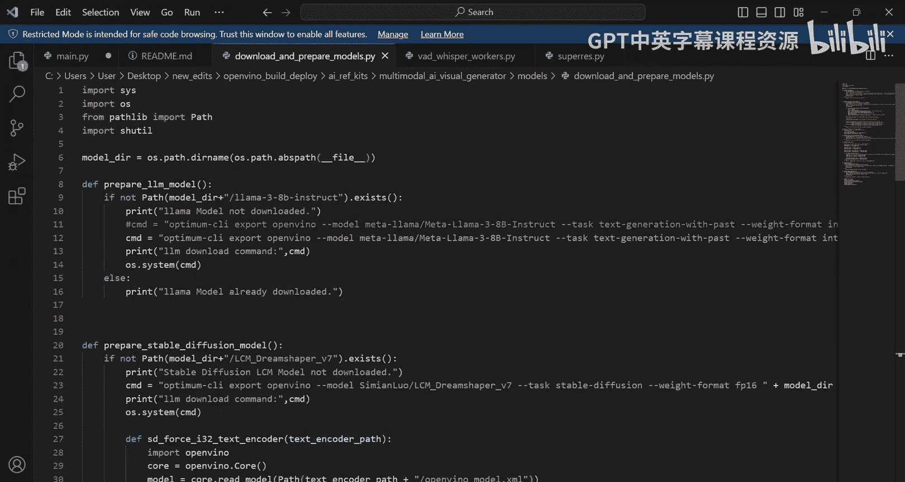

## 技术栈与模型简介

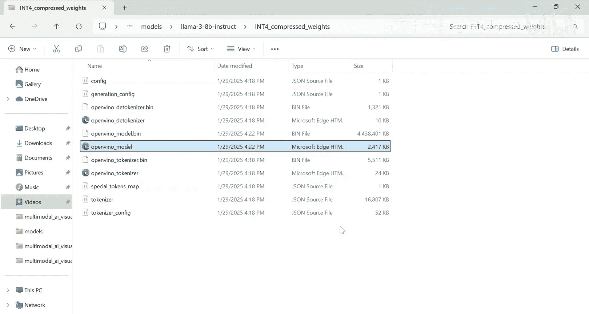

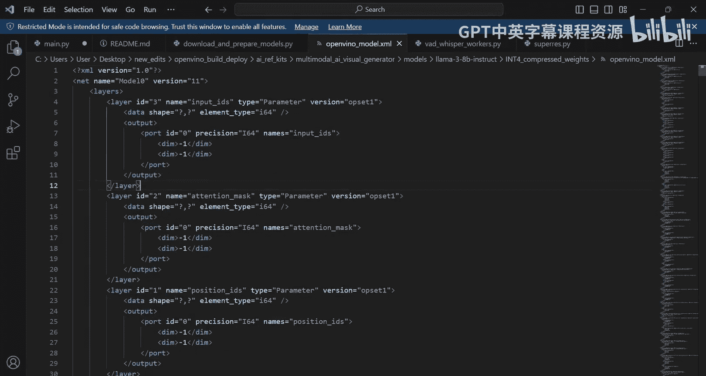

在深入代码之前，我们先了解应用背后的技术栈和核心模型。

整个应用管线涉及多个AI模型协同工作：
*   **语音识别**：使用 **Whisper** 模型将语音转换为文本。
*   **文本理解与增强**：使用 **Llama 3 8B Instruct** 这类大语言模型来分析和丰富转录后的文本描述。
*   **图像生成**：使用 **Latent Consistency Models (LCM)** 和 **Stable Diffusion**，根据文本提示生成图像。
*   **图像后处理**：使用 **Super-Resolution** 模型提升图像质量和沉浸感。
*   **深度图生成（可选）**：使用 **Depth Anything** 模型为图像添加深度效果（本教程不深入此部分）。

这些模型通过 **OpenVINO™ 工具套件** 进行优化和部署。OpenVINO可以将来自PyTorch、TensorFlow等框架的模型转换为中间表示格式，从而高效地在不同硬件设备上运行。我们还会使用 **OpenVINO GenAI** 库来运行生成式AI模型。

优化的核心在于**模型压缩技术**。例如，将LCM模型从FP32精度转换为FP16精度，可以**将模型体积减半**。对于Llama这样的大模型，我们使用**INT4量化**，能显著减少内存占用并提升推理速度。

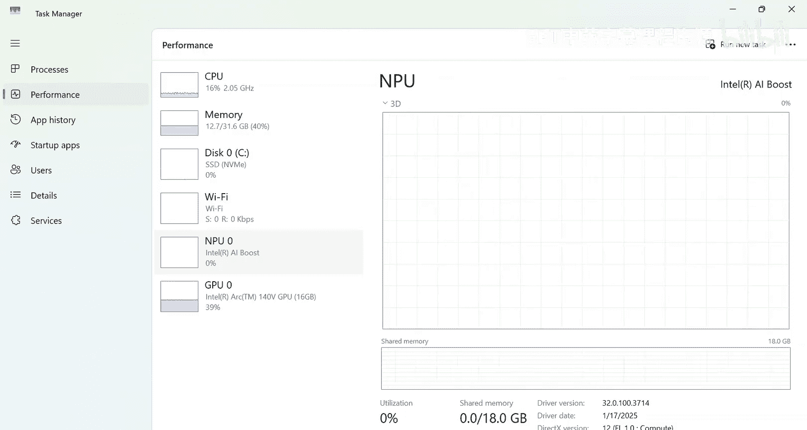

公式示例：`模型优化后大小 ≈ 原始大小 × (目标精度位数 / 原始精度位数)`

---

## 硬件配置建议

本应用设计为在AI PC上运行，并能灵活利用不同的计算单元。

一个典型的AI PC硬件配置可能包括：
*   **CPU**：处理轻量级任务或作为备用计算单元。
*   **集成GPU**：处理图像生成等计算密集型任务。
*   **神经处理单元**：高效运行特定的AI工作负载。

在代码中，我们可以指定每个模型运行在哪个设备上（如`CPU`、`GPU`、`NPU`），从而根据模型特点和硬件能力进行负载分配，实现最佳性能。即使你的设备没有NPU，也可以仅使用CPU和GPU来运行本应用。

---

## 代码结构解析

接下来，我们深入项目的核心代码文件，了解其工作原理。

### 主程序文件 (`main.py`)

这个文件是应用的入口，负责协调所有模型和用户界面。

**模型提示词与配置**：文件开头定义了用于引导大语言模型的**系统提示词**，确保生成的文本描述具有沉浸感（如游戏主题）、上下文相关性且视觉表现力强。

**核心函数**：
*   `run_sr()`: 负责运行**超分辨率模型**，对生成的图像进行升采样，使其更清晰、更逼真。
*   `generate_image()`: 调用图像生成引擎，根据文本提示词生成初始图像。例如，当输入“龙”这个词时，该函数会驱动模型绘制相应的图像。
*   **大语言模型处理流程**：这是应用的关键。语音被转录后，文本会先送入大语言模型进行“润色”。
    ```python
    # 示例流程（简化）
    transcribed_text = whisper_model(audio) # 语音转文本
    enriched_prompt = llm_model(transcribed_text) # LLM丰富描述
    generated_image = image_model(enriched_prompt) # 生成图像
    ```
    LLM能将简单的“一座城堡”扩展为“一座矗立在迷雾山脉之巅、被紫色魔法光辉笼罩的古老城堡”，从而为图像生成提供更丰富的素材。

**设备分配与模型加载**：在`main.py`的中后部，可以找到模型加载和设备分配的代码。这是**调整应用以适配你自身硬件**的关键位置。
```python
# 示例：指定模型运行设备
llm_device = “GPU”  # 将大语言模型放在GPU上运行
whisper_device = “CPU” # 将语音识别模型放在CPU上运行
image_gen_device = “GPU” # 将图像生成模型放在GPU上运行
```
你可以根据你的硬件情况（例如，是否有NPU）修改这些设备参数。

### 语音活动检测文件 (`vad_whisper_worker.py`)

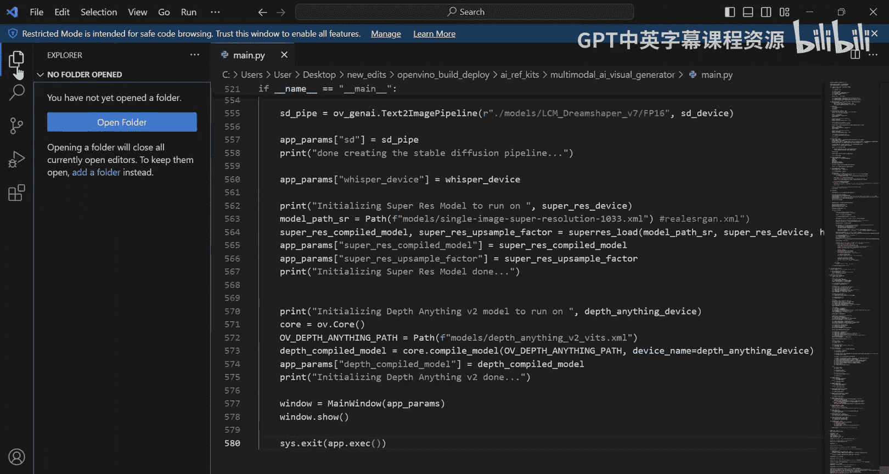

这个文件管理语音识别功能，并包含一项智能特性：**语音活动检测**。它能区分用户是否在说与场景相关的内容（如游戏描述），避免录入背景噪音或无关对话。

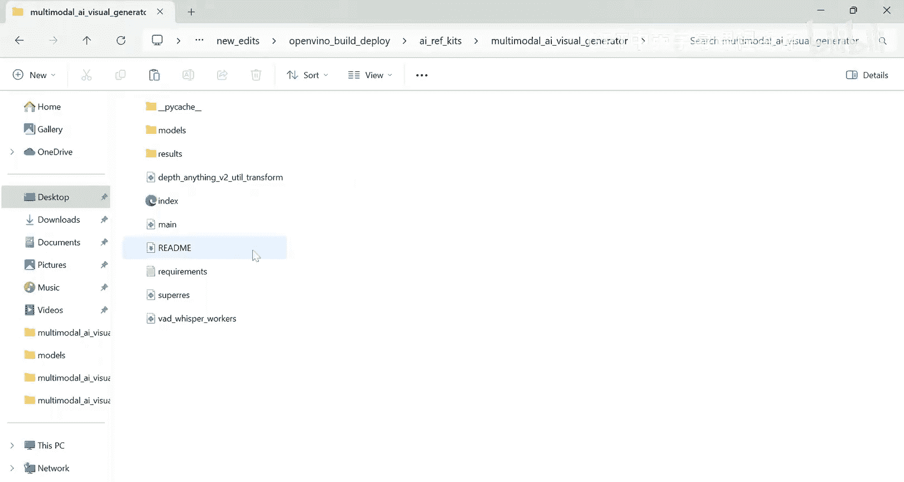

**支持多语言的关键修改**：默认应用可能针对英语优化。要支持中文，我们需要修改此文件中的两行关键代码：
1.  将语言参数从`language=”en”`改为`language=”zh”`（中文）。
2.  将任务参数从`task=”transcribe”`改为`task=”translate”`，这样Whisper模型就会将中文语音翻译成英文文本，供后续的LLM和图像生成模型使用。

### 其他支持文件
*   `super_resolution.py`: 专门实现超分辨率模型的加载和推理逻辑。
*   `depth_anything.py`: 实现深度图生成功能（本教程不展开）。

---

## 运行应用与效果演示

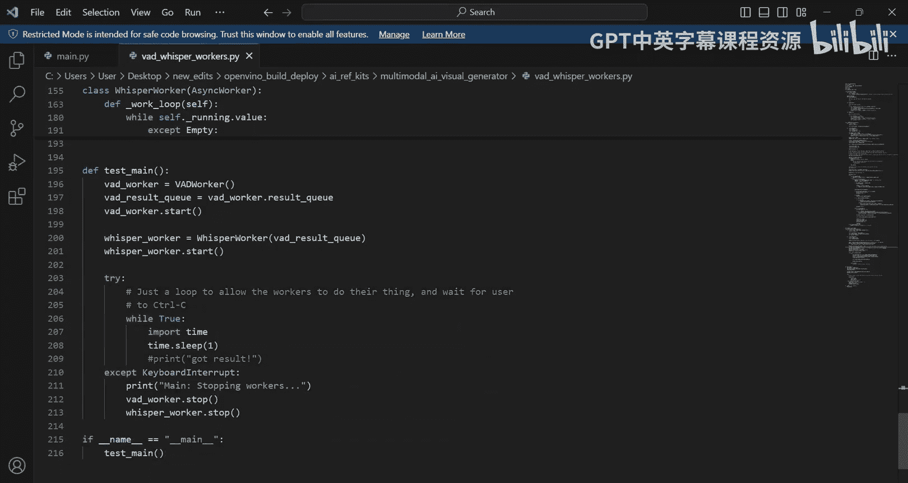

完成所有设置和代码了解后，现在可以运行应用了。

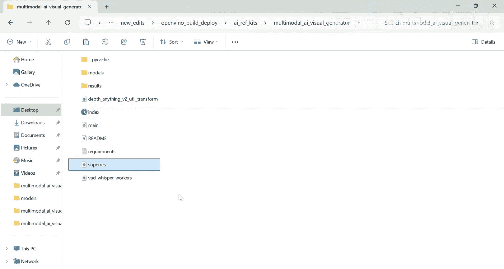

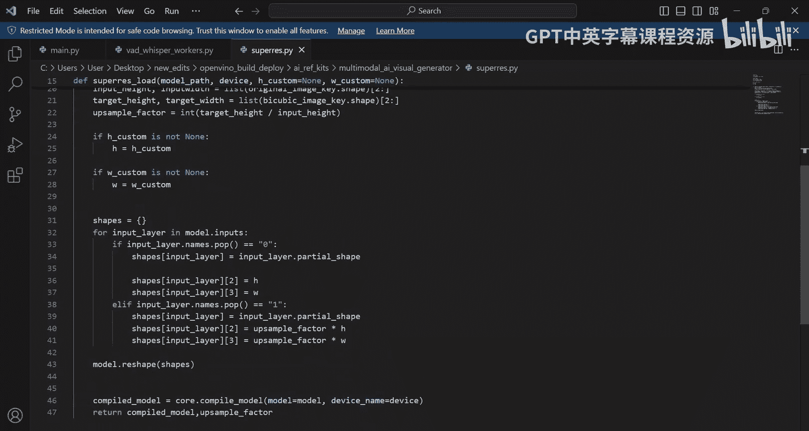

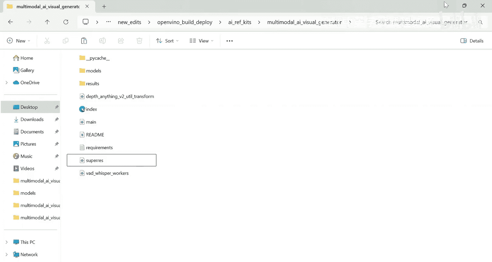

在激活的虚拟环境中，进入项目目录，运行以下命令启动应用：
```bash
python main.py
```
启动时，控制台会显示模型加载日志，例如“正在GPU上创建LLM管道”、“正在创建稳定扩散模型管道”等。

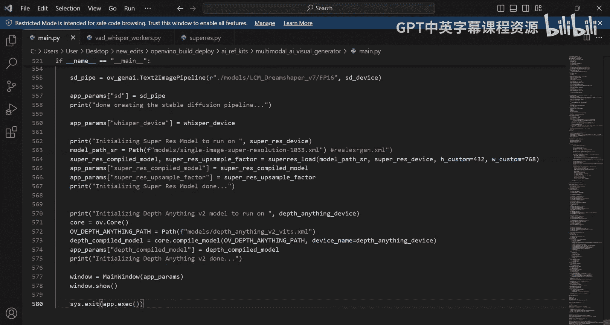

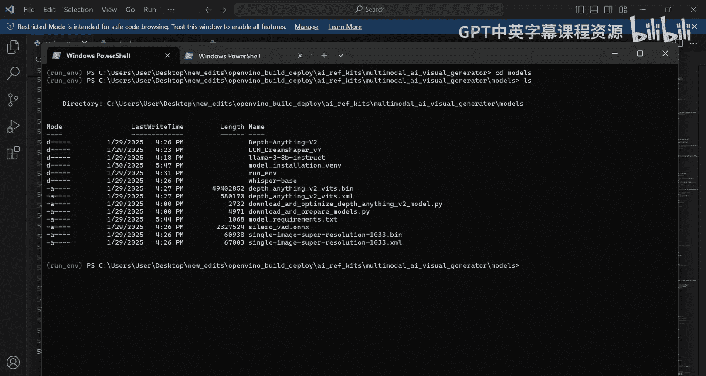

应用窗口打开后，点击“开始”按钮。系统会通过麦克风监听。你可以尝试：
1.  **说中文**：例如“一座紫色的城堡”。应用会将其转录并翻译成英文“a purple castle”，LLM将其丰富为更详细的描述，最终生成一幅紫色城堡的图像。
2.  **说英文**：例如“a sky filled with stars”。应用会直接处理并生成繁星满天的图像。

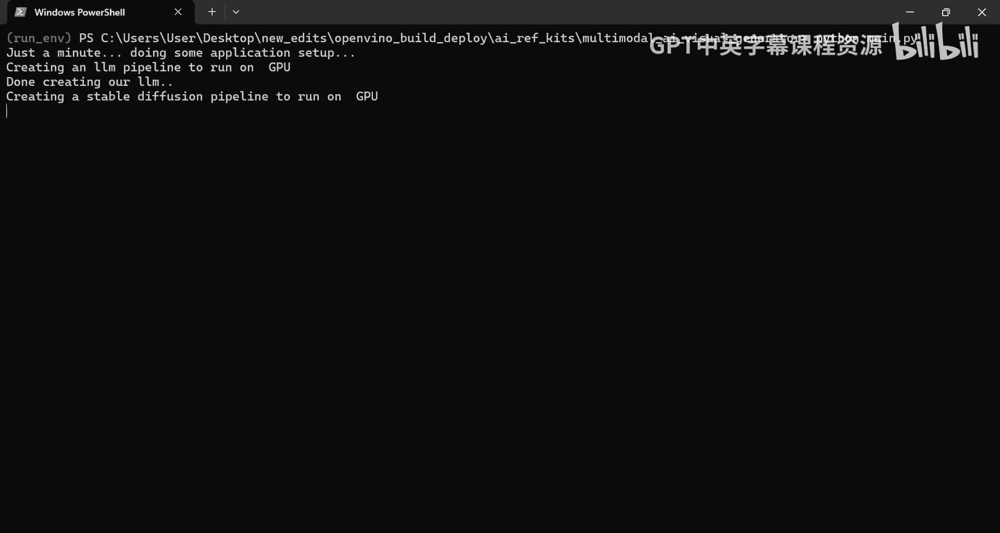

你将看到界面实时显示转录的文本、LLM生成的丰富提示词以及最终生成的图像。

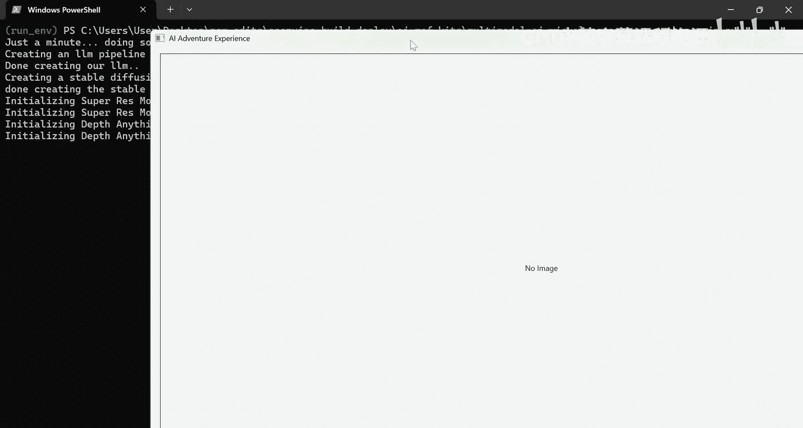

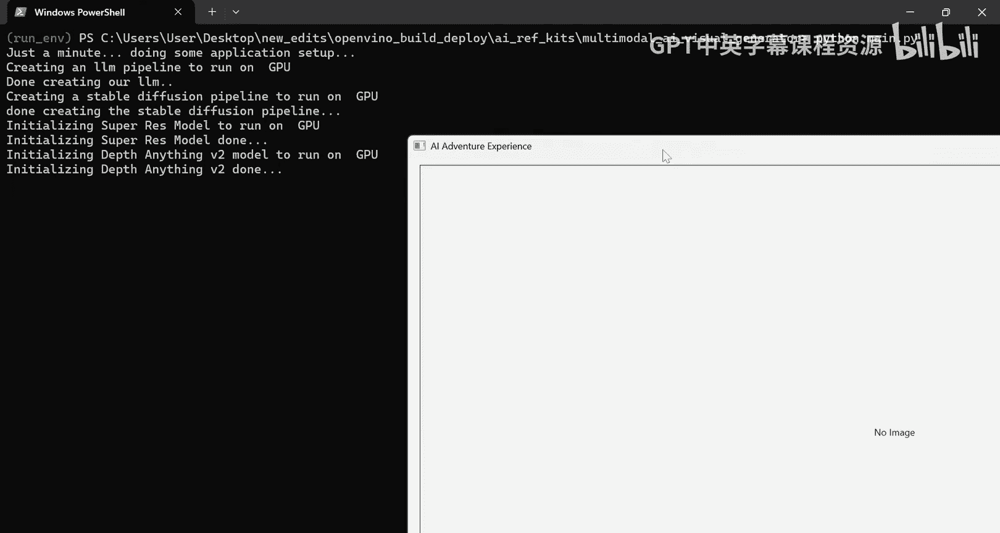

---

## 扩展练习与总结

本节课我们一起学习了如何搭建并理解一个多模态AI语言学习应用。为了进一步探索，你可以尝试以下扩展练习：

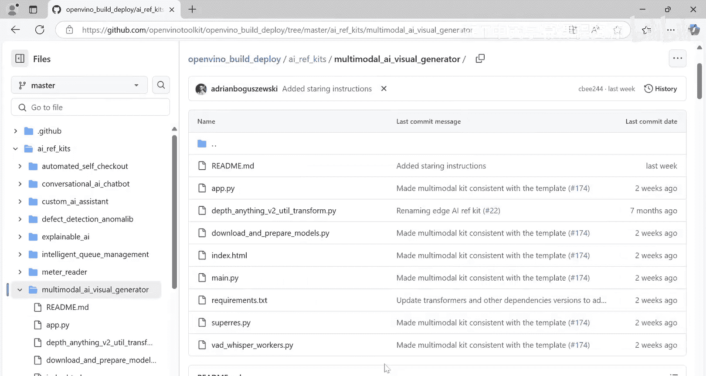

*   **硬件实验**：在代码中修改`main.py`里的设备分配，尝试将模型负载在CPU、GPU或NPU之间移动，观察性能变化。
*   **模型替换**：探索OpenVINO GenAI库支持的其他模型，例如尝试更新的LLM（如DeepSeek）或不同的图像生成模型。
*   **功能深化**：启用并研究`depth_anything.py`，为生成的图像添加3D深度效果。

总结来说，我们完成了从克隆项目、安装模型、解析代码到最终运行应用的完整流程。你构建了一个能够将语音实时转化为沉浸式视觉体验的本地AI应用，并掌握了调整其语言支持和硬件配置的方法。

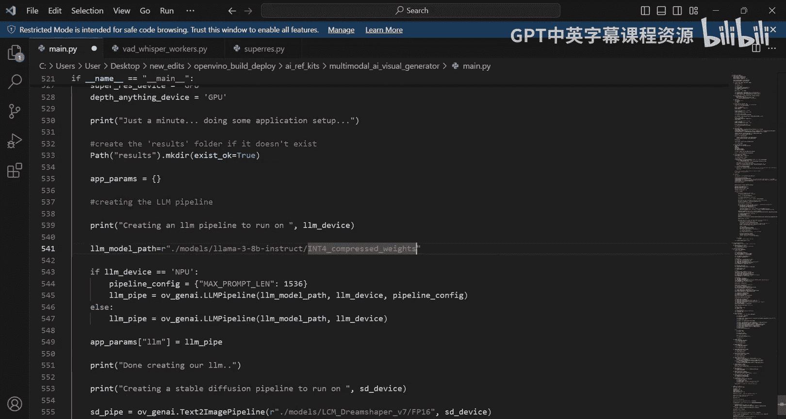

如果你有任何问题，欢迎到OpenVINO Build & Deploy仓库的讨论区提问。