# 65：Visual Novel New Game

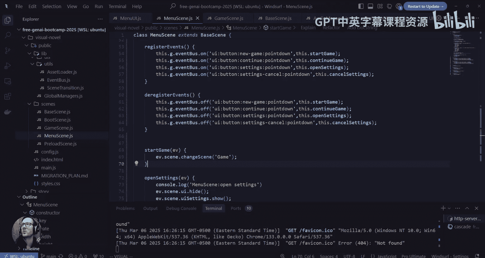

## 概述
在本节课中，我们将继续开发视觉小说游戏。我们将从显示游戏菜单和基础控制，过渡到实际渲染游戏内容。核心任务是加载并显示游戏场景中的角色、背景以及对话系统，并开始处理游戏数据的加载与初始化逻辑。

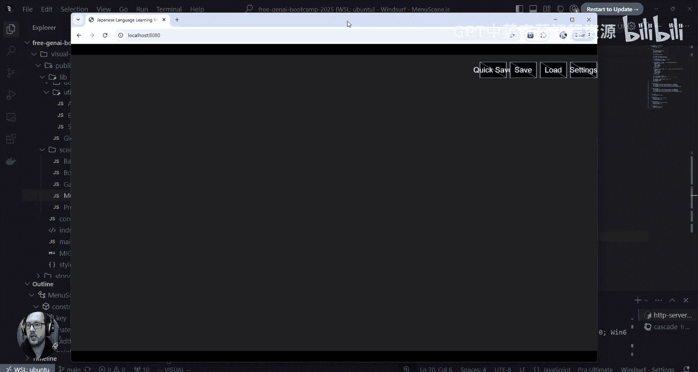

---

## 从菜单到游戏场景的过渡

上一节我们实现了游戏菜单的切换功能。本节中，我们来看看如何从菜单真正进入游戏场景，并开始渲染游戏内容。

目前，我们的游戏场景中只有绿色的占位框，我们需要让对话显示出来，并加载实际的图形资源。

在能够渲染任何内容之前，处理存档等功能意义不大。我们首先需要创建UI和背景图形。

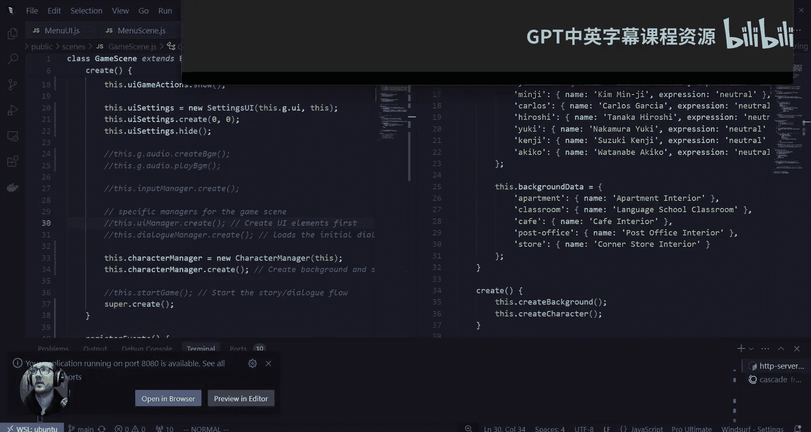

---

## 引入并初始化角色管理器

接下来，我们转到游戏场景。我们需要引入角色管理器。虽然它名为“角色管理器”，但它也管理背景和场景元素。

以下是引入并初始化角色管理器的步骤：
1.  在游戏场景中引入角色管理器。
2.  确保它被正确初始化。全局管理器负责管理跨系统的组件，但角色管理器略有不同，需要在场景内初始化。

我们通过 `this.characterManager` 来初始化它。

查看角色管理器的功能：
*   它包含场景的宽度和高度设置（通常我们希望全屏）。
*   它管理带有表情的角色。
*   它管理背景（例如室内场景）。
*   它提供了创建背景和角色的方法，并将它们添加到场景中。

初始代码将角色位置设为 `(0, 0)`，因为图像会完美适配屏幕。它最初会加载“Alex”角色和“公寓”背景，这并非我们最终想要的，但目前可以接受。

背景和角色的原点（origin）需要设置为 `(0, 0)` 以确保正确对齐。

完成这些设置后，我们刷新场景。

现在，第一个角色显示在屏幕上了。但角色图层覆盖了按钮，因此我们需要调整图层顺序，确保角色管理器先于UI元素渲染。

调整后，按钮显示在顶层，角色图像正常显示。

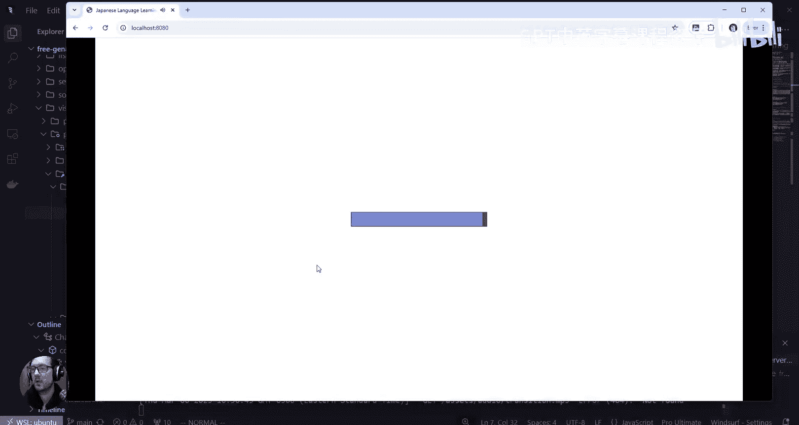

---

## 设置对话管理器

现在角色已经显示，我们需要驱动游戏进程，即显示对话界面。对话系统包括UI组件和一个管理器。

接下来设置对话管理器：
1.  在游戏场景中初始化对话管理器：`this.dialogueManager`。
2.  对话管理器需要加载场景数据，这应在UI创建之后调用。

对话管理器涉及以下设置和状态：
*   文本打字速度。
*   是否完成对话。
*   当前对话ID。
*   当前场景。

我们需要从全局设置中获取当前场景信息，而不是从场景的游戏设置中获取。回顾音频系统的实现，我们发现是通过全局管理器传递的。

因此，我们需要在对话管理器中访问全局管理器，以获取诸如当前场景等设置。

---

## 处理游戏数据：设置与存档

在深入对话逻辑之前，我们需要处理游戏数据的加载。这包括设置（如语言、打字速度）和存档数据。

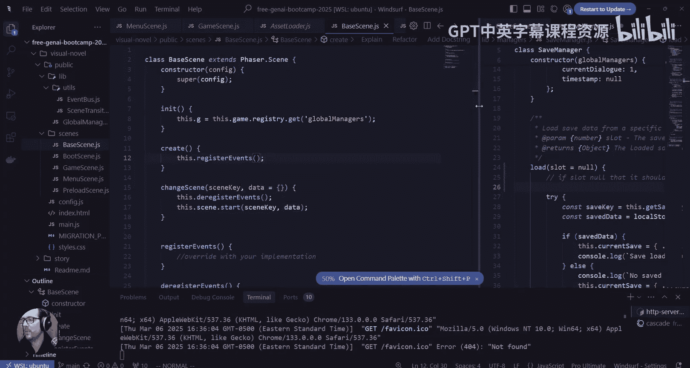

以下是需要处理的数据：
*   **设置**：包括语言、打字速度、自动推进、字体大小、打字机效果等。
*   **存档数据**：包含当前场景、章节、对话时间戳等。

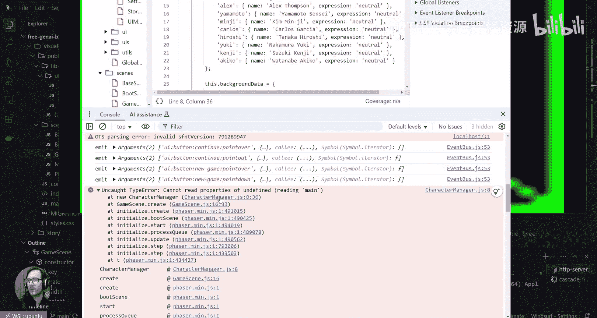

设置和存档数据是分开的。我们需要加载它们。存档数据对于恢复游戏进度至关重要。

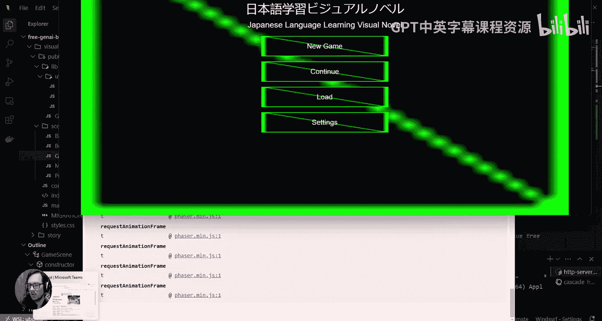

我们需要回到主菜单场景，完善“开始游戏”、“加载游戏”和“继续游戏”的功能。

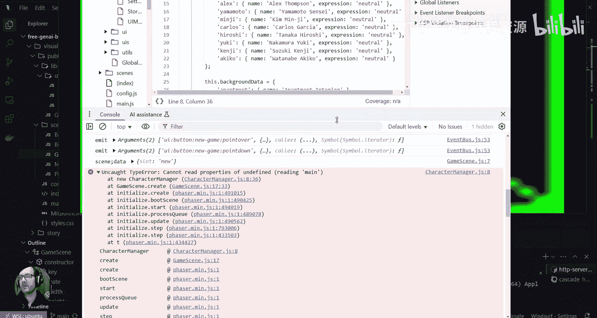

“继续游戏”相对简单，但“加载游戏”需要显示存档选择界面。目前，我们专注于“开始新游戏”的功能。

当开始新游戏时，我们需要使用存档管理器来创建初始数据。我们通过 `this.g.saves` 来访问存档管理器。

“开始新游戏”并不意味着立即保存游戏，通常是在游戏过程中手动保存。因此，开始游戏时，我们只需加载默认的存档数据。

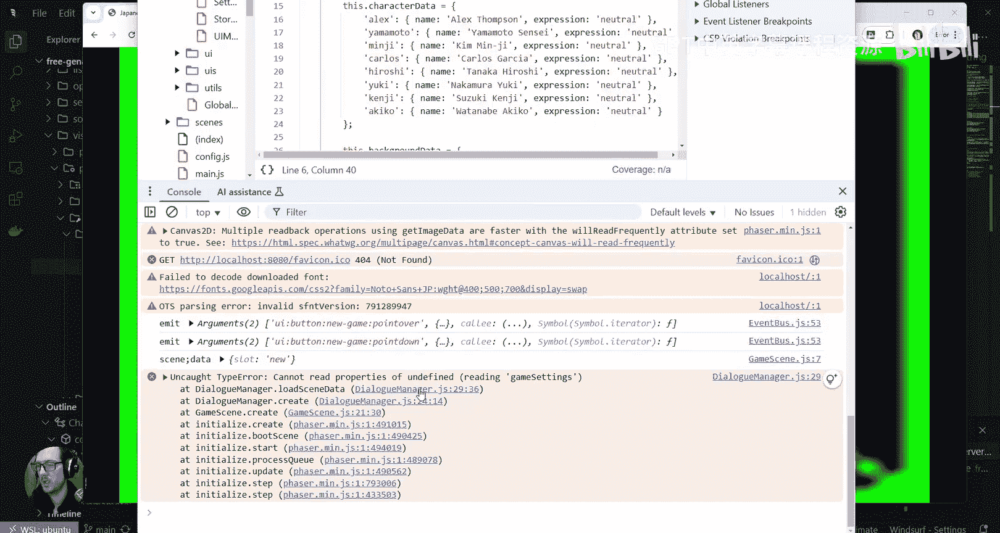

---

## 场景间通信与数据传递

开始游戏时，我们需要告诉游戏场景这是一个新游戏。这可以通过场景间通信实现。

我们可以在切换场景时传递一个载荷（payload）。例如，在 `changeScene` 函数中传递 `data` 对象。

在游戏场景的 `create` 方法中，我们可以检查传递过来的数据，以判断是开始新游戏还是加载旧存档。

我们通过 `console.log` 来验证数据是否成功传递。

测试发现，数据（`slot: ‘new’`）成功传递了，但遇到了角色管理器相关的错误。

---

## 重构：分离角色与背景管理

在解决错误之前，我们认为将角色管理和背景管理分离是更好的设计。因此，我们创建一个新的 `BackgroundManager` 类。

以下是重构步骤：
1.  创建 `BackgroundManager.js` 文件。
2.  将原 `CharacterManager` 中与背景相关的代码（如背景数据、创建背景的方法）移动到 `BackgroundManager` 中。
3.  在游戏场景中分别初始化 `CharacterManager` 和 `BackgroundManager`。

这样，每个管理器的职责更清晰，便于后续维护和扩展。

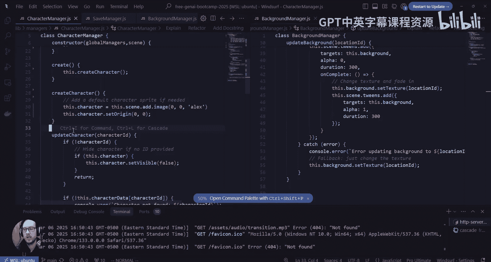

---

## 基于存档数据加载游戏内容

分离管理器后，我们需要根据存档数据来加载角色和背景。这意味着角色管理器需要知道当前应该显示哪个角色。

我们从存档数据中获取当前场景等信息。我们在 `SavesManager` 中添加 `get` 和 `set` 方法来方便地存取数据。

然而，当前角色信息并不直接存储在存档的顶层，而是与对话数据交织在一起。因此，角色管理器和背景管理器需要依赖对话管理器来获取当前应该显示的内容。

我们在游戏场景中，将初始化后的对话管理器实例传递给角色管理器和背景管理器。

---

## 完善对话管理器的数据加载

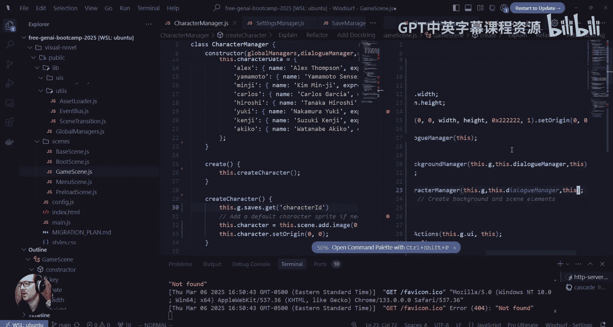

现在，我们聚焦于对话管理器。它的 `create` 函数需要加载场景数据。

对话管理器需要：
1.  从存档数据中获取当前对话ID和场景ID。
2.  根据ID从缓存中加载对应的对话数据。
3.  如果找不到存档，则从场景数据的起点开始。

我们检查了场景数据的结构，决定显式地设置一个 `start` 字段来标识对话起点，以增加灵活性。

同时，我们统一了数据字段的命名，使用 `dialogueId`、`dialogueChapter`、`dialogueScene` 来使含义更清晰。

---

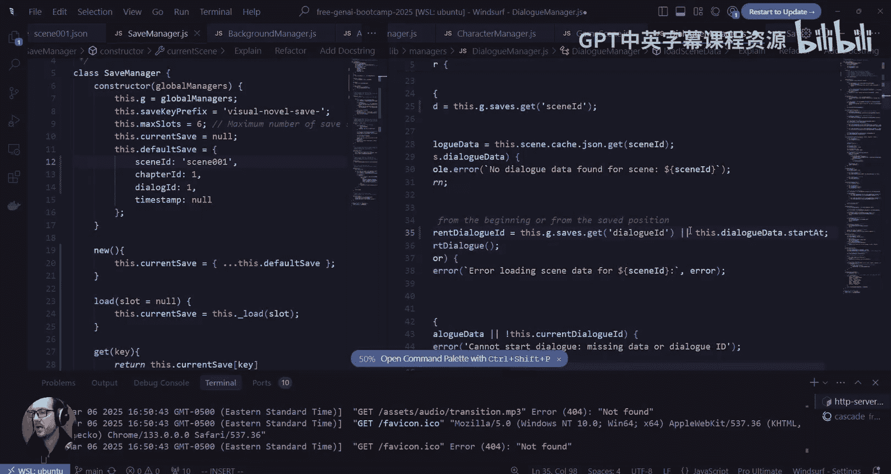

## 梳理故事流程：对话管理器与故事管理器

在实现过程中，我们遇到了职责划分的问题：对话管理器和故事管理器（StoryManager）分别负责什么？

回顾发现，故事管理器负责加载章节并定义章节之间的顺序（即故事流程），而对话管理器负责管理具体场景内的对话数据、状态和显示逻辑。

目前，对话管理器加载特定场景的对话数据，并根据当前对话ID开始对话。它还需要在游戏循环中更新角色、背景、说话者名字等。

我们需要理清这两个管理器如何协作，以正确驱动整个故事的进行。

---

## 总结
本节课中，我们一起学习了如何从游戏菜单过渡到实际游戏场景。我们引入了角色管理器和背景管理器（并进行了职责分离），设置了对话管理器的基础框架，并开始处理游戏存档数据的加载与初始化逻辑。我们遇到了图层顺序、场景间通信、数据传递以及管理器职责划分等挑战，并为下一步实现完整的对话驱动游戏流程打下了基础。