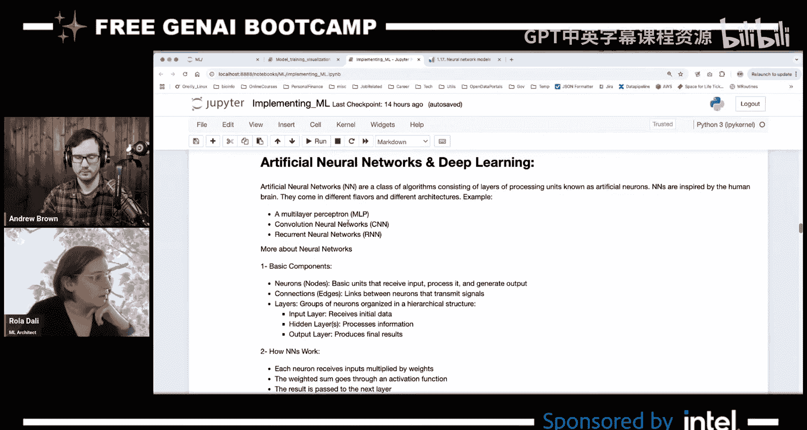
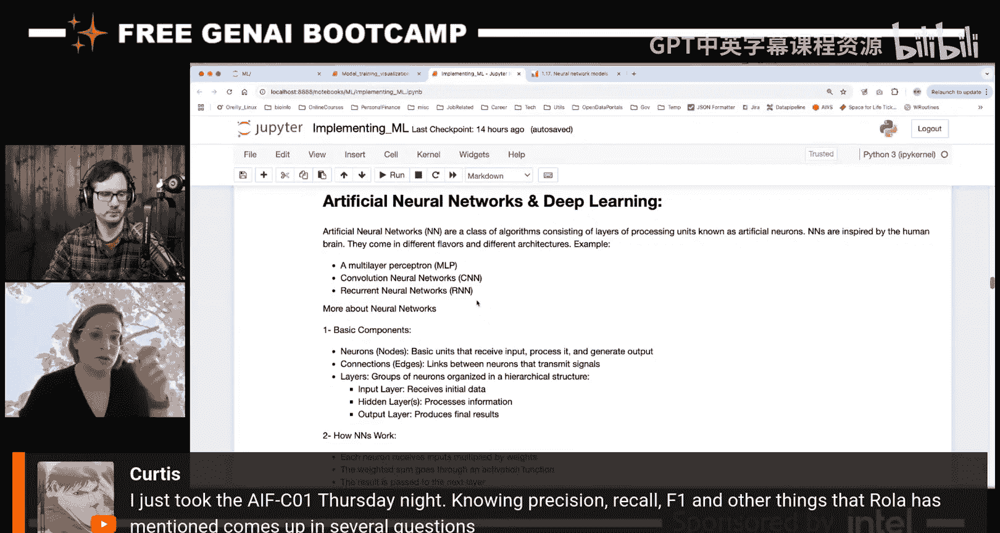
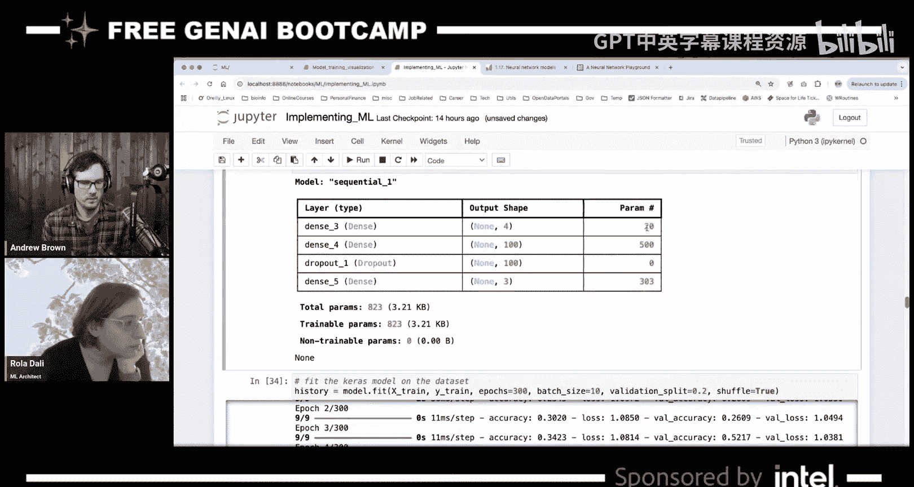
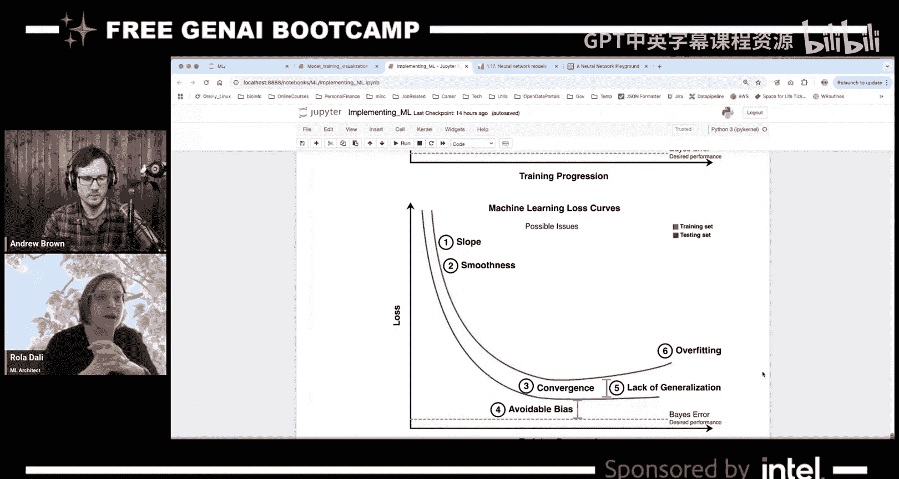
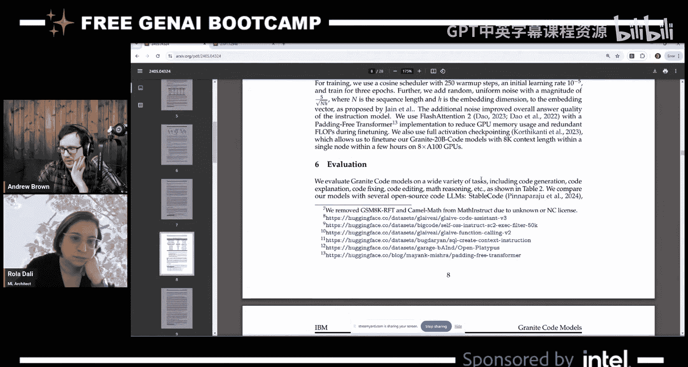

# 72：机器学习基础与神经网络入门


## 概述


在本节课中，我们将学习机器学习的基础知识，包括使用Scikit-learn和Keras库构建简单的分类模型。我们将通过一个经典的鸢尾花数据集分类问题，了解监督式学习的基本流程，并动手构建一个简单的人工神经网络。


---


## 机器学习简介


机器学习是人工智能的一个分支，它使计算机能够从数据中学习并做出预测或决策，而无需进行明确的编程。


机器学习主要分为四大类：
*   **监督式学习**：数据带有标签，模型学习输入与输出之间的映射关系。
*   **无监督式学习**：数据没有标签，模型尝试发现数据中的内在模式或结构。
*   **强化学习**：智能体通过与环境互动，根据奖励信号学习完成多步骤任务的最佳策略。
*   **生成式AI**：创建或生成新的内容，如图像、文本或代码。

本节课我们将重点介绍监督式学习。

---

## 使用Scikit-learn构建分类模型

Scikit-learn是一个功能强大的Python机器学习库，它提供了数据预处理、模型选择、训练和评估等一系列工具，尤其擅长处理监督式学习和无监督式学习任务。

以下是使用Scikit-learn解决一个分类问题的基本步骤。

### 1. 加载与理解数据

我们使用经典的鸢尾花数据集。该数据集包含150个样本，每个样本有4个特征（花萼长度、花萼宽度、花瓣长度、花瓣宽度）和一个标签（鸢尾花的种类，编码为0, 1, 2）。

```python
from sklearn.datasets import load_iris
iris = load_iris()
X = iris.data  # 特征
y = iris.target # 标签
```

### 2. 分割数据集

为了评估模型的泛化能力，我们需要将数据分为训练集和测试集。训练集用于训练模型，测试集用于评估模型在未见过的数据上的表现。

```python
from sklearn.model_selection import train_test_split
X_train, X_test, y_train, y_test = train_test_split(X, y, test_size=0.25, random_state=42)
```

### 3. 选择并训练模型

我们选择一个逻辑回归模型来解决这个分类问题。逻辑回归是一种用于分类的线性模型，它通过一个S形函数将线性回归的输出映射到概率。





```python
from sklearn.linear_model import LogisticRegression
model = LogisticRegression(max_iter=200)
model.fit(X_train, y_train)
```

### 4. 进行预测与评估

使用训练好的模型对测试集进行预测，并评估其性能。我们使用准确度和混淆矩阵作为评估指标。


```python
from sklearn.metrics import accuracy_score, confusion_matrix
y_pred = model.predict(X_test)
accuracy = accuracy_score(y_test, y_pred)
conf_matrix = confusion_matrix(y_test, y_pred)
print(f"模型准确度: {accuracy}")
print("混淆矩阵:")
print(conf_matrix)
```




**混淆矩阵**是一个重要的可视化工具，它显示了模型预测结果与真实标签的对比。理想情况下，所有样本都应落在矩阵的对角线上（预测正确）。非对角线上的值代表预测错误。


---

## 使用Keras构建神经网络

上一节我们介绍了使用Scikit-learn的传统机器学习流程。本节中，我们将使用Keras库构建一个简单的人工神经网络来解决同一个分类问题。Keras是一个高级神经网络API，可以运行在TensorFlow、PyTorch或JAX等后端之上，简化了深度学习的实现过程。

### 1. 数据预处理

神经网络对输入数据的尺度非常敏感，因此我们通常需要对特征进行归一化处理。同时，对于分类问题，我们需要将整数标签转换为独热编码格式。

```python
import numpy as np
from tensorflow.keras.utils import to_categorical
from sklearn.model_selection import train_test_split

# 特征归一化
X_normalized = X / X.max(axis=0)
# 标签转换为独热编码
y_categorical = to_categorical(y)
# 分割数据集
X_train, X_test, y_train, y_test = train_test_split(X_normalized, y_categorical, test_size=0.25, random_state=42)
```



### 2. 构建神经网络模型


我们使用Keras的`Sequential` API来构建一个顺序模型，即层与层之间线性堆叠。我们添加一个全连接层（Dense），一个Dropout层用于防止过拟合，以及最终的输出层。



```python
from tensorflow.keras.models import Sequential
from tensorflow.keras.layers import Dense, Dropout


model = Sequential([
    Dense(100, activation='relu', input_shape=(4,)), # 输入层（4个特征）和第一个隐藏层（100个神经元）
    Dropout(0.2), # 随机丢弃20%的神经元连接
    Dense(3, activation='softmax') # 输出层（3个类别）
])
model.compile(optimizer='adam', loss='categorical_crossentropy', metrics=['accuracy'])
model.summary()
```

### 3. 训练模型

使用`fit`方法训练模型。我们将观察训练过程中的损失和准确度变化。


```python
history = model.fit(X_train, y_train, epochs=300, validation_split=0.2, verbose=0)
```

### 4. 分析学习曲线

训练完成后，绘制损失曲线和准确度曲线对于诊断模型至关重要。

```python
import matplotlib.pyplot as plt

# 绘制损失曲线
plt.plot(history.history['loss'], label='训练损失')
plt.plot(history.history['val_loss'], label='验证损失')
plt.title('模型损失曲线')
plt.ylabel('损失')
plt.xlabel('训练轮次')
plt.legend()
plt.show()
```

在分析学习曲线时，我们关注以下几点：
*   **斜率**：曲线下降表明模型正在学习。
*   **平滑度**：曲线平滑通常意味着学习过程稳定。
*   **收敛**：曲线趋于平缓表明学习可能已完成。
*   **泛化差距**：训练损失和验证损失之间的差距。差距小说明模型泛化能力强；差距大可能意味着过拟合。
*   **过拟合**：如果验证损失在训练后期开始上升，而训练损失持续下降，则表明模型正在记忆训练数据，即过拟合。

---

## 总结


本节课中我们一起学习了机器学习的基础知识。我们首先使用Scikit-learn库实践了监督式学习的标准流程：加载数据、分割数据集、选择模型、训练和评估。接着，我们使用Keras构建并训练了一个简单的人工神经网络，了解了神经网络的基本组件（如层、神经元、激活函数）以及如何通过分析学习曲线来诊断模型。这些基础概念和动手经验是进一步探索更复杂模型和生成式AI的重要基石。