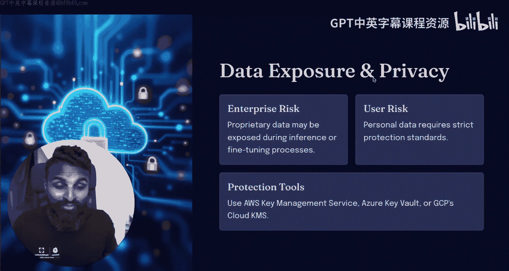
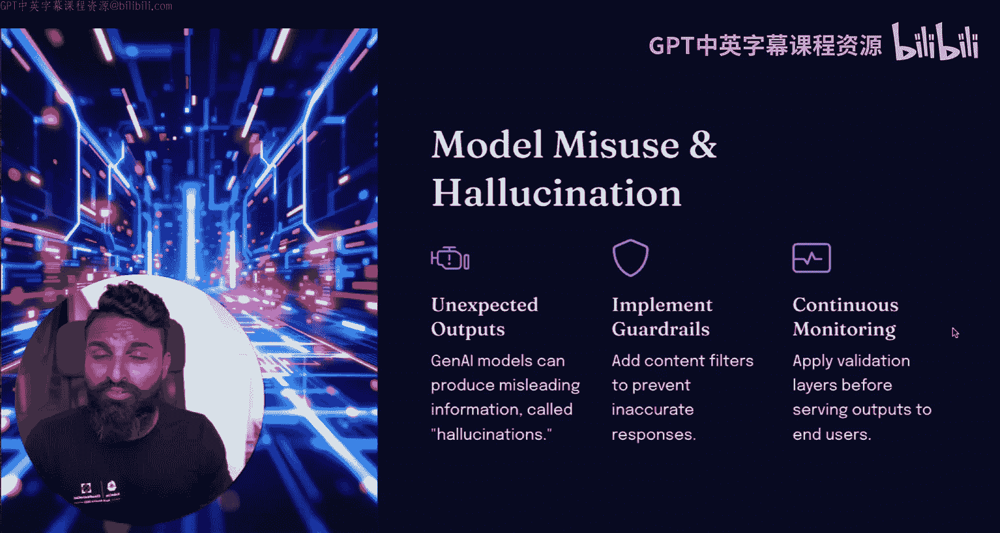
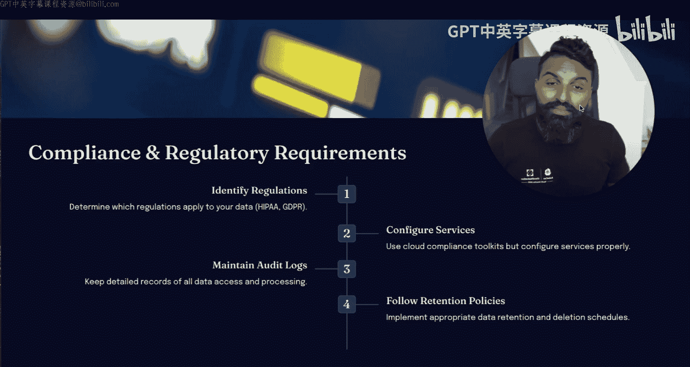
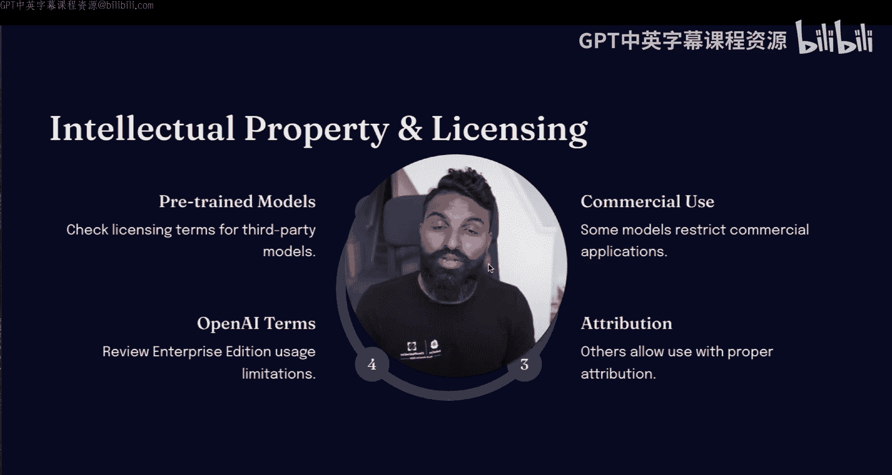
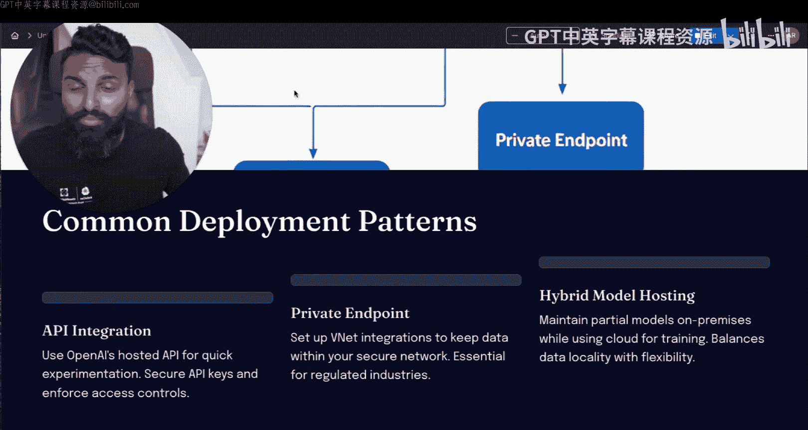

# 74：主要AI风险与常见部署模式 🛡️

在本节课中，我们将探讨在公有云上部署生成式AI应用时面临的主要风险以及常见的部署模式。理解这些内容对于保障应用安全和组织数据至关重要。

## 概述

生成式AI应用在带来巨大潜力的同时，也伴随着一系列风险。本节课程将首先分析数据暴露、模型误用、合规性及法律等主要风险，然后介绍常见的API集成与私有端点等部署模式，最后从技术层面探讨身份管理、加密和网络安全三大支柱。

## 主要AI风险

以下是企业在部署生成式AI时需重点关注的主要风险领域。

### 数据暴露与隐私风险

数据是驱动AI的燃料，因此数据暴露是最大的风险。无论您是企业还是组织内的个人用户，都需要警惕数据泄露。虽然存在可部署的保护工具，但像DeepSeek这样的LLM使得隐私问题变得更加重要。特别是如果您所在的组织不应与特定国家（例如DeepSeek背后的中国）共享数据时。您必须留意所使用LLM的隐私政策，无论是免费版、开源版还是付费版，都需要明确其隐私条款以及如何保护输入其中的数据。

**核心建议**：将所有敏感数据隔离，并尽可能保持LLM的“低权限”状态。这意味着只发送指令并接收指令反馈，但不共享数据。

### 模型误用风险

由于您可能正在使用ChatGPT、Claude或互联网上的其他模型，模型误用可能相当普遍。如果您使用从Hugging Face等平台下载的开源版本，或为了安全保护而使用本地版本，这可能会增加幻觉等问题的风险。如果您使用的不是经过训练以减少幻觉的流行模型（如ChatGPT或Claude），而是使用未基于最新模型训练的版本，那么产生意外输出的风险可能导致公司做出错误决策。

**应对措施**：可以实施防护栏，通过持续监控模型的任何变化，并关注在线公告中关于您所用模型可能存在的任何漏洞或安全缺陷，来防止模型被误用。

### 安全、合规与监管标准风险

这对于大型组织，尤其是处理私人数据（如PII或个人可识别信息）的组织至关重要。这些信息可能包括护照、驾照、家庭住址等，一旦泄露，可能导致严重的合规与隐私违规。幸运的是，大多数人都遵循合规标准。在处理LLM及其可能涉及的数据时，理解适用的法规（如HIPAA、GDPR或ISO标准）是您必须完成的第一步。

在明确合规要求后，您可以开始配置用于构建LLM的服务。您很可能使用的是亚马逊、Azure或谷歌的AI云服务。您可以考虑加入一些防护栏和云合规性检查，以确保所使用的服务是合规的，并且为LLM模型存储或使用的数据处于正确的位置。

此外，您还需要在整个系统中维护审计日志，这用于在出现问题时识别是谁做的以及他们是如何操作的。某些监管标准可能要求您保留一些信息或数据，无论是LLM系统的输出，还是简单的输入数据记录及输入输出后的变更情况。您需要根据任何监管标准来落实这些要求。

### 法律与知识产权风险

许多人讨论的另一个风险是法律风险，即知识产权和许可风险。您可能已经看到许多针对LLM模型使用受版权保护材料进行训练的诉讼。如果模型在预训练时使用了受版权保护的数据，或者使用了本不应用于商业用途的数据，而现在却用于商业目的，则可能构成许可违约。如果您不遵守所使用的LLM提供商的条款，同样可能构成违约。

## 常见部署模式

在理解了上述风险后，我们来看看常见的部署模式。

### API集成模式

一种常见的模式是API集成。在这种模式下，您可以将组织内长期使用的工具（如Gmail、Slack等）通过其API能力与LLM提供商连接。您向LLM提供者发送API请求作为输入，并获取输出反馈。这被称为API集成。

### 私有端点与混合模式

如果您在自己的应用中使用AI，并希望使其具备AI功能，您可能会在组织网络内部使用私有端点。这个端点可能与外部端点通信，或者您可能在本地数据中心或云环境中托管一个私有的、本地部署的LLM提供商，以确保隐私和合规性。显然，也存在混合模式。目前，非常常见的模式是使用API集成和私有端点来构建具备AI功能的应用程序。

## 技术风险支柱

在部署时，需要警惕三个技术风险。

1.  **身份与访问管理（IAM）**
    需要明确谁有权访问您提供给LLM的数据并进行修改，以及在您的云提供商中，谁有责任更改模型、AI应用或用于AI的基础设施。

2.  **加密**
    加密是数据安全的重要组成部分。谁拥有密钥的访问权是一个在保护AI应用安全时至关重要的问题。

3.  **网络安全**
    您拥有的AI应用将托管在您的数据中心或云环境中。因此，网络配置必须确保没有外部方可以访问它，并且您需要持续监控任何威胁，定期进行渗透测试，并确保没有可用的公共访问途径。

**总结**：从技术风险角度来看，身份管理、加密和网络安全是您必须关注的三大支柱。

## 总结

本节课我们一起学习了生成式AI应用部署中的主要风险，包括数据隐私、模型误用、合规法律问题，并探讨了API集成和私有端点等常见部署模式。最后，我们从技术层面强调了身份管理、加密和网络安全三大风险支柱的重要性。希望这些知识能帮助您构建更安全的AI应用。