# 78：本地运行OmniGen的失败尝试 🚧

在本节课中，我们将跟随Andrew一起尝试在本地运行OmniGen模型，以实现对游戏角色图像的动态编辑。我们将学习如何设置环境、克隆项目、安装依赖，并最终尝试运行模型。虽然本次尝试因GPU内存不足而失败，但整个过程为我们提供了宝贵的实践经验。

大家好，我是Andrew，我们继续回到日语学习视觉小说游戏的开发中。

说实话，我在一天之内就做出了显著的改进。你可以去查看提交记录，但我不会展示所有代码。虽然记录整个过程会很有趣，但那可能会增加大约8个小时的工作量。我确实会坐下来，然后高效地编写代码。重点是，项目已经有了很多改进。

现在，当我点击进入这里，你会看到一个很酷的细菌开场动画。我在这里做了不少工作，但没有什么特别针对性的内容。再次播放时，当你点击播放按钮然后停止，它会执行相应操作。所以重点是，音频已经集成到这里了。我添加了那个漂亮的开场着色器，并优化了一些系统，使得编码和操作更加容易。这只是对这个应用程序进行的大量整理工作。

但我意识到，我们可以用这些图像做一些非常有趣的事情。之前我只打算在这里使用单张静态图像。然后我想到，对了，还有OmniGen。我听说过OmniGen，也稍微用过一点，但从未在本地运行过。我非常希望能在本地运行它，这样我们就不必设置ComfyUI，而是可以直接运行单个模型并输入内容，让它为我们生成输出。我想看看我们是否能成功运行它。我也希望探索其他一些选项。

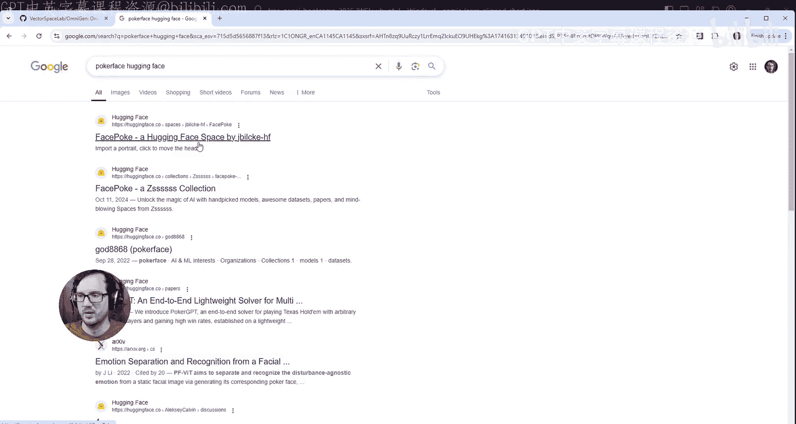

所以，我先把这个放到一边。

## 探索其他图像处理工具 🛠️

市面上还有另一个工具叫PokerFace。即使我们不使用OmniGen，也可以试试Hugging Face上的PokerFace。我来展示一下这个东西。

这个工具的功能，我们上传一张图片后，你立刻就能看到它的威力。我们就用我自己来举个例子吧。这是我之前制作缩略图时拍的照片，这显然是我。现在我的脸看起来有点奇怪。但如果你看这里，它把我的脸模糊了一点。实际上我可以点击这里，看，我可以移动我的头部。现在，它对我的脸做了一些有点奇怪的处理，因为这显然不完全是我。

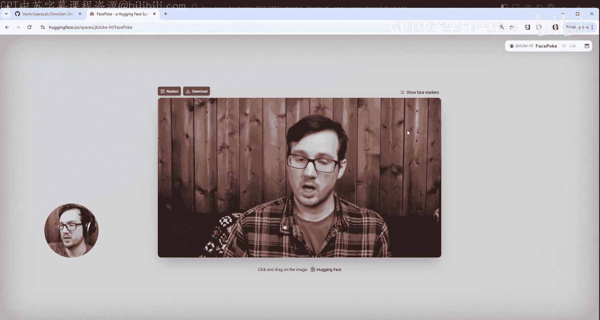

我们可以在这里进行调整，我想我们可以改变。后面的标记点，比如我们可以把嘴巴张得更大一点。操作有点棘手。我只是点击并移动。好了，我在这方面不是很擅长。你看这里，操作点击的方式不是很明确。但重点是，你显然可以做一些事情。哦，那个效果挺酷的。我到这里了。

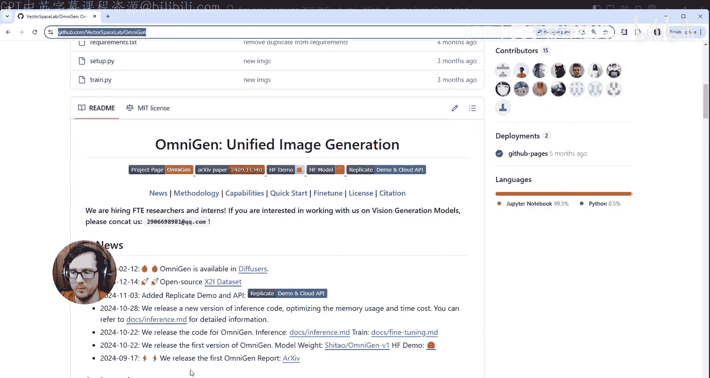

所以，我们肯定有办法移动嘴巴。这将是我们让角色活起来并呈现不同状态的一种方式。但这些并不是表情。这有点意思，我喜欢这个功能。

## 尝试本地运行OmniGen模型 💻

但我也想尝试本地运行这个模型。我从未在本地运行过它。使用这些模型的关键在于，它是在什么数据上训练的？这始终是个问题。但我要继续，克隆这个仓库，看看能否在本地让它运行起来。

我没有把它克隆到特定的项目里，也没有克隆到“Free GenAI Bootcamp”这里。我们只是把它克隆到外部目录。我们回到这里，执行 `git clone` 命令。我们试试看能否让它运行起来，因为我认为利用它会非常令人兴奋。现在有一些服务提供这个模型，但需要付费。因为我拥有GPU，所以我想尝试利用它们。既然我能在ComfyUI中生成图像，为什么不能利用它呢？当然，使用ComfyUI你会有更多控制权，那是一个允许你下载和使用模型的工作流工具，能让你对处理流程有更多控制。而这个模型声称，你只需要给它一张图片、几张图片和文本，它就应该能工作。

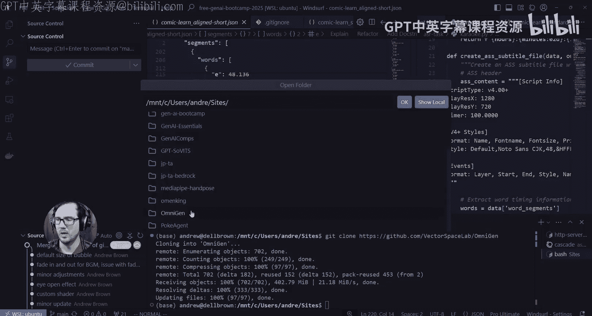

现在我已经下载好了，我将在VS Code中打开它。我们回到上一级目录，然后进入“omnigen”文件夹。好的，我们给它一点时间。

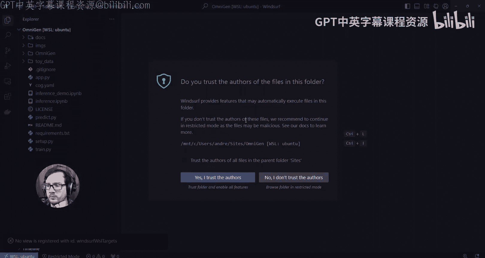

我信任这个项目。这里面应该有运行的方法。我们这里有这个文件。然后我们还有演示文件。我不确定为什么这个文件这么大，但我们还是打开它。上面写着：如果遇到内存不足或时间成本问题，可以使用 `offload_model=True`。好的，这里有一个演示。它在做什么？它在改变饮料，改变杯子。也许我应该先尝试运行这个，看看能否使用它。我应该为这个项目创建一个独立的环境，因为如果不使用独立环境，我们可能会遇到问题，我需要去创建一个。

我要去我的GitHub仓库，因为我记不清具体的指令了。让我们看看README文件。它有没有说明如何创建环境？没有，它不会提供那么基础的信息。

我要去我的“GenAI Essentials”项目。回到“ExamPro Code”目录下的“GenAI Essentials”。在这里，我们有如何设置本地开发环境的说明。我们进入这里，然后进入“conda”目录，在这里找到“setup.md”文件。我想要的是类似这样的内容。现在，我要选择一个版本，我一直用Python 3.11，这次我想用稍微新一点的，就用3.11吧。在这里，我想复制这个命令。这是为OmniGen准备的。

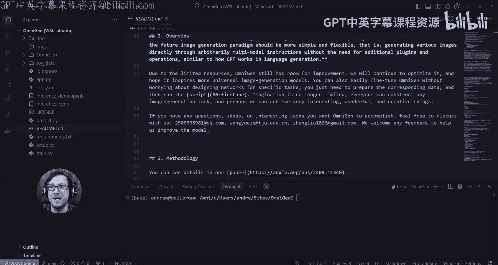

好的，我们继续。我输入了命令，但可能没有安装那个叫“ipykernel”的东西。不过没关系，我们马上修复它。我已经创建了环境，现在激活它。我们需要安装ipykernel。我总是拼错。我们就用这种方式来安装。

这将会使用conda-forge来获取并安装。我们给它一点时间。它要求确认，我们输入“yes”。现在好了，我们回到VS Code这里。我回到演示文件，选择“无论如何打开”，我不在乎它文件很大。然后我们选择内核，选择Python环境。我在找“omnigen”，找到了。

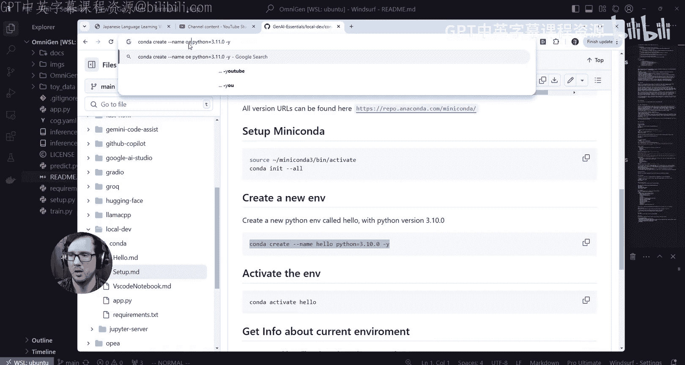

上面写着：如果遇到内存不足、时间或成本问题，可以使用 `offload_model=True`。唯一的问题是，我的GPU正在被这个视频录制共享。我几乎想停止录制视频，但我们看看会发生什么。我们继续运行这个单元格。

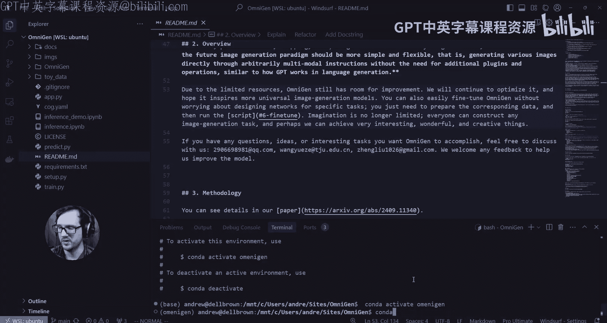

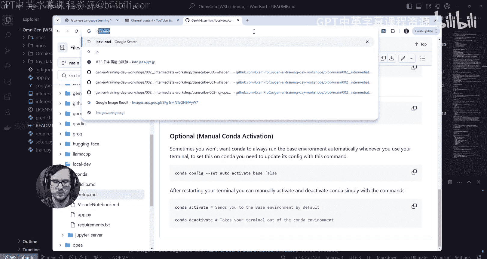

我想看看会发生什么。我要看看如果我暂停视频，我的GPU使用率是否会下降。我马上回来，我可以直接点击暂停。

确实，视频编码的负载下降了。这里的GPU使用率也下来了一点，但不足以解决问题。我们回到这里看看。我们看到它正在运行第一行代码，但已经出错了。问题是什么？导入torch失败，没有torch模块。如果他们能提供完整的运行说明就好了。

这里有“setup.py”文件。为什么它没起作用？好吧，我们看看README文件，也许“快速开始”部分有说明。执行 `pip install -e .`。好的，我们执行这个命令。这将会安装“-e”所代表的当前本地环境。看起来它说也可以创建一个新环境，这正是我做的。哦，它本可以自动完成这一步。它使用的是Python 3.10，而我用的是3.11。希望这没问题。

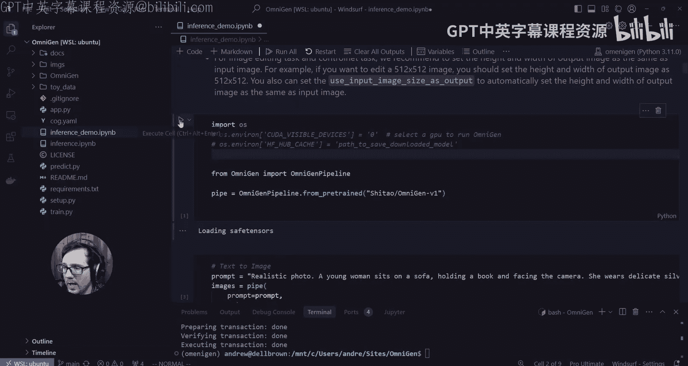

安装指定CUDA版本的PyTorch。要是我在创建环境前知道这个就好了，所以我们执行这个命令。我们可能需要安装特定版本的PyTorch和CUDA。我们看看会发生什么，也许这会失败，我们就删除这个环境。但如果有必要，这也不是什么大问题。我们等待安装完成。

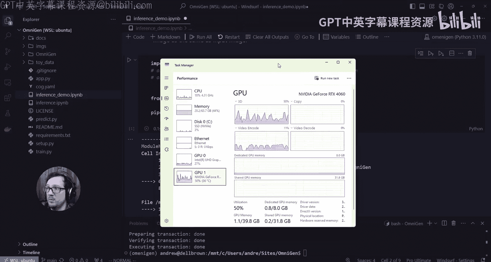

好的，它说那些依赖已经安装好了。我们可能还是需要使用非常特定的版本，甚至需要指定非常特定的PyTorch版本来确保一切正常。即使在这里，他们也是在这之前做的，也许我们也必须这样做。我喜欢他们在这里展示的实现方式。我们回到演示文件这里，我们已经选择了Python 3.11环境。我们继续再试一次，选择GPU来运行OmniGen。我想我们确实需要这样做。也许它会自动选择。我们可以看看发生了什么。

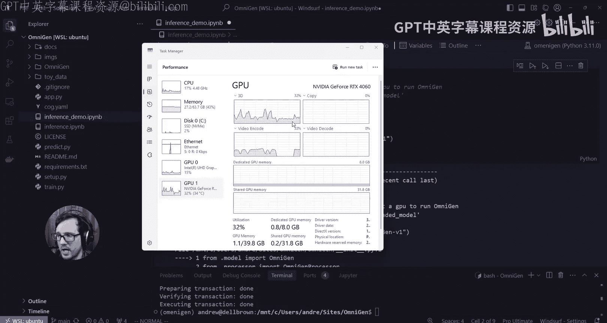

目前还没有变化。但我想，它现在所做的就是下载模型。它正在下载模型。下载完成后，我们才能进行其他操作。我们趁它还在下载时，先看看后面的内容。这里，他们读取图像并描述它是什么。

好的，这里。她戴着精致的耳环……看起来他们像是在创建图像，但实际上他们是在描述图像的内容。哦，不，这实际上是生成了一张图像。所以这实际上是生成了这张图像。

我的意思是，图像有点平滑，但对于我们的游戏来说，如果能有这样的效果，那也很好了。我们往下看。现在，他们说：我们的模型可以同时执行多个编辑命令。这里，移除女性的耳环，将杯子替换为装满闪闪发光的冰可乐的透明玻璃杯。我们输入这个提示词。如果你想生成由OmniGen文本到图像生成的图像，如果种子不同，你必须使用种子。好的，我们到这里。然后，哦，这是输入图像。这是输出图像。看起来有点奇怪，杯子像是悬浮在桌子上，尽管它投下了阴影。所以，如果这位女士口渴了，她应该拿什么？在图像中找到并用蓝色高亮显示。

哦，那里发生了什么？哦，也许那是原始源图像。是的，他们使用的不是同一杯酒。那个有点变形，但它还在那里。并且用蓝色高亮显示了它，好的。

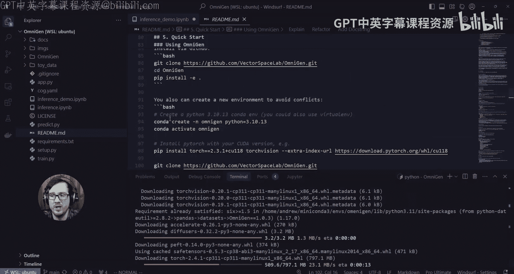

接下来我们有什么？在这里检测人体骨架。我们得到了这个骨架，然后得到了那个骨架。使用以下图片作为条件生成一张新照片。

我们输入骨架，得到了这个，我认为这很酷。回到这里，看起来我们的GPU……我不知道。它一直很稳定，可能还在下载模型。

这里，遵循这张图像的姿势，生成一张年轻男孩坐在沙发上的新照片。

好的，它匹配了姿势，这很好。

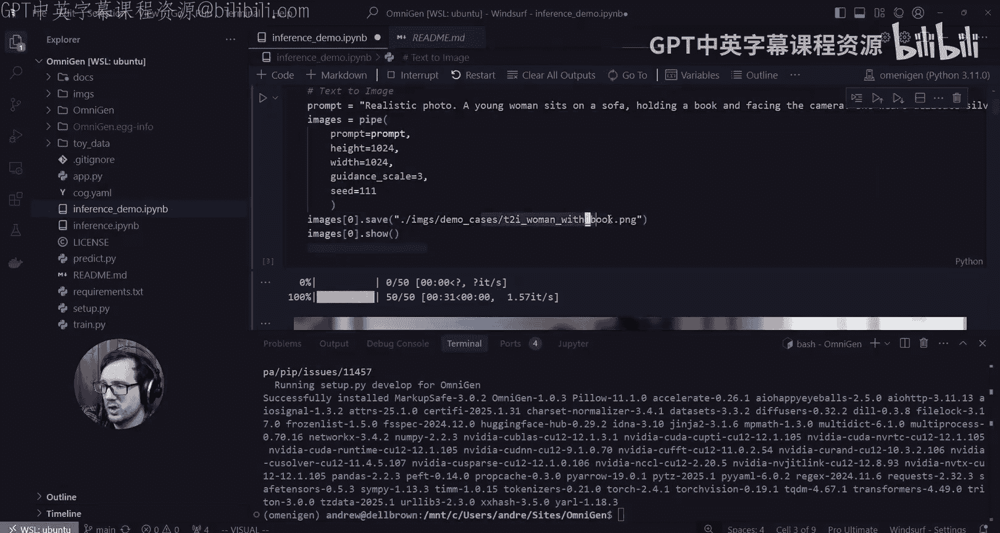

一位教授和一个男孩一起读书。这里展示了我们识别、描述多个人物主体并生成他们的能力。

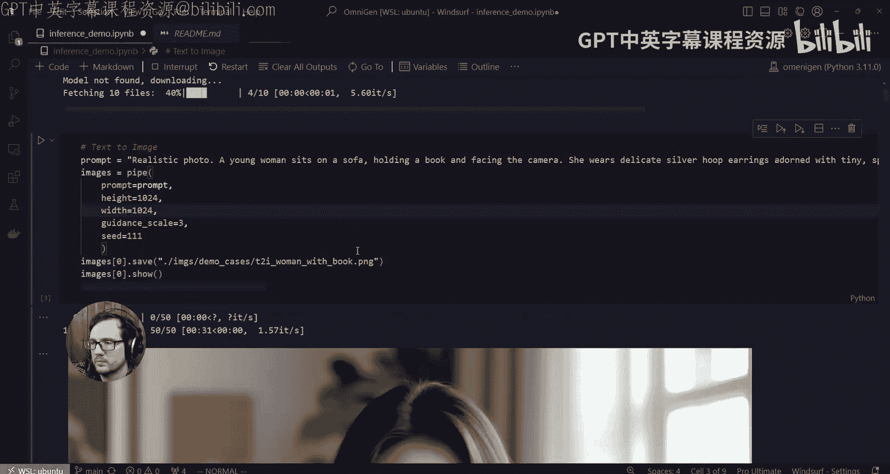

好的，我的意思是，这些看起来都是我们之前看到的例子。但我想看看我们能否让这个模型运行起来。

因为如果我们能让它运行，下一步就会顺利很多。下载这个模型花了很长时间。我不确定它下载了多少东西，但你必须等待相当长的时间。所以我要在这里暂停，直到它100%下载完成。

## 运行模型与遭遇内存错误 💥

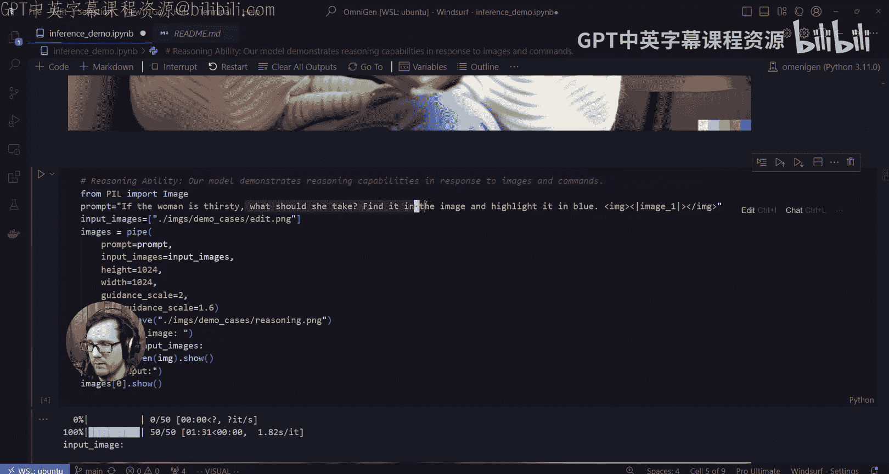

模型下载完成了。我们来看看接下来能做什么。我们试试看能否运行它。我好奇的是，它是在使用CPU还是GPU。

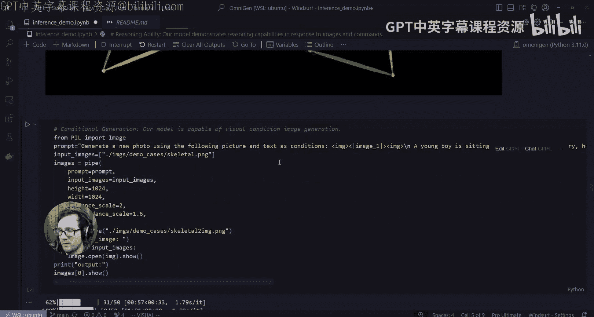

它最初在使用CPU。但现在我们看到它开始使用GPU了。它正在占用所有专用内存。它一直在占用，看起来……

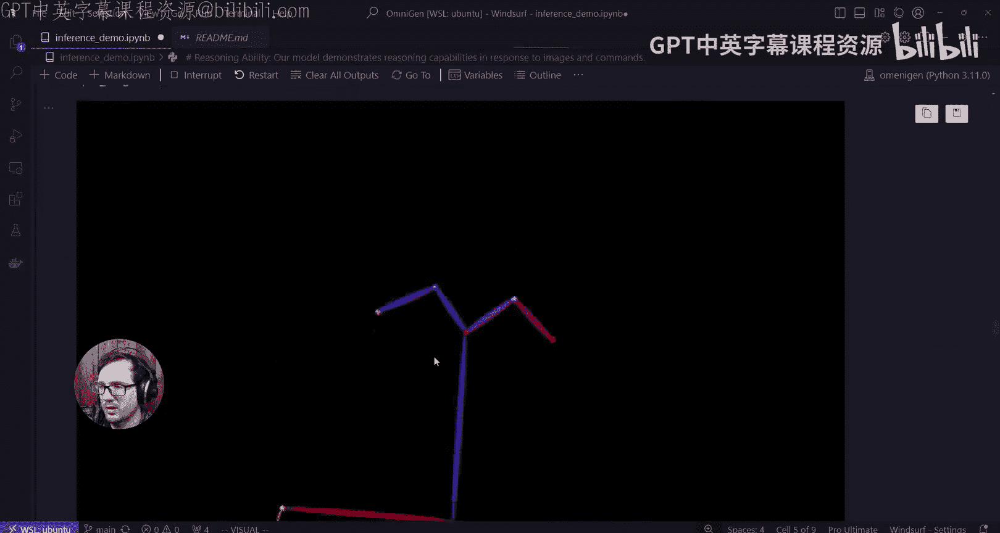

它耗尽了我们的专用内存。我们看看这里。

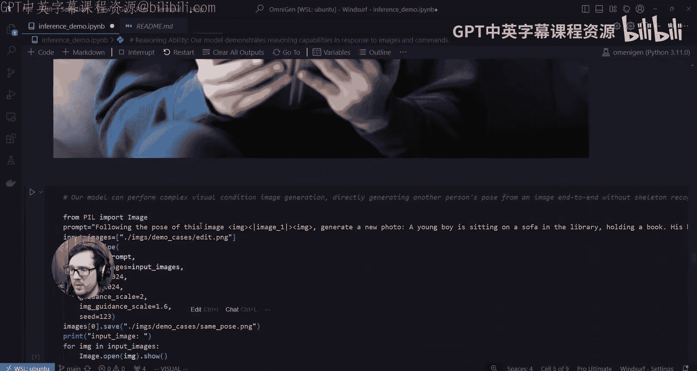

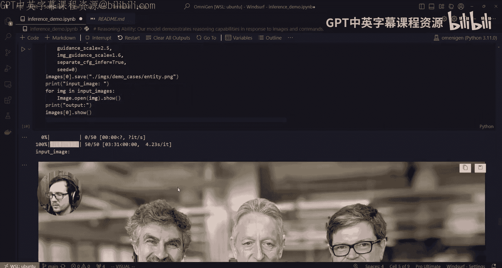

所以，这里显示：无法解包不可迭代的None类型对象。这是什么意思？我不知道这里想说什么，无法解包不可迭代的None类型对象。在图像这里。

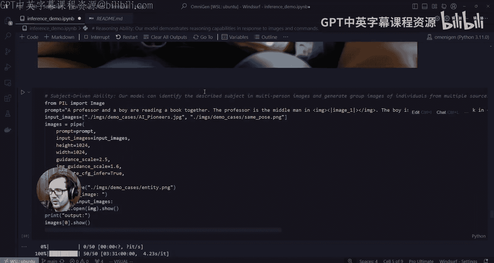

我们是不是忘了运行什么？我不这么认为。这肯定是一个类型错误。

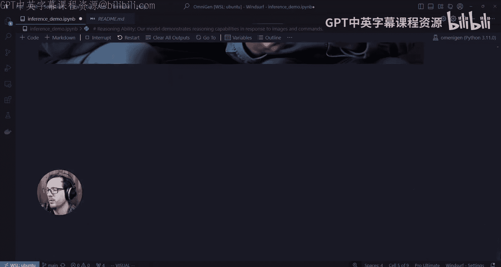

我不完全确定问题出在哪里，但我们会去查一下。也许可以去问问Claude，但我可能用完了所有额度。你们可能从没想过我会用完额度，但我确实用完了。

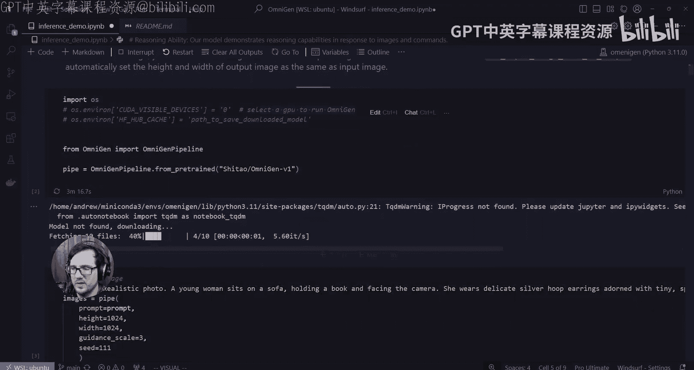

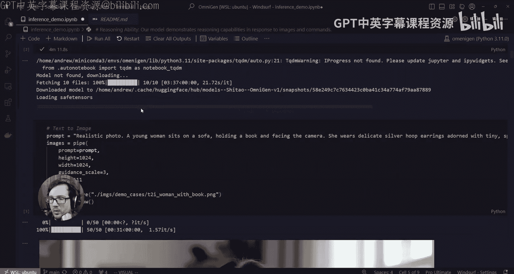

我们继续运行这个。嗯。这可能与Python版本有关吗？或者CUDA？

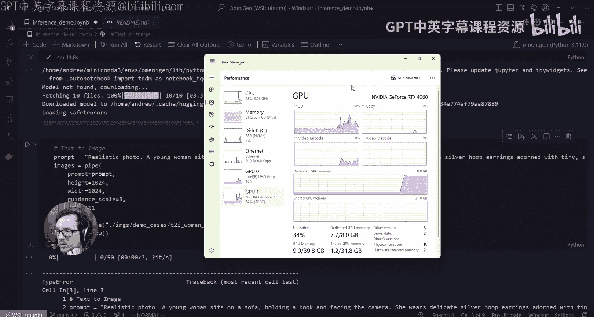

当GPU内存耗尽时，操作有时会返回None。所以我认为这就是我们遇到的问题。我们看到专用内存现在达到了最大值。

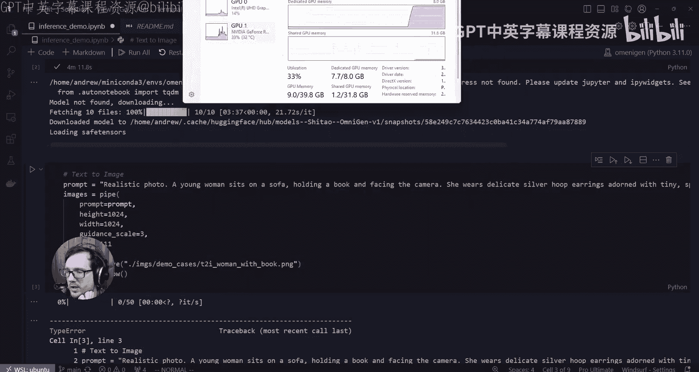

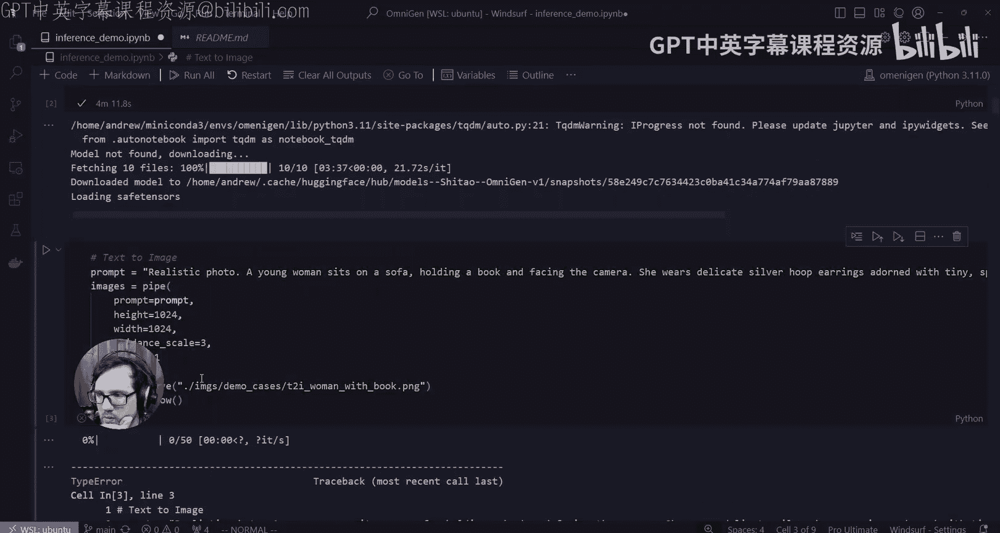

这里没有可用的内存了。我甚至不确定此时如何恢复内存。

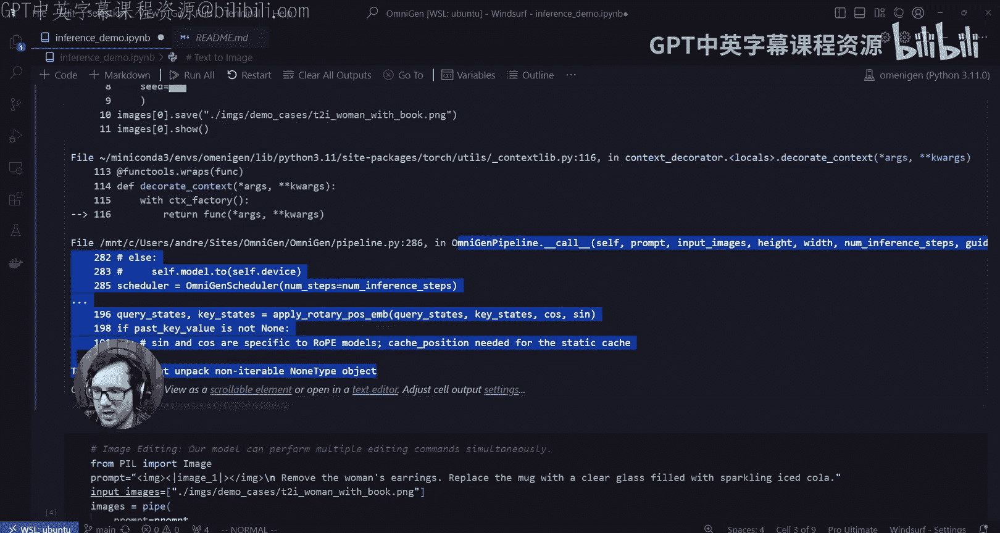

看这里，使用率飙升然后下降了。但我想，我可能不得不停止这个视频录制，因为我无法真正运行它。但至少你看到了我们可以尝试去做。也许如果我能解决这个问题，我可以做一个后续视频。但我想，在本地我们目前只能做到这里了。

我要停止这个，然后看看能否恢复我的内存。

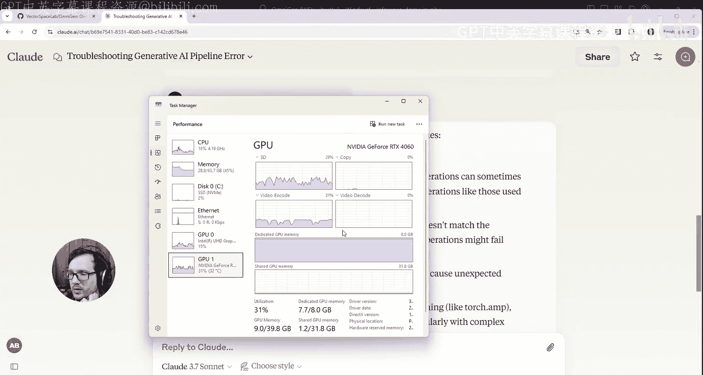

## 总结 📝

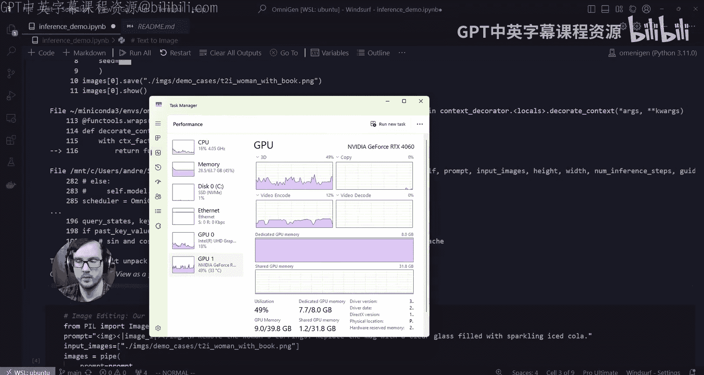

本节课中，我们一起尝试了在本地运行OmniGen模型来编辑游戏角色图像。我们首先探索了PokerFace等替代工具，然后详细介绍了为OmniGen设置独立Python环境、安装依赖（如特定版本的PyTorch和CUDA）以及克隆项目的过程。在尝试运行模型时，我们遇到了GPU内存不足的关键错误，导致模型无法成功执行。这次尝试虽然失败了，但它揭示了在本地运行大型生成式AI模型时可能遇到的实际资源限制问题，并为我们后续探索云端解决方案或优化本地配置提供了宝贵的经验教训。