# 80：最终项目提交指南 📝

在本节课中，我们将详细介绍如何填写最终项目提交表单，以确保您获得期望的等级和徽章。正确填写此表单是获得高级别徽章（如金色或红色小队徽章）的必要步骤。

## 表单提交概述

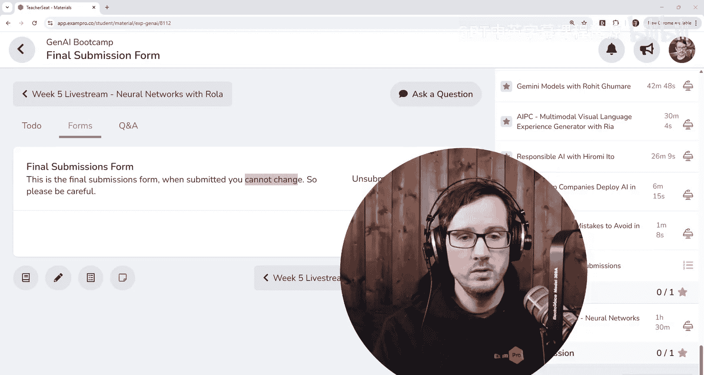

首先，请注意表单的提交时间窗口。该窗口在GenAI训练营网站上有明确规定。您必须在规定时间内提交。如果您错过了截止日期，能否提交取决于我们是否开启新的训练营批次或提供训练营后支持。目前，我们无法对此做出任何承诺。因此，请务必核对日期。如果超出截止日期，您将无法提交，也可能无法获得期望的等级。

某些徽章无论您是否提交都会发放。但对于最高级别的徽章，如金色或红色小队徽章，您必须按时并尽可能完善地填写此最终提交表单。

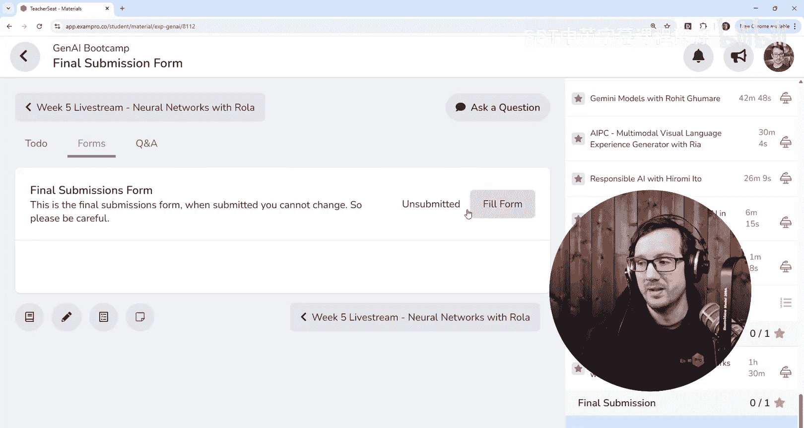

## 表单填写详解与注意事项

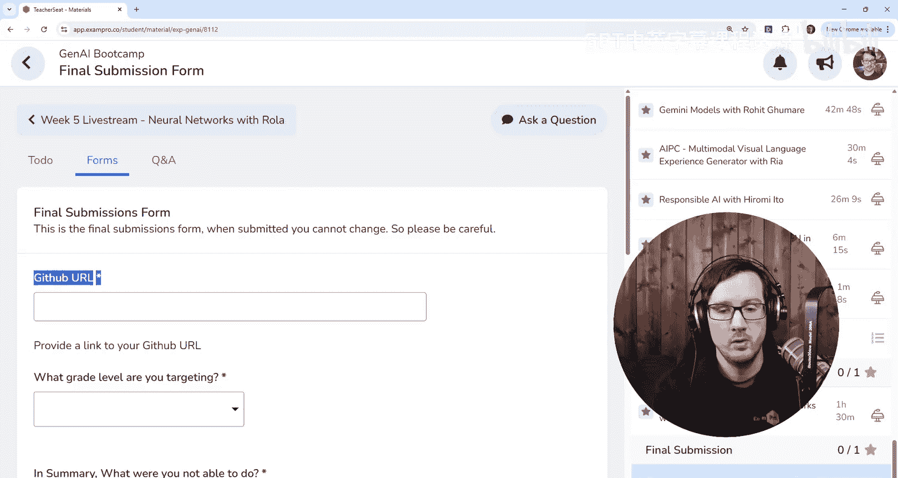

上一节我们强调了提交时间的重要性，本节中我们来看看表单的具体内容和填写要点。

您会注意到，最终提交表单位于其独立的章节中。这里有一个关键点：**一旦提交，您将无法更改**。如果您需要先保存草稿，请务必选择“草稿”状态。但请注意，不要忘记最终提交。有些人会忘记返回并提交，误以为草稿状态就是已提交。请确认状态显示为“已提交”。您可以返回页面，进行强制刷新以确保提交成功。

接下来，我将围绕表单的各个部分进行说明，以便您清楚了解我的评估标准。

### 1. GitHub仓库链接

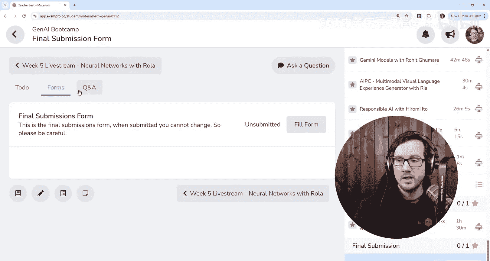

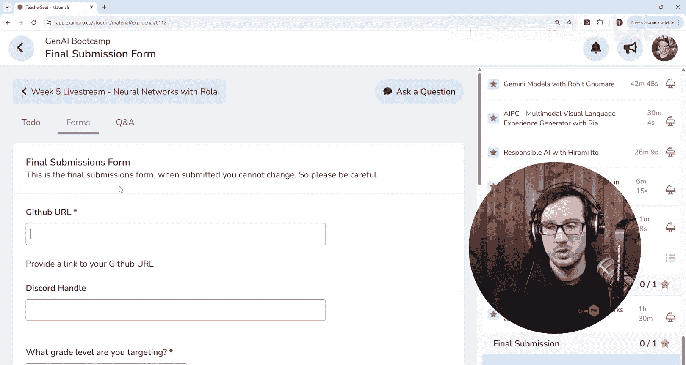

以下是需要填写的第一个核心信息。

*   **GitHub URL**：请提供您项目仓库的链接。我每周都要求提交此链接，本周再次明确要求，是因为系统设计的原因，我只能看到当前表单中的信息。为了我能快速、方便地找到您的仓库，请务必在此处填写。
*   **Discord用户名**：如果您在Discord社区中活跃，请将您的Discord用户名也填写在此处。虽然系统其他地方可能已有记录，但为了便于我交叉参考您的社区活动（这可能会为您赢得加分，甚至帮助您进入红色小队等级），请在此填写。

### 2. 目标等级选择

请选择您希望获得的最终等级。这些等级与评分标准相对应。

我们没有像之前的训练营那样制定复杂的评分细则。原因在于，生成式AI技术是全新的领域，我很难建立一个统一的基线。因此，评分将主要基于整体情况（on a curve）。我已经批阅了足够多的周度提交（例如第四周或第五周），对大家的水平分布有了大致了解。

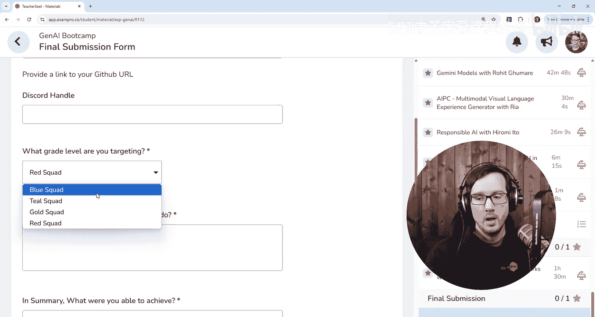

**请明确告知您的目标等级**。如果您目标是金色小队但未达到红色小队标准，这将使我的评分工作更高效，我不需要过多斟酌。这主要是为了简化我的工作流程。请记住，**如果您不提交此表单，您将无法获得金色或红色小队徽章**。所以，请清晰说明您的目标。

### 3. 项目总结：未完成与已完成的部分

这部分是您展示学习过程和成果的关键。

**首先，总结您未能完成的技术目标。** 列出您计划实现但未能完成的技术事项。这没有关系。只要您有良好的文档记录，并展示了在此过程中学到的东西，就不会影响评分。

当我提到“学到的东西”时，不仅仅指泛泛的概念（例如“我学会了什么是数据库”或“什么是LLM”）。从公司视角看，这些价值有限。真正有价值的是**技术上的不确定性**——那些连公司内部或网上都难以找到明确答案的问题。例如，如果您使用一个冷门的古希腊语模型，并尝试对其进行微调，但相关文档匮乏，您在此过程中克服的困难就属于技术不确定性。反之，如果只是其他人都会而您暂时不会的常见问题，那更多是技能缺口，不属于这里需要强调的“不确定性”。在撰写时，请确保内容直击要点、简洁明了，方便我快速阅读和评估。

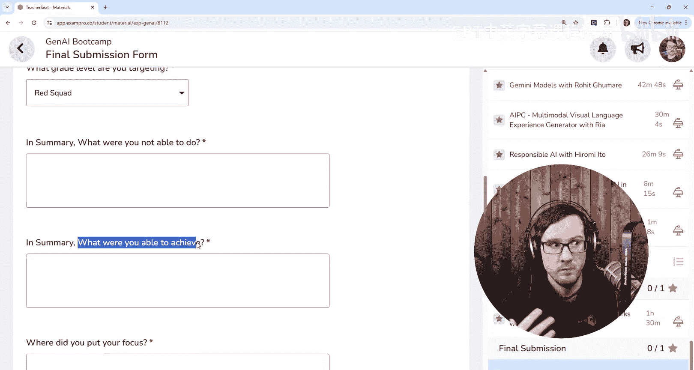

**其次，总结您成功实现的技术目标。** 列出您克服了技术不确定性并最终实现的事项。同样，如果这些是大家都能轻松完成的常规任务，则无需报告。请重点报告那些对您的项目而言独特且有挑战性的成就。

有些学员可能没有专注于极具不确定性的研究任务，而是跟随课程构建一个完整的项目并思考其商业用例。这也是很好的方向。请告诉我您的侧重点是什么。例如，您可以思考：这个方案能扩展到实际规模吗？它真的能解决这个真实业务问题吗？如果您无法深入研发部分，可以侧重展示对业务层面的思考。

### 4. 其他说明与考虑因素

这是一个自由文本框，用于提供您希望我知悉的任何额外信息。

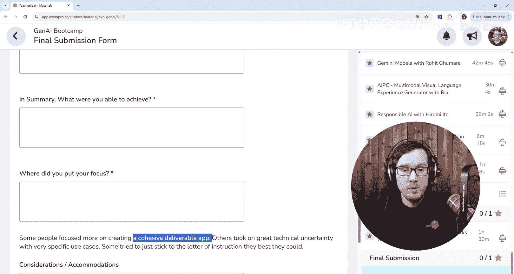

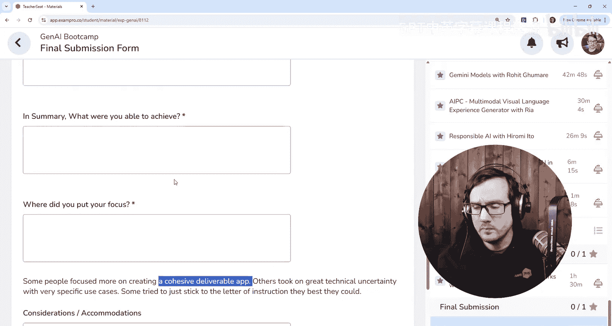

*   **考虑因素与特殊情况**：如果您有任何希望我考虑的情况，例如时间安排上的困难、遇到的特殊挑战等，请在此框中说明。
*   **内容长度建议**：请尽力填写，但避免内容过长。文本框的大小暗示了信息量的预期。如果内容超过框体两倍以上，可能就过多了。请保持总结的简洁性。更详细的信息应该放在您的GitHub仓库中，并且要让我易于查找。

## 提交策略与反馈

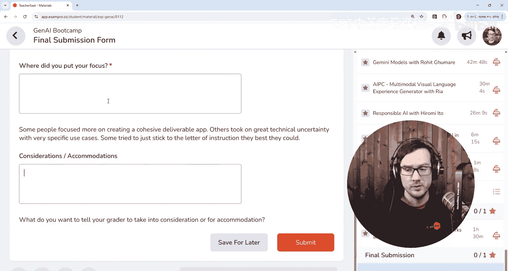

关于何时提交此表单，这取决于您自己。我在Discord中提过，某些周次的作业我需要批阅数千份，而后面周次的则只有数百份。如果您能及时完成后续周次作业，应该会获得评分。如果您进度严重落后，则存在风险。请务必在截止日期前提交。

如果您想稍作等待，先获取我之前作业的反馈再决定，这由您自行决定。本次训练营难度极高，主要由我（Andrew Brown）和另一位Andrew负责批阅，我们正在尽力为每个人提供反馈。

**重要承诺**：任何提交了最终表单并完成了所有周次作业的学员，都将获得反馈——特别是**视频反馈**，而不仅仅是文字点评。

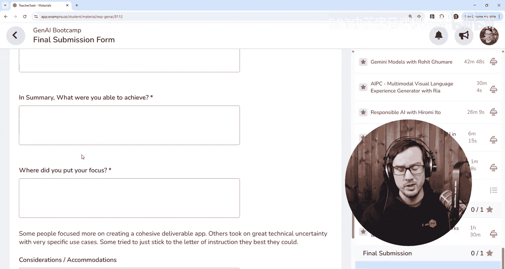

## 课程总结

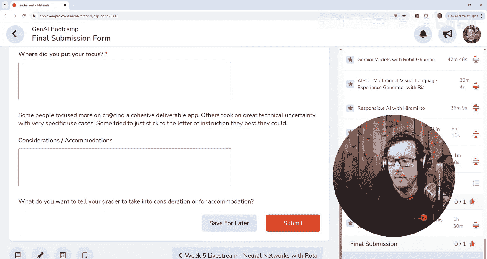

本节课中，我们一起学习了最终项目提交表单的详细填写指南。我们强调了提交时限、表单各部分的填写要点（如GitHub链接、目标等级、技术总结），以及提供简洁、有价值信息的重要性。请确保在截止日期前完整提交表单，并祝您好运。希望大家在训练营中度过了一段愉快且收获满满的时光。我期待看到每个人的最终成果！

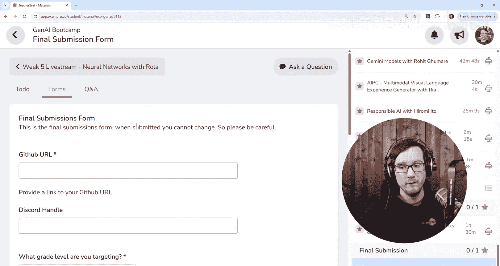

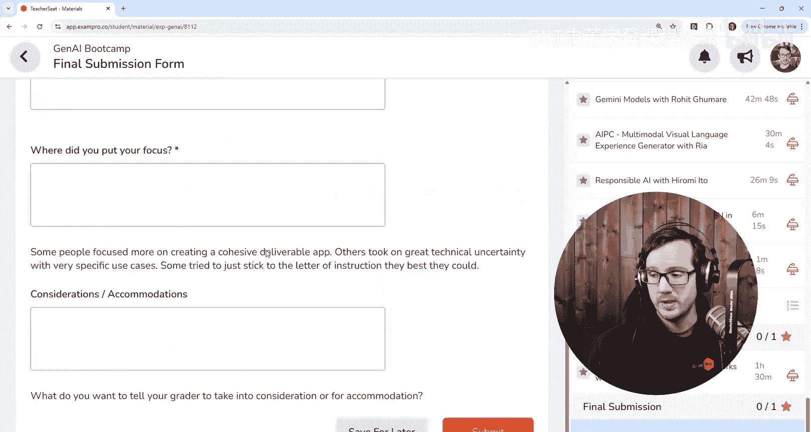

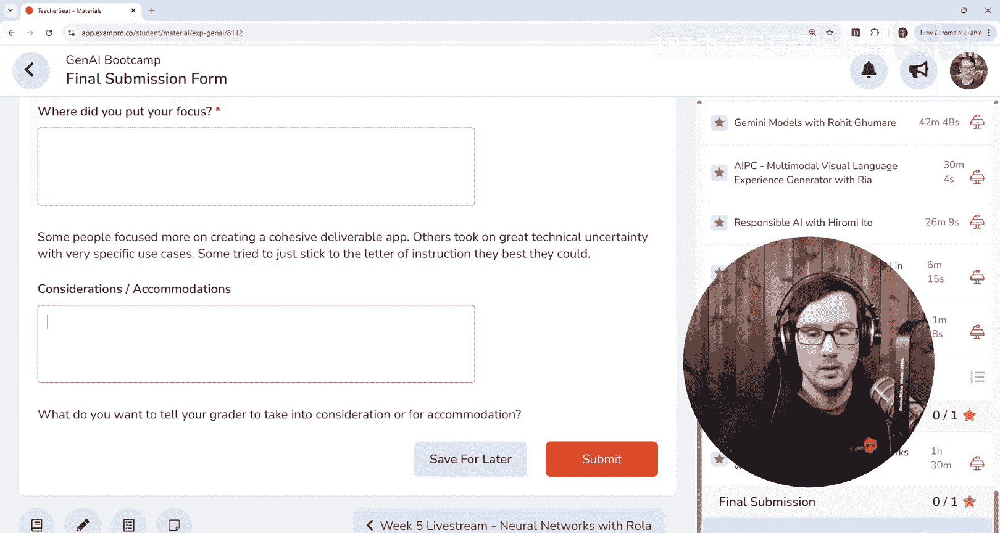

加油！🚀