# 深度学习实践课程：1：深度学习入门 🚀

在本节课中，我们将要学习深度学习的基本概念，并通过一个实际案例——构建一个“识别鸟类”的图像分类器——来展示深度学习的强大与易用性。我们将看到，即使没有复杂的数学知识、海量数据或昂贵的硬件，也能在几分钟内创建一个功能强大的模型。

---

## 深度学习：从“不可能”到“两分钟”的飞跃

2015年底，有一幅XKCD漫画将“判断一张照片是否为鸟类”视为“几乎不可能”的任务，并以此作为一个笑话。然而，自那时起，深度学习领域发生了翻天覆地的变化。如今，我们可以在大约两分钟内，免费构建一个完全相同的系统。

### 构建“是鸟吗？”系统

我们将使用Python和FastAI库来快速构建这个系统。以下是核心步骤的概述：

1.  **获取数据**：从互联网下载鸟类和森林的图片作为训练数据。
2.  **准备数据**：使用FastAI的`DataBlock` API来组织数据，指定输入类型（图像）、输出类型（类别）、数据来源和验证集划分方式。
3.  **创建模型**：使用预训练的ResNet模型，并通过**微调**使其适应我们的特定任务。
4.  **训练与预测**：在笔记本电脑上训练模型，并用它来预测新图片是否为鸟类。

整个过程代码简洁，无需复杂数学，训练时间不到30秒，最终模型能以极高的准确率识别鸟类。

这个例子表明，创建有趣且实用的深度学习程序并不需要大量代码、数学知识或昂贵的计算资源。在接下来的七周里，我们将深入学习如何做到这一点。

---

## 深度学习的现状与潜力 🌟

深度学习的发展日新月异。近期，社区在图像生成和自然语言处理等领域取得了突破性进展。

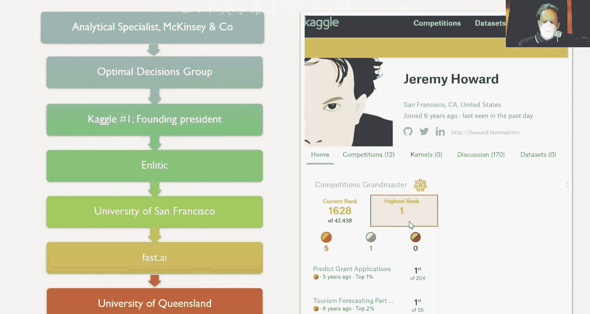

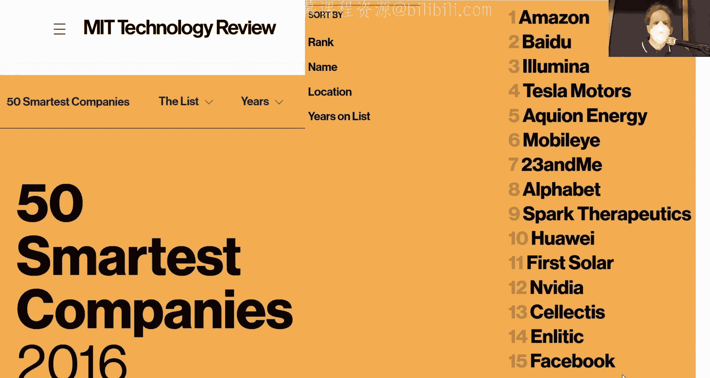

*   **图像生成**：如DALL-E 2、Midjourney等模型，能够根据文本描述生成极具创意和复杂度的图像。许多艺术家和FastAI校友正在将深度学习与艺术创作深度融合。
*   **语言模型**：如Google的Pathways语言模型，不仅能回答复杂的文本问题，还能解释其“推理”过程，例如解释一个关于TPU的笑话。

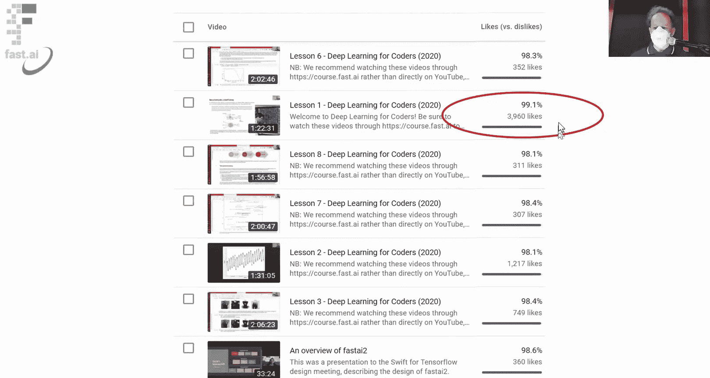

这些进展意味着深度学习正在处理一些我们曾认为计算机在有生之年都无法完成的任务。随之而来的是许多实际和伦理考量，我们将在课程中有所涉及，并推荐大家深入学习Rachel Thomas博士的数据伦理课程。

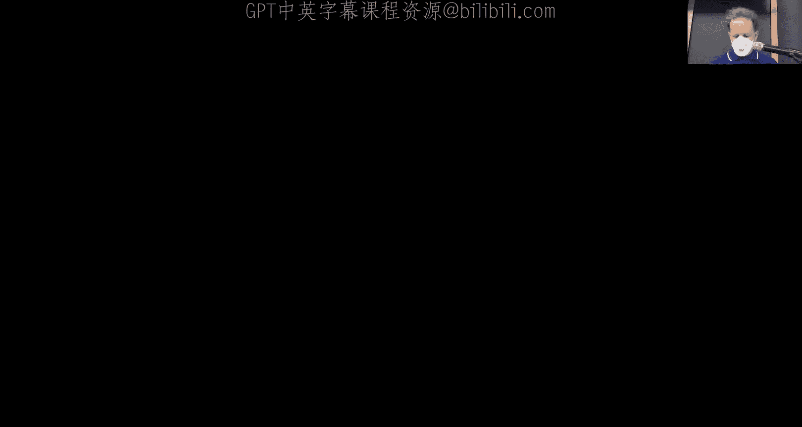

---

## 课程教学方法与理念 🎓

本课程的教学方法与传统技术课程不同，它深受教育研究启发。

*   **从实践开始**：我们没有从线性代数和微积分开始，而是直接训练了一个模型。这就像学习体育时，先体验整个游戏的乐趣，再逐步学习具体技巧。
*   **情境化学习**：研究表明，在有具体情境的情况下学习效果更好。因此，我们先让你能够构建和部署模型，再随着需求深入理解其背后的原理。
*   **持续反馈**：我们使用一个在线的“红黄绿杯”系统来收集学习者的理解情况，以便调整教学节奏。

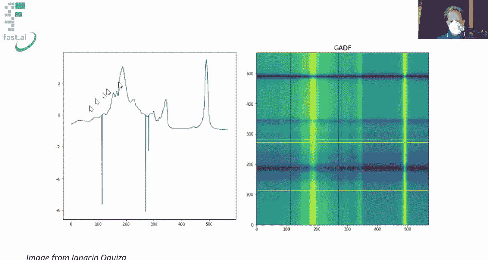

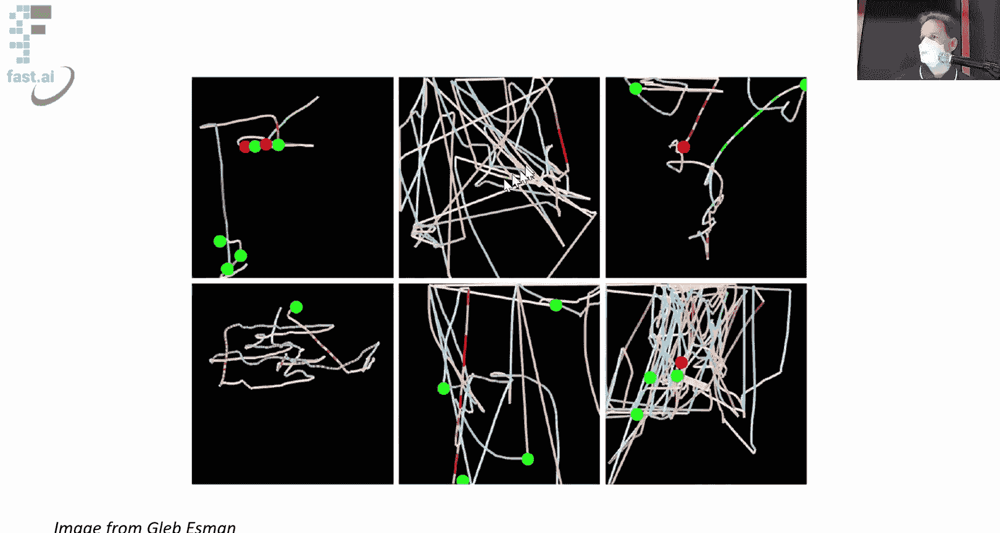

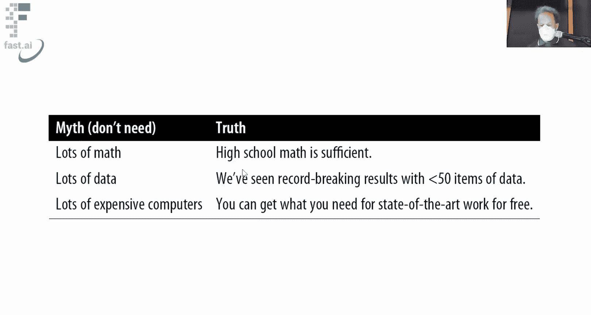

对于习惯传统技术教育路径的学习者，这种方法起初可能令人不适，但请尽力适应。你会发现，这是掌握实用深度学习技能的高效途径。

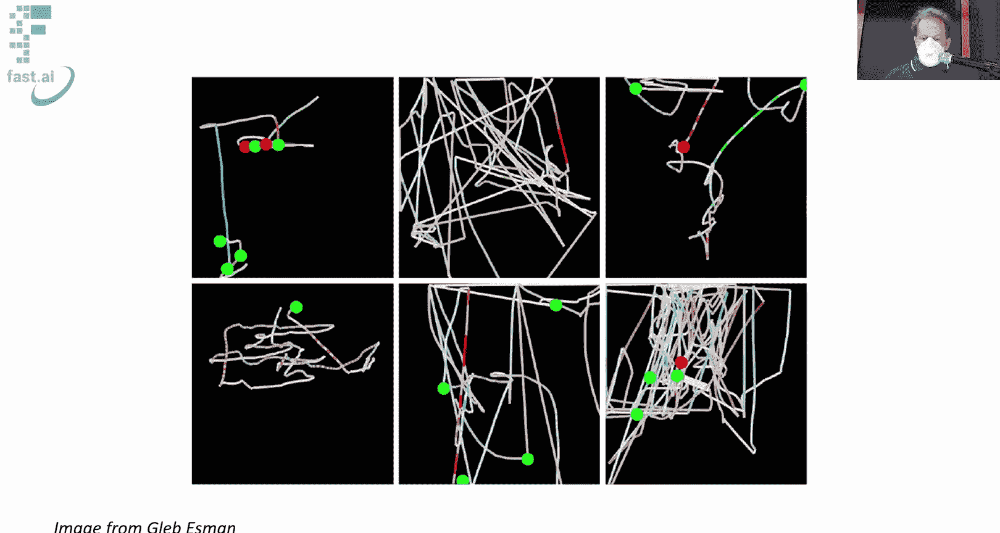

---

## 为什么选择本课程？👨‍🏫

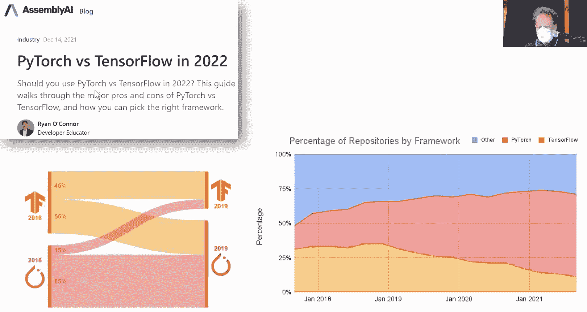

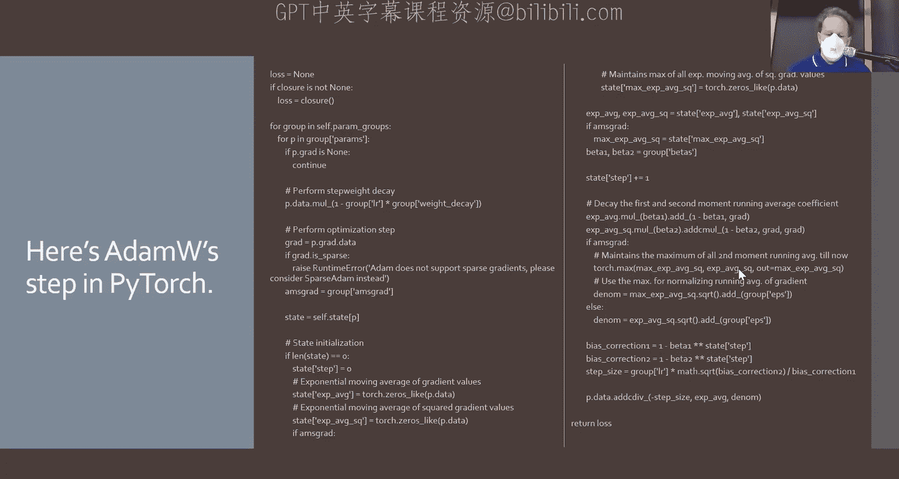

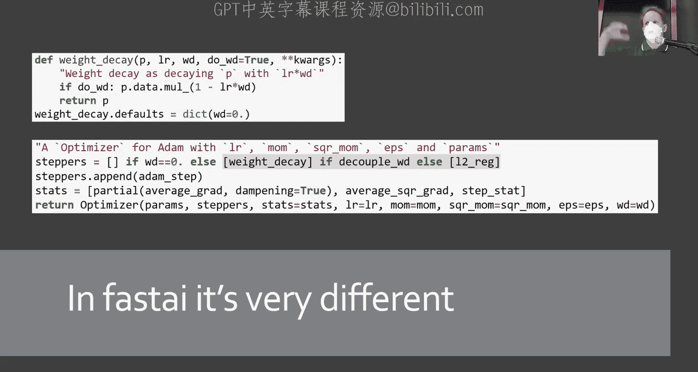

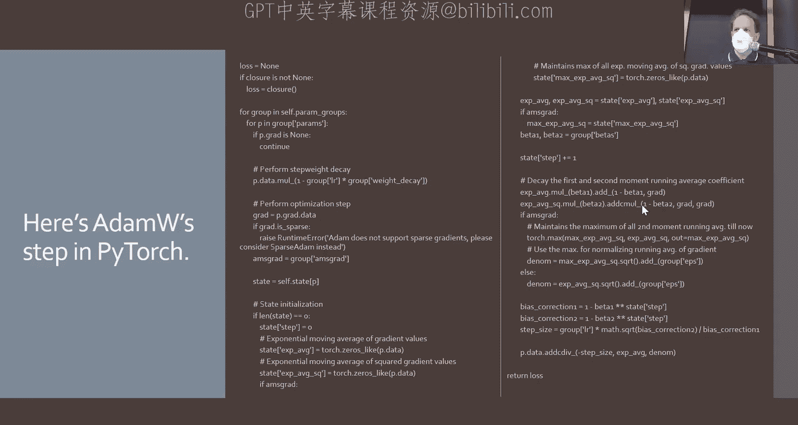

以下是关于讲师Jeremy Howard的一些背景，以说明本课程内容的基础：

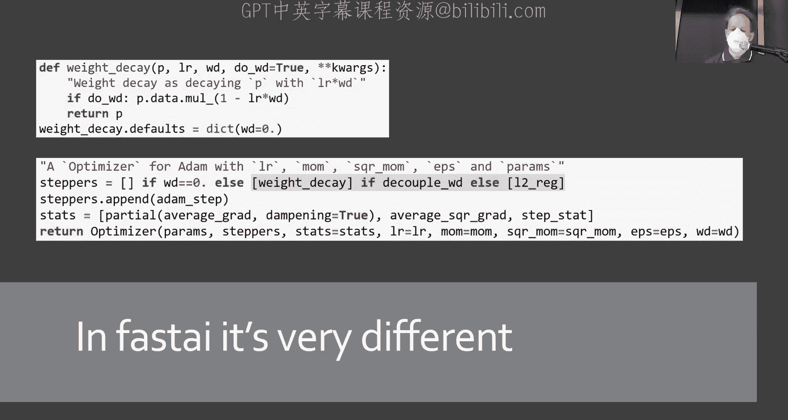

*   **《程序员深度学习》**：与Sylvain Gugger合著了这本广受好评的书籍，本课程内容与之紧密相关但呈现方式不同，以符合“多角度学习效果更佳”的教育原则。
*   **行业经验**：拥有约30年的机器学习行业经验，曾是Kaggle机器学习竞赛全球排名第一的选手。
*   **创业与贡献**：创立了首家专注于医学深度学习的公司Enlitic。与Rachel Thomas共同创立了fast.ai。
*   **研究影响**：其工作具有全球影响力，例如在DAWNBench竞赛中展示了如何更快、更便宜地训练大型神经网络。他是ULMFi算法的发明者，该算法被认为是现代NLP革命的两大关键基础之一。
*   **教学成果**：自课程第一版起便开始教学，广受欢迎，并被特斯拉、OpenAI等顶尖公司的AI团队用作入职培训材料。

---

## 深度学习为何现在可行？🤔

关键在于**神经网络可以自动学习特征**，而无需人工设计和编码。

*   **传统方法（2012年）**：例如斯坦福的“计算病理学家”项目，需要跨学科专家团队花费数年时间，手工设计成千上万的特征（如图像中细胞核的关系），然后输入逻辑回归等模型。过程冗长、复杂且依赖专业知识。
*   **深度学习方法**：我们只需向神经网络输入原始图像（即像素RGB数值矩阵）和标签。网络通过其层次结构（多层权重矩阵乘加和非线性激活）自动学习从简单到复杂的特征：
    *   第一层可能学会识别边缘、颜色梯度。
    *   更深层则能组合出更复杂的特征，如纹理、图案、物体部件乃至整个物体。

这种自动特征学习的能力，使得解决以往难以想象的问题成为可能。

---

## 核心概念：机器学习的基本框架 🧠

Arthur Samuel在20世纪50年代末提出的机器学习基本框架至今仍是核心。我们可以将其可视化如下：

**传统程序**：`输入 -> [程序：条件、循环等] -> 输出`

**机器学习程序**：
`输入 + 参数（权重） -> [模型：数学函数，如神经网络] -> 输出 -> [损失函数：评估输出好坏] -> 更新参数`

具体步骤如下：

1.  **初始化**：从一个**随机权重的模型**开始（此时模型无用）。
2.  **前向传播**：将输入数据和当前权重输入模型，得到预测输出。
3.  **计算损失**：通过损失函数计算预测输出与真实标签之间的差异（即模型有多“糟糕”）。
4.  **参数更新**：关键步骤。利用损失值，通过一种算法（如**梯度下降**）计算如何**小幅调整权重**，使得损失降低。
5.  **迭代**：重复步骤2-4多次。每次迭代，模型都会变得“好一点点”。
6.  **部署**：训练完成后，固定权重。此时，训练好的模型就像一个普通函数：`输入 -> 训练好的模型 -> 输出`，可以轻松集成到任何应用程序中。

神经网络（由多层矩阵乘加和ReLU等激活函数构成）被证明是一种**通用函数逼近器**。只要网络足够大、数据足够多、训练时间足够长，理论上它可以逼近任何可计算函数。这正是深度学习强大能力的理论基础。

---

## 实践工具与环境 🛠️

我们将使用以下工具进行实践：

*   **PyTorch**：当前学术界和工业界主流的深度学习框架，以其灵活性和动态计算图著称。
*   **FastAI库**：构建于PyTorch之上，它封装了最佳实践，让我们能用极少的代码实现强大功能。例如，实现AdamW优化器，在纯PyTorch中需要大量代码，而在FastAI中只需一行。
*   **Jupyter Notebook**：交互式计算环境，非常适合实验、探索和展示。本课程的所有代码、书籍甚至FastAI库本身的源码都使用Notebook编写。我们还会使用RISE扩展将Notebook转换为幻灯片。

对于计算资源，你可以在**免费**的云平台（如Kaggle、Colab）上运行所有代码，无需强大的本地硬件。

---

## 不止于图像分类：广阔的应用领域 🌈

我们在第一课聚焦图像分类，但深度学习模型的应用远不止于此。FastAI提供了统一的API来处理多种数据类型：

*   **图像分割**：对图像中的每个像素进行分类（如区分道路、汽车、行人）。代码结构与图像分类惊人地相似。
*   **表格数据分析**：处理像电子表格或数据库表这样的结构化数据，用于预测、分类等。同样使用`DataLoaders`和`Learner`模式。
*   **协同过滤**：构建推荐系统的基础。根据用户-物品交互历史（如评分），预测用户可能喜欢的其他物品。

更重要的是，**图像分类的技术可以创造性地应用于其他领域**。例如：
*   将**声音波形**转换为频谱图，然后用图像分类器进行声音分类。
*   将**时间序列数据**转换为图像，再进行模式识别。
*   将用户的**鼠标移动轨迹**（点击为点，移动为线，速度为颜色）转化为图像，用于行为分析。

这展示了深度学习的通用性和灵活性。

---

## 破除迷思：深度学习其实很亲民 💡

*   **不需要大量数学**：本课程将按需介绍必要的数学概念，大部分实践操作不涉及复杂公式。
*   **不需要海量数据**：我们的鸟类分类器只用了200张图片。**迁移学习**等技术使得在小数据集上也能取得优异效果。
*   **不需要昂贵硬件**：我们可以在笔记本电脑或免费云GPU上完成训练。
*   **代码量很少**：借助像FastAI这样的高级库，可以用非常简洁的代码实现复杂功能，减少错误并遵循最佳实践。

---

## 第一课总结与作业 📚

本节课我们一起学习了：
1.  深度学习如何使“识别鸟类”这类任务从不可能变得简单快捷。
2.  机器学习的基本框架：通过迭代更新模型参数来最小化损失函数。
3.  FastAI和PyTorch的基本使用方法，以及Jupyter Notebook环境。
4.  深度学习在图像、表格、推荐系统等多个领域的应用潜力。
5.  深度学习的亲民特性，它不需要你预先掌握大量数学或拥有海量数据。

**你的作业是：**

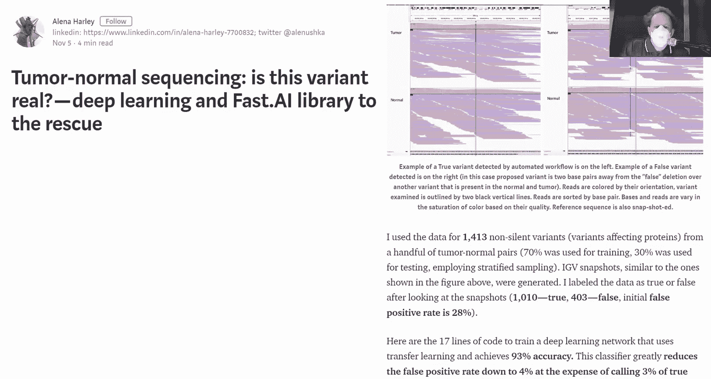

1.  **动手实验**：运行课程中的鸟类分类Notebook。尝试修改它，例如：
    *   创建自己的分类器（如“猫 vs 狗”、“披萨 vs 汉堡”）。
    *   尝试使用三个或更多类别。
    *   关键在于**动手尝试并完成一个项目**。
2.  **阅读**：阅读《程序员深度学习》**第1章**。它以不同的方式呈现了相似的内容，能帮助你巩固和理解。
3.  **分享与交流**：将你的实验成果发布到课程论坛的“分享你的作品”主题中。过往学员的分享催生了许多创业项目、科研论文和工作机会。
4.  **自测**：完成书中第1章末尾的测验题，检验自己的理解。

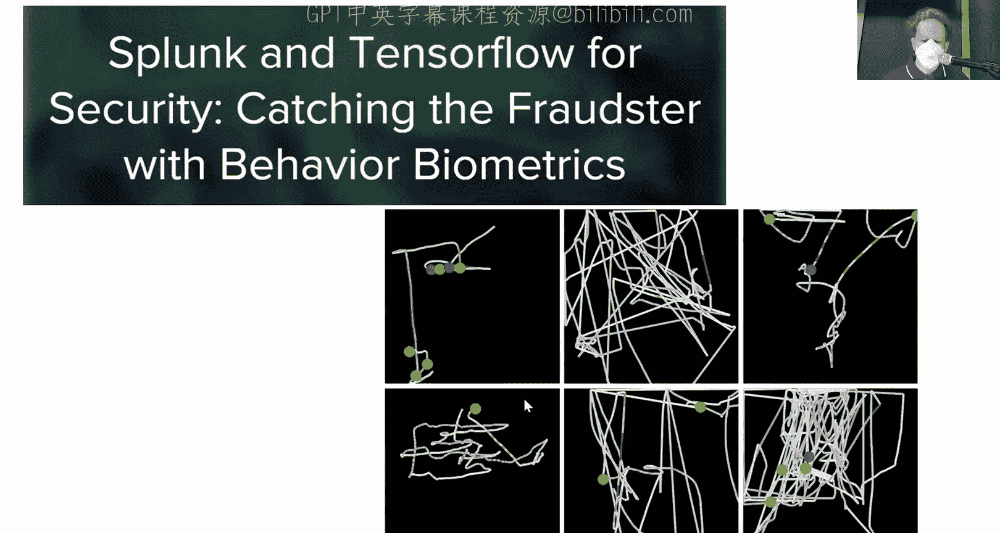

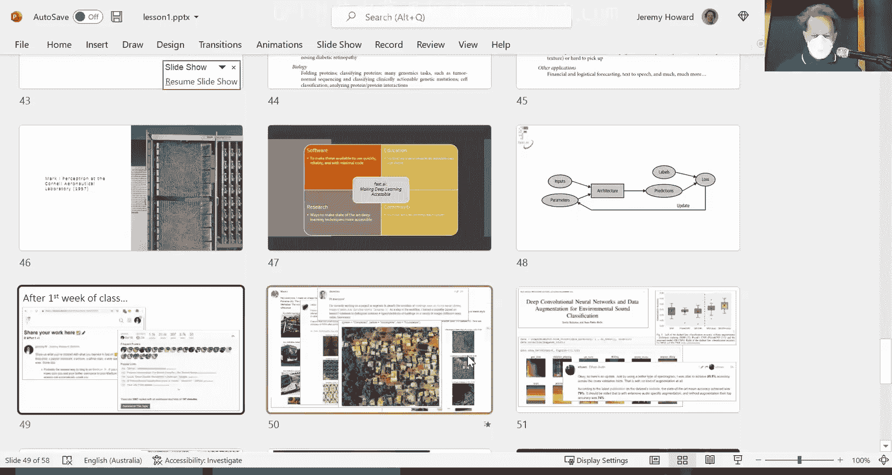

无论你是Python新手还是经验丰富的开发者，都请勇敢尝试，从实践中学习。我们下节课见！