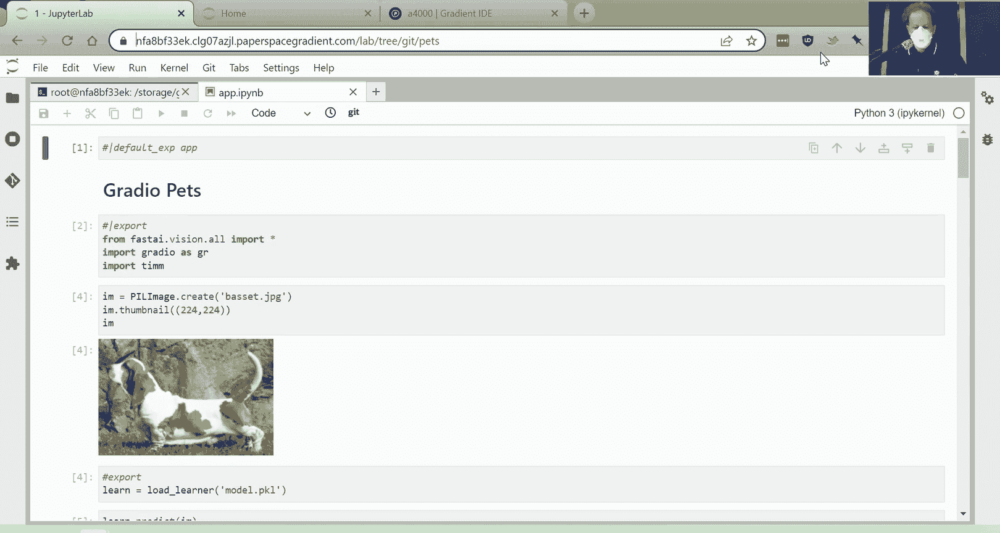
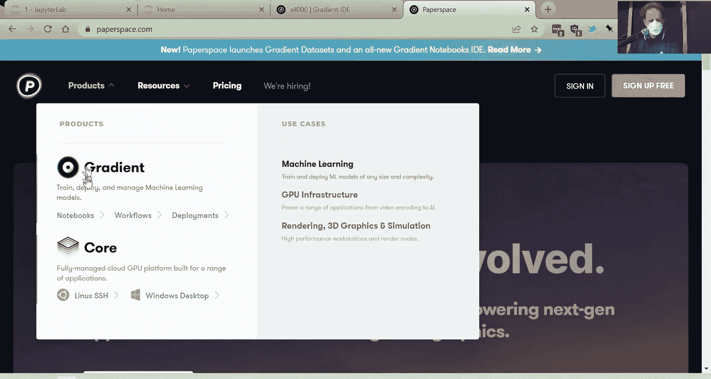
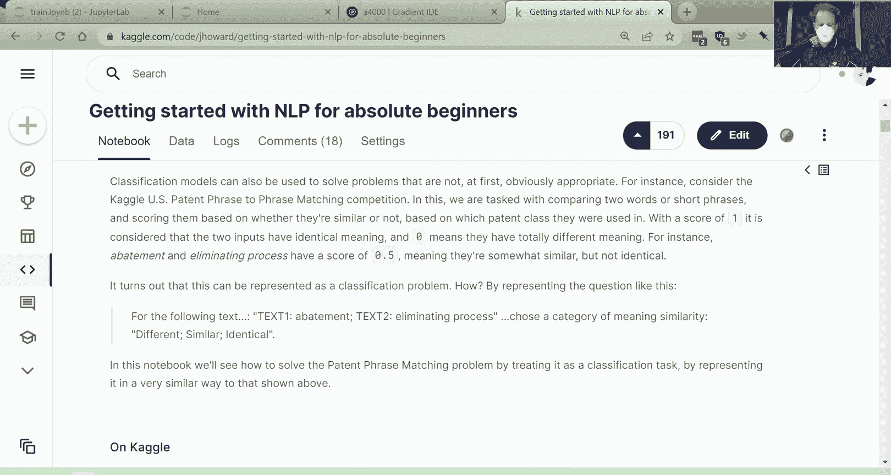

# 深度学习实践课程：3：神经网络基础与优化

在本节课中，我们将学习神经网络背后的核心数学原理，包括梯度下降、矩阵乘法以及如何从零开始构建一个简单的模型。我们将通过直观的例子和实际应用来理解这些概念。

---

## 概述

本节课我们将深入探讨神经网络的工作原理。我们将从拟合一个简单的二次函数开始，逐步引入损失函数、梯度下降和矩阵乘法等核心概念。最后，我们将在Microsoft Excel中构建一个完整的神经网络模型，以直观地理解整个过程。

---

## 课程反馈与学习建议

我们进行了一次快速调查，以了解大家对课程进度的感受。超过一半的参与者认为课程节奏适中。对于其余参与者，有些人认为课程进度稍慢，有些人则认为稍快。总体而言，这是我们能做到的最佳平衡。

前两节课的节奏对于已经熟悉基础技术的学员来说较为轻松。后续课程将更多地深入基础知识。今天我们将讨论矩阵乘法、梯度和链式法则等内容。对于数学背景较强的学员，这节课可能会更舒适，反之亦然。

请记住，官方课程更新帖子和课程网站上包含所有最新信息。观看课程视频时，如果遇到问题，很可能已经有人提出过类似问题。因此，请务必先搜索论坛并查看常见问题。如果找不到答案，欢迎在论坛上提问。

课程网站上还有一个“第0课”，它大量借鉴了Raex的书籍《Meta Learn》，其中包含了许多关于学习科学的建议。我强烈推荐观看第0课，除非你对从零开始设置Linux系统不感兴趣。

学习FastAI课程的基本方法是：首先完整观看讲座视频，然后带着暂停回看，同时运行笔记本代码。这样可以更好地理解代码的目标。建议运行书中的每个代码单元格，尝试修改输入和输出以理解其工作原理，然后尝试复现结果。最后，尝试使用不同的数据集重复整个过程。这是一个具有挑战性的目标，但能证明你已经掌握了知识。

在FastAI书籍仓库中，有一个名为“clean”的文件夹，其中包含所有章节的代码，但移除了除标题外的所有文本和输出。这是测试你对章节理解的好方法。在运行每个单元格之前，尝试思考它的作用和可能的输出。如果不确定，可以跳回带有文本的版本来提醒自己。

虽然这是自学，但研究表明，与他人一起学习更容易坚持下去。论坛是寻找和创建学习小组的好地方。论坛上还有我们Discord服务器的链接，那里也有一些学习小组。如果没有适合你水平、地区或时区的学习小组，可以创建一个。

本周论坛上有很多精彩的活动。我使用论坛的摘要功能抓取了投票最高的内容。例如，有人创建了一个漫威角色检测器、一个石头剪刀布游戏（电脑总是输）、一个埃隆·马斯克检测器，以及一个根据航拍照片预测平均温度的项目（在布里斯班预测误差在1.5摄氏度以内）。还有恐龙识别、通过面部表情选择路径的冒险游戏、音乐流派分类等有趣项目。Brian Smith创建了一个在手机上运行的Microsoft Power App应用程序。艺术运动分类器项目引发了关于不同艺术运动之间相似性的有趣讨论。还有一个涂黑检测器项目，附有完整的推文线程和博客文章。

---

## 模型优化与平台介绍

在深入神经网络机制之前，我将快速展示一些提高神经网络准确性的技巧。我创建了一个宠物品种检测器（不仅仅是区分猫狗，而是识别具体品种）。这个项目发布在Hugging Face Spaces上，你可以下载并查看我的代码。

今天我将使用一个不同的平台——Paper Space。它类似于Kaggle和Google Colab，但有一个名为“Gradient Notebooks”的产品。在我看来，这是目前运行本课程和进行实验的最佳平台。它是一个真实的计算机，不像Colab或Kaggle那样是虚拟环境。你可以打开完整的Jupyter Lab或Jupyter Notebooks界面。对于不熟悉终端的初学者来说，Jupyter Lab是一个很好的环境。你可以通过图形界面完成所有操作，例如文件浏览、Git仓库管理等。Paper Space提供免费GPU，你也可以每月支付约8-9美元获得更好的GPU和几乎无限的运行时间。最重要的是，它有持久存储，不像Colab需要将数据保存到Google Drive。

我将添加所有这些功能的详细教程。如果你有兴趣充分利用这个平台，请查看这些教程。

---

## 训练与部署的核心概念

我希望大家从第2课中学到的关键不是如何使用特定平台训练模型并将其部署到JavaScript或在线应用程序中，而是理解核心概念。主要有两部分：训练部分和部署部分。

训练结束后，你会得到一个名为`model.pkl`的文件。这个文件接受输入并基于训练好的模型输出结果。一旦训练完成，你通常不需要GPU，因为推理过程很快。然后就是单独的部署步骤。

我将展示如何训练我的宠物分类器。我有两个IPython笔记本：一个是用于推理和生产的`app`，另一个是用于训练模型的笔记本。首先，我创建图像数据加载器，检查数据，训练一个ResNet34模型，得到了7%的准确率，这相当不错。

然后，我尝试通过寻找更好的架构来改进模型。PyTorch Image Models库中有超过500种架构。我们关心的是三件事：速度、内存使用和准确性。我和Ross Whiteman抓取了所有模型，并绘制了图表。X轴是每个样本的秒数（速度），Y轴是准确性。一般来说，我们希望模型位于图表的左上角（又快又准）。

我们主要使用ResNet，但ResNet34现在已经不是最先进的了。我们可以看看图表上方的模型，例如ConvNeXt模型。其中一些模型在准确性和速度上表现优异。我尝试了ConvNeXt模型，训练时间从20秒增加到27秒，但准确率从7.2%提高到5.5%，相对提升了约30%。这是一个巨大的进步。如果你不确定使用什么架构，可以尝试这些ConvNeXt模型。模型名称中的“tiny”、“small”、“large”等表示模型大小，影响内存使用和速度。有些模型在包含22,000个类别的ImageNet数据集上训练，通常在自然物体照片上更准确。

训练完成后，我导出了模型。要将其转换为应用程序，只需像上周一样加载学习器并调用预测。学习器输出37个数字的概率列表，对应37个猫狗品种。顺序由词汇对象决定，我们可以获取类别列表并将其与概率压缩成字典。

这个神奇的模型文件实际上是一个学习器对象，包含两个主要部分：预处理步骤和训练好的模型。我们可以通过`.model`属性获取模型。模型包含许多层，是一个深度模型。我们可以使用PyTorch的`get_submodule`方法查看特定层。每个层都有代码（数学函数）和参数（大量数字）。这些数字是通过优化过程得到的。

---

## 神经网络基础数学

为了理解这些数字如何识别图像内容，我们将通过一个Kaggle笔记本探讨神经网络的实际工作原理。机器学习模型是拟合数据到函数的工具。我们从一个非常灵活的函数（神经网络）开始，并让它识别数据中的模式。

让我们从一个更简单的例子开始：二次函数。我们创建一个函数`f(x) = 3x² + 2x + 1`，并绘制它。假设我们不知道真实的数学函数，我们试图从一些数据中重建它。为了测试不同的二次函数，我们定义一个通用形式`quadratic(a, b, c, x) = ax² + bx + c`。使用Python的`partial`函数，我们可以固定系数并创建特定的二次函数。

我们生成一些带有噪声的数据，并尝试重建原始二次函数。我们可以创建一个交互式绘图函数，通过滑块调整系数，观察函数如何拟合数据。为了更严谨地评估拟合效果，我们需要一个损失函数，例如均方误差（MSE）。损失函数告诉我们模型的预测与实际值之间的差异。

我们可以手动调整系数以最小化损失，但更好的方法是计算导数。导数告诉我们当输入增加时，输出是增加还是减少，以及变化多少。PyTorch可以自动计算导数。我们创建一个函数，将二次函数的系数作为输入，并返回损失。然后，我们将系数包装在一个张量中，并设置`requires_grad=True`以收集梯度。调用`.backward()`后，我们可以访问梯度，并按照负梯度方向更新系数，乘以一个小的学习率。这个过程称为梯度下降。

通过多次迭代，我们可以自动优化系数。这就是优化器的基础。所有深度学习优化器都基于这个原理。

---

## 构建无限灵活的函数

我们无法仅使用二次函数来建模复杂关系，但我们可以构建一个无限灵活的函数。关键组件是修正线性单元（ReLU）。ReLU是一个线性函数，后跟一个将负数裁剪为零的操作。通过组合多个ReLU函数，我们可以创建任意复杂的函数。如果有足够多的ReLU单元，我们可以近似任何函数。同样的思想可以扩展到多个输入维度。通过梯度下降优化这些参数，我们可以构建强大的模型。

深度学习本质上就是使用梯度下降优化参数，使由许多ReLU单元（或类似组件）组成的函数拟合数据。后续的所有改进都是为了使其更快、需要更少的数据。

---

## 矩阵乘法：核心计算技巧

在神经网络中，我们需要进行大量的线性运算。矩阵乘法是一种高效的数学运算，可以一次性处理所有这些计算。矩阵乘法涉及将行与列相乘并求和。GPU具有专门的核心（张量核心）来加速矩阵乘法。

我们将通过一个实际例子在电子表格中构建完整的机器学习模型。FastAI以使用电子表格进行深度学习而闻名。我将使用Kaggle上的泰坦尼克号数据集。数据集包含乘客信息，我们想预测他们是否幸存。

首先，我删除了一些不重要的列（如乘客姓名和ID），并将分类变量（如性别、登船港口）转换为二进制数值变量。对于年龄和票价等连续变量，我进行了归一化处理，使它们处于相似的范围。对于票价，我使用了对数变换以处理极端分布。

然后，我添加了一个全为1的列作为常数项。接下来，我使用随机初始化的系数计算线性模型的预测值，并计算均方误差损失。在Excel中，我可以使用“规划求解”工具（一个梯度下降优化器）来最小化损失。优化后，我们得到了一个回归模型。

为了将其变成神经网络，我添加了第二组系数和ReLU激活函数。通过优化所有系数，我们得到了一个深度神经网络模型，其损失低于简单的回归模型。

最后，我使用矩阵乘法重新实现了相同的模型，得到了相同的结果。矩阵乘法是深度学习中关键的基础数学运算。

---

## 自然语言处理预览

在下一节课中，我们将探讨自然语言处理（NLP）。NLP涉及处理文本数据，例如文档分类、情感分析、作者识别等任务。我们将使用Hugging Face Transformers库，因为它提供了高质量的模型和技术。虽然它的高级API不如FastAI友好，但通过使用它，我们可以更深入地理解底层细节。

在下一节课之前，你可以查看“NLP绝对初学者入门”笔记本，并探索我们将要使用的数据。数据来自一个Kaggle竞赛，目标是判断两个文本概念是否指向同一事物。这是一个分类任务，我们将借此机会讨论验证集和评估指标这两个机器学习中的重要主题。

---

## 总结

在本节课中，我们一起学习了神经网络的基础数学原理，包括梯度下降、矩阵乘法和ReLU函数。我们通过简单的二次函数拟合和电子表格中的实际模型构建，直观地理解了这些概念。我们还预览了下一节课的自然语言处理内容。记住，深度学习的核心是使用梯度下降优化参数，使灵活的函数拟合数据。