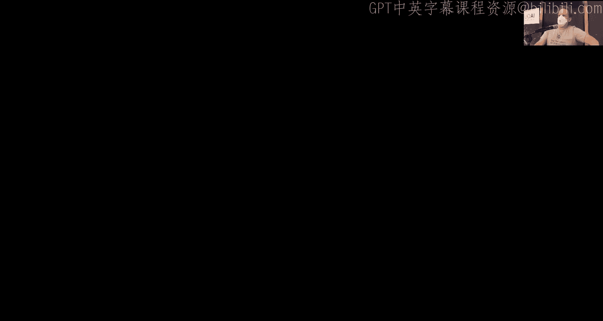
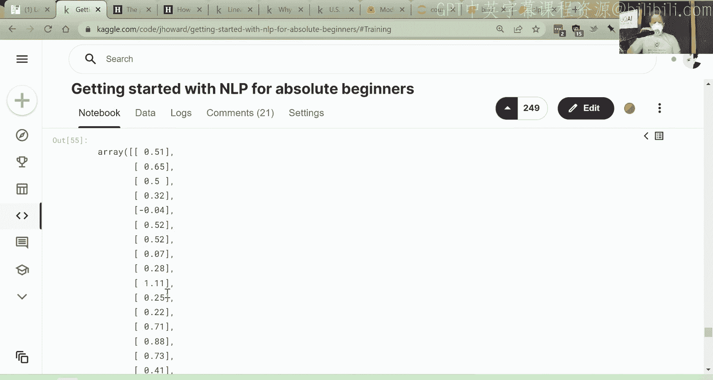

# 深度学习实践课程：4：自然语言处理入门

在本节课中，我们将学习自然语言处理的基础知识，特别是如何使用预训练模型进行微调。我们将使用Hugging Face Transformers库，而不是FastAI库，以便大家能够熟悉不同的深度学习工具。通过本教程，你将学会如何将文本数据转换为模型可以理解的格式，并训练一个模型来解决实际问题。

---

## 概述

自然语言处理是深度学习中的一个重要领域，涉及文本数据的分析和处理。本节课我们将学习如何使用预训练模型进行微调，以解决文本分类问题。我们将通过一个Kaggle竞赛实例，详细讲解数据预处理、模型训练和评估的完整流程。

---

## 什么是预训练模型和微调

上一节我们介绍了深度学习的基本概念，本节中我们来看看预训练模型和微调的具体含义。

预训练模型是一组已经训练好的参数，这些参数在某些任务上已经表现良好。微调是在这些参数的基础上，针对特定任务进行进一步训练的过程。这类似于调整一组滑块，其中一些滑块的位置已经接近最优，而另一些则需要进一步调整。

微调的过程可以总结为以下步骤：
1. 使用大量无标签数据训练一个语言模型。
2. 使用特定领域的数据进一步训练语言模型。
3. 针对具体任务（如分类）微调模型。

---

## 数据预处理

在开始训练模型之前，我们需要对数据进行预处理。以下是数据预处理的主要步骤：

### 1. 加载数据
我们使用Pandas库加载CSV格式的数据文件。Pandas是Python中处理表格数据的核心库之一。

```python
import pandas as pd
df = pd.read_csv('data.csv')
```

### 2. 数据探索
使用`describe`方法查看数据的基本信息，包括唯一值数量、最常见值等。

```python
df.describe(include='object')
```

### 3. 数据格式化
将多个文本字段合并为一个输入字段，以便模型处理。例如，将“锚点”、“目标”和“上下文”字段合并为一个字符串。

```python
df['input'] = 'text1: ' + df['anchor'] + '; text2: ' + df['target'] + '; text3: ' + df['context']
```

---

## 文本转换为数字

神经网络只能处理数字数据，因此我们需要将文本转换为数字。这一过程分为两个步骤：分词和数值化。

### 1. 分词
分词是将文本拆分为更小的单元（如单词或子词）的过程。我们使用Hugging Face的自动分词器，确保与预训练模型的分词方式一致。

```python
from transformers import AutoTokenizer
tokenizer = AutoTokenizer.from_pretrained('model_name')
tokens = tokenizer("good day, folks")
```

### 2. 数值化
数值化是将分词后的单元转换为数字ID的过程。每个唯一的词或子词在词汇表中都有一个对应的ID。

```python
tokenized_data = tokenizer(df['input'].tolist(), padding=True, truncation=True)
```

---

## 训练集、验证集和测试集

在机器学习中，将数据分为训练集、验证集和测试集是非常重要的。训练集用于训练模型，验证集用于调整超参数和评估模型性能，测试集用于最终评估模型的泛化能力。

以下是划分数据集的示例代码：

```python
from datasets import Dataset
dataset = Dataset.from_pandas(df)
split_dataset = dataset.train_test_split(test_size=0.25)
```

---

## 模型训练

我们使用Hugging Face Transformers库中的`Trainer`类来训练模型。以下是训练模型的主要步骤：

### 1. 定义模型
使用自动模型类创建一个适合序列分类的模型。

```python
from transformers import AutoModelForSequenceClassification
model = AutoModelForSequenceClassification.from_pretrained('model_name', num_labels=1)
```

### 2. 配置训练参数
设置训练的超参数，如学习率、批次大小和训练轮数。

```python
from transformers import TrainingArguments
training_args = TrainingArguments(
    output_dir='./results',
    learning_rate=2e-5,
    per_device_train_batch_size=128,
    num_train_epochs=3
)
```

### 3. 创建训练器
将模型、数据和训练参数组合到训练器中。

```python
from transformers import Trainer
trainer = Trainer(
    model=model,
    args=training_args,
    train_dataset=split_dataset['train'],
    eval_dataset=split_dataset['test'],
    compute_metrics=compute_metrics
)
```

### 4. 开始训练
调用`train`方法开始训练模型。

```python
trainer.train()
```

---

## 模型评估

在训练过程中，我们需要评估模型的性能。对于分类任务，常用的评估指标包括准确率和皮尔逊相关系数。

以下是计算皮尔逊相关系数的示例代码：

```python
import numpy as np
from scipy.stats import pearsonr

def compute_metrics(eval_pred):
    predictions, labels = eval_pred
    predictions = predictions.flatten()
    labels = labels.flatten()
    return {'pearson': pearsonr(predictions, labels)[0]}
```

---

## 生成预测结果

训练完成后，我们可以使用模型生成预测结果。以下是生成预测结果的示例代码：

```python
predictions = trainer.predict(test_dataset)
pred_values = predictions.predictions.flatten()
```

---

## 处理异常值

在数据中，异常值可能会影响模型的性能。处理异常值时，不应直接删除，而应深入分析其来源和影响。例如，在加州房价数据集中，异常值可能代表不同类型的住房，需要单独处理。

---

## 自然语言处理的应用与挑战


自然语言处理技术在许多领域都有广泛应用，如情感分析、文本分类和自动生成文本。然而，这些技术也可能被滥用，例如生成虚假信息或操纵舆论。因此，我们需要在利用这些技术的同时，警惕其潜在风险。

---

## 总结





本节课我们一起学习了自然语言处理的基础知识，包括预训练模型的微调、数据预处理、模型训练和评估。通过一个Kaggle竞赛实例，我们详细讲解了如何使用Hugging Face Transformers库解决实际问题。希望这些知识能够帮助你在自然语言处理领域取得进一步进展。