# 深度学习实践课程：5：从零构建线性模型与神经网络


## 概述


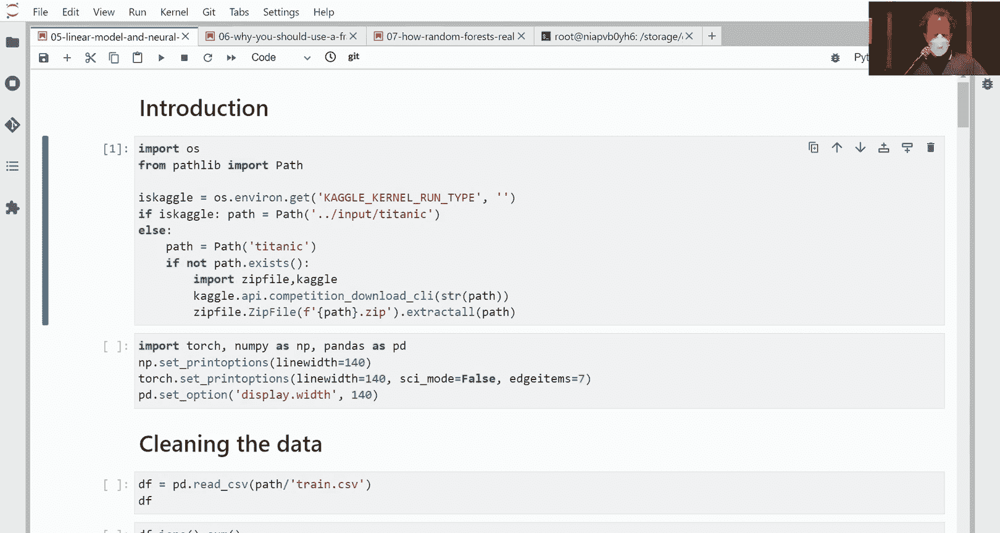

在本节课中，我们将学习如何从零开始，使用Python和PyTorch构建并训练一个线性模型和一个神经网络。我们将以泰坦尼克号数据集为例，涵盖数据预处理、模型构建、训练和评估的全过程。通过本课，你将理解深度学习模型背后的基本原理，并掌握使用PyTorch进行基础建模的技能。

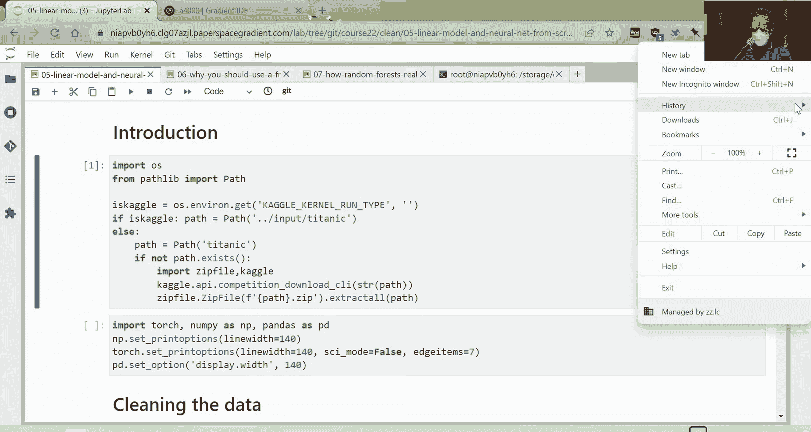

---

## 数据准备与探索

首先，我们需要获取并探索泰坦尼克号数据集。这个数据集包含了每位乘客的信息以及他们是否幸存。

```python
import pandas as pd
import numpy as np
import torch

# 读取数据
df = pd.read_csv('titanic.csv')
print(df.head())
print(df.tail())
print(df.shape)
```

接下来，我们检查数据中是否存在缺失值。

```python
# 检查缺失值
print(df.isna().sum())
```

以下是处理缺失值的步骤：

1.  **识别缺失值**：使用 `df.isna().sum()` 可以统计每列的缺失值数量。
2.  **填充缺失值**：一个简单有效的方法是使用每列的众数（出现频率最高的值）来填充缺失值。

```python
# 获取每列的众数
mode = df.mode().iloc[0]
# 用众数填充缺失值
df.fillna(mode, inplace=True)
# 再次检查缺失值
print(df.isna().sum())
```

对于数值型变量，我们可以使用 `describe` 方法快速了解其分布。

```python
# 描述数值型变量
print(df.describe())
```

我们发现 `Fare`（票价）列呈现长尾分布。对于这类数据，通常取对数可以使其分布更集中。

```python
# 对票价取对数
df['LogFare'] = np.log(df['Fare'] + 1)
```

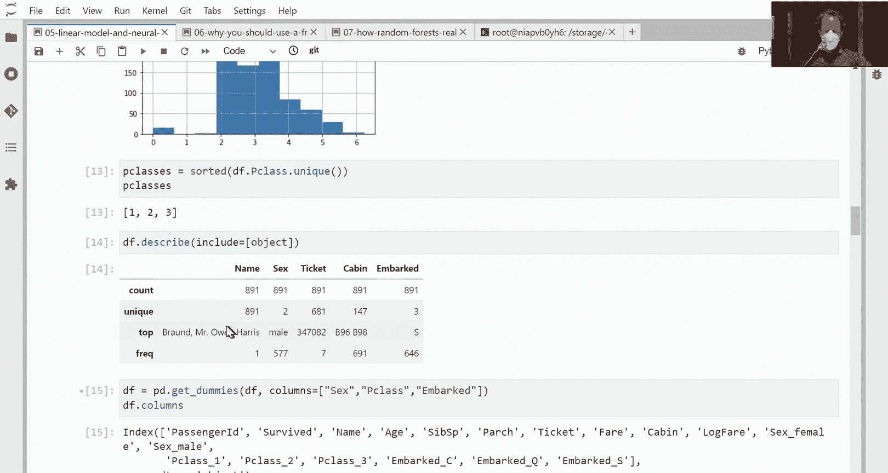

对于分类变量（如 `Sex`、`Embarked`），我们需要将其转换为模型可以处理的数值形式。常用的方法是创建虚拟变量（哑变量）。


```python
# 为分类变量创建虚拟变量
df = pd.get_dummies(df, columns=['Sex', 'Embarked', 'Pclass'])
```

现在，我们已经将数据预处理完毕，可以将其转换为PyTorch张量，以便进行后续计算。

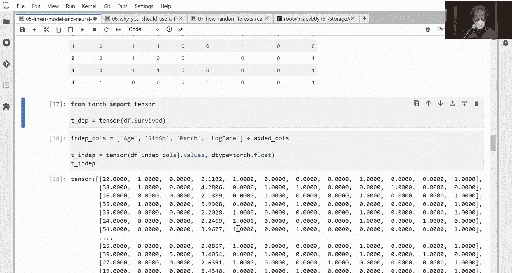

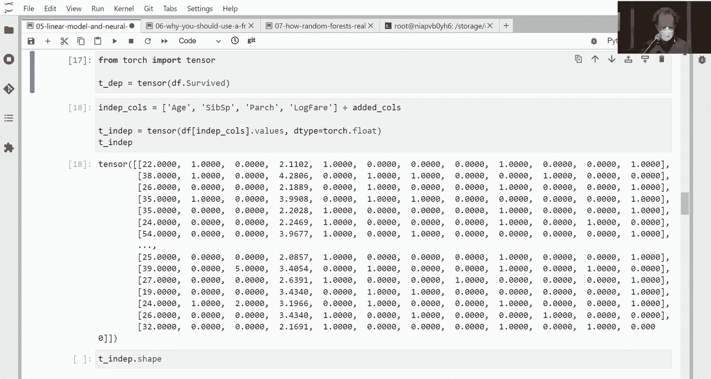

```python
# 定义自变量（特征）和因变量（标签）
indep_vars = ['Age', 'SibSp', 'Parch', 'LogFare'] + [col for col in df.columns if col.startswith(('Sex_', 'Embarked_', 'Pclass_'))]
dep_var = 'Survived'

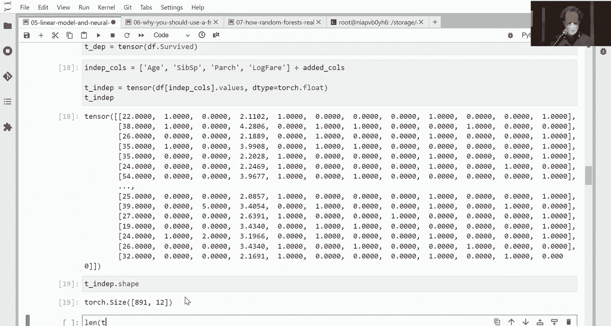

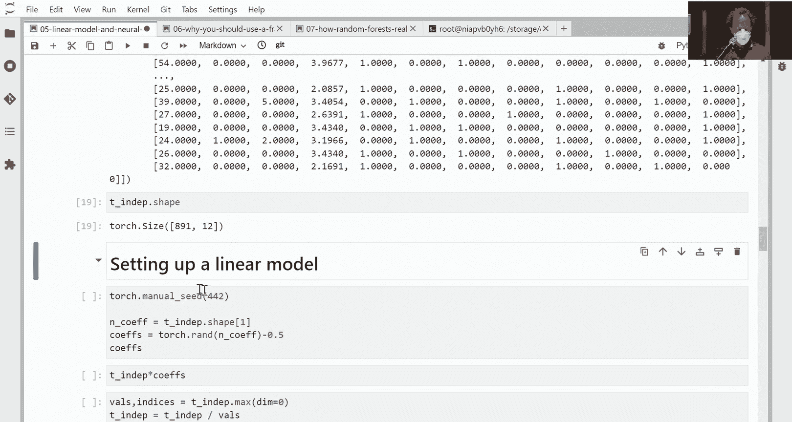

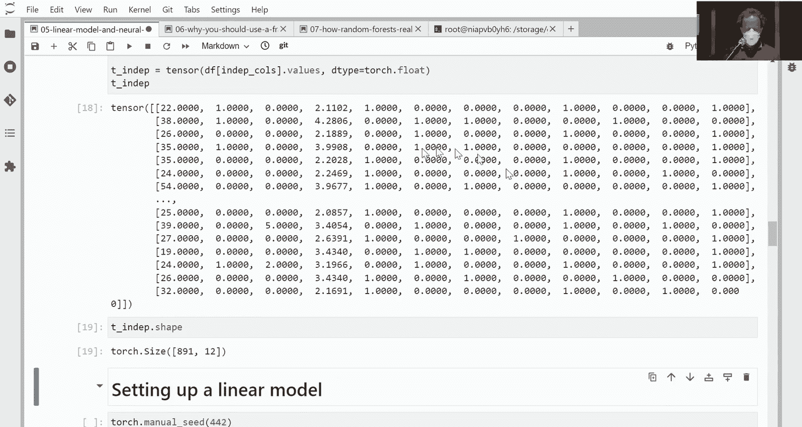

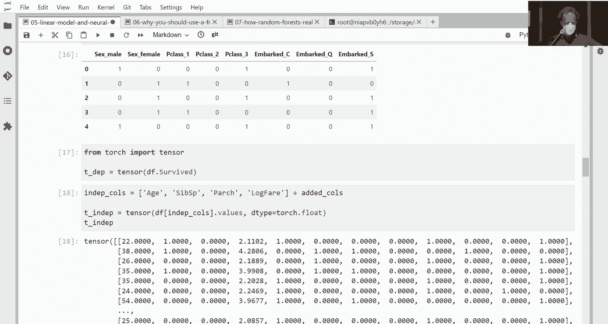


# 转换为PyTorch张量
indep = torch.tensor(df[indep_vars].values, dtype=torch.float)
dep = torch.tensor(df[dep_var].values, dtype=torch.float)
```


---

## 构建线性模型

上一节我们准备好了数据，本节中我们来看看如何构建一个基础的线性模型。线性模型的核心是矩阵乘法。

首先，我们需要初始化模型的系数（权重）。

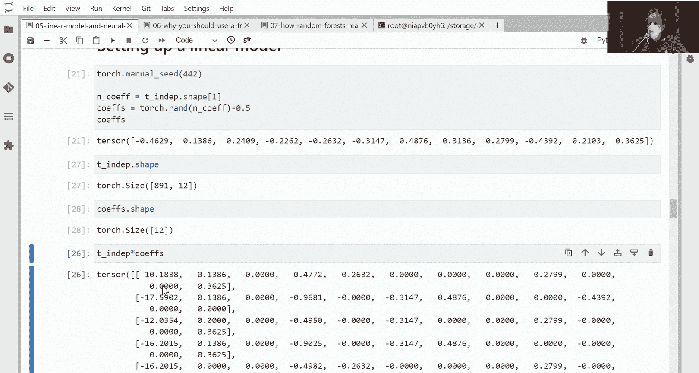


```python
# 初始化随机系数
torch.manual_seed(42) # 设置随机种子以保证结果可复现
coefs = torch.rand(indep.shape[1]) - 0.5
coefs.requires_grad_() # 告诉PyTorch我们需要计算这些系数的梯度
```

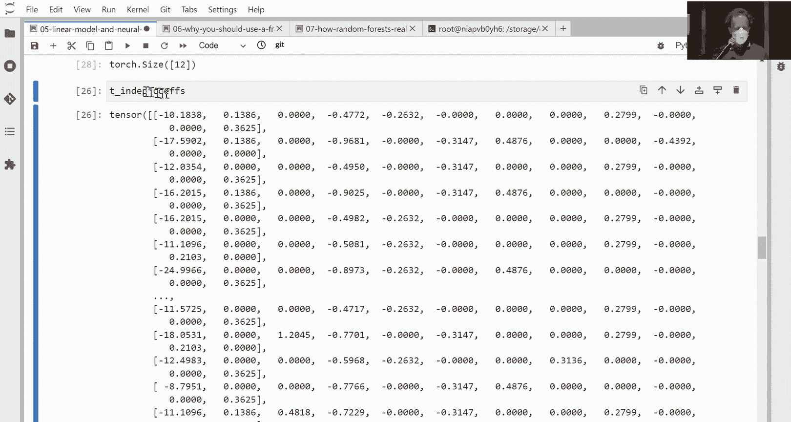


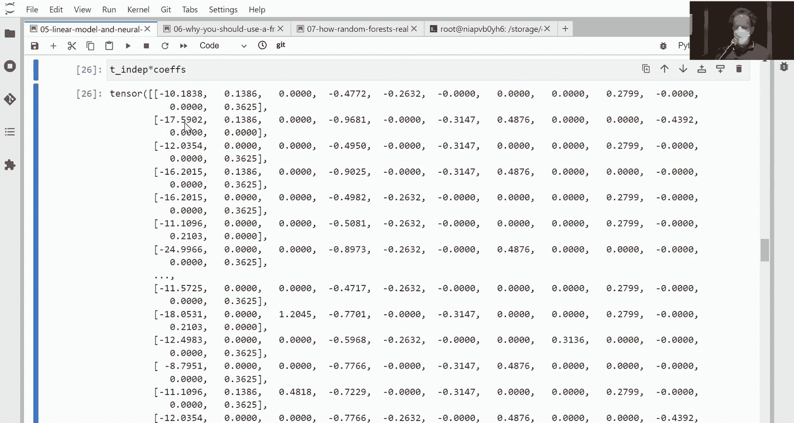

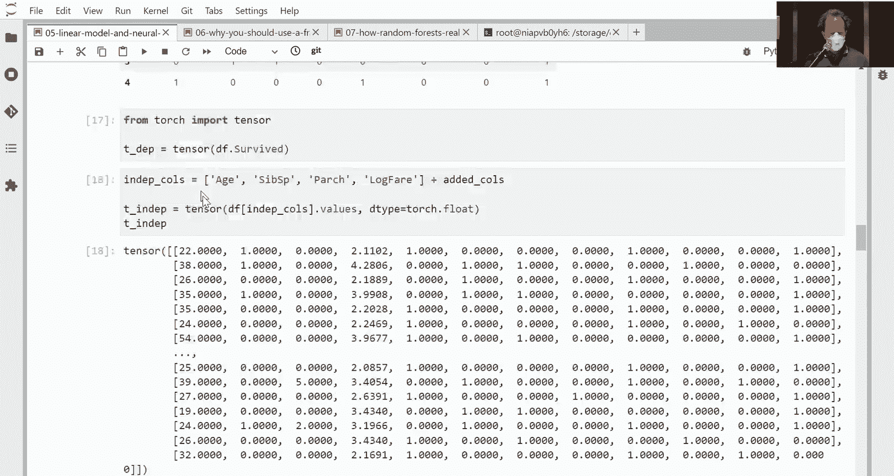

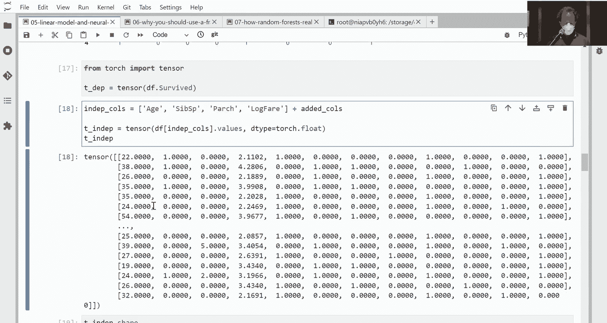

为了优化过程更稳定，我们通常需要对特征进行归一化处理。

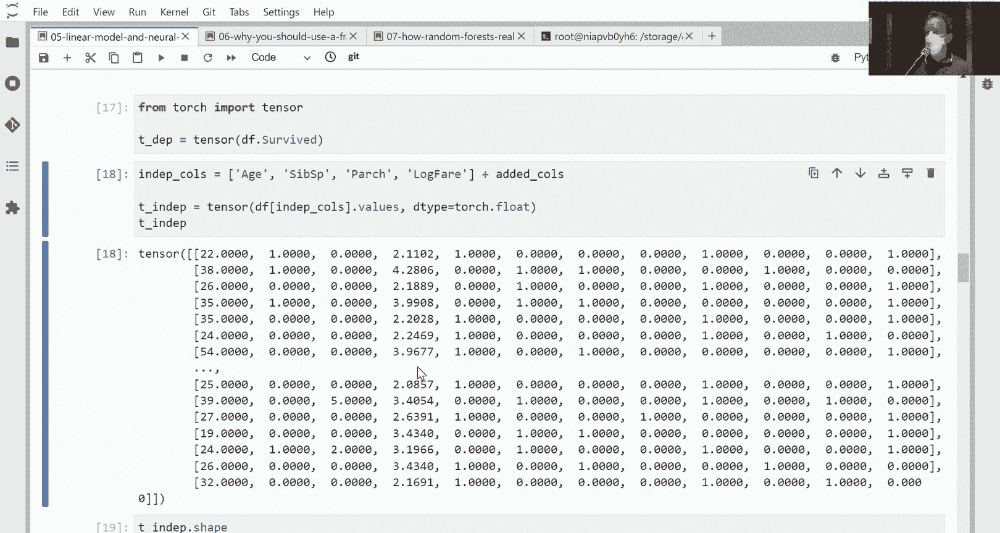

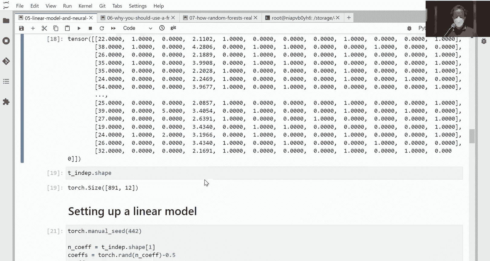


```python
# 特征归一化（除以最大值）
indep_max = indep.max(dim=0).values
indep_norm = indep / indep_max
```

现在，我们可以定义模型的前向传播过程，即计算预测值。

```python
def calc_preds(coefs, indep):
    '''计算线性模型的预测值'''
    return indep @ coefs

def calc_loss(coefs, indep, dep):
    '''计算损失（平均绝对误差）'''
    preds = calc_preds(coefs, indep)
    return torch.abs(preds - dep).mean()
```

为了使用梯度下降优化系数，我们需要计算损失函数关于系数的梯度，并更新系数。

```python
def update_coefs(coefs, lr):
    '''根据梯度更新系数'''
    coefs.sub_(coefs.grad * lr)
    coefs.grad.zero_() # 清空梯度，为下一次计算做准备

def one_epoch(coefs, lr):
    '''执行一个训练周期'''
    loss = calc_loss(coefs, indep_norm, dep)
    loss.backward() # 反向传播，计算梯度
    update_coefs(coefs, lr)
    print(f'Loss: {loss:.3f}')
    return loss
```

接下来，我们将数据划分为训练集和验证集，并开始训练模型。

```python
from fastai.data.transforms import RandomSplitter
# 划分训练集和验证集
trn_split, val_split = RandomSplitter(seed=42)(df)
trn_indep, val_indep = indep_norm[trn_split], indep_norm[val_split]
trn_dep, val_dep = dep[trn_split], dep[val_split]

# 训练模型
def train_model(epochs=30, lr=0.01):
    torch.manual_seed(42)
    coefs = (torch.rand(indep_norm.shape[1]) - 0.5).requires_grad_()
    for i in range(epochs):
        one_epoch(coefs, lr)
    return coefs

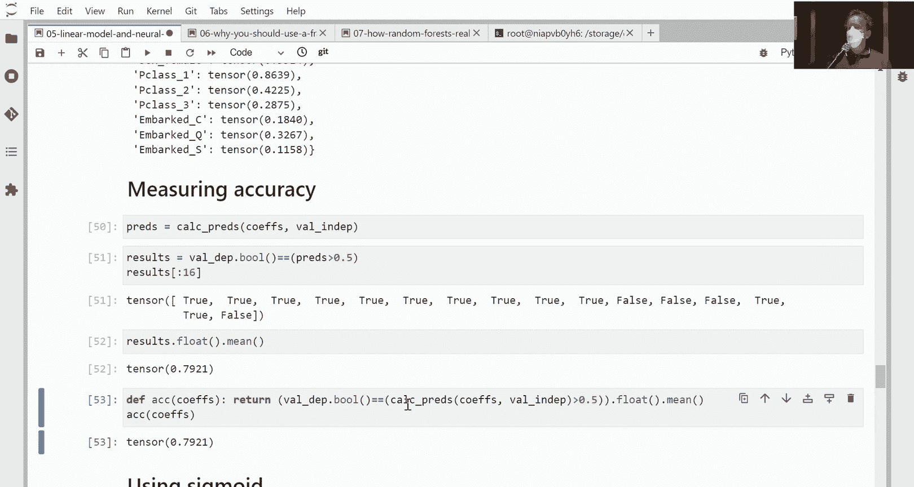

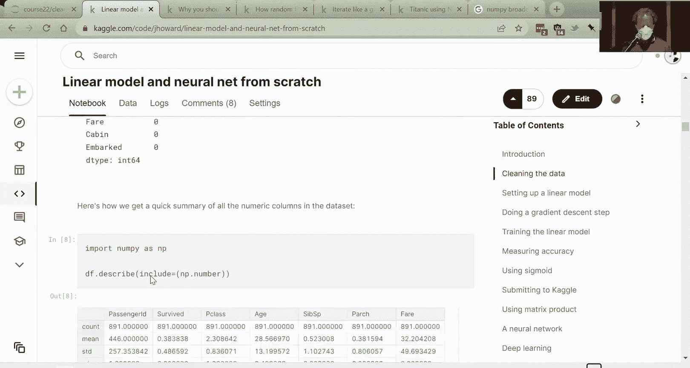

coefs = train_model()
```

训练完成后，我们可以查看每个特征对应的系数，并评估模型在验证集上的准确率。

```python
# 查看系数
for var, coef in zip(indep_vars, coefs.detach()):
    print(f'{var}: {coef:.3f}')

# 计算准确率
def calc_accuracy(coefs, indep, dep):
    preds = calc_preds(coefs, indep) > 0.5
    return (preds == dep).float().mean()

acc = calc_accuracy(coefs, val_indep, val_dep)
print(f'Validation Accuracy: {acc:.3f}')
```

---

## 改进：使用Sigmoid函数

上一节我们构建了基础的线性模型，但它的输出范围没有限制。对于二分类问题（幸存/未幸存），我们希望模型的输出是一个介于0和1之间的概率。本节中我们引入Sigmoid函数来实现这一点。

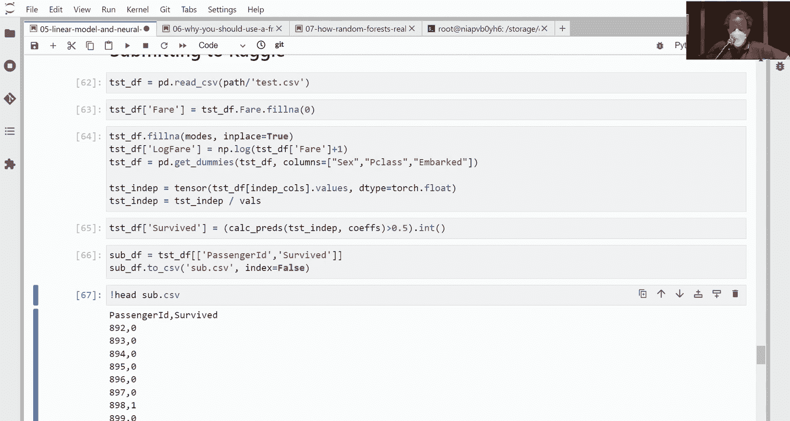

Sigmoid函数的公式为：
`σ(x) = 1 / (1 + e^(-x))`


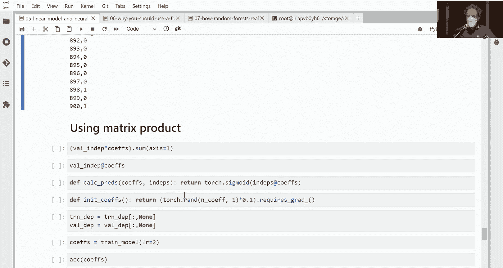


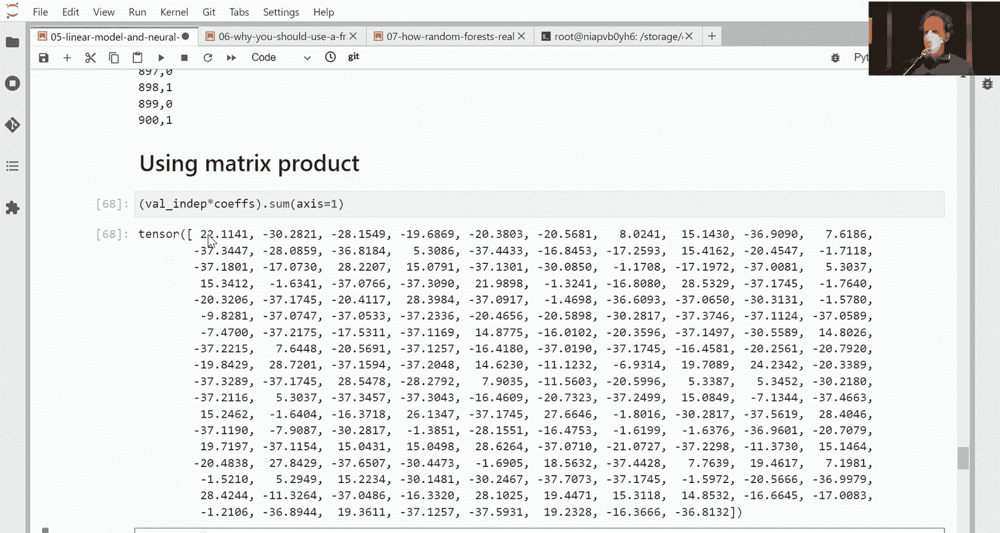

它将任何实数映射到(0, 1)区间。我们只需在原始线性模型的输出上应用Sigmoid函数。

```python
def calc_preds_sigmoid(coefs, indep):
    '''计算应用Sigmoid后的预测值'''
    return torch.sigmoid(indep @ coefs)

def calc_loss_sigmoid(coefs, indep, dep):
    preds = calc_preds_sigmoid(coefs, indep)
    return torch.abs(preds - dep).mean()
```

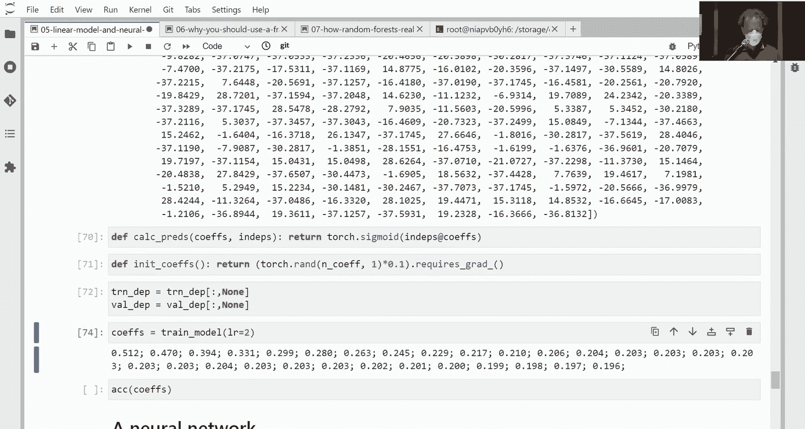

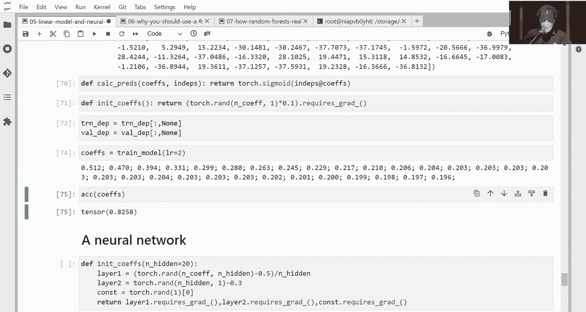

更新训练函数以使用新的预测和损失计算方式。通常，使用Sigmoid后，我们可以使用更大的学习率，模型也更容易优化。


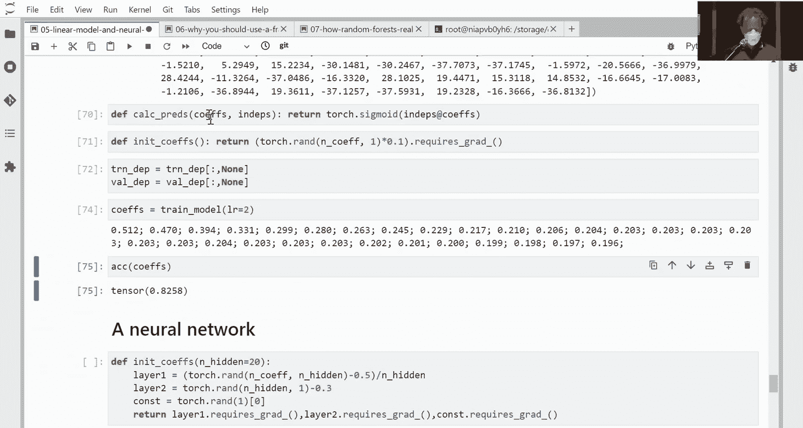


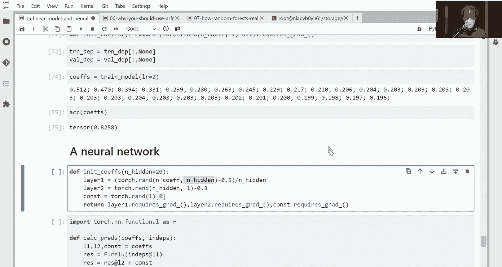


```python
# 使用Sigmoid重新训练
coefs_sigmoid = train_model(lr=0.5) # 学习率可以增大
acc_sigmoid = calc_accuracy(coefs_sigmoid, val_indep, val_dep)
print(f'Validation Accuracy with Sigmoid: {acc_sigmoid:.3f}')
```

---

## 构建神经网络

线性模型是神经网络的基础。本节中，我们将扩展思路，构建一个包含隐藏层的简单神经网络。神经网络通过在层与层之间引入非线性激活函数（如ReLU），能够学习更复杂的模式。

首先，我们需要初始化更多层的系数。

```python
def init_coefs(n_hidden=20):
    # 第一层系数：从输入层到隐藏层
    l1 = (torch.rand(indep.shape[1], n_hidden) - 0.5) / n_hidden
    # 第二层系数：从隐藏层到输出层
    l2 = (torch.rand(n_hidden, 1) - 0.5) * 0.1
    # 输出层常数项
    const = torch.rand(1) - 0.5
    # 为所有参数设置需要梯度
    l1.requires_grad_()
    l2.requires_grad_()
    const.requires_grad_()
    return l1, l2, const
```

接下来，定义神经网络的前向传播过程。

```python
def calc_preds_nn(coefs, indep):
    l1, l2, const = coefs
    # 第一层：线性变换 + ReLU激活
    res = indep @ l1
    res = res.clamp_min(0) # ReLU: 将负数置为0
    # 第二层：线性变换 + Sigmoid激活
    res = res @ l2 + const
    return torch.sigmoid(res).squeeze() # 压缩维度以匹配标签形状

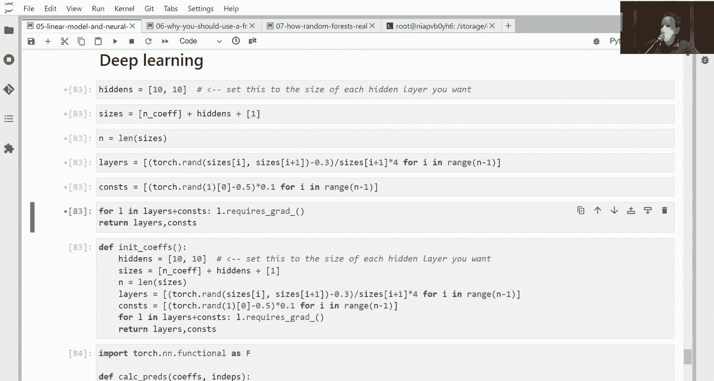

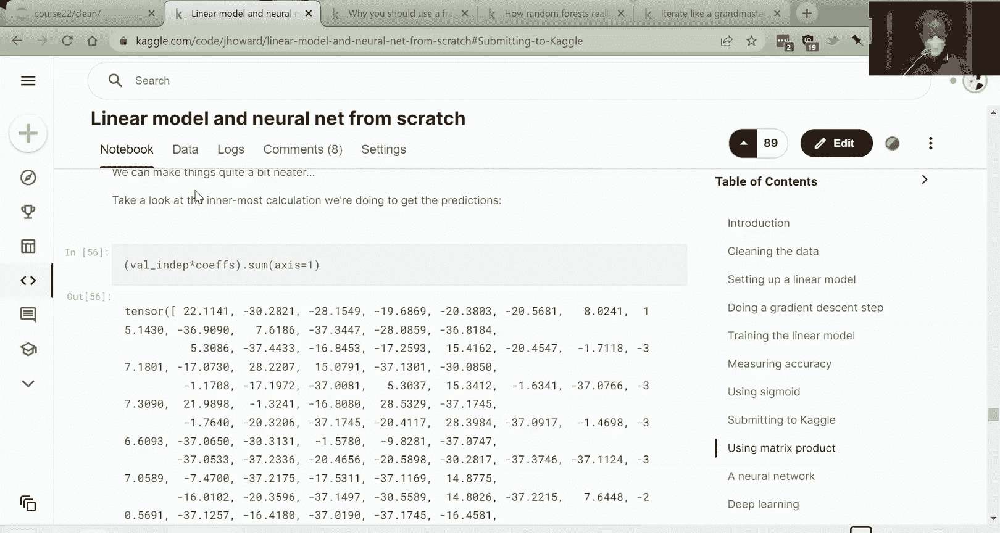

def calc_loss_nn(coefs, indep, dep):
    preds = calc_preds_nn(coefs, indep)
    return torch.abs(preds - dep).mean()
```


更新系数时，我们需要遍历所有层。

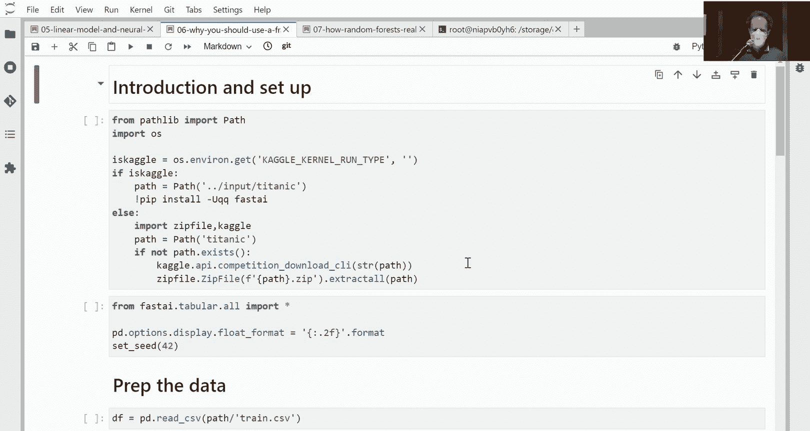


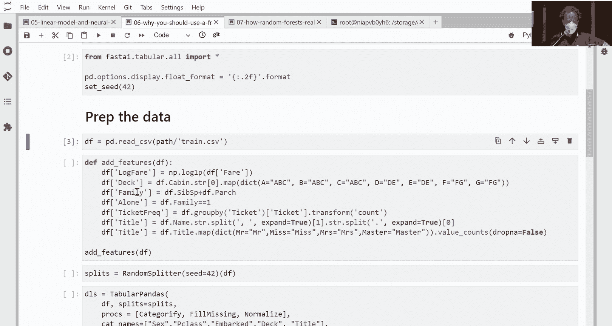

```python
def update_coefs_nn(coefs, lr):
    for coef in coefs:
        coef.sub_(coef.grad * lr)
        coef.grad.zero_()
```


现在，我们可以训练这个神经网络了。

```python
def train_nn(epochs=30, lr=0.01, n_hidden=20):
    torch.manual_seed(42)
    coefs = init_coefs(n_hidden)
    for i in range(epochs):
        loss = calc_loss_nn(coefs, trn_indep, trn_dep)
        loss.backward()
        update_coefs_nn(coefs, lr)
        if i % 5 == 0:
            print(f'Epoch {i}: Loss = {loss:.3f}')
    return coefs

coefs_nn = train_nn()
acc_nn = calc_accuracy(lambda c, i: calc_preds_nn(c, i) > 0.5, coefs_nn, val_indep, val_dep)
print(f'Neural Network Validation Accuracy: {acc_nn:.3f}')
```

---

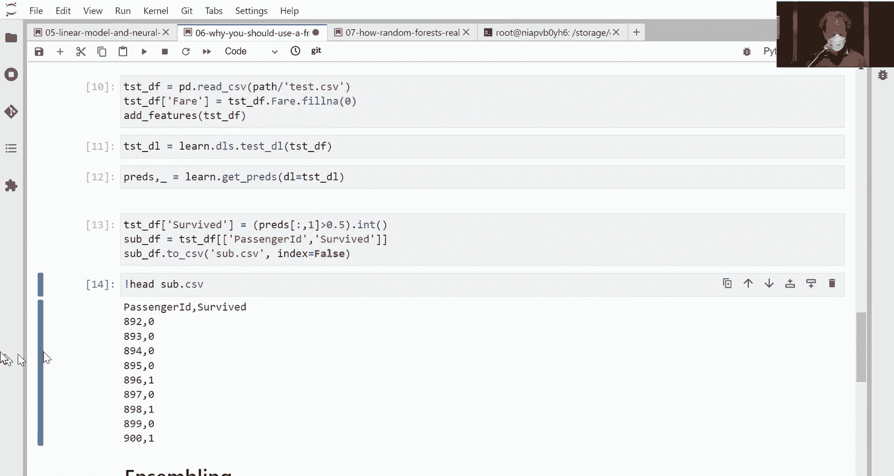


## 使用FastAI简化流程

从零构建模型有助于理解原理，但在实际项目中，使用高级框架可以极大提升效率。本节中，我们使用FastAI库来快速构建并训练一个表格数据模型。

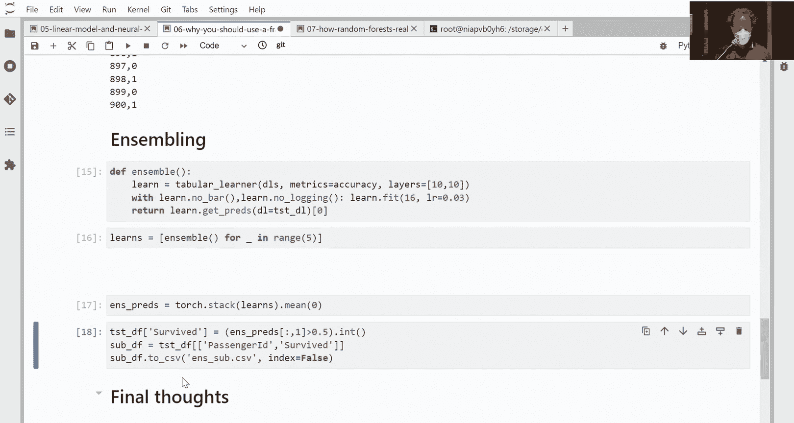

FastAI自动处理了许多繁琐的步骤，如缺失值填充、分类变量编码、数据分割等。


```python
from fastai.tabular.all import *
# 定义预处理步骤
procs = [Categorify, FillMissing, Normalize]
# 定义分类变量和连续变量
cat_vars = ['Pclass', 'Sex', 'Embarked']
cont_vars = ['Age', 'SibSp', 'Parch', 'Fare']
# 创建数据加载器
dls = TabularDataLoaders.from_df(df, path='.', procs=procs,
                                 cat_names=cat_vars, cont_names=cont_vars,
                                 y_names='Survived', splits=RandomSplitter(seed=42)(df))
# 创建学习器并寻找合适的学习率
learn = tabular_learner(dls, layers=[10,10], metrics=accuracy)
learn.lr_find()
# 训练模型
learn.fit_one_cycle(5, lr_max=0.03)
```

使用FastAI，我们可以轻松进行预测并提交结果。

```python
# 对测试集进行预测
test_df = pd.read_csv('test.csv')
# 应用相同的预处理
test_dl = learn.dls.test_dl(test_df)
preds, _ = learn.get_preds(dl=test_dl)
# 准备提交文件
submission = pd.DataFrame({'PassengerId': test_df['PassengerId'],
                           'Survived': (preds[:,1] > 0.5).int()})
submission.to_csv('submission.csv', index=False)
```

---

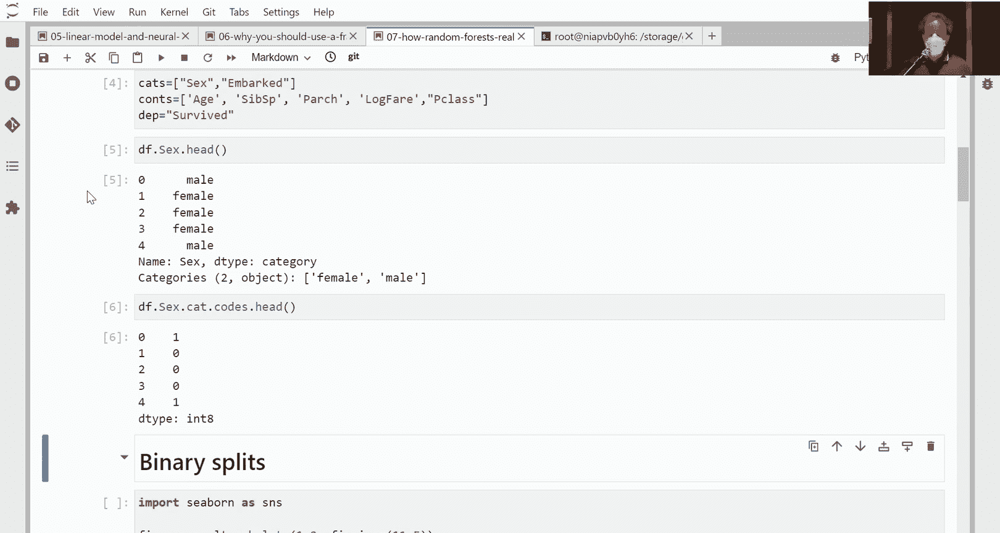

## 模型集成

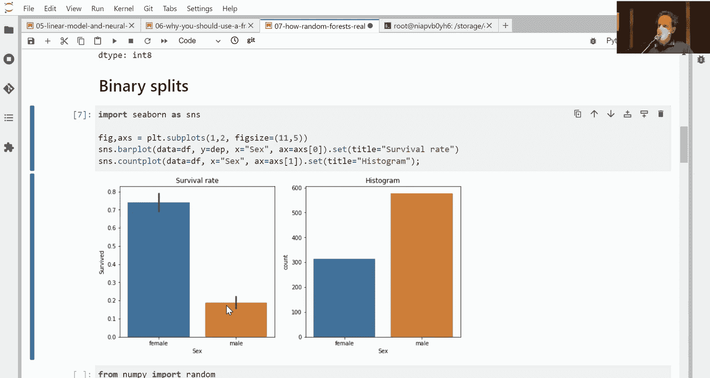

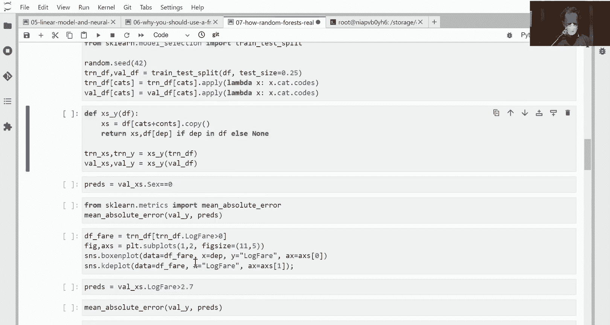

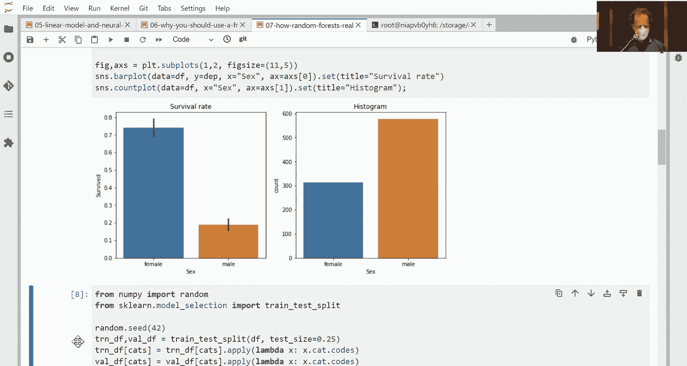

单个模型的性能可能有限。一种提升性能的有效方法是模型集成，即结合多个模型的预测结果。最简单的方法是创建多个相同的模型，使用不同的随机初始化进行训练，然后对它们的预测取平均。

```python
def ensemble(n_models=5):
    all_preds = []
    for i in range(n_models):
        learn = tabular_learner(dls, layers=[10,10], metrics=accuracy)
        learn.fit_one_cycle(5, lr_max=0.03)
        preds, _ = learn.get_preds(dl=test_dl)
        all_preds.append(preds[:,1]) # 取幸存类别的概率
    # 对多个模型的预测取平均
    avg_preds = torch.stack(all_preds).mean(dim=0)
    return avg_preds

ensemble_preds = ensemble()
```

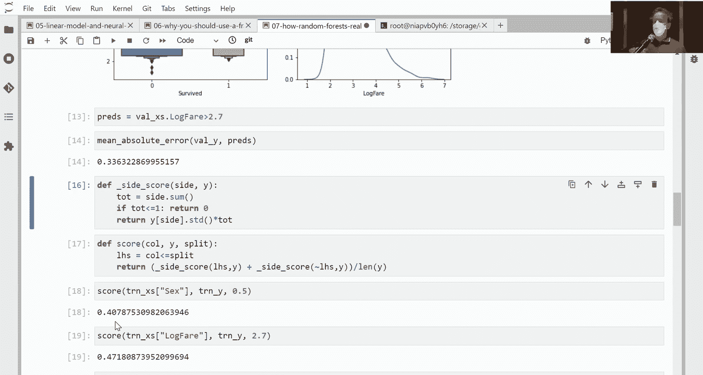

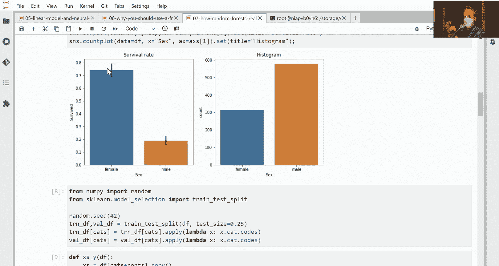

---

## 总结

本节课中我们一起学习了深度学习模型构建的核心流程。我们从泰坦尼克号数据集出发，逐步完成了以下内容：

1.  **数据预处理**：包括处理缺失值、对长尾分布取对数、将分类变量转换为虚拟变量。
2.  **构建线性模型**：从零开始使用PyTorch张量和矩阵乘法实现线性模型，并应用梯度下降进行训练。
3.  **引入Sigmoid函数**：改进模型，使其输出符合二分类问题的概率形式。
4.  **构建神经网络**：增加了隐藏层和ReLU激活函数，构建了更复杂的模型。
5.  **使用FastAI库**：利用高级框架简化了整个建模流程，包括自动预处理和便捷的训练接口。
6.  **模型集成**：通过组合多个模型的预测来提升最终性能。

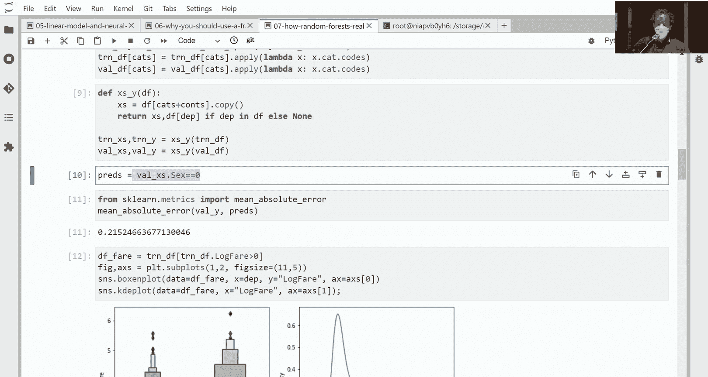

通过本课，你不仅理解了线性模型和神经网络的基本原理，也掌握了从零实现和使用高级工具链的两种实践路径。这些技能是构建更复杂深度学习项目的坚实基础。