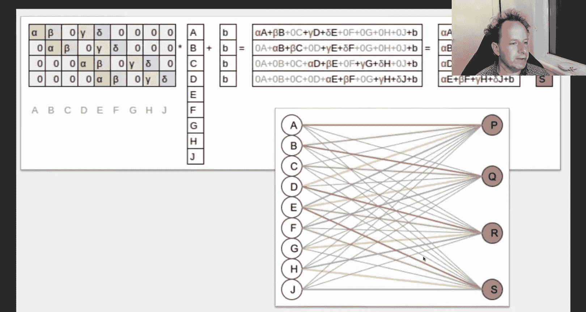
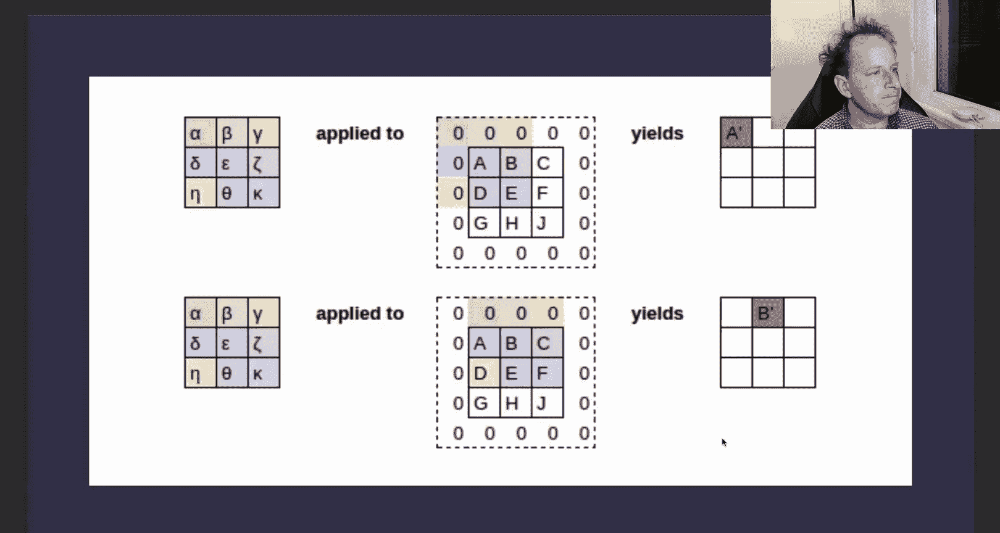
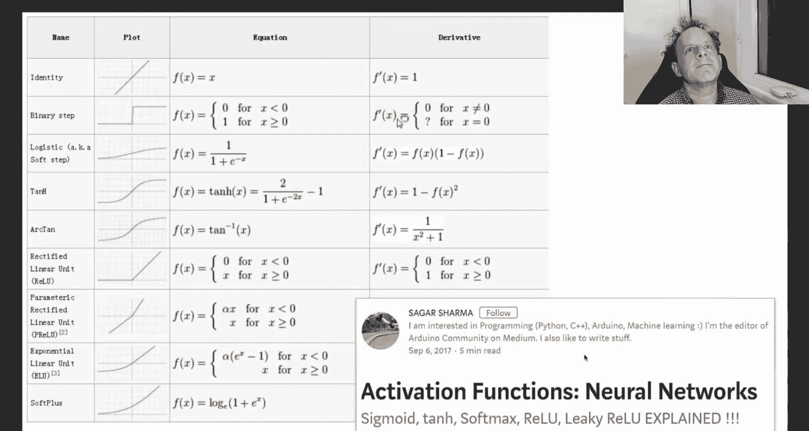
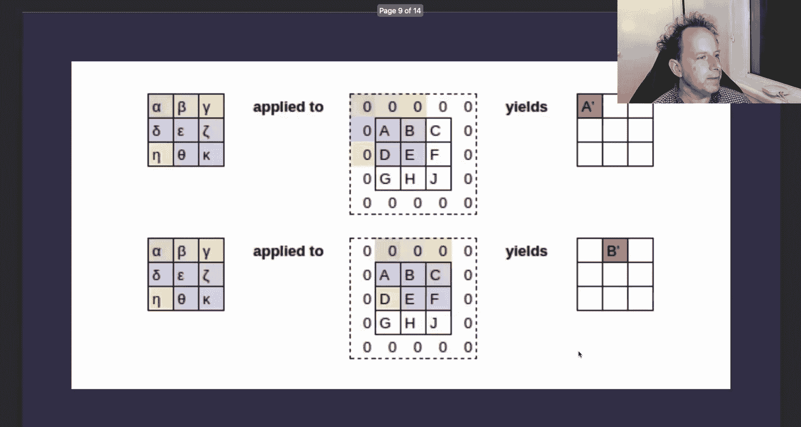
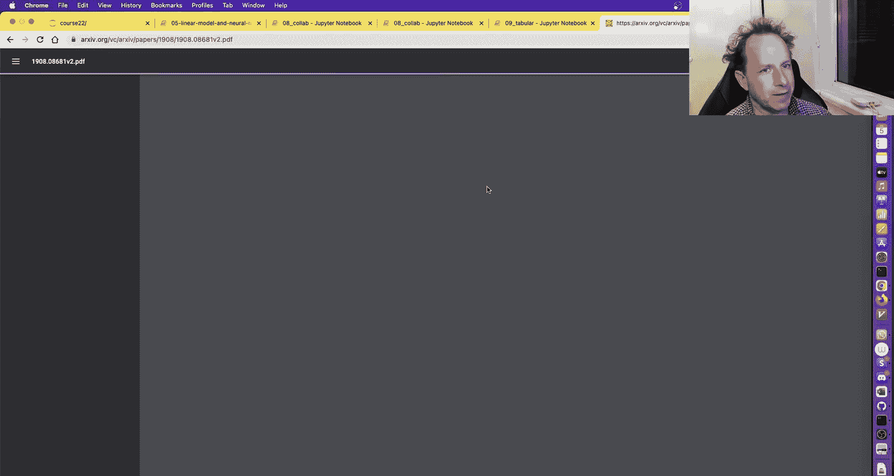
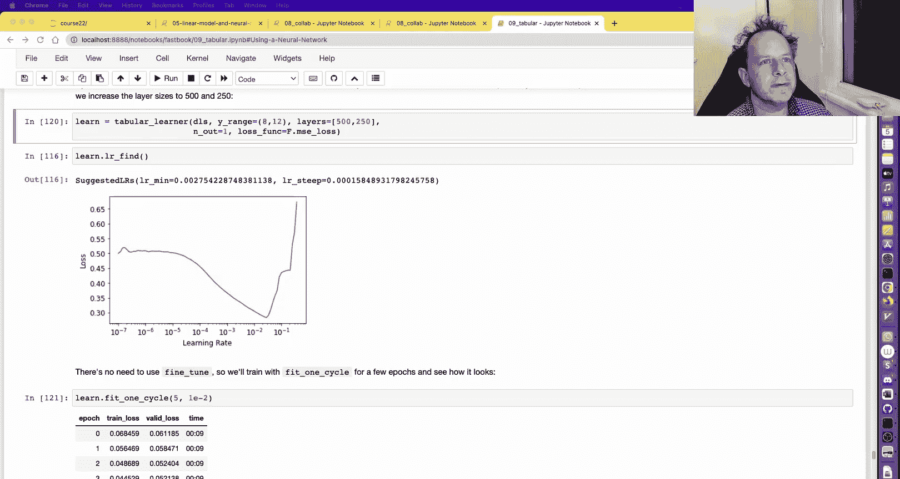

# 深度学习实践课程：8：协作过滤、嵌入与卷积神经网络 🧠

在本节课中，我们将学习协作过滤的底层实现、嵌入（Embedding）的概念及其在多种模型中的应用，并深入探讨卷积神经网络（CNN）的基本原理。我们将看到，这些看似复杂的模型背后，其实都基于一些简单而统一的核心思想。

---

## 协作过滤与自定义嵌入模块

上一节我们介绍了协作过滤的基本概念。本节中，我们来看看如何从零开始构建一个嵌入模块，以深入理解其工作原理。

在PyTorch中，我们无需手动跟踪和更新模型的所有系数（参数）。PyTorch的`nn.Module`会自动识别并管理这些参数。关键在于，任何我们希望被优化器更新的张量，都需要包装在`nn.Parameter`类中。

以下是一个自定义嵌入模块的示例，它模拟了协作过滤中的用户和物品嵌入：

```python
class DotProduct(Module):
    def __init__(self, n_users, n_movies, n_factors):
        self.user_factors = nn.Parameter(torch.randn(n_users, n_factors) * 0.01)
        self.user_bias = nn.Parameter(torch.zeros(n_users))
        self.movie_factors = nn.Parameter(torch.randn(n_movies, n_factors) * 0.01)
        self.movie_bias = nn.Parameter(torch.zeros(n_movies))

    def forward(self, x):
        users = self.user_factors[x[:,0]]
        movies = self.movie_factors[x[:,1]]
        res = (users * movies).sum(dim=1)
        res += self.user_bias[x[:,0]] + self.movie_bias[x[:,1]]
        return sigmoid_range(res, 0.5, 5.5)
```

在这个模块中：
*   `user_factors` 和 `movie_factors` 是嵌入矩阵。
*   `user_bias` 和 `movie_bias` 是偏置项。
*   `forward` 方法执行点积运算并加上偏置，最后通过`sigmoid`函数将输出限制在一定范围内。

训练这个模型后，我们可以分析其学到的参数。例如，检查`movie_bias`，数值最低的电影通常被认为是“糟糕”的电影，而数值最高的电影则是普遍受欢迎或超出预期的好电影。

我们还可以对`movie_factors`这个高维嵌入矩阵进行主成分分析（PCA），将其降维并可视化。结果常常显示，模型自动学会了根据电影风格（如主流流行片、批判性剧情片、动作科幻片、对话驱动片等）对电影进行有意义的聚类，尽管我们从未提供过任何类型标签。

FastAI库提供了`CollabLearner`来简化这个过程，其底层实现与我们自定义的模块非常相似。

---

## 从点积到深度神经网络

除了简单的点积模型，我们还可以使用深度神经网络进行协作过滤。其核心思想是将用户嵌入和物品嵌入拼接起来，然后输入到一个多层神经网络中。

以下是构建此类模型的一种方式：

```python
class CollabNN(Module):
    def __init__(self, user_sz, item_sz, n_act=50):
        self.user_factors = Embedding(*user_sz)
        self.item_factors = Embedding(*item_sz)
        self.layers = Sequential(
            nn.Linear(user_sz[1]+item_sz[1], n_act),
            nn.ReLU(),
            nn.Linear(n_act, 1)
        )

    def forward(self, x):
        users = self.user_factors(x[:,0])
        items = self.item_factors(x[:,1])
        x = torch.cat([users, items], dim=1)
        return self.layers(x)
```

在实际应用中，可以结合点积模型和神经网络模型，或者加入用户和物品的元数据（如年龄、性别、电影类型等），以提升推荐效果。

---

## 嵌入的通用性：超越协作过滤

嵌入的概念不仅限于协作过滤，它在自然语言处理（NLP）和表格数据建模中同样至关重要。

在NLP中，我们将词汇表中的每个单词映射为一个整数ID，然后通过一个嵌入矩阵将其转换为密集向量表示。这个嵌入矩阵是可学习的参数，其每一行对应一个单词的向量。

在表格数据建模中，对于分类变量，我们同样为其创建嵌入。FastAI的`TabularLearner`会自动为所有分类列创建嵌入层，并将它们与连续变量拼接后，输入到一个标准的多层神经网络中。

一个有趣的发现是，模型学到的嵌入常常具有可解释的结构。例如，在一个预测商店销售额的模型中，德国各地区学到的嵌入向量在空间中的接近程度，与实际地理位置的接近程度高度相关。同样，星期几和月份学到的嵌入也符合我们的直觉认知（如工作日聚集在一起，周末聚集在一起）。这表明模型从数据中自动发现了有意义的潜在模式。

---

## 卷积神经网络（CNN）揭秘

现在，让我们转向计算机视觉的核心——卷积神经网络。我们将看到，卷积本质上也是一种特殊的矩阵运算。

卷积操作使用一个称为“滤波器”或“核”的小矩阵（例如3x3），在输入图像上滑动。在每个位置，计算滤波器与对应图像区域元素的点积，从而生成一个新的特征图。

例如，一个特定的3x3滤波器 `[[1,1,1],[0,0,0],[-1,-1,-1]]` 可以用于检测水平边缘。当它滑过图像时，在水平边缘处会产生高激活值。

在深度CNN中，我们会堆叠多个卷积层。每一层的输入可能具有多个“通道”（如第一层是RGB三个通道，后续层是多个特征图通道）。因此，滤波器也变成三维的（例如3x3xC_in），其输出是多个新的特征图通道（C_out）。









传统CNN架构中，卷积层后常接“池化层”（如2x2最大池化），以逐步降低特征图的空间尺寸。现代架构则更常使用“步幅为2的卷积”来替代池化层，实现下采样。

网络的末端，通常会通过全局平均池化（或最大池化）将空间特征图转换为一个向量，再通过全连接层输出最终预测。FastAI采用了“连接池化”，即同时使用平均池化和最大池化并将结果拼接，以获取更丰富的特征。

重要的是，卷积运算可以被重新表述为一种特殊的矩阵乘法，其中权重矩阵具有大量固定的零值和重复的权重。这帮助我们理解，CNN的核心仍然是矩阵乘法和激活函数的组合。


---

## 正则化技术：Dropout







为了防止神经网络过拟合，我们使用一种名为“Dropout”的正则化技术。它在训练过程中，随机将一部分神经元的激活值置为零。

这可以看作是对“激活值”进行的数据增强。它迫使网络不能依赖于任何单个神经元或特征，必须学习更鲁棒、更通用的表示。Dropout的比例是一个超参数，需要在模型泛化能力和训练性能之间取得平衡。

---

## 总结与后续步骤

本节课中我们一起学习了：
1.  **协作过滤的底层实现**：如何从零创建嵌入模块，并解释学到的偏置和潜在因子。
2.  **嵌入的通用性**：在NLP和表格数据中，嵌入是如何将分类变量转换为连续向量的，并且这些向量常包含可解释的语义。
3.  **卷积神经网络的核心**：卷积是滑动窗口的点积操作，是处理图像等网格数据的有力工具，其本质仍是矩阵运算。
4.  **关键组件**：了解了Dropout等正则化技术的工作原理。

现在你已经对多种神经网络的内部机制有了扎实的理解。它们都建立在输入表示、矩阵乘法/卷积、激活函数、输出调整和损失函数这些核心组件之上。

**接下来该做什么？**
*   **实践与巩固**：重新观看课程视频并动手编写代码，尝试完成所有练习。
*   **参与社区**：在FastAI论坛上帮助他人，阅读他人的项目和成功故事。
*   **组建学习小组**：与他人一起学习，讨论问题。
*   **开展个人项目**：将所学知识应用到感兴趣的问题上。
*   **阅读**：推荐阅读《元学习》等相关书籍，学习如何更高效地学习。
*   **保持动力**：专注于一个细分领域，深入钻研。请记住，这个领域的基础变化并不快，强大的理解和扎实的基础比追逐每一个新潮流更重要。你完全可以使用单个GPU解决大量有实际价值的问题。

感谢你的学习，期待在第二部分课程中与你再见！