# 深度学习基础到稳定扩散模型：1：课程介绍与稳定扩散初探 🚀

在本节课中，我们将学习稳定扩散模型的基本概念，并通过实际操作快速体验其图像生成能力。课程分为两部分：首先，我们将动手使用稳定扩散模型生成图像；其次，我们将深入探讨其背后的工作原理，为后续从零构建打下基础。

## 课程背景与定位

本课程是“程序员实用深度学习”系列的第二部分，名为“深度学习基础到稳定扩散模型”。虽然这里标注为第9课，但这是因为第一部分有8节课，所以这是第二部分的第1课。您无需担心错过任何内容。

本课程的重点不在于教授如何用深度学习完成“重要”任务，而是专注于生成模型等有趣的应用，并深入理解许多细节。这些细节对于日常使用可能不是必需的，但如果您想成为一名研究者，或者需要部署具有复杂定制需求的生产系统，学习这些细节将非常有帮助。

## 课程结构与学习方法

本节课将分为两个部分：
1.  快速上手使用稳定扩散模型，因为大家都迫不及待地想尝试它。
2.  详细描述其工作原理。由于需要几节课才能从头讲清楚，本次会进行一些概括性的介绍，但希望您能对本课结束时对整个过程有一个合理的、直观的理解。

本课程会尝试解释所有内容。如果您之前没有深度学习经验，学习起来会非常困难，但我会尽量解释大致发生了什么以及在哪里可以找到更多信息。我强烈建议在学习本课程之前先完成第一部分，除非您想挑战自己。如果您没有完成第一部分，但对深度学习基础有合理的了解（例如，能用Python编写基本的SGD循环，会使用PyTorch或TensorFlow，了解嵌入等基本概念），那么您可能也能跟上。

一般来说，对于这些课程，大多数人会观看视频几遍，第二遍时通常会暂停并查阅不熟悉的内容。我们预计每节课大约需要10小时的学习时间，但有些人会投入更多时间深入研究。

## 快速上手：玩转稳定扩散

现在，让我们开始动手实践。第一部分我们将玩转稳定扩散模型。

### 快速发展的领域

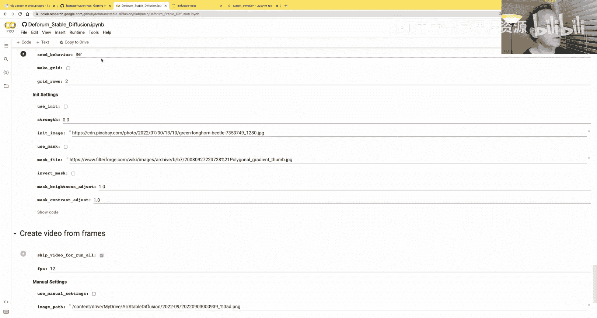

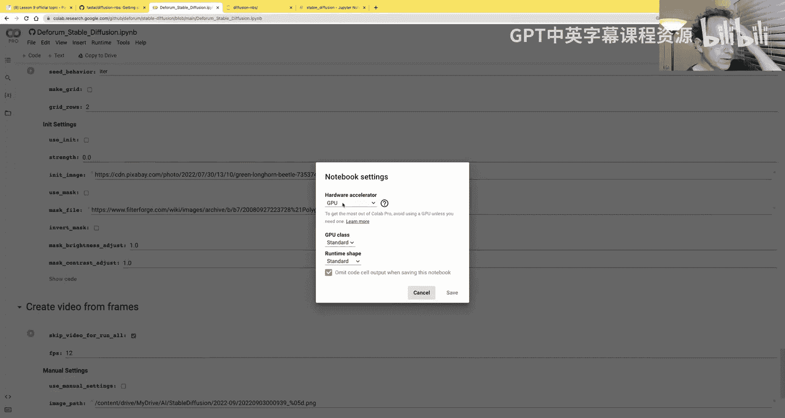

我尽可能晚地准备材料，以免过时，但不幸的是，就在12小时前，它又过时了。这就是我要描述的部分（即如何使用稳定扩散以及具体细节如何工作）面临的一大问题：它发展得太快了。我今天要描述的所有细节和要展示的所有软件，到您观看时可能已经改变。

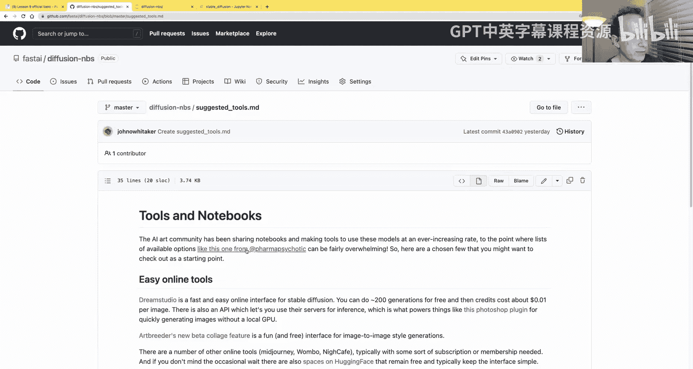

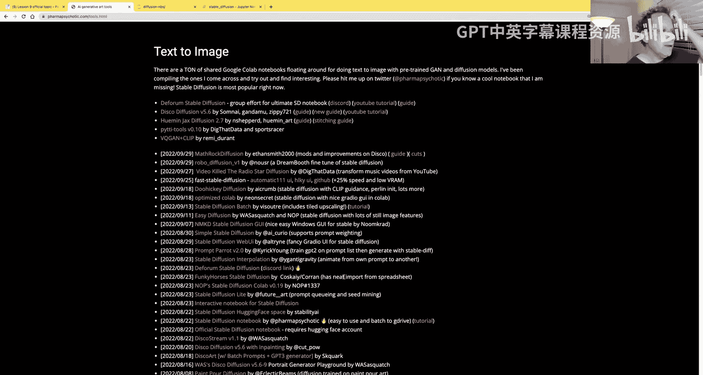

例如，就在昨晚，有两篇新论文发布。我原本要告诉您的是，进行稳定扩散生成所需的步骤数已从1000步减少到约40-50步。但昨晚的论文说现在已降至4步，速度提高了256倍。另一篇论文则提出了另一种正交的方法，使其速度再提高10到20倍。事情非常令人兴奋，发展非常迅速。

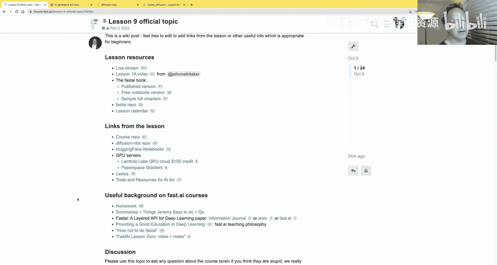

不过别担心，在本课之后，我们将从基础开始学习，这意味着我们将学习所有这些模型是如何构建起来的。这些基础内容几乎不会改变。事实上，我们将看到的内容与我们在2019年做的另一门课程非常相似，因为基础不会改变。一旦您掌握了基础，您就能理解这些论文中的细节，并跟上研究，甚至进行自己的研究。

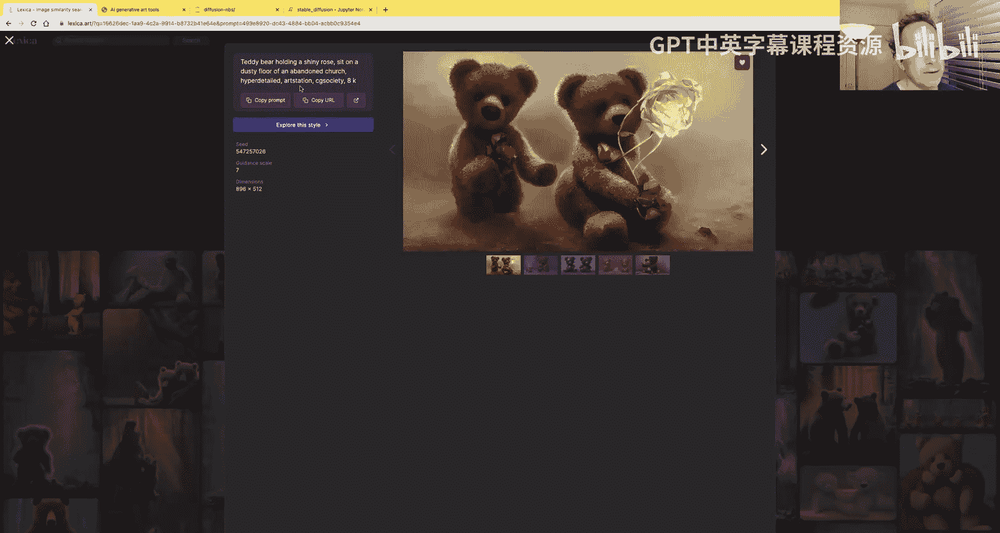

### 社区资源与工具

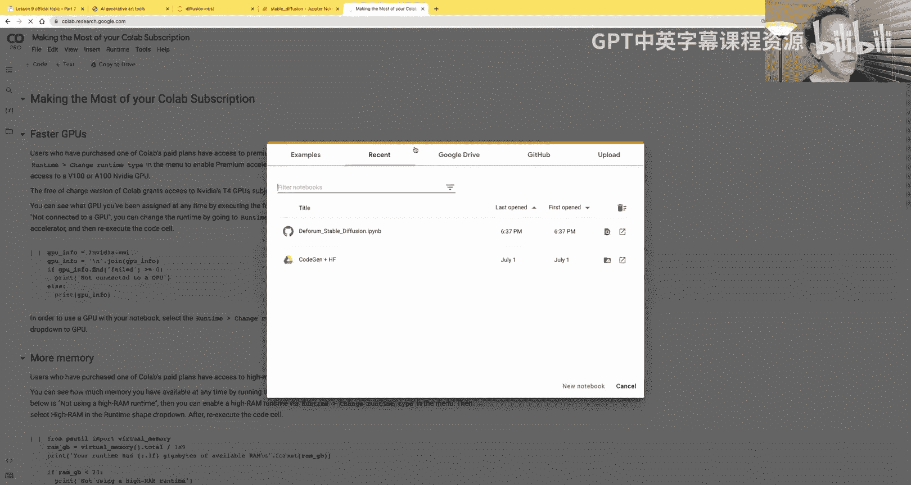

本课程与以往课程的一个不同之处在于，由于领域发展太快，我需要大量帮助才能勉强跟上进度。我今天展示的所有内容都深受这些杰出人士的高度影响，他们都是Fast.ai的校友。

为了充分利用本课程，请务必访问 course.fast.ai 获取所有材料（包括每节课的Notebook链接和详细信息）。如果您想深入探索，请访问论坛 forum.fast.ai，在“Part 2 2022”类别下，点击“关于课程”按钮。您会找到每节课的聊天区，里面有更多资料。请仔细查看这些内容，以帮助您理解视频。同时，查看下面的问题和答案，了解大家的讨论。当讨论变得庞大时，您可以点击“总结”按钮，只查看最受欢迎的帖子。这些都是获取课程最大价值的重要资源。

### 计算资源

完成第二部分需要比第一部分更多的计算资源。计算选项正在迅速变化。目前，由于稳定扩散的巨大流行，许多人开始使用Colab，而Colab的回应是对大多数使用情况开始按小时收费。如果您是Colab用户，可能会发现他们不再提供像样的GPU，或者升级后限制了使用时长。目前，仍然可以尝试Colab，免费版本能提供一些不错的资源。

我强烈建议也尝试一下Paperspace Gradient，目前每月支付约9美元就能获得相当不错的GPU，或者支付更多以获得更好的GPU。但这一切都可能发生很大变化，请访问 course.fast.ai 查看我们当前的最新推荐。

Lambda Labs和Jarvis Labs也是不错的选择。Jarvis由课程校友创建，提供价格非常合理的优质选项，许多Fast.ai学生使用并喜爱它。Lambda Labs是本页面上最新的提供商，他们正在快速添加新功能。我特别提到他们，是因为至少在我录制时（2022年10月初），他们是提供您可能想用来运行大型模型的GPU的最便宜供应商。但这一切都可能改变，所以请查看最新的推荐。

另外，在2022年底，GPU价格已经下降了很多，您可能考虑购买自己的机器。

### 开始实践：使用扩散模型Notebook

现在，我们将跳转到Notebook。我们链接了一个名为“diffusion-nbs”的仓库。这不是主要的课程Notebook，而是一些您可以尝试的有趣内容的Notebook。

Jonathan Whitaker（我常称他为Jonno）创建了一个名为“suggested-tools.md”的有趣文件，希望他能保持更新，这样即使您以后访问，它仍然是最新的。他非常了解这个领域，能够提炼出一些入门玩耍的最佳资源。我认为玩耍很重要，因为这样您才能真正理解其能力和限制，从而思考可以用它做什么，以及可能存在哪些研究机会。

社区总体上倾向于将内容作为Colab Notebook提供。例如，如果您点击其中一个，通常会看到许多功能，您基本上只需填写内容即可尝试。它们通常有一些示例。您可以点击“运行时”->“更改运行时类型”，确保选择GPU，然后开始运行。

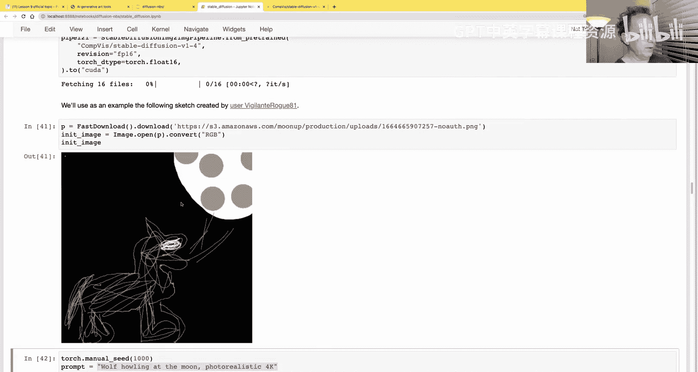

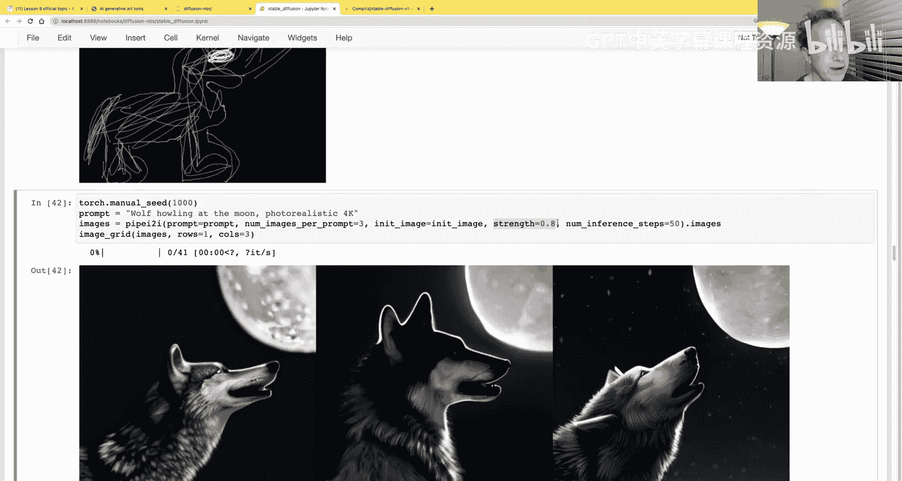

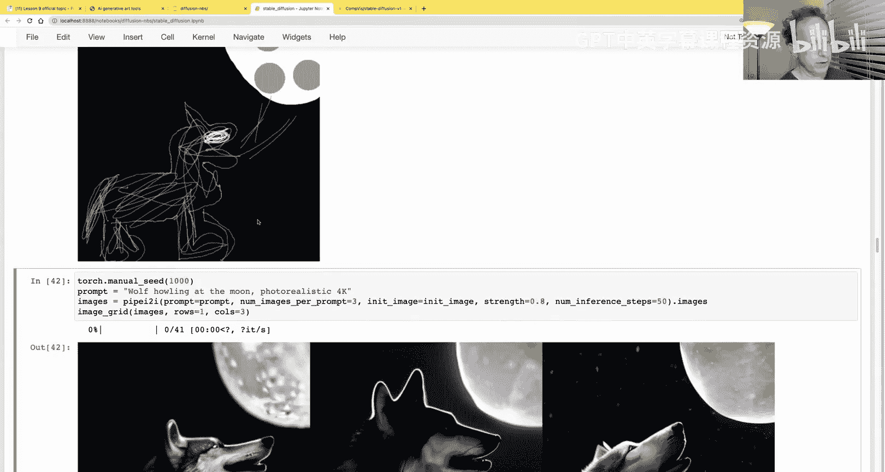

许多使用这些工具的人实际上并不知道这些参数是什么意思。但到课程结束时，您将基本了解所有这些参数的含义，这将帮助您从这类工具中创造出出色的输出。当然，您也可以通过更“手工”的方法尝试，网上有很多关于可以尝试什么的信息。

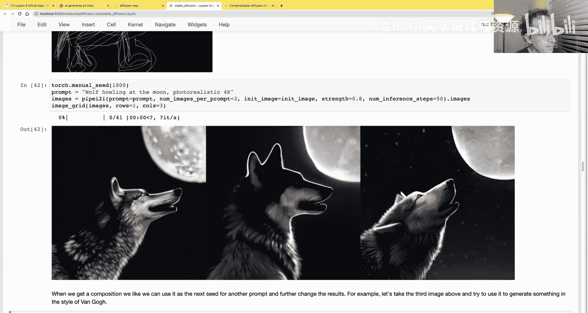

### 提示词工程

您会发现，目前大多数工具都期望您输入一些文本来描述您想创建的图片。事实证明，选择合适的文本并不容易，这会产生有趣的结果。目前，理解该写什么还相当“手工”。学习提示词的最佳方法是查看他人的提示词和输出。

目前，最好的方式可能是访问 Lexica，那里有大量有趣的AI艺术作品。您可以点击一个作品，查看使用了什么提示词。通常，您会以“想要制作什么图片？”和“什么风格？”开始。技巧是添加一堆艺术家名字或他们放置艺术的地方，这样算法就会倾向于创建与那些在标题中倾向于包含这些词汇的艺术品相匹配的作品。

这是一个非常有用的技巧。您甚至可以搜索特定内容，例如“teddy bears”，看看人们是如何创建漂亮的泰迪熊图像的。到本课程结束时，您将理解为什么会发生这种情况，为什么这类提示词会产生这类输出，以及如何超越仅仅创建提示词，真正利用新数据类型构建创新的新事物。

### 探索 diffusion-nbs 仓库

让我们看看 diffusion-nbs 仓库。首先，我们将查看稳定扩散部分。您可以选择克隆这个仓库（链接在 course.fast.ai 和论坛上都有），然后在Paperspace Gradient或您自己的机器上运行；或者，您可以前往Colab，点击“GitHub”并粘贴链接直接从GitHub运行。

我正在自己的机器上运行。这个Notebook的构建主要得益于Hugging Face的优秀团队。Hugging Face有一个名为`diffusers`的库。如果您完成了课程的第一部分，您会对Hugging Face非常熟悉，我们在第一部分使用了很多他们的库。`diffusers`是他们的库，用于进行稳定扩散及类似稳定扩散的任务。目前，这是我们推荐用于此类任务的库，也是我们将在本课程中使用的。也许到您观看时，会有很多其他选择，所以请继续关注 course.fast.ai。

一般来说，Hugging Face在深度学习模型方面做得非常出色，处于领先地位。因此，他们在相当长一段时间内继续成为最佳选择并不奇怪。任何库的基本思想看起来都会非常相似。

### 使用 Diffusers 库

要开始使用，您需要登录Hugging Face。如果您有Hugging Face账户，可以在那里创建用户名和密码，然后登录。登录一次后，它会保存在您的计算机上，以后就不需要再次登录了。

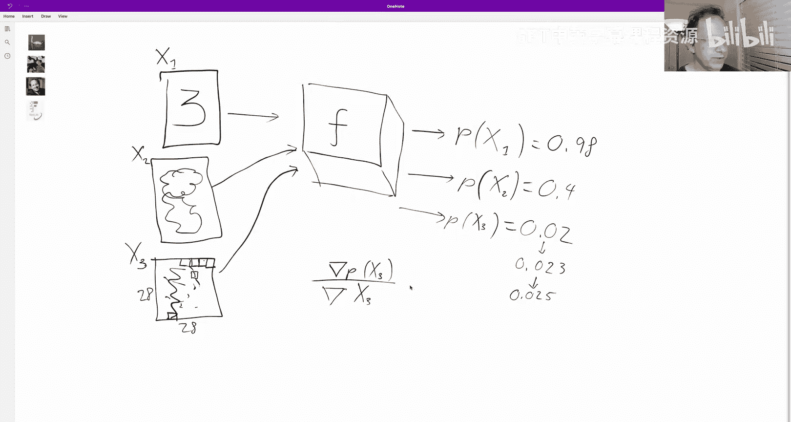

我们将使用`pipelines`，特别是`StableDiffusionPipeline`。到您观看时，您可能在使用不同的pipeline，但pipeline的基本思想与我们在Fast.ai中称为`Learner`的东西非常相似：它包含一大堆东西，比如处理、模型和推理，所有这些都是自动进行的。就像您可以在Fast.ai中保存一个`Learner`一样，您也可以在`diffusers`中保存一个pipeline。

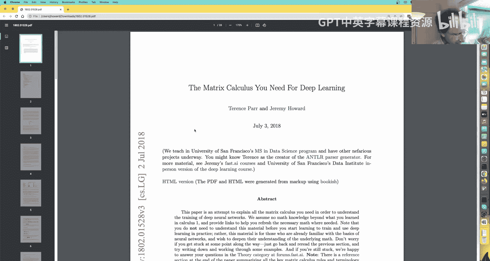

Hugging Face库几乎都可以做而Fast.ai不能做的一件事是，您可以将pipeline或其他东西保存回云端到Hugging Face（他们称之为Hub）。因此，当我们说`from_pretrained`时，这很像我们在Fast.ai中创建预训练`Learner`的方式，但您在这里输入的内容实际上如果不是本地路径，就是一个Hugging Face仓库。

如果您搜索Hugging Face的这个模型，您可以看到它将下载什么。您实际上可以将自己的pipeline保存到Hub供他人使用，我认为这是一个非常棒的功能，有助于社区构建东西。

第一次运行时，它将从互联网下载数GB的数据。在Colab上使用的一个小挑战是，每次使用Colab时，所有东西都会被丢弃并从头开始，因此每次使用Colab时都必须重新下载所有内容。如果您使用像Paperspace或特别是Lambda Labs这样的服务，所有内容都会为您保存。

一旦下载了所有内容，它会在您的缓存和主目录中保存一大堆东西，这是Hugging Face存放内容的地方。

### 生成第一张图像

现在我们有了一个名为`pipe`的pipeline。我们可以将其视为一个函数。这对于PyTorch和Fast.ai的东西来说非常常见，希望您已经非常熟悉了。您可以传递一个提示词（只是一些文本）给它，它将返回一些图像。由于我们只传递一个提示词，它将返回一张图像，所以我们只需索引到`.images`。

当我们运行它时，大约需要30秒左右，并返回一张“宇航员骑马”的照片。每次使用相同的随机种子调用pipeline，您都会得到相同的图像。您可以手动设置随机种子，这样您就可以发送给别人说“哦，我找到了一个很酷的宇航员骑马图像，试试手动种子1024”，然后您就会得到这个特定的宇航员骑马图像。

这就是在Colab或您自己的机器上开始运行并创建图像的最基本方法。如我所说，它需要大约30秒，在这个例子中用了51步。

### 理解扩散过程

这与我们在Fast.ai中习惯的推理方式非常不同，例如分类只需一步。在这51步中，它做的是：从随机噪声开始（实际上，这是我们将在课程中自己创建手写数字的一个例子），每一步都试图让噪声稍微减少一点，让它更接近我们想要的东西。向下滚动会显示创建第一个数字的所有步骤。如果您仔细观察，可以在这噪声中看到一些看起来有点像“1”的东西，然后算法决定聚焦于它。

这就是扩散模型的基本工作原理。

### 调整生成步骤

一个问题可能是，为什么我们不一步完成？我们可以一步完成，但如果尝试一步完成，效果并不好。就我发言时（2022年10月），这些模型还不够智能，无法一步完成。正如开头提到的，我在这里用51步完成已经过时了，因为从昨天起，我们显然可以在3到4步内完成。我不确定代码是否已经可用，所以到您看到这时，这一切可能会快得多。但我相信，理解这个基本概念将永远非常重要。

如果我们用16步而不是51步，它看起来更像一点，但仍然不完美。

### 探索引导尺度

这就是您入门的方法。我将向您展示一些可以调整的东西。我应该提醒您，我今天展示的大部分内容都是由Pedro Cuenca和Hugging Face的其他人员构建的，非常感谢他们。没有他们的帮助，我不可能如此深入地了解所有这些细节。他们构建了这个`diffusers`库，并在展示其功能方面做得非常出色。

让我们看一个例子。我们只是快速定义一个小函数来创建图像网格。细节不重要，但我们想在这里展示的是，您可以获取您的提示词（“宇航员骑马”），并创建它的四个副本。当应用于列表时，`*`运算符只是将列表复制多次。所以我们有一个包含完全相同提示词四次的列表。

然后，我们将把提示词列表传递给pipeline，并使用一个名为`guidance_scale`的新参数。我们将在课程后面详细学习引导尺度，但基本上，它表示我们应该在多大程度上专注于特定标题，而不是仅仅创建一张图像。

我们将尝试几个不同的引导尺度：大约1、3、7、14。一般来说，7.5目前是默认值（到您观看时可能已更改）。所以这里的每一行都是不同的引导尺度。

您可以看到，在第一行（引导尺度为1），它并没有真正听从我们，这些看起来非常奇怪，没有一个真的像宇航员骑马。在引导尺度为3时，它们看起来更像骑马的东西，可能有点像宇航员。在7.5时，它们总体上肯定像宇航员骑马。在14或15时，它们肯定像，但有时变得有点太抽象了。我强烈感觉这里实际上在编码或算法工作原理上存在一些小问题，我们将在本课程中研究这些问题。

基本上，这里发生的是，在高引导尺度下，它实际上有点“跳过头”了。无论如何，它的基本思想是：对于每个提示词，它实际上创建两个版本的图像：一个带有提示词“宇航员骑马”的图像，和一个没有提示词（只是随机内容）的图像。然后它基本上取这两个东西的平均值，引导尺度就像一个用于加权该平均值的数字。

### 使用负向提示词

有一个非常相似的事情可以做，同样是让模型创建两个图像，但不是取平均值，而是要求它有效地将一个从另一个中减去。

这是Pedro做的一个例子，使用提示词“维米尔风格的拉布拉多犬”。然后他说，如果我们减去一些东西，比如只是模型对标题“蓝色”的响应，会怎样？您可以向`diffusers`传递这个`negative_prompt`参数，它会做的是：获取提示词（本例中是“维米尔风格的拉布拉多犬”），并有效地创建第二个图像来响应提示词“蓝色”，然后有效地将一个从另一个中减去。细节略有不同，但这是基本思想。这样我们就得到了一个非蓝色的、维米尔风格的拉布拉多犬。您可以尝试这个，很有趣。

### 图像到图像生成

您还可以玩的是，您不仅可以传入文本，还可以传入图像。为此，您需要一个不同的pipeline：图像到图像pipeline。

使用图像到图像pipeline，您可以抓取一张相当粗略的草图，然后将其传递给这个“img2img”（图像到图像）pipeline。基本上，这将做的是：不是从随机噪声开始扩散过程，而是基本上从这张绘图的噪声版本开始。然后它会尝试创建一些既匹配这个标题，又遵循这种引导起点构图的东西。

因此，您得到的东西看起来比原图好得多，但您可以看到构图是相同的。使用这种方法，您可以构建符合您正在寻找的特定构图的东西。

我认为这是一个非常巧妙的方法。这里`strength`参数表示您希望在多大程度上真正创建看起来像这个草图的东西，或者您希望模型在多大程度上能够尝试一些不同的东西。

### 迭代优化与微调

现在事情变得有趣了，这是您目前仅靠基本指南无法做到的。但如果您真的知道自己在做什么，您现在可以做的是：获取这些输出图像，然后说“哦，这张不错，让我们把它作为初始图像”。然后我们可以说“让我们做一幅梵高的油画”，传递相同的东西和强度为1。实际上，这几乎成功了。我认为这绝对令人着迷，因为这是我以前从未见过的东西，Pedro本周将其整合在一起，它将简单的Python代码结合在一起。

您还可以做其他事情，这个例子实际上来自Lambda Labs的团队。我们现在不会详细讨论这个，因为这基本上就像我们在Fast.ai中做过无数次的事情：您可以获取pipeline中的模型，并传递您自己的图像和您自己的标题。

这些家伙所做的是，他们创建了一个非常酷的数据集：抓取了一个包含近千张宝可梦图像的数据集，然后使用图像描述模型自动为每张图像生成描述。接着，他们使用这些图像-描述对微调了稳定扩散模型。

这是一个描述和图像的示例。然后，他们使用微调后的模型，并传递诸如“戴珍珠耳环的女孩”和“可爱的奥巴马生物”等提示词，得到了这些超级棒的输出，现在既反映了他们使用的微调数据集，又响应了这些提示词。

### 文本反转与 DreamBooth

这是您可以做的另一个例子。微调可能需要相当多的数据和时间，但您可以做一些特殊类型的微调。一种您可以做的是称为“文本反转”的方法，即我们实际上只微调一个嵌入。

例如，我们可以创建一个新的嵌入，试图让东西看起来像这样。我们可以给这个概念起个名字。这里我们称之为“水彩肖像”。这就是我们将使用的嵌入名称。然后，我们基本上可以将该标记添加到文本模型中，然后训练其嵌入以匹配我们看到的示例图片。这会快得多，因为我们只训练一个标记，在这个例子中只针对四张图片。

当我们这样做时，我们可以说“以...风格阅读的女人”，然后传入我们刚刚训练的那个标记。正如您将看到的，我们会得到一种新颖的图像，我认为这非常有趣。

另一个与文本反转非常相似的例子是“DreamBooth”。如前所述，它所做的是获取一个现有但不常用的标记（比如“sks”），并微调模型使该标记接近我们提供的图像。

Pedro在这里做的是，他抓取了我的一些照片，并说“sks的绘画”。在这个例子中，他微调了这个标记，使其成为“保罗·塞尚风格的杰里米·霍华德照片”。这就是它们。我之前展示的“杰里米·霍华德矮人”图像的例子，那个Dreamer服务实际上就是使用这个DreamBooth。

这就是您可以自己尝试的方法。

## 总结第一部分

好了，这就是本节课的第一部分：如何开始玩转稳定扩散模型。第二部分，我们将从机器学习的角度讨论这里实际发生了什么。我们大约七分钟后回来讨论。

---

## 深入原理：从机器学习视角理解稳定扩散

欢迎回来。在深入之前，我想再分享一个文本反转训练的例子。这是我女儿的泰迪熊“Tiny”。Pedro和我尝试创建一个“Tiny”的文本反转。我试图得到“Tiny骑马”的图像。有趣的是，当我尝试这样做时，顶行实际上是Pedro运行时的示例，显示了他训练时尝试使用标题“Tiny骑马”的步骤。正如您所见，它最终从未生成Tiny骑马。相反，它最终生成了一匹看起来有点像Tiny的马。

然后我们尝试得到“Tiny坐在粉色地毯上”的图像。实际上，过了一段时间，我确实取得了一些进展，但它并不完全像Tiny。Pedro做的一件与我不问的事是，他从“person”的嵌入开始，而我的实际上是从“teddy”的嵌入开始，效果稍好一些。但正如您所见，存在一些问题。随着我们在本课剩余部分更多地讨论它是如何训练的，我们将理解这些问题的来源。

### 基础概念回顾

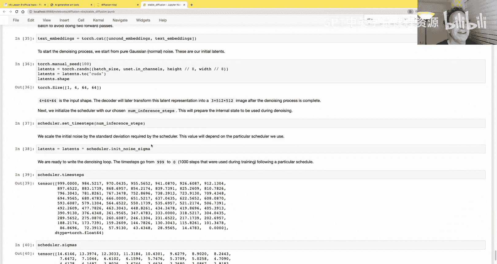

接下来，我将依赖于