# 深度学习基础到稳定扩散模型：4：从基础到前沿

## 概述
在本节课中，我们将回顾上周关于稳定扩散模型的核心概念，并探讨几篇最新的研究论文，这些论文显著提升了模型的采样速度和可控性。我们还将深入代码，从最基础的矩阵操作开始，逐步构建我们自己的深度学习框架。

---

## 学生作品展示 📸

上一周，课程论坛上涌现了许多精彩的学生作品。以下是部分示例：

*   **Purro** 展示了在两个不同的潜在噪声起点之间进行线性插值（具体是球面线性插值）的过程，并呈现了所有中间结果。
*   **Namrada** 在此基础上更进一步，实现了从恐龙图像到鸟类图像的渐变转换，其中一张“恐龙鸟”的中间图像非常酷。
*   **John Richmond** 将他女儿的狗的照片逐渐变成了一只独角兽，这张沿途生成的图像非常可爱，堪称“本周最佳爸爸奖”。
*   **Maureen** 尝试将Jonno课程中的鹦鹉图像转换成不同画家的风格，并让大家猜猜提示词中使用了哪些艺术家。

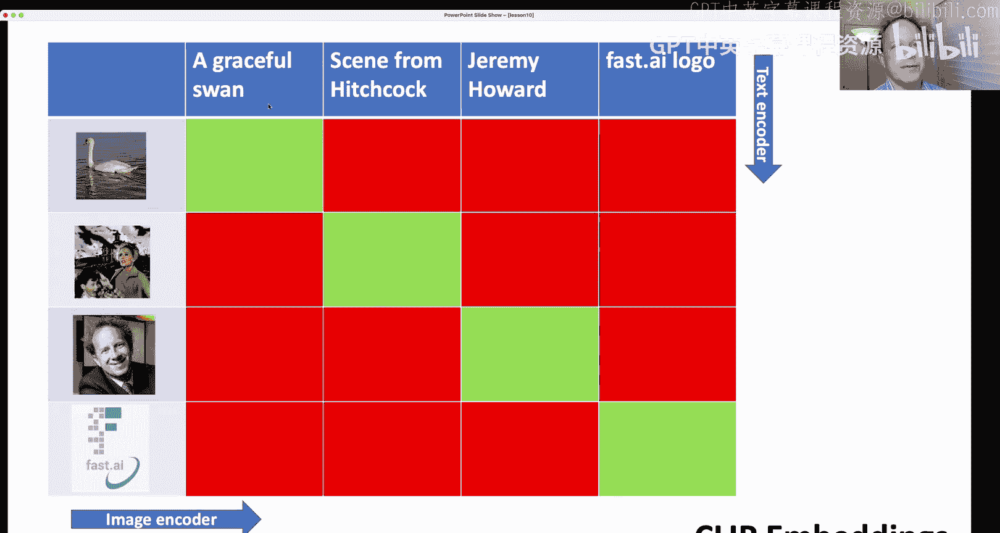

这些作品提醒我们，一定要去查看Jonno关于稳定扩散的课程视频，以及Wassim和Tenniish关于扩散模型数学原理的视频。即使你觉得自己不擅长数学，后者也能提供有用的背景知识。

此外，**Jason Antic**（曾参与创建Delphi、NoGAN等）本周取得了惊人进展。他尝试使用经典深度学习优化器（而非微分方程求解器）来训练模型，仅用单GPU几小时就从零开始生成了高质量的人脸图像，这一研究方向极具前景。

---

## 核心概念回顾 🔄

上一节我们欣赏了同学们的创意，现在让我们回顾一下稳定扩散模型的核心工作原理。

### 训练过程：预测噪声
基本思想是，我们从一个图像（例如手写数字7）开始，向其添加一些噪声，得到一个带噪图像。我们将这个带噪图像输入一个神经网络（称为U-Net），并尝试预测所添加的噪声本身。网络将其预测的噪声与实际添加的噪声进行比较，计算损失，并据此更新权重。这就是U-Net训练的基本方式。

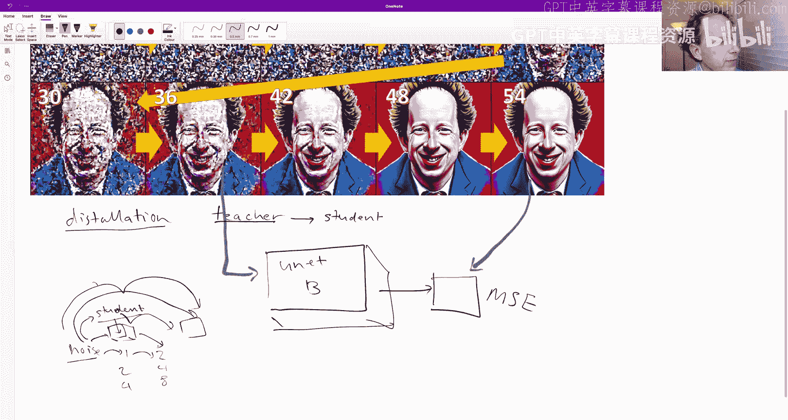

为了使训练更容易，我们还可以传入目标数字（例如数字7）的嵌入向量（如one-hot编码）。这样，在后续生成时，我们就可以通过指定“我想要数字7”来生成特定图像。

**公式表示**：`带噪图像 = 原始图像 + 噪声`。U-Net的目标是学习一个函数 `f(带噪图像, 条件) ≈ 噪声`。

### 处理复杂概念：CLIP模型
为了处理更复杂的文本描述（如“优雅的天鹅”），我们需要将文本也转换为嵌入向量。这通常通过**CLIP**模型实现。CLIP通过对比学习进行训练：它同时训练一个图像编码器和一个文本编码器，目标是让匹配的图像-文本对（例如“优雅的天鹅”文本和对应的天鹅图片）的嵌入向量尽可能接近（点积大），而不匹配的则尽可能远离（点积小）。

**核心思想**：`损失 = Σ(匹配对的相似度) - Σ(不匹配对的相似度)`。

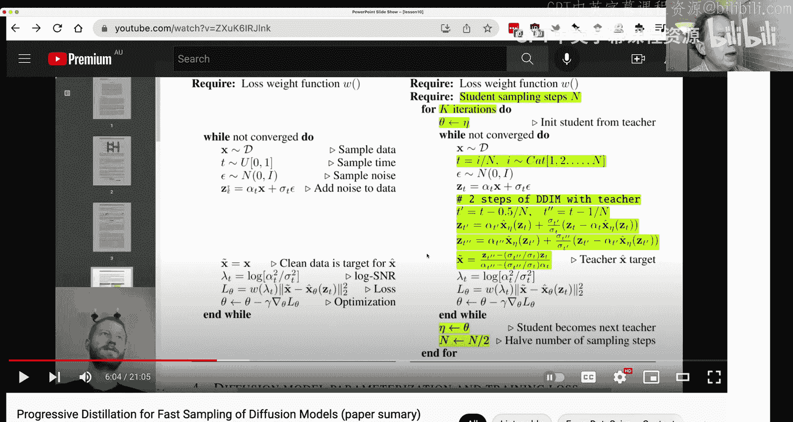

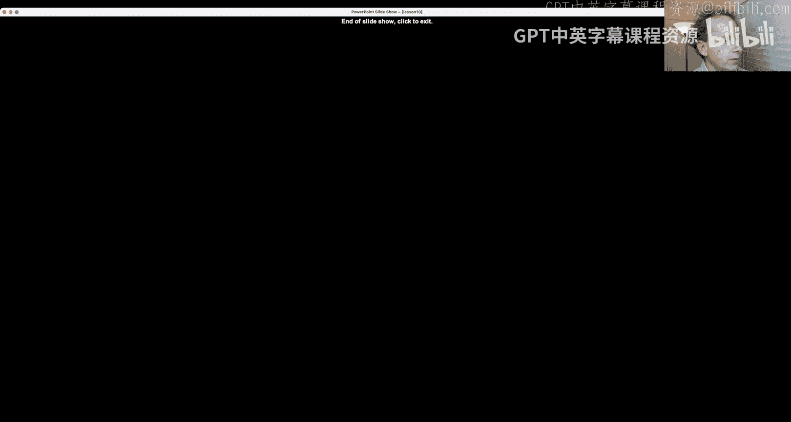

训练完成后，我们就可以使用CLIP的文本编码器将任何提示词（如“优雅的天鹅”）转换为嵌入向量，并将其输入U-Net进行条件生成。

### 推理过程：逐步去噪
在推理（生成图像）时，我们从一个随机噪声开始，将其输入U-Net。U-Net会预测需要移除多少噪声才能得到目标图像（例如数字3）。最初预测可能不准确，我们只移除一小部分预测的噪声，得到一张稍微清晰的图像。然后，我们重复这个过程多次（例如60步），逐步去除噪声，最终得到清晰的图像。

**代码逻辑**：
```python
latent = 随机噪声
for i in range(去噪步数):
    预测噪声 = U-Net(latent, 条件, 时间步)
    latent = latent - 预测噪声 * 调度系数
最终图像 = VAE解码器(latent)
```

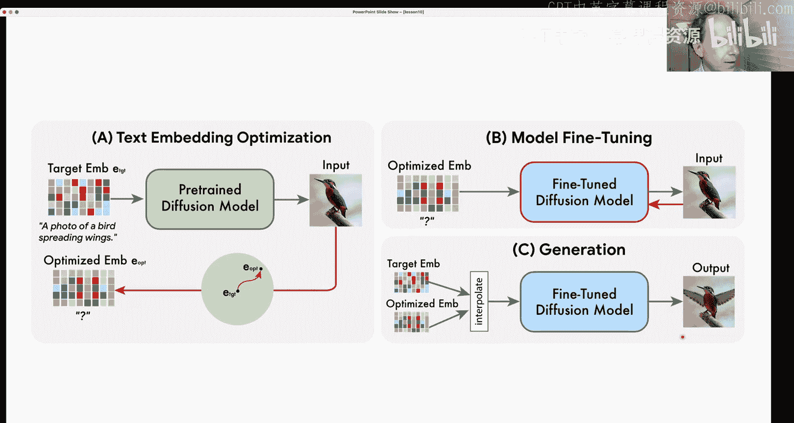

之前这个过程需要上千步，现在通过改进的调度器可以缩短到60步。我们看到的“噪声”图像实际上是经过VAE编码的潜在表示，所以看起来不像普通高斯噪声。

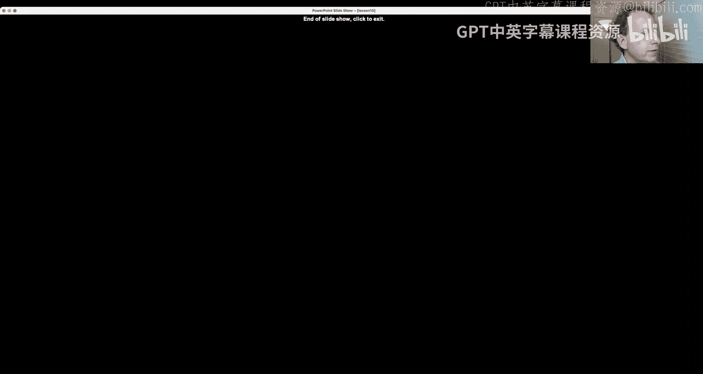

---

## 前沿论文速览 📄

上周有几篇重要论文发布，极大地推动了该领域的发展。本节我们将简要介绍它们。

### 论文一：渐进式蒸馏加速采样
这篇论文的目标是将生成所需的步数从60步大幅减少到4步。其核心思想是**知识蒸馏**。

**传统方法**：教师模型（原始的、慢速的稳定扩散模型）逐步去噪，需要很多步。
**蒸馏方法**：我们训练一个学生模型，让它学习直接“跳步”。具体来说，我们利用教师模型生成大量“输入-输出”对（例如，第36步的噪声潜在变量对应第54步更清晰的潜在变量）。然后，我们训练学生模型，输入是第36步的状态，目标是直接输出第54步的状态。

**迭代过程**：
1.  训练学生模型A，学习从噪声直接跳到教师模型2步后的结果。
2.  将学生模型A作为新的教师，训练学生模型B，学习从噪声直接跳到（学生模型A）2步后的结果（相当于原教师4步）。
3.  重复此过程，每次迭代学生模型都能跳过更多的步数。同时，一个学生模型可以学习在不同噪声水平（时间步）上进行多步跳跃。

这样，我们就得到了一个速度极快、步数很少的学生模型。

### 论文二：无分类器引导扩散模型的蒸馏
上一节我们介绍了如何加速普通扩散模型。然而，我们通常希望使用**无分类器引导**来更好地控制生成内容（例如，“一只可爱的小狗”）。传统的CFG需要同时计算有条件和无条件的预测，并进行加权平均，这增加了计算负担。

这篇论文将蒸馏思想应用于CFG。学生模型不仅学习去噪，还将**引导尺度**作为额外输入进行学习。这样，训练好的学生模型就能内部处理不同引导尺度的影响，在推理时无需分别计算有条件和无条件路径，从而在保持控制力的同时进一步加速。

### 论文三：Imagic——基于文本的图像编辑
这篇几个小时前刚发布的论文展示了令人惊叹的图像编辑能力。给定一张输入图像和一个目标文本描述（例如，一张鸟的照片和提示词“展翅的鸟”），模型能够对图像进行最小程度的修改，使其符合文本描述，同时最大程度保持原图的其他内容。

**工作原理简述**：
1.  使用预训练的扩散模型（如Imagen或稳定扩散）。
2.  **优化文本嵌入**：固定模型权重，微调目标文本的嵌入向量，使得模型用这个嵌入生成的图像尽可能接近输入图像。这类似于“文本反转”。
3.  **微调扩散模型**：固定上一步优化好的嵌入向量，微调整个扩散模型（包括VAE等），使其能根据这个特定嵌入更精确地重建输入图像。
4.  **插值生成**：最后，将原始目标文本的嵌入和优化后的嵌入进行加权平均，将这个混合嵌入输入微调后的模型，生成既符合新描述又保持原图特征的最终图像。

这种方法可以在普通硬件上相对快速地实现，为图像编辑打开了新的大门。

---

## 代码实战：拆解稳定扩散流程 🛠️

了解了理论前沿后，让我们回到代码，深入理解稳定扩散管道内部的每一步。Hugging Face `diffusers` 库的团队已经将流程分解，我们可以一步步查看。

### 主要组件
首先，我们加载预训练好的核心模型，这些都是现成的：
*   **文本编码器**：CLIP模型，将提示词转换为嵌入向量。
*   **VAE**：变分自编码器，用于图像和潜在空间之间的编码/解码。
*   **U-Net**：执行去噪任务的核心神经网络。
*   **调度器**：管理噪声添加/移除的节奏（时间步）。

### 生成步骤详解
以下是以提示词“宇航员骑马”为例的生成流程：

1.  **分词与编码**：
    ```python
    # 将文本转换为token ID
    input_ids = tokenizer("photograph of an astronaut riding a horse")
    # 通过CLIP文本编码器获取文本嵌入
    text_embeddings = text_encoder(input_ids)
    # 同时获取空字符串（无条件）的嵌入，用于分类器自由引导
    uncond_embeddings = text_encoder(tokenizer(""))
    # 将两者拼接，批量处理
    embeddings = torch.cat([uncond_embeddings, text_embeddings])
    ```

2.  **准备初始潜在噪声**：
    ```python
    # 生成随机噪声，尺寸因VAE下采样而缩小
    latent = torch.randn((1, 4, 64, 64))  # (批次, 通道, 高/8, 宽/8)
    ```

3.  **设置去噪循环**：
    ```python
    num_inference_steps = 70
    guidance_scale = 7.5
    scheduler.set_timesteps(num_inference_steps)
    ```

4.  **迭代去噪**：
    ```python
    for t in scheduler.timesteps:
        # 扩展潜在变量以同时处理有条件和无条件输入
        latent_model_input = torch.cat([latent] * 2)
        # 使用调度器缩放输入
        latent_model_input = scheduler.scale_model_input(latent_model_input, t)
        # U-Net预测噪声
        noise_pred = unet(latent_model_input, t, encoder_hidden_states=embeddings).sample
        # 分离有条件和无条件预测
        noise_pred_uncond, noise_pred_text = noise_pred.chunk(2)
        # 应用引导尺度进行加权
        noise_pred = noise_pred_uncond + guidance_scale * (noise_pred_text - noise_pred_uncond)
        # 根据预测，使用调度器计算更新后的潜在变量
        latent = scheduler.step(noise_pred, t, latent).prev_sample
    ```

5.  **解码为图像**：
    ```python
    # 使用VAE解码器将潜在变量转换回图像空间
    image = vae.decode(latent / 0.18215).sample
    # 后处理：缩放、裁剪到[0,1]，转换为PIL图像
    image = (image / 2 + 0.5).clamp(0, 1)
    image = image.cpu().permute(0, 2, 3, 1).float().numpy()
    pil_image = Image.fromarray((image[0] * 255).astype(np.uint8))
    ```

通过将上述步骤整合成简洁的函数，我们可以拥有一个完全透明、易于理解和修改的生成流程。我建议的**本周作业**是：尝试在此基础上实现**负向提示词**或**图像到图像**生成功能。

---

## 回归基础：从零构建的旅程 🧱

前面的章节我们站在了研究前沿。现在，让我们回到最根本的起点，开始从零构建我们自己的深度学习框架，并最终重新实现稳定扩散。

### 我们的“地基”
我们允许使用：
*   Python 及标准库
*   Matplotlib（用于绘图）
*   Jupyter Notebook 和 nbdev（用于从笔记本创建模块）
我们将逐步重新实现 NumPy/PyTorch 中的关键功能，并构建我们自己的小型框架，称之为 **miniAI**。

### 第一步：处理数据与理解张量
我们从经典数据集 MNIST（手写数字）开始。首先，我们学习如何在不依赖 NumPy 的情况下，用纯 Python 处理和查看数据。

**将扁平列表转换为图像矩阵**：
```python
# 假设 image_flat 是一个784长度的列表（28*28）
def chunks(lst, n):
    """将列表lst分割成长度为n的块。"""
    for i in range(0, len(lst), n):
        yield lst[i:i + n]

# 转换为28x28的列表的列表
image_matrix = list(chunks(image_flat, 28))
```

**创建自定义矩阵类**：
为了能像 `matrix[20, 15]` 这样索引，我们创建一个简单的类：
```python
class Matrix:
    def __init__(self, xs): self.xs = xs
    def __getitem__(self, idxs):
        i, j = idxs
        return self.xs[i][j]
```

当然，在实际中我们会使用 PyTorch 张量，它提供了强大的多维数组操作。理解**张量**的本质很重要：它不过是多维数组的数学/编程抽象，源于 APL 语言和数学中的张量分析。

### 理解随机数生成器
在深度学习中，可重复性至关重要，这依赖于随机数生成器（RNG）的状态管理。

**伪随机数生成器原理**：
真正的随机源（如量子涨落）获取慢。我们使用**伪随机数生成器**（PRNG），它是一个确定的数学函数，给定一个初始**种子**，能产生一长串看似随机的数字序列。序列中的下一个数由当前内部状态计算得出，并更新该状态。

**关键陷阱：并行处理中的RNG状态**：
在深度学习中，我们常用多进程进行数据增强。如果使用 `fork()` 创建子进程，子进程会复制父进程的整个内存空间，包括RNG的**内部状态**。这会导致所有子进程产生完全相同的“随机”序列，破坏了随机性。

**示例**：
```python
import os, time
def get_random():
    # 一个简单的PRNG示例
    global state
    state = (state * 1103515245 + 12345) & 0x7fffffff
    return state

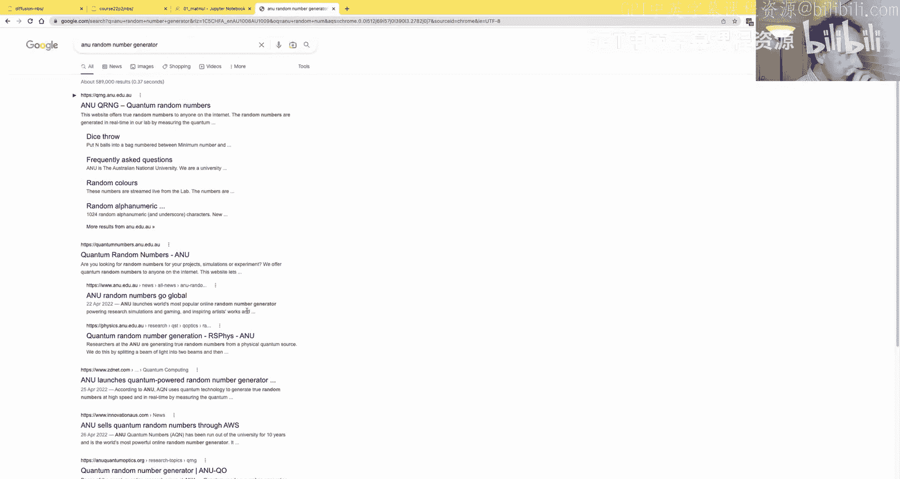

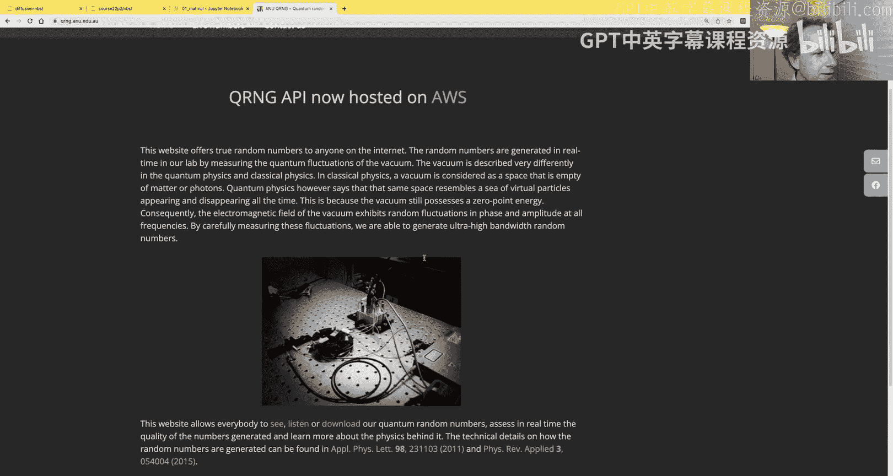

state = int(time.time() * 1000) # 初始化种子
if os.fork() == 0:
    # 子进程
    print(get_random()) # 可能和父进程打印出相同的数！
else:
    # 父进程
    print(get_random())
```

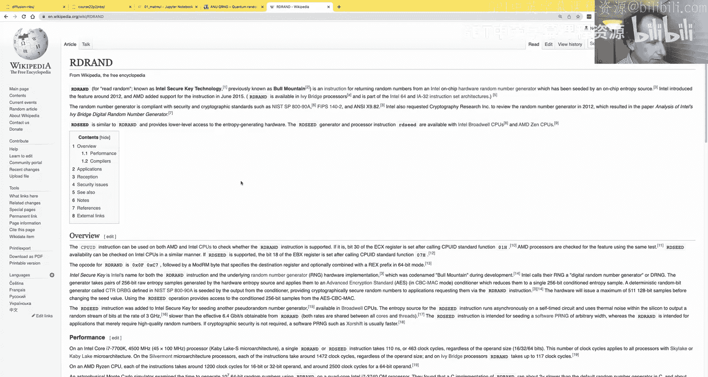

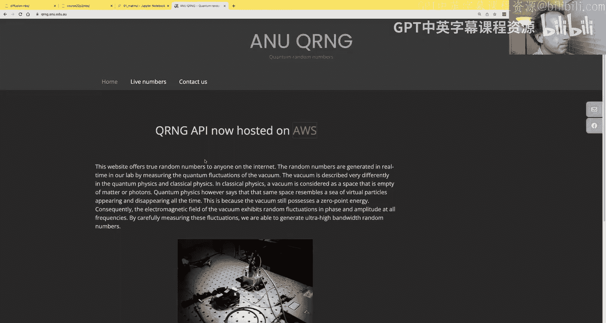

因此，在编写涉及并行化的代码时，必须确保每个进程正确初始化其独立的RNG状态。Python的 `random` 模块会自动处理 `fork` 后的重播种，但 NumPy 和 PyTorch 的默认行为可能需要手动处理。

我们实现了一个简单的 PRNG（如 Wichmann-Hill 算法）来演示这一原理，但在实际中我们会使用更高效的 PyTorch RNG。

---

## 总结
本节课内容非常丰富。我们一起：

1.  **回顾了稳定扩散**的核心训练（预测噪声）和推理（逐步去噪）过程，以及CLIP模型如何实现文本控制。
2.  **探讨了三篇前沿论文**：
    *   通过**渐进式蒸馏**将生成步数减少到个位数。
    *   将蒸馏技术应用于**无分类器引导**模型，进一步提升可控生成的效率。
    *   了解了 **Imagic** 如何实现基于文本的精准图像编辑。
3.  **深入代码**，拆解了Hugging Face稳定扩散管道的每一步，从文本编码、噪声生成、迭代去噪到最终解码，并鼓励大家在此基础上进行扩展。
4.  **开启了从零构建的旅程**，从最基础的Python列表操作、自定义矩阵类、理解张量概念，到深入探究了**伪随机数生成器的原理及其在并行计算中的关键陷阱**。

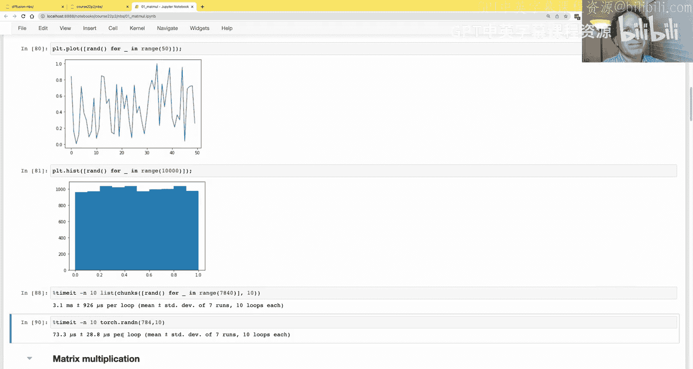

从下节课开始，我们将真正从矩阵乘法起步，一步步构建我们的深度学习框架，直至重新实现稳定扩散的所有组件。这将是一段需要耐心和坚持但收获巨大的旅程。