# 深度学习基础到稳定扩散模型：5：Lesson 11 课程内容

## 概述
在本节课中，我们将学习如何阅读和理解深度学习领域的学术论文，并深入探讨矩阵运算的核心概念——广播机制。我们将通过一个具体的论文案例和代码实践，帮助初学者掌握这些关键技能。

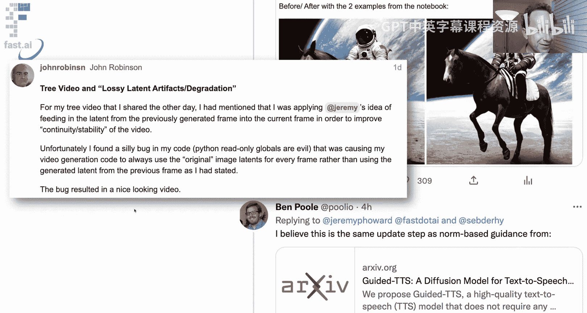

---

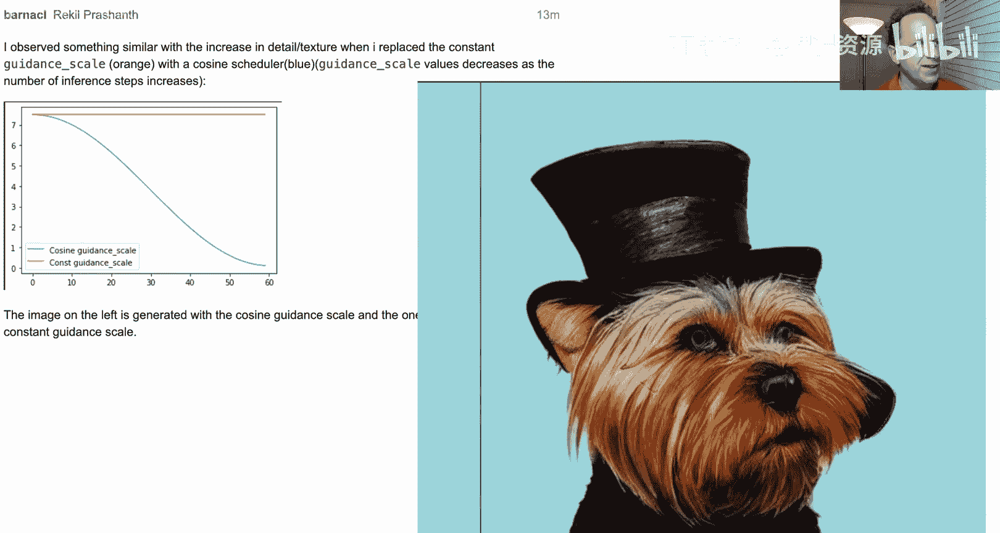

## 社区精彩分享与论文阅读入门

上一节我们探讨了扩散模型的基础，本节中我们来看看社区成员们的一些创新实践，并学习如何阅读一篇新发表的学术论文。

### 社区创新实践展示
以下是本周论坛上一些令人兴奋的探索：

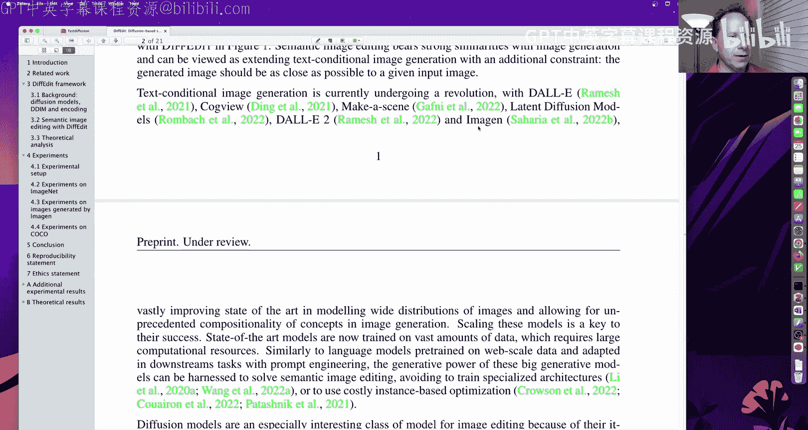

*   **提示词插值与循环生成**：John Robinson 展示了一段通过在不同季节描述的提示词之间进行插值，并以前一个插值序列的最终图像作为下一个序列的起始图像，从而生成稳定、优美的季节过渡视频。这种方法创造了流畅的动态效果。
*   **引导尺度缩放改进**：Sebastian 发现并改进了无条件嵌入的更新公式。原始公式 `无条件嵌入 + 引导尺度 * (文本嵌入 - 无条件嵌入)` 在文本嵌入与无条件嵌入差异较大时，会导致更新步长过大，图像“跳跃”过度。他的解决方案是根据原始无条件更新向量的范数来缩放最终更新，从而稳定生成过程，带来了更丰富的纹理和细节（例如，为马匹补上了缺失的腿）。
*   **动态引导尺度**：Rqueo Prachhan 提出了一种新思路：在去噪过程中逐步降低引导尺度，直至为零。这样，模型在初期被强烈引导至目标方向后，后期可以更自由地发挥，从而生成了细节更丰富、更生动的图像（例如，更逼真的眼睛和毛发纹理）。

这些探索表明，即使是代码中的“错误”也可能意外地产生优秀结果（如John的视频），这反向启发了新的研究方向。社区的集体智慧正在快速推动技术进步。

### 如何阅读一篇深度学习论文
John O 推荐了一篇新论文《DiffEdit》，我们将以此为例，学习阅读论文的方法。

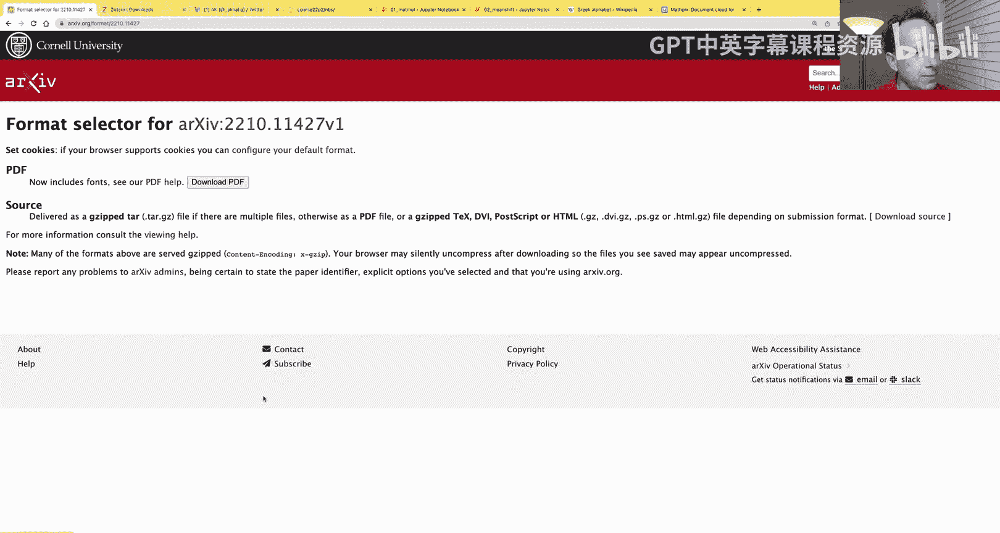

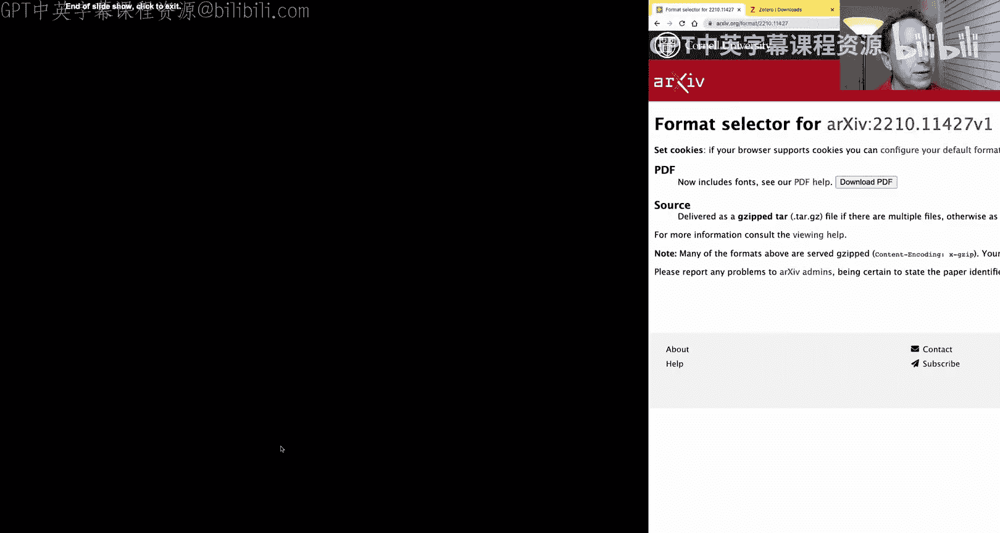

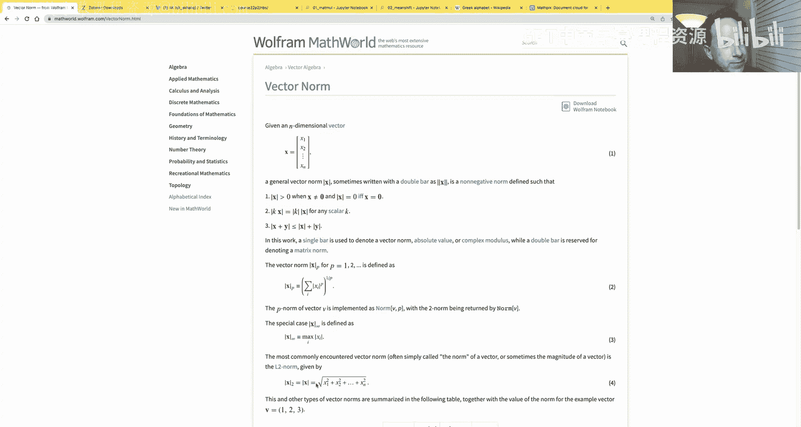

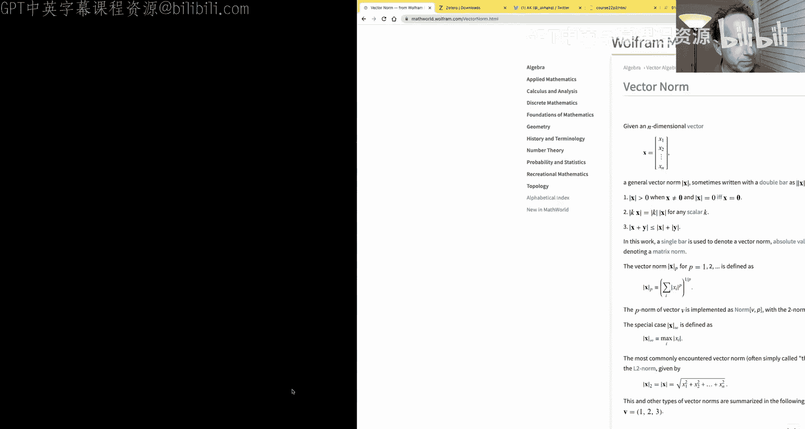

**第一步：获取与整理论文**
1.  大多数深度学习论文会先发布在 arXiv 预印本服务器上。
2.  使用文献管理工具（如 Zotero）保存论文，便于标注、整理和与团队共享。

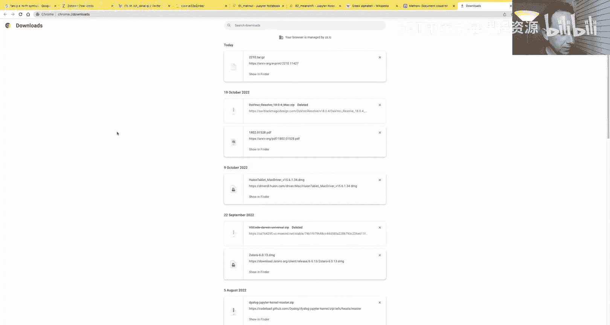

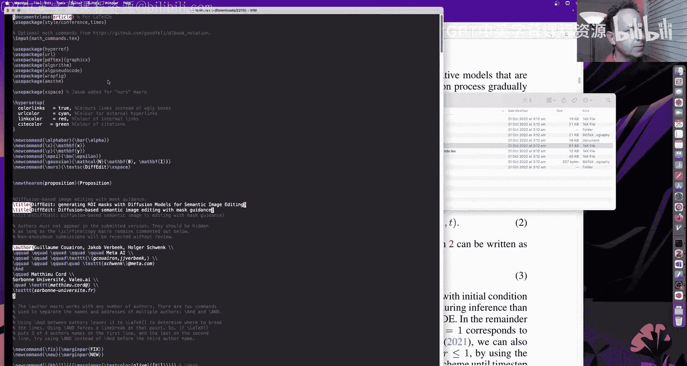

**第二步：高效阅读论文结构**
阅读论文的目标是理解核心思想，而非每个细节。可以按以下顺序进行：
1.  **摘要**：快速了解论文要解决什么问题（语义图像编辑），核心贡献是什么（自动生成掩码，无需用户提供）。
2.  **引言与图示**：通过文字和图示（如 Figure 1）确认你是否理解并感兴趣。本文目标是：输入一张图像和一个文本查询（如“一碗梨”），模型能自动编辑图像中相关部分以匹配查询，同时保持其他部分不变。
3.  **跳过或速读相关工作和背景**：这部分通常是为评审设立，或作为领域内读者的复习。初次阅读时可快速浏览，了解大致脉络即可。背景中的数学公式（如 DDPM 目标函数）通常是对已有知识的重述，不必深究，但需留意其中定义的符号（如期望算子 `E`、范数 `||·||`），以便后续理解。
4.  **核心方法**：这是阅读重点。仔细阅读描述算法核心步骤的部分。对于《DiffEdit》，其三步流程是：
    *   **步骤1（生成掩码）**：对输入图像加噪，然后分别用参考文本（真实描述）和查询文本（编辑目标）去噪。两次去噪预测的噪声之差，揭示了图像中哪些部分需要改变以符合新描述，据此可自动生成二进制掩码。
    *   **步骤2（准备潜在变量）**：对输入图像进行确定性的编码（加噪），得到一个中间潜在表示。
    *   **步骤3（条件去噪与修复）**：以上述潜在表示为起点，以查询文本为条件进行去噪生成。关键技巧是：在每一步去噪后，将掩码外（不需改变）区域的像素值用原始图像的对应噪声版本替换，从而保留背景。
5.  **实验与结果**：直接查看生成图片的效果，判断方法是否有效、是否满足你的需求。对于定量评估指标（如 FID），初期可不必过于关注。
6.  **结论与附录**：结论通常总结摘要内容。附录可能包含更多实验细节、失败案例或扩展结果，值得一看。

**核心技巧**：
*   **利用工具理解符号**：遇到不认识的数学符号（如希腊字母、特殊算子），可使用 `Detexify`（手绘识别）或 `Mathpix`/`Pix2Tex`（截图转 LaTeX）等工具识别，然后搜索其含义。
*   **明确局限性**：通过理解方法原理，可以推断其适用边界。例如，《DiffEdit》适用于需要局部修改且修改前后语义类别相似的场景（如“马变斑马”），但不适用于需要全局风格变化或完全不同物体替换的情况。

**课后实践**：尝试基于课程中已实现的扩散模型代码，复现《DiffEdit》的核心步骤1（自动掩码生成），这将是一个极好的练习项目。

---

## 矩阵运算核心：广播机制详解

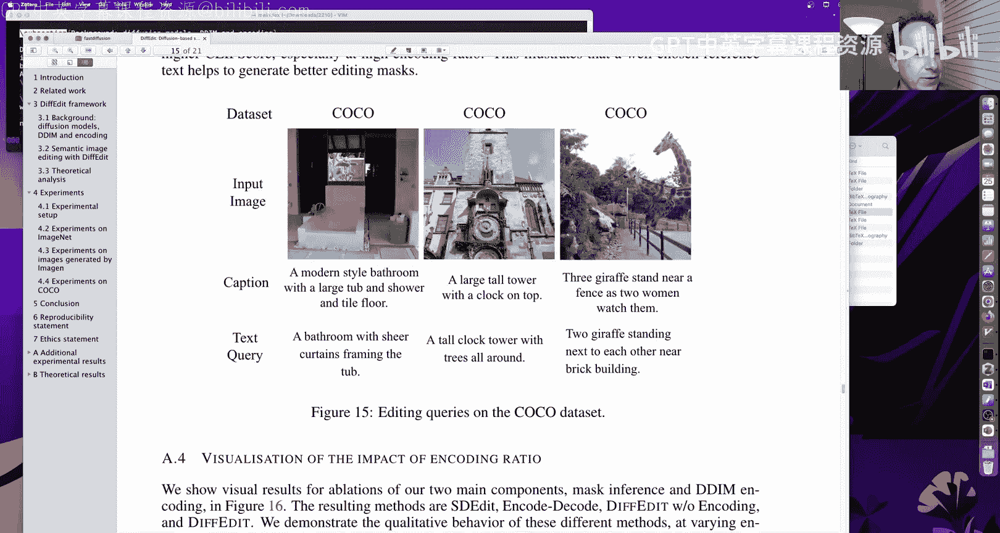

上一节我们介绍了如何用循环实现基础的矩阵乘法，本节中我们来看看如何利用广播机制将其效率提升数千倍。

### 从元素级运算到广播
在 PyTorch 或 NumPy 中，张量间的标准算术运算是**元素级**的，这要求两个张量形状完全相同。

```python
import torch
a = torch.tensor([10, 6, -4])
b = torch.tensor([2, 8, 7])
# 元素级加法
c = a + b  # tensor([12, 14, 3])
# 元素级比较（布尔值用0/1表示）
d = a > 0  # tensor([1, 1, 0])
```

**广播**机制允许我们对形状不同的张量进行元素级运算。其核心规则是：**从最右边的维度开始向左比较，两个维度兼容的条件是：1) 相等；或 2) 其中一个是 1**。系统会自动将大小为1的维度扩展（复制）以匹配另一个张量对应的维度。

### 广播基础示例
以下是广播的几个关键示例：

*   **标量与任意形状张量**：标量被视为在所有维度上大小为1。
    ```python
    a = torch.tensor([10, 6, -4])
    # 标量0被广播为 [0, 0, 0]
    e = a > 0
    ```
*   **向量与矩阵**：这是广播中最常见且强大的应用之一。
    ```python
    # 向量 c: shape (3,)
    c = torch.tensor([10, 20, 30])
    # 矩阵 m: shape (3, 3)
    m = torch.tensor([[1,2,3],[4,5,6],[7,8,9]])
    # 情况1：向量广播到每一行 (c 被视为行向量)
    # c 形状变为 (1,3) -> 广播为 (3,3)
    r1 = m + c[None, :]  # 或 m + c.unsqueeze(0)
    # 结果：每一行加上 [10,20,30]
    # tensor([[11, 22, 33],
    #         [14, 25, 36],
    #         [17, 28, 39]])
    # 情况2：向量广播到每一列 (c 被视为列向量)
    # c 形状变为 (3,1) -> 广播为 (3,3)
    r2 = m + c[:, None]  # 或 m + c.unsqueeze(1)
    # 结果：每一列加上 [[10],[20],[30]]
    # tensor([[11, 12, 13],
    #         [24, 25, 26],
    #         [37, 38, 39]])
    ```
*   **高效的外积计算**：利用广播，可以无需显式循环即可计算向量的外积。
    ```python
    # 外积: (3,1) * (1,3) -> 广播为 (3,3) 进行元素乘
    outer_product = c[:, None] * c[None, :]
    ```
*   **高维张量应用**：例如，对一幅RGB图像（形状 `[256, 256, 3]`）进行逐通道归一化。
    ```python
    image = torch.randn(256, 256, 3)
    channel_means = torch.tensor([0.485, 0.456, 0.406])
    channel_stds = torch.tensor([0.229, 0.224, 0.225])
    # channel_stds 形状 (3,) 广播为 (1,1,3) -> (256,256,3)
    normalized_image = (image - channel_means) / channel_stds
    ```

### 利用广播加速矩阵乘法
回顾我们之前用循环实现的矩阵乘法。假设我们有一个输入数据矩阵 `m1`（形状 `[5, 784]`，5张MNIST图像）和权重矩阵 `m2`（形状 `[784, 10]`）。

原始的朴素三重循环非常缓慢（约450毫秒）。我们可以利用广播消除最内层的循环：

```python
def matmul_broadcast(a, b):
    ar, ac = a.shape
    br, bc = b.shape
    # 结果矩阵
    res = torch.zeros(ar, bc)
    for i in range(ar):
        for j in range(bc):
            # 利用广播进行元素乘后求和，替代内层循环
            # a[i, :] 形状 (ac,) -> (ac,)
            # b[:, j] 形状 (br,) -> (br,)
            # 元素乘后求和，即点积
            res[i, j] = (a[i, :] * b[:, j]).sum()
    return res
```
这已将速度提升至约600微秒。然而，我们可以更进一步，利用广播同时计算一整行与所有列的点积，从而消除对列索引 `j` 的循环：

```python
def matmul_broadcast_v2(a, b):
    ar, ac = a.shape
    br, bc = b.shape
    # 关键步骤：将 a 的每一行变为形状 (ac, 1)，b 为 (1, br, bc)？不，更简单：
    # 我们想要对于每一行 i，计算它与 b 的所有列的点积。
    # 可以将 a 的每一行 a[i] 视为形状 (1, ac)
    # 然后与 b (形状 (ac, bc)) 相乘并求和。
    # 实际上，利用广播：a[:, :, None] (ar, ac, 1) * b[None, :, :] (1, ac, bc) -> (ar, ac, bc)
    # 再对维度1（ac）求和 -> (ar, bc)
    # 更直观的实现（针对单样本或批处理）：
    res = torch.zeros(ar, bc)
    for i in range(ar):
        # a[i, :, None] 形状 (ac, 1)
        # b 形状 (ac, bc)
        # 广播相乘: (ac, 1) * (ac, bc) -> (ac, bc)，然后对列求和？不对。
        # 正确点积计算：对对应元素乘后沿ac轴求和。
        # 更有效的方式是直接使用 torch.dot 或 einsum，但为演示广播思想：
        # 我们可以将 a[i] 扩展为 (1, ac)，然后与 b.T (bc, ac) 乘？标准做法是：
        res[i] = (a[i].unsqueeze(0) @ b).squeeze(0) # 但这已调用了优化过的 @
    return res
```
实际上，最彻底且高效的方式是直接利用 PyTorch 的广播机制和 `sum` 函数，完全消除所有 Python 循环，让运算在C++层并行完成。最终，我们可以实现与 PyTorch 内置 `torch.matmul` 接近的性能，将 5 张图像的矩阵乘法时间从 **450 毫秒** 降至 **约 100 微秒**，加速超过 **4000 倍**。对于整个数据集（50000张图像），也仅需约600毫秒。

```python
# 完全向量化的矩阵乘法思想（针对单个样本或小批量）
# 对于单个样本向量 x (形状 [784]) 和权重矩阵 w (形状 [784, 10])
x = digit # 形状 [784]
w = weights # 形状 [784, 10]
# 将 x 变为列向量 [784, 1]，利用广播与 w 相乘
# x_col = x[:, None] # [784, 1]
# 广播相乘: [784, 1] * [784, 10] -> [784, 10] (每列是 x * w[:,j])
# 然后沿第0维（784维）求和，得到 [1, 10] -> [10]
output_vector = (x[:, None] * w).sum(dim=0)
# 对于批量数据 m1 [batch, 784]，可以扩展为：
# m1_ = m1[:, :, None] # [batch, 784, 1]
# w_ = w[None, :, :]   # [1, 784, 10]
# element_wise = m1_ * w_ # [batch, 784, 10]
# output = element_wise.sum(dim=1) # [batch, 10]
```

---

## 总结
本节课中我们一起学习了两个重要主题：
1.  **学术论文阅读方法**：我们以《DiffEdit》为例，拆解了阅读一篇深度学习论文的实用流程——从摘要、图示把握核心思想，跳过艰深背景，聚焦方法细节，并通过实验结果判断其价值。我们还介绍了使用工具辅助理解数学符号的技巧。
2.  **广播机制**：我们深入探讨了张量运算中广播机制的原理与规则，并通过多个示例展示了其强大的表达能力。最重要的是，我们利用广播将矩阵乘法的效率提升了数千倍，这是实现高效深度学习代码的基石技能。

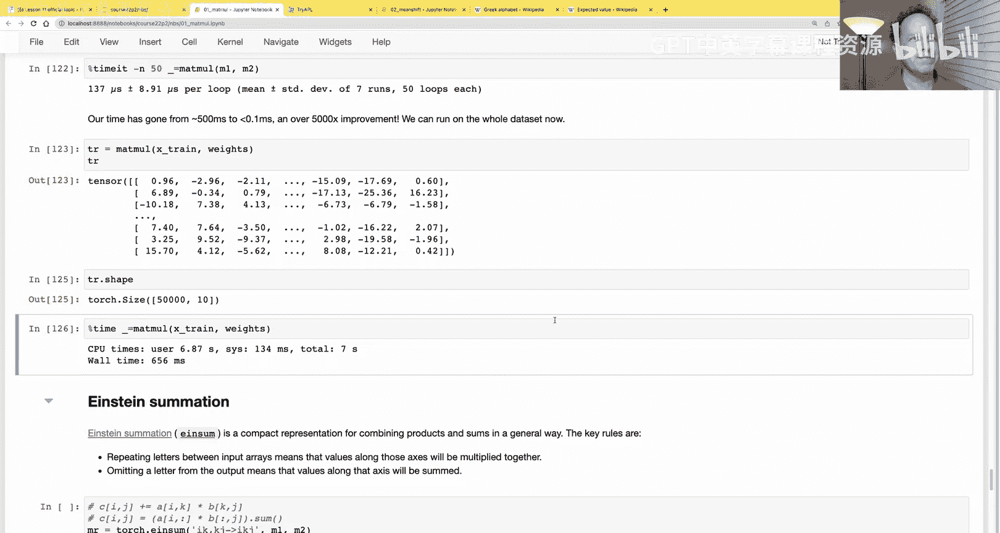

掌握论文阅读能力将使你能紧跟领域前沿，而精通广播机制则能让你写出简洁、高效的数值计算代码。请务必花时间实践这两项技能。