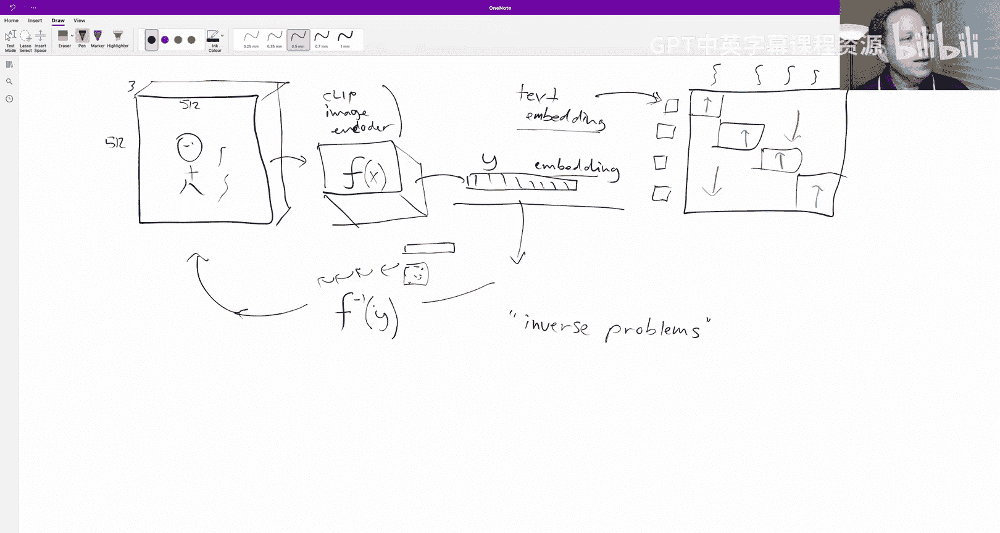
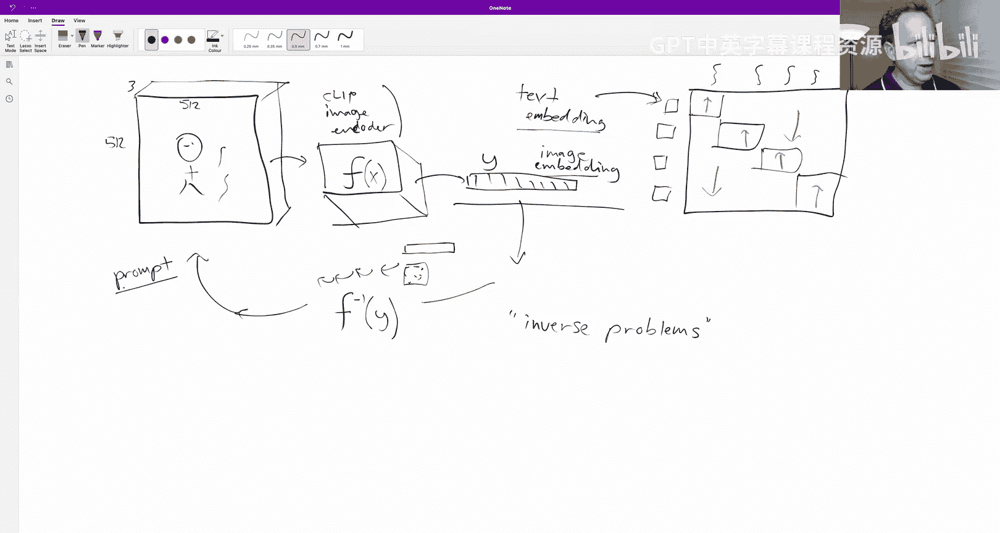
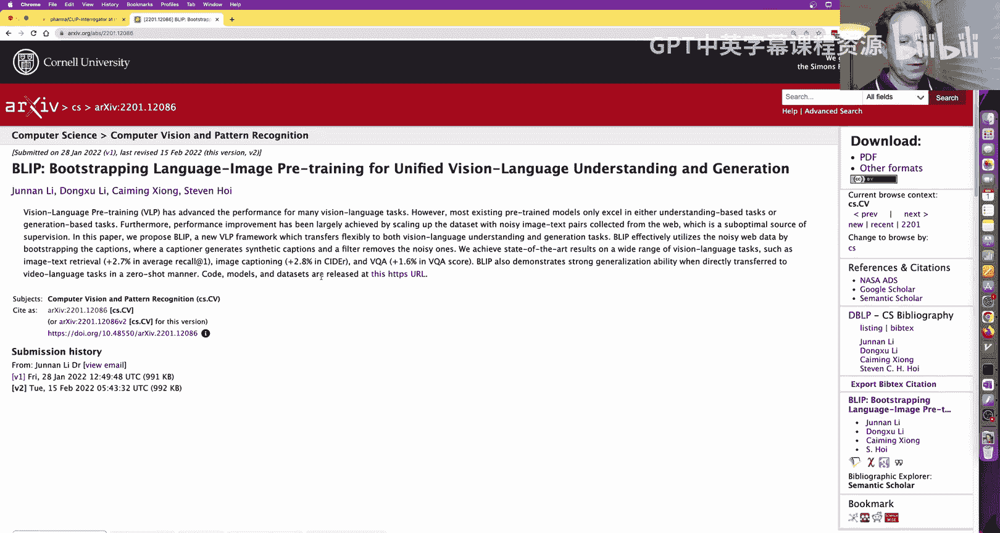
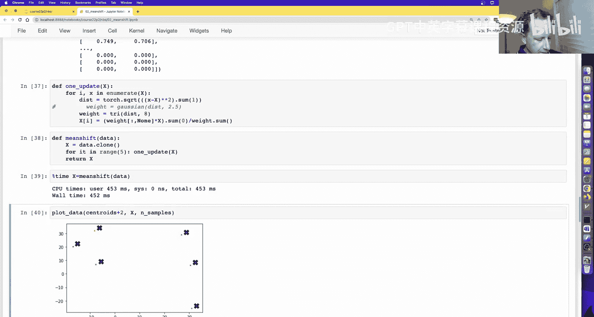
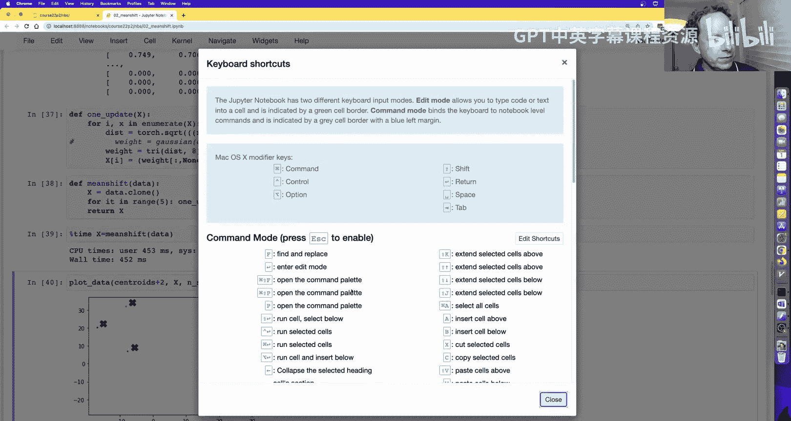
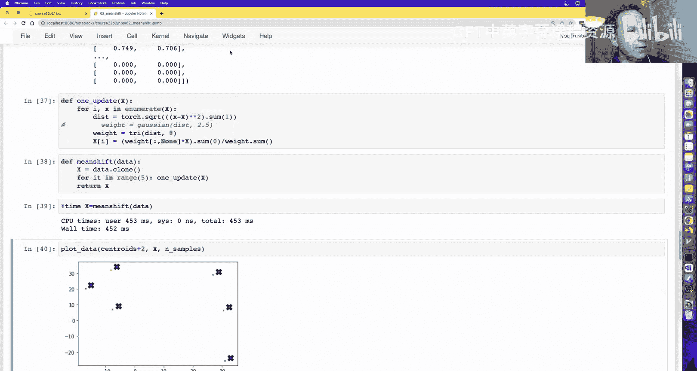
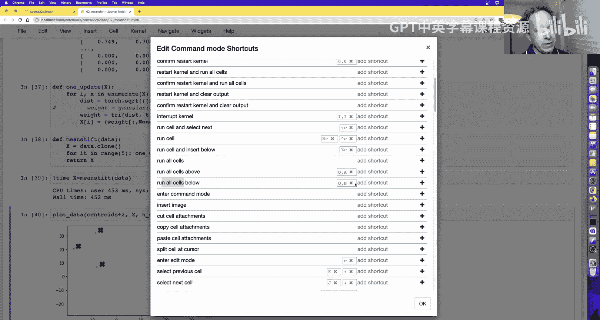

# 深度学习基础到稳定扩散模型：6：矩阵乘法、聚类与微积分入门


## 概述
在本节课中，我们将要学习三个核心主题：深入理解稳定扩散模型背后的“逆问题”概念、通过实现均值漂移聚类算法来练习矩阵运算与GPU加速，以及为后续的反向传播学习微积分基础知识。

---







## 逆问题与稳定扩散 🔄




上一节我们介绍了扩散模型的基本原理，本节中我们来看看一个常见的误解：CLIP Interrogator这类工具能否“逆转”图像生成过程。

最近，一个名为CLIP Interrogator的工具受到了很多关注。用户上传一张图片，它会输出一段文本提示。许多人误以为这段文本提示就是能生成原图的“完美提示词”。但事实并非如此，这揭示了一些人对稳定扩散工作原理的误解。

让我们通过一个思想实验来理解为什么无法做到这一点：
1.  假设你的朋友想通过电子邮件发送一张照片给你。
2.  为了压缩，他使用CLIP图像编码器将图片转换为一个嵌入向量。这个向量比原图小得多。
3.  他发送了这个嵌入向量，并期望你能将其“解码”回原图。

这个过程在数学上意味着寻找一个编码函数 **F** 的逆函数 **F⁻¹**，使得 **F⁻¹(F(x)) = x**。然而，并非所有函数都有逆函数。例如，一个将所有输入都映射为0的函数就无法逆转。更重要的是，CLIP编码器将高维图像（如512x512x3）压缩到低维向量，信息已经丢失，因此不存在精确的逆函数。

那么，稳定扩散在做什么？它实际上是在尝试**近似解决一个逆问题**。扩散过程学习从噪声和条件（如图像或文本嵌入）出发，逐步去噪以生成图像。它并不是在精确反转编码器，而是在生成一个**可能产生相似嵌入**的图像。

**为什么CLIP Interrogator的输出不是“完美提示词”？**
试图从图像嵌入反推回原始图片，与试图反推回精确的文本提示，是同样不可行的。两者都需要逆转一个编码器，而这并不存在。目前最好的方法是通过扩散过程来近似。因此，CLIP Interrogator生成的文本是有趣的尝试，但并非能精确复现原图的“咒语”。其代码显示，它实际上是混合了一个预定义的艺术家、风格等列表，并结合了BLIP图像描述模型的输出，而非真正的逆运算。

---

## 矩阵乘法优化实践 ⚡

在掌握了逆问题的概念后，我们将回到代码实践，优化矩阵乘法这一核心操作。

上一节我们通过广播将双循环优化为单循环，速度提升了5000倍。本节中我们来看看更强大的工具：爱因斯坦求和约定。

爱因斯坦求和是一种紧凑表示乘积和求和的标记法。整个矩阵乘法操作可以压缩为一行字符。例如，对于两个矩阵 **M1 (I x K)** 和 **M2 (K x J)**，其矩阵乘法可以用爱因斯坦求和表示为：
```python
torch.einsum('ik,kj->ij', M1, M2)
```
*   箭头左侧 `ik,kj` 是输入矩阵及其维度标记。
*   箭头右侧 `ij` 是输出矩阵的维度。
*   规则是：在输入中重复的维度标记（如 `k`）意味着沿该轴的元素相乘后求和。如果该标记未出现在输出中，则自动执行求和。

爱因斯坦求和非常方便，能极大简化涉及乘积和求和的代码，并且其执行速度与我们之前最快的广播方法相当。

当然，PyTorch本身提供了更直接的矩阵乘法：
*   `X_train @ weights`
*   `torch.matmul(X_train, weights)`
它们的速度与`einsum`版本相近。

### GPU加速计算 🚀

目前我们的计算都在CPU上进行。为了更快，我们可以利用GPU的并行计算能力。

GPU（如NVIDIA GPU）通过同时执行大量并行操作来工作。为了在GPU上运行，我们需要编写一个“内核”函数，该函数能独立计算输出矩阵中的单个元素，这样成千上万个这样的计算就可以同时进行。

以下是使用Numba库编译CUDA内核的简化步骤：
1.  使用 `@cuda.jit` 装饰器定义一个内核函数，计算单个输出元素。
2.  将输入和输出张量复制到GPU设备。
3.  配置网格和块的大小（CUDA编程模型细节），然后启动内核。
4.  将结果从GPU复制回CPU（主机）。

**性能对比**：
*   原始Python双循环版本：约663毫秒
*   PyTorch CPU矩阵乘法：约15毫秒
*   我们的CUDA内核版本：约3.61毫秒
*   直接使用PyTorch GPU张量（`.cuda()`）进行矩阵乘法：约458微秒

**最终，使用PyTorch在GPU上进行矩阵乘法，比我们最初的纯Python实现快了约500万倍**。这充分说明了为什么在深度学习中必须使用GPU。

---

## 均值漂移聚类算法实践 📊

现在，让我们运用所学的张量操作技能来实现一个完整的算法：均值漂移聚类。

聚类分析与我们目前学过的任务不同，它没有要预测的因变量，而是试图在数据中发现相似项的分组（簇）。

我们将实现一个名为“均值漂移”的算法。它的优点是无需预先指定簇的数量，并且能处理任意形状的簇。

### 算法原理
1.  对于数据集中的每一个点，我们将其视为“兴趣点”。
2.  计算该点到数据集中**所有其他点**的距离。
3.  根据距离计算权重，距离越近的点权重越高（使用高斯核或三角核函数）。
4.  计算所有点的**加权平均**，得到一个新的位置。这相当于将兴趣点向其“局部重心”移动一步。
5.  对数据集中所有点重复上述步骤（一次迭代）。
6.  经过多次迭代后，数据点会收敛到几个簇中心。





以下是算法核心步骤的简化代码框架：
```python
def mean_shift_step(X, bandwidth=2.5):
    X_new = X.clone()
    for i, x in enumerate(X):
        # 1. 计算到所有点的距离
        dists = torch.sqrt(((X - x)**2).sum(1))
        # 2. 根据高斯核计算权重
        weights = torch.exp(-0.5 * (dists / bandwidth)**2)
        # 3. 计算加权平均，更新该点位置
        X_new[i] = (weights[:, None] * X).sum(0) / weights.sum()
    return X_new
```





### 创建动画可视化 🎬
为了观察聚类过程，我们可以使用Matplotlib创建动画。以下是简化步骤：
```python
from matplotlib.animation import FuncAnimation
fig, ax = plt.subplots()
def update_frame(d):
    if d > 0:
        mean_shift_step(X) # 执行一次更新
    ax.clear()
    ax.scatter(X[:,0], X[:,1], alpha=0.3)
ani = FuncAnimation(fig, update_frame, frames=5, interval=500)
HTML(ani.to_jshtml()) # 在Jupyter中显示
```

### 使用广播和GPU进行优化
我们之前的实现有一个Python循环，这在GPU上效率很低。我们可以利用广播一次性计算一个“小批量”点与所有点的距离和权重。

关键思路：
*   将“兴趣点”从单个向量 `x (2,)` 变为一个小批量矩阵 `x_batch (B, 2)`。
*   通过巧妙添加维度，利用广播计算 `x_batch` 中每个点与大数据集 `X (N, 2)` 中所有点的距离，得到一个 `(B, N)` 的距离矩阵。
*   后续的权重计算和加权平均都可以通过广播和矩阵操作完成，消除显式循环。

通过将数据移至GPU（`.cuda()`）并利用这种批处理广播方式，我们可以实现显著的加速，处理数千个数据点仅需毫秒级时间。

**作业与挑战**：
*   **基础**：实现K-Means等其他聚类算法，并尝试制作动画。
*   **进阶**：均值漂移算法需要计算所有点对之间的距离（O(N²)复杂度）。思考如何利用局部敏感哈希（LSH）或KD-Tree等近似最近邻算法来加速，只计算附近点的权重。
*   **挑战**：基于你的优化思路，尝试设计并实现一个更快的均值漂移算法变体。

---

## 微积分基础导论 📈

最后，为了给下一课学习神经网络的核心——反向传播和链式法则做好准备，我们需要回顾微积分的基础概念：导数。

### 什么是导数？
导数衡量的是函数在某一点处的**瞬时变化率**，也就是斜率。

考虑一辆汽车行驶的例子：
*   我们可以记录在不同时间点 `t`，汽车行驶的距离 `s(t)`。
*   要计算从 `t1` 到 `t2` 之间的**平均速度**，我们用距离的变化量除以时间的变化量：`(s(t2) - s(t1)) / (t2 - t1)`。这就是两点间连线的斜率。
*   **导数**关心的是在**某一个瞬间** `t1` 的速度。我们可以让时间间隔 `d = t2 - t1` 变得非常非常小，然后用 `(s(t1 + d) - s(t1)) / d` 来近似 `t1` 时刻的瞬时速度。当 `d` 无限趋近于0时，这个比值就是导数，记作 `ds/dt`。

### 我们需要的微积分知识
好消息是，对于深度学习，你不需要掌握所有微积分技巧。
1.  **核心概念**：理解导数即变化率这一基本思想。如果你需要复习，强烈推荐观看3Blue1Brown的《微积分的本质》系列视频。
2.  **不需要手动求导**：我们不需要记忆 `x^2` 的导数是 `2x` 这类规则，PyTorch的自动微分会替我们完成。
3.  **关键规则**：下一课我们将用到**链式法则**。它用于计算复合函数的导数，形式为：`dy/dx = (dy/du) * (du/dx)`。你可以直观地将其中的 `du` 视为可以“约掉”的微小量。这是反向传播算法的数学基础。

我们不会涉及积分，也尽量避免复杂的极限理论，而是采用更直观的“无穷小量”思维方式来处理导数，这对理解深度学习中的微积分已经足够。

---

## 总结
本节课中我们一起学习了：
1.  **逆问题**：理解了稳定扩散模型是在近似解决从嵌入向量重建图像的逆问题，澄清了关于“完美反转”工具的误解。
2.  **高效矩阵运算**：实践了爱因斯坦求和约定，并成功将矩阵乘法移植到GPU上运行，获得了数百万倍的加速。
3.  **聚类算法实践**：从头实现了均值漂移聚类算法，并运用广播和GPU对其进行了优化，同时学习了如何用动画可视化算法过程。
4.  **微积分入门**：为学习反向传播打下了基础，明确了导数作为变化率的本质，并预告了链式法则的重要性。


下一课，我们将结合矩阵乘法和链式法则，从零开始实现反向传播算法，这是训练神经网络的关键一步。