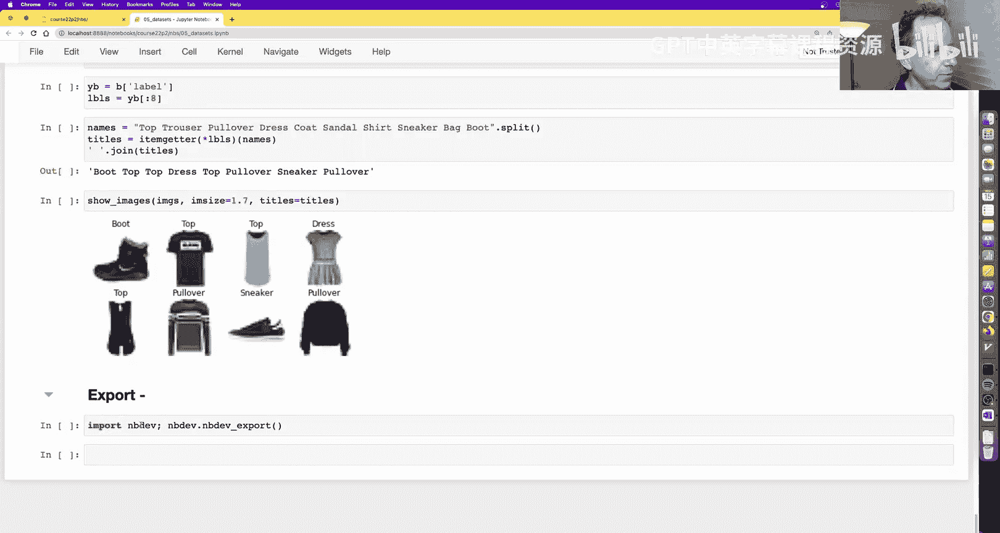
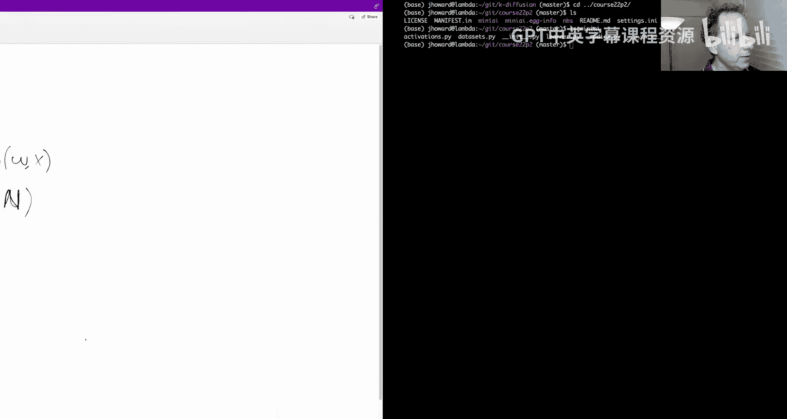
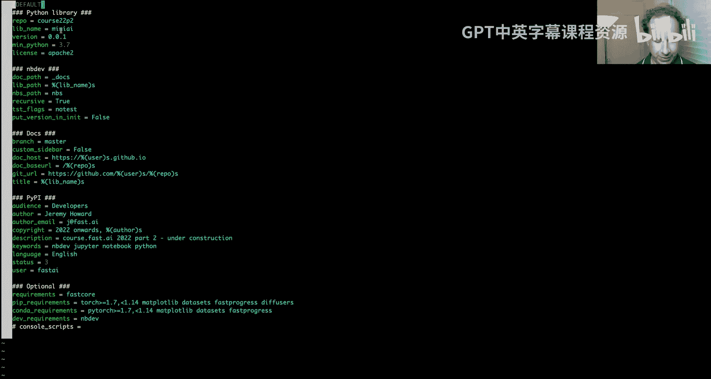
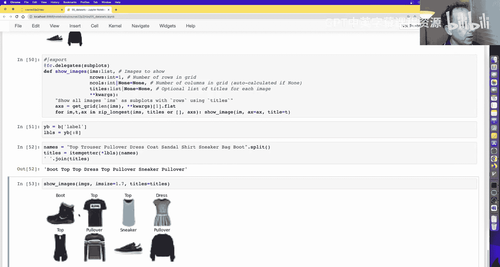
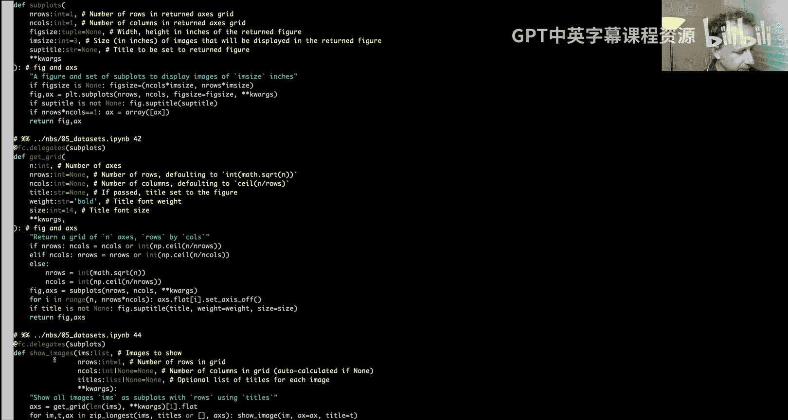
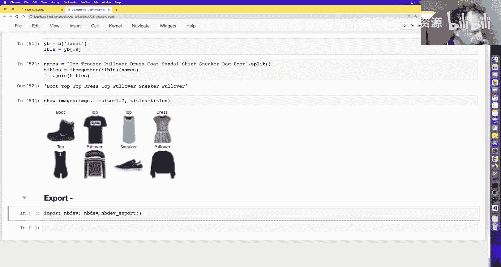
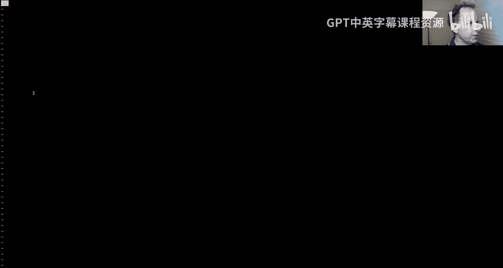
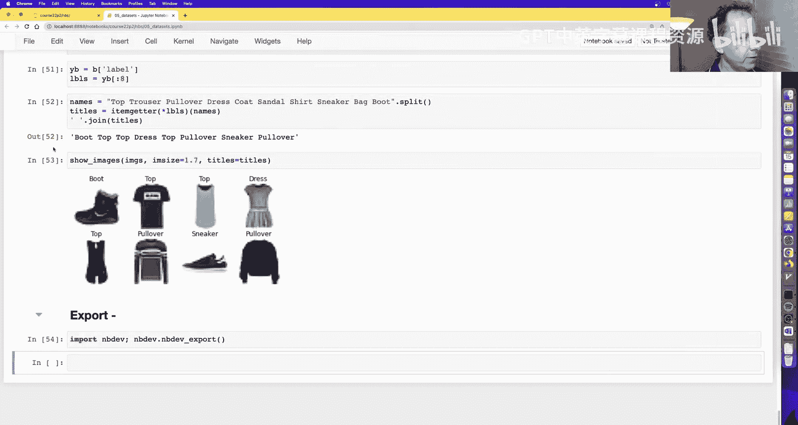
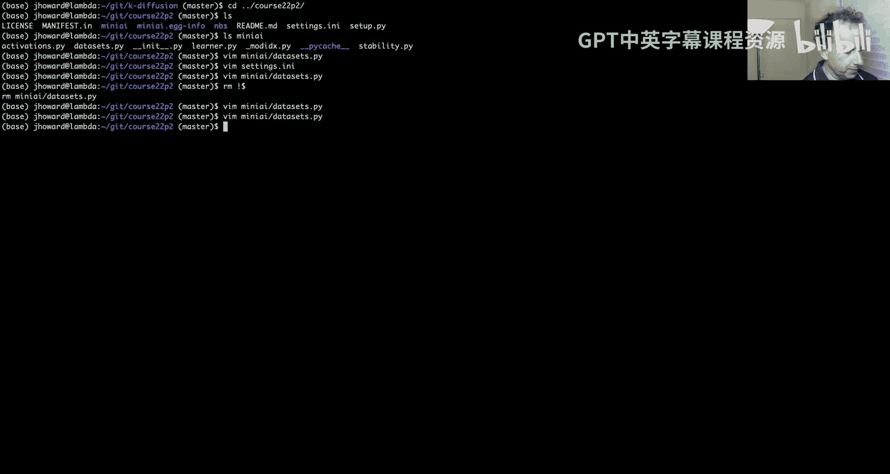
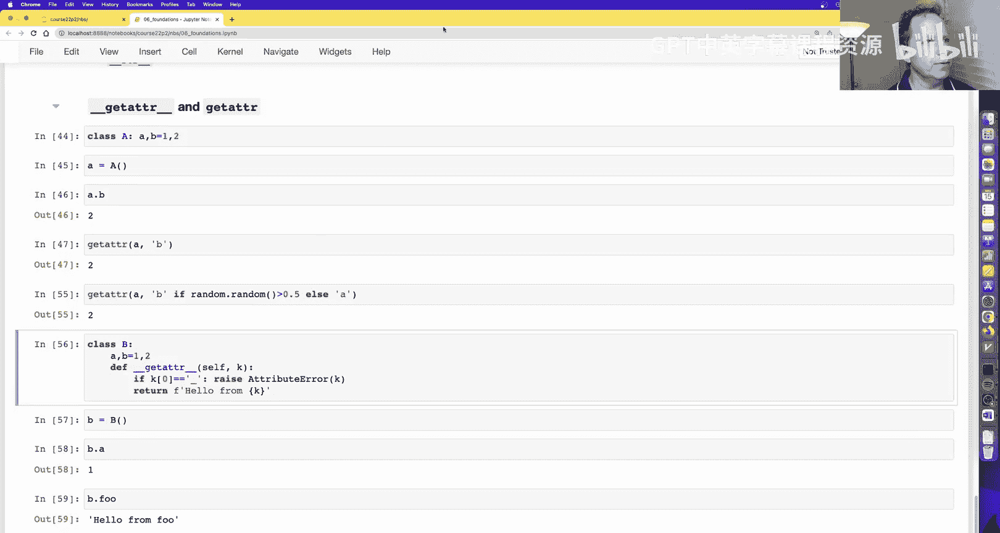

# 深度学习基础到稳定扩散模型：8：构建训练循环与数据加载器

## 概述
在本节课中，我们将学习如何从零开始构建一个完整的神经网络训练循环，并深入理解其核心组件。我们将实现数据加载器、优化器、回调函数等关键部分，最终整合成一个简洁高效的训练流程。通过动手实践，你将掌握PyTorch底层机制，并能灵活定制自己的训练框架。

---

## 回顾与代码解析
上一节我们讨论了微积分和反向传播在神经网络训练中的高效实现。一位优秀的学生Kak Sinha对相关代码进行了详细解释，我已将链接附在课程资源中。该资源结合了数学推导与代码实现，虽然代码略有不同，但核心思想一致，有助于理解数学与代码之间的联系。

### 损失函数与链式法则
基本思想是，我们有一个神经网络计算损失函数。假设损失函数为 **L**，神经网络函数为 **n**，它接收权重 **w** 和输入 **x**。损失函数还需要目标值 **y**，但为简化讨论，我们暂时忽略。

我们关心的是：如何更新权重 **w**？即，损失 **L** 如何随权重 **w** 的变化而变化？我们可以使用链式法则计算：

**∂L/∂w = (∂L/∂n) * (∂n/∂w)**

类似地，对于输入 **x**：

**∂L/∂x = (∂L/∂n) * (∂n/∂x)**

在代码中，`out.g` 存储了 **∂L/∂n**，`inp.g` 存储了 **∂L/∂x**，`w.g` 存储了 **∂L/∂w**。通过矩阵乘法（或转置），我们实现了这些计算。

如果你对微积分和链式法则不熟悉，我推荐观看3Blue1Brown的《微积分的本质》系列或使用可汗学院资源。只需几个小时，你就能掌握基础知识，从而更好地理解后续内容。

---

## 构建训练循环
上一节我们成功创建了一个训练循环，包含以下四个步骤：

1.  前向传播计算预测值
2.  计算损失
3.  反向传播计算梯度
4.  使用梯度更新权重

令人兴奋的是，所有这些步骤我们都已从零实现。我们成功训练了一个MNIST手写数字识别模型，达到了96%的准确率。

我重构了代码，添加了一个`report`函数，在每个训练周期结束时打印损失和准确率。这里使用了Python的f-string和格式说明符来美化输出，例如`{loss:.2f}`表示将`loss`格式化为两位小数的浮点数。

为了高效工作，我为常用操作设置了键盘快捷键。例如，`Q A`运行当前单元格上方的所有单元格，`Q B`运行下方的所有单元格。

---

## 重构：使用`nn.Module`
我们的代码目前有些冗长，缺少一些功能。现在开始重构，目标是减少代码量，同时保持功能不变。我们将使用PyTorch的`nn.Module`，并学习如何自己构建它。

PyTorch的`torch.nn`子模块中有一个`Module`类。通常我们不直接实例化它，而是继承它来创建自定义模块。这样做的好处是，`Module`会自动跟踪其内部的子模块和参数。

例如，我们可以创建一个自定义的多层感知机（MLP）类：

```python
class MLP(nn.Module):
    def __init__(self, n_in, nh, n_out):
        super().__init__()
        self.l1 = nn.Linear(n_in, nh)
        self.l2 = nn.Linear(nh, n_out)
        self.relu = nn.ReLU()

    def forward(self, x):
        return self.l2(self.relu(self.l1(x)))
```

创建实例后，我们可以查看其参数：`list(model.parameters())`会返回所有权重和偏置。这样，我们就不再需要手动将层放入列表并管理参数。我们可以直接遍历`model.parameters()`来更新权重，或使用`model.zero_grad()`清零所有梯度。

这使我们的代码更加简洁和灵活。那么，`nn.Module`是如何自动知道参数和层的呢？它使用了一个称为`__setattr__`的技巧。

### 实现自定义`nn.Module`
让我们自己构建一个简单的`nn.Module`。在`__init__`中，我们创建一个字典来存储所有子模块。然后定义`__setattr__`方法，每当设置属性时（如`self.l1 = ...`），如果属性名不以`_`开头，我们就将其存入模块字典，并调用父类的`__setattr__`来实际设置属性。

`__repr__`方法用于返回模块的字符串表示，方便打印。`parameters`方法则遍历所有子模块，并生成其参数的迭代器。这里可以使用`yield from`语法来简化代码，它相当于逐个`yield`迭代器中的每个元素。

现在，我们已经理解了`nn.Module`的原理，可以放心使用PyTorch提供的版本了。

---

## 重构：使用`nn.Sequential`
如果我们想像最初那样，将层放在一个列表中，而不是逐个定义为属性，该怎么办？我们可以查看PyTorch的`nn.Sequential`是如何实现的。

我们可以创建一个`SequentialModel`类，继承自`nn.Module`。在`__init__`中，我们接收一个层列表，然后遍历它们，使用`add_module`方法将每一层注册到模块中。在`forward`方法中，我们依次将输入传递给每一层。

PyTorch提供了`nn.ModuleList`，它可以自动帮我们注册列表中的所有模块。因此，我们可以这样创建顺序模型：

```python
class SequentialModel(nn.Module):
    def __init__(self, layers):
        super().__init__()
        self.layers = nn.ModuleList(layers)

    def forward(self, x):
        for layer in self.layers:
            x = layer(x)
        return x
```

另一种有趣的实现方式是使用`reduce`函数。`reduce`是一个常见的计算机科学概念，称为“归约”。它从一个初始值开始，遍历序列，并对每个元素应用一个函数，将当前结果和下一个元素结合，最终返回一个值。在这里，`reduce`可以替代显式的循环。

当然，我们可以直接使用PyTorch内置的`nn.Sequential`。

---

## 重构：使用优化器
遍历参数并使用梯度更新权重、然后清零梯度，这是一个非常常见的操作。因此，PyTorch提供了`optim`模块。让我们自己实现一个简单的SGD优化器：

```python
class Optimizer:
    def __init__(self, params, lr):
        self.params = list(params)
        self.lr = lr

    def step(self):
        for p in self.params:
            p.data -= p.grad * self.lr

    def zero_grad(self):
        for p in self.params:
            p.grad = None
```

现在，我们的训练循环可以简化为：

```python
opt = Optimizer(model.parameters(), lr)
for epoch in range(epochs):
    # ... 计算损失和梯度
    opt.step()
    opt.zero_grad()
```

PyTorch内置的`torch.optim.SGD`功能类似。我们可以创建一个`get_model`函数来返回模型和优化器，进一步组织代码。

---

## 重构：数据集与数据加载器
我们的代码仍然较多。接下来，我们将用更简洁的方式替换数据切片部分。

### 数据集 (`Dataset`)
我们创建一个`Dataset`类，它接收自变量`x`和因变量`y`，并存储起来。实现`__len__`方法返回数据长度，实现`__getitem__`方法，当使用索引（如`dataset[i]`）时，返回对应的`(x, y)`元组。

```python
class Dataset:
    def __init__(self, x, y):
        self.x, self.y = x, y
    def __len__(self): return len(self.x)
    def __getitem__(self, i): return self.x[i], self.y[i]
```

创建训练和验证数据集后，我们可以直接使用切片操作获取批量数据。

### 数据加载器 (`DataLoader`)
数据加载器是一个迭代器，它从数据集中按批次获取数据。我们创建一个`DataLoader`类，接收数据集和批次大小。实现`__iter__`方法，遍历数据索引范围，并`yield`每个批次的数据。

```python
class DataLoader:
    def __init__(self, ds, bs):
        self.ds, self.bs = ds, bs
    def __iter__(self):
        for i in range(0, len(self.ds), self.bs):
            yield self.ds[i:i+self.bs]
```

现在，我们的训练循环可以简化为遍历数据加载器：`for xb, yb in train_dl:`。

代码变得简洁后，我们可以开始添加新功能，例如打乱训练数据顺序。

---

## 添加采样器与批处理
我们希望每个训练周期中，数据的顺序是随机的。为此，我们创建`Sampler`类。如果不打乱，它按顺序返回索引；如果打乱，则随机排列索引。

接着，我们创建`BatchSampler`，它接收一个采样器和批次大小，将索引按批次分组。

然后，修改`DataLoader`，使其接收一个批采样器。在迭代时，它从批采样器获取一批索引，然后从数据集中获取对应的数据，并使用一个`collate`函数将这些数据堆叠成张量。

`collate`函数默认将一批`(x, y)`元组列表，转换为两个张量：一个堆叠所有`x`，一个堆叠所有`y`。它使用`zip(*batch)`来“转置”列表，然后进行堆叠。

PyTorch的数据加载器正是由这些组件构成：采样器、批采样器、整理函数和数据加载器本身。PyTorch还提供了一些快捷方式，例如可以直接将`batch_size`和`shuffle`参数传递给`DataLoader`，它会自动创建相应的采样器。

一个有趣的技巧是：如果数据集本身支持通过多个索引一次性获取数据（即`__getitem__`可以接收索引列表），那么我们可以直接将批采样器作为采样器使用，省去遍历和整理的步骤，这可以显著提高效率。

---

## 添加验证集与最终训练循环
现在，我们在训练循环中添加验证集评估。在训练过程中，定期在验证集上计算损失和准确率，并打印出来。





我们使用PyTorch的`DataLoader`来创建训练和验证数据加载器。对于验证集，我们可以使用更大的批次大小，因为它不需要反向传播，内存占用更少。



最终，我们实现了一个完整、合理的训练循环。虽然代码比理想情况稍多，但每一行及其调用的代码都是我们自己构建或重新实现的。这意味着我们完全理解其原理，可以自由地创建任何我们想要的功能。

---

## 使用Hugging Face数据集
现在我们已经有了训练循环，接下来学习如何使用Hugging Face的`datasets`库来加载数据。这将使我们能够利用海量的开源数据集。

首先安装库：`pip install datasets`。我们可以加载一个数据集，例如Fashion MNIST。Hugging Face的数据集通常返回字典（包含`image`和`label`键），而不是元组。

为了将其用于训练，我们需要一个整理函数，将字典批次转换为张量元组。更优雅的方式是使用`with_transform`方法，在数据加载时应用转换函数（例如将PIL图像转换为张量）。我们可以使用装饰器来简化转换函数的编写。

此外，我们可以使用`itemgetter`函数和`default_collate`来创建一个通用的整理函数，将Hugging Face的字典数据集转换为PyTorch期望的元组格式。

为了方便复用，我们将这些实用函数导出到自定义的Python模块中。我们使用`nbdev`库来管理从笔记本到模块的导出。

---













## 数据可视化
良好的可视化对于理解数据和模型至关重要。我们从头开始构建一些绘图工具。

基本的图像绘制使用`matplotlib`的`imshow`。我们创建`show_image`函数，它会处理一些细节，如确保数组顺序正确、将张量移至CPU、转换为NumPy数组、设置标题和隐藏坐标轴。

我们使用`fastcore`的`delegates`装饰器来包装`imshow`，这样既能扩展功能，又能自动继承原函数的文档。

为了绘制多个图像，我们需要创建子图。`matplotlib`的`subplots`函数返回一个轴（axes）对象数组。我们可以在每个轴上调用`show_image`来显示不同的图像。

我们进一步封装了`subplots`，使其能自动计算合适的图形大小，并支持为整个图设置标题。最后，我们创建了`show_images`函数，它可以方便地显示一批图像及其标签。

这些绘图函数也被导出到我们的自定义模块中，便于后续使用。

---

## Python进阶概念：回调函数与特殊方法
在构建通用的训练器（`Learner`）之前，我们需要熟悉一些Python进阶概念，例如回调函数和特殊方法（双下划线方法）。这些在后续代码中会频繁使用。

### 回调函数
回调函数是一个可调用对象，在特定事件发生时被调用。在GUI编程中非常常见，例如按钮点击事件。我们也可以在自己的慢速计算（如模型训练）中使用回调，来定期打印进度或更新进度条。

回调不一定非得是函数。它可以是一个具有特定方法（如`before_batch`、`after_batch`）的类。这样可以提供更灵活的控制。

我们可以使用`lambda`表达式、`partial`函数或可调用类来定义回调。`partial`用于固定函数的部分参数，生成一个新函数。

### 特殊方法
Python中的双下划线方法（如`__call__`、`__getattr__`）是特殊的。它们由Python语言、PyTorch或其他库定义，用于实现特定行为。

例如，`+`操作符实际上调用了`__add__`方法。`a.b`属性访问调用了`__getattr__`方法（如果属性`b`不存在）。`__getattr__`可以用于动态创建属性或提供便捷的访问方式。

理解这些特殊方法对于阅读和编写复杂的框架代码非常重要。

---



## 总结
本节课中，我们一起完成了一个深度学习训练基础设施的搭建。我们从最基础的反向传播原理出发，逐步实现了：
*   自定义神经网络模块 (`nn.Module`)
*   优化器 (`Optimizer`)
*   数据集 (`Dataset`) 和数据加载器 (`DataLoader`)，包括采样和多进程加载
*   完整的训练循环，支持训练集和验证集
*   与Hugging Face数据集的集成
*   数据可视化工具
*   理解了回调函数和Python特殊方法等关键概念

现在，我们已经具备了所有必要的组件，可以构建一个通用的`Learner`类来封装训练循环。这将使我们能够更高效地实验和研究各种模型。下节课，我们将着手实现这个`Learner`，并深入探索模型训练与调优。