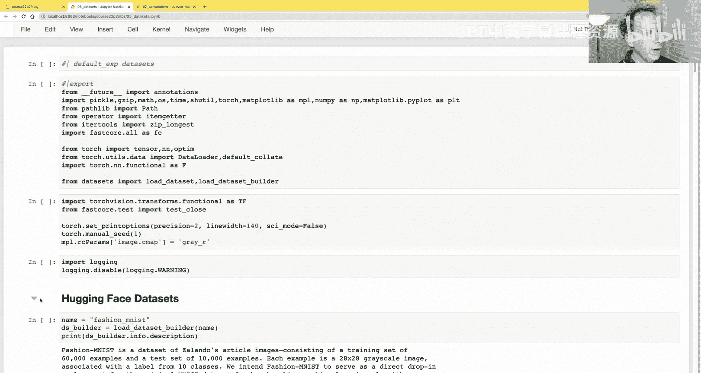
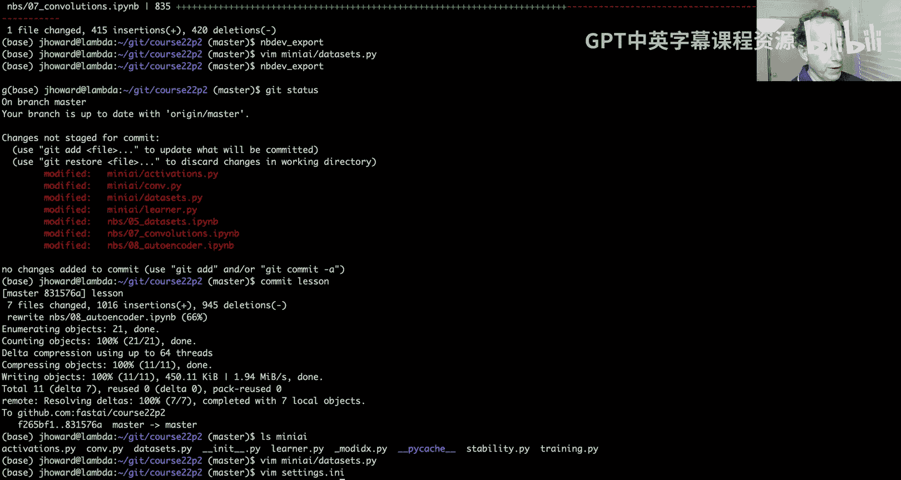
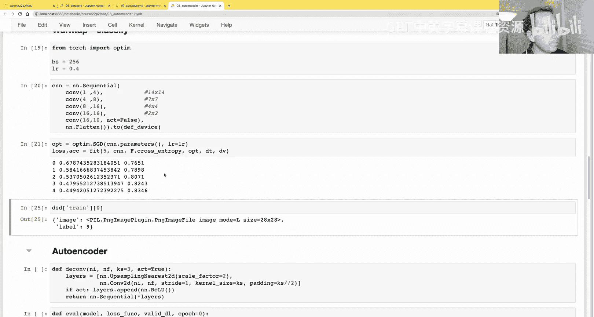
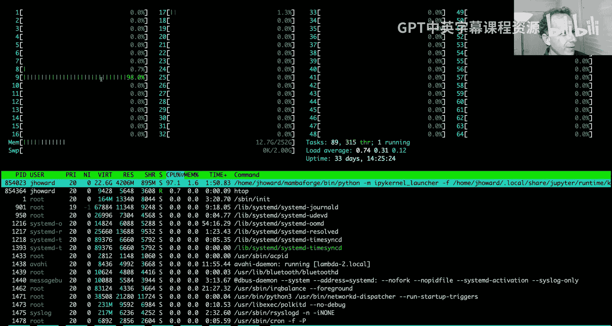
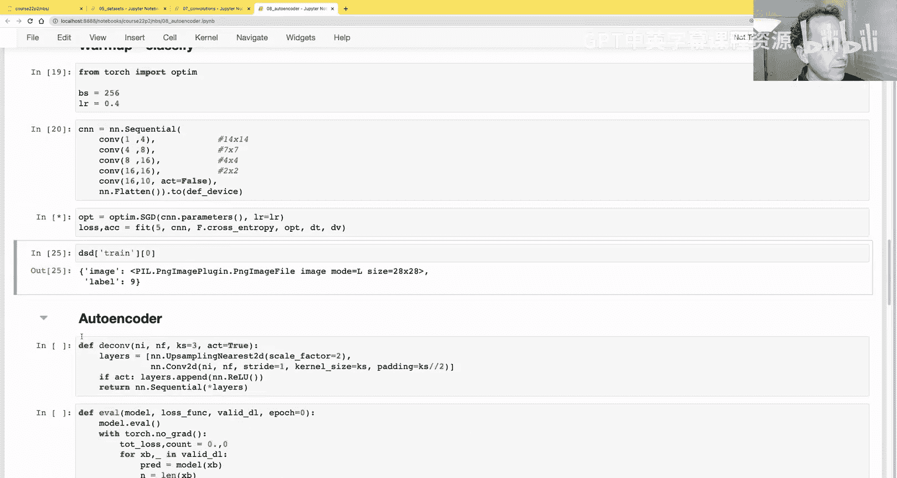
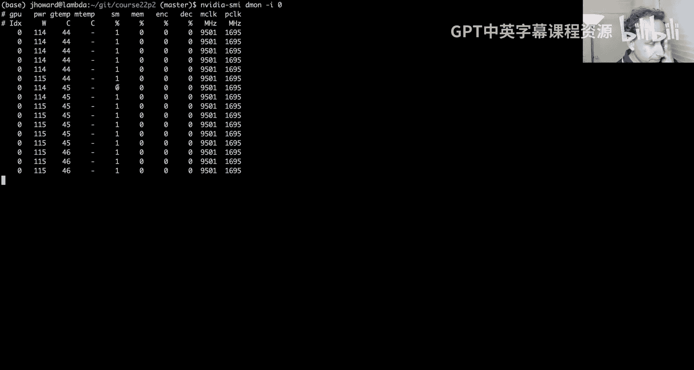
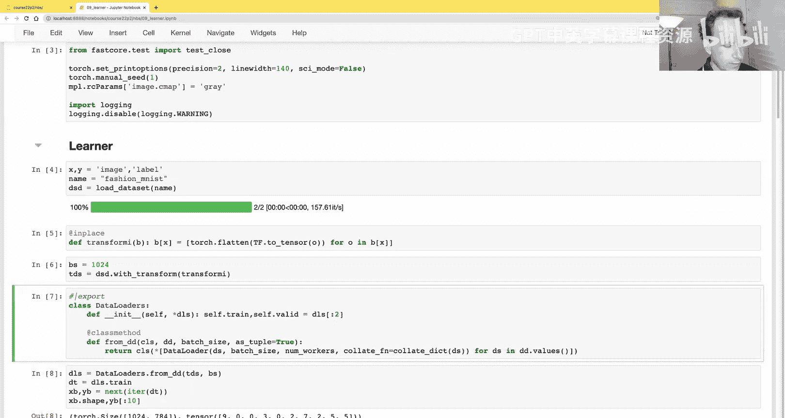
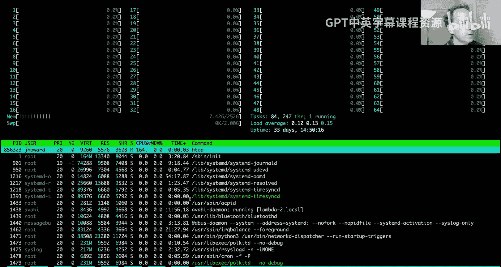
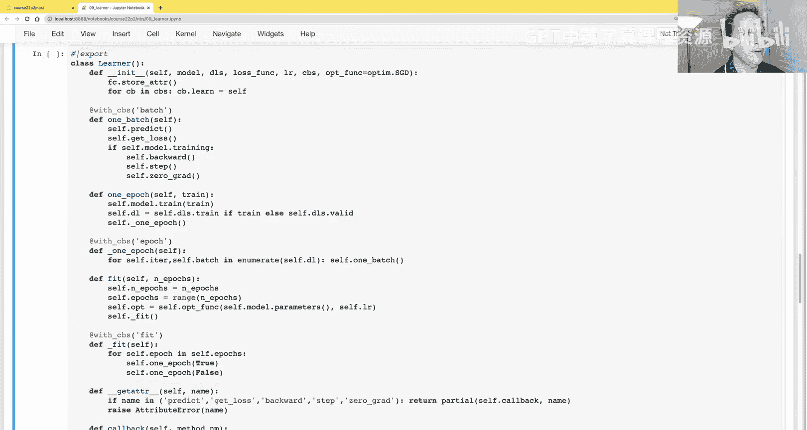

# 深度学习基础到稳定扩散模型：9：卷积自编码器

在本节课中，我们将学习如何创建一个卷积自编码器。在这个过程中，我们会发现做好这件事并不容易。如果时间允许，我们还将开始构建一个深度学习框架，以使后续工作更加便捷。

## 卷积神经网络基础

上一节我们介绍了多层感知机。本节中，我们来看看卷积神经网络。在创建卷积自编码器之前，我们需要先了解卷积：它是什么，以及它的用途是什么？

广义上讲，卷积是一种允许我们向神经网络告知问题结构的方法，这能使网络更容易解决问题。具体到我们的任务，我们处理的是图像。图像排列在网格上：黑白图像是2D网格，彩色图像是3D网格，彩色视频则是4D网格等等。

因此，像素在横向和纵向之间存在关联，它们往往彼此相似。这些维度上像素的差异通常具有意义。出现在不同位置的像素块常常代表相同的事物。例如，一只猫在左上角仍然是猫，即使在右下角也是如此。这种先验信息可以被卷积神经网络自然地捕捉。

一般来说，这是件好事，因为这意味着我们能够使用更少的参数和计算量，因为关于我们正在解决的问题的更多信息被直接编码到了我们的架构中。还有其他架构，如我们目前看到的多层感知机，或我们尚未了解的Transformer网络，它们没有如此强烈地编码这种先验信息。这些架构可能提供更大的灵活性，如果有足够的时间、算力和数据，它们可能发现卷积神经网络难以发现的东西。

因此，我们并不总是使用卷积神经网络，但它们是一个很好的起点，并且理解它们非常重要。卷积不仅用于图像，我们还可以利用一维卷积处理基于语言的任务。所以卷积应用广泛。

## 卷积操作详解

在这个笔记本中，你可能会注意到我们正在从 `miniAI` 导入一些东西。`miniAI` 是我们正在创建的一个小型库，我们使用 `NBdev` 来创建它。我们导入了 `miniAI.training` 和 `miniAI.datasets`。例如，在数据集的笔记本中，它以声明默认导出模块为 `datasets` 开始。一些单元格上有导出指令，在最底部，我们调用了 `NBdev export`。这将创建一个名为 `datasets.py` 的文件，其中包含我们导出的那些单元格。它之所以被称为 `miniAI.datasets`，是因为 `NBdev` 的所有设置都存储在 `settings.ini` 中，其中指定了库名为 `miniAI`。

在安装这个库之前，你无法使用它。我们还没有将其作为可pip安装的包上传到公共服务器，但你可以将本地目录安装为Python模块。为此，你使用 `pip install -e .` 命令，其中 `-e` 代表可编辑模式，这意味着将当前目录设置为一个Python模块。执行后，它将安装我的库。安装完成后，我就可以从该库导入东西了。

好的，这和之前一样，我们将获取MNIST数据集，并在其上创建一个卷积神经网络。在此之前，我们先讨论什么是卷积。我最喜欢的卷积描述之一来自学生Matt Kinsmith，他写了一篇很棒的文章《从不同角度看CNN》，我将借鉴他的思路。

基本思想是：假设这是我们的图像，它是一个3x3的图像，有九个像素，标记为A到I（大写字母）。卷积使用一个称为**核**的东西，核只是另一个张量，在这个例子中，它是一个2x2矩阵，包含四个值：α, β, γ, δ。

当我们用这个2x2核对这个3x3图像应用卷积时会发生什么？我们取核，将其覆盖在第一个中间的2x2子网格上。具体来说，我们进行颜色匹配，所以第一个2x2覆盖的输出将是：α * A + β * B + γ * D + δ * E。这将产生某个值P，它将位于2x2输出的左上角。

对于2x2输出的右上角，我们将滑动窗口，将核滑动到这里，并将我们的每个系数应用到这些重新着色的方块上。然后滑动到底部左侧，再到底部右侧。最终我们得到这个方程：P = αA + βB + γD + δE + 某个偏置项。Q在右上角，如你所见，它只是α乘以B等等。所以我们基本上是将它们相乘然后相加。你可以想象，我们基本上是将这些展平为秩1张量（向量），然后进行点积，这是思考卷积过程的一种方式。

## 实现卷积

让我们尝试创建一个卷积。例如，我们获取训练图像并查看一张。然后创建一个3x3核。记住，核只是一个我们已经见过的概念。在计算机科学和数学中，“核”这个词出现很多次。我们已经见过“核”指代我们在GPU上跨许多并行虚拟设备运行的代码片段。这里有一个类似的概念，我们有一个计算，在这种情况下类似于点积，在一个网格上多次滑动发生，但有点不同，这是“核”这个词的另一种用法。所以在这种情况下，核将是一个秩2张量。

让我们用这些值创建一个核。这是一个3x3矩阵，秩2张量。我们可以画出它的样子。不奇怪，它看起来像一堆线条。

如果我们把这个核滑动覆盖到这个28x28图像的每一个3x3区域上会发生什么？例如，左上角的3x3区域有这些名称，那么我们将得到 -a1 - a2 - a3，接下来是0，所以什么都不做，然后 +a7 + a8 + a9。这为什么有趣？让我们试试这里。我获取了图像的前13行和前23列。我实际上显示了数字，并使用灰度条件格式来显示顶部这部分。我们正在看的就是这个顶部。

如果我们取第3、4、5行（记住，这是不包含右端的，所以是行3、4、5，列14、15、16），我们看这三个。如果我们用这个核乘以它们会得到什么？我们得到一个相当大的正值，因为我们有负数的三个是顶行（或0），而有正数的三个它们都接近1，所以我们最终得到一个相当大的数字。对于相同的列，但第7、8、9行呢？这里顶部全是正数，底部全是0。这意味着我们将得到很多负项。不出所料，这正是我们看到的。如果我们做这种点积等效操作，在NumPy中你只需要进行逐元素乘法然后求和。所以这将是一个相当大的负数。

也许你看到了这个核在做什么，也许你从我们创建的张量名称中得到了提示。它是一个寻找**顶部边缘**的核。所以这个（正数）是顶部边缘，这个（负数）是底部边缘。我们想把这个核应用到这里的每一个3x3窗口。我们可以通过创建一个 `apply_kernel` 函数来实现，该函数接受特定的行、列和核张量，并执行我们刚才看到的乘法和求和操作。

例如，我们可以通过调用 `apply_kernel` 来复制这个结果，这里指定的是那个3x3网格区域的中心。我们得到了相同的数字：2.97。现在我们可以将该核应用于这个28x28图像中的每一个3x3窗口。我们将像这样滑动红色部分，但我们实际上有一个28x28的输入，而不仅仅是5x5。为了获取所有坐标，让我们简化到5x5。我们可以创建一个列表推导式：遍历 `range(5)` 中的每个 `i` 值，然后对于每个 `i`，遍历 `range(5)` 中的每个 `j` 值。如果我们只看这个元组，你会看到我们得到一个包含所有这些坐标的列表的列表。

这是一个列表推导式中的列表推导式，当你第一次看到时可能会感到惊讶或困惑，但它是一个非常有用的习惯用法，我强烈建议你习惯它。现在，我们不仅要创建这个元组，还要为每个坐标调用 `apply_kernel`。所以我们将遍历从1到26（因为27是排他的）的所有值，然后对于每个值，再次遍历从1到26的所有值，并调用 `apply_kernel`。这将给我们应用该卷积核到每个坐标的结果。这就是结果。你可以看到它如我们所愿地高亮了顶部边缘。

你可能会发现，进行这种图像处理竟然如此简单。我们实际上只是对每个窗口进行逐元素乘法和求和。这就是卷积。

## 更多卷积核示例

我们可以做另一个卷积。这次，我们可以用一个左边缘张量，如你所见，它看起来像是我们顶部边缘张量的旋转版本或转置版本。这就是它的样子。如果我们应用那个核，这次我们将传入左边缘张量。注意，我们实际上传入的是一个函数……抱歉，实际上不是函数，它只是一个张量。所以我们将为相同的列表推导式传入左边缘张量。这次我们得到了左边缘。它高亮了数字中的所有左边缘。

基本上，这里发生的是，一个2x2核在图像上滑动，创建这些输出。你会注意到，在这个过程中，我们丢失了图像最外层的像素。我们稍后会学习如何解决这个问题。但现在请注意，当我们在5x5图像上放置3x3核时，横向只有三个位置可以放置，而不是五个位置，因为我们需要某种边缘。

这很酷，这就是卷积。如果你还记得第一课中的Zeiler和Fergus图片，你可能会认出卷积网络的第一层通常寻找边缘和梯度之类的东西，而这就是它的实现方式。然后，通过卷积层堆叠，并在它们之间使用非线性激活函数，可以将这些边缘组合成曲线、角点等等。

## 优化卷积计算

好的，那么我们如何快速完成这个操作呢？因为目前用Python做这个会超级慢。我见过最早公开可用的通用目的、GPU加速的深度学习库之一叫做Caffe，由杨庆（Yang Qing Jia）创建。他描述了Caffe如何实现快速卷积。基本上，他说他有两个月的时间来完成它，并且必须完成他的论文。所以他最终做的是，他说外面有一些其他代码，比如Kjaski（你可能听说过他，他和Hinton创办了一家小公司，被谷歌收购，这基本上成了谷歌大脑的起点）的库里有各种花哨的东西，但杨庆说：“我不知道怎么做那些东西，所以我想，我已经知道如何做矩阵乘法，也许我可以把卷积转换成矩阵乘法。” 这后来被称为 `im2col`。

`im2col` 是一种将卷积转换为矩阵乘法的方法。实际上，我不确定杨庆是否可能无意中重新发明了它，因为我相信在他写论文的时候，这个方法已经存在一段时间了。我相信这个方法是在2006年的这篇论文中创建的。这就是那篇论文中的描述。

他们描述的是：假设你将这个2x2核覆盖在图像的3x3区域上。这个窗口需要匹配这个窗口的部分。你可以做的是，你可以将这个窗口展开为1,1,2,2（向下到这里1,2,1,2），像这样展开它，你也可以在这里展开核1,1,2,2。一旦它们以这种方式被展平并移动，然后你对下一个补丁做完全相同的事情，2,0,1,3，将其展平并放在这里2,0,1,3。所以，如果你基本上以这种格式展平这些核和输入特征，那么你最终会得到一个矩阵乘法。如果你用这个矩阵乘以这个矩阵，你会得到卷积想要的输出。所以这基本上是一种将你的核和输入特征展开为矩阵的方法，这样当你进行矩阵乘法时，你会得到正确的答案。这是一个巧妙的技巧。

这就是所谓的 `im2col`。实现它有点无聊，只是一堆复制和索引操作。所以我实际上没有自己实现。相反，我链接了一个NumPy实现。它的一部分是这个 `get_indices` 函数。如你所见，它有点繁琐，涉及重复、平铺和重塑等操作。我不称之为作业，但如果你想练习张量索引操作技能，可以尝试从头创建一个PyTorch版本。我得承认我没费心去做。相反，我使用了PyTorch内置的函数。在PyTorch中，它叫做 `unfold`。

如果我们取我们的图像，PyTorch期望有一个批次轴、一个维度轴和一个通道轴，所以我们将为其添加两个前导单位维度。然后我们可以展开我们的输入，使用一个3x3的核。这将给我们一个9x676的输入。然后我们可以取那个，然后我们将取我们的核并将其展平为一个向量。`view` 改变形状，`-1` 表示将所有内容放入这个维度。所以这将创建一个长度为9的向量。现在我们可以像他们在这里做的那样进行矩阵乘法：核矩阵（我们的权重）乘以展开的输入特征。这给我们一个长度为676的结果，然后我们可以将其视为26x26。我们得到了我们期望的左边缘张量结果。

这就是我们如何从头开始创建一个更好的卷积实现。我在这里“作弊”的原因是因为我们确实从头开始创建了卷积。我们并不总是从头开始创建GPU优化版本，这从来不是我承诺的事情。所以我认为这是公平的。但很酷的是，我们可以像最初的深度学习库那样，自己动手实现一个GPU优化版本。

如果我们使用 `apply_kernel`，需要将近9毫秒。如果我们使用 `unfold` 加矩阵乘法，我们得到20微秒。所以快了大约400倍。这很酷。当然，我们不必使用 `unfold` 和矩阵乘法，因为PyTorch有 `conv2d`，我们可以运行它。有趣的是，至少在GPU上，速度差不多。但在GPU上这个也会工作得很好。我不确定是否总是这样，在这种情况下图像相当小，我没有做大量实验来查看这些方法之间在速度上有多大差异。显然我总是只用 `F.conv2d`，但如果你需要做一些更复杂的卷积，涉及通道或维度的一些奇怪操作，你总是可以尝试这个 `unfold` 技巧。知道它存在是很好的。

我们可以对对角线边缘做同样的事情。这是我们的对角线边缘核。或者另一条对角线。如果我们只获取前16张图像，那么我们可以一次性对整个批次应用所有核进行卷积。这是一个很好的优化操作。你最终得到26x26的输出，你有四个通道，你有16张图像。这在这里进行了总结。

所以，为了获得良好的GPU加速，我们通常做的是：一次性跨所有像素处理一批核和一批图像。这就是当我们查看特定图像的各种核时发生的情况：左边缘、顶部边缘，然后是对角线（左上和右上）。

## 填充与步幅

好的，这就是优化卷积，它在CPU或GPU上都能工作得很好，显然如果你有GPU会更快。现在，我们如何处理丢失每边一个像素的问题？我们可以添加一种叫做**填充**的东西。对于填充，我们基本上做的是：不是从这里开始我们的窗口，而是从这里开始，实际上还会向上移动一个。所以左边的这三个，我们只取每个的输入为零。所以我们基本上假设它们都是零。还有其他选项可以选择，我们可以假设它们与旁边的那个相同。有各种方法可以做，但最简单且我们通常做的是假设为零。

例如，这被称为单像素填充。假设我们做了两像素填充。对于一个5x5的输入和一个4x4的核，那么我们的核。然后我们从角落这里开始。你可以看到当我们滑动核时，它会经过的所有位置。所以这个虚线区域是我们实际上要经过的区域。但所有这些白色部分，我们都将视为0。然后这个绿色是输出大小，最终将是6x6（对于5x5输入）。我应该提一下，偶数大小的核不常用，我们通常使用奇数大小的核。如果你使用，例如，一个3x3核和一像素填充，你将得到与开始时相同的大小。如果你使用5x5核和三像素填充，你最终会得到与开始时相同的大小。所以一般来说，奇数大小的核更容易处理，以确保你最终得到与开始时相同的东西。

另一个技巧是，你不必总是每次将窗口移动一个位置，你可以每次移动不同的量。你移动的量被称为**步幅**。例如，这是一个步幅为2的例子，填充为1。所以我们从这里开始，然后跳两个，然后再跳两个，然后到下一行。这被称为步幅2卷积。步幅2卷积很方便，因为它们实际上将输入的维度减少了两倍。这正是我们在自编码器中经常想做的事情。事实上，对于大多数分类架构，我们正是这样做的。我们一次又一次地使用步幅2卷积和填充1，将网格大小减少两倍。

## 构建卷积神经网络

这就是步幅和填充。让我们继续使用这些方法创建一个卷积网络。

我们将获取训练集的大小，这和之前一样：类别数量、数字数量、隐藏层大小。之前，对于我们的顺序线性模型（MLP），我们基本上是从像素数到隐藏层数，然后一个激活函数，然后从隐藏层数到输出数。

这是卷积的等效结构。现在的问题是，你不能直接这样做，因为输出现在不是批次中每个项目的10个概率，而是批次中每个项目在每个28x28像素位置上的10个概率，因为我们甚至没有使用步幅。所以你不能直接使用我们在MLP中使用的简单方法。我们必须更加小心。

为了让事情更容易，让我们创建一个小型的 `conv` 函数，它执行一个 `conv2d` 操作，步幅为2，可选地后跟一个激活函数。所以如果 `act` 为真，我们将添加一个ReLU激活。所以这将返回一个 `conv2d` 层，或者一个包含 `conv2d` 层后跟 `ReLU` 的小型顺序模块。

现在我们可以从头开始创建一个CNN作为顺序模型。由于激活默认为真，这将接收我们的28x28图像，从一个通道开始，创建四个通道的输出。所以这是输入通道数，这是滤波器数量（有时我们说滤波器来描述卷积具有的通道数，这是输出数量）。这类似于线性层中输出数量的概念，只不过这是卷积中的输出数量。

当我创建这样的东西时，我喜欢添加一个小注释来提醒自己经过这一层后我的网格大小是多少。我有一个28x28的输入。然后我通过一个步幅2卷积，所以这层的输出将是14x14。然后我们再做同样的事情，但这次我们从四通道输入到八通道输出，然后从八到十六。到这个时候，我们现在降到了4x4。然后降到2x2。最后，降到1x1。在最后一层，我们不会添加激活函数。最后一层将创建10个输出。既然我们现在降到了1x1，我们可以直接调用 `flatten`，这将移除那些不必要的单位轴。

如果我们把这个小批次输入进去，我们最终得到我们想要的16x10输出。所以对于我们的16张图像中的每一张，我们都有10个概率（每个可能数字的概率）。如果我们获取训练集并将其转换为28x28图像，并对验证集做同样的事情，然后我们为每个创建两个数据集：训练数据集和验证数据集。我们现在要在GPU上训练这个网络。

如果你有Mac，你可以使用一个叫做MP的设备（如果你有Apple Silicon Mac，你有一个叫做MP的设备，它将使用你的Mac GPU）。如果你有NVIDIA，你可以使用CUDA，这将使用你的NVIDIA GPU，速度可能比Mac快10倍或更多，所以如果可能的话，你肯定想使用NVIDIA。但如果你只是在Mac笔记本上运行，你可以使用MP。基本上，你需要知道使用什么设备：我们想使用CUDA还是MP？你可以检查 `torch.backends.mps.is_available()` 来看看你是否在带有MP的Mac上运行。你可以检查 `torch.cuda.is_available()` 来看看你是否有NVIDIA GPU（如果有，你就有CUDA）。如果你两者都没有，当然你将不得不使用CPU进行计算。

我在这里创建了一个小函数 `to_device`，它接收一个张量或字典或张量列表等等，以及一个要移动到的设备。它只是遍历并将所有东西移动到该设备上，或者如果是字典，则将字典中的每个值移动到该设备上。这是一个方便的小函数。然后我们可以创建一个自定义的 `collate` 函数，