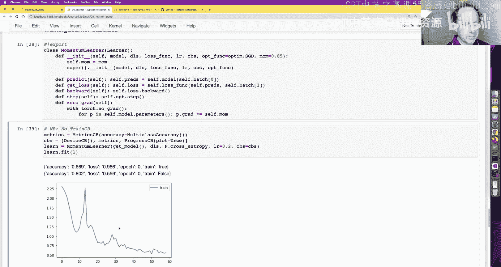
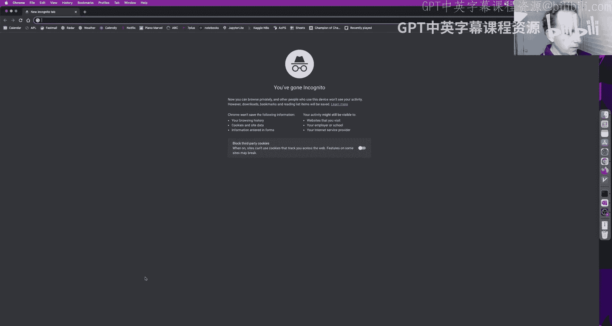
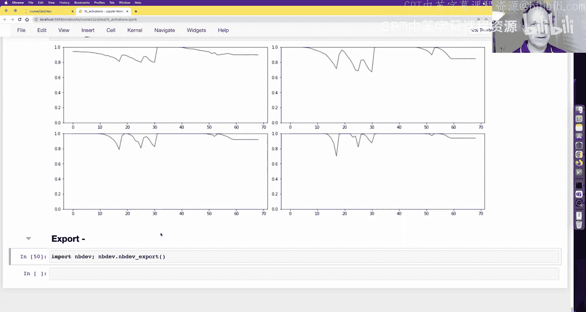

# 深度学习基础到稳定扩散模型：10：构建首个灵活训练框架

在本节课中，我们将学习如何构建一个灵活的训练框架，称为“Learner”。我们将从一个基础版本开始，逐步引入回调函数、指标跟踪和钩子等概念，最终构建一个功能强大且易于定制的训练循环。通过这个过程，你将能够深入理解模型训练的内部机制，并学会如何诊断和优化训练过程。

---

## 基础回调函数学习器

上一节我们介绍了一个功能有限的基础学习器。本节中，我们来看看如何通过引入回调函数来增加其灵活性。

基础回调函数学习器与之前的学习器结构相似，但关键区别在于它引入了回调函数机制。`fit` 函数会遍历每个周期，调用 `one_epoch` 进行训练或评估。`one_epoch` 则会遍历数据加载器中的每个批次，并调用 `one_batch`。在 `one_batch` 中，我们调用模型、损失函数，如果是训练模式则执行反向传播。

以下是 `fit` 函数的核心结构：
```python
def fit(self, epochs, train_dl, valid_dl=None, lr=0.1):
    self.opt = self.opt_func(self.model.parameters(), lr)
    self.callback('before_fit')
    for epoch in range(epochs):
        self.one_epoch(True, train_dl)
        if valid_dl is not None:
            self.one_epoch(False, valid_dl)
    self.callback('after_fit')
```

回调函数通过 `run_callbacks` 函数执行。该函数会按照回调函数的 `order` 属性排序，然后依次调用指定名称的方法。

## 回调函数的工作原理

回调函数是一个类，可以定义以下一个或多个方法：`before_fit`、`after_fit`、`before_epoch`、`after_epoch`、`before_batch`、`after_batch`。学习器会在训练过程中的相应时间点调用这些方法。

例如，一个简单的完成回调函数可以这样定义：
```python
class CompletionCallback:
    def before_fit(self): self.count = 0
    def after_batch(self): self.count += 1
    def after_fit(self): print(f'Completed {self.count} batches')
```

学习器会在开始训练前调用 `before_fit`，在每个批次后调用 `after_batch`，在训练结束后调用 `after_fit`。通过这种方式，我们可以在不修改学习器核心代码的情况下，添加各种自定义行为。

## 使用回调函数控制训练流程

回调函数的一个强大功能是能够通过抛出异常来控制训练流程。学习器捕获三种特定异常：`CancelFitException`、`CancelEpochException` 和 `CancelBatchException`。

例如，我们可以创建一个回调函数，在完成一个批次后抛出 `CancelFitException` 来提前结束训练：
```python
class SingleBatchCB:
    def after_batch(self): raise CancelFitException
```

通过设置回调函数的 `order` 属性，我们可以控制其执行顺序。这为我们提供了极大的灵活性，例如可以轻松实现只训练一个批次的功能。

## 指标跟踪与设备回调

为了在训练过程中跟踪和显示指标（如准确率和损失），我们引入了指标类。指标类可以累积批次数据并计算加权平均值。

同时，我们创建了一个设备回调函数，用于自动将模型和数据移动到指定的计算设备（如GPU）。这简化了多设备训练的设置。





以下是设备回调函数的核心：
```python
class DeviceCB:
    def __init__(self, device=default_device): self.device = device
    def before_fit(self): self.learn.model.to(self.device)
    def before_batch(self): self.learn.batch = to_device(self.learn.batch, self.device)
```

## 灵活学习器与上下文管理器

在构建了基础回调函数学习器后，我们进一步创建了“灵活学习器”。其核心改进是使用上下文管理器来简化回调函数的调用和异常处理。

我们定义了一个上下文管理器 `callback_context`，它会在代码块执行前后自动调用相应的 `before` 和 `after` 回调方法，并处理取消异常。

```python
@contextmanager
def callback_context(self, name):
    self.callback(f'before_{name}')
    try: yield
    except globals()[f'Cancel{name.title()}Exception']: pass
    finally: self.callback(f'after_{name}')
```

这使得 `fit` 和 `one_epoch` 等函数的代码更加简洁和一致。

## 训练回调与进度条

训练的具体步骤（如前向传播、损失计算、反向传播、优化器步进和梯度清零）被抽象到名为 `TrainCB` 的回调函数中。这意味着我们可以通过替换或继承此回调函数来轻松改变训练行为。

此外，我们添加了一个进度条回调函数，用于实时显示训练进度、损失曲线和指标。这大大增强了训练过程的可视化。

## 学习率查找器

学习率查找器是一个重要的工具，用于寻找合适的学习率。其原理是逐步增加学习率，并观察损失的变化，从而找到损失开始上升前的临界点。

我们实现了一个学习率查找器回调函数，它会在每个批次后按一定倍数增加学习率，并在损失显著恶化时自动停止训练。

## 使用钩子洞察模型内部

为了深入理解模型训练时的内部状态，我们引入了PyTorch的“钩子”机制。钩子允许我们在模型的前向或反向传播过程中注册回调函数，从而捕获中间层的激活值。

我们创建了一个 `Hook` 类和 `Hooks` 类来方便地管理多个钩子。通过钩子，我们可以收集并可视化各层激活值的均值和标准差，以及其分布直方图。

以下是使用钩子收集统计信息的示例：
```python
def append_stats(hook, mod, inp, outp):
    if not hasattr(hook, 'stats'): hook.stats = ([],[])
    hook.stats[0].append(outp.mean().cpu().item())
    hook.stats[1].append(outp.std().cpu().item())
```

可视化这些统计信息可以帮助我们诊断训练问题，例如梯度消失或爆炸。

## 彩色维度图

为了更直观地展示激活值的分布，我们创建了“彩色维度图”。该图将每个批次、每个层的激活值直方图编码为一列彩色像素，从而形成一个二维图像。通过观察该图像，我们可以快速判断激活分布是否健康（是否接近均值为0、标准差为1的正态分布）。

## 总结



本节课中我们一起学习了如何构建一个灵活、强大的深度学习训练框架。我们从基础的回调函数机制出发，逐步增加了指标跟踪、设备管理、进度显示、学习率查找和模型内部洞察等功能。关键收获在于理解了如何通过回调函数和钩子来非侵入式地扩展和控制训练流程，这为我们后续诊断和优化模型训练奠定了坚实基础。在下一课中，我们将探讨模型初始化等关键主题，以进一步提升训练的稳定性和效率。