# 深度学习基础到稳定扩散模型：11：初始化、归一化与优化器

## 概述
在本节课中，我们将学习如何正确初始化神经网络、使用归一化层（如批归一化和层归一化）以及实现不同的优化器（如SGD、动量和Adam）。我们的目标是训练一个在Fashion MNIST数据集上达到90%以上准确率的分类器。我们将从零开始构建这些工具，并理解它们背后的数学原理。

---

## 库更新与工具介绍

上一节我们介绍了钩子（hooks）和激活统计。本节中，我们来看看对迷你AI库进行的一些小改进。

首先，我们在回调类中添加了 `__getattr__` 方法，提供了四个常用属性的快捷访问：
*   `model`: 对应 `self.learn.model`
*   `opt`: 对应 `self.learn.opt`
*   `batch`: 对应 `self.learn.batch`
*   `epoch`: 对应 `self.learn.epoch`

此外，还添加了 `self.training` 属性，方便在回调中检查模型是否处于训练模式。

其次，我们将训练方法（如 `fit`）从 `MomentumLearner` 子类中提取出来，放入了新的 `TrainLearner` 基类中。这样，`MomentumLearner` 只需继承 `TrainLearner` 并添加动量逻辑即可。

我们还改进了激活统计的可视化工具，将其封装为回调 `ActivationStats`，可以方便地绘制彩色维度图、死亡单元图和统计图表。现在，只需一行代码即可将这些有用的可视化添加到训练过程中。

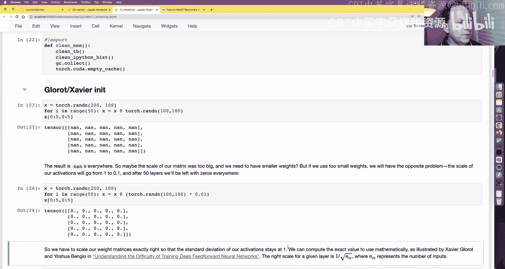

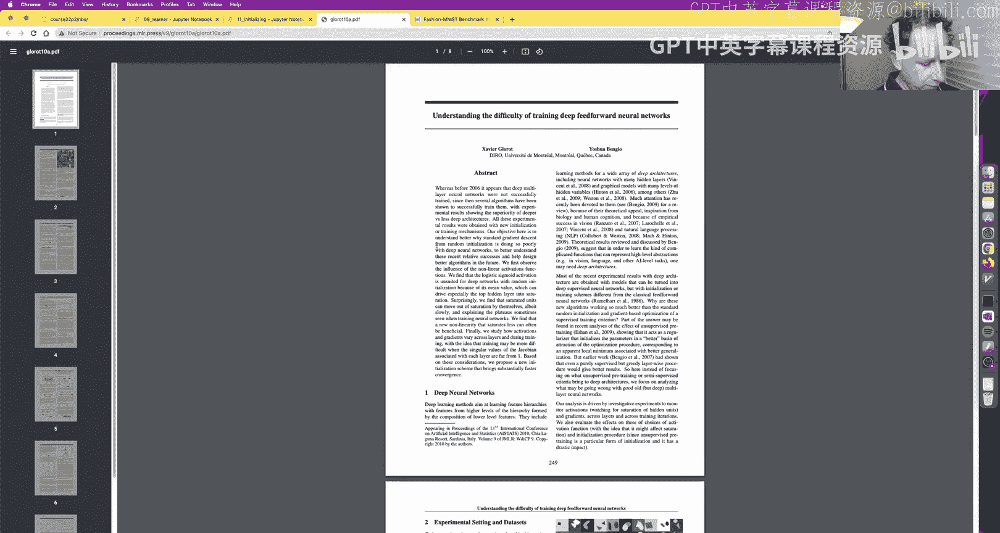

---

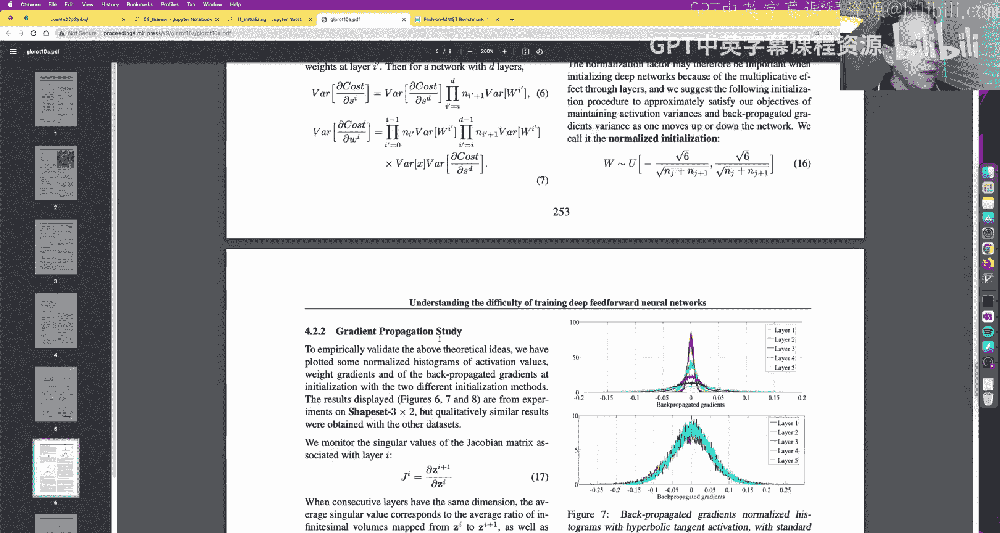

## 目标与问题：为何训练困难？

我们的目标是使用一个简单的卷积网络在Fashion MNIST上达到90%的准确率。然而，初始尝试的训练曲线非常糟糕，学习率查找器也几乎无法提供有用信息。

观察激活统计图，我们发现了一个典型问题：各层的激活值均值和标准差严重偏离了理想的0和1。这会导致梯度在深层网络中爆炸或消失，使得训练极其困难甚至不可能。

问题的根源在于：
1.  **输入数据未归一化**：原始图像像素的均值约为0.28，标准差约为0.35。
2.  **权重初始化不当**：对于使用ReLU激活函数的网络，标准的Glorot/Xavier初始化并不适用。

---

## 理论基础：均值、方差与初始化

为了理解解决方案，我们需要回顾一些核心概念。

**方差**衡量数据点偏离均值的程度。对于张量 `t`，其方差公式为：
`Var(t) = mean((t - mean(t)) ** 2)`
一个计算上更便捷的等价公式是：
`Var(t) = mean(t ** 2) - (mean(t)) ** 2`

**标准差**是方差的平方根，使量纲与原始数据一致。

**协方差**衡量两个变量一起变化的程度。对于张量 `t` 和 `u`：
`Cov(t, u) = mean((t - mean(t)) * (u - mean(u)))`

**初始化的重要性**：深度神经网络是多个矩阵乘法的堆叠。如果权重矩阵的尺度不当，经过多层传播后，激活值的尺度会指数级地爆炸或收缩，导致训练失败。

**Glorot/Xavier初始化**：针对线性激活函数（如tanh），通过确保每层输出的方差为1，推导出初始化权重应服从均匀分布 `U[-a, a]`，其中 `a = sqrt(6 / (n_in + n_out))`，或正态分布 `N(0, sqrt(2 / (n_in + n_out)))`。对于全连接层，`n_in` 和 `n_out` 是输入和输出的神经元数量；对于卷积层，`n_in` 是 `kernel_size ** 2 * in_channels`。

**Kaiming/He初始化**：针对ReLU激活函数，由于其将一半的激活值置零，会减半方差。因此，初始化时需要补偿这个因子。正确的初始化是使用正态分布 `N(0, sqrt(2 / n_in))`。

---

## 实践解决方案一：归一化与Kaiming初始化

以下是解决训练问题的具体步骤：

1.  **归一化输入数据**：将输入数据的均值调整为0，标准差调整为1。这可以通过数据转换或回调实现。
    ```python
    # 使用数据转换
    transform = T.Compose([T.ToTensor(), T.Normalize(0.28, 0.35)])
    # 或使用回调
    class BatchTransformCB(Callback):
        def __init__(self, func): self.func = func
        def before_batch(self): self.learn.batch = self.func(self.learn.batch)
    norm_func = lambda b: ((b[0]-b[0].mean())/b[0].std(), b[1])
    norm_cb = BatchTransformCB(norm_func)
    ```

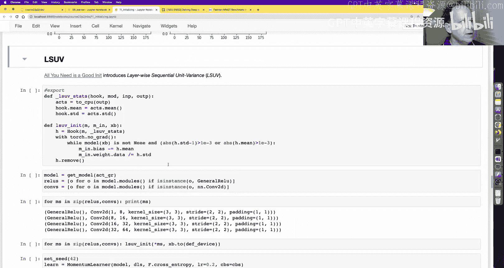

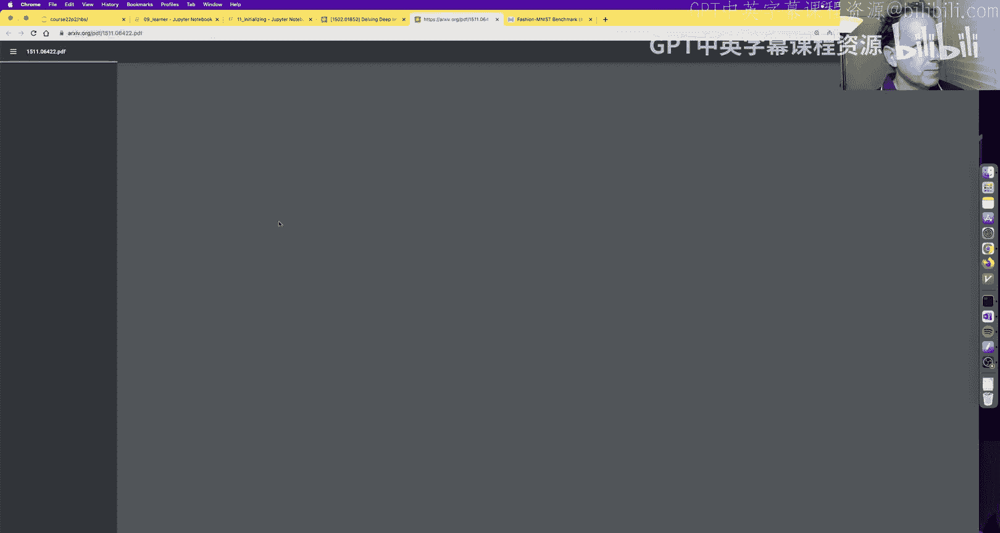

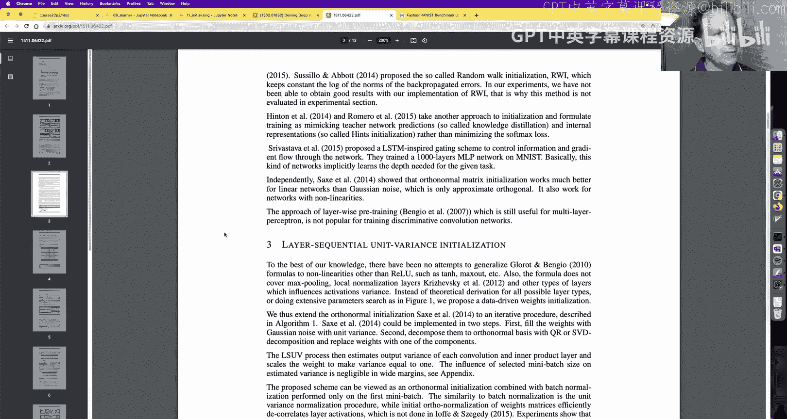

2.  **应用Kaiming初始化**：为卷积层的权重应用正确的初始化。
    ```python
    def init_weights(m):
        if isinstance(m, nn.Conv2d):
            nn.init.kaiming_normal_(m.weight, a=0.1) # a是ReLU负半轴的斜率
            if m.bias is not None: nn.init.zeros_(m.bias)
    model.apply(init_weights)
    ```

应用这些步骤后，模型能够正常训练，准确率提升至85%左右，激活统计图也明显改善。然而，由于ReLU的输出不可能有负值，其均值始终为正，这限制了归一化的效果。

---

## 实践解决方案二：改进激活函数与LSUV

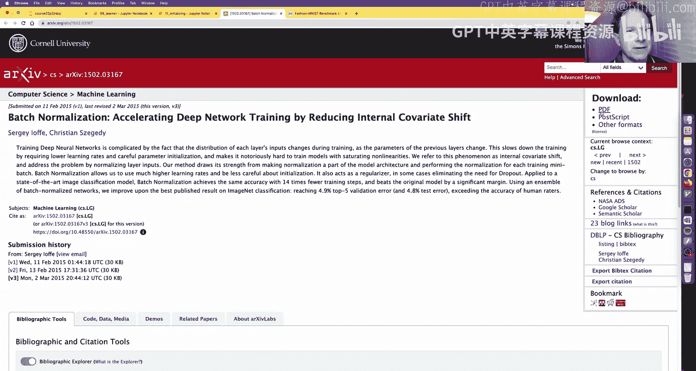

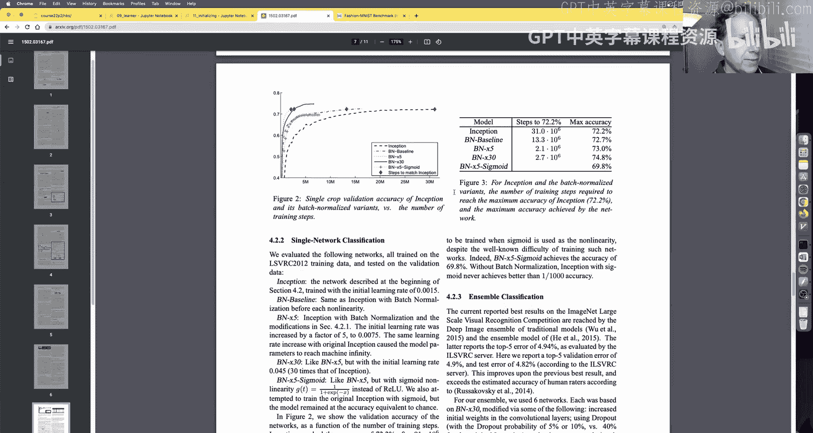

为了获得真正的零均值激活，我们设计了一个新的激活函数：**广义ReLU**。它在Leaky ReLU的基础上，增加了一个可学习的偏移量（sub），使得激活分布可以围绕零点对称。

```python
def general_relu(x, leak=0.1, sub=0.4, maxv=None):
    x = F.leaky_relu(x, leak)
    if sub: x.sub_(sub)
    if maxv is not None: x.clamp_max_(maxv)
    return x
act_fn = partial(general_relu, leak=0.1, sub=0.4)
```

同时，我们需要更新权重初始化函数，将 `leak` 参数传递给 `kaiming_normal_`。

使用广义ReLU和正确的初始化后，训练更加稳定，准确率提升至87%，激活统计图接近理想状态。

另一种更通用的初始化方法是 **层序单位方差初始化**。其思想非常直观：
1.  将一批数据输入网络。
2.  遍历每一层，计算该层输出的均值和标准差。
3.  通过调整该层的偏置（减去均值）和权重（除以标准差），使该层输出的均值为0，标准差为1。
4.  固定该层，对下一层重复此过程。

LSUV的优点是与激活函数无关，可以用于任何架构。

---

## 归一化层：BatchNorm与LayerNorm

虽然好的初始化解决了训练开始的问题，但在训练过程中，每层输入的分布仍在变化（内部协变量偏移）。归一化层将归一化操作作为模型架构的一部分，在每次前向传播时执行。

**层归一化** 对每个样本的所有通道、高度和宽度维度计算均值和方差，并进行归一化。它包含可学习的缩放（`mult`）和偏移（`add`）参数。
```python
class LayerNorm(nn.Module):
    def __init__(self, dim, eps=1e-5):
        super().__init__()
        self.eps = eps
        self.mult = nn.Parameter(torch.ones(dim))
        self.add = nn.Parameter(torch.zeros(dim))
    def forward(self, x):
        # x: (batch, channels, height, width)
        dims = (1,2,3) # 对通道、高、宽求均值/方差
        mean = x.mean(dims, keepdim=True)
        var = x.var(dims, keepdim=True, correction=0)
        x = (x - mean) / (var + self.eps).sqrt()
        return x * self.mult + self.add
```

**批归一化** 对每个通道，跨批次和空间维度（高度、宽度）计算均值和方差。它同样有可学习的参数，并在训练时维护一个指数移动平均的全局均值和方差，用于推理阶段。
```python
class BatchNorm(nn.Module):
    def __init__(self, nf, mom=0.1, eps=1e-5):
        super().__init__()
        self.mom, self.eps = mom, eps
        self.mult = nn.Parameter(torch.ones (1,nf,1,1))
        self.add = nn.Parameter(torch.zeros(1,nf,1,1))
        self.register_buffer('vars', torch.ones (1,nf,1,1))
        self.register_buffer('means', torch.zeros(1,nf,1,1))
    def forward(self, x):
        if self.training:
            dims = (0,2,3) # 对批次、高、宽求均值/方差
            mean = x.mean(dims, keepdim=True)
            var = x.var(dims, keepdim=True, correction=0)
            # 更新移动平均
            self.means.lerp_(mean, self.mom)
            self.vars.lerp_(var, self.mom)
        else:
            mean, var = self.means, self.vars
        x = (x - mean) / (var + self.eps).sqrt()
        return x * self.mult + self.add
```

批归一化允许我们使用更高的学习率，并通常能带来更快的收敛和更好的最终性能。在我们的实验中，结合批归一化、较小的批次大小（256）和学习率衰减，准确率达到了89.9%，接近90%的目标。

归一化层家族还包括实例归一化和组归一化，它们的主要区别在于计算均值和方差时聚合的维度不同。

---

## 优化器：从SGD到Adam

优化器负责根据损失函数的梯度更新模型参数。我们首先实现基础的 **SGD**。
```python
class SGD:
    def __init__(self, params, lr, wd=0.):
        self.params, self.lr, self.wd = list(params), lr, wd
        self.i = 0 # 批次计数器
    def step(self):
        with torch.no_grad():
            for p in self.params:
                # 权重衰减（L2正则化）
                if self.wd != 0:
                    p *= (1 - self.lr * self.wd)
                # 梯度下降
                if p.grad is not None:
                    p -= self.lr * p.grad
        self.i += 1
    def zero_grad(self):
        for p in self.params:
            p.grad = None
```

**动量** 通过引入梯度指数移动平均来平滑更新方向，有助于加速收敛并逃离局部极小值。
```python
class Momentum(SGD):
    def __init__(self, params, lr, wd=0., mom=0.9):
        super().__init__(params, lr, wd)
        self.mom = mom
    def step(self):
        with torch.no_grad():
            for p in self.params:
                if p.grad is None: continue
                # 初始化或获取动量状态
                state = getattr(p, 'grad_avg', None)
                if state is None:
                    state = torch.zeros_like(p.grad)
                    p.grad_avg = state
                # 更新动量（指数移动平均）
                state.lerp_(p.grad, 1-self.mom)
                # 权重衰减
                if self.wd != 0:
                    p *= (1 - self.lr * self.wd)
                # 使用动量更新参数
                p -= self.lr * state
        self.i += 1
```

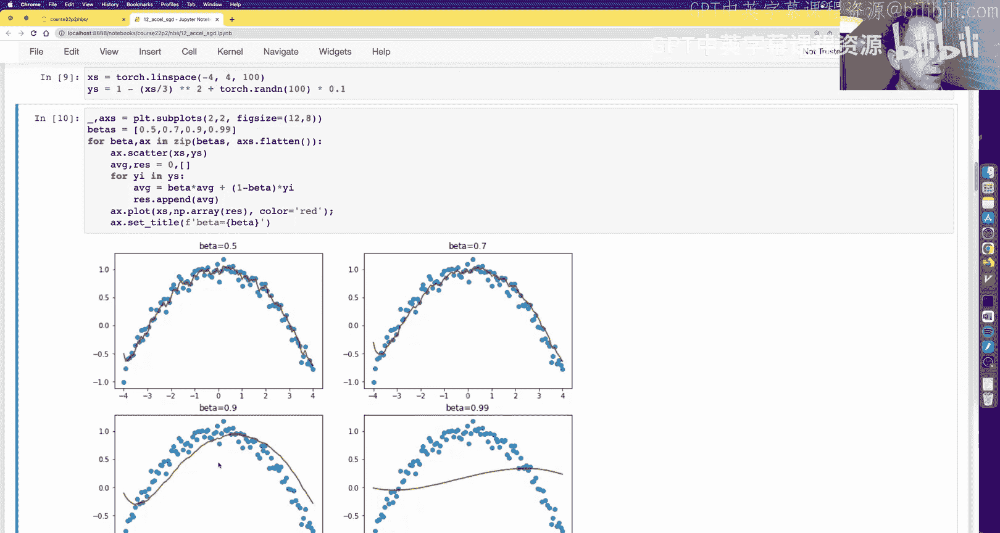

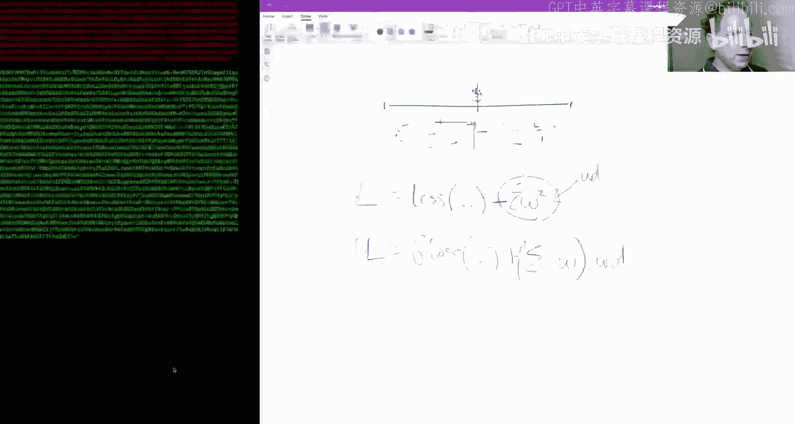

**RMSProp** 通过除以梯度平方的指数移动平均的平方根，来调整每个参数的学习率。这对于处理稀疏梯度或非平稳目标函数很有用。
```python
class RMSProp(SGD):
    def __init__(self, params, lr, wd=0., sqr_mom=0.99, eps=1e-8):
        super().__init__(params, lr, wd)
        self.sqr_mom, self.eps = sqr_mom, eps
    def step(self):
        with torch.no_grad():
            for p in self.params:
                if p.grad is None: continue
                # 初始化或获取平方梯度状态
                state = getattr(p, 'sqr_avg', None)
                if state is None:
                    # 技巧：用第一个批次的梯度平方初始化，避免初始步长过大
                    state = p.grad ** 2
                    p.sqr_avg = state
                else:
                    state.lerp_(p.grad**2, 1-self.sqr_mom)
                # 权重衰减
                if self.wd != 0:
                    p *= (1 - self.lr * self.wd)
                # 自适应学习率更新
                p -= self.lr * (p.grad / (state.sqrt() + self.eps))
        self.i += 1
```

**Adam** 结合了动量和RMSProp的思想，是当前最流行的优化器之一。它同时维护梯度的一阶矩（动量）和二阶矩（平方梯度）估计，并进行偏差校正。
```python
class Adam(SGD):
    def __init__(self, params, lr, wd=0., beta1=0.9, beta2=0.99, eps=1e-8):
        super().__init__(params, lr, wd)
        self.beta1, self.beta2, self.eps = beta1, beta2, eps
    def step(self):
        with torch.no_grad():
            for p in self.params:
                if p.grad is None: continue
                # 初始化状态
                state1 = getattr(p, 'avg', None)
                if state1 is None:
                    state1 = torch.zeros_like(p.grad)
                    p.avg = state1
                    state2 = torch.zeros_like(p.grad)
                    p.sqr_avg = state2
                else:
                    state2 = p.sqr_avg
                # 更新一阶矩和二阶矩
                state1.lerp_(p.grad, 1-self.beta1)
                state2.lerp_(p.grad**2, 1-self.beta2)
                # 偏差校正
                unbias1 = state1 / (1 - self.beta1 ** self.i)
                unbias2 = state2 / (1 - self.beta2 ** self.i)
                # 权重衰减
                if self.wd != 0:
                    p *= (1 - self.lr * self.wd)
                # 更新参数
                p -= self.lr * (unbias1 / (unbias2.sqrt() + self.eps))
        self.i += 1
```

使用动量优化器，我们可以将学习率提高到1.5，并获得更平滑的训练曲线，准确率提升至87.6%。

---

## 总结

本节课中我们一起学习了深度神经网络训练中的三个核心主题：

1.  **初始化**：正确的权重初始化（如Kaiming初始化）和输入数据归一化是训练深层网络的基础，可以防止梯度爆炸或消失。我们还介绍了通用的LSUV初始化方法。
2.  **归一化层**：批归一化和层归一化通过内部归一化激活值，缓解了内部协变量偏移问题，允许使用更高的学习率，并通常能加速训练、提升模型性能。
3.  **优化器**：我们从基础的SGD出发，实现了带动量的SGD、RMSProp以及结合二者优点的Adam优化器，理解了它们如何通过利用梯度历史信息来更高效地更新参数。

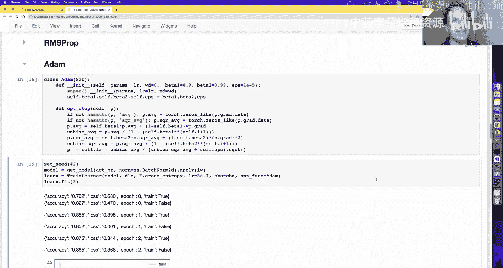

通过综合运用这些技术——正确的初始化、广义ReLU、批归一化以及动量优化器——我们成功地将一个简单卷积网络在Fashion MNIST上的准确率从无法训练提升到了接近90%。在下一课中，我们将探索更多技术，最终突破90%的准确率大关。