# 深度学习基础到稳定扩散模型：14：深度学习基础到稳定扩散

## 概述
在本节课中，我们将学习如何实现混合精度训练，并探索如何在不依赖特定库的情况下，通过自定义数据加载器和训练回调来优化训练流程。我们还将介绍如何使用加速库（Accelerate）来简化混合精度和多GPU训练，并探讨一些提升训练速度的技巧。最后，我们会通过风格迁移和神经细胞自动机的实例，展示如何利用深度学习框架进行创造性应用。

---

## 混合精度训练的实现

上一节我们介绍了混合精度训练的基本概念，本节中我们来看看如何具体实现它。

为了进行混合精度训练，我们需要调整训练循环中的几个关键步骤。根据PyTorch官方文档，典型的混合精度训练流程包括使用`autocast`上下文管理器来管理计算精度，以及使用`GradScaler`来缩放梯度，以防止在低精度下梯度下溢。

以下是实现混合精度训练的核心步骤：

1.  在正向传播（计算预测和损失）时，使用`torch.cuda.amp.autocast`上下文管理器，将计算转换为半精度（FP16）。
2.  在反向传播时，使用`GradScaler.scale(loss).backward()`来代替常规的`loss.backward()`。
3.  在优化器更新权重时，使用`GradScaler.step(optimizer)`和`GradScaler.update()`。

为了将这些步骤集成到我们的训练框架中，我们创建了一个`MixedPrecision`回调。这个回调利用了训练循环中新添加的钩子点（如`after_predict`、`after_loss`、`after_backward`、`after_step`），在合适的时机插入混合精度相关的代码。

**代码示例：MixedPrecision回调的核心部分**
```python
class MixedPrecision(Callback):
    def __init__(self):
        self.scaler = GradScaler()
        self.autocast = None

    def before_batch(self):
        # 在批次开始前进入autocast上下文
        self.autocast = torch.cuda.amp.autocast(enabled=True, dtype=torch.float16)
        self.autocast.__enter__()

    def after_loss(self):
        # 计算损失后退出autocast上下文
        self.autocast.__exit__(None, None, None)

    def backward(self, loss):
        # 使用GradScaler进行缩放后的反向传播
        self.scaler.scale(loss).backward()

    def step(self):
        # 使用GradScaler更新优化器
        self.scaler.step(self.opt)
        self.scaler.update()
```
通过这个回调，我们可以轻松地将混合精度训练添加到任何使用我们框架的模型中。为了充分利用混合精度带来的速度优势，通常需要增加批次大小以保持GPU的繁忙状态。在本例中，我们将批次大小增加了四倍，并相应地调整了学习率和训练周期数，最终在更短的时间内达到了与全精度训练相当的效果。

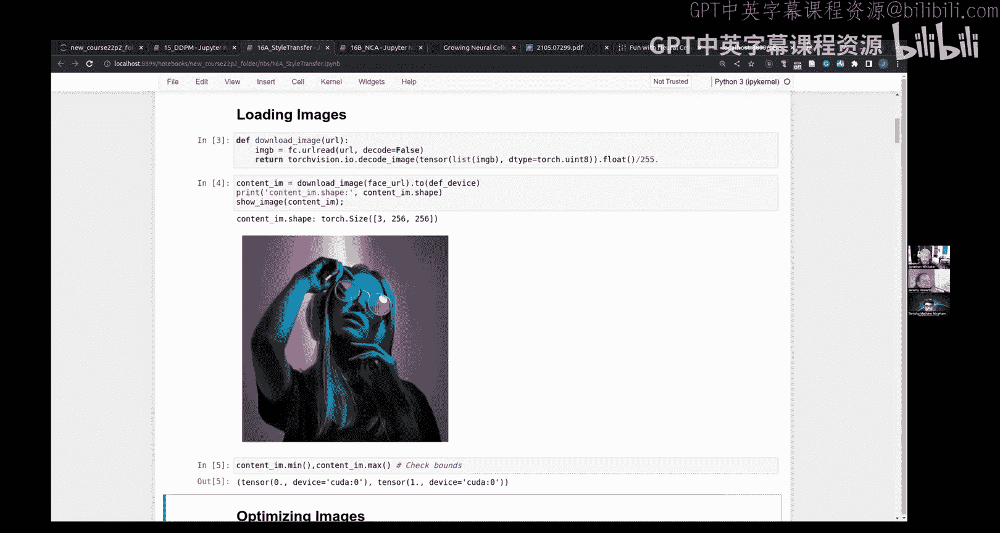

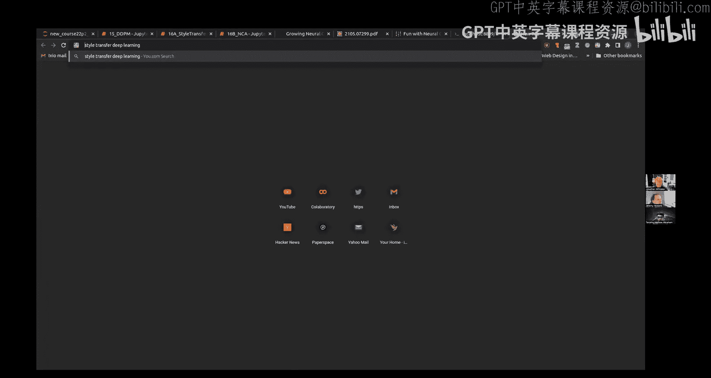

---

## 简化数据流程：移除DDPM回调

在实现了混合精度训练之后，我们进一步探索如何简化整个数据准备流程。我们之前使用了一个专门的`DDPM`回调来为扩散模型添加噪声。现在，我们尝试将其功能整合到数据加载器的整理函数（collate function）中，从而完全移除这个回调。

其核心思想是：数据加载器的整理函数负责将一批数据样本组合成模型可用的张量。默认的整理函数是`default_collate`。我们可以创建一个自定义的整理函数，它首先调用`default_collate`处理批次数据，然后对得到的图像张量应用`noisify`函数（即添加噪声的过程）。

**代码示例：自定义整理函数**
```python
def ddpm_collate(batch):
    # 使用默认整理函数处理批次
    collated = default_collate(batch)
    # 对图像部分添加噪声
    x = collated['x']
    x_noisy = noisify(x)
    collated['x'] = x_noisy
    return collated
```
然后，我们创建一个`ddpm_dataloader`函数，它返回一个使用这个自定义整理函数的数据加载器。这样，在创建学习器（Learner）时，我们就不再需要传入特殊的`DDPM`回调，而是使用标准的训练回调即可。这种方法使得代码更加模块化和清晰，各个部分（数据加载、噪声添加、模型训练）的职责更加分离。

---

## 使用Accelerate库进行加速

虽然我们可以手动实现混合精度，但有一个名为`Accelerate`的优秀库（由Hugging Face的Sylvain Gugger创建，他曾在Fast.ai工作）可以帮我们自动处理这些细节，并且还支持多GPU和TPU训练。

`Accelerate`提供了一个统一的接口，只需几行代码就能为训练循环加速。使用`Accelerate`的基本步骤是：

1.  初始化一个`Accelerator`对象，并指定所需的配置（如混合精度模式）。
2.  使用`accelerator.prepare()`方法包装模型、优化器、数据加载器。这个方法会处理设备放置、数据并行分发以及混合精度上下文的创建。
3.  在训练循环中，将`loss.backward()`替换为`accelerator.backward(loss)`。

为了将其集成到我们的框架，我们创建了一个`AccelerateCB`回调，它继承自`TrainCB`，并重写了`backward`方法以使用`Accelerate`的版本。

**代码示例：Accelerate回调**
```python
class AccelerateCB(TrainCB):
    def __init__(self, fp16=True):
        self.accelerator = Accelerator(mixed_precision='fp16' if fp16 else 'no')

    def before_fit(self):
        # 使用accelerator准备所有组件
        self.learner.model, self.learner.opt, self.learner.dls.train, self.learner.dls.valid = \
            self.accelerator.prepare(self.learner.model, self.learner.opt,
                                     self.learner.dls.train, self.learner.dls.valid)

    def backward(self, loss):
        # 使用accelerator的反向传播
        self.accelerator.backward(loss)
```
使用`Accelerate`后，我们不再需要手动管理`autocast`和`GradScaler`，库会自动处理。对于简单的混合精度训练，这可能只是一个便捷的捷径，但其真正价值在于能够轻松扩展到多设备训练场景。

---

## 支持多输入/多输出模型

在构建更复杂的模型（如扩散模型）时，我们经常需要处理多个输入（例如，带噪声的图像和时间步）和多个输出。为了使我们的训练回调更加通用，我们对其进行了扩展，使其能够灵活地处理任意数量的输入和输出。

我们在`TrainCB`回调中添加了一个`n_inp`参数，用于指定模型期望的输入数量。在`predict`和`get_loss`方法中，我们使用`*`操作符来解包批次数据，根据`n_inp`将输入传递给模型，并将其余部分传递给损失函数。

**代码示例：支持多输入/输出的训练回调**
```python
class TrainCB(Callback):
    def __init__(self, n_inp=1):
        self.n_inp = n_inp

    def predict(self):
        # 根据n_inp解包输入
        preds = self.model(*self.batch[:self.n_inp])
        return preds

    def get_loss(self, preds):
        # 将预测和剩余的批次数据传递给损失函数
        loss = self.loss_func(preds, *self.batch[self.n_inp:])
        return loss
```
这样，我们的模型和损失函数就可以自由地定义它们所需的参数数量，而训练框架能够自动适应。例如，对于扩散模型，我们可以设置`n_inp=2`，并将噪声图像和时间步作为输入。

---

## 提升数据加载速度的技巧

当数据加载和预处理成为训练瓶颈时（例如在Kaggle上，CPU资源可能有限），有一个技巧可以提升效率：重复使用已加载的批次。

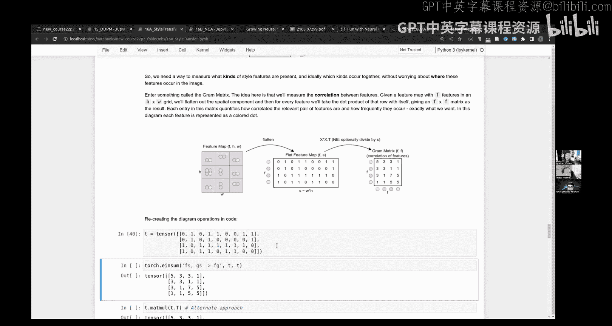

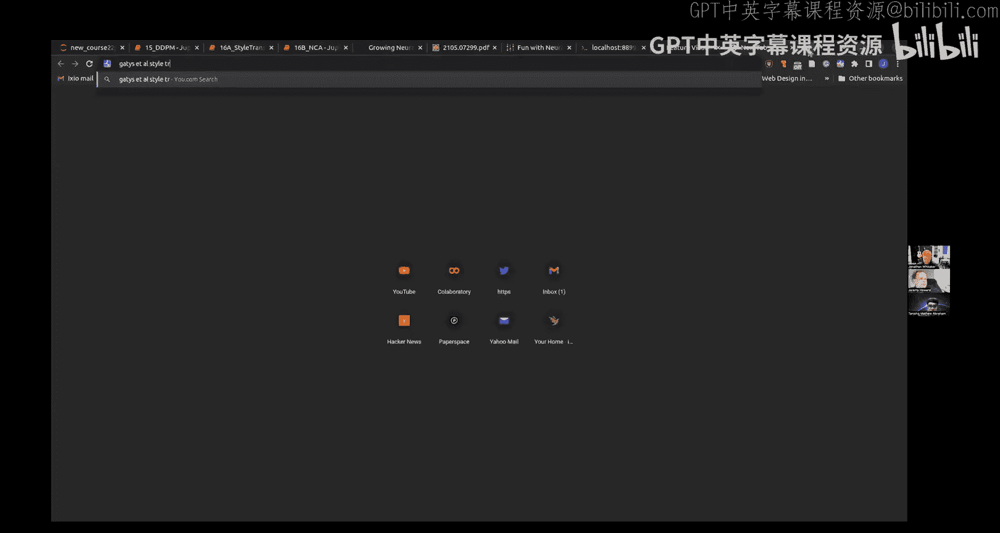

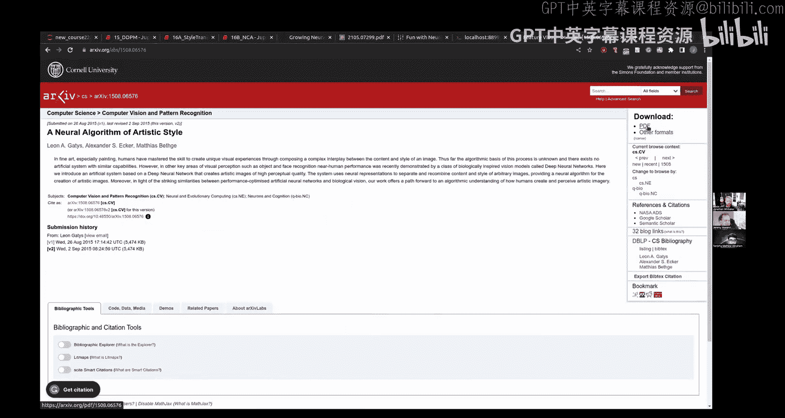

这个技巧的核心是创建一个包装器数据加载器，它在每次迭代时从原始数据加载器中获取一个批次，然后将这个批次重复输出多次（例如两次）。这意味着每个训练周期（epoch）的长度会翻倍，但数据加载和增强的操作次数保持不变。

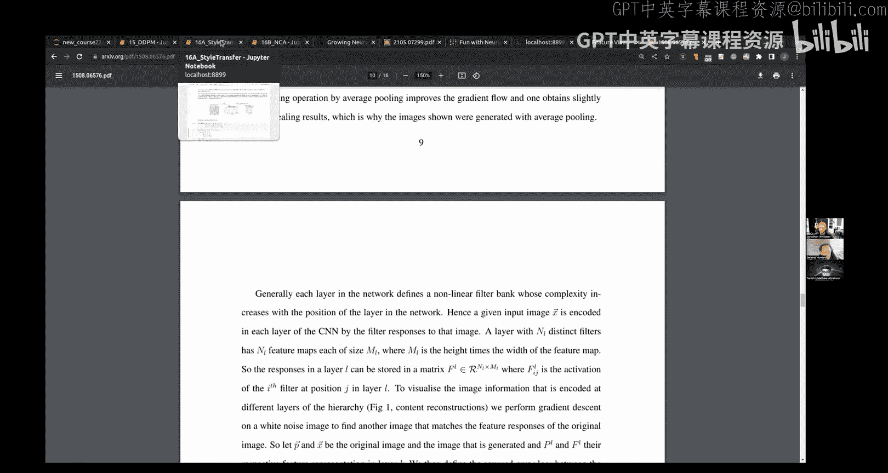

**代码示例：批次重复数据加载器**
```python
class RepeatDL:
    def __init__(self, dl, n_repeat=2):
        self.dl = dl
        self.n_repeat = n_repeat

    def __iter__(self):
        for batch in self.dl:
            for _ in range(self.n_repeat):
                yield batch
```
从优化的角度看，连续几次使用相同的批次进行参数更新通常是可行的。模型在第一次看到批次时，会在权重空间中朝某个方向更新；第二次看到相同的批次时，它可能会基于新的权重位置找到另一个有益的更新方向。这个技巧可以有效地提高GPU利用率，特别是在数据加载较慢的场景下。

---

## 风格迁移：原理与实践

现在，让我们将注意力转向一个有趣的应用：风格迁移。风格迁移的目标是将一幅图像（内容图像）的结构与另一幅图像（风格图像）的 artistic style 结合起来，生成一幅新的图像。

### 基础：直接优化像素
我们的起点是学习如何通过优化直接改变图像的像素值。与优化神经网络权重不同，这里我们将图像像素本身作为可优化的参数。

我们创建一个`TensorImage`类，它继承自`nn.Module`，但其参数只是一个普通的图像张量。通过将其放入`nn.Parameter`，PyTorch会将其视为需要优化的参数。我们使用一个虚拟的数据集和数据加载器来运行固定次数的优化迭代。

**代码示例：优化图像像素的模型**
```python
class TensorImage(nn.Module):
    def __init__(self, img_tensor):
        super().__init__()
        self.img = nn.Parameter(img_tensor)

    def forward(self, x=None): # x是占位符，为了适配Learner
        return self.img
```
初始的损失函数是简单的均方误差（MSE），目标是让生成的图像在像素级别上接近目标内容图像。通过随机初始化图像并优化，我们可以逐渐将其转变为目标图像。

### 引入感知损失
然而，像素级的MSE损失过于严格，且不能很好地捕捉图像的语义内容。因此，我们引入“感知损失”（Perceptual Loss）。我们使用一个预训练的卷积神经网络（如VGG16）作为特征提取器。通过比较生成图像和目标图像在网络中间层激活值的差异，我们可以衡量它们在更高层次特征上的相似性。

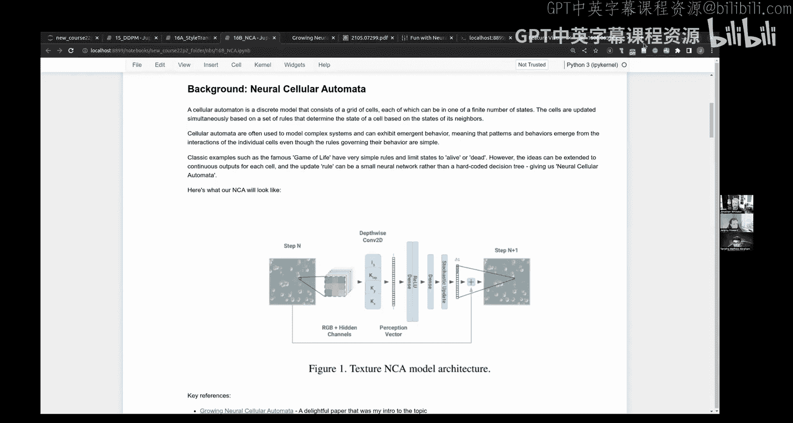

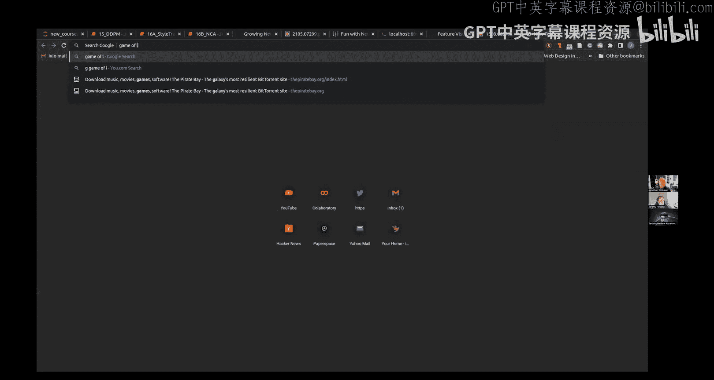

**公式：感知损失**
```
PerceptualLoss(I_gen, I_target) = Σ_i || φ_i(I_gen) - φ_i(I_target) ||^2
```
其中，`φ_i` 表示预训练网络第 `i` 层的激活特征图。

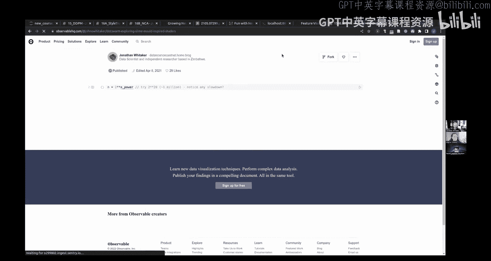

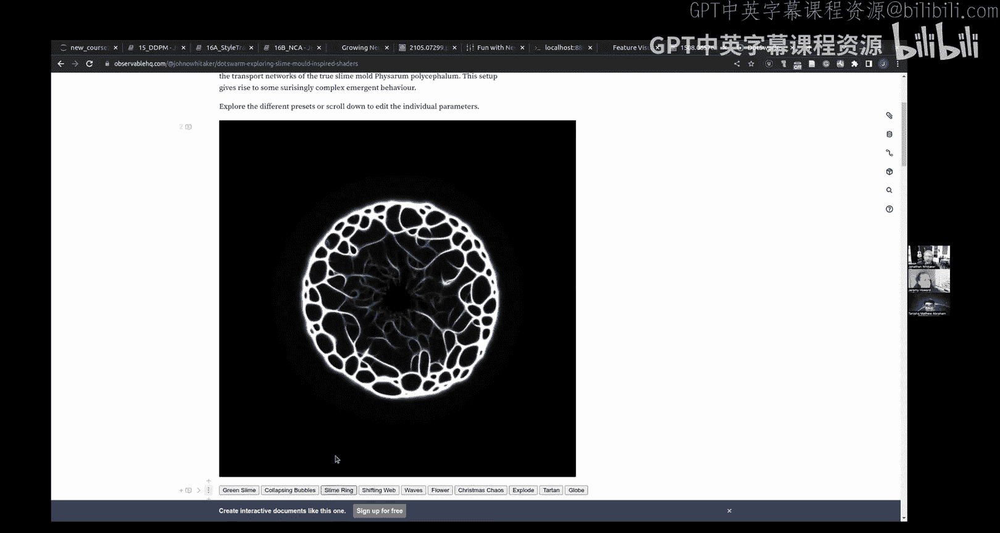

通过优化感知损失，我们可以生成在语义结构上与目标图像相似，但不必在像素级别完全一致的图像。选择不同的层（浅层或深层）可以控制我们对细节或整体结构的关注程度。

### 实现风格损失：格拉姆矩阵
为了捕捉风格，我们需要一种能衡量图像纹理特征但忽略其空间位置的方法。这就是“格拉姆矩阵”（Gram Matrix）。对于一个层的特征图（形状为 `C x H x W`），我们首先将其重塑为 `C x (H*W)`，然后计算该矩阵与其转置的乘积。

**公式：格拉姆矩阵**
```
G = F * F^T
```
其中，`F` 是重塑后的特征矩阵，形状为 `C x N`（`N = H*W`）。

格拉姆矩阵 `G` 的形状为 `C x C`，它捕获了不同特征通道之间的相关性，即哪些纹理特征倾向于同时出现，而完全丢失了这些特征在图像中的位置信息。

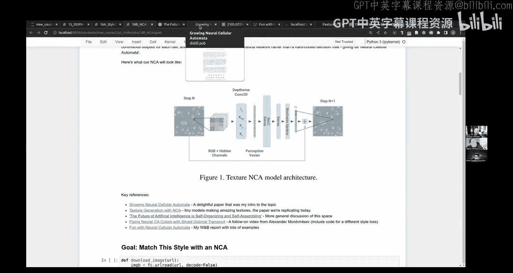

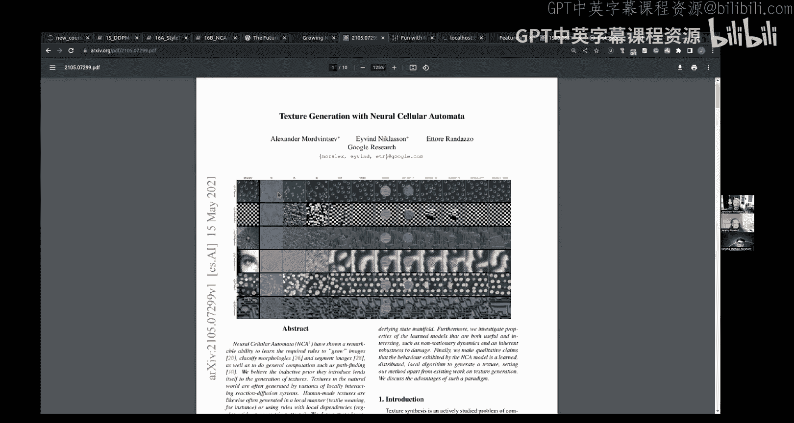

### 完整的风格迁移
完整的风格迁移损失是内容损失和风格损失的加权和：
```
TotalLoss = α * ContentLoss(I_gen, I_content) + β * StyleLoss(I_gen, I_style)
```
其中，`ContentLoss` 通常使用深层特征的感知损失，`StyleLoss` 是多个层（通常是浅层和中间层）的格拉姆矩阵损失之和。通过调整 `α` 和 `β`，我们可以控制最终输出中内容与风格的比重。

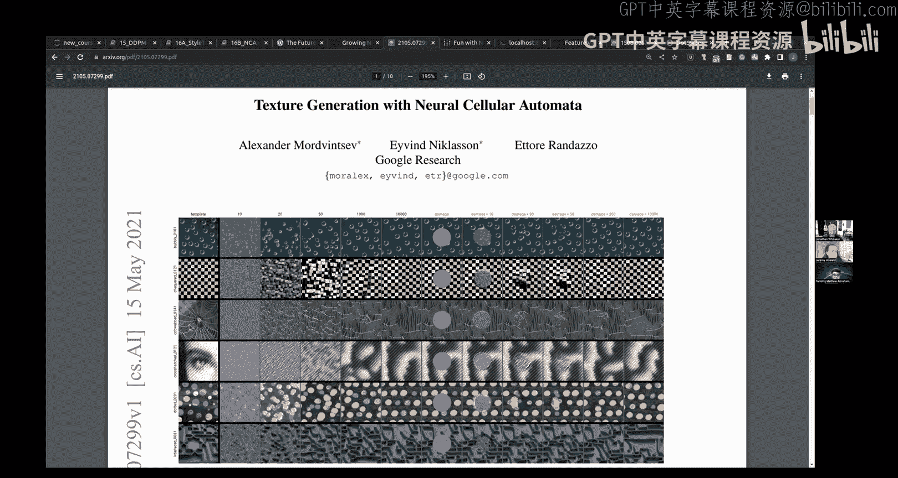

优化过程从内容图像（或随机噪声）开始，通过梯度下降不断调整像素值，以最小化这个总损失，最终得到既保留内容结构又具有目标风格的新图像。

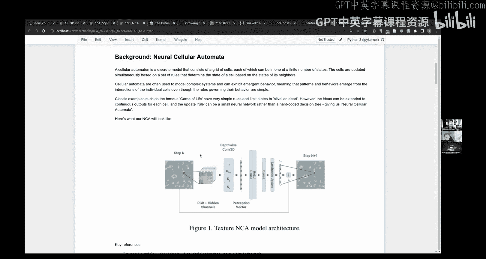

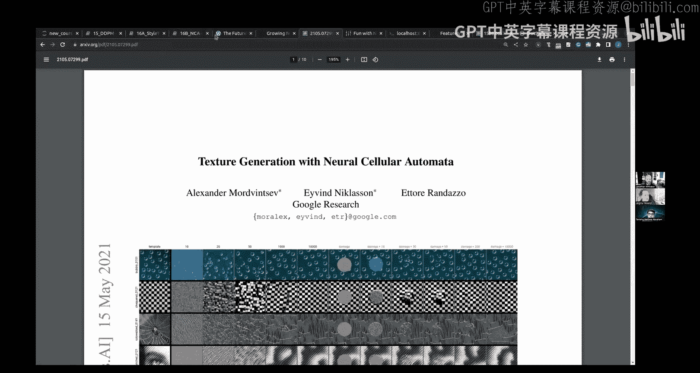

---

## 神经细胞自动机：一个创造性探索

最后，我们探索一个更具实验性的领域：神经细胞自动机（Neural Cellular Automata, NCA）。NCA受生物学中细胞自组织现象的启发，每个网格“细胞”都是一个简单的神经网络，它仅能感知其直接邻居的状态，并根据这些信息更新自身的状态。

### NCA的工作原理
1.  **局部感知**：每个细胞查看其3x3邻居区域（可能包括自身）。
2.  **神经网络更新**：将邻居信息（可能通过一些固定的过滤器处理，如识别梯度）输入一个小型MLP（可能只有几十或几百个参数），该网络输出细胞状态的更新值。
3.  **随机更新**：并非所有细胞在每一步都更新，引入一个随机更新掩码来模拟生物系统中的异步性，这有助于打破对称性并产生更丰富的模式。
4.  **环形填充**：为了生成可无缝平铺的纹理，在网格边界使用环形填充（circular padding），使得边缘细胞能与对侧的细胞“通信”。

### 训练NCA生成纹理
训练目标是让NCA从随机初始状态开始，经过若干步迭代后，生成的纹理在风格上匹配目标风格图像。我们再次使用风格损失（基于格拉姆矩阵）作为优化目标。

训练过程采用了一个“池化”（pool）策略：
1.  维护一个状态网格的池。
2.  每次训练时，从池中采样一批网格。
3.  对这些网格应用NCA更新规则多次（例如50步）。
4.  计算最终输出与目标风格的损失，并更新NCA网络的参数。
5.  将更新后的输出网格放回池中，作为未来训练的起点。

这种池化训练使NCA不仅学会了从随机状态生长出目标纹理，还学会了维持和修复已形成的纹理，从而提高了其鲁棒性。

由于NCA的更新规则是局部且一致的，它可以非常高效地在GPU上并行运行，甚至可以在Web浏览器中实时渲染，展示了极小参数模型通过自组织产生复杂、动态模式的强大能力。

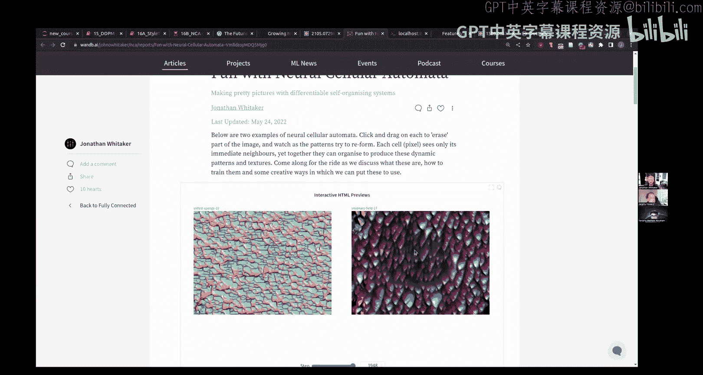

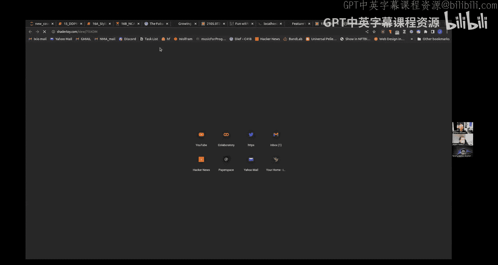

---

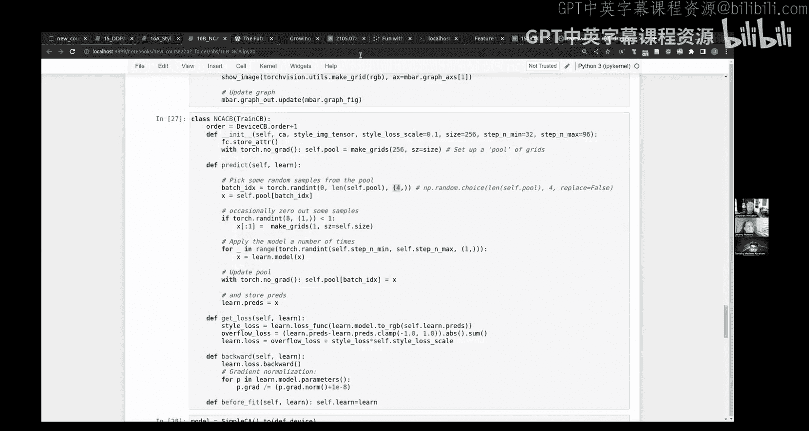

## 总结
本节课中我们一起学习了多个高级主题。我们深入探讨了混合精度训练的实现细节，并学会了如何通过自定义数据流程和利用`Accelerate`库来优化训练。我们还掌握了提升数据加载效率的实用技巧。通过风格迁移的实例，我们理解了如何结合内容损失和风格损失（基于感知特征和格拉姆矩阵）来创造艺术图像。最后，我们探索了神经细胞自动机这一前沿领域，看到了如何用极小的、局部连接的神经网络通过自组织生成复杂纹理，这为创造性AI应用打开了新的大门。这些知识将帮助你构建更高效、更灵活、更具创造性的深度学习项目。