# 深度学习基础到稳定扩散模型：15：实验跟踪、评估指标与加速采样 🚀

在本节课中，我们将学习如何系统地跟踪深度学习实验，使用量化指标评估生成图像的质量，并探索更高效的采样算法来加速图像生成过程。

---

## 概述

上一节我们深入探讨了扩散模型的核心训练过程。本节中，我们将关注实验的工程化实践。首先，我们会看到如何使用工具（如Weights & Biases）来记录和管理实验。接着，我们将学习两个重要的图像生成评估指标：FID和KID。最后，我们会探索DDIM采样算法，它能在保持图像质量的同时，显著提升采样速度。

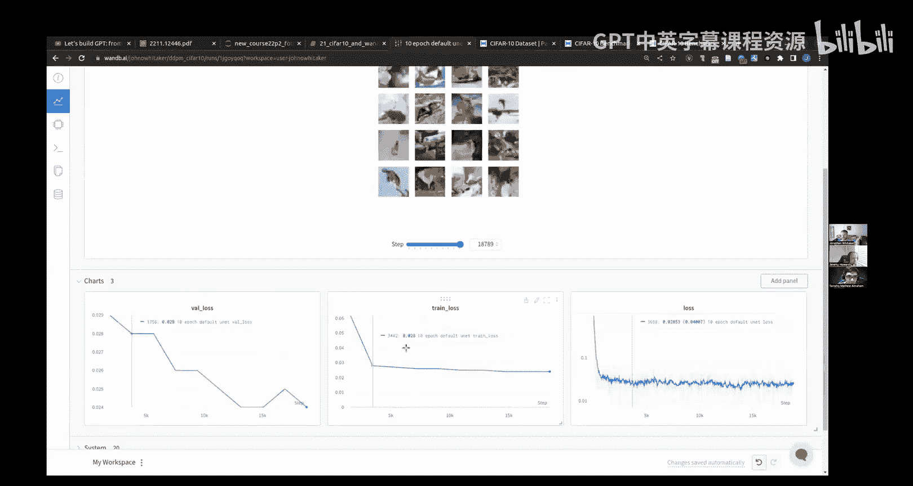

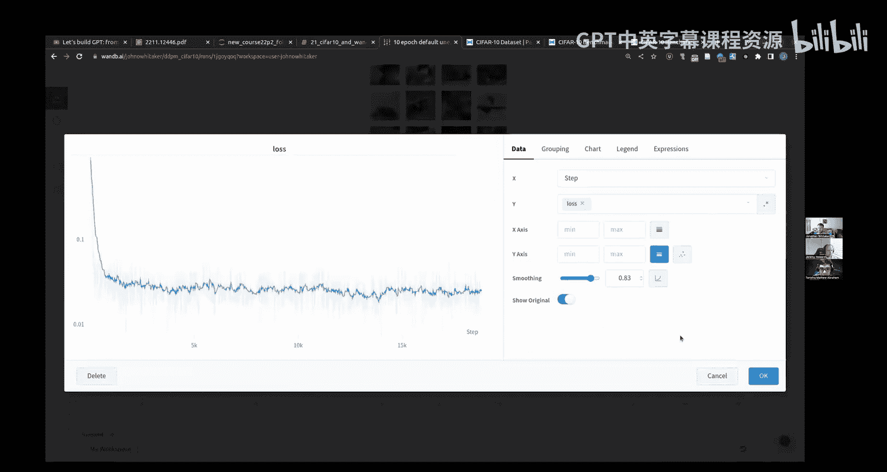

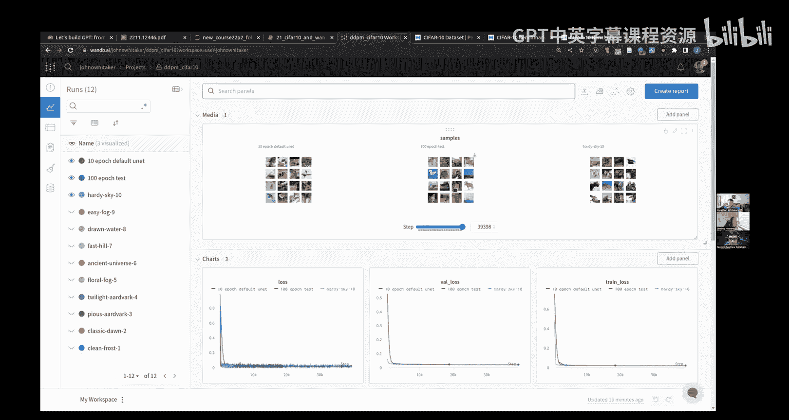

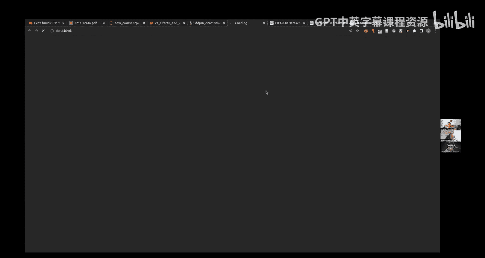

---

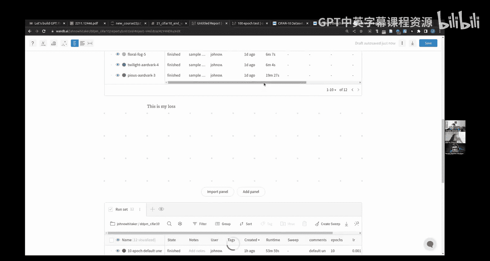

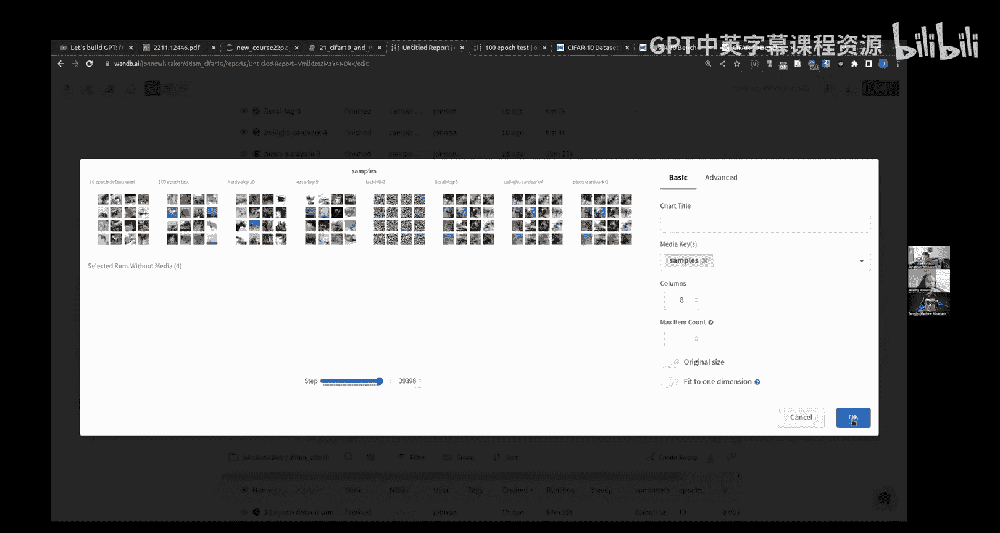

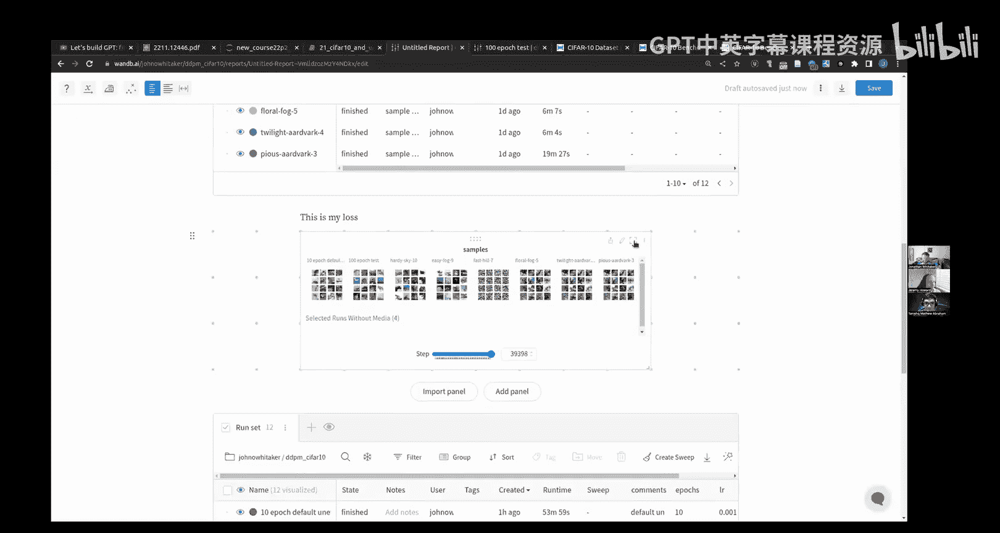

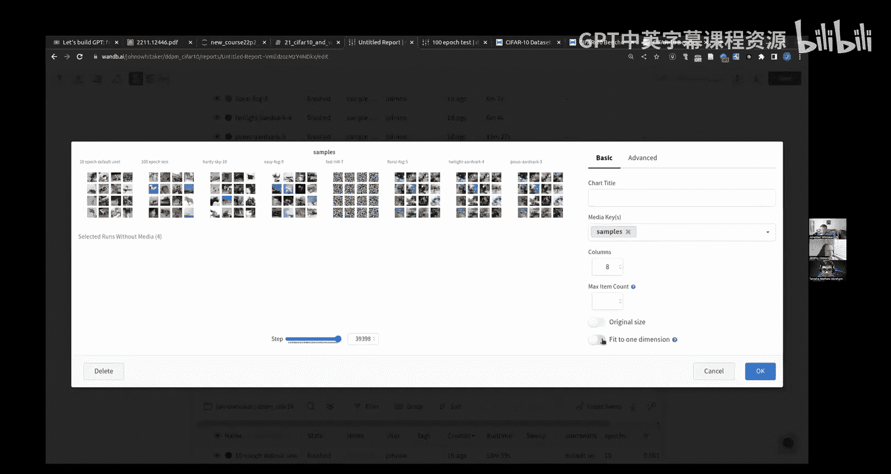

## 从Fashion MNIST到CIFAR-10 📈

为了验证我们的方法在更复杂数据集上的有效性，我们决定从Fashion MNIST升级到CIFAR-10数据集。CIFAR-10包含10个类别的彩色图像，尺寸为32x32像素，是图像生成和分类论文中常用的基准数据集。

以下是CIFAR-10数据的一些关键点：
*   CIFAR-10图像是3通道（RGB）的，而Fashion MNIST是单通道的。
*   图像尺寸较小，视觉上有时难以辨认细节。
*   由于图像质量本身不高，仅凭肉眼判断生成效果具有挑战性。

我们的代码具有良好的通用性。即使数据形状从单通道变为三通道，`noisify`函数和采样函数依然可以正常工作，这得益于PyTorch的广播机制。

```python
# 即使数据形状变化，代码依然有效
noise = torch.randn_like(x)  # 自动适应 x 的形状 (batch, 3, 32, 32)
```

---

## 实验跟踪与Weights & Biases 📊

当实验训练时间变长、超参数组合增多时，手动记录和管理实验结果变得非常繁琐。为了解决这个问题，我们可以使用实验跟踪工具。

以下是几种常见的实验跟踪方法：
*   **简单方法**：在每个训练周期保存样本图像到文件。
*   **进阶方法**：在训练进度条中动态更新样本图像。
*   **专业工具**：使用专门的实验跟踪平台，如Weights & Biases（W&B）。

我们重点介绍Weights & Biases。它是一个免费（针对个人和学术用途）的服务，可以自动记录损失、指标、超参数、代码版本，甚至样本图像。

```python
# 使用回调系统集成 Weights & Biases
class WandBCallback(MetricCallback):
    def __init__(self):
        self.run = wandb.init(project="my-diffusion-project")
    def _log(self, log_vals):
        # 记录损失和指标
        wandb.log({"train_loss": log_vals[0]})
        # 记录生成的样本图像
        samples = self.learn.model.sample(16)
        fig = show_images(samples)
        wandb.log({"samples": wandb.Image(fig)})
```

使用W&B的优势在于：
*   **集中管理**：所有实验记录在云端，便于回顾和比较。
*   **协作方便**：团队成员可以共享和查看同一项目的实验。
*   **可复现性**：自动保存代码快照和环境信息。
*   **远程监控**：可以在任何设备上查看训练进度。

**注意**：虽然这类工具非常强大，但也要避免陷入无目的的“超参数轰炸”。有假设、有方向的实验与代码迭代，通常比盲目搜索更有效。

---

## 评估生成图像：FID与KID 📏

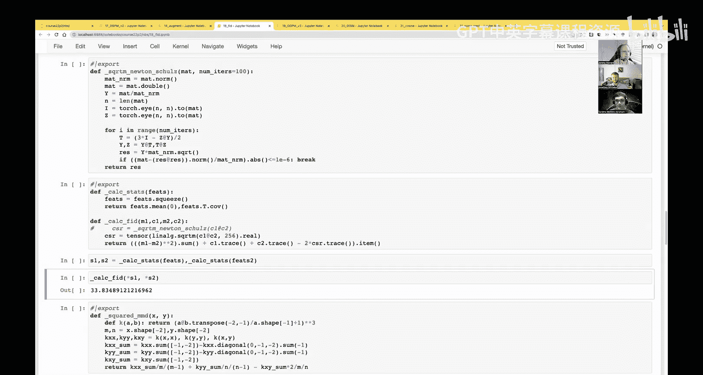

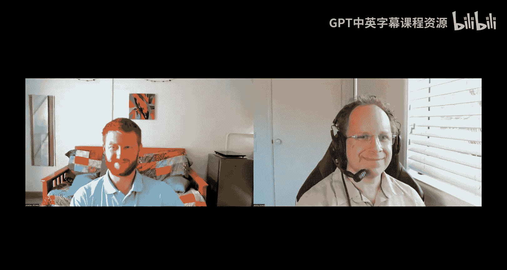

当生成图像看起来“还不错”时，我们需要一个更客观的指标来衡量其质量。目前，没有一个完美的指标能完全替代人类的主观判断，但FID和KID是两个广泛使用的近似指标。

### FID（Fréchet Inception Distance）原理

FID的核心思想是：**比较生成图像和真实图像在特征空间中的分布距离**。

计算步骤如下：
1.  使用一个在目标任务（如图像分类）上预训练好的模型（如Inception网络，或我们自训练的Fashion分类器）。
2.  分别将一批真实图像和一批生成图像输入该模型，提取某个中间层（通常是全局池化层之前）的激活值（特征）。
3.  对于真实图像和生成图像的特征集合，分别计算它们的均值向量和协方差矩阵。
4.  FID分数计算这两个多元高斯分布之间的Fréchet距离。

```python
# FID 计算的核心公式（概念性）
FID = ||μ_r - μ_g||^2 + Tr(Σ_r + Σ_g - 2*(Σ_r * Σ_g)^(1/2))
# 其中 μ 是均值向量，Σ 是协方差矩阵，Tr 是迹，下标 r 代表真实数据，g 代表生成数据。
```

**重要提示**：
*   **一致性是关键**：FID值只有在使用相同的特征提取模型、相同的样本数量、相同的图像预处理流程时，才具有可比性。
*   **常见问题**：标准FID使用Inception网络，并要求输入图像尺寸为299x299。这对于小图像（如32x32）或大图像（如1024x1024）都会引入偏差。
*   **我们的选择**：为了更准确地评估Fashion MNIST生成效果，我们使用自己训练的Fashion分类器作为特征提取器，而不是标准的Inception网络。

### KID（Kernel Inception Distance）

KID是另一个衡量分布相似度的指标。它使用核方法来直接比较特征，而不是拟合高斯分布。理论上，KID对样本数量的偏差不敏感，但实践中我们发现其方差较大。

### 实现与应用

我们将FID/KID计算封装成一个工具类 `ImageEval`。利用它，我们可以做一件很有意义的事：**绘制采样过程中每一步的FID曲线**。这可以直观地展示图像质量是如何随着去噪步骤的进行而逐步改善的。

我们发现，在修复了一个数据范围的小bug后（将模型输入从[0,1]改为[-0.5,0.5]），模型的FID分数得到了显著提升，生成质量大大改善。

---

## 加速采样：从DDPM到DDIM ⚡

标准的DDPM采样需要迭代1000步，调用模型1000次，速度很慢。观察发现，在采样的许多中间步骤，模型预测的变化很小。这启发我们探索更高效的采样算法。

### DDIM（Denoising Diffusion Implicit Models）

DDIM是一种更通用、更灵活的采样框架，其核心优势在于：
*   **可加速**：可以使用远少于训练步数（如50或100步）进行采样。
*   **可控随机性**：引入了一个参数 `η`（eta）。当 `η=1` 时，等价于DDPM的随机过程；当 `η=0` 时，采样过程变为完全确定性。
*   **数学简洁**：DDIM的推导基于一个不同的非马尔可夫前向过程，但其训练目标与DDPM完全相同。这意味着**我们可以直接使用训练好的DDPM模型进行DDIM采样，无需重新训练**。

DDIM的采样步骤核心公式如下：

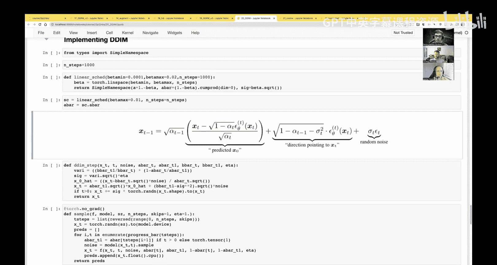

```python
# DDIM 采样步骤（简化版）
# 给定当前噪声图像 x_t, 时间步 t, 预测的噪声 ε_θ
pred_x0 = (x_t - sqrt(1 - alpha_bar_t) * ε_θ) / sqrt(alpha_bar_t) # 预测的干净图像
# 计算指向 x_t 的方向
dir_xt = sqrt(1 - alpha_bar_{t-1} - sigma_t**2) * ε_θ
# 计算下一时刻的图像
x_{t-1} = sqrt(alpha_bar_{t-1}) * pred_x0 + dir_xt + sigma_t * z
# 其中 z 是随机噪声（当 η>0 时），sigma_t 由 η 控制。
```

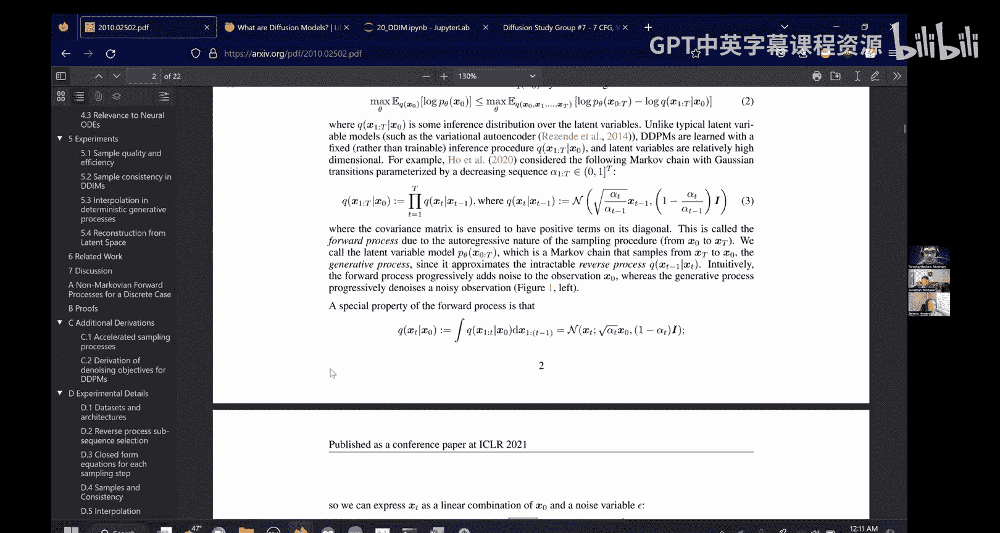

### 效果对比

我们使用训练好的模型，分别用DDPM（1000步）、DDIM（100步）和更激进的跳跃采样进行测试。
*   **DDIM (100步)**：采样速度提升10倍，FID分数与DDPM（1000步）非常接近，图像质量几乎无损。
*   **跳跃采样**：尝试每3步或动态间隔采样，速度更快，但图像质量（尤其是纹理细节）在步数过少时会有所下降。

实验表明，DDIM在速度和质量之间取得了出色的平衡，是稳定扩散等实际应用中常用的采样器。

---

## 总结

本节课中我们一起学习了深度学习实验中的三个重要工程实践主题。

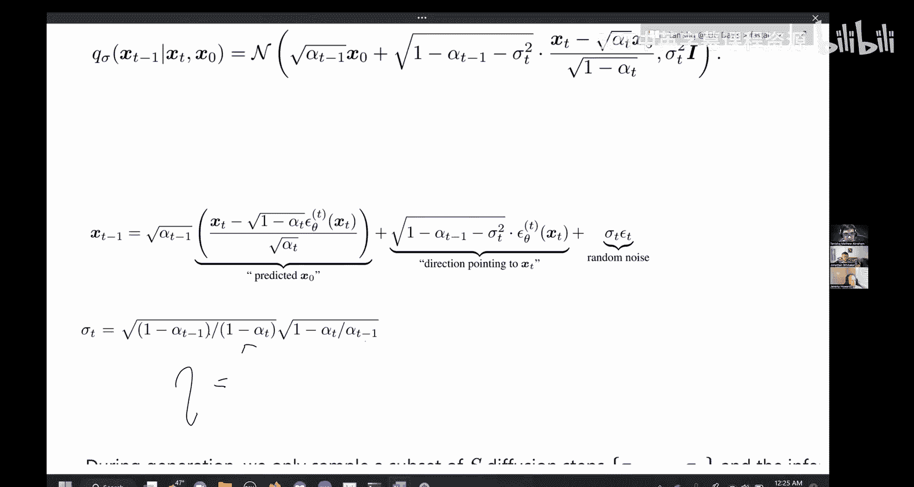

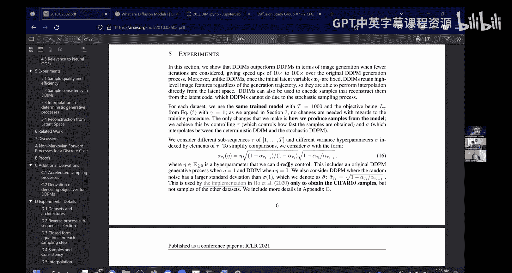

首先，我们了解了**实验跟踪**的必要性，并介绍了如何使用Weights & Biases等工具来记录实验、管理超参数和可视化结果，这对于进行长期或复杂的实验至关重要。

其次，我们深入探讨了生成模型的**评估指标FID和KID**。我们明白了它们通过比较特征空间分布来量化图像质量的原理，同时也认识到它们的局限性和使用时的注意事项（如一致性）。我们还将FID计算工具化，并用于监控采样过程。

最后，我们探索了**DDIM加速采样算法**。DDIM通过改变采样过程而非训练过程，实现了数量级的速度提升，同时保持了高质量的图像生成，并且提供了控制生成随机性的能力。

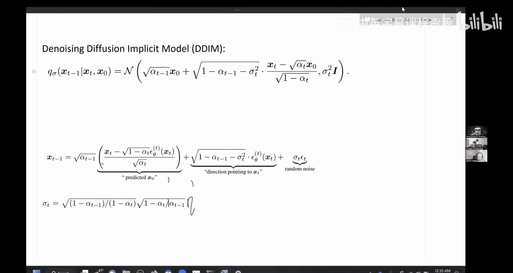

通过本课的学习，我们不仅提升了生成图像的质量（通过修复输入范围bug和调整噪声计划），还装备了评估和加速这些生成过程的实用工具与方法。这为我们接下来探索更前沿的研究方向奠定了坚实的基础。