# 深度学习基础到稳定扩散模型：16：扩散模型简化与改进 🚀

在本节课中，我们将学习如何简化扩散模型的实现，并探索一些改进方法，包括去除离散时间步、预测噪声水平以及使用更先进的采样器。我们将从代码层面理解这些概念，并看到它们如何提升模型性能。

---

## 简化时间步表示

上一节我们介绍了余弦调度器。本节中，我们来看看如何进一步简化模型，去除离散时间步的概念。

在之前的实现中，我们使用一个总步数 `T`（如1000）和当前步数 `t`（如500）来表示“时间”。这相当于时间步0.5。为什么我们不直接使用0到1之间的浮点数来表示“在扩散过程中所处的位置百分比”呢？答案是：我们可以。

现在，我们假设时间步 `t` 是一个介于0和1之间的浮点数，其中0代表完全干净的图像，1代表完全噪声的图像。这样，`t` 就表示在前向扩散过程中所处的相对位置。

核心公式也相应简化。我们不再查表获取 `alpha_bar`，而是通过一个函数直接从浮点数 `t` 计算得出：

```python
def alpha_bar(t):
    return math.cos((t + 0.008) / 1.008 * math.pi / 2) ** 2
```

有趣的是，我们也可以从 `alpha_bar` 反推回 `t`，这意味着 `alpha_bar` 不再是一个需要预计算的列表，而是一个即时计算的函数。

**噪声化过程** 也随之改变。现在，我们为每个样本随机生成一个0到1之间的浮点数作为其时间步 `t`，然后使用上述函数计算对应的 `alpha_bar` 来添加噪声。这使得整个过程在时间上变得连续，而非离散。

以下是噪声化函数的核心变化：
```python
def noiseify(x):
    t = torch.rand(x.shape[0]) * 0.999  # 随机时间步
    ab = alpha_bar(t)  # 计算 alpha_bar
    noise = torch.randn_like(x)
    x_t = math.sqrt(ab) * x + math.sqrt(1 - ab) * noise
    return x_t, t, noise  # 返回噪声图像、时间步和噪声本身
```

**模型的输入和输出** 保持不变：输入是噪声图像 `x_t` 和时间步 `t`，输出是预测的噪声。

---

## 验证单步去噪效果

在训练模型后，我们可以直观地看到它在不同噪声水平下的单步去噪能力。

以下是验证步骤：
1.  获取一批经过不同程度噪声化的图像及其对应的时间步 `t`。
2.  使用模型预测每个噪声图像中的噪声。
3.  利用公式 `x_0_hat = (x_t - math.sqrt(1 - alpha_bar(t)) * predicted_noise) / math.sqrt(alpha_bar(t))` 来估算原始图像。

结果令人印象深刻。即使在噪声水平较高（例如 `t=0.45`）时，模型也能大致还原出图像的轮廓和结构（例如识别出鞋子）。这证明了模型强大的单步预测能力。

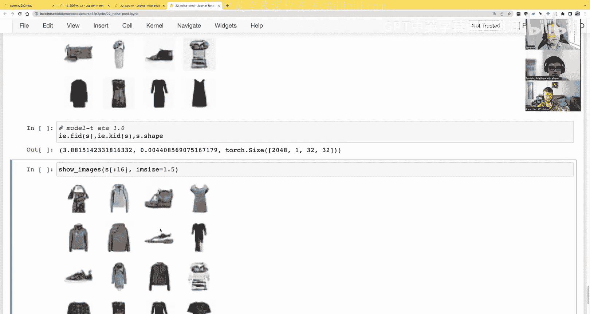

---

## 改进采样过程

采样过程也进行了相应的简化。我们不再使用 `range` 函数生成离散时间步，而是使用 `linspace` 在0到1之间生成线性的连续时间步序列。

对于DDIM采样器，主要变化在于每一步的 `alpha_bar` 是通过当前连续时间步 `t` 计算得到的，而不是通过索引查表。核心采样循环如下：

```python
def sample_ddim(model, steps=100):
    ts = torch.linspace(0.999, 0, steps+1)  # 从噪声到干净
    x_t = torch.randn(batch_size, 1, 28, 28)  # 纯噪声起点
    for i in range(steps):
        t = ts[i]
        ab = alpha_bar(t)
        # ... 使用模型预测并计算下一步的 x_t ...
    return x_t
```

使用这种简化后的100步DDIM采样，我们在Fashion MNIST上得到了约3.0的FID分数，比之前离散时间步版本的性能有所提升。

---

## 探索无时间步输入模型

一个有趣的问题是：模型真的需要我们将时间步 `t` 作为输入吗？给定一个噪声图像，模型能否自己推断出其中的噪声量？

为了验证这一点，我们训练了一个新模型。这个模型的任务是：**给定噪声图像，预测其对应的 `alpha_bar(t)`（即噪声水平）**。

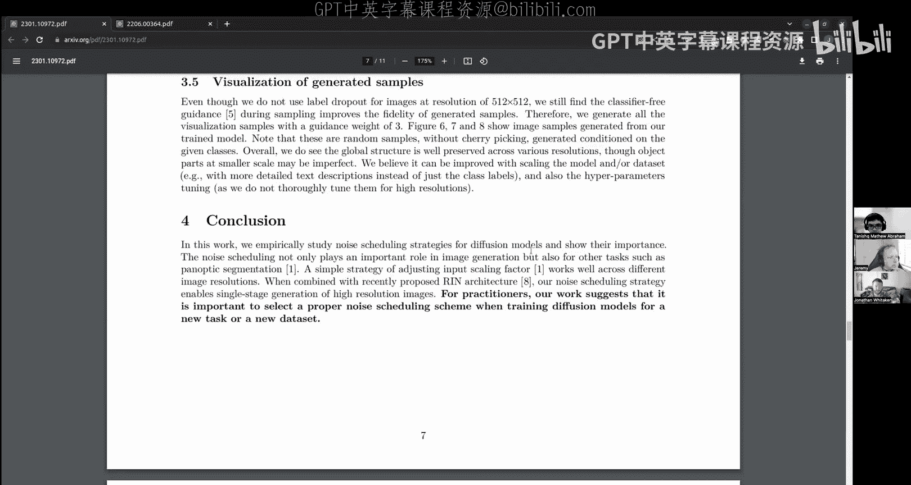

以下是关键实现细节：
*   **目标变量**：`alpha_bar(t)`，一个介于0和1之间的值。
*   **输出处理**：由于 `alpha_bar(t)` 的值域特性，直接预测可能导致模型对接近1的值不敏感。因此，我们对目标值取对数（`logit`），将其映射到整个实数范围，这使得模型能平等地对待不同噪声水平。
    ```python
    target = torch.logit(alpha_bar_t)  # alpha_bar_t 是目标值
    ```
*   **损失函数**：使用均方误差（MSE）。
*   **基准线**：为了评估模型性能，我们计算了如果总是预测固定值（如0.5）或数据均值时的MSE损失，作为对比基准。

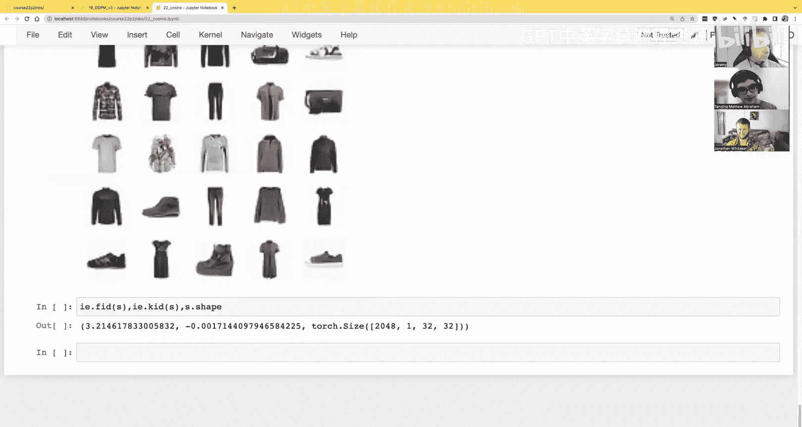

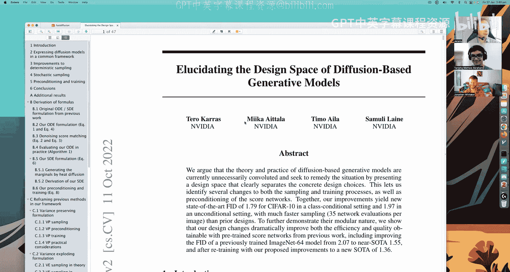

训练结果显示，该模型能够相当准确地预测噪声水平（MSE约为0.075），证实了我们的假设：模型可以从图像中推断噪声量。

---

## 构建无需时间步输入的扩散模型

既然模型可以预测噪声水平，我们尝试构建一个**不接收时间步 `t` 作为输入**的扩散模型。

**修改如下**：
1.  在噪声化函数中，不再返回时间步 `t`。
2.  在训练时，我们向模型传递一个全零张量来代替时间步输入（这是一种快速验证想法的“偷懒”方法，而非修改模型结构）。

直接训练后，模型损失（0.034）与接收时间步输入的模型（0.033）非常接近。**然而，当使用标准DDIM采样时，生成结果完全失败**，图像仍然非常嘈杂。

**问题分析与改进**：采样失败的原因是，在每一步采样中，我们假设模型恰好移除了预期量的噪声。但如果模型的预测有微小偏差，误差会累积。解决方案是：在采样每一步，**使用我们训练好的“噪声水平预测模型”来动态估计当前图像的实际噪声量**，并据此调整去噪步骤，而不是死板地遵循预设的时间表。

改进后的DDIM步骤核心思想：
```python
def ddim_step_with_t_prediction(x_t, t):
    # 1. 使用T模型预测当前x_t的噪声水平 (pred_ab)
    pred_ab = t_model(x_t)
    # 2. 对预测值进行裁剪，防止异常值
    median_ab = torch.median(pred_ab)
    clamped_ab = torch.clamp(pred_ab, median_ab*0.5, median_ab*2)
    # 3. 使用裁剪后的预测alpha_bar进行去噪计算
    predicted_noise = model(x_t, torch.zeros_like(t)) # 主模型不接收t
    x_0_hat = (x_t - math.sqrt(1 - clamped_ab) * predicted_noise) / math.sqrt(clamped_ab)
    # ... 继续后续采样步骤 ...
```

应用此改进后，采样效果大幅提升，生成的图像质量很高（FID约3.8），与使用真实时间步输入的方法接近。这证明了“无时间步”扩散模型是可行的，并且有进一步优化的潜力。

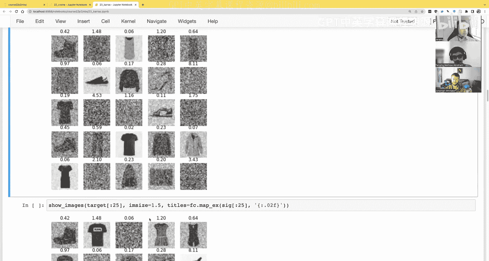

---

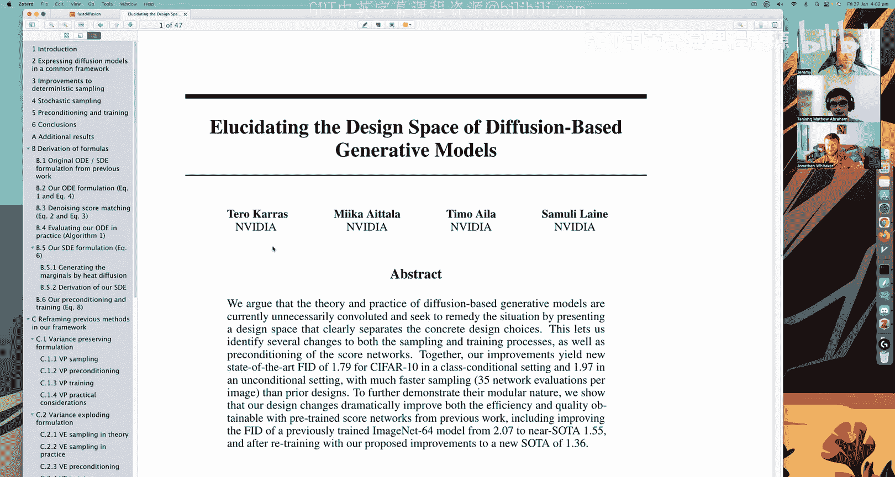

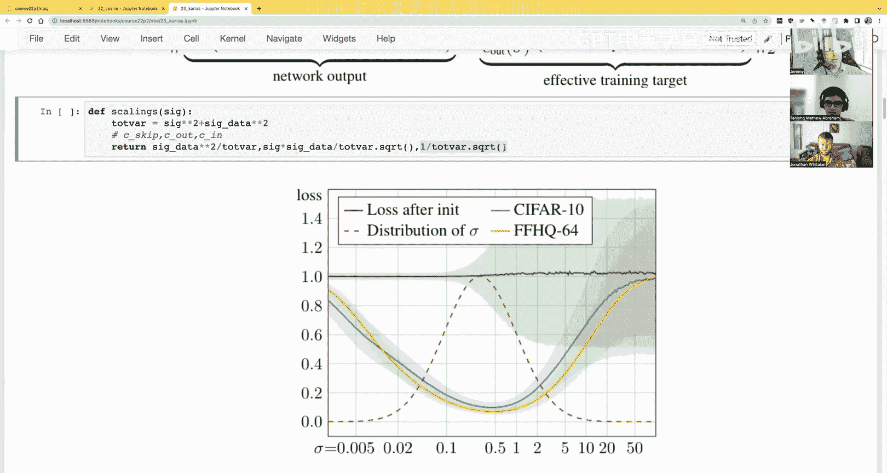

## 输入缩放与噪声调度研究

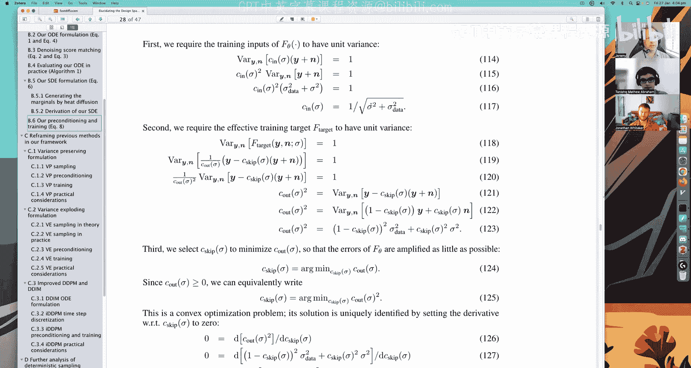

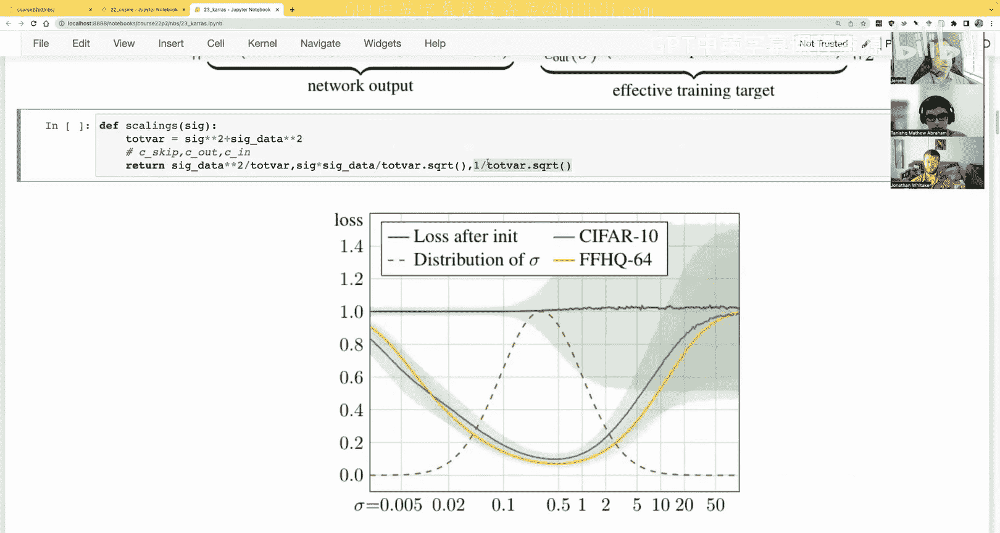

我们之前偶然发现，将输入图像从 `[0, 1]` 缩放到 `[-0.5, 0.5]` 可以改善训练。最近的研究论文《The Importance of Noise Scheduling for Diffusion Models》系统地探讨了这个问题。

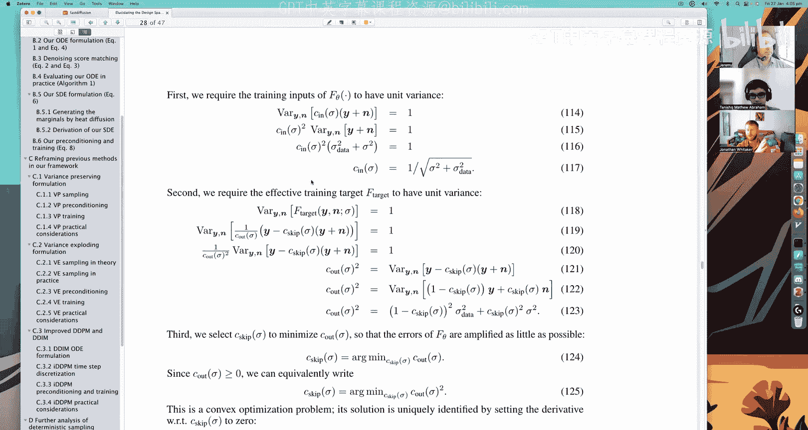

**核心发现**：
1.  **噪声调度对性能至关重要**，且最优调度取决于具体任务（如图像分辨率）。
2.  **对输入数据进行缩放**是一种有效的策略，可以调整信号与噪声的比率（SNR），从而改善不同分辨率下的模型训练效果。
3.  论文通过实验展示了不同噪声调度函数（如线性、余弦、S型）和不同输入缩放因子在不同图像尺寸下的表现，并提供了如何根据图像大小选择缩放因子的经验法则。

这项研究将输入缩放和噪声调度从经验性技巧提升到了可分析、可优化的设计选择层面。

---

## Karras 方法：统一设计框架

接下来，我们介绍Karras等人的论文《Elucidating the Design Space of Diffusion-Based Generative Models》。该论文提出了一个更简洁、统一的设计框架。

**核心简化**：使用单个参数 `sigma`（相当于我们之前的 `alpha_bar`）来表示噪声水平，去除了 `alpha`, `beta`, `alpha_bar` 等复杂符号。

**关键创新点**：
1.  **动态训练目标（C_skip）**：模型不再总是预测噪声或总是预测干净图像。而是根据当前噪声水平 `sigma`，预测一个介于原始图像和纯噪声之间的目标。公式如下：
    > `target = C_skip * x_0 + (1 - C_skip) * noise`
    >
    > 其中 `C_skip = data_variance / (data_variance + sigma^2)`
    >
    > *   当噪声很大时（`sigma^2` 大），`C_skip` 小，模型主要预测干净图像（困难任务）。
    > *   当噪声很小时（`sigma^2` 小），`C_skip` 大，模型主要预测噪声（困难任务）。
    > *   这使得对于任何噪声水平，模型需要解决的问题难度相对均衡。

2.  **输入输出缩放（C_in, C_out）**：为了确保输入模型的数据具有单位方差（最佳训练条件），对噪声输入 `x_t` 和训练目标 `target` 分别进行缩放。
    > `x_t_scaled = x_t * C_in`
    > `target_scaled = target * C_out`
    >
    > 其中 `C_in = 1 / sqrt(data_variance + sigma^2)`
    > `C_out = sqrt(data_variance + sigma^2) / data_variance`
    >
    > 这些公式的推导基于“使输入/输出的方差为1”这一目标。

3.  **对数正态分布的噪声调度**：在训练时，从对数正态分布中采样 `sigma`，而不是均匀分布。这更符合模型在不同噪声水平下的预测误差分布（模型在中等噪声水平预测最准，在极高或极低噪声水平预测不准）。采样公式为：
    > `sigma = exp(N(mean, std^2))`， 通常 `mean=1.2`, `std=1.2`

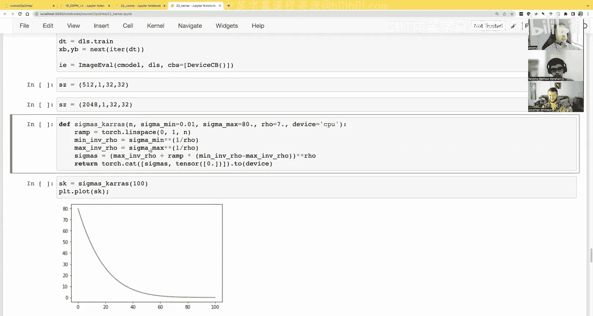

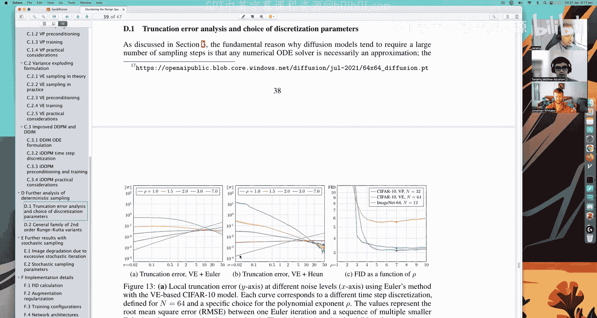

**实现与效果**：按照Karras方法实现后，模型在单步去噪可视化中表现出色。更重要的是，其采样代码变得异常简洁，并且催生了更高效的采样器。

---

## 高级采样器

在Karras框架下，采样过程变得模块化，我们可以轻松实现不同的采样算法。

**1. 欧拉采样器 (Euler)**
最简单的确定性采样器，思路是计算当前点的“去噪方向”（梯度），并沿该方向移动一步。
```python
def sample_euler(x, sigma_1, sigma_2):
    denoised = denoise_fn(x, sigma_1)  # 去噪得到估计的x0
    d = (x - denoised) / sigma_1        # 计算“噪声方向”作为梯度
    return x + d * (sigma_2 - sigma_1)  # 沿梯度方向移动
```

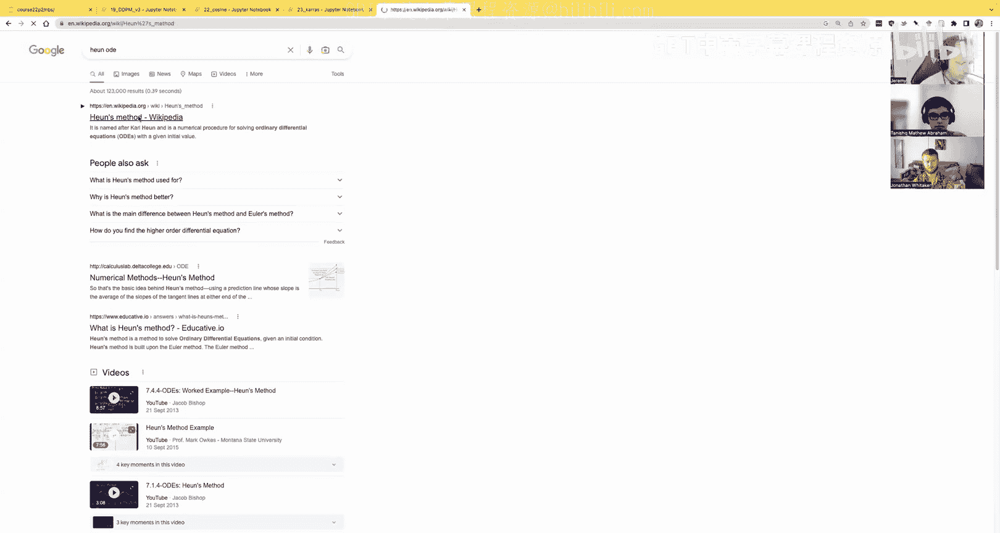

**2. 欧拉祖先采样器 (Euler Ancestral)**
在欧拉方法的基础上，在每一步添加少量随机噪声，使采样过程具有随机性。这需要调整确定性和随机性步长的比例。

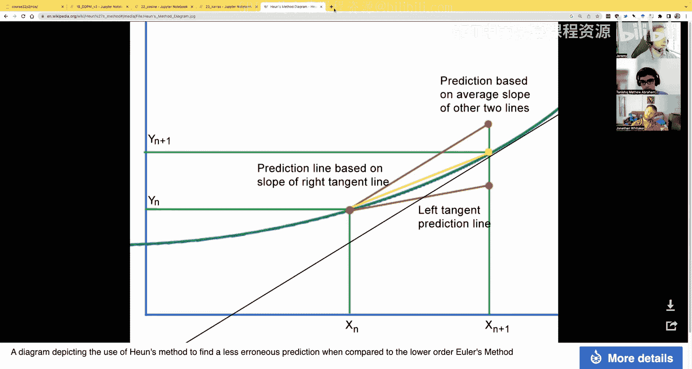

**3. Heun采样器 (Heun)**
一种二阶方法，精度更高。它先做一个欧拉步得到中间点，计算该点的梯度，然后使用两个梯度的平均值来更新当前点。虽然每一步需要两次模型评估，但可以用更少的步数达到更好效果。
```python
def sample_heun(x, sigma_1, sigma_2):
    denoised_1 = denoise_fn(x, sigma_1)
    d_1 = (x - denoised_1) / sigma_1
    x_euler = x + d_1 * (sigma_2 - sigma_1)  # 欧拉中间点

    denoised_2 = denoise_fn(x_euler, sigma_2)
    d_2 = (x_euler - denoised_2) / sigma_2

    d_avg = (d_1 + d_2) / 2  # 使用平均梯度
    return x + d_avg * (sigma_2 - sigma_1)
```

**4. LMS采样器 (Linear Multistep)**
一种更聪明的方法，它利用过去几步的梯度信息来估计当前步的最佳更新方向，而无需额外调用模型。这可以用更少的模型评估次数获得高质量的采样结果。

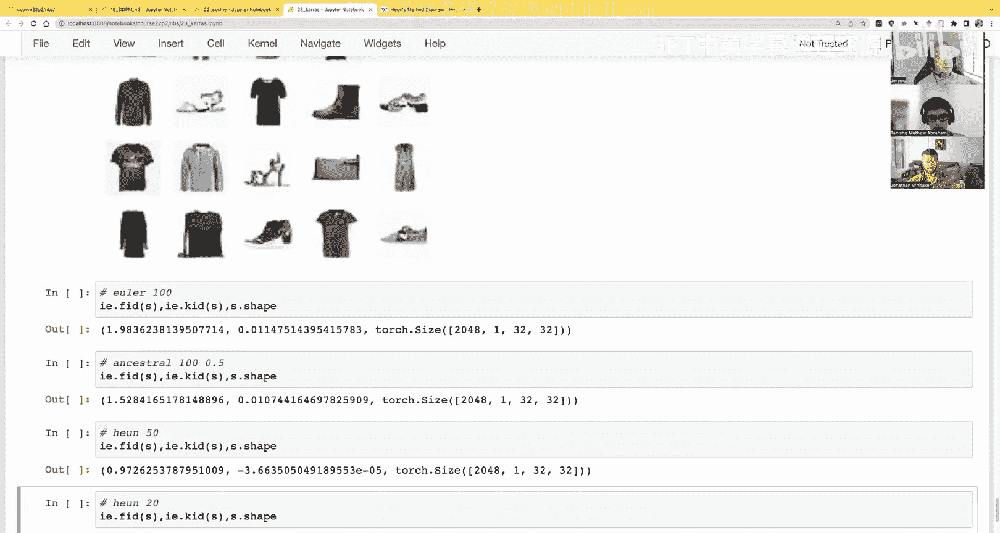


**性能对比**：在Fashion MNIST上，使用Heun采样器仅需20步（40次模型评估）就能获得FID约1.0的优异结果，远超之前100步欧拉采样的效果。这凸显了先进采样器和精心设计的噪声调度、输入缩放相结合的巨大威力。

---

## 总结

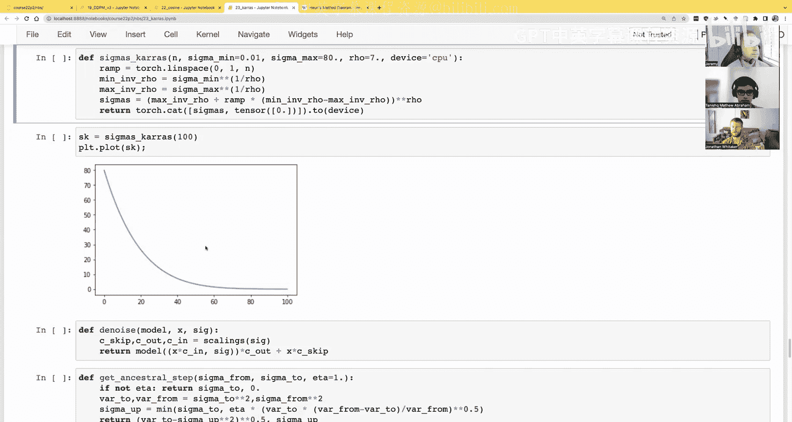

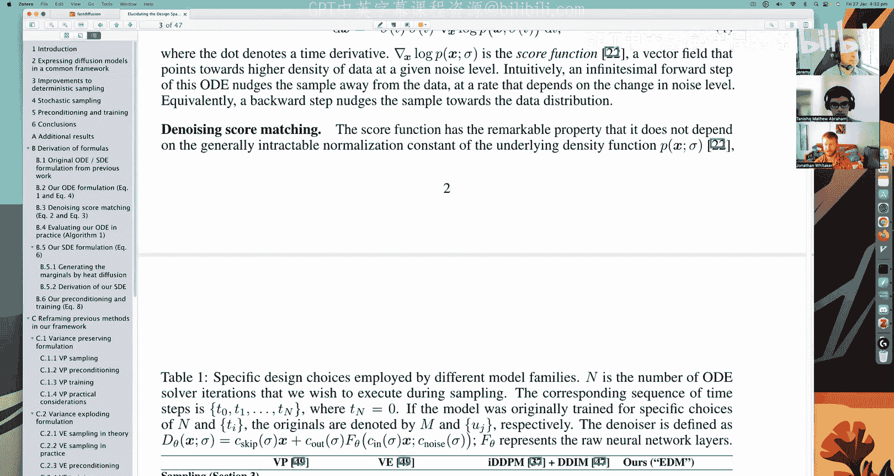

本节课中我们一起学习了扩散模型的一系列重要简化和改进：

1.  **连续时间步**：用0到1的浮点数代替离散步数，使过程更连续、代码更简洁。
2.  **噪声水平预测**：证明了模型能够从噪声图像中推断噪声量，为“无时间步输入”模型奠定了基础。
3.  **Karras统一框架**：引入了 `sigma`、动态训练目标（`C_skip`）和输入输出缩放（`C_in`, `C_out`），将训练和采样过程统一到一个更简洁、更理论化的框架中。
4.  **高级采样器**：探索了欧拉、Heun、LMS等采样算法，展示了如何用更少的计算步骤获得更高质量的生成样本。

这些改进不仅提升了模型性能，也让我们对扩散模型的工作原理有了更深刻的理解。从复杂的DDPM实现出发，我们最终到达了一个代码更简洁、效果更出色、设计更优雅的境地。接下来，我们将利用这些知识，开始训练更强大的U-Net模型，并在更复杂的数据集上进行实践。