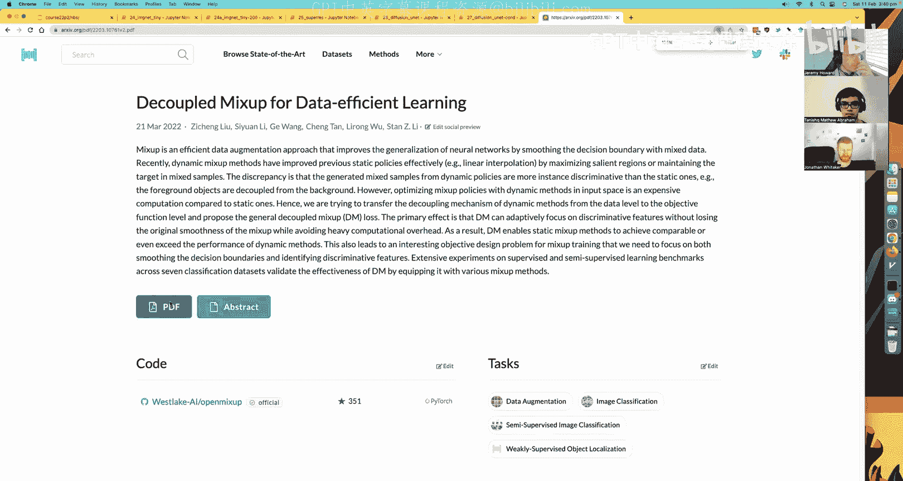
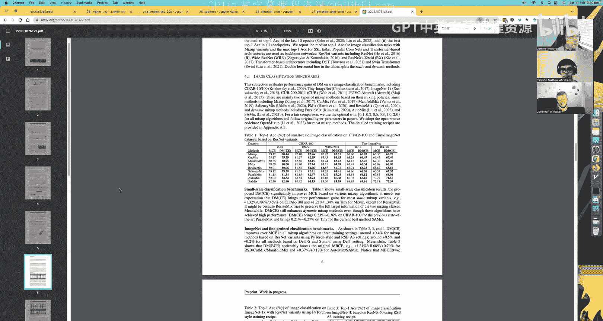
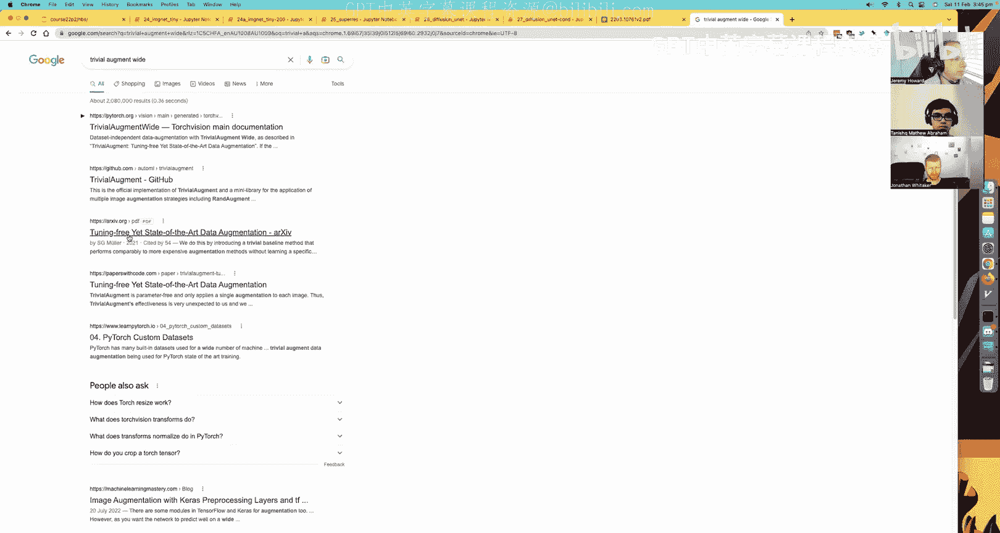
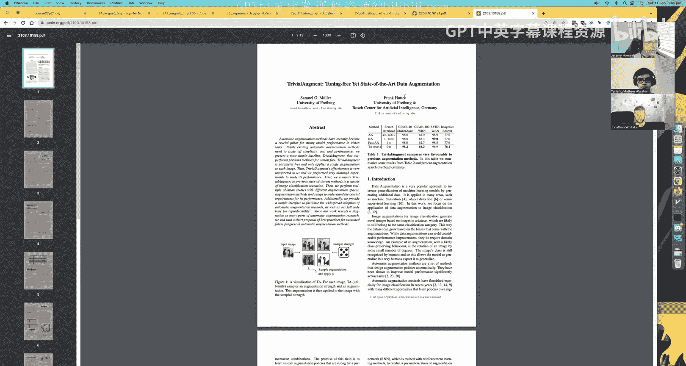
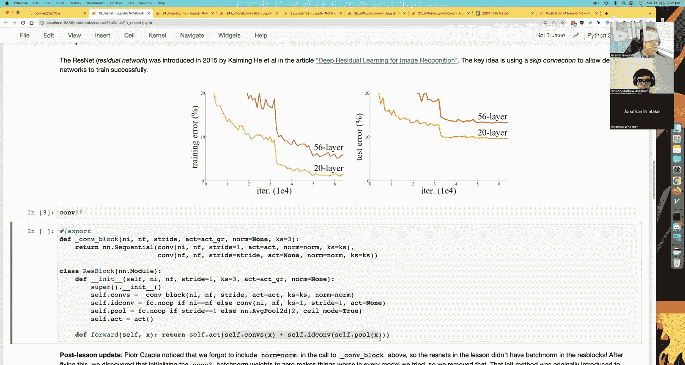
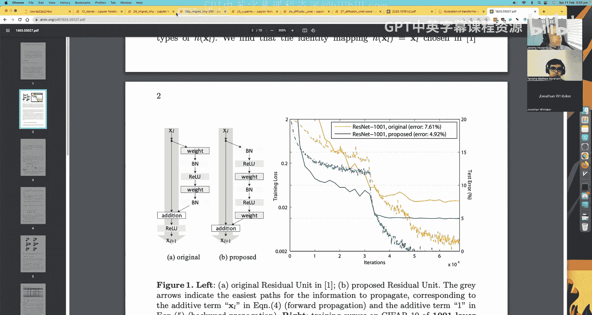
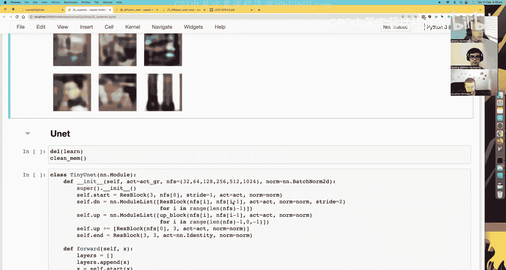
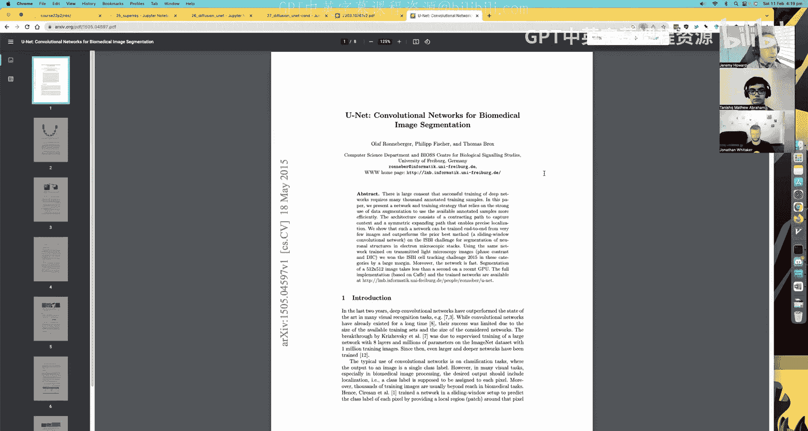
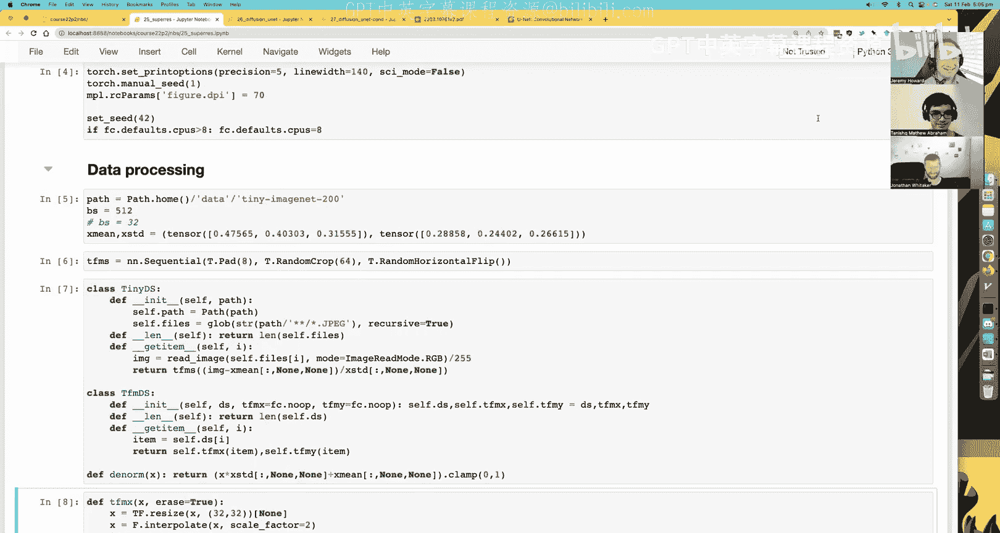

# 深度学习基础到稳定扩散模型：17：U-Net架构与超分辨率应用

## 概述
在本节课中，我们将学习U-Net架构，并将其应用于图像超分辨率任务。我们将从构建一个基础的U-Net模型开始，逐步引入感知损失和预训练权重微调等技巧，以显著提升超分辨率图像的质量。

---

## 数据准备与处理

上一节我们介绍了FID指标及其计算中的bug。本节中我们来看看如何为新的图像任务准备数据。

我们使用Tiny ImageNet数据集，其图像尺寸为64x64像素。首先需要下载并解压数据。

```python
import tarfile
url = 'http://cs231n.stanford.edu/tiny-imagenet-200.zip'
tarfile.open('tiny-imagenet-200.zip', 'r:gz').extractall('data')
```

数据集的训练集和验证集结构不同。训练集图像按类别存放在子文件夹中，而验证集图像则集中存放，其标签信息在一个单独的文本文件中。

以下是创建训练集数据集的步骤：

```python
from pathlib import Path
def get_files(path):
    return list(Path(path).glob('**/*.JPEG'))

class TinyDataset:
    def __init__(self, path, is_val=False):
        self.path = Path(path)
        self.is_val = is_val
        if not is_val:
            self.files = get_files(self.path/'train')
        else:
            self.files = get_files(self.path/'val')
            # 为验证集创建标签映射字典
            with open(self.path/'val/val_annotations.txt') as f:
                self.val_dict = dict([l.split('\t')[:2] for l in f])
    def __len__(self): return len(self.files)
    def __getitem__(self, i):
        f = self.files[i]
        if not self.is_val:
            return str(f), f.parent.parent.name # 标签是父文件夹的父文件夹名
        else:
            return str(f), self.val_dict[f.name] # 从字典中查找标签
```

我们创建一个通用的数据集转换类，可以方便地对输入（X）和标签（Y）应用不同的变换。

```python
class TransformDataset:
    def __init__(self, ds, tfm_x=None, tfm_y=None):
        self.ds, self.tfm_x, self.tfm_y = ds, tfm_x, tfm_y
    def __len__(self): return len(self.ds)
    def __getitem__(self, i):
        x, y = self.ds[i]
        if self.tfm_x is not None: x = self.tfm_x(x)
        if self.tfm_y is not None: y = self.tfm_y(y)
        return x, y
```

对于图像，我们进行标准化处理。标签（WordNet ID）需要转换为整数索引。

```python
import torchvision.transforms as T
from PIL import Image
# 假设已计算好数据集的均值和标准差
stats = ([0.480, 0.448, 0.398], [0.277, 0.269, 0.282])
# 图像变换：打开 -> 转Tensor -> 标准化
tfm_x = T.Compose([Image.open, T.ToTensor(),
                   T.Normalize(*stats)])
# 标签变换：将WordNet ID字符串映射为整数
with open('data/tiny-imagenet-200/wnids.txt') as f:
    wordnet_ids = [l.strip() for l in f]
str_to_id = {s:i for i,s in enumerate(wordnet_ids)}
tfm_y = lambda s: torch.tensor(str_to_id[s])
# 创建转换后的数据集
train_ds = TransformDataset(TinyDataset(path, False), tfm_x, tfm_y)
val_ds = TransformDataset(TinyDataset(path, True), tfm_x, tfm_y)
```

为了缓解过拟合，我们引入数据增强。对于小尺寸图像，常用的`RandomResizedCrop`效果不佳，因此我们采用`Pad` + `RandomCrop`的方式进行轻微位移，并配合水平翻转。





```python
from torch import nn
import torchvision.transforms.functional as TF
class RandomArray(nn.Module):
    # 添加随机高斯噪声
    def forward(self, x):
        return x + torch.randn_like(x) * 0.1
# 训练集增强变换
train_tfms = T.Compose([
    T.Pad(4),
    T.RandomCrop(64),
    T.RandomHorizontalFlip(),
    RandomArray(),
])
# 可以将其包装为批处理回调，对整个批次应用相同的增强（速度快，但可能不稳定）
# 也可以将其集成到数据集的 `__getitem__` 中，对每个样本独立增强（更稳定）
```

---





## 图像分类器训练

在构建U-Net之前，我们需要一个在Tiny ImageNet上预训练好的分类器，后续将用它来提取感知损失的特征。

我们使用一个基于ResNet块构建的卷积神经网络。



```python
def conv(ni, nf, ks=3, stride=1, act=True):
    layers = [nn.Conv2d(ni, nf, ks, stride=stride, padding=ks//2)]
    if act: layers.append(nn.ReLU())
    return nn.Sequential(*layers)



class ResBlock(nn.Module):
    def __init__(self, ni, nf, stride=1):
        super().__init__()
        self.conv = nn.Sequential(conv(ni, nf, stride=stride),
                                  conv(nf, nf, act=False))
        self.idconv = nn.Identity() if ni==nf else conv(ni, nf, stride=stride, act=False)
        self.pool = nn.Identity() if stride==1 else nn.AvgPool2d(2)
        self.act = nn.ReLU()
    def forward(self, x):
        return self.act(self.conv(x) + self.idconv(self.pool(x)))

def get_model():
    return nn.Sequential(
        conv(3, 16, ks=5, stride=2),
        ResBlock(16, 32, stride=2),
        ResBlock(32, 64, stride=2),
        ResBlock(64, 128, stride=2),
        ResBlock(128, 256, stride=2),
        nn.AdaptiveAvgPool2d(1), nn.Flatten(),
        nn.Dropout(0.5), nn.Linear(256, 200)
    )
```

我们使用AdamW优化器和混合精度训练这个分类器。通过实验，我们引入了**预激活ResBlock**和**TrivialAugment**数据增强策略，将准确率提升至约67.5%，达到了该数据集上的先进水平。

预激活ResBlock将激活函数置于卷积操作之前，使得恒等映射路径更加“纯净”，有助于梯度流动，尤其在深层网络中效果显著。

```python
class PreActResBlock(nn.Module):
    def __init__(self, ni, nf, stride=1):
        super().__init__()
        # 先Norm和Act，再Conv
        self.conv1 = nn.Sequential(nn.BatchNorm2d(ni), nn.ReLU(),
                                   nn.Conv2d(ni, nf, 3, stride=stride, padding=1))
        self.conv2 = nn.Sequential(nn.BatchNorm2d(nf), nn.ReLU(),
                                   nn.Conv2d(nf, nf, 3, padding=1))
        self.idconv = nn.Identity() if ni==nf else nn.Conv2d(ni, nf, 1, stride=stride)
        self.pool = nn.Identity() if stride==1 else nn.AvgPool2d(2)
    def forward(self, x):
        return self.conv2(self.conv1(x)) + self.idconv(self.pool(x))
```

---

## U-Net架构与超分辨率任务

现在，我们开始构建用于超分辨率任务的U-Net模型。任务定义是：输入一张下采样至32x32的低分辨率图像，模型输出对应的64x64高分辨率图像。

一个简单的编码器-解码器（自编码器）结构在此任务上表现很差，输出图像模糊。U-Net的核心思想是在解码（上采样）路径中，引入编码（下采样）路径中对应层的特征图，通过跳跃连接（Skip Connections）融合多尺度信息。

以下是U-Net的关键组件：

```python
class UNet(nn.Module):
    def __init__(self, n_channels=3, n_filters=16):
        super().__init__()
        # 下采样路径 (编码器)
        self.down_path = nn.ModuleList([
            ResBlock(n_channels, n_filters),
            ResBlock(n_filters, n_filters*2, stride=2),
            ResBlock(n_filters*2, n_filters*4, stride=2),
            ResBlock(n_filters*4, n_filters*8, stride=2),
        ])
        # 上采样路径 (解码器)
        self.up_path = nn.ModuleList([
            UpBlock(n_filters*8, n_filters*4), # 上采样并融合特征
            UpBlock(n_filters*4, n_filters*2),
            UpBlock(n_filters*2, n_filters),
        ])
        self.final = conv(n_filters, n_channels, act=False) # 输出3通道图像





class UpBlock(nn.Module):
    def __init__(self, ni, nf):
        super().__init__()
        self.up = nn.Upsample(scale_factor=2, mode='nearest')
        self.conv = ResBlock(ni + nf, nf) # 注意：输入通道是 ni+nf，因为要拼接

    def forward(self, x, skip):
        x = self.up(x)
        x = torch.cat([x, skip], dim=1) # 跳跃连接：拼接特征
        return self.conv(x)
```

在U-Net的前向传播中，我们需要保存下采样路径每一层的输出，以便在上采样时进行拼接。

```python
def forward(self, x):
    skips = []
    # 下采样，保存中间特征
    for layer in self.down_path:
        skips.append(x)
        x = layer(x)
    # 上采样，融合保存的特征
    for i, layer in enumerate(self.up_path):
        x = layer(x, skips[-(i+1)]) # 从后往前取对应的特征
    return self.final(x)
```

使用均方误差（MSE）损失训练这个基础U-Net，结果比自编码器好，但图像仍然偏模糊，细节不足。

---

## 引入感知损失

MSE损失倾向于让模型输出像素值的平均，导致模糊。**感知损失（Perceptual Loss）** 通过比较生成图像和真实图像在预训练分类器深层特征空间中的差异，来引导模型生成语义上更合理、视觉上更清晰的图像。

我们使用之前训练好的分类器（截断到中间层）来提取特征。

```python
class PerceptualLoss(nn.Module):
    def __init__(self, c_model, weight=0.1):
        super().__init__()
        self.c_model = c_model
        self.weight = weight
        self.mse = nn.MSELoss()

    def forward(self, pred, target):
        # 像素级MSE损失
        mse_loss = self.mse(pred, target)
        # 感知损失：比较特征
        with torch.no_grad():
            targ_feats = self.c_model(target)
        pred_feats = self.c_model(pred)
        feat_loss = self.mse(pred_feats, targ_feats)
        # 加权总和
        return mse_loss + self.weight * feat_loss
```

将感知损失与MSE损失结合训练U-Net，生成的图像在细节（如眼睛、纹理）上有了显著改善。

---

## 使用预训练权重与微调

我们可以进一步“作弊”：用预训练分类器的权重来初始化U-Net的编码器（下采样路径）。因为编码器的任务是理解图像内容，这与分类器的早期层功能相似。

```python
# 假设 `pretrained_model` 是训练好的分类器，`unet` 是我们的模型
# 复制编码器部分的权重
unet.down_path[0].load_state_dict(pretrained_model[0].state_dict())
unet.down_path[1].load_state_dict(pretrained_model[1].state_dict())
# ... 以此类推
# 冻结编码器权重，先只训练解码器
for param in unet.down_path.parameters():
    param.requires_grad = False
# 训练一个周期后，解冻所有权重进行联合微调
for param in unet.parameters():
    param.requires_grad = True
```

这种方法让模型训练更快，收敛更好，最终的超分辨率图像质量更高。

---

## 改进：交叉连接

在标准的U-Net跳跃连接中，下采样特征直接拼接到上采样路径。我们可以引入一个小的**交叉连接（Cross Connection）** 网络（如一个ResBlock）来处理下采样特征，再将其与上采样特征融合，为模型提供更多灵活性。

```python
class UNetWithCross(nn.Module):
    def __init__(self, n_channels=3, n_filters=16):
        super().__init__()
        self.down_path = nn.ModuleList([...]) # 同前
        self.cross_cons = nn.ModuleList([
            ResBlock(n_filters, n_filters),
            ResBlock(n_filters*2, n_filters*2),
            ResBlock(n_filters*4, n_filters*4),
        ])
        self.up_path = nn.ModuleList([...]) # 同前

    def forward(self, x):
        skips = []
        for i, layer in enumerate(self.down_path):
            skips.append(x)
            x = layer(x)
        for i, (up_layer, cross_layer) in enumerate(zip(self.up_path, self.cross_cons)):
            skip_processed = cross_layer(skips[-(i+1)]) # 用交叉连接处理跳跃特征
            x = up_layer(x, skip_processed) # 融合处理后的特征
        return self.final(x)
```

加入交叉连接后，模型性能得到进一步提升。

---

## 总结

本节课中我们一起学习了：
1.  **U-Net架构**：其核心是通过跳跃连接将编码器的多尺度特征与解码器融合，非常适合图像到图像的转换任务。
2.  **超分辨率任务**：将低分辨率图像重建为高分辨率图像。
3.  **感知损失**：利用预训练网络的特征空间差异来指导生成，能有效提升图像的视觉质量和语义合理性。
4.  **迁移学习与微调**：使用预训练权重初始化U-Net的编码器，并采用冻结-解冻的策略进行训练，可以加速收敛并提高最终效果。
5.  **模型改进**：引入交叉连接等结构，为模型提供更多容量和灵活性。



U-Net及其变体在图像分割、风格迁移、去噪、着色等众多领域都有广泛应用。你可以尝试将本节课的代码应用于其他图像生成任务，探索其强大的能力。