# 深度学习基础到稳定扩散模型：19：稳定扩散模型

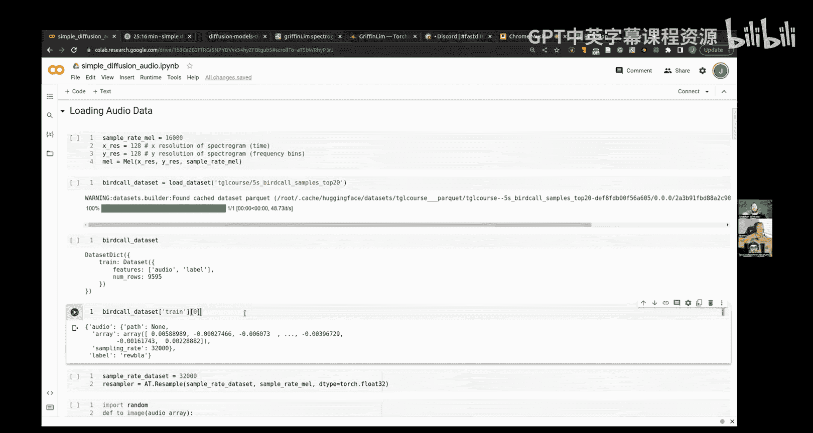

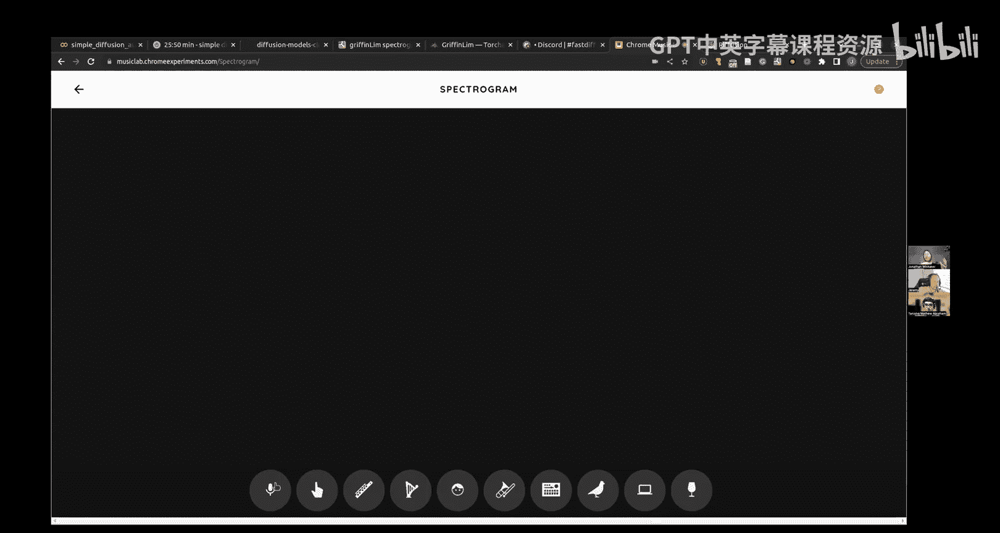

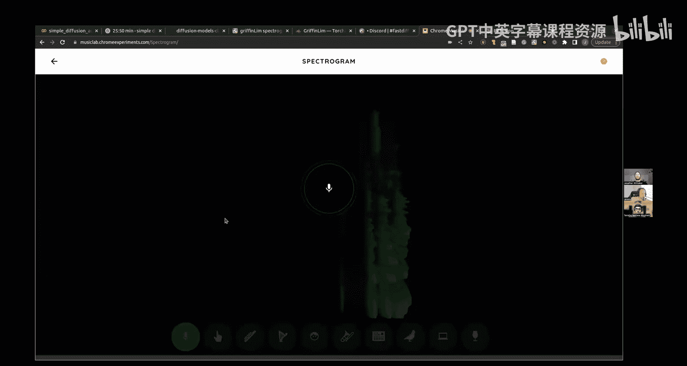

## 概述
在本节课中，我们将学习如何将扩散模型应用于音频生成，并深入探讨变分自编码器（VAE）在稳定扩散模型中的关键作用。我们将从音频的频谱图生成开始，然后构建自己的VAE，最后利用预训练的稳定扩散VAE在潜在空间中进行高效的图像生成。

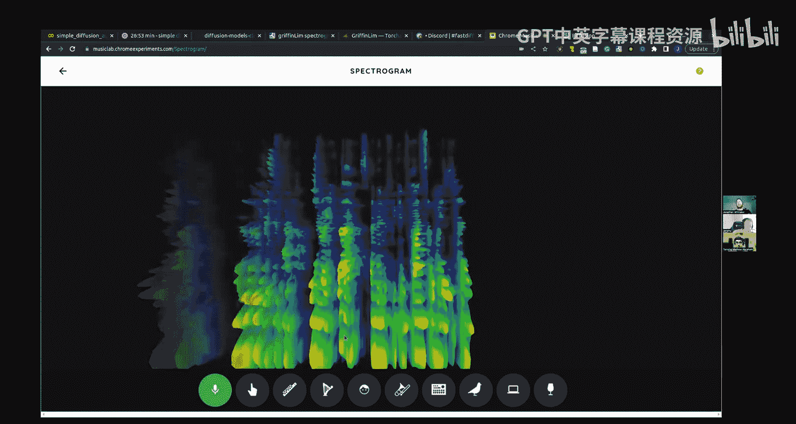

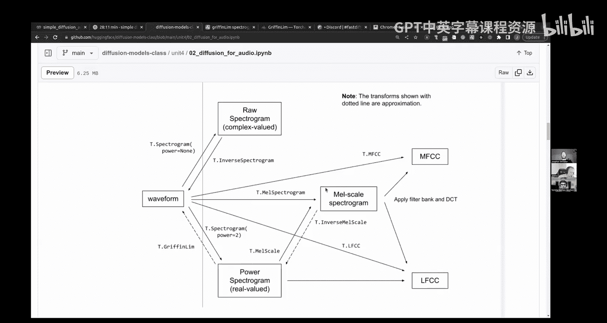

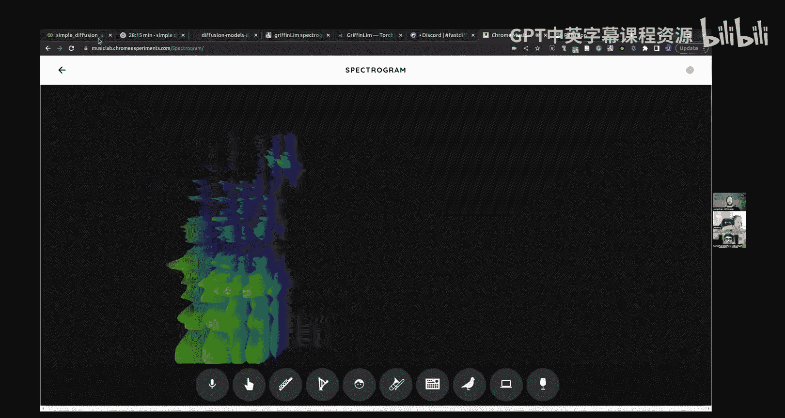

---

## 🎵 音频的像素级扩散

上一节我们介绍了基于像素的图像扩散模型。本节中，我们来看看如何将同样的技术应用于音频生成。

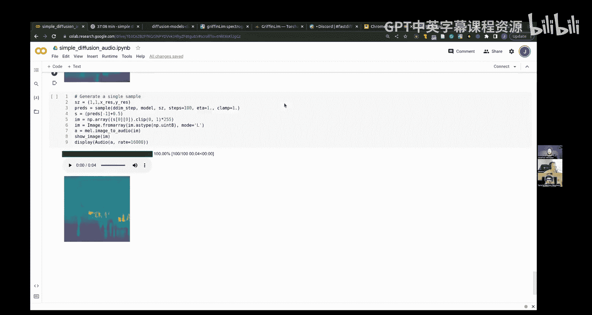

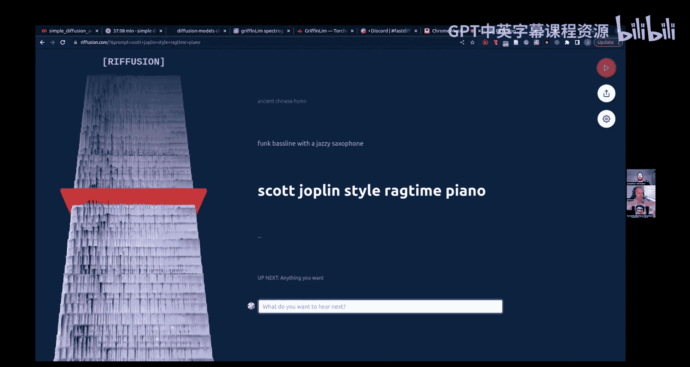

核心思路是将音频信号转换为一种类似图像的表示形式——频谱图，然后对频谱图进行扩散建模。

以下是实现音频扩散的关键步骤：

1.  **数据准备**：我们使用一个鸟鸣声数据集。原始音频是波形数据，采样率为每秒32000个点。直接对如此长的一维序列建模非常困难。
2.  **转换为频谱图**：我们使用梅尔频谱图将音频从时域转换到频域。梅尔频谱图将频率映射到符合人耳听觉感知的梅尔刻度，并聚焦于人耳可听的频率范围。
    *   **公式**：`梅尔频谱图 = 梅尔滤波器组 * 短时傅里叶变换(音频波形)`
3.  **构建扩散模型**：我们将128x128的灰度频谱图视为“图像”，使用与之前图像生成完全相同的简单扩散模型架构进行训练。
4.  **采样与重建**：模型生成频谱图后，使用Griffin-Lim算法等相位重建方法将频谱图转换回音频波形。这是一个有损的近似过程。

通过这种方法，我们成功生成了听起来像鸟鸣的音频样本。这项技术也可应用于音乐生成等领域。

---

## 🔍 构建变分自编码器（VAE）

在进入稳定扩散的潜在空间之前，我们需要理解VAE的工作原理。VAE是稳定扩散模型的关键组件，用于将高维图像压缩到低维潜在空间。

### 自编码器（AE）回顾
首先，我们构建一个简单的自编码器作为基线。它由编码器和解码器组成：
*   **编码器**：将784维（28x28）的扁平化图像压缩到200维的潜在向量。
*   **解码器**：将200维潜在向量重建回784维的图像。

我们使用均方误差（MSE）损失进行训练。虽然它能重建训练图像，但当我们向解码器输入随机噪声时，它无法生成有意义的图像。这是因为潜在空间没有良好的结构。

### 从AE到VAE
VAE通过引入随机性来改善潜在空间的结构。以下是VAE的核心改进：

1.  **编码器输出两个向量**：编码器不再输出单一的潜在向量 `z`，而是输出两个向量：
    *   `mu` (μ)：潜在分布的均值。
    *   `log_var` (log σ²)：潜在分布方差的对数。
2.  **重参数化技巧**：我们从标准正态分布中采样噪声 `ε`，然后利用 `mu` 和 `log_var` 构造潜在变量 `z`。
    *   **公式**：`z = mu + exp(log_var / 2) * ε`，其中 `ε ~ N(0, I)`
3.  **组合损失函数**：VAE的损失函数由两部分组成：
    *   **重建损失**：衡量解码器输出与原始图像的差异（如二元交叉熵损失）。
    *   **KL散度损失**：鼓励潜在分布 `q(z|x)` 接近标准正态分布 `N(0, I)`。这正则化了潜在空间。
        *   **公式**：`KL损失 ≈ -0.5 * sum(1 + log_var - mu^2 - exp(log_var))`

通过同时优化这两项损失，VAE学会了生成一个结构良好的潜在空间。在这个空间中，不仅编码点能重建原图，其周围的点也能解码出合理的图像。这使得从潜在空间采样随机点并解码成为可能，从而实现了图像生成功能。

我们用一个简单的VAE在Fashion-MNIST数据集上进行了实验。虽然其重建质量不如AE，但它能从随机噪声中生成可识别的服装图像轮廓。

---

## 🚀 使用稳定扩散VAE进行潜在空间扩散

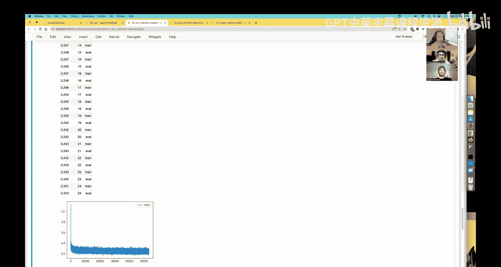

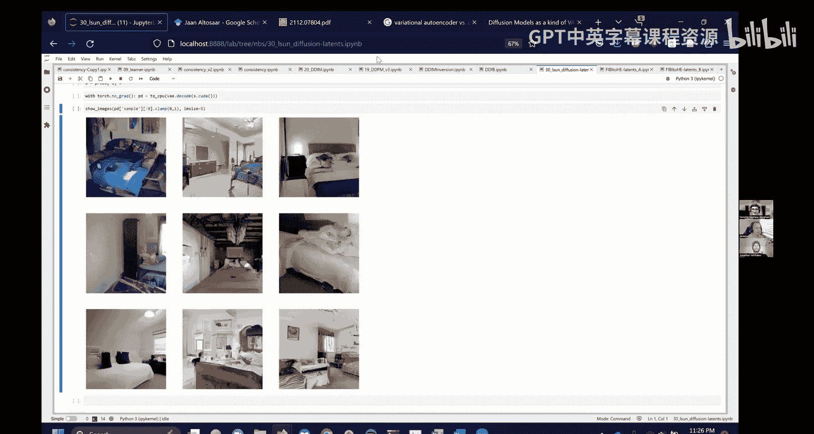

现在，我们将利用预训练的稳定扩散VAE的强大能力，在潜在空间中训练扩散模型，以生成更复杂、更高分辨率的图像。

### 潜在空间的优势
稳定扩散VAE将256x256x3的图像压缩为32x32x4的潜在表示。这带来了巨大优势：
*   **计算效率**：数据量减少了约48倍，极大降低了后续扩散模型训练和推理的内存与计算需求。
*   **利用先验知识**：该VAE在大量自然图像上训练，学会了高质量的压缩和重建能力，我们可以直接受益于此。

### 实现步骤
以下是我们在LSUN卧室数据集上进行潜在空间扩散的步骤：

1.  **数据编码**：使用稳定扩散VAE的编码器，将整个数据集的图像批量转换为潜在表示。
2.  **高效存储**：使用内存映射的NumPy数组存储所有潜在向量。这种方式可以处理远超内存大小的数据集，数据会缓存在磁盘上，访问时自动加载所需部分。
    *   **代码示例**：
        ```python
        latents = np.memmap(‘latents.dat’, dtype=’float32’, mode=’w+’, shape=(n_images, 4, 32, 32))
        ```
3.  **训练扩散模型**：将潜在向量视为新的“像素”数据。我们使用与之前相同的UNet架构和DDPM训练流程，但输入和输出通道数改为4（潜在空间的通道数）。
4.  **采样与解码**：扩散模型在潜在空间中生成样本后，使用VAE的解码器将其转换回像素空间，得到最终的256x256彩色图像。

### 结果与扩展
经过几个小时的训练，我们成功生成了具有卧室场景特征的图像。虽然部分结果存在瑕疵，但这证明了潜在空间扩散的可行性。

为了进一步提升效果，我们可以尝试：
*   **使用预训练的潜在空间分类器作为骨干网络**：我们展示了在ImageNet潜在向量上训练分类器的可行性，并达到了约66%的准确率。这可以作为扩散模型UNet的预训练骨干，可能提升生成质量。
*   **尝试其他改进**：如使用残差连接、感知损失等我们在超分辨率任务中验证有效的技巧。

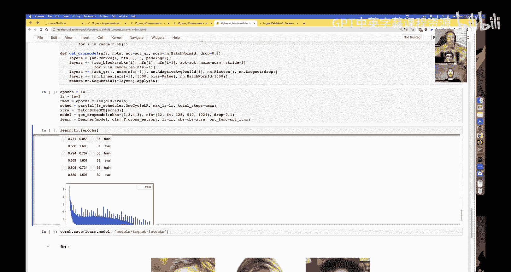

---

## 总结
本节课中我们一起学习了扩散模型在音频生成中的应用，深入探讨了变分自编码器（VAE）的原理与实现，并实践了利用稳定扩散VAE在潜在空间中进行高效图像生成的全流程。

关键收获在于理解VAE如何通过结构化的潜在空间连接压缩与生成，以及如何利用预训练模型的能力来处理更大规模、更复杂的生成任务。你现在已经掌握了从零开始理解和构建稳定扩散核心组件的重要基础。