# 1：一小时构建LLM应用 🚀

在本节课中，我们将学习如何在一小时内快速构建并部署一个大型语言模型应用。我们将从原型设计开始，逐步迭代，最终将其部署为一个可供用户交互的实际应用。

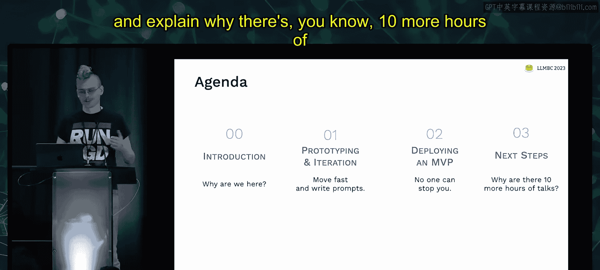

## 为什么现在是AI的好时机？🤔

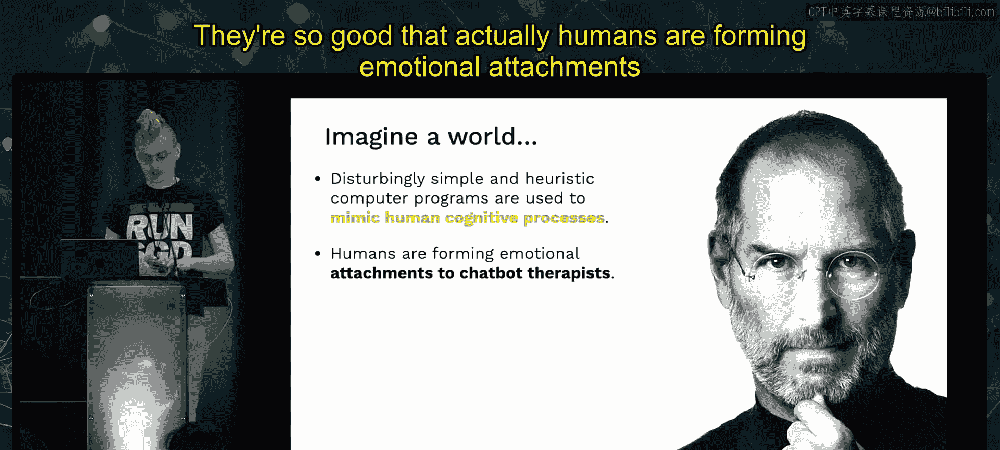

上一节我们介绍了课程的目标。本节中，我们来看看为什么当前是投身人工智能领域的绝佳时机。

想象一个世界，其中存在极其简单且启发式的计算机程序，能够模仿人类的认知过程。它们如此出色，以至于人类甚至会对聊天机器人治疗师产生情感依恋。计算机可以下棋、撰写数学证明，甚至能通过学校的考试。令人惊叹的是，你甚至可以从人工智能那里获得投资建议。

你无需成为有远见的联合创始人就能想象这个世界，因为它在1965年就发生了。这是赫伯特·西蒙和艾伦·纽厄尔在论文《启发式问题解决》中对当时人工智能领域的描述。它指出，当时的人工智能已经达到了与人类相当的水平，可以下棋、证明定理、通过学校考试，并模拟投资基金经理的行为。

问题在于，这显然没有真正实现。我们并没有拥有60年的人工智能。那么，这次有什么不同？最清晰的答案是，现在有一个工具可以完成所有这些事情，而不是一堆针对每个特定任务的专门工具。现在，你只需使用一个单一的工具，并进行少量配置，就能让它处理新任务。这更类似于我们让人类为我们解决问题的方式，而不是机器学习模型或老式专家系统模型解决问题的方式。

## 什么是语言模型？🧠

上一节我们探讨了当前AI浪潮的独特性。本节中，我们来深入了解实现这一切的核心工具：语言模型。

语言模型是对语言进行建模的工具。实现这种能力需要一个看似简单却至关重要的技巧。其形式如下：如果一个段落逐词出现，你想要猜测下一个词是什么，这需要相当高的智能。特别是如果你能预测比闲聊更复杂的事情，比如在与人交谈时，你可能会提到一个数学方程，或者谈论Python。

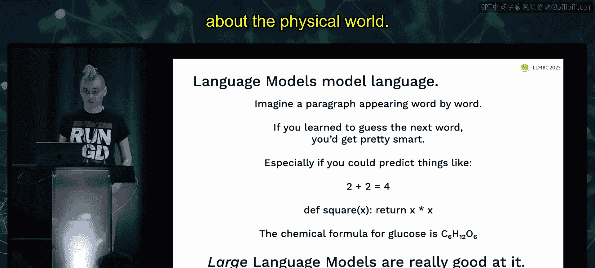

尤其是在书面文档中，包含了许多这类更复杂的内容。当这些词出现在屏幕上时，在某些地方，你能够以需要Python知识、科学和物理世界知识、数学知识的方式猜测下一个词是什么。

大型语言模型非常擅长猜测下一个词是什么。为了精通这项任务，它们也精通了所有其他事情，比如数字相加、编写Python代码或学习物理世界的知识。

## 语言用户界面与历史教训 📜

上一节我们了解了语言模型的核心原理。本节中，我们来看看它解锁的关键应用形式，并回顾历史以避免重蹈覆辙。

我认为，这条通往人工智能的特定路径所解锁的关键部分，也是我们在此训练营中兴奋地讨论和分享的，就是**语言用户界面**。语言用户界面是一种自计算机诞生之初就被设想的人机交互方式。在图形用户界面和终端用户界面出现之前，人们认为与计算机交互的理想方式可能是像与人交谈一样，使用自然语言。

因此，早期就有尝试实现这一目标的工作。例如，20世纪60年代由魏岑鲍姆开发的著名聊天机器人治疗师Eliza。那只是一个纯粹的语言界面。但人们很快意识到，如果你有一个语言界面，至少能将自然语言的概念输入计算机，你还可以让这种语言影响非语言的事物。例如，一个由简单物体组成的“积木世界”，这是特里·威诺格拉德在1970年的SHRDLU程序中实现的。

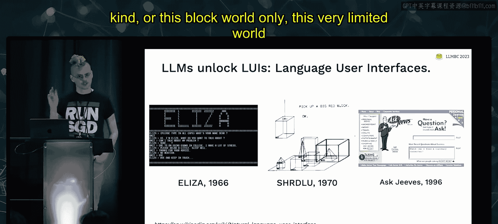

这种语言用户界面的总体构想，迄今为止我们最接近的实现可能是搜索引擎。你可以输入一些内容，虽然可能更像“谷歌式”的查询而非纯自然语言，但相比与Python程序交互，你与搜索引擎的交互要自然得多。最早的流行搜索引擎之一Ask Jeeves就将自己定位为互联网的自然语言界面。

借助大型语言模型，我们可以构建更灵活、更强大的语言用户界面，其处理和响应语言的方式更接近人类的期望，而不是那些更脆弱、更专注于特定领域（如仅限心理治疗或仅限积木世界）的旧系统。

此外，我认为当前存在一股巨大的炒作浪潮，这引发了许多人对语言模型和人工智能的警惕，尤其是那些经历过过去浪潮的人。因此，我只想传达一个观点：这是人们以前就期待的事情。如果我们实现了语言建模，我们认为这可能会发生。

这是一篇20世纪90年代的论文，讨论了“AI完全”问题——即如果解决了哪些问题，我们会认为自己已经实现了智能。这是一个有些模糊的概念，类似于计算机科学中的“NP完全”问题，但数学严谨性稍逊。它代表了该领域对于解决此问题所需条件的普遍看法。列表中的第一个就是**自然语言理解**——能够深入理解自然语言。

这种结合——真正优秀的用户界面、一种新型用户界面，以及自然语言理解领域这一长期目标——正是我们随着大型语言模型的发布和开放可用性而获得巨大能力解锁的原因。

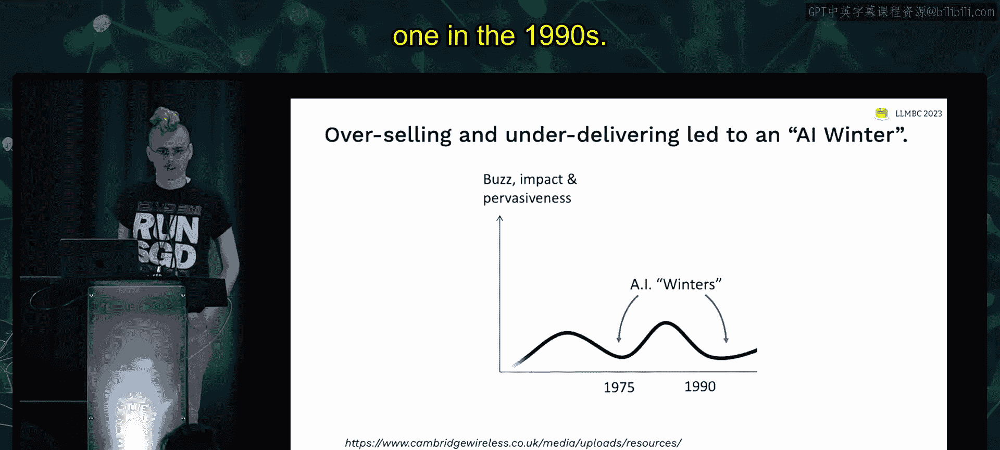

但是，这次情况确实有本质上的不同，这给了我们希望。然而，回顾并审视1966年发生了什么、为什么我们没有实现人工智能也同样重要。我确信当时也有人同样兴奋地分享他们的模型是如何工作的。

## 避免“AI寒冬”❄️

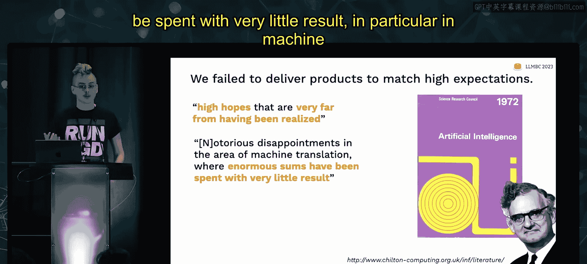

上一节我们提到了历史教训。本节中，我们来具体看看如何避免重蹈“AI寒冬”的覆辙。

当时发生的主要事情是，作为一个领域，我们某种程度上“过度承诺，交付不足”，这导致了被称为“AI寒冬”的现象。在这个时期，人们对这类项目的兴趣减弱，资金也更难获得。一个显著的寒冬就发生在20世纪60年代那波浪潮之后，然后在20世纪90年代又出现了一个较小的寒冬。

回顾当时的一些细节，了解其发展过程，对于理解我们这次如何避免这种情况至关重要。那个时期的关键文件之一是理查德·莱特希尔爵士为英国政府撰写的报告。他是一位数学家，对当时人们进行的人工智能研究产生了兴趣。他调查后认为这完全是无稽之谈，并写下了他的看法，说服了英国政府、英国公众乃至全世界，认为这是一个糟糕的主意。

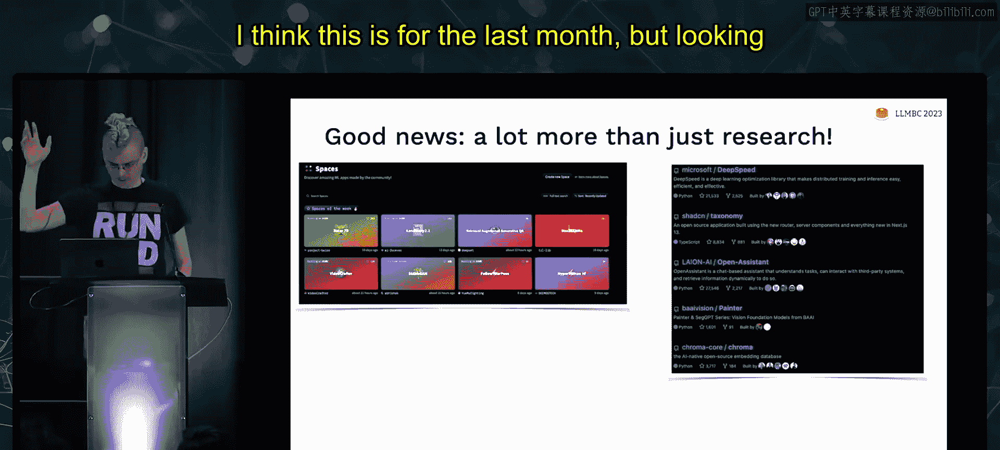

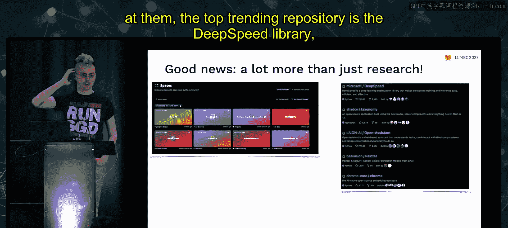

从这份报告中摘取几个关键短语：他谈到了“远未实现的过高期望”，这导致“巨额资金被花费，却收效甚微”，特别是在机器翻译领域。他还特别指出，这些钱被花在了这些问题上，却没有转化为具有商业价值的东西。报告还有单独关于研究应用的部分，但很多内容都集中在这些程序“通用性不足，无法实现商业可行性”这一事实上，这意味着这是公共研究资金的糟糕投资。

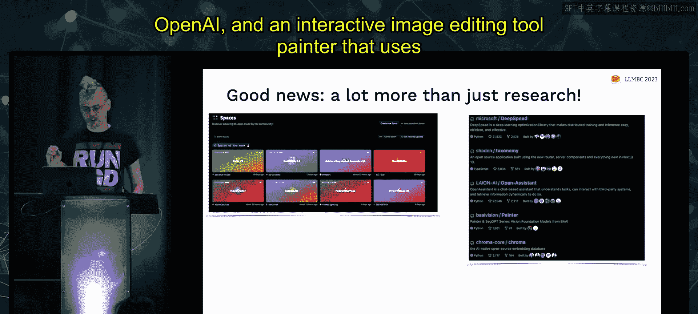

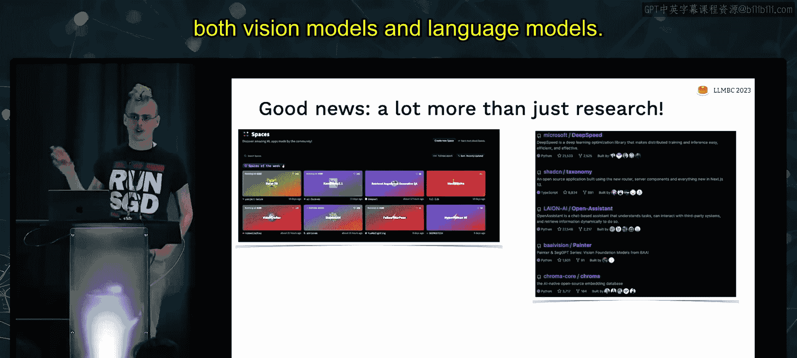

因此，为了避免在21世纪20年代再次出现AI寒冬，我们需要构建人们真正重视的实际产品。我们需要构建软件、工具，构建人们真正使用的东西。这样，人们才会继续保持兴趣，继续资助我们的项目，确保我们在研究ChatGPT的同时能够支付房租。

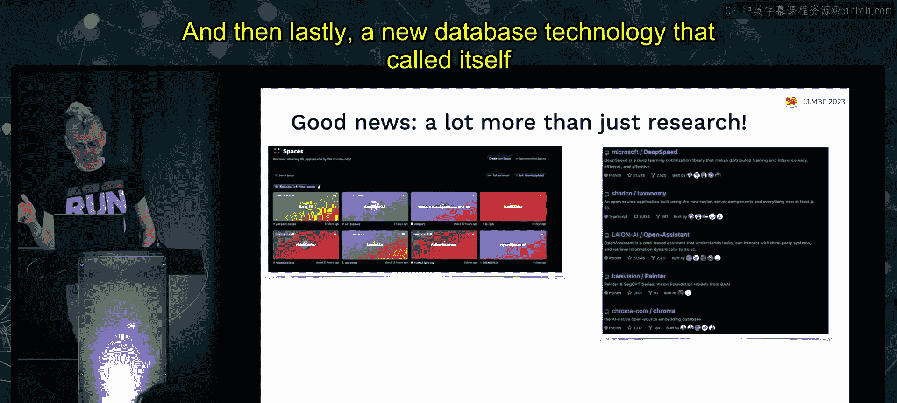

好消息是，这次不仅有研究在发生。我刚刚去查看了GitHub上的热门仓库（可能是过去一个月的）。排名第一的是DeepSpeed库，用于大型模型的快速训练和推理，尤其用于大型语言模型。此外，前五名中还有两个是实际使用这些大型语言模型的应用：LAION的Open Assistant（一个类似于OpenAI的ChatGPT模型的开源复制尝试）和图像编辑工具Paint2Pix（使用了视觉模型和语言模型）。最后，还有一个名为Chroma的新数据库技术，它是AI原生的嵌入向量数据库。

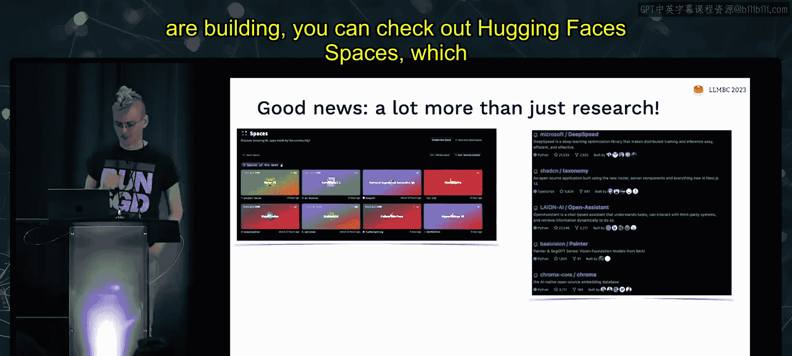

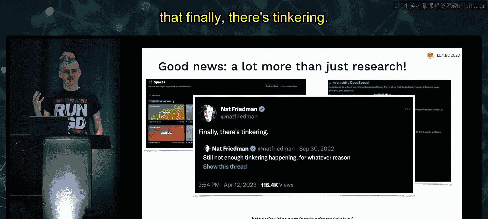

这些都是人们正在构建的实际库。人们围绕它们创建公司，成千上万的人下载和使用它们。如果你想更快地了解人们正在构建的东西，可以查看Hugging Face的Spaces，那里经常展示很酷的演示。

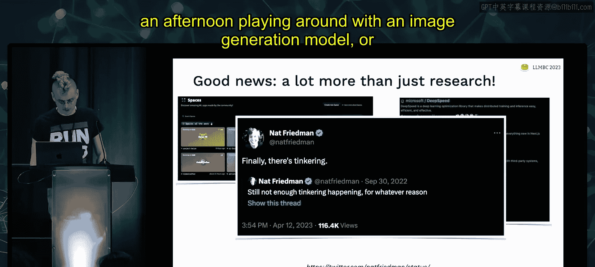

我认为纳特·弗里德曼说得最好，他说“终于有人在动手捣鼓了”。终于，人们实际上在用这些模型组装东西，做出这些有用的小玩具或简单的演示，或者一些适合发推特线程、花一个下午玩玩图像生成模型之类的东西。

## 从演示到产品的鸿沟 🌉

上一节我们看到了当前生态的繁荣。本节中，我们来正视一个关键挑战：从演示到产品的巨大鸿沟。

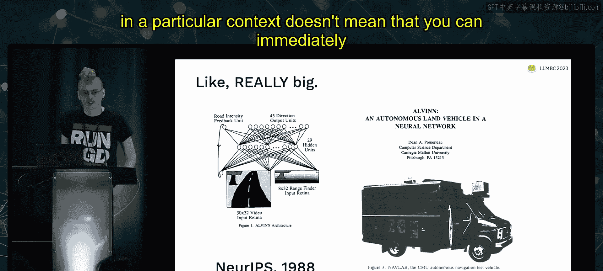

但坏消息是，从那种你可以快速组装并在某些情况下使用的演示，到成为一个真正的产品，这之间的差距非常大。即使你以产品为导向进行构建（例如，你不仅仅是一个研究者），情况也是如此。

我记得在21世纪10年代中期，当人们基于高质量的图像神经网络对自动驾驶汽车感到兴奋时，有大量自动驾驶汽车的演示，比如英伟达在2017年的这个演示。现在是2023年，我们仍然没有随时可用的自动驾驶汽车。也许有少数方式可以在非常有限的环境中使用它们，但它们仍然更接近演示而非产品。

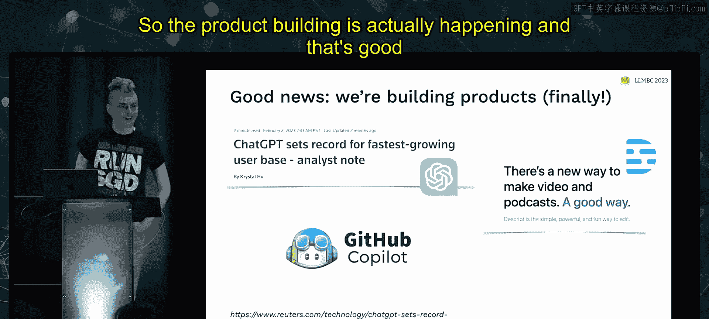

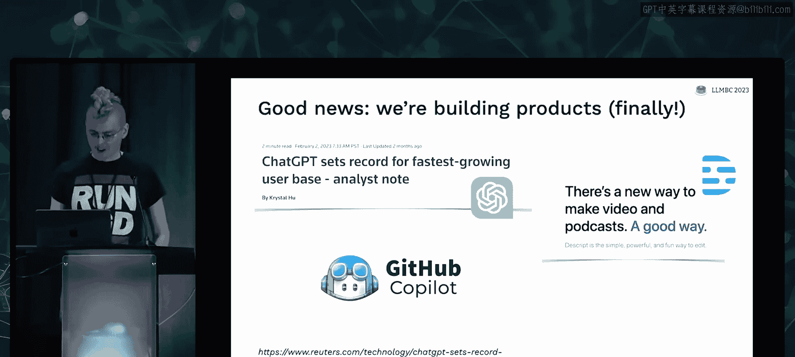

这个鸿沟可能真的非常大。第一个使用神经网络运行自动驾驶汽车的演示可以追溯到1988年卡内基梅隆大学的ALVINN（自动驾驶陆地车辆神经网络）。仅仅因为你做出了能在特定环境下工作或在特定情境下令人印象深刻的东西，并不意味着你可以立即将其产品化。

## 产品化正在发生 🚀

上一节我们讨论了产品化的挑战。本节中，我们来看看积极的一面：产品构建确实正在发生。

它已经开始发生，这个领域正在开始创造和发布产品。可能最著名的是OpenAI的ChatGPT，它直接产品化了语言建模。根据一些分析师的报告，它创下了用户增长最快的记录，可能是达到100万用户最快的，也可能是达到1亿用户最快的，比Instagram和TikTok还快。这是一个好迹象。

用于编码的工具，如GitHub Copilot、Replit Ghostwriter，也由这些大型语言模型驱动，并且很受欢迎。还有我们在全栈深度学习课程中用来构建内容的工具，比如用于编辑视频和播客的Descript。

产品构建确实正在发生，这对于避免AI寒冬是好事。这也意味着，关于如何实际构建这些东西，正在出现一种“剧本”或模式。你不必完全自己开辟道路。而这正是我们将在接下来两天里要涵盖的内容。

在本课程中，我们将讨论构建像ChatGPT或Copilot这类应用所需的许多要素。而在这个快速入门部分，我们将快速拼凑出一个这样的演示。

## 快速原型设计：第一个半小时 ⏱️

上一节我们概述了课程内容。现在，让我们深入探讨快速构建演示应用的过程。

在过去的几个月里，湾区和其他地方举办了许多围绕使用这些工具快速构建产品演示的黑客松。我参加了其中一些，观察了其他人的做法，自己也构建了一些东西。我想分享一下这个过程是怎样的。

前半小时充满了打字和迭代，这是一个探索可能性的过程。这里的要点是，与其花大量时间深入思考机器学习是否可能解决某个问题，你可以直接用一些高能力的模型（如OpenAI的模型）在你的应用场景中尝试。首先在一个简单的聊天界面中试用，看看什么可行，什么不可行。你常常会对在简单上下文中持续有效的东西感到惊讶。当然，这不是你最终要部署的东西，但你至少可以弄清楚这是否可行，并了解你将必须解决的核心问题是什么。

然后，你可以跳入一个能以编程方式进行快速试验的环境。我们将通过跳入一个快速的Notebook环境来实现这一点，这是我进行这种快速试验的首选环境。然后，弄清楚如何将我在聊天界面中做的一些事情变得更程序化。现在有很多开源的框架和工具涌现，使得这变得很容易。

## 实践：从聊天界面开始 💬

上一节我们介绍了快速原型设计的理念。本节中，我们通过一个具体问题来实践。

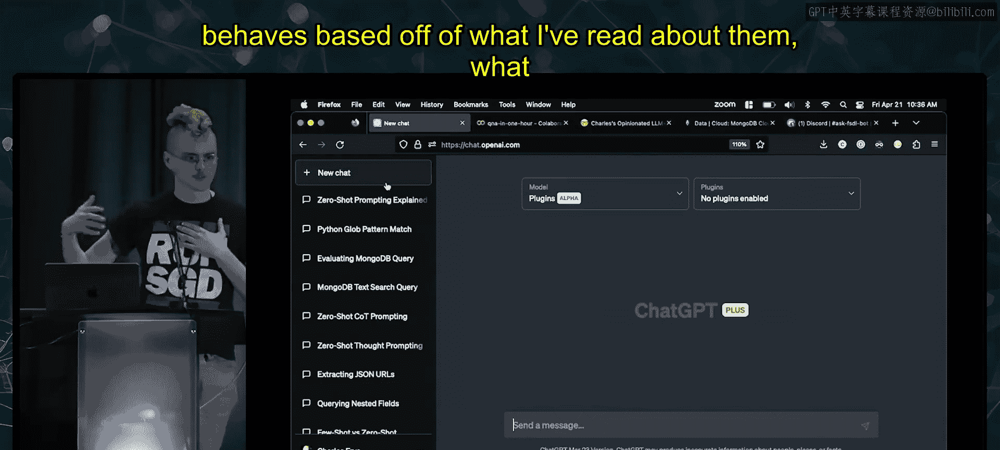

当我想弄清楚是否能用大型语言模型构建某样东西时，我做的第一件事就是进入某个方便的交互界面。对于ChatGPT来说，这非常合适。所以我通常从这里开始。

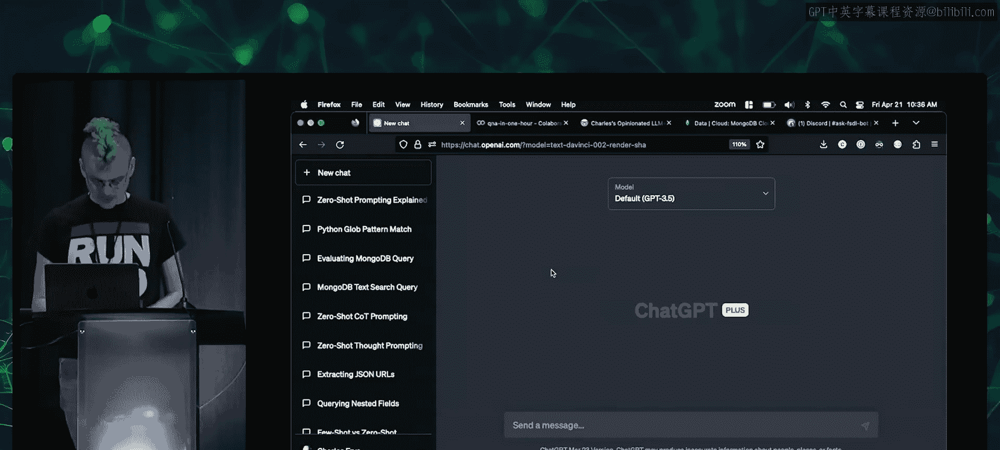

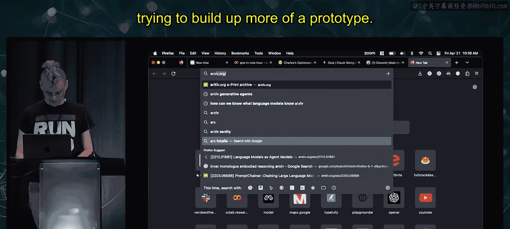

我认为从一个具体的问题陈述开始会很有帮助。我遇到的问题是我想要尽可能多地了解大型语言模型。因此，我希望能够使用大型语言模型来帮助我学习大型语言模型。我相信我联系的许多其他人也有同样的问题，所以我也想帮助他们。

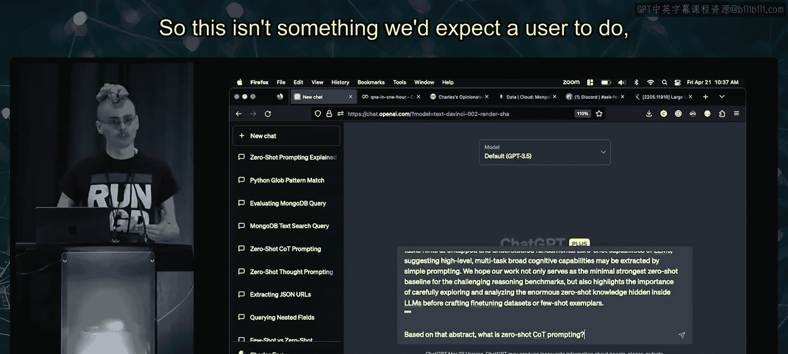

首先，我认为可以先向ChatGPT询问关于语言模型的问题。从一个你已经知道正确答案的事情开始是个好主意，因为在这里的初始阶段，你最终会在脑海中模拟最终应用的许多组件。你必须假装成用户，思考你将如何编程这个东西，可能还需要介入做一些你最终会让语言模型自动化的事情。这里有很多环节，你需要确保以正确的方式将它们组合起来并获得良好的结果。所以，从你已经知道的事情开始。

我选择了一个我已经了解的关于语言模型的知识点：什么是零样本思维链提示？我从ChatGPT得到的答案并不太好：“零样本思维链提示是一种NLP技术，用于生成对提示的响应，而无需对该提示进行明确训练。”它抓住了“零样本”的一些成分，但没有抓住“思维链”。它举了个例子：“法国的首都是什么？语言模型可以通过识别关联生成‘巴黎’。”这不太正确，它遗漏了大量额外信息。

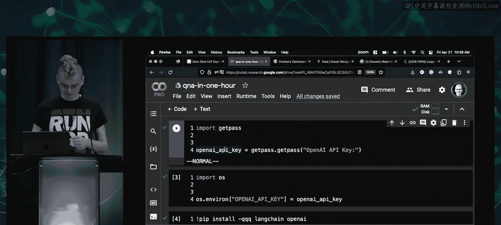

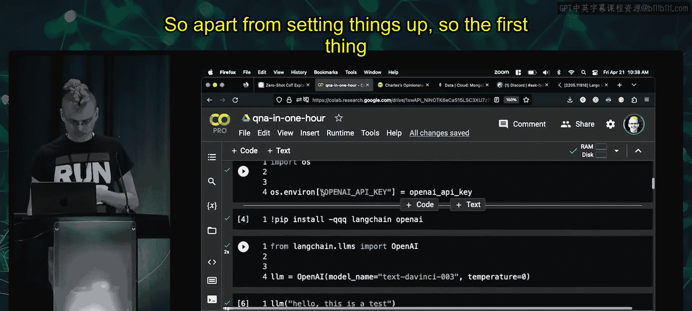

这里缺失的部分是，这些语言模型是基于截至某个时间点（对于某些模型大约是2021年）的数据构建的。而语言模型中发生的许多有趣事情都发生在它们的训练数据截止日期之后。所以这行不通。

另一个问题是，我真的很想能够跟进这些信息。我想发现新的资源，而不仅仅是依赖语言模型。总的来说，这些模型的输出中包含了许多不存在的东西。例如，之前当我问在哪里可以阅读更多相关信息时，它建议了一篇确实存在的论文，但也建议了一堆不存在的文章，比如“如何在Towards Data Science上构建OpenAI的GPT-3：分步指南”。这听起来像是可能存在的东西，但据我所知并不存在。即使存在，我可能也不想读。

所以，我们这里遇到了一个问题：语言模型不知道来源在哪里，并且它们没有某些信息。因此，如果我们希望它成为学习语言模型的好解决方案，我们需要将这些信息提供给它们。

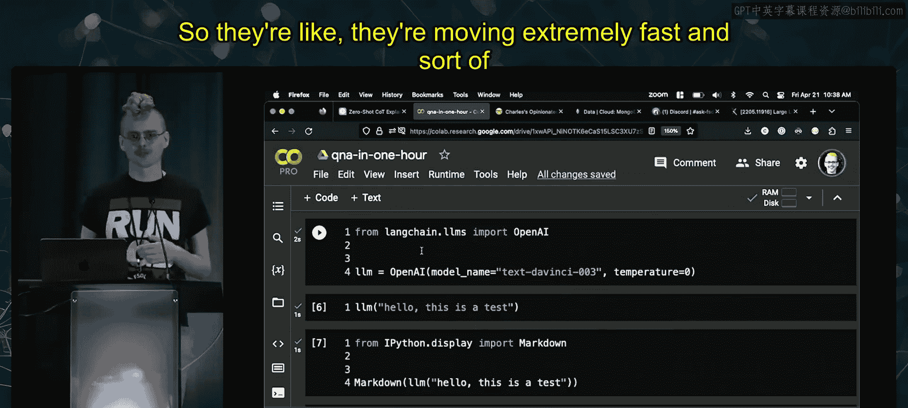

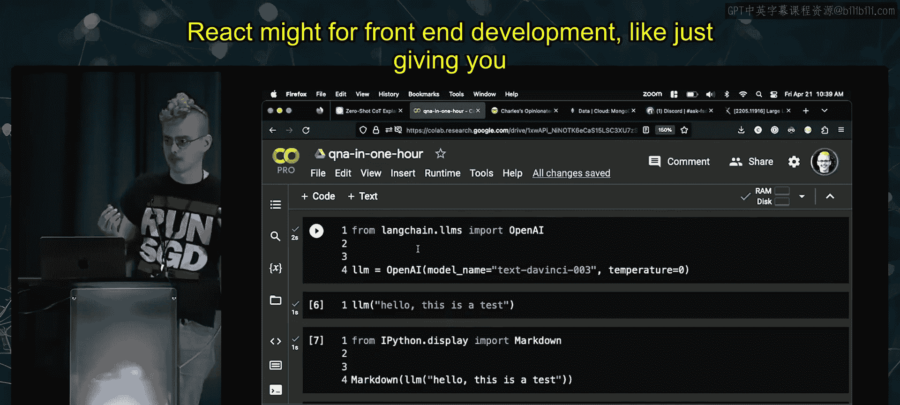

## 验证假设与引入外部知识 🔍

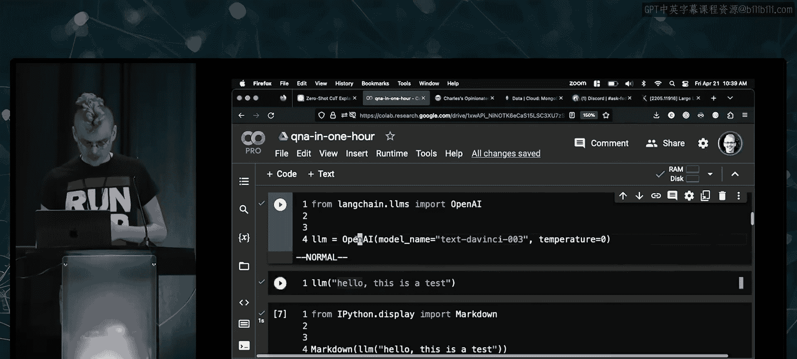

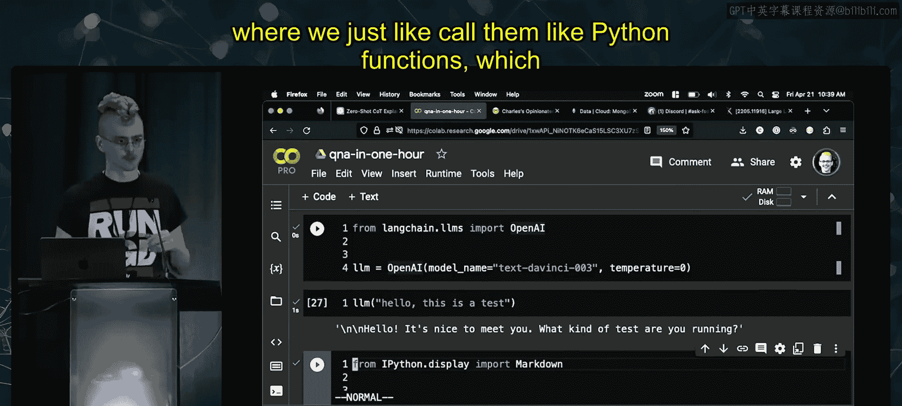

上一节我们遇到了模型知识陈旧和幻觉的问题。本节中，我们通过手动引入外部知识来验证解决方案的可行性。

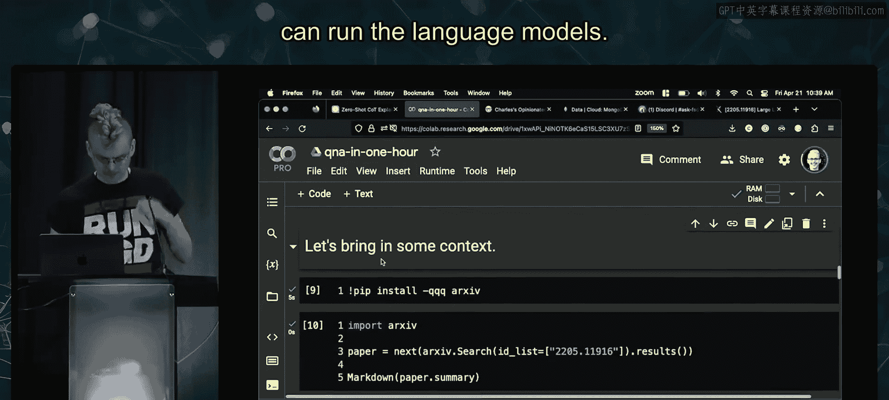

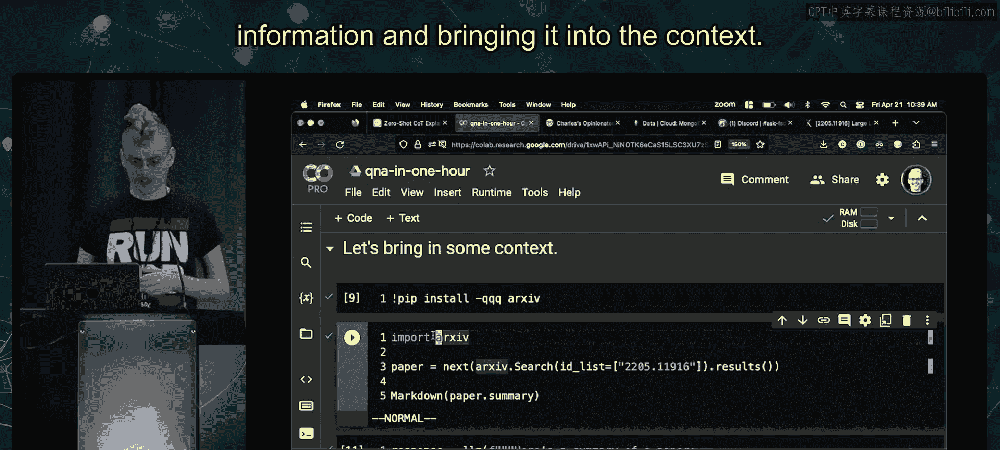

在这个聊天界面中，我实际上可能会验证我的假设。我基于我所读到的关于语言模型的内容、我从其他在线资源学到的东西，正在形成一个关于它成功或失败原因的假设。但在继续构建更多原型之前，我应该先验证这个假设。

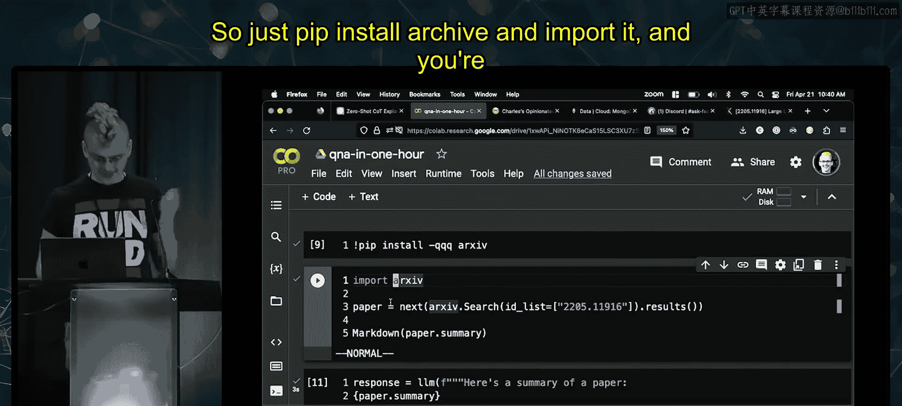

我的假设是，如果它拥有正确的论文内容，那么它就会给出正确的答案。让我快速在arXiv上查找我想到的那篇论文，抓取它的摘要，然后放进去。这是摘要。把它放进去。

基于这个摘要，什么是零样本思维链？这不是我们期望用户会做的事情，这将在我们的应用程序中自动发生，但我们在这个早期阶段只是模拟它。

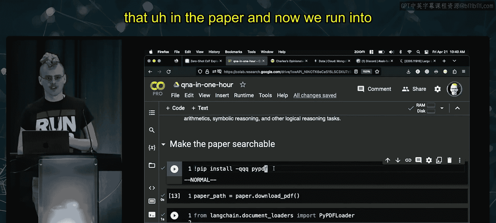

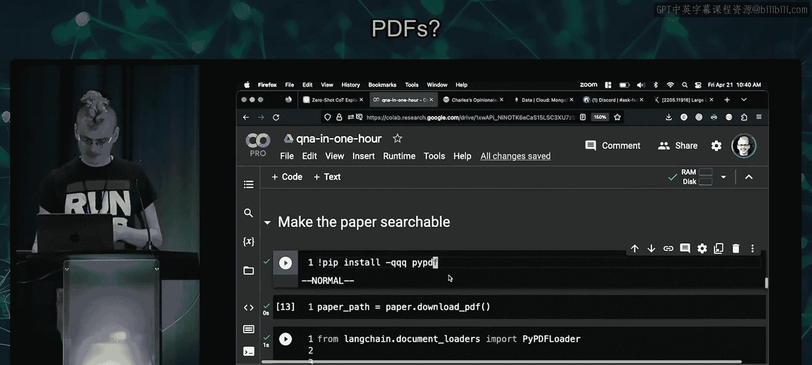

现在模型得到了正确答案：“零样本思维链提示是一种无需任何手工制作的少样本示例即可执行复杂多步推理的技术，只需在每个答案前添加‘让我们逐步思考’这句话即可。”

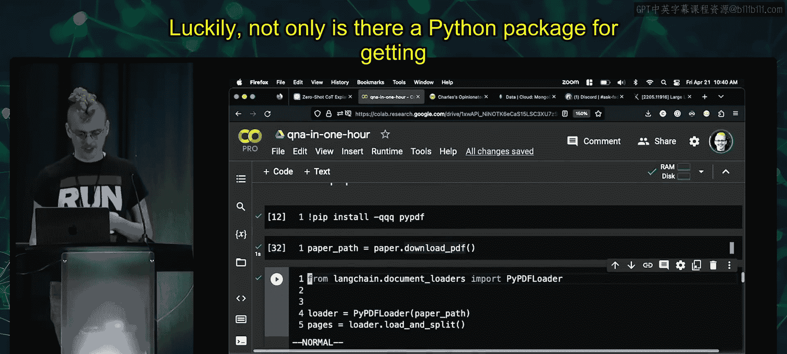

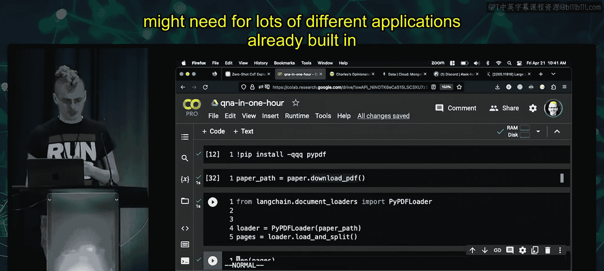

所以，如果我们能从某个地方获取我们的资料，并将其放入语言模型的提示中，然后向语言模型提问，那么我们很可能得到像样的答案。

## 转向编程环境：使用Notebook 🖥️

上一节我们在聊天界面验证了核心想法。本节中，我们转向编程环境，开始自动化这些步骤。

在尝试了类似这样的东西并进行了一些来回交互之后，也许我会跳转到像CoLab这样的临时Notebook环境，尝试看看如果我真的开始自动化这些步骤，它会是什么样子。

除了设置环境，第一件事就是：我将如何与语言模型交互？OpenAI提供了一个API，这样你就不必手动输入了。它有一个Python SDK和其他一些SDK，你可以在其上构建你的应用。很多人这样做，因为他们想要那种控制级别。此外，还涌现了许多用于与这些模型交互的开源框架。

其中最流行的可能是LangChain库。根据我的经验，每次我需要用语言模型做新事情时，比如“哦，我可以用Redis做向量存储”，看起来LangChain还没有这个功能，让我快速编码实现一下，然后大约一周后，LangChain就把它作为功能添加进来了。所以他们进展极快，基本上添加了你可能需要的所有东西，扮演着类似于React在前端开发中的角色，为你提供了所有必需的组件，因为你不需要重新发明轮子。

例如，它为我们提供了一个LLM的抽象，我们可以像调用Python函数一样调用它们，这对于不必过多考虑底层细节非常方便。

是的，一个热门的提示：当你在做这种原型设计阶段时，你会遇到的一个问题是，仅仅显示这些文本就非常具有挑战性。我最喜欢的方法之一是在Notebook环境中使用Markdown进行渲染。

好了，现在我们有了一个可以运行语言模型并查看其输出的地方。

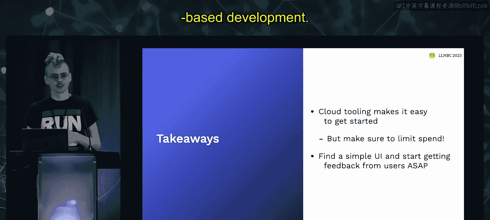

## 获取与处理外部信息 📄

上一节我们设置了编程环境。本节中，我们来处理如何查找信息并将其引入上下文。

现在我们需要进行查找信息并将其引入上下文的过程。此时你可能会想，天哪，我得想办法从arXiv为我抓取信息。我的“白鲸”是花了很长时间试图弄清楚YouTube SDK，但事实证明，几乎总有一个Python库可以完成你需要的抓取工作。所以就像`pip install arxiv`然后导入它，你就准备好了。

也许这就是我们最终应用中的样子，也许不是。但首先快速检查一下：如果我们只是抓取那个摘要并将其输入我们的语言模型，我们是否仍然能得到一个好的答案？看起来很不错。

但答案并不总是在摘要里，可能出现在论文的其他地方。现在我们遇到了一个问题：如何从PDF中获取信息？

幸运的是，不仅有一个用于从PDF中获取信息的Python包，而且它也被内置为LangChain中的一个文档加载器。有很多这样的核心组件，你可能需要为许多不同的应用程序使用它们，并且已经内置了许多不同的选项。所以我只需获取一个简单的PDF。

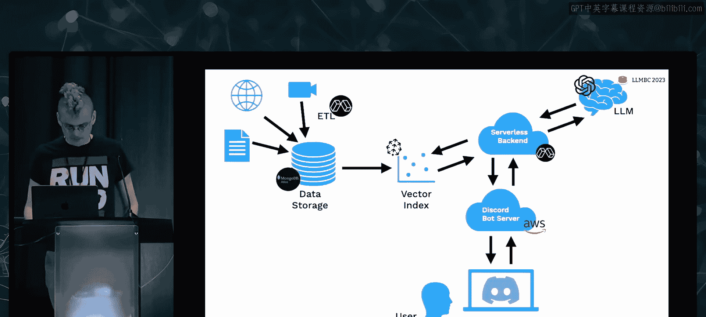

同样，这个问题的信息就在前几页，把它抓取出来，看看我们是否得到正确答案。模型再次回答正确。

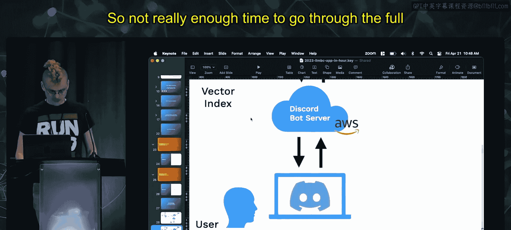

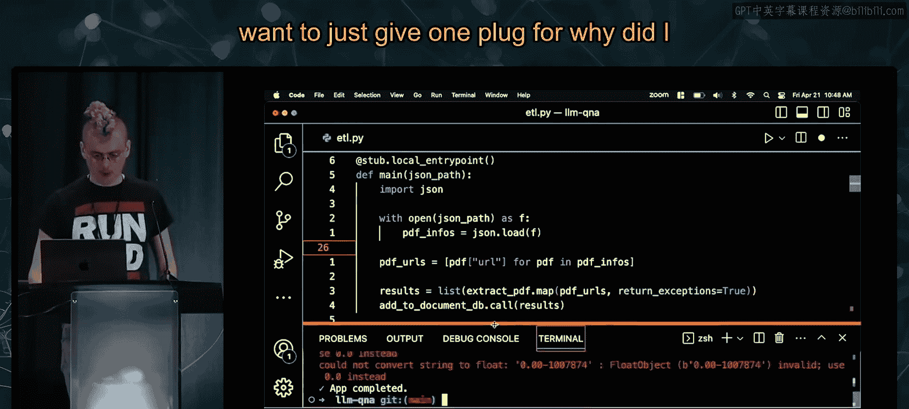

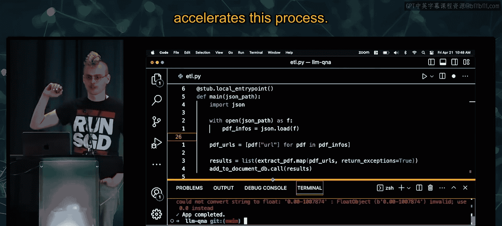

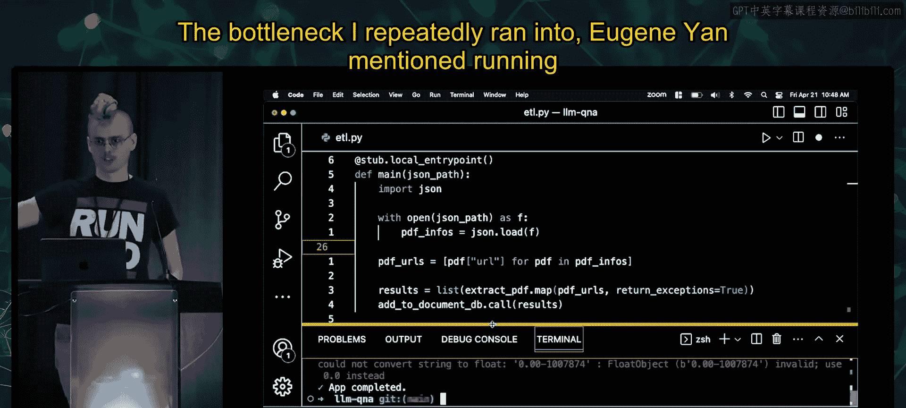

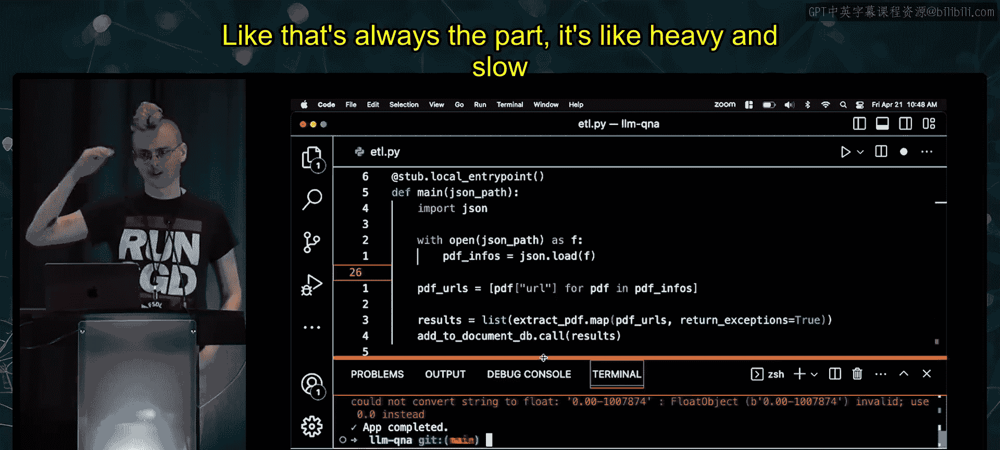

## 规模化搜索：使用嵌入向量 🔎

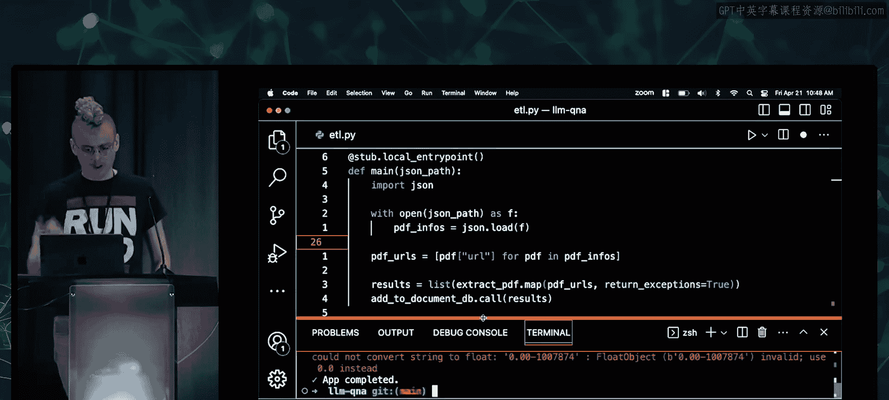

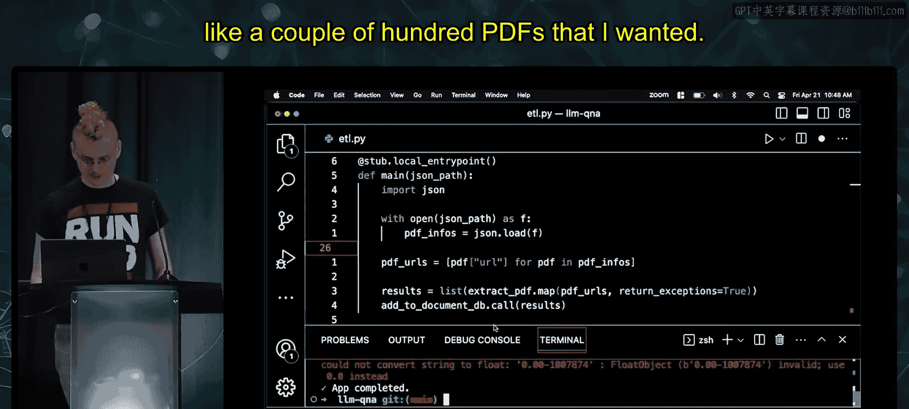

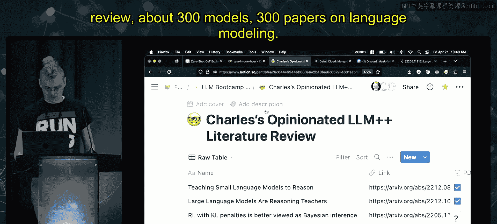

上一节我们处理了单个文档。本节中，我们来看看如何在大规模上解决这个问题。

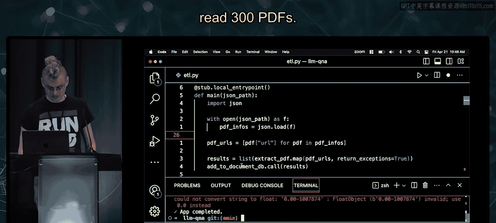

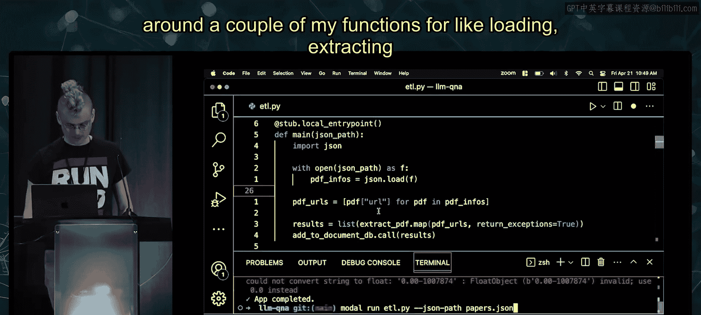

那么最后一部分是：我们如何在更大的规模上解决这个问题？比如，我有很多信息，我想搜索并找到相关的内容。我们将在Josh关于增强语言模型的讲座中详细讨论所有不同的解决方法。但现在，我们只做在LLM社区中变得流行的事情：使用嵌入搜索。

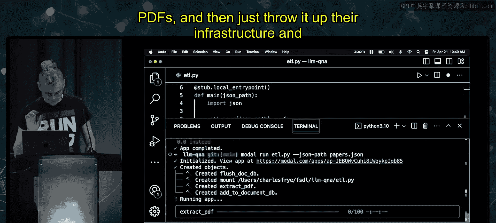

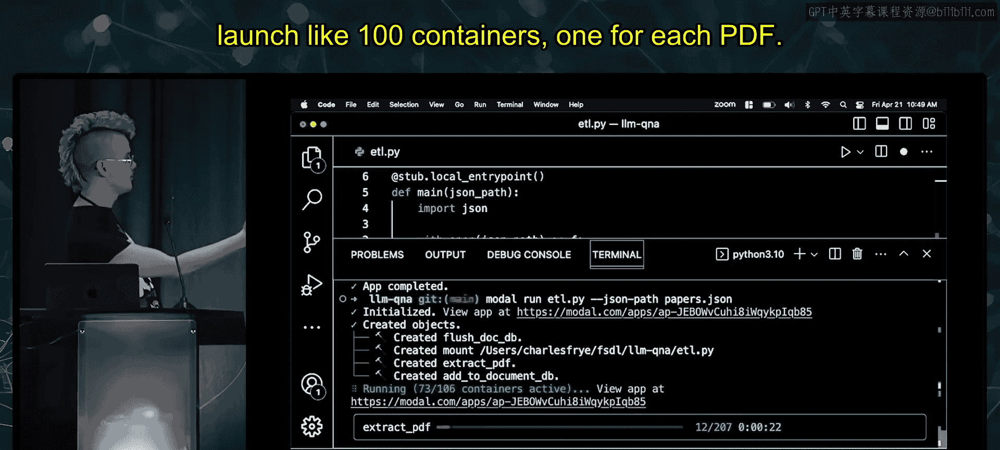

所以将文档转换成向量，然后检查哪些向量的概念与这个问题相似。这是一种启发式方法，就像许多其他启发式方法（如关键词匹配）一样。你绝对可以做得比这更好，但也许这对我们简单的例子会有效。它返回的第一条信息包含了我们的例子。

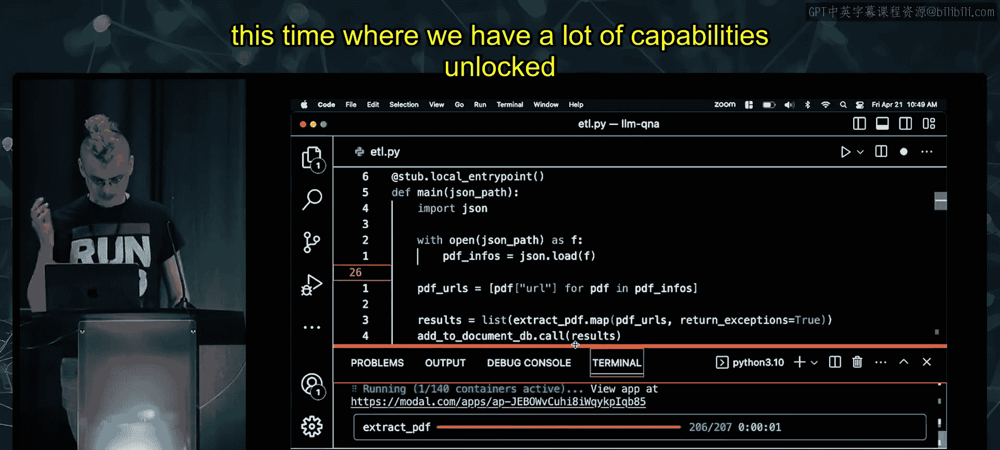

我们可以继续调整提示，比如解决如何将这些东西放进去，如何让语言模型引用其来源等问题。但到了这个时候，一旦我有了核心功能，我就会出去查看Twitter和LangChain，看看还有谁构建了类似的东西。你经常会发现有一些非常好的基础框架可以借鉴。所以我在这里做的这个带来源的问答功能，有点像宠物商店PI或待办事项应用这种入门示例。所以外面有很多可用的选项，我们就用LangChain的默认示例。

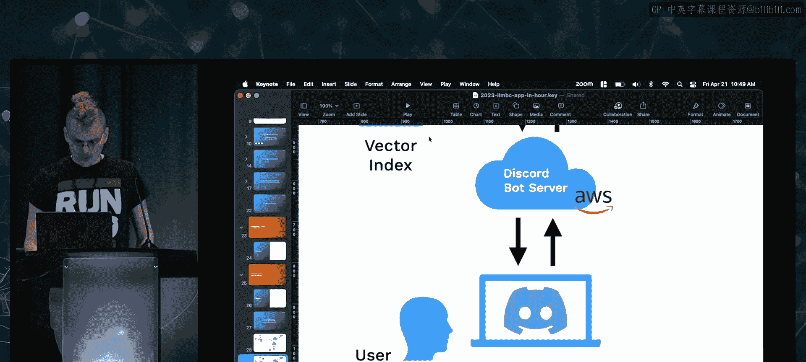


再次，我们得到了一个像Python函数一样可调用的东西，并在底层使用语言模型。现在，我们从语言模型中得到了带有来源引用和答案的输出。


## 从原型到可部署应用 🚢

上一节我们演示了核心功能的可行性。本节中，我们来看看如何将其转化为可供人们实际使用并可扩展的东西。


我们已经在这里证明了可行性。现在只需要把它变成人们实际可以使用并能扩展的东西。所以我认为，首先，是的，让我们跳回去。这就是你的前半小时。再次强调，这种原型设计和试验的能力，直到我开始接触时，才真正成为机器学习工作流程的一部分。以前是：首先你需要非常仔细地定义你的任务，然后收集GB级别的数据，只有那时你才能尝试弄清楚它是否可行。一旦你弄清楚是否可行，你才能尝试围绕它构建用户界面。所以，这是现在最不同的地方，也是新事物解锁的最重要的能力。

好的，那么最后，或者说，一旦我们有了那个基本功能，就是时候组装一个可部署的MVP版本并将其发布了。


构建演示很容易，而构建实际应用困难之处在于弄清楚什么对人们（不仅仅是像你这样的人，可能是广泛的用户群体）真正有用。所以，你的首要任务应该是尽快组装一个用户界面，以便开始从用户那里获得反馈。

另一个主要的解锁点并非来自机器学习世界，而是来自更广泛的软件工程世界：现在由于所有令人惊叹的云原生或基于