# 4：增强语言模型


## 概述

在本节课中，我们将学习如何为大型语言模型提供外部数据和工具，以弥补其知识、时效性和特定领域能力的不足。我们将探讨三种主要方法：检索增强、链式调用和工具使用，使模型能够回答更广泛、更准确的问题。


---

## 为什么需要增强语言模型？🧠

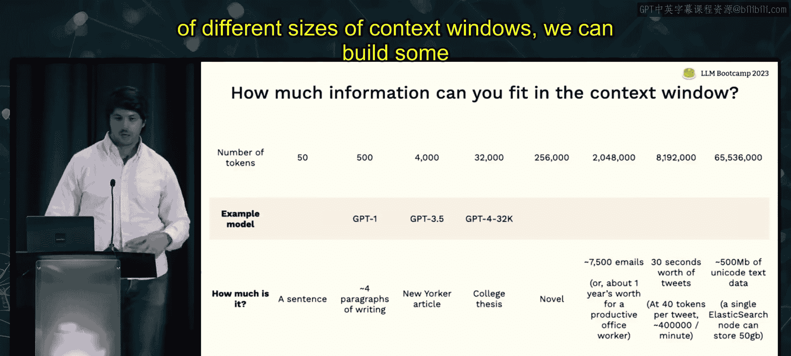

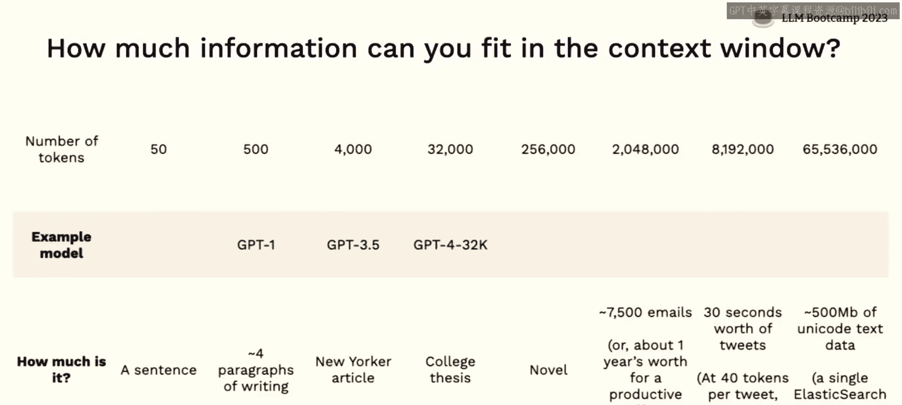

语言模型本身存在许多知识盲区。例如，即使是最先进的GPT-4，也无法直接告诉你“谁是现任美国总统”。语言模型擅长语言理解、遵循指令、基础推理和代码理解，但它们缺乏对世界的实时更新知识、不了解你的特定数据、不擅长复杂数学推理，并且无法自行与世界互动。

因此，我们可以将语言模型视为一个通用的“推理引擎”，它本身并非为存储特定知识而设计。我们需要为它提供工具和数据，就像给一个聪明但知识有限的高中生提供计算器和参考资料一样，使其能够完成实际任务。

最基础的增强方法是将更多数据直接放入模型的上下文窗口中。这就像允许学生在考试时携带一张“小抄”。然而，上下文窗口的大小是有限的。

---


## 上下文窗口的规模与限制 📄


语言模型的上下文窗口大小在过去几年中迅速增长。几年前，大多数模型只有约2000个标记（tokens）。如今，最先进的模型（如GPT-4扩展版）已达到32000个标记。

为了直观理解其容量：
*   **50个标记**：大约一个句子。
*   **500个标记**：大约四个段落（GPT-1的水平）。
*   **4000个标记**：一篇长文章或博客（GPT-3.5的水平）。
*   **32000个标记**：一篇大学论文或一本短书。
*   **6500万个标记**（理论值）：约500MB文本数据，但仍远小于传统搜索引擎（如单节点Elasticsearch可容纳50GB数据）的容量。

**结论**：尽管上下文窗口在快速扩大，但在可预见的未来，它仍然是有限的资源，并且放入更多上下文会增加成本（API通常按标记收费）。因此，我们需要高效地利用这个有限的窗口。

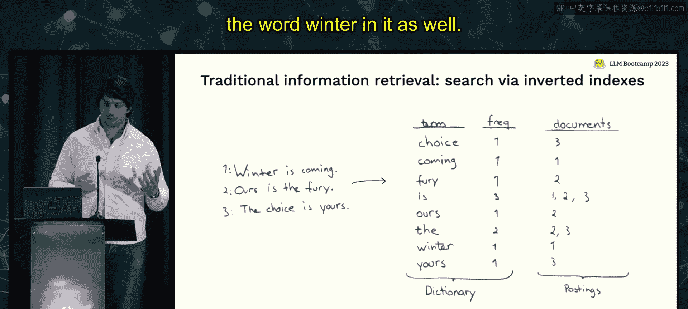


---

## 增强的三种主要方法 🛠️

我们将讨论三种无需训练或微调模型，就能为语言模型增强数据和工具的方法：
1.  **检索**：为模型提供一个外部数据语料库，使其能够搜索相关信息来回答问题。
2.  **链式调用**：使用一个语言模型的输出来为另一个语言模型构建上下文。
3.  **工具使用**：让语言模型与外部数据源（如API、数据库）进行交互。

---


## 方法一：检索增强 🔍


检索增强的核心思想是：将用户查询与一个外部文档数据库进行匹配，找出最相关的文档片段，然后将这些片段放入模型的上下文窗口中，让模型基于这些信息生成答案。

### 从启发式规则到信息检索

最简单的做法是使用规则来决定将哪些数据放入上下文，例如放入最近提到的用户数据。但当查询与所需数据之间的关系难以用简单规则描述时，这种方法就会失效。

因此，为模型构建上下文的过程，本质上是一个**信息检索**（即搜索）问题。

### 传统信息检索方法


在深度学习兴起之前，传统的搜索方法主要依赖以下步骤：
1.  **用户提出查询**。
2.  **系统在内容集合（文档库）中搜索**。
3.  **衡量对象与查询的相关性**。
4.  **根据某种标准对相关对象进行排序**。


传统搜索的核心数据结构是**倒排索引**。它记录了每个词语出现在哪些文档中及其频率。当用户查询包含某个词（如“winter”）时，系统会快速找到包含该词的所有文档。

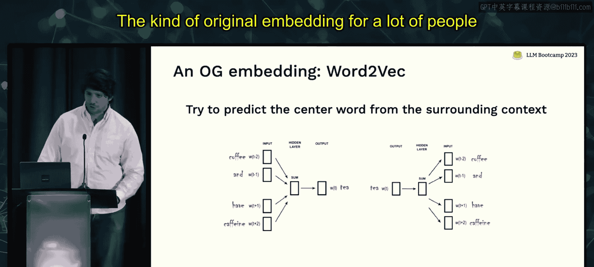

排序通常使用**BM25**等算法，其核心启发式规则包括：
*   搜索词在文档中出现频率越高，相关性越高。
*   包含搜索词的文档越多，该词的重要性越低（可能是常见词）。
*   搜索词出现在较短的句子或文档中，可能更重要。

然而，传统搜索主要基于词频等简单统计相关性，无法捕捉语义信息，对于多义词或复杂查询效果有限。

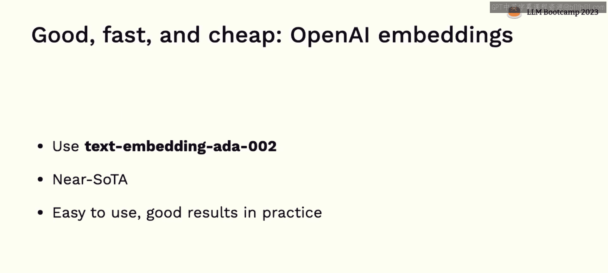


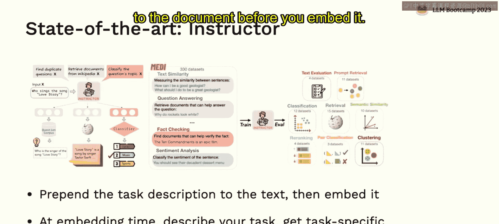

---

## 基于嵌入的现代检索方法 🧬

人工智能，特别是大型语言模型，也能反过来帮助我们改进搜索。核心工具是**嵌入**。

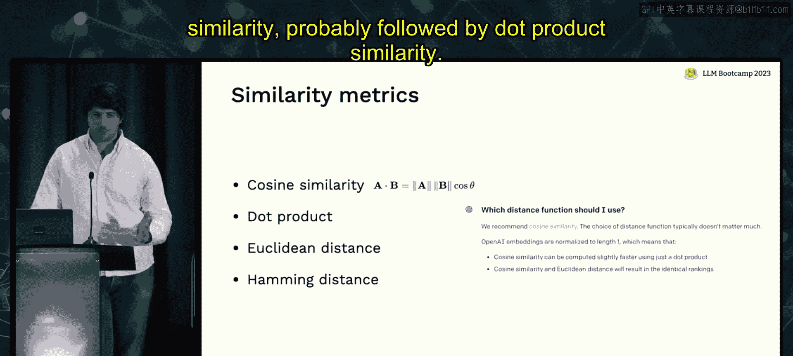


### 什么是嵌入？


嵌入是数据的一种抽象、密集、紧凑且通常是固定大小的表示形式（通常是一个向量）。与传统搜索的稀疏表示（仅标记词语是否存在）不同，嵌入试图捕捉文档中词语之间更复杂的统计分布和语义关系。

**嵌入的特性**：
*   它们不一定是神经网络的最后一层。
*   不一定代表单个输入。
*   不一定来自神经网络。
*   不一定直接在向量空间中可比。

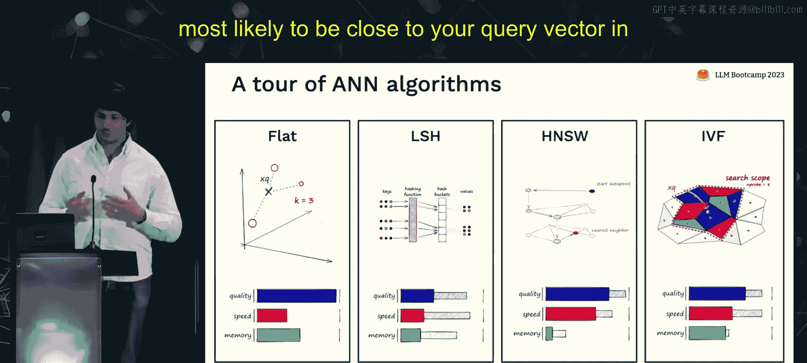

但对于LLM检索，我们使用特定方式生成的嵌入，使得相似对象的嵌入向量在空间中彼此接近，不同对象的嵌入向量彼此远离。

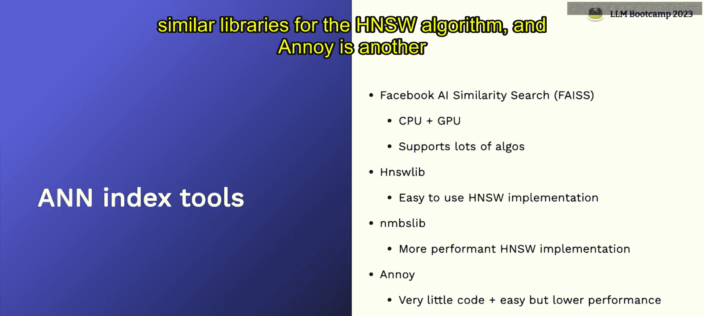

### 如何评估嵌入的好坏？

1.  **下游任务效用**：最重要的标准是嵌入能否帮助你解决实际问题。应根据你的具体任务进行基准测试。
2.  **相似性直觉**：在嵌入空间中，相似概念（如“咖啡”和“茶”）应该靠近，不相关概念（如“球”和“鳄鱼”）应该远离。

### 常见的嵌入模型


以下是几种重要的嵌入模型：
*   **Word2Vec**：经典的词嵌入模型，通过上下文预测词语，是了解嵌入历史的好起点。
*   **Sentence Transformers**：编码句子的模型，训练目标是使相似句子的嵌入靠近。它们廉价、快速、通用，是很好的基线选择。
*   **CLIP**：联合文本和图像的嵌入空间，支持跨模态搜索。
*   **OpenAI Embeddings (text-embedding-ada-002)**：当前原型应用的推荐起点。它在大多数基准测试中表现接近前沿，价格便宜，易于使用，能提供坚实的基线效果。
*   **Instructor**：当前MTEB排行榜的领先者。它的创新在于在嵌入文档前，会**前置一个任务描述**。这类似于嵌入模型的“指令微调”，可以根据不同任务生成不同的嵌入。

**提示**：对于追求极致性能的场景，微调你自己的嵌入模型通常是必要的。

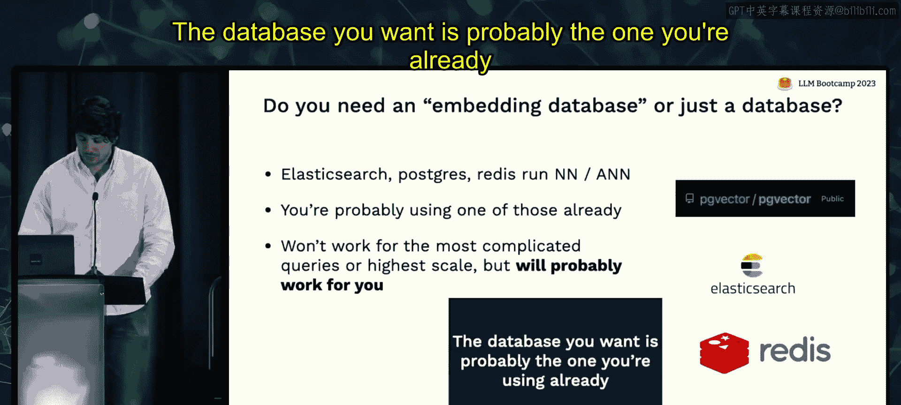

---

## 使用嵌入进行最近邻搜索 🔎

利用嵌入进行检索的基本流程如下：
1.  将你的文档语料库全部转换为嵌入向量并存储。
2.  将用户的查询也转换为嵌入向量。
3.  在存储的嵌入向量中，寻找与查询向量最相似的向量（即“最近邻”）。
4.  将对应的原始文档片段作为上下文提供给LLM。

相似性度量通常使用**余弦相似度**或**点积相似度**。OpenAI表示两者差异不大。

一个极简的实现代码如下（使用NumPy）：
```python
# 假设 `embeddings_array` 存储了所有文档的嵌入
# `query_embedding` 是查询的嵌入
similarities = np.dot(embeddings_array, query_embedding)
most_similar_index = np.argmax(similarities)
most_similar_document = documents[most_similar_index]
```

**关键点**：如果你的向量数量少于10万个，使用NumPy进行精确最近邻搜索通常就足够了，无需复杂工具。

---

## 近似最近邻搜索与向量数据库 🗃️

当数据规模庞大时，精确计算所有向量的相似度会变得非常慢。这时需要使用**近似最近邻搜索**算法。

ANN算法（如HNSW, Annoy, Faiss）通过巧妙地划分向量空间，只搜索可能接近查询向量的区域，从而在可接受的精度损失下大幅提升搜索速度。

然而，ANN索引只是一个**数据结构**，它本身不提供存储、元数据管理、水平扩展、嵌入函数管理等生产级功能。这就像图书馆的**卡片目录**，它能告诉你书在哪，但图书馆本身还包含书籍、管理员、借阅系统等。

因此，对于生产环境，你需要一个完整的**向量数据库**或支持向量搜索的**信息检索系统**。

### 如何选择？

1.  **首先考虑现有数据库**：许多主流数据库（如PostgreSQL + pgvector, Elasticsearch, Redis）已内置或通过扩展支持向量搜索。对于大多数应用，这可能是最简单、最好的起点。
2.  **如果需要专用向量数据库**：可以考虑以下选项，根据特性选择：
    *   **Chroma**：新兴的AI原生工具，适合早期尝试。
    *   **Milvus**：强调规模和企业级特性。
    *   **Pinecone**：全托管服务，上手速度最快（本课程使用）。
    *   **Vespa**：功能最丰富、最健壮、久经考验，源自上一代搜索引擎。
    *   **Weaviate**：良好的混合选择，支持嵌入管理和灵活的查询接口。

**建议**：原型阶段使用现有数据库或Pinecone；需要更灵活查询时考虑Vespa或Weaviate；需要极致规模或可靠性时考虑Vespa或Milvus。

---

## 超越基础检索的高级话题 🚀

基础最近邻搜索有时效果不佳，因为查询（短问题）和文档（长文本）的嵌入可能不在一个可比的语义空间。以下是一些高级技术方向：
*   **训练联合编码器**：训练一个模型，将查询和文档共同嵌入到同一个更优的空间。
*   **假设文档嵌入**：让LLM根据查询“想象”出一个可能包含答案的文档，然后搜索与这个“假设文档”相似的真实文档。
*   **重排序**：先用快速检索（如ANN）返回大量候选文档，再用一个更精细的（通常是微调的）模型对它们进行重新排序。
*   **利用数据结构**：如果你的数据有层次结构（如文档被分块），需要设计能尊重这种结构的搜索方式。**LlamaIndex** 是一个流行的库，可以帮助处理数据加载、分块和层次化检索。

---

## 检索增强案例研究 📚

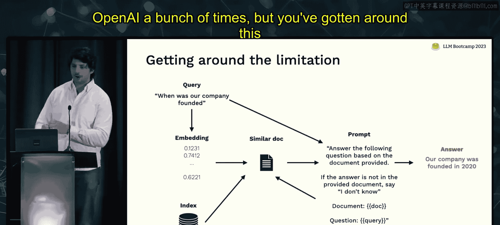


**GitHub Copilot**：
Copilot的魔力部分源于其快速的检索系统。它并非使用复杂的向量搜索，而是依赖简单的启发式规则：
1.  查看用户最近访问的20个同语言文件作为候选池。
2.  结合光标前后的代码上下文。
3.  从候选文件中找出最相关的代码片段。
4.  使用启发式规则对所有候选信息（上下文、相关片段等）进行排序。
5.  将排名最高的几条信息放入提示词中，让模型生成代码。
**启示**：从简单的启发式规则开始，往往比一开始就追求复杂的向量搜索更有效，尤其是在延迟敏感的场景。

**基于检索的问答**：
这是目前最常见的LLM应用模式之一。
1.  用户提问（如“我们公司何时成立？”）。
2.  计算问题的嵌入。
3.  在向量数据库中查找最相似的文档片段。
4.  将前3-5个相似片段和原始问题一起放入提示词。
5.  LLM基于提供的上下文回答问题。
**局限性**：严重依赖检索系统的准确性。如果正确答案不在返回的Top K个片段中，模型就无法回答。

---

## 方法二：链式调用 ⛓️

链式调用提供了一种解决上述局限性（上下文窗口有限）的思路。其核心思想是：**使用一个语言模型的输出来为另一个语言模型构建或筛选上下文**。

### 什么是链？

链是一系列语言模型调用的序列，其中一个调用的输出作为下一个调用的输入。你可以将最终调用视为解决目标任务的模型，而之前的调用则是帮助它准备最佳上下文的“助手”。

### 链式调用的例子

1.  **迭代检索问答**：如果只能放3个文档到上下文，但检索返回了10个可能相关的文档。你可以设计一个链：让一个LLM依次评估每（组）文档是否包含答案，汇总这些判断，再将最有可能包含答案的文档交给最终的问答LLM。这虽然更慢更贵，但突破了单次上下文的限制。
2.  **假设文档嵌入**：本身就是一个链：LLM根据查询生成假设文档 -> 检索与假设文档相似的文档 -> 问答。
3.  **Map-Reduce摘要**：要总结一个庞大的文档库：先对每个文档单独做摘要（Map），然后对所有摘要再进行一次总结（Reduce）。

### LangChain：链式调用的流行框架

**LangChain** 是一个极速增长的开源项目，它汇集了各种链的模式、组件和示例，是快速原型设计的绝佳工具。

**是否该用LangChain？**
*   **对于学习和原型设计**：强烈推荐。它是了解各种可能性的最佳途径。
*   **对于生产环境**：许多团队在明确需求后，会选择借鉴LangChain的思想，但自己实现定制化的链，以获得更好的控制和性能。

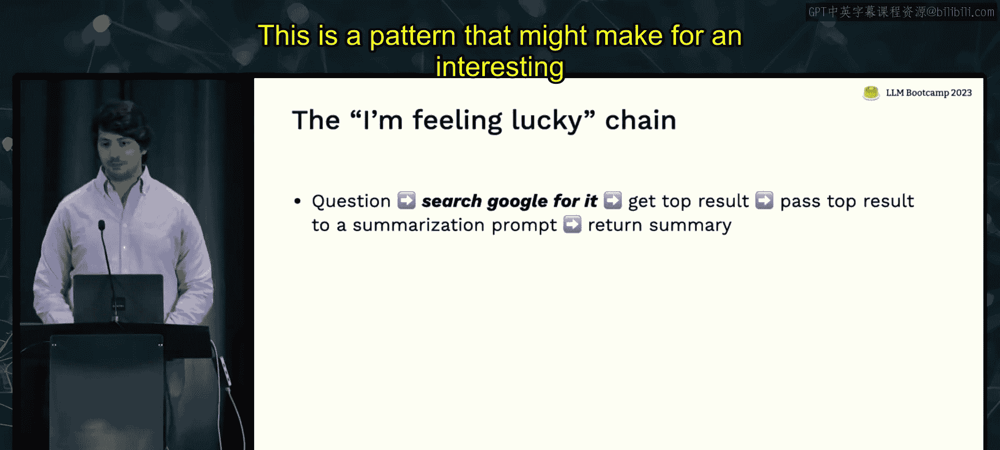

LangChain中包含大量链的示例，例如“我感觉很幸运”链：用户提问 -> 用问题搜索Google -> 取第一个结果 -> 用LLM总结 -> 返回给用户。这展示了链如何轻松集成外部工具。


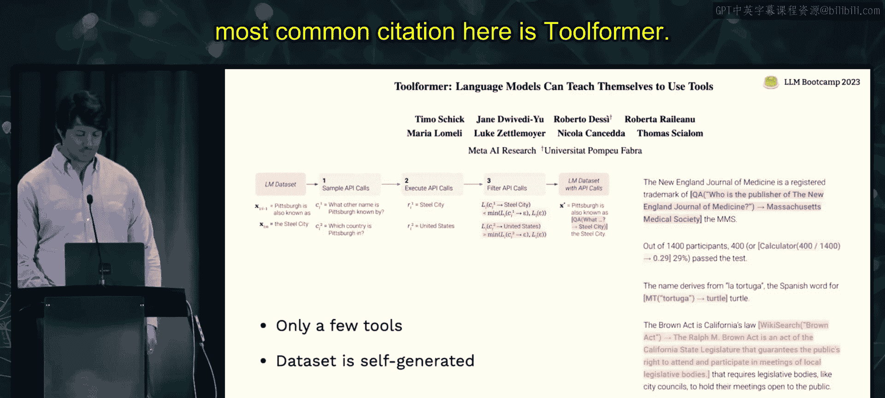

---


## 方法三：工具与插件使用 🧰

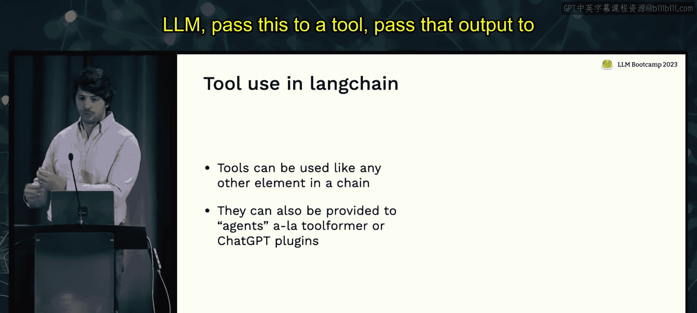

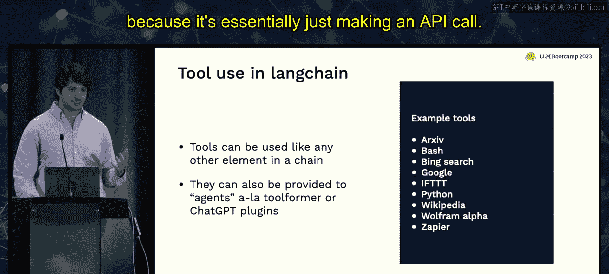

工具使用是让LLM与外部世界交互的更通用方式。检索系统本身就可以被视为一个工具。

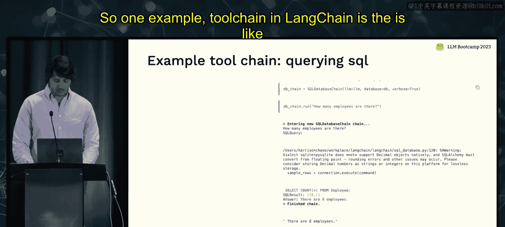

### 两种集成工具的方式

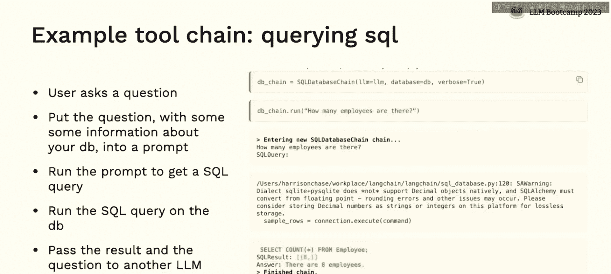

1.  **链式集成**：开发者手动设计逻辑，规定LLM在何时、如何调用工具。例如，构建一个SQL查询链：用户自然语言问题 -> LLM生成SQL -> 执行SQL -> 将结果和原问题交给另一个LLM生成自然语言答案。
2.  **插件式集成**：模型自主决定是否及何时使用工具。开发者只需提供工具的API描述（给模型看的），模型在生成过程中，如果认为需要，会主动调用工具，并将工具返回的结果纳入后续的生成上下文。OpenAI的插件系统就采用这种方式。

### 如何选择？

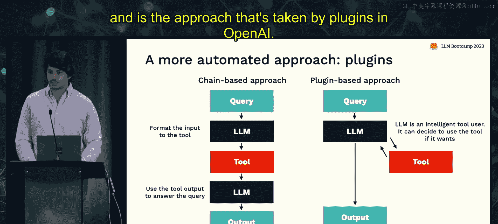


*   **追求可靠性与确定性**：选择**链式集成**。你可以精确控制流程。
*   **追求灵活性与通用性**：选择**插件式集成**。用户无需切换模式，模型可以自主组合工具来解决未预见的复杂问题。

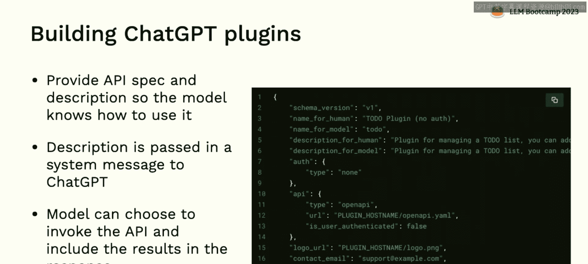

---

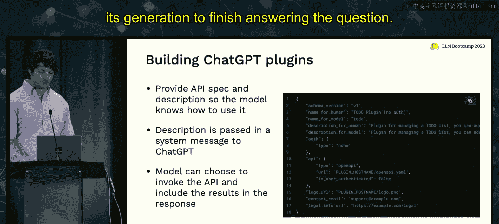

## 总结 🎯

本节课我们一起学习了如何增强大型语言模型，使其能够利用外部数据和工具。


*   **核心动机**：LLM是强大的推理引擎，但缺乏特定、实时和私有的知识，需要外部增强。
*   **上下文窗口**：是有限且昂贵的资源，需要高效利用。
*   **三种增强方法**：
    1.  **检索增强**：通过搜索外部语料库获取相关信息。可以从简单规则开始，随着数据量增长，需系统化地考虑信息检索问题，包括使用嵌入、向量数据库和高级检索技术。
    2.  **链式调用**：通过串联多个LLM调用或处理步骤，来构建更复杂的上下文或处理流程，能够突破单次上下文限制，实现更复杂的推理。
    3.  **工具使用**：为LLM提供访问API等外部工具的能力。可以通过链进行确定性控制，也可以通过插件赋予模型自主选择权，实现更高的灵活性。

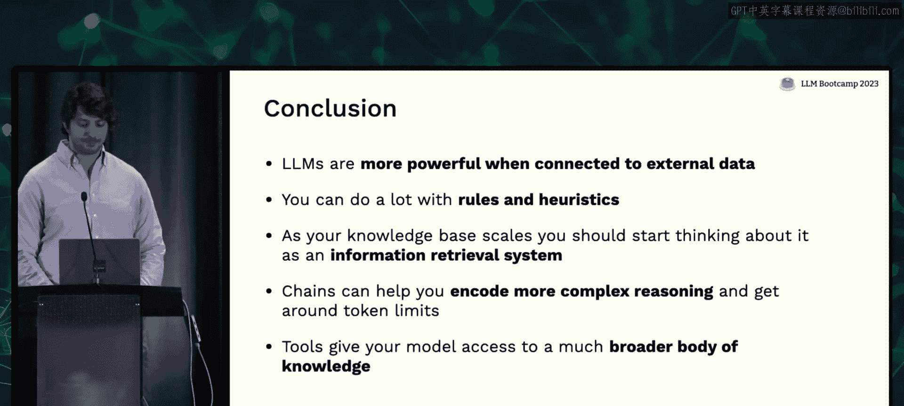

通过结合这些方法，你可以构建出功能强大、知识渊博且能解决实际问题的语言模型应用。