# 7：LLMOps

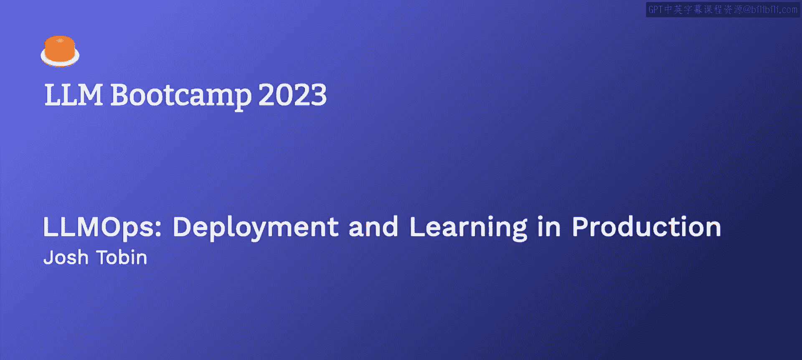

## 概述

在本节课中，我们将学习如何将大型语言模型（LLM）应用投入实际生产环境。我们将探讨从模型选择、提示工程、评估测试到部署监控的完整流程，并介绍一种系统化的LLM应用开发方法。

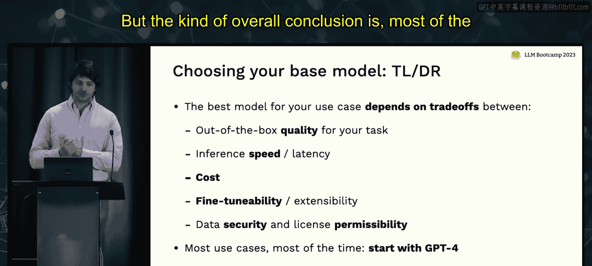

---

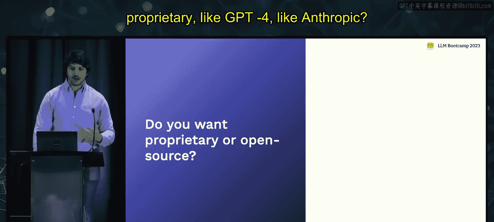

## 模型选择 🎯

构建LLM应用的第一步是选择合适的基座模型。没有单一的最佳模型，正确的选择取决于一系列权衡。

以下是选择模型时需要考虑的关键因素：
*   **开箱即用的质量**：模型在特定任务上的初始表现。
*   **推理速度与延迟**：模型生成响应的快慢。
*   **成本**：使用模型API或自行部署的费用。
*   **可微调性**：是否能够对模型进行定制化训练。
*   **数据安全与许可**：模型使用条款对数据隐私和商业用途的限制。

### 专有模型选项

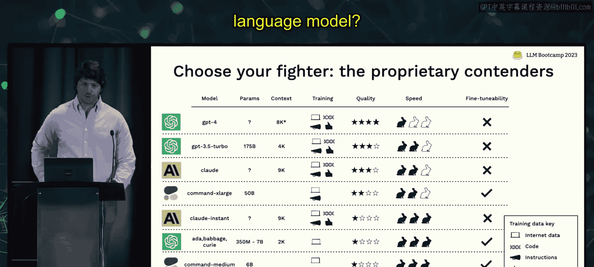

专有模型通常质量更高、部署更简单，但可能受限于API功能和数据安全考量。

| 模型 | 参数规模 | 上下文窗口 | 训练数据 | 主观质量 | 速度 | 可微调性 |
| :--- | :--- | :--- | :--- | :--- | :--- | :--- |
| **GPT-4** | 极大 | 大 | 互联网、代码、指令、人类反馈 | **最高** | 慢 | 否 |
| **GPT-3.5** | 大 | 大 | 互联网、代码、指令、人类反馈 | **很高** | 快 | 否 |
| **Claude (Anthropic)** | 大 | 大 | 互联网、代码、指令、人类反馈 | **很高** | 中等 | 否 |
| **Cohere (最大模型)** | 大 | 大 | 互联网、代码、指令 | 高 | 中等 | **是** |
| **其他快速/廉价模型** | 中小 | 可变 | 通常较简单 | 中等 | **很快** | 部分支持 |

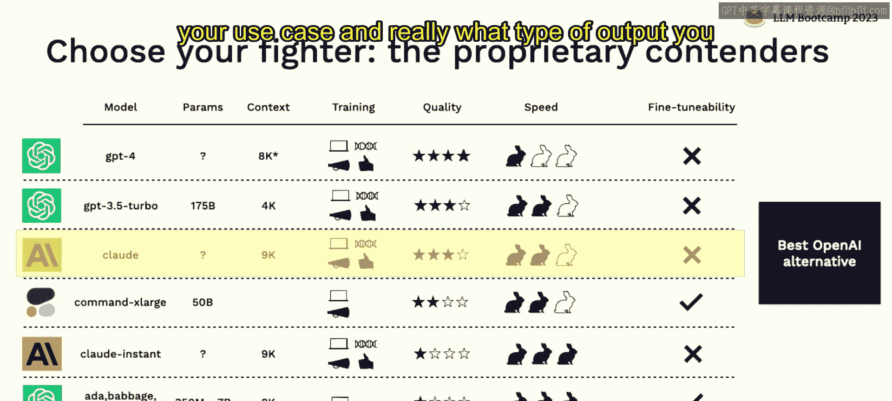

**核心建议**：对于大多数项目，应从GPT-4开始构建概念验证。如果成本或延迟是关键因素，可考虑GPT-3.5或Claude。若需微调，Cohere是最佳选择。

### 开源模型选项

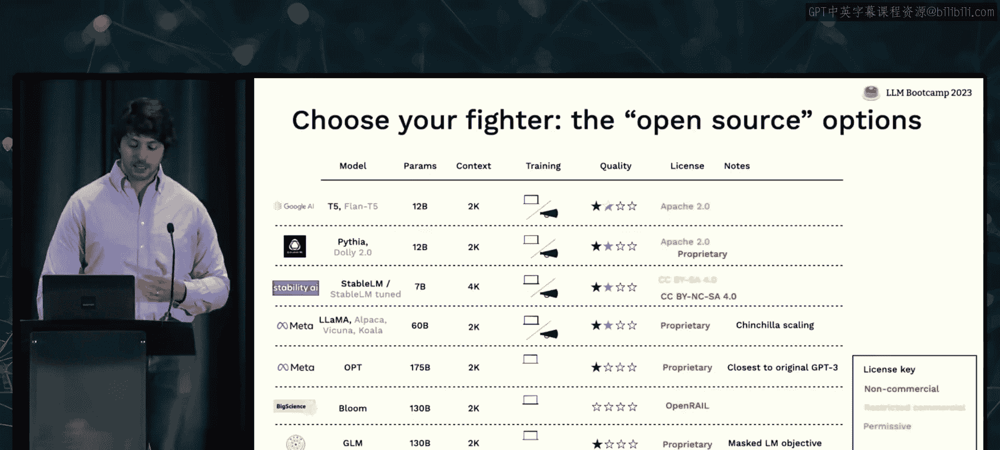

开源模型提供更高的定制化和数据控制权，但部署复杂，且需仔细审查许可证。

| 模型 | 许可证 | 主观质量 (基础/指令调优) |
| :--- | :--- | :--- |
| **T5 / Flan-T5** | **宽松 (Apache 2.0)** | 中等 / 良好 |
| **Pythia / Dolly** | 受限 / **非商业** | 良好 / 良好 |
| **StableLM** | 受限 | 待评估 / 待评估 |
| **LLaMA / Alpaca** | **受限** | 良好 / 良好 |
| **OPT** | 宽松 | 中等 |

**许可证颜色说明**：
*   **绿色**：宽松许可证，可自由商用。
*   **黄色**：受限许可证，需自行评估条款。
*   **红色**：非商业许可证，仅限研究。

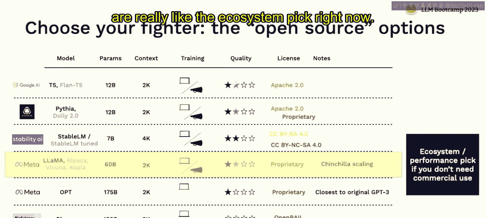

**核心建议**：目前仅当确实需要（如数据安全、深度定制）时才使用开源模型。评估模型性能的最佳方式是**在自身任务上进行实际测试**。

---

## 提示与链的管理 📝

上一节我们介绍了如何选择模型，本节中我们来看看如何有效地开发和迭代提示（Prompt）与处理链（Chain）。

当前，提示工程的管理方式有些类似2015年的深度学习实验管理：缺乏跟踪、难以复现和协作。虽然目前实验规模较小且多为串行，但未来随着自动化评估的发展，对专业工具的需求可能会增加。

以下是管理提示工程的三个层级：

**层级一：无管理**
直接在OpenAI Playground等界面中修改提示，有效后复制到代码中。这适用于最初期的原型（P0阶段）。

**层级二：使用Git管理**
将提示和链的代码像普通代码一样用Git进行版本控制。这是目前大多数团队应该采用的方式，它简单且易于协作。

**层级三：使用专业工具**
当出现以下情况时，可考虑专用工具：
1.  需要进行大量并行实验评估。
2.  希望将提示更改与代码部署解耦。
3.  需要让非技术利益相关者（如产品经理）参与提示迭代过程。

理想的专业工具应具备以下特点：
*   与Git解耦。
*   提供UI界面，方便非技术人员交互和调整提示。
*   能可视化提示的执行结果和用户交互数据。

目前该领域工具正在快速发展，Weights & Biases、Comet、MLflow等传统ML实验管理平台已开始提供相关功能。

---

## 评估与测试 ✅

当我们修改了模型或提示后，如何知道这些更改是否真正提升了效果？本节将探讨如何为LLM应用构建有效的评估体系。

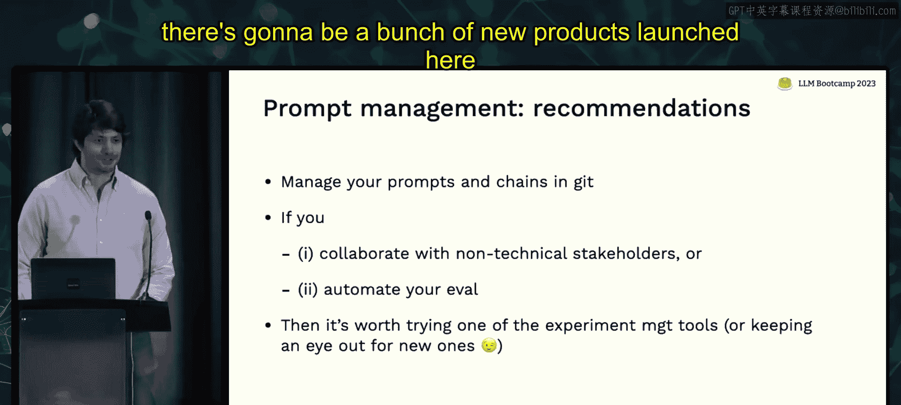


与传统机器学习不同，LLM的评估面临独特挑战：
1.  **训练数据未知**：无法获得API模型的确切训练数据。
2.  **输出非确定性**：生成的是文本，难以用简单对错衡量。
3.  **任务多样性**：模型需处理广泛的问题，单一聚合指标可能失效。

### 如何构建评估数据集

构建评估集应是一个渐进的过程：

**1. 从小规模开始，逐步积累**
*   **初期**：在手动测试时，将遇到的“有趣”例子收集起来。
*   **“有趣”例子的启发式**：
    *   **困难样本**：模型处理不好的例子。
    *   **多样样本**：与现有数据分布不同的例子。
*   **后续**：任何模型更改都应在该数据集上运行测试。

**2. 利用LLM自身生成测试用例**
可以使用提示让LLM为你的任务生成多样化的输入-输出对。例如，`auto-evaluator`这个开源库就采用了这种方法。

**3. 从用户反馈中持续扩充**
随着应用上线，应不断将新发现的失败模式或用户行为模式加入评估集。来源包括：
*   用户标注的“不喜欢”的反馈。
*   通过自我批判（Self-Critique）提示识别出的低质量输出。
*   生产数据中 underrepresented 的主题或格式。

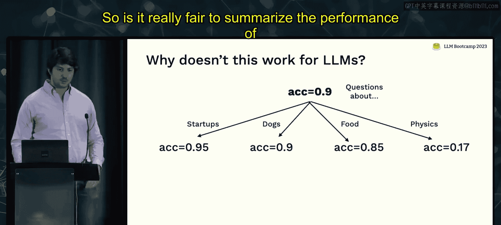

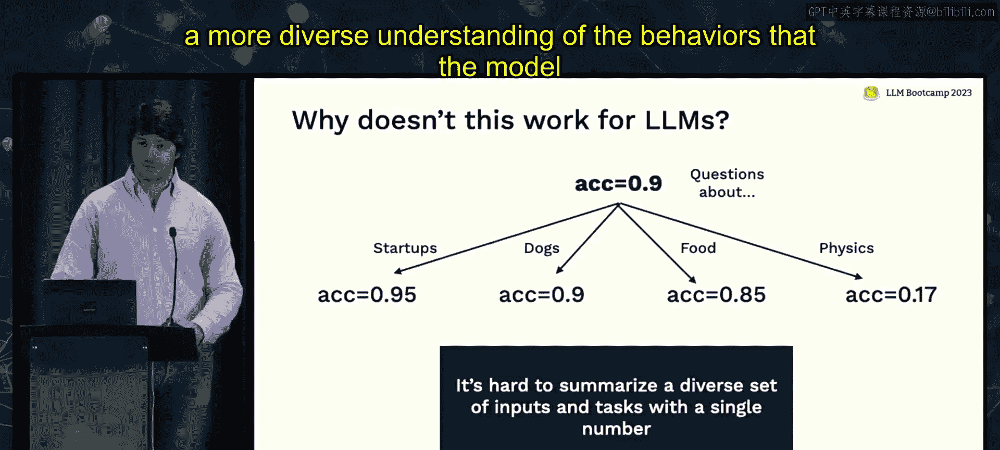

### 评估指标

根据你所拥有的“正确答案”类型，可以选择不同的自动评估方法：

*   **有标准答案**：使用传统指标，如**准确率（Accuracy）**。
*   **有参考答案**：使用**参考匹配指标**，如语义相似度，或让另一个LLM判断事实一致性。
*   **有模型旧版本答案**：使用**对比评估**，让另一个LLM判断哪个答案更好。
*   **有人类反馈**：让LLM判断新答案是否**包含了反馈意见**。
*   **以上皆无**：
    *   验证输出**结构**（如是否为合法JSON）。
    *   让LLM按**量表（如1-5分）** 对答案进行评分。

**核心要点**：目前完全自动化评估仍不可靠，需要辅以人工检查。在人工检查时，应同步收集反馈，这些反馈将成为生产环境监控的重要信号。

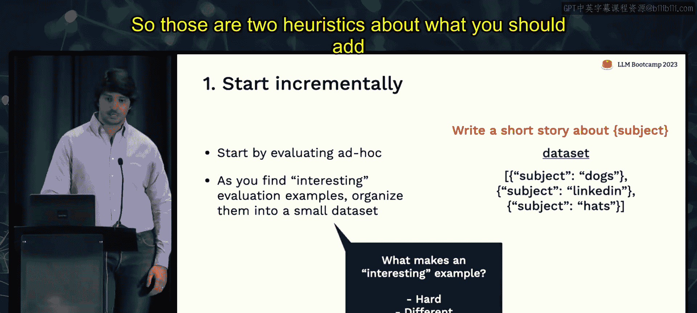

---

## 部署与监控 🚀

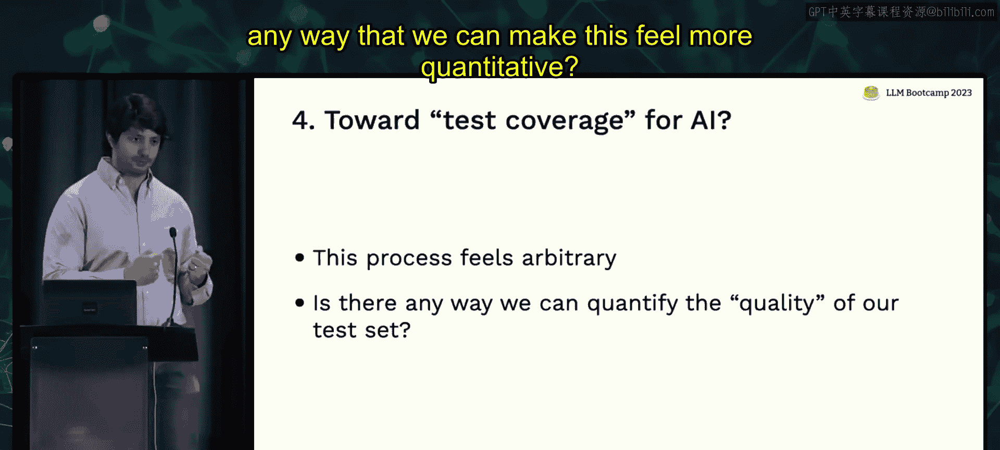

本节我们将了解如何部署LLM应用，并在生产环境中监控其表现。

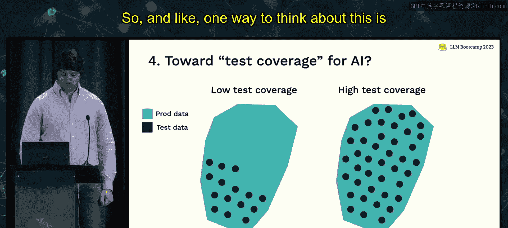

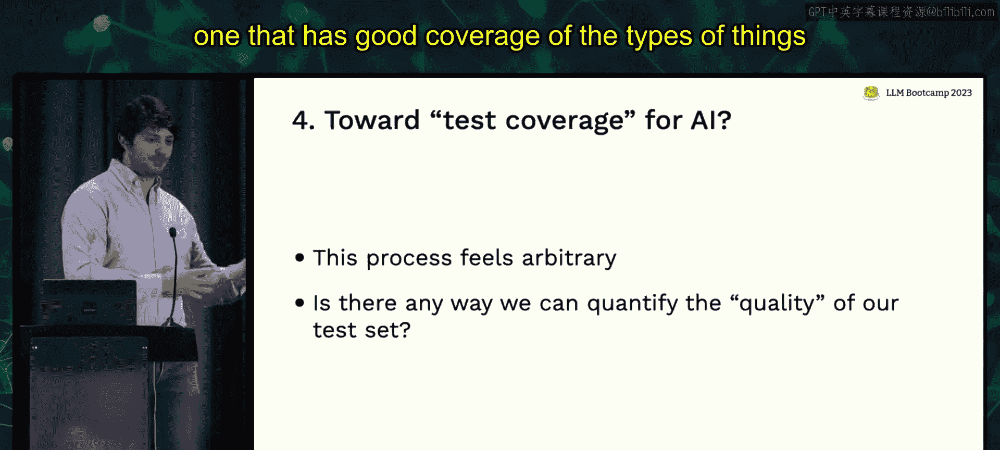

### 部署

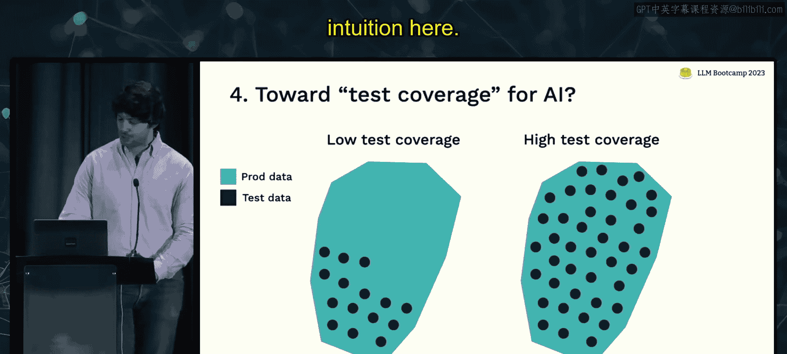

如果仅使用LLM API，部署通常很简单，可以直接从前端调用。然而，如果后端有复杂的提示逻辑或处理链，可以考虑将LLM逻辑封装为独立的服务。自行部署开源模型则更为复杂，涉及专门的硬件和优化技术。

在部署后，可以通过一些技术提升输出质量（以增加成本和延迟为代价）：
*   **自我批判（Self-Critique）**：让第二个LLM批判第一个的输出，引导其改进。`guardrails` 库提供了相关功能。
*   **采样与选择**：多次采样生成多个候选答案，然后选择最佳的一个。
*   **集成（Ensemble）**：对多次采样的结果进行平均或投票。

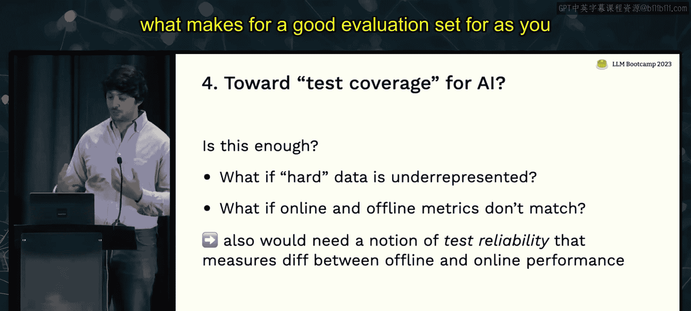

### 监控

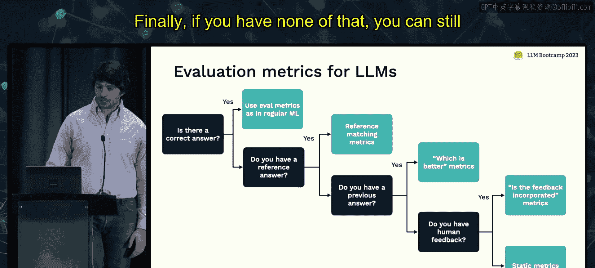

监控的核心目标是确保模型能真正解决用户的问题。重要的监控信号包括：

1.  **用户结果指标**：用户是否满意？任务完成率如何？这是最重要的信号。
2.  **模型性能代理指标**：例如，如果发现用户偏好简短回答，可以监控**回答长度**。
3.  **常见故障模式**：针对LLM常见问题设置监控：
    *   **延迟过高**：影响用户体验。
    *   **错误答案或幻觉（Hallucination）**。
    *   **回答冗长或回避问题**。
    *   **提示注入攻击**。
    *   **输出毒性或不雅内容**。

收集用户反馈应尽可能降低用户负担：
*   **最佳**：将反馈环节嵌入用户现有工作流。
*   **较好**：提供“点赞/点踩”或“接受修改”等轻量级选项。
*   **可选**：提供文本框让用户描述问题，可能获得高质量信号。

---

## 持续改进与理论框架 🔄

在部署和监控之后，我们获得了用户反馈，如何利用这些反馈来持续改进模型？本节将介绍一种系统化的LLM应用开发循环。

我们可以借鉴 **测试驱动开发（TDD）** 或 **行为驱动开发（BDD）** 的思想，形成一个持续的改进闭环：

```
[提示/链开发] -> [测试] -> [部署] -> [收集用户反馈] -> [日志与监控] -> [识别反馈主题] -> [提取测试数据] -> [回到提示开发]
```

**流程详解**：

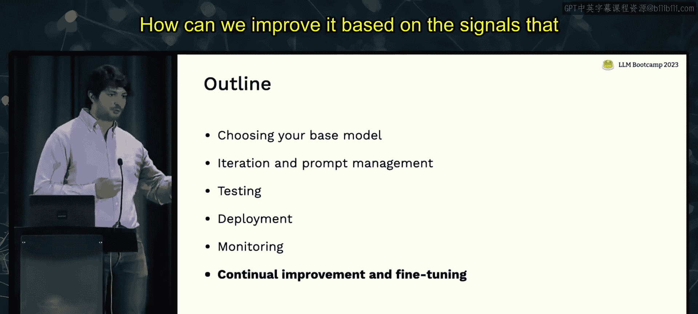

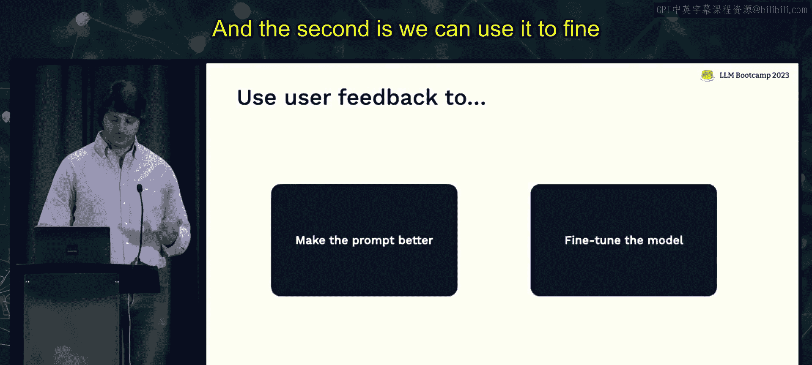

1.  **提示/链开发**：基于选定的LLM，迭代开发提示和处理链。
2.  **测试**：在构建的评估数据集上测试当前版本。
3.  **部署**：将模型部署给用户（初期可能是开发者自己，然后是团队，最后是真实用户）。
4.  **收集用户反馈**：获取用户交互数据和满意度反馈。
5.  **日志与监控**：分析交互数据，识别出用户遇到问题的**共同主题**（例如，总是在处理某种类型的问题时出错）。
6.  **提取测试数据**：将这些主题转化为具体的测试用例（例如，将出错的用户问题加入评估集）。
7.  **回到提示开发**：利用新的、更具针对性的测试集，改进提示或处理链，以解决已识别的问题。

**可选路径：微调**
当积累足够多的高质量交互数据后，可以将其作为训练数据对模型进行**微调**。微调会产生一个新的基座模型，这将要求我们重新审视和调整提示，从而进入一个新的、更强大的开发循环。

这个框架的核心在于建立一个**良性循环**：用户反馈驱动测试集的丰富和优化，更好的测试集驱动更可靠的提示开发，从而提升用户体验并产生更高质量的反馈。

---

## 总结

本节课我们一起学习了将LLM应用投入生产所需考虑的关键运维环节：

1.  **模型选择**：需在质量、速度、成本、可调性和许可之间权衡。通常从GPT-4开始，按需降级或选择开源模型。
2.  **提示管理**：目前使用Git进行版本控制是推荐做法，未来可能需要更专业的工具来支持并行实验和非技术协作。
3.  **评估测试**：需要渐进式地构建评估数据集，重点关注困难样本和多样样本，并利用LLM自身生成测试用例。评估指标需根据有无标准答案灵活选择。
4.  **部署监控**：部署相对简单，但可通过自我批判、多次采样等技术提升质量。监控应关注用户结果、代理指标及幻觉、延迟等常见故障。
5.  **持续改进**：可以采用一种类似测试驱动开发的系统化循环，利用用户反馈不断识别问题、扩充测试集、优化提示，从而实现产品的持续迭代和提升。

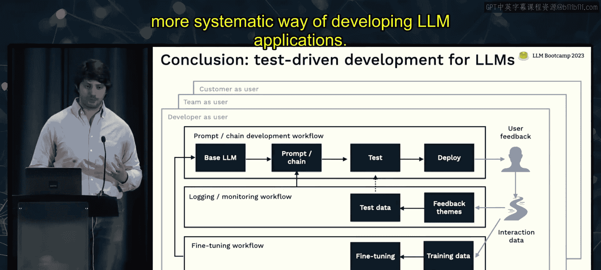

通过系统化地应用这些实践，你可以更稳健、高效地构建和运维能够创造真实价值的LLM应用程序。