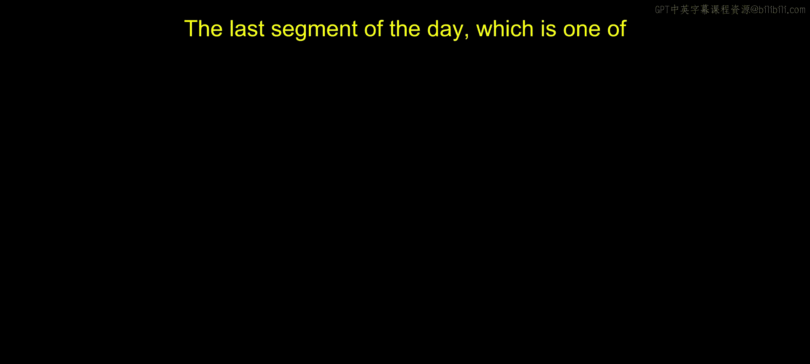
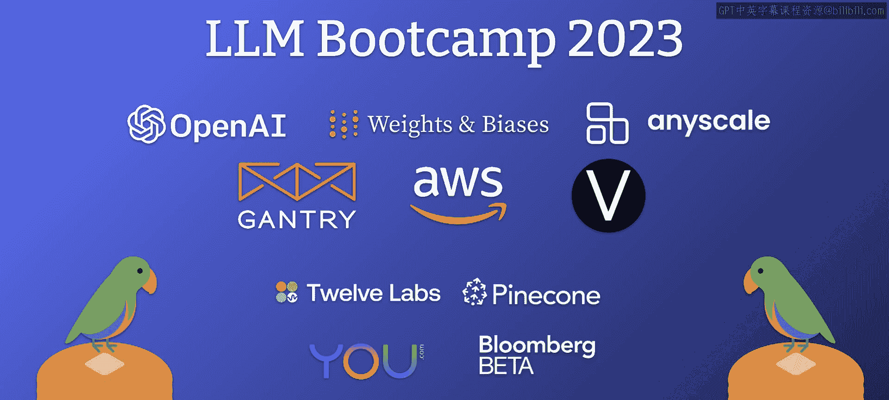

# 9：与OpenAI产品副总裁Peter Welinder的炉边谈话

在本节课中，我们将一起回顾OpenAI产品与合作伙伴关系副总裁Peter Welinder在LLM训练营中的一次炉边谈话。我们将了解他进入机器学习领域的历程、在OpenAI的工作经历，以及关于GPT系列模型和ChatGPT产品化的思考。

## 从物理学到机器学习 🧠

上一节我们介绍了本次谈话的背景，本节中我们来看看Peter Welinder是如何进入机器学习领域的。

Peter Welinder表示，他最早在高中时期阅读了Russell和Norvig的人工智能教材，但对人工智能的具体含义感到困惑。他最初在大学学习物理学，后在研究生阶段转向神经科学。

然而，他发现自己缺乏进行神经科学实验所需的耐心，因为这类工作涉及大量艰苦的动物实验。因此，他最终将研究方向转向了计算机视觉，这恰好是机器学习开始被广泛应用于解决视觉问题的时期，大约在2007-2008年，当时的主流技术包括支持向量机（SVM）和概率模型。

## 创业与产品化之路 🚀

在从研究生院毕业后，Peter Welinder开启了他的创业之旅。

他于2011年（深度学习兴起之前）创立了一家初创公司，最初旨在利用当时的计算机视觉技术追踪果蝇或小鼠等动物。但他们很快发现这个市场并不理想，因为研究生完成相同任务的成本更低。

因此，他们转向开发一款能够根据内容自动整理照片的应用程序，例如将人物照片和食物照片分别归类。这个时机恰逢iPhone 4的爆发式增长，他们预测移动摄影将改变一切。

这家初创公司后来被Dropbox收购。Peter Welinder加入Dropbox，帮助建立了其首个机器学习与计算机视觉团队，旨在处理Dropbox中海量但未被索引的照片数据。他们在Dropbox开发了一款名为Carousel的移动应用，并随后将技术应用于分析文档和实现语义搜索。

## 加入OpenAI与AGI愿景 🌌

在Dropbox工作期间，深度强化学习开始兴起，这吸引了Peter Welinder对机器人技术应用的兴趣。

正是这种“如何让新技术对人们有用”的思维模式，促使他在2017年加入了成立约一年的OpenAI。当时的OpenAI是一个专注于通用人工智能（AGI）这一艰巨问题的小团队，其理念和团队雄心吸引了他。

关于AGI的时间预测，Peter Welinder在加入时感到非常不确定，甚至对时间线持悲观态度。他当时并不确定OpenAI一两年后是否还会存在。

## OpenAI的技术探索与聚焦 🤖

OpenAI早期进行了多项技术探索，这些项目为他们提供了宝贵的经验。

以下是几个关键项目及其带来的启示：
*   **Dota 2 AI**：这个项目击败了世界冠军。起初被认为不可能，但最终仅通过一个相对简单的神经网络架构、标准强化算法和**海量对战数据**就实现了。这证明了数据量的重要性。
*   **机器人手解魔方**：他们选择了机器人技术中公认的难题——多自由度灵巧手的物体操控。经过两年攻坚，他们再次发现，许多看似无法逾越的障碍可以通过**相对简单的算法和大量数据**来克服。
*   **语言模型**：从2017年的“情感神经元”LSTM，到GPT-1、GPT-2，再到GPT-3，他们开始感觉到这条路径的通用性。GPT-3在许多任务上达到了需要专用神经网络才能实现的水平，并且他们知道可以在此基础上应用深度强化学习，并进一步扩展模型规模。

基于这些经验，OpenAI意识到推动机器人或游戏AI可能不会带来与实现AGI高度一致的新突破，而语言模型则展现出明确的效用、可扩展的损失曲线和巨大的潜力，因此公司决定集中资源专注于这个方向。

## ChatGPT的产品化决策与爆发 💡

当OpenAI拥有GPT-3这样的技术后，如何将其产品化成为一个关键决策。

团队曾考虑开发垂直产品，如翻译系统或写作助手，但无法下定决心。最终，他们决定推出**API**，让开发者来探索其应用场景。最初的API版本推理速度极慢，经过巨大努力才得以改善。早期市场反馈也充满不确定性，许多公司认为技术很酷但不知如何使用。

关于ChatBot的想法其实在API发布前就已存在，但团队因担心技术不成熟和安全性问题（如微软Tay机器人的前车之鉴）而搁置。然而，他们通过API的Playground观察到一个现象：大量注册用户并非为了开发应用，而是直接将其用作“创业顾问”、“治疗师”或文章总结工具。这明确显示了市场对更易用产品的需求。

在改进了指令遵循和对话能力后，团队决定发布ChatGPT。内部预期较为保守，计划支持几十万用户。但现实是，ChatGPT在发布后一周内用户数就突破百万，并引发了持续数月的系统扩展和资源争夺战。

## 用户反馈与行业影响 🔄

ChatGPT的普及带来了许多意想不到的用户行为和市场反应。

用户并非只将其用于单一场景，而是平均每人有**5到10个不同的高频用例**，从学习知识到总结文档，应用方式不断扩展。这种广泛适用性超出了团队对GPT-3.5的预期。

在行业层面，ChatGPT成为了技术的“终极产品演示”，无需再向企业解释语言模型是什么。大型企业迅速意识到集成此类技术的紧迫性，以免落后，这既带来了恐惧，也创造了机遇。

关于ChatGPT成功的原因，Peter Welinder认为**对话式用户体验**和**免费、易得的可用性**是关键，而不仅仅是底层模型的改进。对话形式允许自然的多轮交互，而开放的访问方式则让任何人都能亲身体验。

## 对AGI的当前看法与未来展望 🚀

回到最初关于AGI的问题，Peter Welinder现在的看法有所改变。

他目前对AGI的定义是：**能够执行达到或超过人类水平、具有经济价值工作的自主AI系统**。他认为，到本世纪末（2030年），出现达到或接近AGI水平的系统的可能性相当大。他甚至表示，也许未来回顾时，会发现GPT-4加上正确的组件整合，其实已经具备了AGI的雏形。

---

本节课中我们一起学习了Peter Welinder从学术到产品开发的职业路径，回顾了OpenAI早期在游戏AI、机器人等领域的技术探索如何为其聚焦大语言模型提供依据，深入分析了将GPT技术通过API和ChatGPT产品化的决策过程与市场反馈，并探讨了ChatGPT成功的关键因素及其对行业产生的深远影响。最后，我们也了解了他对通用人工智能（AGI）未来发展的最新展望。