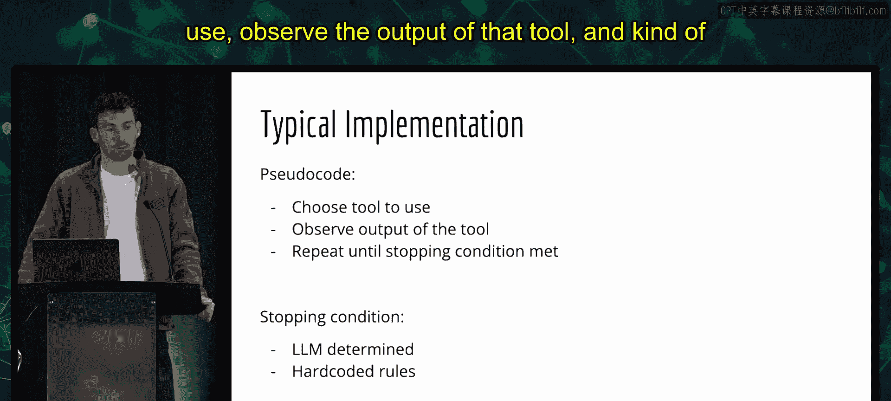
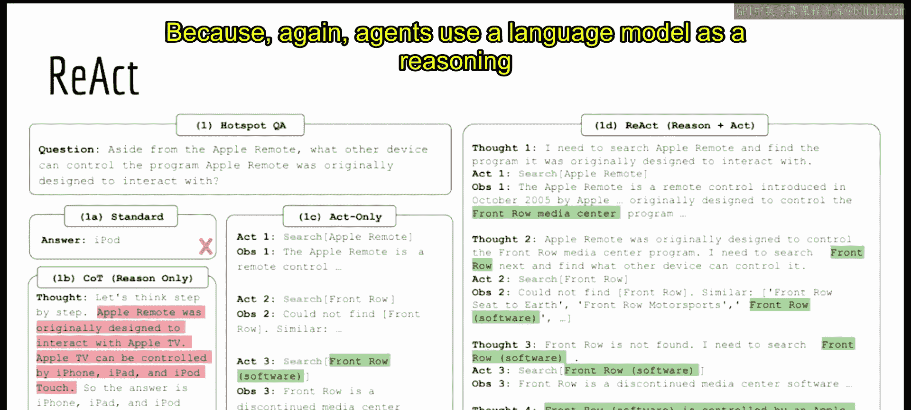
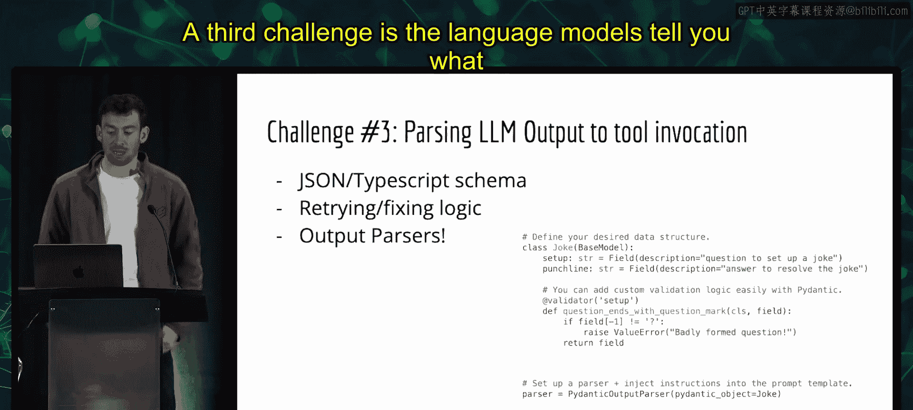
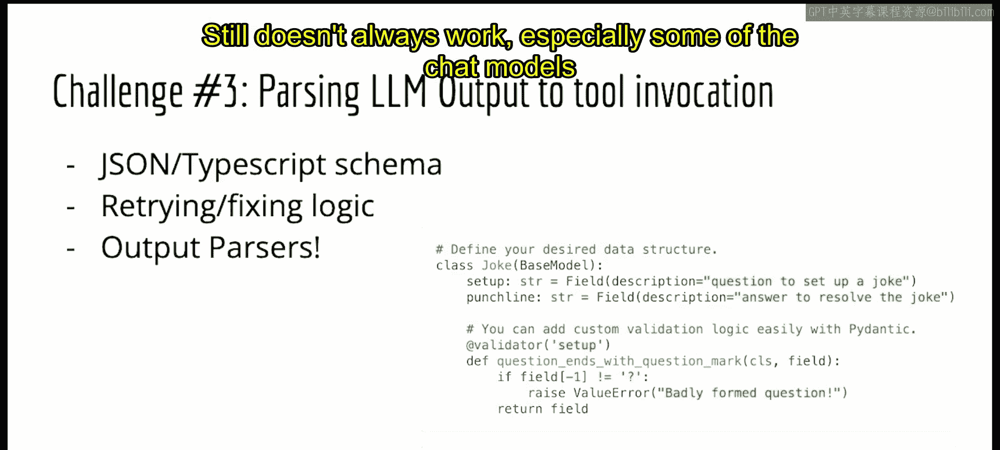
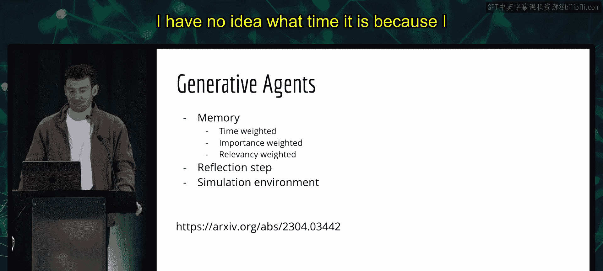
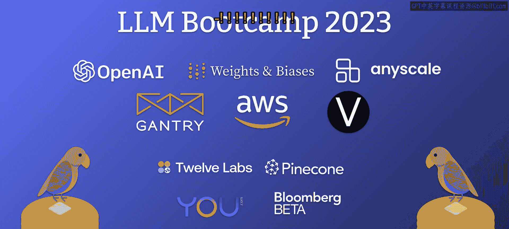

# 10：智能体大师课

在本节课中，我们将学习智能体（Agents）的核心概念、工作原理、典型实现、当前面临的挑战以及该领域的最新进展。智能体利用大语言模型作为推理引擎，通过动态决策与外部工具交互，是构建强大AI应用的关键技术。

## 🧠 什么是智能体？

上一节我们介绍了课程概述，本节中我们来看看智能体的核心定义。

智能体的核心思想是将大语言模型作为一个**推理引擎**来使用。这意味着利用模型来决定**做什么**以及**如何与外部世界交互**。智能体采取的行动序列不是预先硬编码的（例如先执行A，再执行B），而是根据用户输入和先前行动的结果**非确定性地**生成的。

## 🤔 为何使用智能体？



了解了智能体的定义后，我们自然会问：为什么要使用智能体？

智能体与**工具使用**的概念紧密相连，旨在将大语言模型连接到外部数据源或计算资源（如搜索引擎、API、数据库）。这有助于克服大语言模型的一些固有局限，例如缺乏特定领域知识或不擅长精确计算。

然而，不使用智能体也可以连接工具。智能体的优势在于其**更灵活、更强大**。它们能更好地从错误中恢复，并能处理需要多步推理的复杂任务。

以下是一个对比示例：
*   **简单链式调用**：用户自然语言查询 -> LLM转换为SQL -> 执行SQL -> LLM合成答案。这种方法能处理许多情况，但遇到SQL错误或需要多步查询时容易失败。
*   **智能体**：通过动态推理决定每一步该执行什么操作（例如，先搜索、再查询数据库、最后计算），能更优雅地处理边缘情况和复杂查询。

## ⚙️ 智能体的典型实现



理解了智能体的价值后，我们来看看它通常是如何工作的。

尽管该领域仍在早期发展阶段，但智能体通常遵循一个通用循环模式：

1.  接收用户查询。
2.  由作为智能体的大语言模型**选择要使用的工具**，并确定该工具的**输入参数**。
3.  **执行**所选工具的操作。
4.  获取工具的**观察结果**（输出）。
5.  将观察结果反馈给大语言模型。
6.  重复步骤2-5，直到满足**停止条件**。

最常见的停止条件是智能体自己判断任务已完成。也可以设置一些硬性规则，例如限制最大执行步数，以提高可靠性。

用伪代码可以表示为：
```python
while not is_finished:
    action = llm_agent.choose_action(observation, available_tools)
    observation = execute_tool(action.tool, action.input)
```



## 🧪 ReAct：推理与行动框架



上一节我们介绍了智能体的通用工作流程，本节中我们来看看一个具体且高效的实现策略：ReAct。

ReAct（Reasoning + Acting）是一种将**逐步推理**与**工具调用**相结合的提示策略。它显著提升了大语言模型作为智能体的表现。

以下是几种策略在同一个多跳推理问题上的对比：
*   **标准提示**：直接将问题输入模型，模型直接给出答案，但答案可能是错误的。
*   **思维链**：在提示中加入“让我们逐步思考”，模型会展示推理过程，这通常能提高答案质量，但其知识仍局限于训练数据。
*   **仅行动**：赋予模型搜索等工具，模型能调用工具获取新信息，但可能缺乏清晰的推理路径。
*   **ReAct**：**结合了推理和行动**。模型在每一步先进行内部推理（“Thought”），再决定调用哪个工具（“Action”），然后观察结果（“Observation”），如此循环，最终得出正确答案。这种结构使得智能体既能深入思考，又能利用外部信息。

## 🚧 当前挑战与应对策略

ReAct虽然强大，但要让智能体可靠地工作并投入生产，仍面临诸多挑战。以下是主要挑战及一些应对思路：

### 挑战一：在合适场景调用工具
目标是让智能体在需要时使用正确的工具。
*   **工具描述**：为每个工具提供清晰、详细的描述，说明其用途。
*   **工具检索**：当工具数量庞大时，可以使用检索技术（如向量搜索）动态选择最相关的几个工具放入提示中，避免上下文过长。
*   **少量示例**：提供少量示范（few-shot examples），指导模型如何决策。通过检索找到与当前任务相似的示例效果更佳。
*   **微调**：极端情况下，可以微调一个专用模型来优化工具选择。

### 挑战二：避免不必要的工具调用
在对话式应用中，智能体可能总想调用工具，即使只是闲聊。
*   **指令提示**：在系统指令中明确说明“并非所有交互都需要使用工具”。
*   **巧妙的技巧**：添加一个名为“直接回复用户”的工具。由于智能体倾向于使用工具，它会选择这个“工具”来直接对话。

### 挑战三：解析模型的输出
模型以文本形式指定工具和输入，需要将其解析为可执行的代码。
*   **结构化输出**：要求模型以JSON等结构化格式输出，便于解析。
*   **输出解析器**：使用专门的模块来封装解析逻辑，并能尝试修复格式错误。

### 挑战四：记忆之前的步骤
在长任务中，需要记住之前的行动和观察结果。
*   **简单列表**：像ReAct一样，将所有步骤记录在提示中。但可能超出上下文限制。
*   **检索记忆**：结合使用**最近N步**和**检索到的相关K步**，将最重要的历史信息放入当前上下文。

### 挑战五：处理冗长的观察结果
某些工具（如API）可能返回巨大的JSON数据。
*   **截断**：只取前一部分字符。
*   **摘要/提取**：编写逻辑提取关键字段，或动态探索JSON结构。
*   **设计工具输出**：像Zapier那样，在设计工具时就确保其输出简洁（例如限制在300个token内）。

### 挑战六：防止偏离轨道
在长程任务中，智能体可能迷失方向。
*   **重申目标**：在每一步行动前，重新陈述最终目标，有助于保持焦点。
*   **分层规划与执行**：将过程分为**规划**和**执行**两步。先制定高层计划，再逐步执行子目标。BabyAGI项目采用了这种思想。

### 挑战七：评估智能体
评估智能体比评估普通语言模型更复杂。
*   **最终答案评估**：检查最终输出是否正确。
*   **轨迹评估**：评估中间步骤：行动选择是否正确？输入是否合理？步骤是否高效？这有时比最终答案更能反映问题。

## 💾 记忆与个性化

智能体的概念不仅限于工具使用，还开始包含**具有长期记忆和个性化**的封装程序。记忆可以分为几种：
1.  **智能体-工具交互记忆**：记住之前的行动和观察。
2.  **用户-智能体对话记忆**：记住对话历史。
3.  **个性化/长期记忆**：赋予智能体特定的角色、目标或“人格”，并随时间演化。

近期一些研究（如Generative Agents）在记忆方面做了有趣探索，例如通过**检索**（结合时间权重、重要性权重、相关性权重）来获取记忆，并引入**反思**步骤来更新智能体的内部状态。

## 🚀 近期项目与进展

最后，我们快速浏览几个近期出现的、基于或改进ReAct思想的项目：

1.  **AutoGPT**：目标更开放、长期（如“增加Twitter粉丝”）。引入了**长期记忆**（使用向量存储）来管理大量的步骤历史。
2.  **BabyAGI**：同样使用长期记忆。其关键创新是**明确分离了规划与执行步骤**，先创建任务列表，再逐个执行，有助于处理长程目标。
3.  **CAMEL**：主要新颖之处在于创建了一个**模拟环境**，让两个智能体在聊天室中互动，探索了智能体的社会性交互和角色扮演。
4.  **Generative Agents**：在一个更复杂的模拟世界（如25个智能体）中运行。深入探索了**记忆**（三重加权检索）和**反思**机制，智能体可以定期反思经历并更新自己的状态和计划。

## 📝 总结





本节课中我们一起学习了智能体的核心概念。我们了解到智能体利用大语言模型作为推理引擎，通过ReAct等框架动态决定工具使用。尽管面临工具调用、输出解析、记忆、评估等多重挑战，但通过工具描述、检索、结构化输出、分层规划等策略可以部分解决。最后，我们看到了AutoGPT、BabyAGI等最新项目在长期记忆、规划-执行分离和模拟环境方面的探索，预示着智能体正朝着更复杂、更自治的方向发展。