# 11：如何训练自己的大语言模型

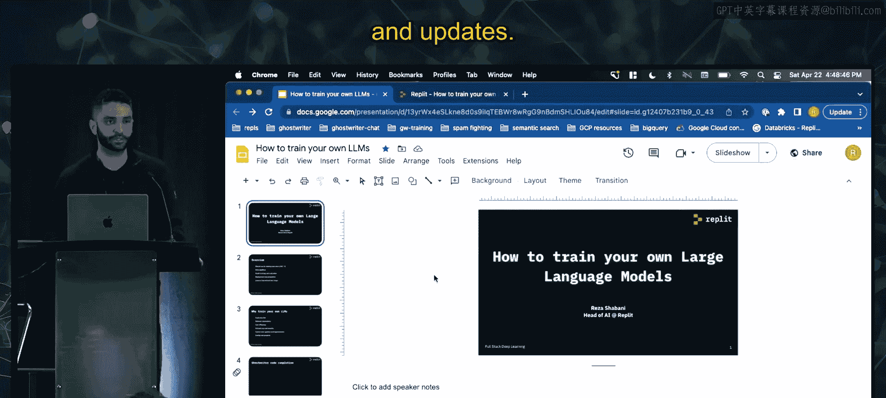

在本节课中，我们将学习如何从零开始训练自己的大语言模型。课程内容基于Replit公司近期发布的博客文章，涵盖了从数据准备、模型训练到部署上线的完整流程，并分享了实践中的经验教训。

## 概述

训练自有的大语言模型有多重价值。首先，**定制化**是关键。通用模型（如GPT-4）可能不擅长特定任务，例如代码补全。即使在代码领域，不同编程语言（如JSX、TSX）也需要针对性优化。其次，**降低依赖性**很重要，企业和开发者不应只依赖少数科技巨头。**成本效益**是另一个核心驱动力，通过训练更小、更高效的模型，可以大幅降低服务成本，惠及更多用户。此外，**数据隐私与安全**、**对模型更新与改进的控制权**以及**拥有模型的知识产权**也是重要考量。

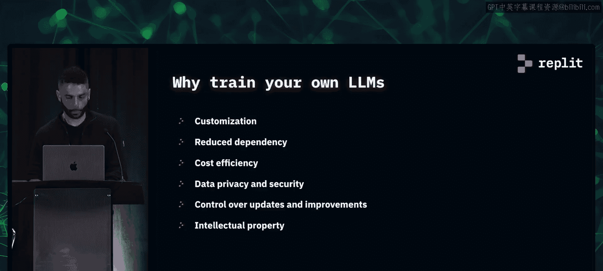

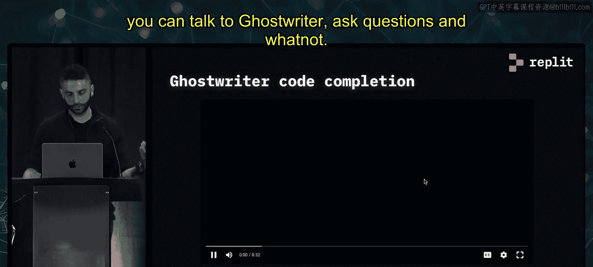

## 技术栈介绍

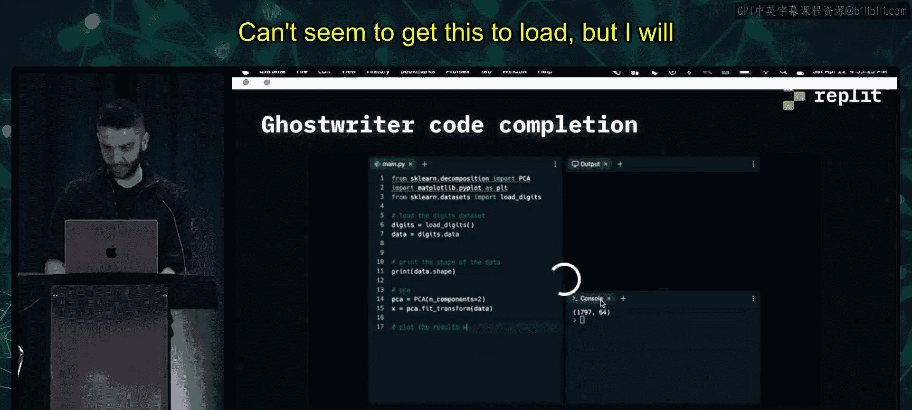

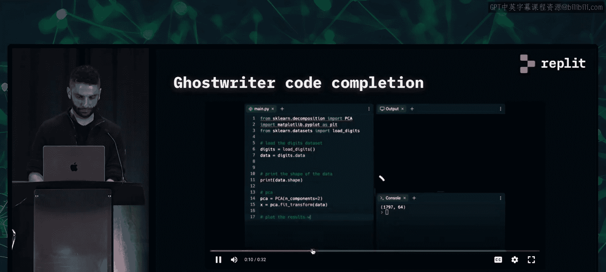

上一节我们探讨了训练自有模型的价值，本节中我们来看看实现这一目标所需的技术栈。Replit采用了一套现代LLM技术栈。

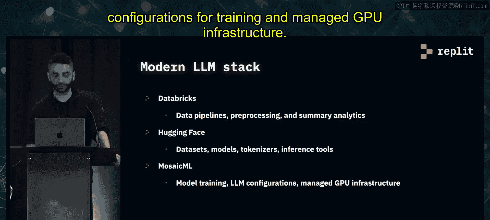

*   **Databricks**：用于所有数据管道，包括预处理、统计分析、转换等，是数据处理的核心平台。
*   **Hugging Face**：提供数据集、预训练模型、分词器及推理工具，是重要的资源库。
*   **Mosaic ML**：专注于GPU和模型训练的平台，能够轻松扩展GPU节点、运行分布式训练，并提供大量预配置的LLM训练方案。

整个流程可以概括为三个阶段：**数据处理**（Databricks）、**模型训练**（Mosaic ML）和**推理/生产部署**（将模型部署到服务器供用户访问）。

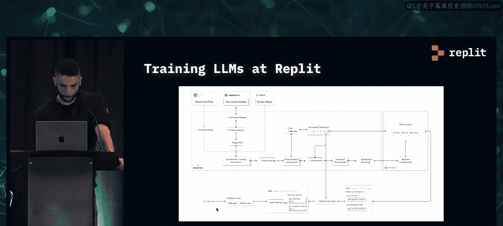

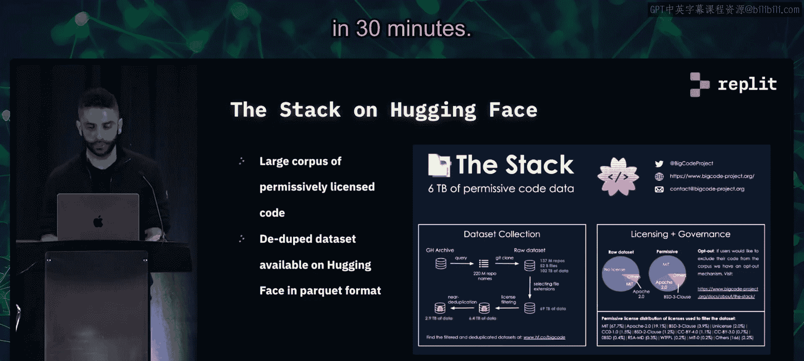

## 数据管道

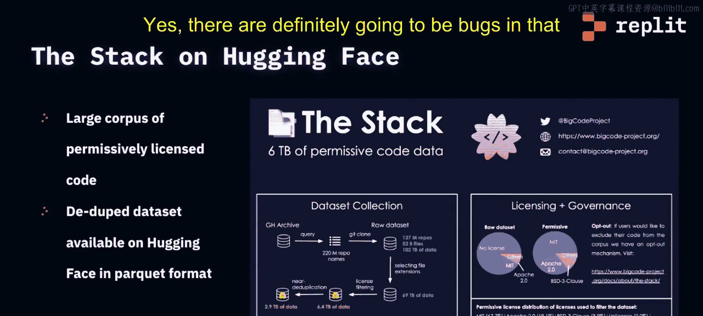

我们已经了解了整体技术栈，接下来深入探讨流程的第一步：数据管道。这是最耗时、最复杂的环节之一。

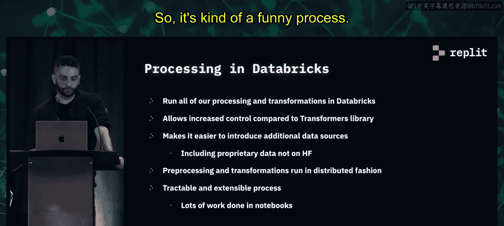

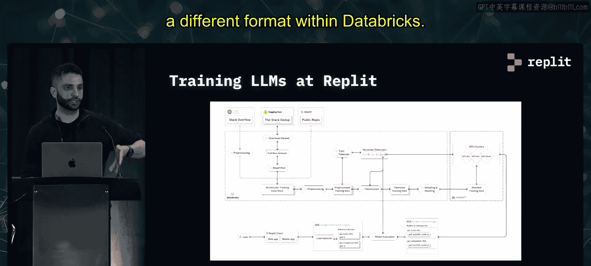

训练始于一个大型的、经过许可的代码数据集，例如Hugging Face上的 **The Stack (deduplicated)**。这个数据集源自GitHub存档，包含大量仓库，并经过了扩展名筛选、许可证过滤和去重处理，涵盖了约358种编程语言。

虽然基础数据集中可能存在错误代码，但我们可以通过后续步骤来提升数据质量。我们选择将数据从Hugging Face格式转移到Databricks进行处理，主要基于以下几点原因：

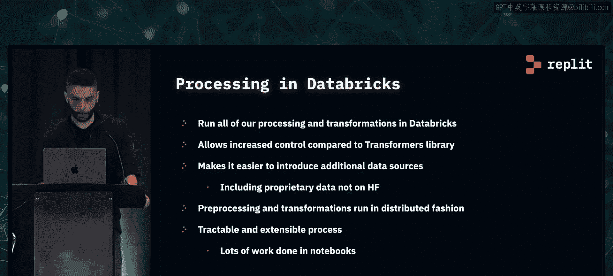

*   **更强的控制力**：相比Transformers库，Databricks允许在更大规模上、以更灵活的方式处理数据。
*   **便于集成多源数据**：可以轻松纳入专有数据或其他非Hugging Face数据集。
*   **强大的分布式处理能力**：能够显著加速预处理和转换流程。
*   **可追溯和可扩展**：整个流程可以在Notebook中完成，便于跟踪进度、记录数据分析和采样情况。

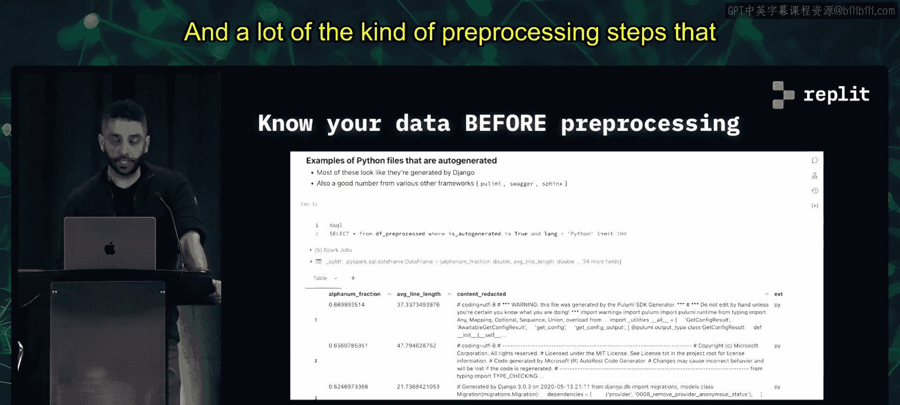

在Databricks中，深入分析数据至关重要。以下是数据预处理的关键步骤：

*   **数据匿名化**：识别并移除电子邮件、IP地址和密钥，用掩码令牌替换。
*   **移除自动生成代码**：使用正则表达式和启发式方法过滤掉由框架（如Django）自动生成的代码，避免引入重复和不良编码风格。
*   **移除无法编译/解析的代码**：尝试过滤掉存在错误的代码。例如，使用AST解析Python代码可以帮助移除Python 2的代码。
*   **应用多种过滤器**：基于平均行长度、最大行长度、字母数字字符百分比等进行过滤。

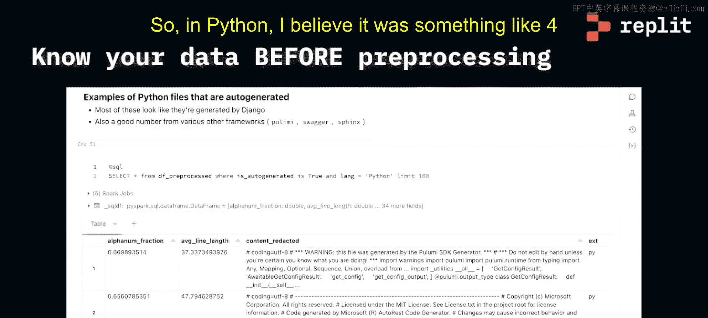

关于提升代码质量，虽然可以尝试基于GitHub星标数等指标进行过滤，但实践和论文表明其效果有限。

## 训练自定义分词器

在完成基础数据清洗后，另一个提升模型效率的关键步骤是训练自定义的分词器。分词器的核心由**分词算法模型**和**底层词汇表**构成。

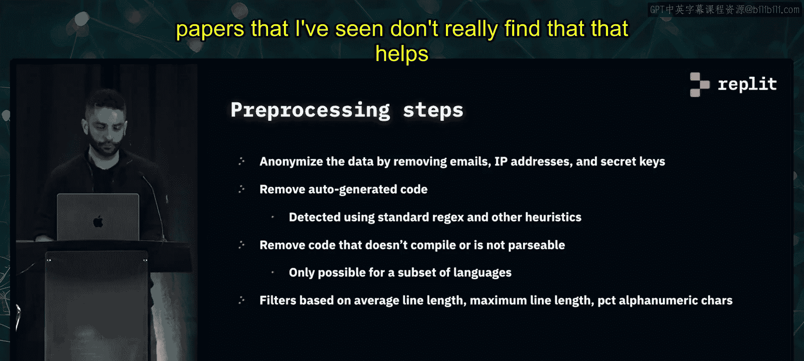

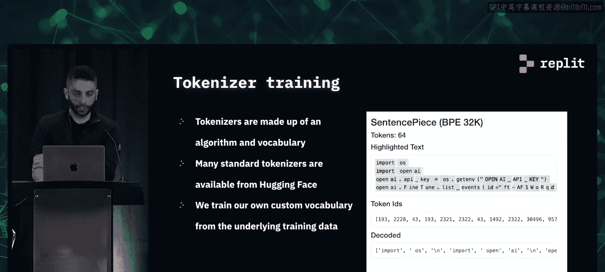

我们最初使用了Codex/CodeGen的分词器，但后来决定基于训练数据训练自己的词汇表。流程如下：使用预处理后的训练数据样本来训练分词器，然后测试其覆盖率。通常存在一个**词汇表大小的“甜点区”**，既能覆盖绝大多数令牌，又能保持词汇表较小。

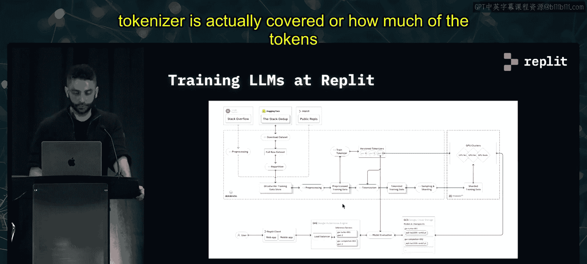

训练好的分词器会重新集成到数据管道、训练过程乃至推理阶段，因此一个优秀的分词器会长期服务于整个流程。自定义分词器的主要优势在于**领域适应性**。例如，Codex分词器（用于通用语言）在词汇表靠前位置包含大量自然语言词汇（如“French”, “minister”），而我们的Ghostwriter分词器（基于代码训练）在相同位置则更专注于代码相关的令牌。这使得我们的分词器**词汇量更小**，从而**加速了模型训练和推理**，并且**在相同的上下文长度内能捕获更多有效信息**。

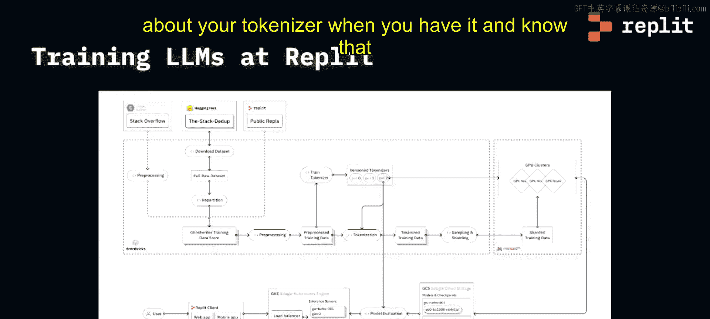

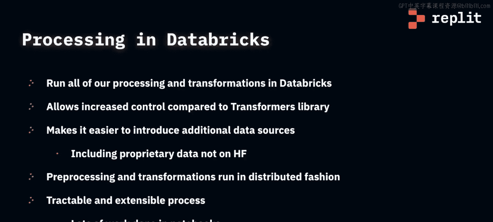

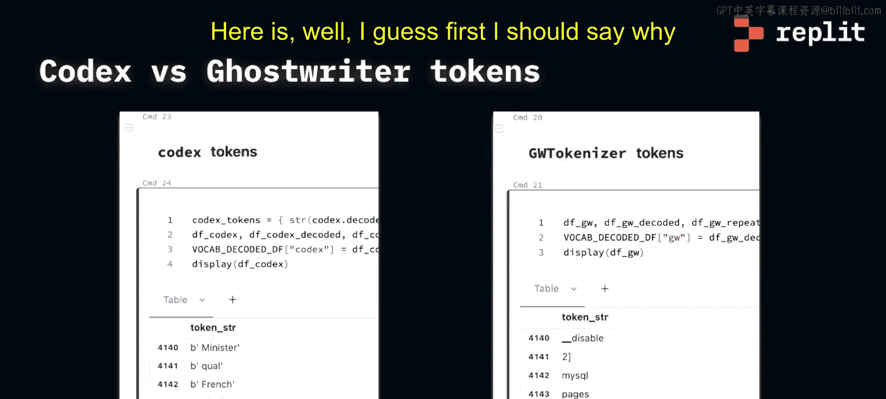

## 模型训练

拥有了高质量的数据和分词器后，我们就可以进入模型训练阶段。我们使用Mosaic ML平台进行训练。

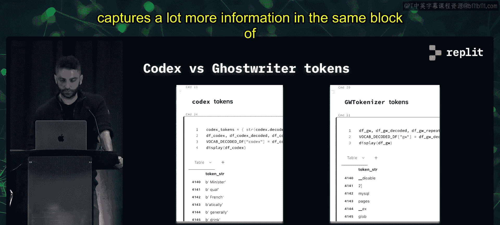

Mosaic ML的主要优势包括：
*   **多云GPU供应**：与多家云提供商合作，能更容易地获取GPU资源。
*   **精心调优的LLM训练配置**：提供了经过验证的学习率、批次大小等配置，确保损失曲线正常下降并充分利用GPU算力。
*   **托管基础设施**：具备容错能力，节点故障后可恢复。
*   **易用的CI/CD**：便于启动训练任务。

我们启动训练任务后，可以通过工具（如Weights & Biases）监控损失曲线的变化。

## 模型评估

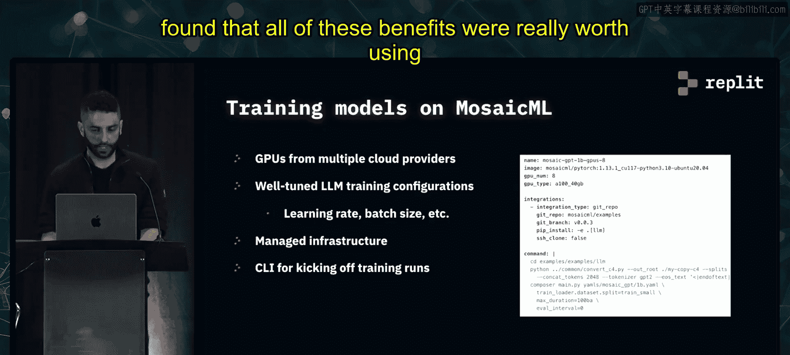

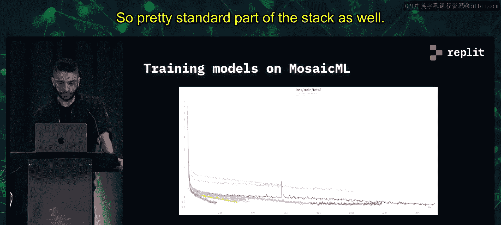

模型训练完成后，评估其性能是至关重要且富有挑战性的环节。对于代码模型，一个主要评估方法是 **HumanEval**。该方法向模型提供提示（例如，“编写一个返回1到N之和的Python函数”），模型生成代码后，我们执行该代码并运行测试用例来验证其正确性。Hugging Face的代码推理工具在此非常有用。

然而，评估面临诸多挑战：
1.  **耗时**：推理速度慢，运行数百个测试用例需要大量时间。
2.  **多语言支持**：为数十种编程语言创建可复现的测试环境很困难。
3.  **复杂任务评估**：对于如“创建一个HTML/JS/CSS登录表单”这类任务，难以用单元测试简单判断输出质量。
4.  **数据去污**：必须确保评估用的测试用例没有出现在训练数据中，否则会高估模型性能。

我们通过统计模型首次尝试即通过测试用例的比例来评估性能。但需注意，高分并不总代表好的用户体验，因此**将模型交给真实用户进行“感觉测试”（vibe check）同样重要**。

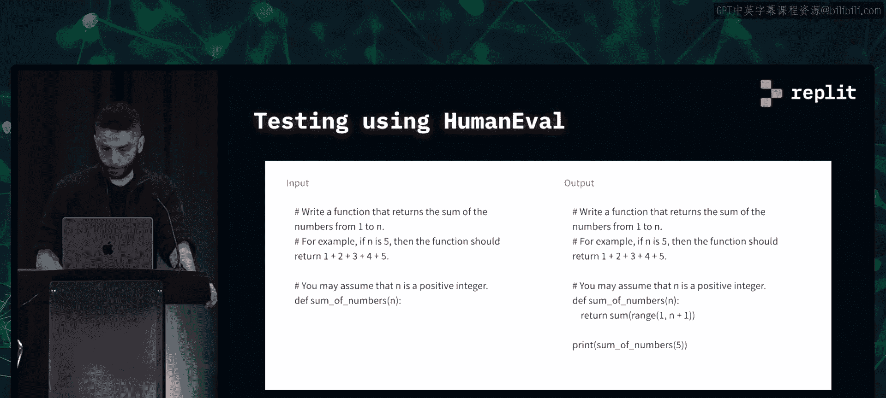

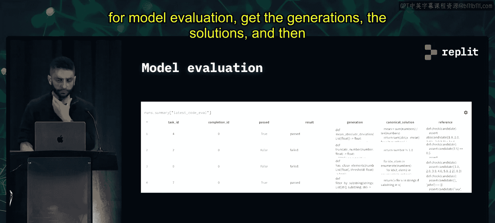

## 生产部署

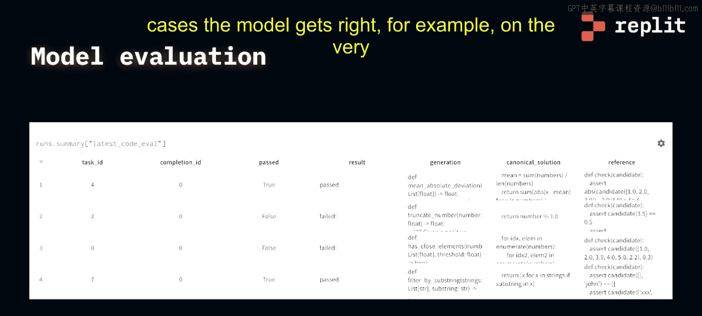

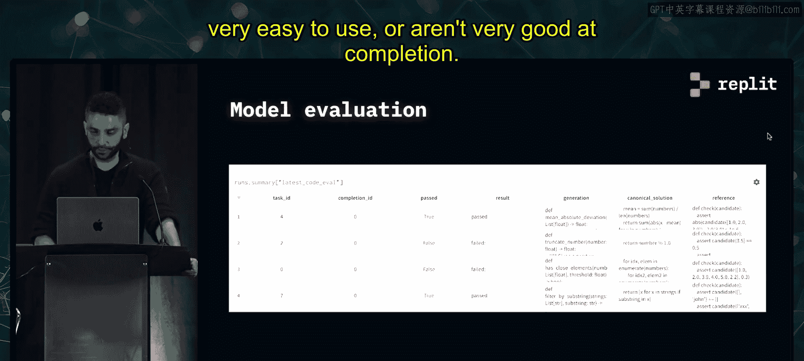

将训练好的模型投入生产是最后一步。我们使用 **FasterTransformer** 和 **Triton Server**。
*   **FasterTransformer**：在Transformer模型和底层GPU之间提供了一个高度优化的层。
*   **Triton Server**：支持在单个GPU实例上部署多个模型，并提供批处理、请求取消等功能，对满足低延迟需求至关重要。

我们利用现有的自动扩缩容基础设施来部署这些模型，但需要应对模型体积大、GPU需求特殊、区域GPU短缺等独特挑战。

## 经验教训与总结

回顾整个流程，我们总结了以下关键经验：

*   **数据是核心难点**：构建可扩展且支持快速迭代的数据管道至关重要。许多影响模型质量的杠杆实际上在于数据本身。
*   **评估是艺术与科学的结合**：除了自动化测试（如HumanEval），将模型交给真实用户进行直观感受测试（“vibe check”）不可或缺。
*   **团队协作至关重要**：训练配置、推理库支持、部署需求等环节需要紧密协作。例如，某些训练特性可能不被FasterTransformer支持或会拖慢推理速度。

最后，一个优秀的LLM工程师通常需要具备**研究与工程相结合的思维**、**大规模数据处理经验**、**扎实的技术基础（统计、算法）** 以及**熟练的软件开发技能（熟悉PyTorch/TensorFlow，重视CI/CD）**。

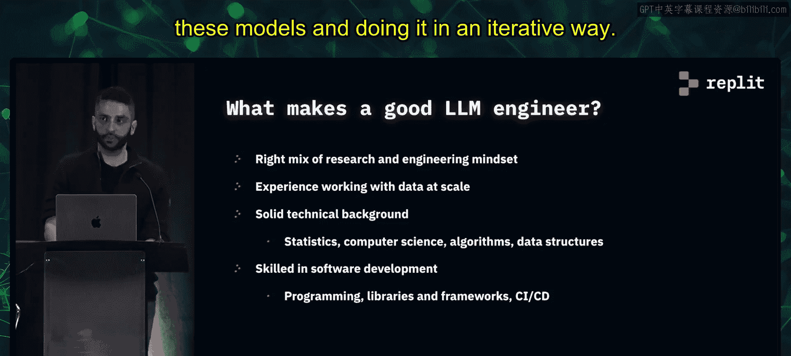

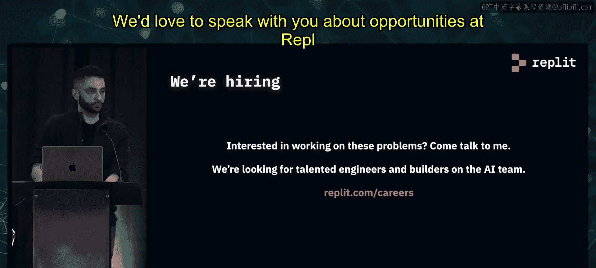

本节课中，我们一起学习了训练自有大语言模型的完整流程：从数据收集与处理、自定义分词器训练、利用Mosaic ML进行模型训练、使用HumanEval等方法进行评估，到最终通过FasterTransformer和Triton Server部署到生产环境。整个过程强调数据质量、迭代速度、全面评估和团队协作的重要性。