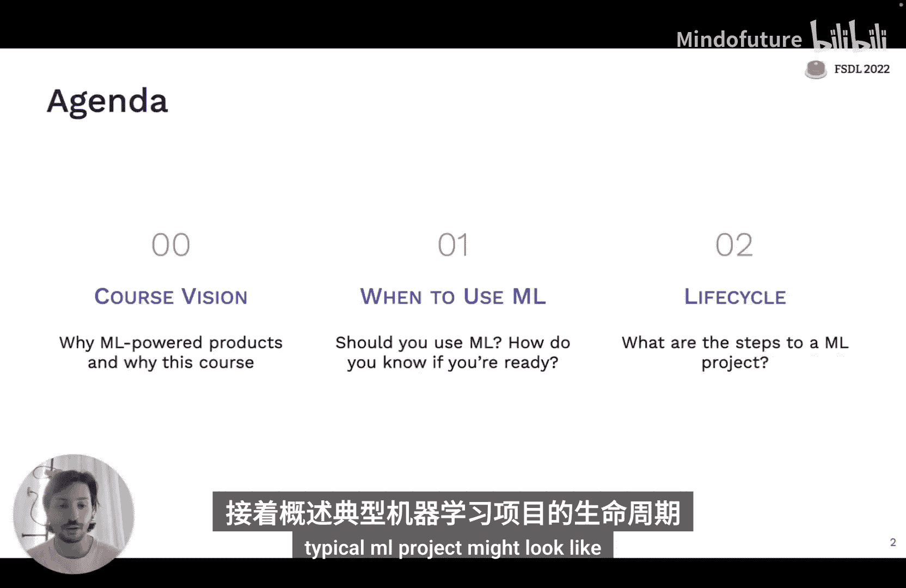
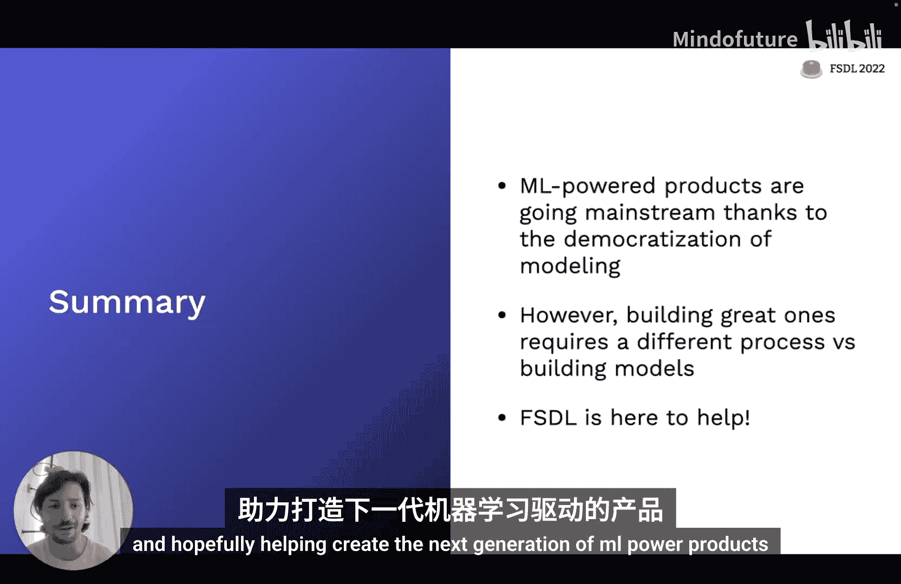
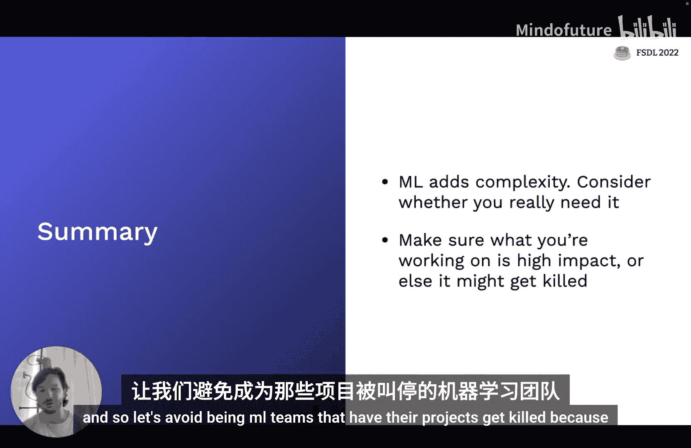
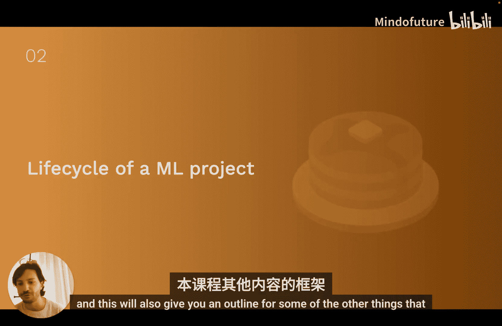
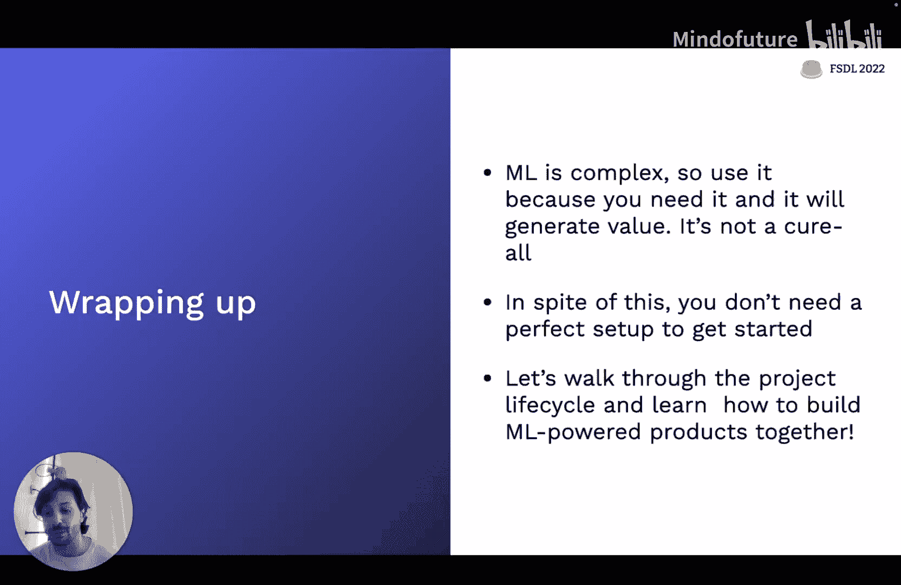

# 全栈深度学习：1：课程介绍与何时使用机器学习

在本节课中，我们将学习这门课程的目标与愿景，并探讨一个核心问题：何时应该使用机器学习技术。我们还将概述一个典型机器学习项目的生命周期，这构成了本课程后续内容的概念框架。

## 🎯 课程愿景：构建由机器学习驱动的产品

全栈深度学习课程旨在成为为构建机器学习驱动产品的人们提供的课程和社区。现在是一个讨论机器学习驱动产品的激动人心的时刻，因为机器学习正迅速成为主流技术。这一点可以从初创公司的融资、招聘信息以及大公司对该技术的持续投入中看出。

与2018年我们刚开始授课时相比，情况发生了巨大变化。当时，许多最令人兴奋的机器学习产品都是由最大的公司构建的。如今，由机器学习驱动的强大产品范围要广泛得多，不再仅限于大型公司。例如，像Descript这样的应用，以及初创公司构建的电子邮件生成工具。

这种快速变化的原因之一是**模型训练正开始变得商品化**。现在，使用像Hugging Face这样的工具，只需一两行代码就能部署最先进的NLP或计算机视觉模型。此外，许多框架（如Keras和PyTorch Lightning）正在围绕某些标准进行统一，减少了构建这些系统所需的“意大利面条式”代码。

展望未来，机器学习的历史特点是公众对该技术认知的起伏。为了避免重蹈“AI寒冬”的覆辙，我们不仅需要在研究上取得进展，还需要确保这些进展能转化为实际的产品。这就是我们避免重蹈覆辙的方式。

然而，构建机器学习驱动的产品，在许多方面需要与学术界开发模型的过程有根本性的不同。

## 🔄 从“平地球机器学习”到真实世界循环

在学术环境中开发模型的过程，可以被称为“平地球机器学习”。这个过程可能对许多人来说很熟悉：
1.  选择一个问题。
2.  收集一些数据。
3.  清理和标注数据。
4.  迭代开发模型，直到在收集的数据集上表现良好。
5.  评估模型，如果指标良好，则撰写报告、论文或幻灯片，然后完成。

但在现实世界中，如果你将该模型部署到生产环境，它不一定能在真实世界中长期表现良好。因此，机器学习驱动的产品需要一个**外部循环**：
1.  将模型部署到生产环境。
2.  测量模型与真实用户交互时的表现。
3.  使用真实世界的数据构建**数据飞轮**。
4.  将此过程作为外部循环持续进行。

仅仅因为你没有在机器学习系统中看到这个外部循环，并不意味着它不存在。本课程的核心就是关于如何完成构建机器学习驱动产品的这个过程。

### 本课程的目标与范围

以下是本课程旨在达成的目标：

*   **教授通用技能**：教授可用于构建机器学习产品的通用技能集，并理解机器学习产品各个部分如何组合在一起。
*   **介绍MLOps概念**：教授足够的MLOps知识以完成任务，但不会涵盖MLOps主题的全部深度。
*   **分享最佳实践**：分享我们在现实世界中看到的有效最佳实践，并尝试解释其背后的动机。
*   **助力求职**：教授一些可能有助于机器学习工程职位面试的内容。
*   **构建社区**：形成一个社区，供学员向同行学习现实世界中有效和无效的方法。

本课程**不打算**涵盖以下内容：

*   **从零开始教学**：本课程不打算从零开始教授机器学习或软件工程。如果你有机器学习学术背景但从未写过生产代码，或者是软件工程师但从未上过机器学习课程，你可以跟上本课程，但我们强烈建议你先学习相关基础知识。
*   **覆盖所有技术**：我们不会涵盖深度学习或更广泛的机器学习技术的全部广度。我们会讨论许多实践中使用的技术，但很可能不会讨论你特定用例的特定模型。
*   **培养领域专家**：本课程的目标不是让你成为机器学习任何单一方面的专家。虽然有相关的项目和实验，但重点不在于成为计算机视觉、NLP或其他任何机器学习分支的专家。
*   **专注于研究**：本课程也不旨在帮助你进行深度学习或任何其他机器学习领域的研究。
*   **全面的MLOps**：MLOps是一个涉及从基础设施、工具到组织实践的广泛主题，本课程的目标并非在此全面深入。

本课程的目标是向你展示端到端地构建一个机器学习驱动产品需要什么，并为你指出可能需要深入学习的领域，以解决你正在处理的具体问题。

### 关于实验项目

本课程的实验部分将围绕一个问题展开：创建一个应用程序，允许你拍摄手写文本页面的照片，然后将其转录为实际文本。

你将构建一个网络后端，用于接收网络请求、解码图像并将其发送给一个预测模型（OCR模型），该模型会将图像转录为文本。这些模型将由一个模型训练系统生成。我们将使用最先进的工具来构建这个系统，这些工具能在不增加太多复杂性的前提下，以有原则的方式完成构建。

**总结本节**：机器学习驱动的产品正在成为主流，这在很大程度上是因为如今构建机器学习模型比四五年前要容易得多。因此，未来的挑战在于：既然我们能够相对容易地创建这些模型，我们如何实际使用这些模型来构建优秀的产品？这正是我们将在本课程中讨论的主要内容。根本的挑战在于，构建优秀产品不仅需要不同的工具，还需要不同的流程和思维方式。

---

上一节我们介绍了课程的总体愿景和结构。接下来，我们将深入探讨一个在启动任何新机器学习项目时都应该首先问自己的关键问题。

## 🤔 何时应该（以及不应该）使用机器学习

本节我们将探讨机器学习适用于解决哪些问题。关键要点包括：首先，机器学习会引入很多复杂性，因此在准备好之前不应轻易使用，应考虑在将其引入技术栈之前用尽其他选项。另一方面，这并不意味着你需要完美的基础设施才能开始。我们还将讨论哪些类型的项目通常适合应用机器学习，以及如何判断项目是否可行且会对组织产生影响。

### 机器学习项目的高失败率

首先，一个关键事实是：机器学习项目的失败率通常高于一般的软件项目。虽然常被引用的“87%的机器学习项目失败”这个精确数字可能值得怀疑，但根据经验观察，失败率可能仍在25%左右，这仍然是一个很高的数字。

为什么会这样？一个值得承认的原因是，对于许多应用来说，机器学习从根本上说仍然是研究。但我们也认为，许多机器学习项目甚至在开始之前就注定要失败。

以下是几种常见的失败模式：

1.  **技术不可行或范围不当**：项目在技术上不可行，或者范围规划不当，导致开发第一个版本模型的工作量过大，项目因耗时过长看不到任何价值而失败。
2.  **模型开发与部署脱节**：一个擅长开发模型的团队可能不是将其部署到生产环境的合适团队。这导致模型在Jupyter笔记本中看起来很有希望，但从未成功跃升到生产环境。
3.  **组织内部对成功标准未达成共识**：组织内部对什么是成功没有达成共识。即使模型运行良好且知道如何部署，但组织的其他部分无法接受它实际运行并向用户提供预测。
4.  **解决了错误的问题（价值不足）**：模型运行良好，解决了设定的问题，但解决的问题不够大，组织认为不值得为引入该技术而增加额外的复杂性。

最后一点值得深入探讨：机器学习项目的门槛应该是，项目的价值必须超过开发成本，以及机器学习系统给软件带来的**额外复杂性**。

机器学习作为一种技术，往往比其他软件以更高的速度引入技术债务。原因包括：
*   **系统间边界模糊**：机器学习系统的预测会影响与之交互的其他系统。
*   **昂贵的数据依赖**：如果机器学习系统依赖于由系统其他部分生成的特征，那么维护这些依赖关系可能非常昂贵。
*   **常见的设计反模式**：在开发机器学习系统时，设计反模式很常见。
*   **受外部世界不稳定性影响**：用户行为的变化会显著影响机器学习模型的性能。

因此，在开始一个新的机器学习项目之前，你应该问自己：
*   **我们准备好使用机器学习了吗？**
*   **我们真的需要这项技术来解决这个问题吗？**
*   **使用机器学习来解决这个问题在伦理上是否合适？**

要判断是否准备好使用机器学习，可以问以下问题：
*   我们是否有产品？（是否有东西可以用来收集数据以判断是否有效？）
*   我们是否已经在以相同的方式收集和存储数据？（如果目前没有进行数据收集，那么构建第一个机器学习系统将会很困难。）
*   我们是否有能够完成这项工作的团队？

要知道是否需要机器学习来解决问题，首先应该问：**我们真的需要解决这个问题吗？** 还是我们只是出于对技术的兴奋而发明一个使用机器学习的理由？**我们尝试过使用规则或简单统计来解决这个问题吗？** 通常，你最终要部署的、将使用机器学习系统的第一个版本，应该是一个简单的基于规则或统计的系统，因为很多时候你可以用一些简单的规则获得复杂机器学习系统80%的收益。当然也有例外，但对于一般规则，如果你没有至少考虑过是否可以使用基于规则的系统来实现相同的结果，那么可能还没有准备好使用机器学习。

### 如何选择高影响力、低成本的机器学习项目

如果我们觉得组织已经准备好使用机器学习，并且知道正在处理的问题适合用机器学习解决，那么总结来说，就像任何其他项目优先级排序一样，你需要寻找**高影响力**和**低成本**的用例。

我们将讨论一些启发式方法，用于判断机器学习应用是否可能具有高影响力和低成本。我们将讨论诸如产品中的摩擦点、流程中的复杂部分、降低预测成本有价值的地方，以及观察行业内其他人正在做什么等启发式方法。后者是选择要处理问题的非常被低估的技术。

我们还将讨论一些启发式方法，用于从成本角度评估机器学习项目是否可行。总体优先级框架是：选择那些**可行**（低成本）且**高影响力**的项目。

#### 寻找高影响力项目的思维模型

以下是几种寻找高影响力机器学习项目的思维模型：

1.  **《AI经济学》**：这本书的核心观点是，人工智能从根本上降低了预测的成本。便宜的预测意味着预测将在更多地方发生，甚至发生在过去因成本太高而无法解决的问题中。这个思维模型的项目选择启示是：思考那些**廉价预测将产生巨大商业影响**的项目，即那些你现在会因为成本高而不愿雇佣大量人员来做预测的地方。
2.  **思考产品需求**：例如，Spotify的“每周发现”功能通过减少用户自己搜寻一切的摩擦，将一切打包呈现，从而极大地改善了产品。思考你的产品中哪些地方可以通过减少摩擦来增加价值。
3.  **机器学习擅长解决的问题**：Andrej Karpathy的“软件2.0”文章提出，机器学习在你可以用机器学习（梯度下降）替换现有软件系统中非常复杂的部分（一堆手写规则）时特别有用。如果你系统中有一个部分是复杂的、手动定义的规则，那么这可能是用机器学习自动化的绝佳候选。
4.  **观察行业内的实践**：查看其他人在你的行业中用机器学习做什么。可以阅读大公司的论文、早期技术公司的博客文章，以及行业报告和案例研究，以获取灵感和了解如何解决问题。

#### 评估机器学习项目成本

我喜欢从三个主要驱动因素来思考机器学习项目的成本：
1.  **数据可用性**（最重要）
2.  **准确率要求**
3.  **问题本身的内在难度**

**关于数据可用性**，需要问的关键问题包括：
*   我们是否已经拥有这些数据？如果没有，获取（和标注）的难度和成本有多大？
*   我们总共需要多少数据？（这很难预先评估，但如果有办法猜测是5000、10000还是100000个数据点，这是一个重要的输入。）
*   数据的稳定性如何？如果底层数据预计不会随时间发生太大变化，那么项目可行性就高得多。
*   有什么数据安全要求？如果你能从用户那里收集数据并用于重新训练模型，那对项目的总体成本是有利的。反之，如果你甚至无法查看用户生成的数据，那么项目成本会更高，因为调试和构建数据飞轮会更困难。

**关于准确率要求**，需要问的问题包括：
*   做出错误预测的成本有多高？（从自动驾驶汽车（成本极高）到推荐系统（单次错误影响较小））
*   系统需要多频繁地正确才能有用？（例如，DALL-E 2作为创意辅助工具，生成数千张图像并选择最喜欢的一张，不需要每次都正确。）
*   模型做出错误预测的伦理影响是什么？

**关于问题难度**，需要问的问题包括：
*   这个问题是否足够明确，可以用机器学习解决？
*   其他人是否在处理类似的事情？（不一定完全相同，但如果是一个从未用机器学习解决过的新问题，会引入很多技术风险。）
*   他们解决这个问题实际需要多少计算资源？（包括训练和推理）
*   人类能解决这个问题吗？如果能，这通常表明机器学习系统可能能够解决它，但并非完美指标。

**准确率要求为何是重要成本驱动因素？** 根本原因是，根据观察，项目成本往往随着准确率要求的提高而**超线性增长**。作为一个非常粗略的经验法则，每次你在所需准确率上增加一个“9”（例如从99.9%到99.99%），可能会导致项目成本增加10倍，因为你可能需要至少10倍（甚至更多）的数据，并且可能需要大量额外的基础设施、监控和支持来确保模型实际达到该准确率。

**关于问题难度**，需要指出的是，预测机器学习项目的可行性是出了名的困难。这个领域发展如此之快，如果你不跟上最先进的技术，你对可行性的理解很快就会过时。

一个常听到但并非完美的启发式方法是“Andrew Ng启发式”：一个正常人在一秒钟内能做的任何事情，我们都可以用AI自动化。虽然有一些例子支持这个说法（如图像内容识别、语音理解），但也有明显的反例（如理解人类幽默或讽刺、复杂的手部物体操作、泛化到从未见过的新场景）。因此，这不是一个推荐用于严肃评估项目可行性的启发式方法。

目前，机器学习中仍然困难的领域包括：
*   **强化学习问题**（尽管在某些用例中，拥有大量数据和计算资源时，强化学习可以解决现实世界问题）。
*   **监督学习中的特定问题**，如问答、文本摘要、视频预测、3D建模、真实世界语音识别、抵抗对抗样本、做数学题、解决文字问题等。

我们可以尝试对仍然困难的问题类型进行推理：
1.  **输出复杂、高维或模糊的问题**：例如3D重建（高维）、视频预测（高维且模糊）、对话系统（开放性强、模糊）、开放式推荐系统。
2.  **需要高可靠性/鲁棒性的问题**：机器学习系统往往会以各种意想不到且难以推理的方式失败。任何需要高精度或鲁棒性的地方都会更困难，例如安全地处理分布外数据、抵抗对抗攻击、高精度要求下的3D物体位姿估计。
3.  **需要良好泛化到新数据的问题**：这包括需要系统进行类似推理、规划或理解因果关系的问题。例如，自动驾驶汽车中的边缘情况处理、控制问题（尽管现在越来越多地融入机器学习），以及数据量小的场景。

### 如何评估项目可行性并开始行动

总结一下，你应该如何尝试评估机器学习项目是否可行？
1.  **首先问**：我们真的需要用机器学习来解决这个问题吗？
2.  **预先投入工作**，与所有最终需要签署项目的人一起定义成功标准，避免机器学习团队孤立工作，导致项目因无人真正需要解决该问题或其解决方案的价值不值得给产品增加的复杂性而被取消。
3.  **考虑使用机器学习解决此问题的伦理问题**（本课程后期会有专门讲座讨论）。
4.  **进行文献综述**，确保有类似问题的研究案例。
5.  **尝试快速构建一个带标签的基准数据集**，以便开始了解模型表现如何。
6.  **仅在此之后，构建一个最小可行模型**（可能只是手动规则或简单线性回归）。
7.  **如果可行，将其部署到生产环境**，或者至少在你现有的问题上运行它，建立一个基线。
8.  **最后，重新审视**：一旦构建了这个可能甚至不使用机器学习的最小可行模型，认真问自己，这对于现在来说是否足够好，或者是否值得投入额外的努力将其转变为复杂的机器学习系统。

### 机器学习项目的三种原型及其启示

并非所有机器学习项目都具有相同的特征，因此不应以相同的方式规划所有项目。我想讨论三种不同类型的机器学习项目原型，以及它们对项目可行性和有效运行项目的影响。这三种原型根据它们与真实世界用户的交互方式来定义：

1.  **软件2.0用例**：定义为利用机器学习，将当前软件已经做的事情（产品中已有的部分）做得更好、更准确或更高效。它是将产品中已经自动化或部分自动化的部分，通过机器学习增加更多自动化或更高效的自动化。
2.  **人在回路系统**：将当前系统中尚未自动化、但人类正在做或可以做的事情，通过基于机器学习的工具来帮助人类更高效、更准确地完成工作，或者通过提供建议来防止他们需要对每个数据点都进行处理，从而简化他们的流程。人在回路系统旨在让最终做出决策的人类更高效或更有效。
3.  **自主系统**：将人类今天做的事情（或者今天根本没有做的事情）完全自动化，达到实际上不需要人类进行判断的程度。

每种原型在启动项目前需要问的关键问题有所不同：
*   **对于软件2.0项目**：你如何知道你的模型实际上比现有基线表现更好？你有多大把握机器学习可能带来的性能改进会为你的业务创造价值？这些性能改进是否会导致**数据飞轮**？
*   **对于人在回路系统**：系统需要多好才能有用？如果系统只能自动化最终决策或生产最终产品的人类10%的工作，这对他们有用吗？还是会拖慢他们？你如何收集足够的数据使其达到那个有用的阈值？
*   **对于自主系统**：系统的可接受故障率是多少？你需要性能阈值达到多少个“9”才能避免对世界造成伤害？你如何保证它不会超过那个故障率？（例如，自动驾驶汽车团队投入大量精力构建模拟和测试系统。）

**关于数据飞轮**：对于软件2.0，我们讨论了能否构建一个数据飞轮，导致系统性能越来越好。数据飞轮是一个良性循环：随着模型变得更好，你能用更好的模型打造更好的产品，从而吸引更多用户；随着用户增多，用户生成更多数据，你可以用这些数据构建更好的模型。这个循环中的每个连接都很重要：要让更多用户允许你收集更多数据，你需要有一个**数据循环**（自动收集数据并决定标注哪些数据点的方法）；要让更多数据带来更好的模型，这取决于你作为机器学习从业者将更多、更细粒度的数据和标签转化为对用户表现更好的模型的能力；要让更好的模型带来更好的用户，你需要确保更好的预测确实让你的产品变得更好。

这三种项目原型在可行性-影响力矩阵上具有不同的权衡：
*   **软件2.0项目**：由于只是将已知可以自动化的事情做得更好，往往**更可行**，但由于它们已经在回答已知问题，**影响力也往往较低**。
*   **自主系统**：由于准确率要求通常很高，往往**非常难以构建**，但**影响力也可能非常高**，因为你正在替换一个根本不存在的东西。
*   **人在回路系统**：往往介于两者之间，你可以用这种机器学习产品范式构建以前不存在的东西，但由于仍然需要人类利用其判断来补充机器学习模型，**影响力没有那么高**。

有方法可以移动这些类型项目在可行性-影响力矩阵上的位置，使它们更有可能成功：
*   **对于软件2.0项目**：通过实施**数据循环**，构建持续改进的数据飞轮，并可能利用从用户与系统交互中收集的数据来未来自动化更多任务，从而使其具有更高的潜在影响力。
*   **对于人在回路系统**：通过良好的产品设计（产品本身的设计范式可以降低这些系统的准确率要求）以及采用不同的心态（让系统足够好并发布到真实世界，以便开始观察真实用户如何与之交互，并利用从“人在回路”中获得的反馈来改进模型），可以使其**更可行**。
*   **对于自主系统**：通过添加**安全护栏**，或在某些情况下添加**人在回路**，可以使其**更可行**（例如，自动驾驶汽车项目早期配备安全驾驶员，或引入远程操作以便在出现问题时人类可以接管系统）。

### 避免“工具迷恋”陷阱，以合理规模开始

尽管讨论了机器学习的复杂性、可行性等，我绝不是说在开始使用机器学习之前必须进行大量的规划。关键是确保你正在处理的项目是正确的项目，然后就直接开始投入。

特别是，我认为过去几年中出现的一种应该避免的失败模式是陷入**工具迷恋**的陷阱。随着MLOps学科的兴起，市场上出现了大量帮助机器学习过程不同部分的工具。我注意到，这导致很多人普遍认为在开始之前真的需要完美的工具。**你不需要完美的工具来开始，也不需要完美的模型**。仅仅因为Google或Uber在他们的技术栈中包含了特征存储或以特定方式服务模型，并不意味着你也需要那样做。

本课程的很多内容将尝试讨论在从生产角度以正确方式做事和不在项目早期引入过多复杂性之间的中间地带。这就是为什么全栈深度学习是一门关于以实用方式构建机器学习驱动产品的课程，而不是一门专注于最先进、最佳可能基础设施的MLOps课程。

一个与此概念相关的我很喜欢的演讲和博客文章是Covariant的一些人提出的“**合理规模的MLOps**”。其核心论点是：你不是Google，你可能拥有有限的计算预算，而不是整个云；你的团队可能人数有限；你可能没有无限的预算；你的数据量也可能有限。这些你与Uber或Google之间的差异，对于你解决问题的正确技术栈有影响。因此，值得分开考虑这些情况。

**总结本节**：机器学习是一项非常强大的技术，但它确实增加了很多复杂性。因此，在开始一个机器学习项目之前，你应该仔细思考是否真的需要机器学习来解决你正在解决的问题，以及考虑到它增加的复杂性，这个问题是否真的值得解决。让我们避免成为那些因为处理对业务无关紧要的事情而导致项目被取消的机器学习团队。

---

上一节我们探讨了何时应该使用机器学习，以及如何选择有价值的项目。现在，让我们来看看一旦决定启动一个机器学习项目，你将经历哪些步骤来实际执行它。这也将为你概述本课程后续可以期待的其他内容。

## 📊 机器学习项目生命周期概述

我们将使用一个修改版的问题作为贯穿始终的案例研究：**姿态估计**。我们的目标是构建一个在机器人上运行的系统，它接收机器人的摄像头数据流，并利用它来估计场景中每个物体在3D空间中的位置和方向（旋转），以便将其用于下游任务，特别是输入到一个单独的模型中，该模型将告诉机器人如何实际抓取场景中的不同物体。

机器学习项目像任何其他项目一样，始于**规划和项目设置阶段**。在这个阶段，我们可能进行的活动包括：决定研究姿态估计问题、确定成本、分配所需资源、考虑伦理影响等。这很大程度上是我们本节课到目前为止讨论的内容。

规划好项目后，我们将进入**数据收集和标注阶段**。对于姿态估计，这可能包括：收集我们将要训练模型的物体样本、设置传感器（如摄像头）来捕获这些物体的信息、实际捕获这些物体，并找出如何用真实值（如这些图像中物体的姿态）来标注这些捕获的图像。

关于机器学习项目生命周期的一个重要点是：**这不是一条直线路径**。机器学习项目往往非常迭代，每个阶段都可以反馈到之前的任何阶段，因为你对你正在处理的问题有了更多了解。例如，你可能会意识到获取数据来解决这个问题实在太难了，或者很难在3D空间中标注这些物体的姿态。但也许我们可以更便宜地标注像素级分割。那么，我们能否重新表述问题，利用我们从数据收集和标注中学到的东西来规划一个更好的项目？

一旦有了一些数据可以处理，你就进入了**训练和调试阶段**。在这里，我们可能会为模型实现一个基线（可能不使用复杂的神经网络，而只用一些OpenCV函数）。然后，找到一个最先进的模型并复现它，调试实现，迭代我们的模型，运行一些超参数扫描，直到它在我们的任务上表现良好。

这可以反馈到数据收集和标注阶段，因为我们可能意识到实际上需要更多数据来解决这个问题，或者可能发现我们用于标注数据的过程存在缺陷，需要重新审视数据标注过程。我们也可以一路循环回项目规划阶段，因为我们可能意识到这个任务比想象的要难得多，或者我们在规划阶段指定的需求相互冲突，需要重新审视哪些最重要。例如，我们可能认为需要将物体姿态估计的准确率要求设定为十分之一厘米，同时模型推理的延迟要求设定为百分之一秒以在机器人硬件上运行。然后我们可能意识到，我们无法同时满足极高的准确率要求和极快的推理速度。那么，是否可以放宽其中一个假设？

一旦你训练了一个在离线任务上表现相当好的模型，你的目标就是**部署该模型，在真实世界中测试它，然后利用这些信息来确定下一步的方向**。对于这个项目，这可能看起来像是在实验室中试点抓取系统（在推广给实际用户之前，在真实场景中测试），以及编写测试以防止回归和评估模型中的偏见，最终将其投入生产、进行监控并持续改进。

我们可以从这里反馈到训练和调试阶段，因为通常我们会发现，在离线数据集上表现良好的模型一旦进入真实世界，实际表现并不如我们想象的好。这可能是因为我们对模型的准确率要求是错误的（实际上需要更高的准确率），或者我们关注的准确率指标实际上并不是下游任务成功真正重要的指标。这可能导致我们重新审视训练阶段。

我们也可以循环回数据收集和标注阶段，因为我们在真实世界中可能发现的一个常见问题是：我们收集的训练数据与实际测试时看到的数据之间存在不匹配。我们可以利用从中学到的东西去收集更多数据，或者挖掘困难案例（挖掘我们在生产中发现的失败案例）。

最后，正如之前提到的，我们甚至可以一路循环回项目规划阶段，因为我们意识到我们选择的指标并不能真正驱动我们期望的下游行为。仅仅因为抓取模型准确，并不意味着机器人实际上能够成功抓取物体。因此，我们可能需要使用不同的指标来真正解决这个任务，或者我们可能意识到模型在真实世界中的表现并不那么好，可能需要为模型添加额外的要求（例如，它需要更快才能在真实的机器人上运行）。

这些是你在承担任何特定机器学习项目时可能进行的活动。但为了成功，你还需要一些**跨项目**的东西，我们也会在课程中讨论：你需要能够作为一个团队在这些问题上协作，并且需要拥有正确的基础设施和工具来使这些流程更具可重复性。这些也是我们将涵盖的主题。

**总结本节课**：机器学习是一项复杂的技术，因此你应该因为需要它或者认为它会创造巨大价值而使用它，但它不是万能的。它不能解决所有问题，也不会自动化你想自动化的每一件事。因此，让我们选择那些有价值的项目。但尽管如此，你不需要完美的设置就可以开始。让我们在本课程的剩余时间里，逐步讲解项目生命周期，并了解每个阶段以及我们如何利用它们来构建优秀的机器学习驱动产品。