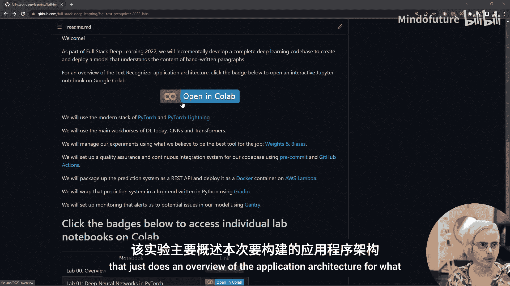
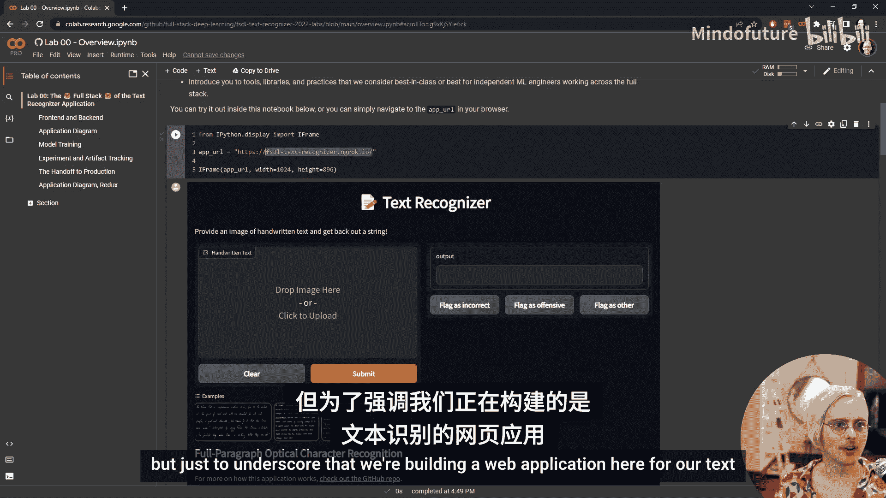
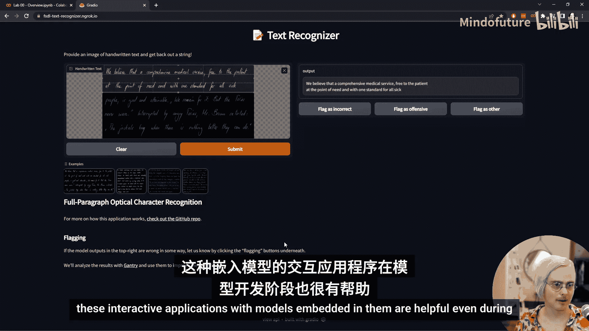
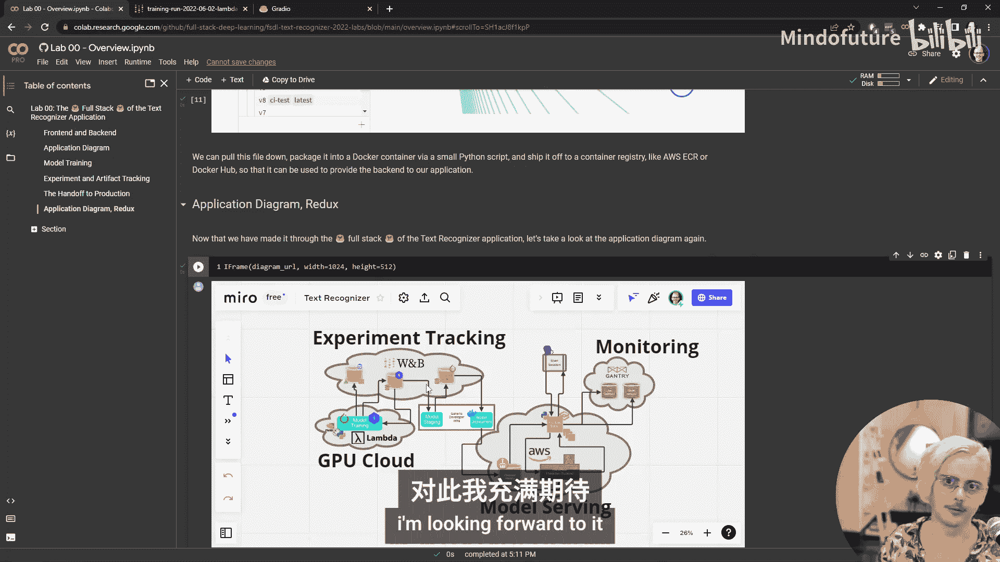

# 全栈深度学习：第2章：实验室介绍与概览 🧪

在本节课中，我们将学习全栈深度学习2022课程的实验部分。我们将从高层次了解将要构建的文本识别应用程序，学习如何在Google Colab上开始实验，并熟悉我们将用于实验的Jupyter Notebook格式。

## 开始实验

首先，我们需要访问实验的GitHub仓库。您可以在本视频的描述中找到链接。这个仓库保存了所有实验材料。

在README部分，您可以找到实验的描述以及一系列标有“在Colab中打开”的徽章。点击这些按钮即可开始实验。

现在，我们点击第一个实验的按钮，该实验概述了我们将要构建的应用程序架构。

## 使用Jupyter Notebook

现在，我们进入了一个由Google免费托管的Jupyter Notebook环境。您只需要一个Google账户即可使用。

Jupyter Notebook由不同类型的单元格混合组成。您可以使用箭头键上下导航，高亮显示会在不同的单元格之间移动。

每个单元格要么是Markdown单元格，包含描述代码的文本和媒体；要么是纯代码单元格。我们可以在单元格下方看到输出结果。

这种格式非常适合混合解释、代码和交互式组件，非常适合教育环境或作为出色的文档。

## 应用程序概览

我们首先在Notebook中以内嵌iframe的形式嵌入了将要构建的应用程序。为了强调我们正在构建一个用于文本识别的Web应用程序，我们直接打开了该链接。

这是一个我们将要构建的网页。左侧是我们可以放置图像以供文本识别系统处理的地方。我们可以从示例图像中选择一张并提交，看看会发生什么。

等待片刻后，我们得到了输出结果。左侧显示了我们相信为患者提供全面医疗服务，在需要时免费，并为所有病人设定统一标准等。让我们仔细看看这个输出。

这是一个来自我们文本识别系统的Python字符串。它说我们相信为患者提供全面医疗服务，在需要时免费，并为所有病人设定统一标准。这里有一个“E”字母，所以它并不完美，会犯一些错误，但在这个输入上表现相当不错。

还有其他样本可供尝试。您也可以上传自己的输入或编辑我们已有的输入。例如，如果我们放大之前出错的部分并提交，错误可能会消失。这表明存在一些上下文效应导致网络在那里犯错。

这些嵌入了模型的交互式应用程序即使在模型开发过程中也很有帮助。

## 前端与后端

我们刚才看到的是应用程序的前端，即面向用户的组件。为了尽可能简化，并使一个人能够构建整个应用程序并理解所有内容，我们将完全使用Python构建前端。

但前端并不是全部。前端只是我们渲染给用户看，以便他们与应用程序交互的部分。模型不必放在同一个地方。接收图像并输出文本的机器学习算法（模型）不必与应用程序的前端放在同一个地方。

我们将后端放在亚马逊网络服务（AWS）中，这是一个用于构建无服务器应用程序的工具。我们将在后续详细讨论这意味着什么以及为什么为机器学习模型选择它。

但关于前端和后端区分最重要的是，我们的前端和后端是相互独立的。仅仅因为我们构建了这个用Python编写的前端，并不意味着我们只能在该上下文中使用我们的模型。

以下单元格快速向该后端模型发送一个ping请求，发送一张图像，然后等待它返回预测的文本。我们使用了一些专为处理Web服务设计的Python库。我们发送了一个图像的URL，并返回了该图像中的文本。

因此，我们的模型能够获取原始字符串形式的文本，我们可以用Python代码与之交互。我们可以把它放在其他地方，也可以从命令行与之交互，或者用JavaScript构建前端。

## 应用程序架构图

为了了解这些部分如何组合在一起以及它们与应用程序其他部分的关系，我们来看一个图表。这是一个用Miro构建的交互式图表，Miro是一个很好的可视化工具，让我们可以看到所有这些部分如何组合在一起，甚至可以直接嵌入到这个Jupyter Notebook中，无需跳转到其他网页。

我们从顶部的用户会话开始。这是与我们的模型交互的人。他们使用Gradio库与Python中的前端服务器通信。该前端服务器做两件事：向在AWS Lambda上执行预测的后端发送请求；以及处理用户通过标记按钮提供的反馈，我们将使用一个名为Gantry的工具来接收、分析这些反馈，并用其改进我们的模型。

关于如何运行我们的服务器和后端的信息，存储在亚马逊网络服务的容器注册表中。容器是使用Docker构建的。这是我们构建模型的方式与它们最终投入生产、与用户交互的方式之间的交接点。

## 从模型训练到生产部署

我认为在这一点上停下来，从头开始回顾是有帮助的：从模型训练开始（如果您上过涵盖深度学习的课程，并讨论过使用PyTorch在GPU上训练模型，这应该很熟悉），然后通过迭代构建模型的过程，直到我们准备好将其投入生产。所以我们将从另一个方向来处理这个交接。

首先，我们需要确定将使用哪种计算机来构建我们的神经网络。因为神经网络通过执行一系列非常大的矩阵乘法和其他数组操作来工作，这些操作在GPU上比在CPU上快得多。我们需要GPU来进行计算。这就是我们使用Google Colab作为提供实验的方式之一的原因，因为它提供免费的GPU。

要在Colab中设置GPU，请转到“运行时”->“更改运行时类型”，选择硬件加速器并选择GPU。对于本实验，应该已经为您设置好了。为了检查我们是否确实拥有GPU，我们可以运行命令 `nvidia-smi`。这类似于`top`命令或检查正在运行的进程，但只针对GPU。我们可以看到我们有一个GPU（例如Tesla P100），目前还没有任何程序在上面运行，因为我们还没有为构建完整应用程序做任何事情。

我们使用Lambda Labs GPU云。如果您有兴趣获得比家用机器或Colab免费提供的更多计算资源，可以查看它们。

因为我们在GPU上完成所有繁重的工作，实际上我们不需要用某种快速语言编写大部分模型开发代码。最终，我们将在GPU上使用较低级别的库运行程序，所以使用一种即使稍慢但更容易编写的语言是很有意义的，因为性能瓶颈发生在GPU上用C++进行的操作上。

深度学习领域使用的语言是Python。有非常棒的库用于在Python中开发神经网络，这些库可以从Python进行GPU加速，并且拥有训练神经网络所需的功能，如自动微分，以便我们可以轻松运行梯度下降。

PyTorch库弥合了Python和C++之间的差距，为我们提供了所需的GPU加速数组数学运算以及一系列神经网络基元和架构。以下单元格演示了与Torch交互的基本方式：创建张量（或数组）、进行数学操作，然后请求梯度。

然而，PyTorch在开发神经网络时仍然有点底层。它不包含用于训练神经网络的高级框架或任何其他类型的工程任务，例如在模型训练时保存工作。因此，我们使用PyTorch Lightning作为我们的高级训练工程框架。PyTorch Lightning有非常棒的文档，包括嵌入在Notebook中的视频。我们将在未来的实验中详细讨论如何使用PyTorch和PyTorch Lightning。

## 开发工具

我们拥有了构建模型所需的库。我们缺少的是围绕模型构建的开发工具。创建机器学习模型有点像编写代码：我们试图创建一个可以执行某些操作（接收一些输入，返回一些输出）的计算机程序。只是这个计算机程序恰好是张量中的一堆巨大数字。

因为这与通用软件开发相似，我们需要开发工具；但又因为它们如此不同，我们需要略有不同的开发工具。最重要的事情之一是能够在我们进行更改时跟踪进展情况，而基线Git版本控制在这方面做得并不好。

因此，我们使用Weights & Biases工具来解决这些问题：在我们尝试不同配置值时跟踪实验，并跟踪在进行这些实验时生成的工件（或大型二进制文件）。

让我们在Notebook中下拉一个Weights & Biases页面，就像我们对应用程序所做的那样。您可以看到这里有很多信息：图表显示我们的模型随时间推移和跨周期的表现；模型的输入和输出、真实标签；以及各种其他信息，如系统指标。使用Weights & Biases工具为我们记录了大量丰富的信息。

我们还可以利用这些信息创建漂亮的仪表板，用于向人们传达结果：将它们放在拉取请求上、用作博客文章分享、用于内部沟通、检查长时间运行的训练作业等。我们整合这些信息并添加注释和附加信息，以便更容易得出见解。

## 从训练到生产

一旦我们训练和开发了模型，运行了实验，就需要将其转化为可以在生产中使用的东西。PyTorch Lightning会在整个训练过程中将模型权重的当前值保存到磁盘。我们将这些存储在Weights & Biases云上。然后，当它们准备好部署到生产环境时，我们将它们编译成一个更独立的工件，该工件不需要我们所有的开发代码。

因为我们将该工件存储在Weights & Biases上，我们可以查看它。因此，我们的模型文件与一堆非常有用的元数据和其他信息一起保存。我们可以看到该工件的谱系：在创建它过程中生成了哪些其他工件，以及为了创建那些工件运行了哪些作业。

## 总结

在本节课中，我们一起学习了全栈深度学习2022课程的实验部分。我们从高层次了解了将要构建的文本识别应用程序，学习了如何在Google Colab上开始实验，并熟悉了Jupyter Notebook格式。

我们探讨了应用程序的前端与后端架构，了解了它们如何通过Web服务进行通信。我们还回顾了从模型训练（使用GPU、PyTorch和PyTorch Lightning）到使用Weights & Biases进行实验跟踪和工件管理，再到最终通过容器化部署到生产环境（如AWS Lambda）并与用户交互的完整流程。

通过图表，我们看到了所有这些部分（用户会话、前端服务器、后端预测服务、反馈收集与分析工具、容器注册表）如何组合在一起，形成一个持续改进的机器学习应用程序。

在接下来的实验中，我们将深入探讨如何将这些部分组合在一起，构建一个可工作的、持续改进的机器学习应用程序。