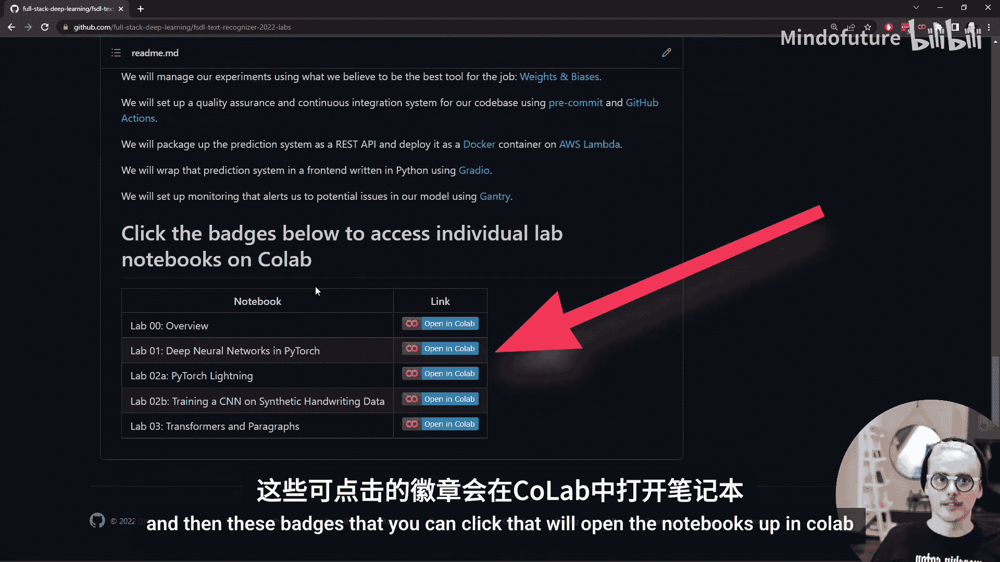
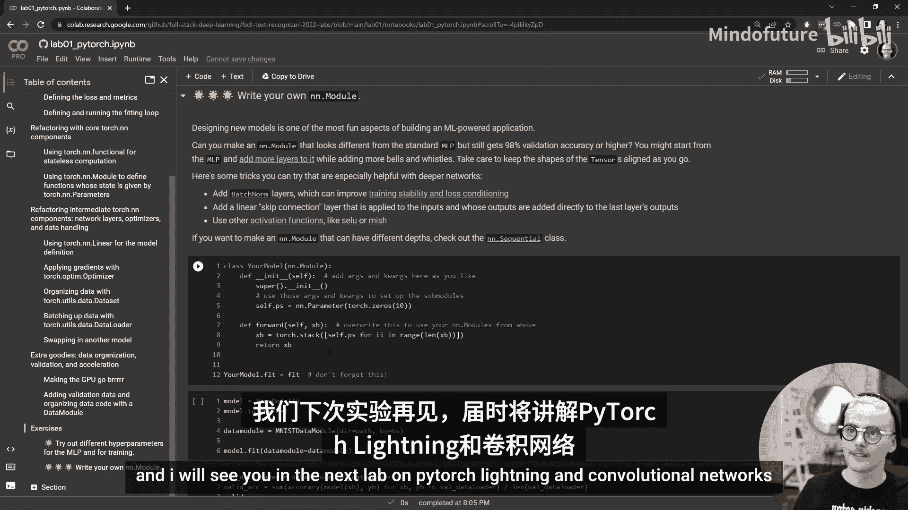

# 全栈深度学习：Lab 01：PyTorch中的神经网络 🧠


欢迎来到2022版全栈深度学习的第一个正式实验课。我是Charles，今年我协助更新了实验内容，非常高兴能与大家分享。让我们开始吧。

## 概述

在本节课中，我们将学习如何使用PyTorch构建和训练神经网络。我们将从最基础的PyTorch张量操作开始，逐步引入更高级的抽象，最终构建一个简洁的文本识别系统代码库。通过这个过程，你将掌握PyTorch的核心组件。

## 实验环境与结构

今年的所有实验资料都存放在GitHub仓库中。你可以看到已经存在Lab 1、2、3的文件夹，随着课程进行，我们会添加更多内容。我们将迭代式地构建一个用于训练文本识别系统的深度学习代码库。

查看Lab 1的目录结构，它目前非常简单，只有一个名为`text_recognizer`的库，该库主要包含处理数据和模型的两个部分。



当我们查看Lab 2的目录时，会发现新增了一个用于训练的库，同时`text_recognizer`库也变得更为复杂，例如我们添加了Lightning模型等组件。

如果你在本地进行开发，需要克隆此仓库。每周我们发布新实验时，你可以再次克隆更新。如果你在课程结束后观看，只需克隆一次即可获得所有实验内容。进行实验时，进入每个实验文件夹，在Jupyter中打开相应的笔记本即可。

关于如何设置本地开发环境的更多细节，你可以查看关于设置本地开发的视频。这要求你拥有一台带GPU的Linux本地机器或在云端设置一台。最简单的方式是使用Google Colab。

回到主README页面并向下滚动，你可以找到一个包含所有实验的表格，以及可以点击的徽章，这些徽章将在Colab中打开相应的笔记本。我将点击第一个实验的徽章。


## 实验内容：深度神经网络与PyTorch

在这些视频中，我不会逐行讲解实验内容。笔记本中已有大量文字和内容来解释其中发生的一切。因此，在这些视频中，我将概述如何使用每个实验，并重点介绍一些关键内容。

首先，我们需要熟悉这些笔记本。我想介绍的第一个内容是这里的设置单元格。这是在每个实验开始时都需要运行的部分。在Colab上运行它会克隆仓库并设置环境。如果你在本地运行，则不需要克隆或设置环境，它只是将我们带到正确的目录，以便我们准备就绪。

运行完成后，它会打印出我们所在的目录（Lab 1的目录）及其内容。我们可以看到`text_recognizer`库。从那里，我们可以继续并完成实验。

请注意，这些笔记本不是静态的，你可以根据需要编辑和更改它们。例如，我可能好奇那个文件夹里有什么，因此我可以添加一个额外的单元格，并在该单元格中编写自己的Python代码或Shell命令。

例如，我可以发出一个Shell命令来查看`text_recognizer`目录内的内容：
```bash
find text_recognizer -type f -name "*.py"
```
我也可以运行Python代码，例如导入`text_recognizer.data.utils`，并在实验中使用双问号`??`来检查一个对象。运行这个命令会在笔记本内显示该Python对象的源代码和文档。你也可以使用更熟悉的`print`或`display`来查看对象。

在这里，我们可以看到这个实用程序库包含一个`BaseDataset`类。

在本实验的其余部分，我们将逐步理解这个`BaseDataset`类的作用以及`text_recognizer`库模型部分的组件。我们将在学习整个PyTorch库的过程中完成这些。

这个实验笔记本的工作方式是，我们首先仅使用PyTorch最基础的部分（即`torch`张量及其数学运算）来构建一个完整的神经网络训练流程。然后，我们逐步用`torch`内部更高级的抽象，最终用`text_recognizer`库中的组件替换其中的部分。最终，我们得到一种更简洁、更清晰的方法来拟合神经网络，并尝试不同的数据和模型。在后续的实验中，我们将在此基础上继续扩展。

## 使用笔记本的注意事项

关于这些实验和笔记本，最后还有两点需要说明。

第一，你需要按顺序从上到下线性地运行这些笔记本。如果我在这里滚动阅读但没有执行单元格，然后遇到一个感兴趣的单元格并运行它，可能会遇到错误，例如“Xtrain未定义”。这是因为运行到该单元格时，期望你已经运行了之前的所有单元格。如果发生这种情况，你可以重新运行当前单元格之前的所有单元格。在Colab中，可以通过“运行时”->“运行之前”来实现。其他类型的笔记本也有类似功能。

如果我们执行这个单元格，会看到它运行了，所有变量都已定义，所有库都已导入，一切已设置就绪。如果遇到这种方法也无法解决的问题，那么你应该重新启动笔记本。在Colab中，选择“运行时”->“重启运行时”，这将使你回到起点。

第二，我想提一下实验笔记本末尾的练习题。这些练习题是为了让你在想要深入了解技术栈的某个特定组件时使用。它们不是强制性的，只是为了你的学习受益。也许这次你不想深入学习PyTorch，那也没关系。练习题标有小星星，星星的数量旨在表示完成该练习的难度或所需的工作量。

*   **一星练习**：可能只是更改已实现函数的参数，观察它们的作用，或者以稍微不同的方式使用我们已经讨论过的库组件。
*   **三星练习**：需要你阅读我们使用的某个库的文档，并扩展我们所做的工作，添加新的功能或组件。
*   你还会发现一些介于两者之间的**二星练习**。

关于本实验我要说的就是这些。请开始深入学习PyTorch、`torch.nn`吧。我将在下一个关于PyTorch Lightning和卷积网络的实验中与大家再见。



## 总结


本节课我们一起学习了如何设置和使用全栈深度学习的实验环境，了解了实验代码库的迭代式结构，并明确了第一个实验的目标：从PyTorch基础开始，逐步构建一个文本识别系统。我们还掌握了有效使用Jupyter笔记本进行实验的注意事项。现在，你可以开始动手探索PyTorch的世界了。