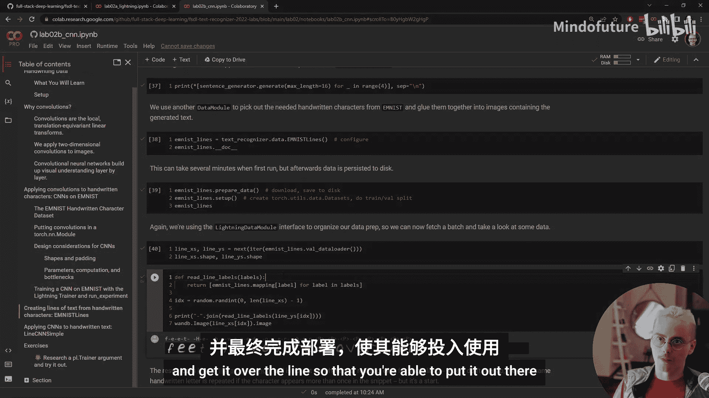

# Full Stack 深度学习 ｜ Full Stack Deep Learning   2022 p04 P04_Lab_02-PyTorch_Lightning与卷积神经网络 -BV1k4YXznEjw_p4-

Hey there folks， welcome to the second lab of FSDL 2022。

 today we'll be covering Pytorch lightning and convolutional neural networks。So once again。

 we're gonna start from the Github repo for the labs in that repo。

 whether you're on Gitthub or if you've cloned it locally， if you navigate to lab2 folder。

 you'll see in the notebooks folder， we've got two lab notebooks this time one covering ptorrch lightning and one covering convolutional neural networks I'm gonna use the notebooks via coab again So going back to that main page scrolling down to the bottom and clicking these badges to open the notebooks in coLab So the first lab 2 a introduces ptorrch lightning。

 which is our training framework on top of ptorrch in lab1 we wrote a training loop using just components of torch starting with torch tensors and then adding features of torch do NN and other libraries inside pytorrch and we ended up with something like this pseudocode here that worked well for the problems we were trying to solve in that notebook fixed data set fairly simple models as we started to try and add more features like GPU acceleration。

We found out that it was insufficiently flexible to handle all the problems that we wanted to handle And in general。

 it's also hard to reuse a pytorch training loop that you write yourself unless you've written enough of them that you know all the things that you're gonna want to do in the future Also this is something that lots and lots of people want to do if you're using pytorch you're probably using it to train neural networks so you're probably gonna want to do a lot of these things with data loaders and moving to and from GPUus and applying gradients。

 this is really kind of like shared boilerplate and it's got lots of sharp edges， difficult things。

 surprising behaviors this is a classic case where you want to use a library or a framework rather than rolling your own and pytorrch lightingning is one of the most popular frameworks for training in pytorch Pytorch lightingning is a really rich library with tons of features and components we're going to focus on some of the most important ones which are lightning modules that go on top of our torch modules and connect them to training Lightning data modules which organize our torch data loaders and data。

😊，The Pytorch Lightning trainer， which takes those things。

 puts them together and does our actual training loop and our validation loop and our testing loop and then pytorch lightning callbacks that allow us to add features to training turn on model checkpointing and turn off model checkpointing without having to rewrite code So the notebook walks you through Pytorch lightning and its components I'm not gonna focus on that bit of it and I'm instead going focus on how lightning gets used in the full stack deep learning code base that we're building up to make this text recognition system So with each lab we're going add additional components to this code base slowly iteratively building up to a code basease that's capable of training models and deploying them and monitoring them The previous lab all we had was models and data Now the textre our library has a new component lit models that has our pytor lightning modules in it right now there's just a baseline version will add more throughout the course of the labs bigger。

Is now we have a new library training on top of our text recognizers。

 this contains the things that we need to train our models。 So most importantly。

 this run experiment do pi script。 you'll be using this script to train models。

 you can run it from inside a Jupiter notebook。 There's some example commands here that show you how to get the help documentation from the script。

 but you don't necessarily have to just use this experiment running framework as a script。

 It's also an import module inside training。 So you can bring it into the Jupyter notebook and take a look at its components。

 if you want to play around with them dynamically。 So where this training script really gets used is in the second lab to train convolutional neural networks。

 So let's jump over to that。 So the second lab lab to be covers convolutional neural networks。

 There's a lot of material on what convolutions are and why we use them and also how to design convolutional neural networks。

 So read through the notebook to get that information In this video I wanted to focus on using the run experiment。

😊，That's this section here。 So I've already run through the notebook up to this point。

 remember that you want to run the notebooks top to bottom。

 otherwise the bottom cells won won't run So this cell here will run training it uses GP if they're available I'm going run this and walk you through the outputs that appear So first we see just some information from p towards lightning about what hardware we have available some logging messages then we see a summary of our model including number of trainable parameters and what layers we have and then we see this progress bar pop up progress bar is showing our progress through and epoch of training you can see as batches go through this progress bar is filling up there's also some metric reporting that's happening behind my head once we get towards the end of the epoC validation starts you can see the validation started there and once validation finishes we run the model on the test set we get some reported metrics there performance on training validation and test and we also see that the model got saved as。

Checkpoint this collection of cells here walks you through how to reload models from a checkpoint and then run them and play around with them in the notebook。

 I think it's really important to always interact with your models and your data in order to understand your problem better It's really easy to just get obsessed with metrics and charts and watching numbers go down or go up and lose connection with the actual problem that you're trying to solve。

 And the end result of this is always going to be a model that looks good on paper false flat on its face as an actual component of an m powered product。

 I always like to as quickly as possible get my models back into an interactive context where I can play with them。

 So that's what this cell is doing here sending different inputs through our model One of the neat things about this is you'll pretty quickly discover that there are some ambiguous inputs in this dataset。

 So the model says that this particular input is probably a number0 and that's a good guess。

 but it might be a capital O or a lowercase It might even be like a kind of slanted D So there's some。

😊，Examp in this dataset set， some classes that are really easy to confuse with each other。

 and that actually means that doing character recognition at a single character level is probably a bad idea because normally you would use context to disambiguate is this a zero or a capital or a lowercase that's going depend on what other letters are around it but our model because it just sees one character at a time can't really disambiguate between these cases。

 That's something that you could find out by looking at the data but you wouldn't see it necessarily in the metrics。

 So then the last thing that we do in this lab is try and resolve that issue with the ambiguity of single characters really in the end we don't care about recognizing individual characters we care about handling text that people are submitting to us and no one's going want to sit around and submit one character at a time to our model The first step that we want to do is work on lines of handwritten text and our data only has individual characters so you might think we have to go back and get new data in order to keep going one of most。

😊，Important tricks for avoiding a really expensive and complex data collection process is to use data synthesis to bootstrap the data that you have so you can train a basic model that can get out there in the world and then start collecting the data that you really want to train on。

 We build a kind of fake lines of handwritten text data set by using a data set of sentences the brown corpus and then just using those handwritten text and digits to create these lines of text。

 So let's see what that looks like。 We've just taken those individual images of handwritten characters and put them next to each other to create this line of text。

 So this synthetic line data is not perfect。 Let's see a few more of them。😊，Yeah。

 these don't look exactly like text that you might encounter in the real world。

 The handwriting style is inconsistent， it kind of maybe looks like a ransom note of like pasted together text。

 but this is a start It's really great for codebased development and idea generation to at least have something that looks closer to the actual data that will bring up problems that are actually gonna come around when you have the real data to try out more complex modeling approaches。

 data handling approaches and you can incorporate it into training alongside real data to improve your model performance and get it over the line so that you're able to put it out there。

