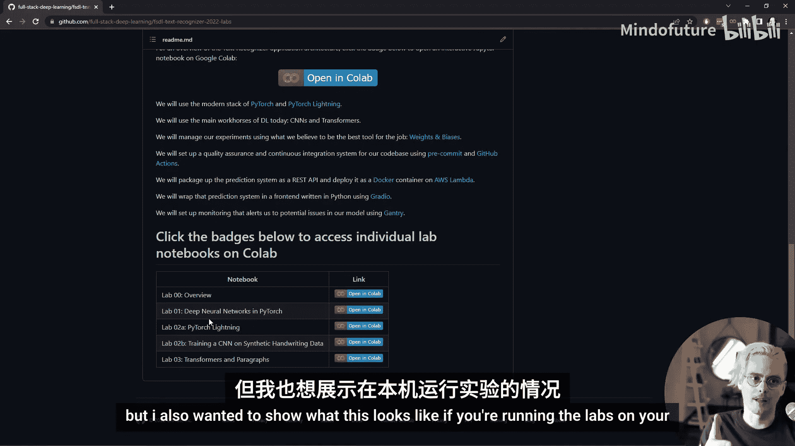
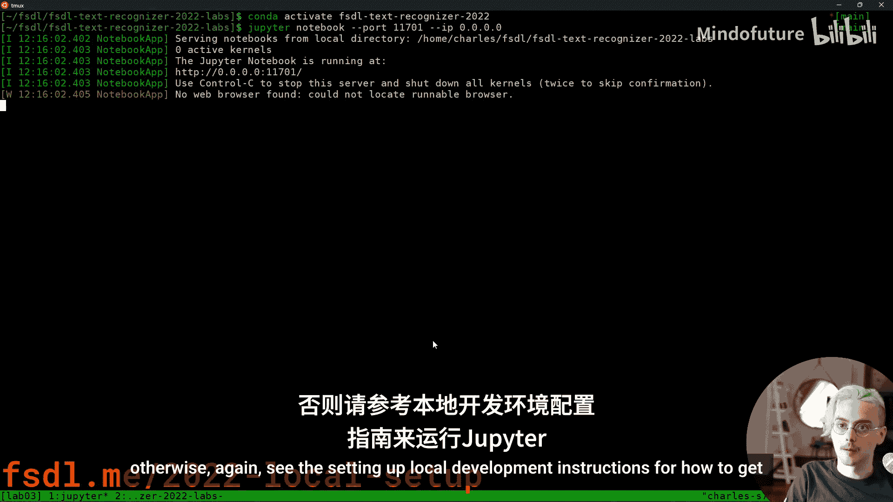
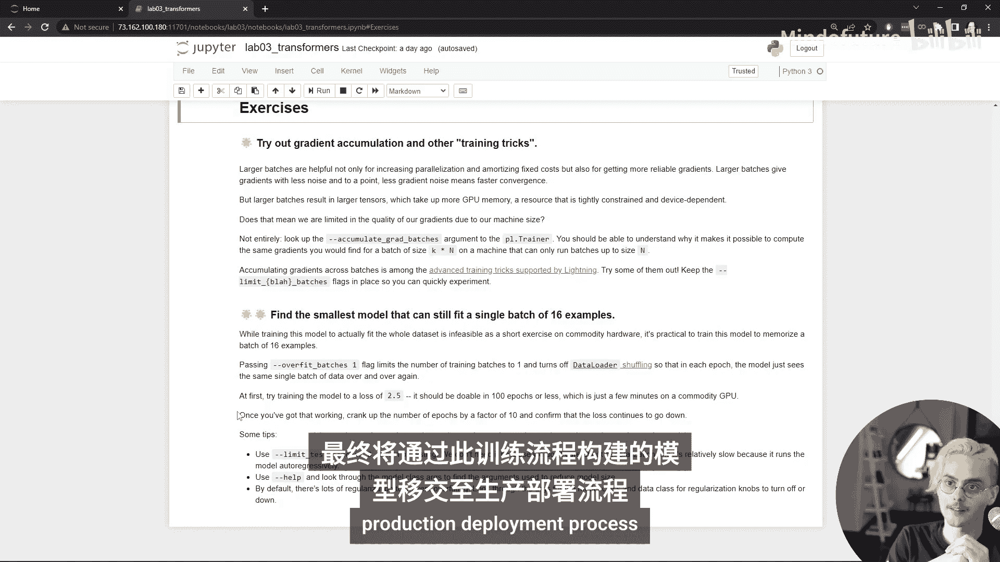

# 全栈深度学习：Lab 3：Transformers与段落识别 🧠


在本教程中，我们将学习Transformer架构，并将其应用于手写文本段落的识别任务。我们将介绍ResNet-Transformer模型，并了解其训练与推理过程的差异。

## 概述

本节将介绍Transformer架构的核心概念，以及为何它在序列建模任务中逐渐取代了循环神经网络。我们将重点讲解在文本识别系统中使用的ResNet-Transformer模型。





## 环境与代码准备

首先，我们需要准备好开发环境。你可以通过以下两种方式之一运行本实验：

1.  在Google Colab上运行：访问GitHub仓库，点击底部的“Open in Colab”链接。
2.  在本地机器上运行：确保已激活课程专用的Conda环境（`fsdl-text-rec-2022`），并按照本地设置说明完成配置。然后，从仓库根目录导航至 `lab3/notebooks/`，打开 `transformers.ipynb` 笔记本文件。

**重要提示**：请务必按顺序从上到下运行笔记本中的单元格，并首先运行初始的设置单元格。

## Transformer架构简介

上一节我们准备好了环境，本节中我们来看看Transformer架构。Transformer是一种用于序列建模的神经网络架构，近年来因其强大的并行计算能力和优异的性能，在自然语言处理等领域广泛应用。

Transformer的核心优势在于其能够并行处理整个序列，这与需要顺序处理的循环神经网络（RNN）有本质区别。这种并行性使得Transformer在训练时效率更高。

## ResNet-Transformer模型

了解了Transformer的基本思想后，我们来看看本实验将使用的具体模型——ResNet-Transformer。该模型结合了卷积神经网络（CNN）和Transformer的优点。

模型结构如下：
1.  **编码器**：使用一个小型ResNet对输入图像进行编码，提取视觉特征。
2.  **解码器**：使用一个Transformer解码器，将编码后的特征解码为字符序列。

以下是模型前向传播（推理时）的核心逻辑伪代码：
```python
def forward(images):
    encoded_inputs = resnet.encode(images)  # 使用ResNet编码图像
    outputs = []
    for step in range(max_sequence_length):
        # 将当前输出和编码输入送入Transformer解码器
        step_output = transformer.decode(encoded_inputs, current_outputs)
        outputs.append(step_output)
        # 判断是否所有序列都已生成结束符
        if all_sequences_finished:
            break
    return outputs
```

## 训练与推理的差异

Transformer模型在训练和推理时运行方式不同，这是其高效训练的关键。

在**训练**时，我们使用“教师强制”策略。这意味着在解码的每一步，我们都将真实的上一时刻标签（而非模型自己预测的上一时刻输出）作为解码器的输入。这可以防止错误在训练早期累积，并允许并行计算整个输出序列。

在**推理**（或验证、测试）时，我们没有真实标签。因此，模型必须使用自己在前一步预测的输出，作为下一步解码的输入，形成一个自回归的循环过程。

这种差异体现在代码中：
*   **训练**：调用 `teacher_forward(inputs, ground_truth_labels)` 方法。
*   **推理**：调用常规的 `forward(inputs)` 方法。

## 处理变长输出

我们选择Transformer架构的一个主要原因是它能够处理**固定大小输入，变长输出**的问题。

以下是查看数据批次中段落长度变化的示例代码思路：
```python
# 从数据加载器中获取一个批次
batch = next(iter(data_loader))
images, labels = batch
# 图像尺寸是固定的（例如，H x W），但每个标签（段落）的字符长度各不相同
print(f"图像尺寸: {images.shape}")
print(f"各段落长度: {[len(label) for label in labels]}")
```
尽管所有输入图像被调整为相同尺寸，但其中的手写段落包含的字符数量（即输出序列长度）却各不相同。Transformer解码器能够根据编码后的输入，动态生成不同长度的序列，完美适应这一需求。

## 模型训练配置与技巧

由于ResNet-Transformer模型比之前介绍的模型更大、更复杂，我们需要使用GPU进行加速，并采用一些技巧来提升训练效率。

以下是启动训练时可能用到的一些关键配置（以PyTorch Lightning为例）：
```python
trainer = pl.Trainer(
    gpus=1,                       # 使用GPU加速
    max_epochs=10,
    precision=16,                 # 使用16位混合精度训练，节省显存并加速
    limit_train_batches=10,       # 仅使用10个批次进行训练（快速调试）
    limit_val_batches=2,          # 仅使用2个批次进行验证
    limit_test_batches=1,         # 仅使用1个批次进行测试
)
```
**参数说明**：
*   `precision=16`：启用自动混合精度训练。大部分计算使用16位浮点数以提升速度和减少显存占用，但某些操作会自动保持32位精度以保证数值稳定性。
*   `limit_*_batches`：限制每个周期使用的批次数量。这在模型调试和超参数快速尝试时非常有用，可以避免漫长的完整数据遍历。

如果遇到显存不足（OOM）错误，可以尝试进一步减小 `batch_size`。

## 过拟合单个批次

在正式开始大规模训练之前，一个重要的模型调试步骤是尝试**过拟合单个批次**。

这个练习的目的是：确保模型有足够的能力（容量）来学习训练数据。如果能快速过拟合一个很小的数据集（如单个批次），则说明模型的前向传播、反向传播和优化器配置基本正确，没有严重的bug。

以下是进行此练习的建议步骤：
1.  将训练和验证数据都限制为仅一个批次。
2.  使用较高的学习率。
3.  训练几百到一千个步骤。
4.  观察损失是否迅速下降，字符错误率是否趋近于0。

如果模型无法过拟合单个批次，则可能需要检查模型架构、数据预处理流程或损失函数是否正确。

## 总结

本节课中我们一起学习了：
1.  **Transformer架构**的基本原理及其并行计算的优势。
2.  **ResNet-Transformer模型**如何结合视觉编码和序列解码来完成文本识别任务。
3.  模型在**训练**（教师强制）和**推理**（自回归）时的关键区别。
4.  如何使用 **PyTorch Lightning** 的便捷配置（如混合精度、限制批次）来加速模型调试和训练。
5.  **过拟合单个批次**作为模型开发工作流中重要的调试和验证步骤。



在接下来的实验中，我们将在此基础上，使用更完整的数据集进行长时间训练，并引入更多的工具来监控、可视化和优化训练过程，最终将训练好的模型部署到生产环境中。