# 全栈深度学习：第2讲：开发基础设施与工具 🛠️

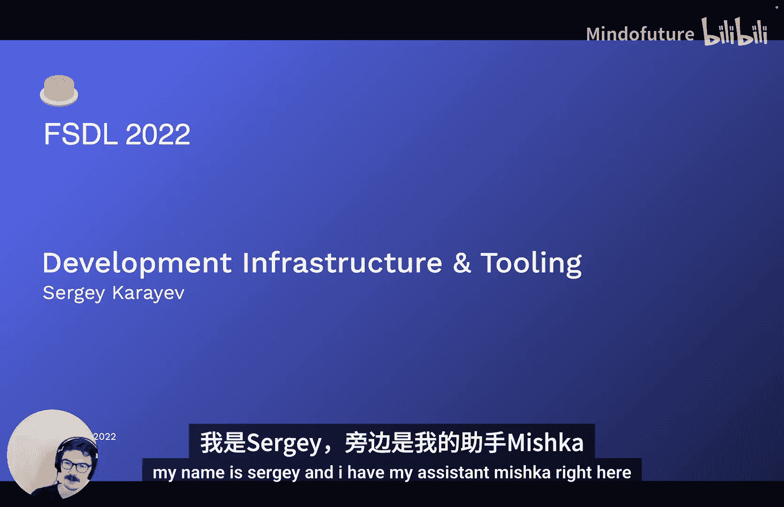

在本节课中，我们将学习机器学习开发所需的基础设施和工具。我们将从软件工程基础开始，探讨深度学习框架、分布式训练、计算资源管理，以及实验与模型管理工具。

## 概述

机器学习开发的理想情况是：你提供一个项目需求和一些示例数据，就能得到一个持续改进、大规模部署的预测系统。然而现实是，这涉及数据收集与处理、模型开发与调试、训练实验、部署以及后续监控等多个复杂环节。这些环节大致可分为**数据**、**开发**和**部署**三部分。本节课我们将专注于**开发**部分，涵盖从代码编写到模型训练所需的工具和实践。

## 软件工程基础

上一节我们概述了开发流程，本节中我们来看看支撑开发的基础软件工程实践。

### 编程语言与编辑器

对于机器学习，Python 是明确的选择，因为它拥有丰富的科学计算和数据处理库。编写 Python 代码需要一个编辑器。

以下是常见的编辑器选项：
*   **Vim / Emacs**：传统的命令行编辑器。
*   **Jupyter Notebooks / Jupyter Lab**：交互式笔记本环境，非常适合数据探索和快速原型开发。
*   **VS Code**：功能丰富的现代编辑器，内置 Git 版本控制、代码提示、远程开发支持等。
*   **PyCharm**：专业的 Python IDE。

在 FSDL，我们推荐使用 **VS Code**。它集成了许多优秀功能，例如实时代码检查（Linting）和静态类型分析。Python 的类型提示功能可以让静态类型检查器在运行前发现潜在的类型错误。

### Jupyter Notebooks 与替代方案

Jupyter Notebooks 是数据科学的核心工具，非常适合项目的“初稿”。它能提供快速的反馈循环。然而，它也存在一些问题，例如编辑器功能有限、代码执行顺序可能混乱、版本控制困难以及难以进行单元测试。

Jeremy Howard 的 `nbdev` 项目试图解决这些问题，允许你在 Notebook 中编写文档、代码和测试。

FSDL 的推荐是：可以继续使用 Notebooks，但建议使用 **VS Code 内置的 Notebook 支持**。这样你可以在一个集成的环境中工作，同时拥有终端、文件浏览和强大的调试功能。通常的实践是将核心代码写在模块（`.py`文件）中，然后在 Notebook 中导入。配合实时重载扩展，修改模块代码后，Notebook 能立即获取更新。

有时，你需要创建更交互式、可分享的应用。**Streamlit** 是一个出色的工具，它允许你通过装饰器将 Python 脚本转化为交互式 Web 应用，并轻松发布。

### Python 环境管理

为深度学习项目设置 Python 环境可能很棘手，因为需要协调 Python 版本、CUDA 版本以及各种库（如 PyTorch, NumPy）的版本。

我们可以通过以下方法实现环境管理：
1.  使用 `environment.yml` 文件指定 Python 和 CUDA 版本，并通过 Conda 安装。
2.  在 `requirements.in` 文件中用宽松的约束（如 `torch>=1.7`）列出项目依赖。
3.  使用 **Pip-tools** 工具分析依赖关系，生成一个锁定所有版本号的 `requirements.txt` 文件。
4.  使用 **Makefile** 来简化这些命令。

我们在实验课中采用了这种结构，你将会看到具体实践。

## 深度学习框架与分布式训练

上一节我们介绍了开发环境设置，本节中我们来看看用于构建和训练模型的核心工具。

### 为什么需要框架？

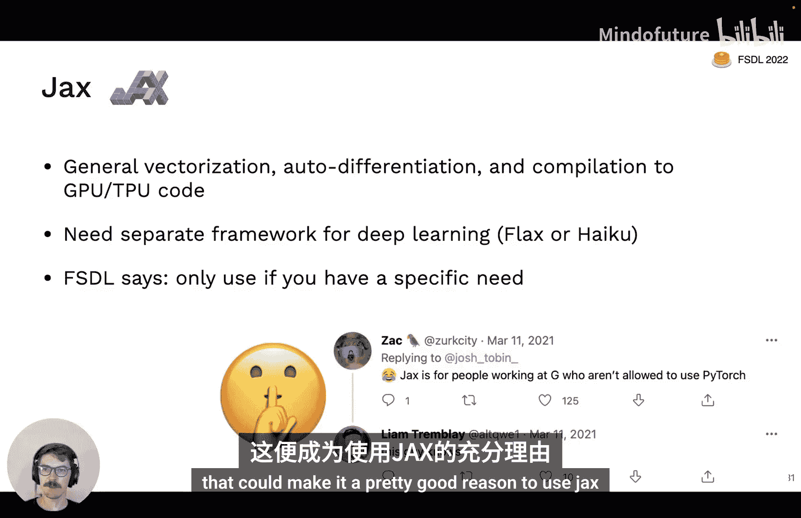

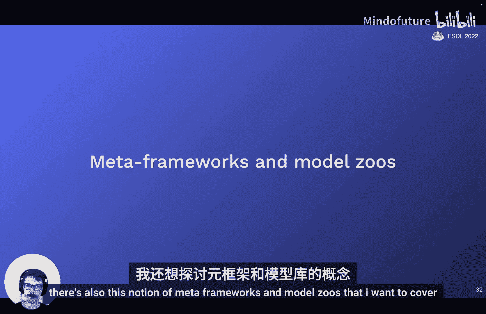

深度学习本身的核心代码量并不大，但考虑到 GPU 加速、自动微分、各种层类型和优化器的实现，以及生产部署的需求，使用一个成熟的框架是必要的。

### 框架选择

目前主流的框架有 PyTorch, TensorFlow 和 JAX。

*   **PyTorch**：是 FSDL 的选择。它拥有卓越的开发体验，庞大的生态系统，研究领域占据主导地位，并且生产就绪。通过 TorchScript 可以进一步优化性能。
*   **TensorFlow**：依然是一个优秀且功能全面的框架，特别是在浏览器端推理（TensorFlow.js）和快速原型搭建（Keras API）方面有优势。
*   **JAX**：并非专门的深度学习框架，而是一个用于数组计算和自动微分的系统。它被编译到 GPU/TPU 后速度极快。通常需要配合 Flax 或 Haiku 这样的元框架来构建深度学习模型。如果你有特殊的研究需求或在特定环境（如 Google）下工作，JAX 是一个好选择。

### 元框架与模型库

你很少需要从零开始。通常你会从一个已有的模型架构或预训练模型开始。

*   **模型库（Model Zoos）**：如 **Hugging Face Hub**，提供了海量的预训练模型和数据集，涵盖 NLP、视觉、音频等多个领域。
*   **ONNX**：一种开放的模型格式，旨在实现不同框架（如 PyTorch 和 TensorFlow）之间模型的互转换。虽然很强大，但可能无法处理所有边缘情况。
*   **PyTorch Image Models (timm)**：一个专注于计算机视觉的模型库，包含大量先进的预训练模型。

### 分布式训练

当模型或数据过大，无法在单个 GPU 上处理时，就需要分布式训练。

以下是几种主要的并行策略：

1.  **数据并行（Data Parallelism）**：当**模型参数**能放入单个 GPU，但**数据批次**不能时使用。它将批次数据拆分到多个 GPU 上，每个 GPU 持有完整的模型副本，计算梯度后再进行平均。在 PyTorch 中，可通过 `DistributedDataParallel` (DDP) 或第三方库 `Horovod` 实现。使用 PyTorch Lightning 只需指定策略即可。

2.  **完全分片数据并行（Fully Sharded Data Parallel, FSDP / Zero Redundancy Optimizer, ZeRO）**：当**模型参数**也无法放入单个 GPU 时使用。它通过将**优化器状态**、**梯度**和**模型参数**分片到各个 GPU 上来极大减少内存占用。这由 **DeepSpeed** (Microsoft) 和 **FairScale** (Facebook) 库实现，现在 PyTorch 也原生支持（FSDP）。PyTorch Lightning 同样支持此策略。

3.  **模型并行（Model Parallelism）**：将模型的不同层放置在不同的 GPU 上。简单的实现会导致 GPU 利用率低，因此需要**流水线并行（Pipeline Parallelism）** 来重叠计算。

4.  **张量并行（Tensor Parallelism）**：将单个运算（如矩阵乘法）拆分到多个 GPU 上。例如，NVIDIA 的 `Megatron-LM` 为 Transformer 模型实现了张量并行。

对于超大规模模型（如 GPT-3 级别的模型），通常会组合使用上述多种策略，称为 **3D 并行**。

### 其他训练加速技巧

除了并行策略，还有其他方法可以加速训练：
*   **混合精度训练（16-bit）**：使用 `torch.cuda.amp`。
*   **序列长度/图像尺寸预热**：在训练初期使用较短的序列或较小的图像，逐步增大。
*   **特殊优化器与调度器**：如 `LION`。
*   **高效的数据加载库**：如 `FFCV`，可以优化数据流水线。
*   **集成库**：如 **MosaicML Composer**，集成了许多上述加速技巧，并提供了方便的基准测试和成本探索工具。

## 计算资源

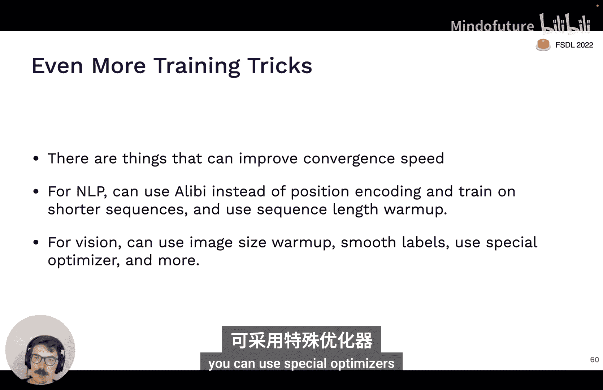

上一节我们讨论了如何通过并行和优化来训练模型，本节中我们来看看执行这些计算所需的硬件资源。

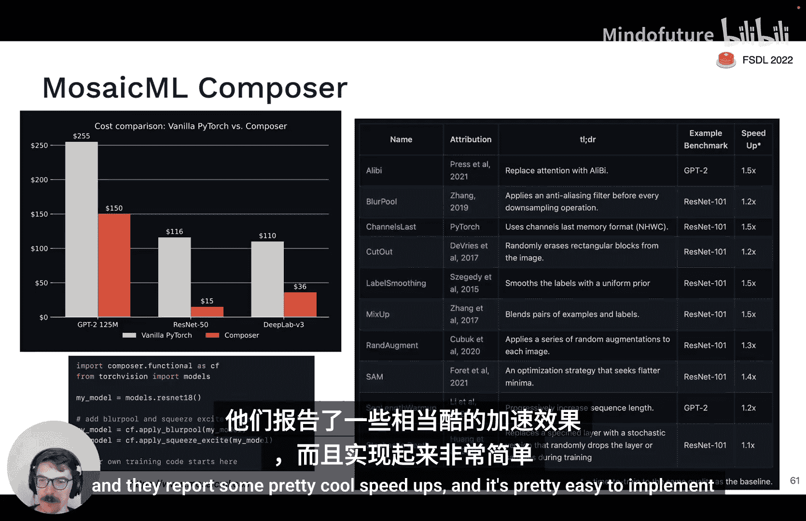

### GPU 选择

目前，NVIDIA GPU 是深度学习训练的主要选择。Google 的 TPU 也是一个强大的替代品，特别是在 GCP 云平台上。

选择 GPU 时主要考虑三个因素：
1.  **内存容量**：决定能容纳的模型大小和批次大小。
2.  **计算速度**：特别是针对混合精度训练的 Tensor Core 性能。
3.  **互联带宽**：GPU 之间以及 GPU 与 CPU 之间的数据传输速度，影响多卡并行效率。

可以参考 `Lambda Labs` 和 `AI/ML Benchmark` 等提供的基准测试数据来比较不同 GPU 的实际性能。

### 云服务与本地机器

你可以选择在云上租用 GPU 实例，也可以购买或组装本地机器。

**云服务提供商**：
*   **主流云**：AWS, Google Cloud Platform (GCP), Microsoft Azure。
*   **初创云**：Lambda Labs, Paperspace, CoreWeave, DataCrunch, JarvisLabs 等。这些通常性价比更高。

我们创建了一个 **云 GPU 比较工具**（基于 CSV 文件），可以按 GPU 型号、数量、价格等条件进行筛选和排序。

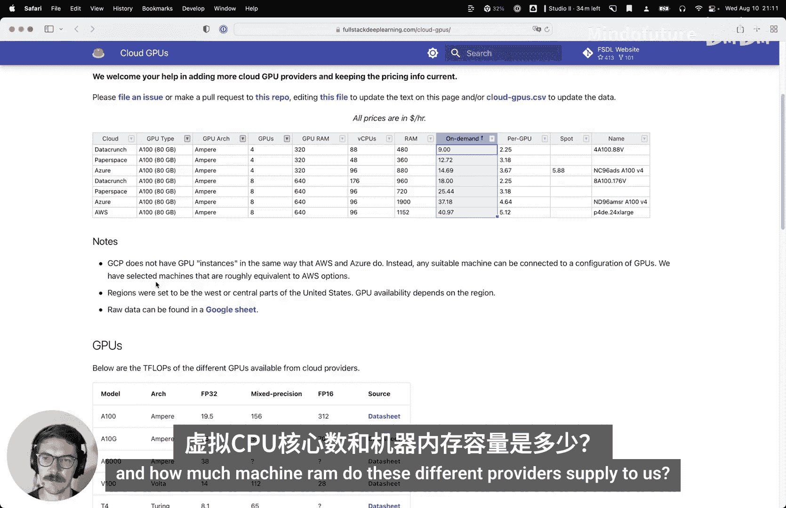

一个反直觉的结论是：**按小时计费最贵的机器，完成整个实验的总成本可能反而最低**。因为高端机器（如 8xA100）训练速度极快，虽然单价高，但总用时短。结合基准测试数据，通常性价比最高的选择是在最便宜的云服务商那里租用最强大的多卡 A100 实例。

**本地机器**：
*   **自行组装**：可以控制配置和成本，是一种有益的体验。
*   **购买整机**：如 Lambda Labs 和 NVIDIA 提供的预配置工作站/服务器，更省心。
*   **建议**：拥有一台本地机器有助于转变思维，从“最小化云上花费”变为“最大化已有硬件的利用率”。但对于需要大规模扩展的实验，进入云平台是必要的。

**TPU**：如果你在 GCP 上进行大规模训练，TPU（特别是 v3/v4）是非常值得尝试的选择，它们在扩展性上表现优异。

## 计算资源管理

上一节我们了解了可用的计算资源，本节中我们来看看如何有效地启动和管理训练任务。

### 管理方式

运行一个训练实验需要：指定机器/GPU 配置、设置环境（Python, CUDA, 依赖库）、准备数据。管理方式有多种：

1.  **手动管理**：登录机器，激活环境，运行脚本。适用于简单场景。
2.  **集群工作负载管理器**：如 **SLURM**，常用于学术和大型企业集群。
3.  **容器与编排**：
    *   **Docker**：将整个依赖栈打包成轻量级容器。
    *   **Kubernetes**：用于在集群上编排和管理多个 Docker 容器。
    *   **Kubeflow**：基于 Kubernetes 的机器学习工作流平台，可以管理笔记本、多步流水线等。功能强大但较复杂。
4.  **机器学习专用平台**：提供了更上层的抽象。

### 机器学习专用平台

以下是一些值得关注的解决方案：

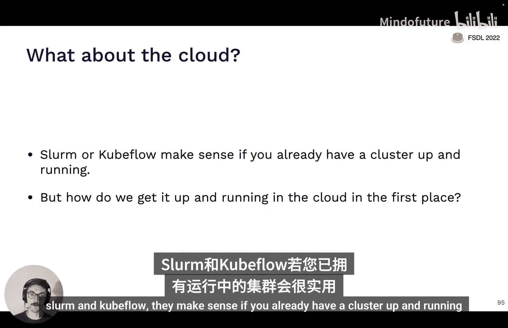

*   **AWS SageMaker**：亚马逊的一站式机器学习平台，涵盖数据标注、笔记本、训练、部署、监控全流程。如果你已深度使用 AWS，它是一个顺理成章的选择，但有一定溢价。
*   **Anyscale (Ray Train)**：基于 Berkeley 的 Ray 项目，提供分布式训练解决方案，声称比 SageMaker 更快，并对 Spot 实例有更好的容错支持。
*   **Grid.ai (现为 Lightning.ai 一部分)**：由 PyTorch Lightning 团队创建，口号是“零代码更改，在云上无缝训练数百个模型”。通过简单的前缀命令即可将本地代码扩展到云集群。
*   **Determined AI**：一个开源的机器学习平台，提供集群管理、分布式训练、实验跟踪、超参数搜索等功能。易于安装和使用，可部署在本地或云上。

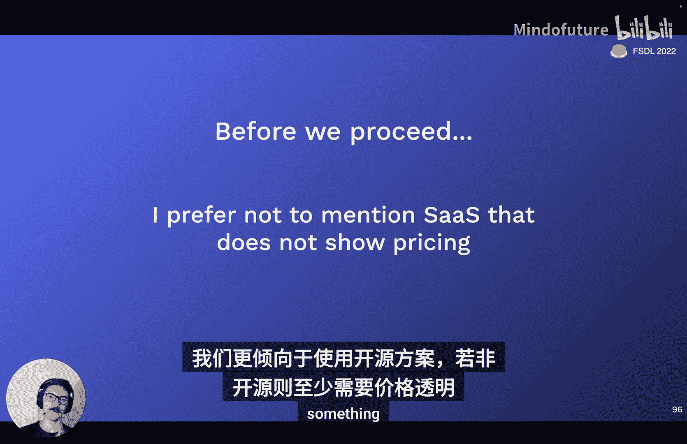

目前，在云上轻松启动和管理大规模训练任务，仍然缺乏一个公认的、极其简单的完美解决方案，这仍是一个有待创新的领域。

## 实验与模型管理

上一节我们讨论了如何启动训练，本节中我们来看看如何跟踪和管理这些训练实验及其产出的模型。

### 实验跟踪（Experiment Tracking）

当运行大量实验时，手动记录代码、参数、数据集和结果变得非常困难。实验跟踪工具可以解决这个问题。

以下是主要工具：
*   **TensorBoard**：Google 开发的可视化工具，非常适合跟踪单个实验的损失、指标等。但在管理大量实验时略显不足。
*   **MLflow Tracking**：Databricks 开源的解决方案，功能全面，但需要自行托管。
*   **Weights & Biases (W&B)**：非常流行且易用的 SaaS 服务。它可以记录实验配置、指标、系统资源使用情况（如 GPU 利用率），并支持强大的结果筛选和可视化。对公开项目免费。
*   **Determined AI**：其内置的实验跟踪功能也非常完善。
*   其他：如 Neptune, Comet 等。

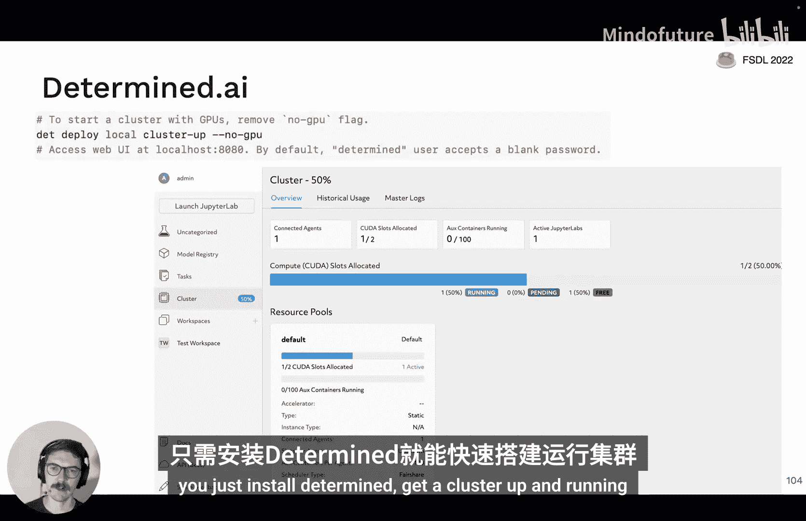

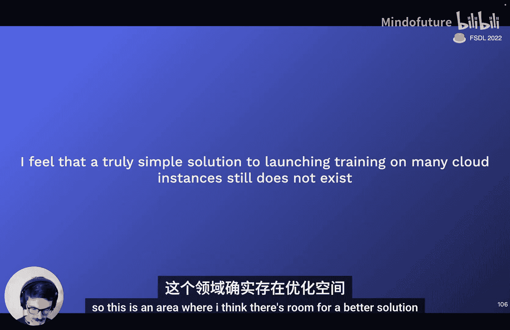

### 超参数优化（Hyperparameter Optimization）

我们经常需要自动搜索最佳的超参数组合。更高级的方法是使用智能搜索算法，并能提前终止表现不佳的实验。

*   **Weights & Biases Sweeps**：W&B 提供的超参优化工具。你只需定义一个描述搜索空间和算法的 YAML 配置文件，然后启动代理程序即可自动运行实验。
*   **其他集成方案**：如 SageMaker, Determined AI 也都内置了超参搜索功能。通常，选择你正在使用的实验跟踪工具所配套的超参优化功能即可。

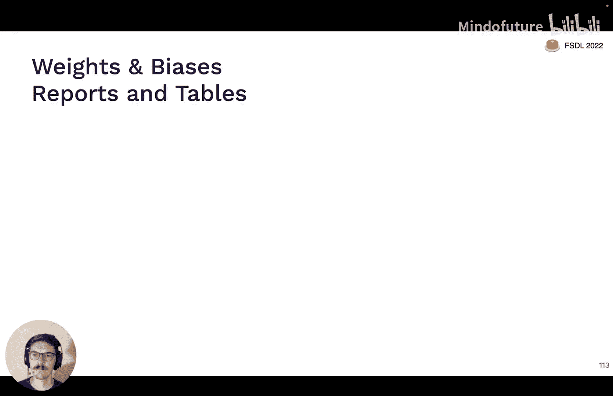

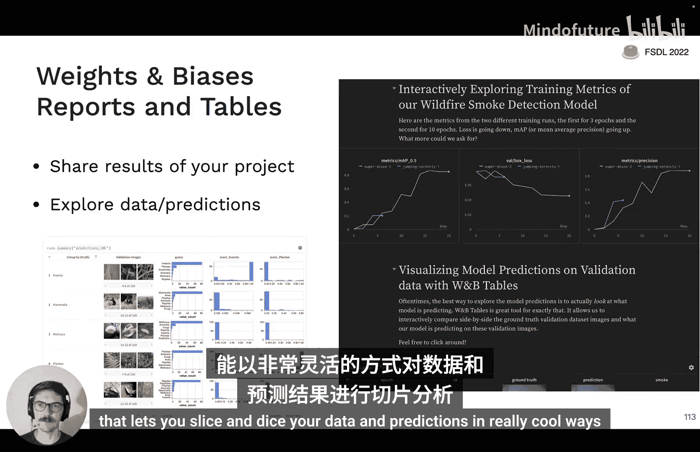

### 一体化平台（All-in-One Platforms）

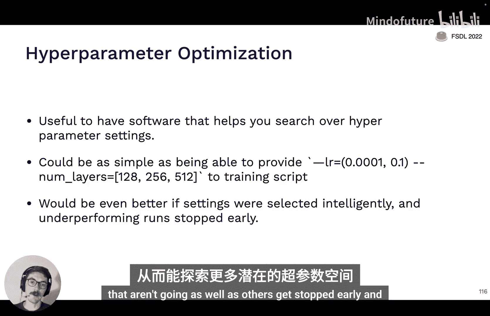

有些平台旨在覆盖从数据、开发到部署的整个机器学习生命周期。

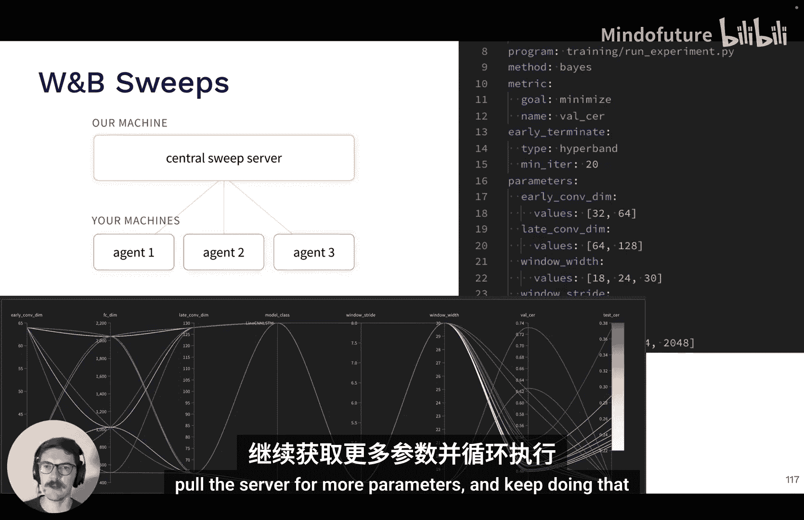

*   **SageMaker**：如前所述，是典型的一体化解决方案。
*   **Paperspace Gradient**：提供了笔记本、实验、数据集、模型和推理服务。
*   **Domino Data Lab**：更偏向于传统机器学习，但也提供了计算资源管理、实验跟踪、模型部署和监控、应用发布等功能。

在决定采用某个一体化平台前，建议先了解后续关于数据管理和部署的课程内容。

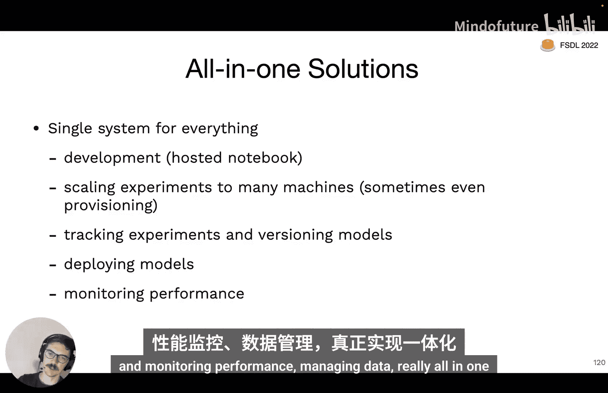

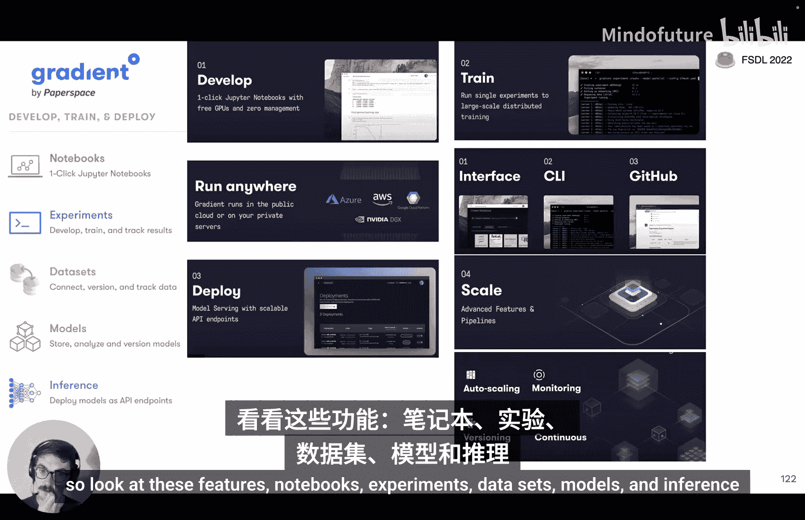

## 总结

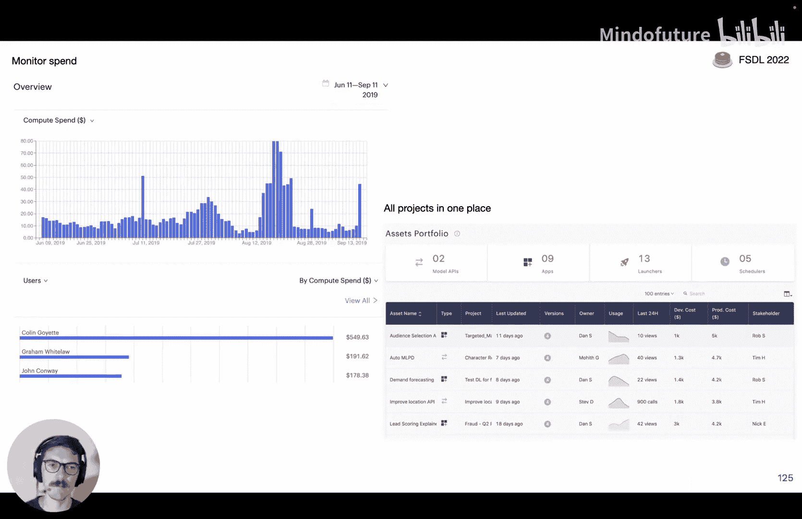

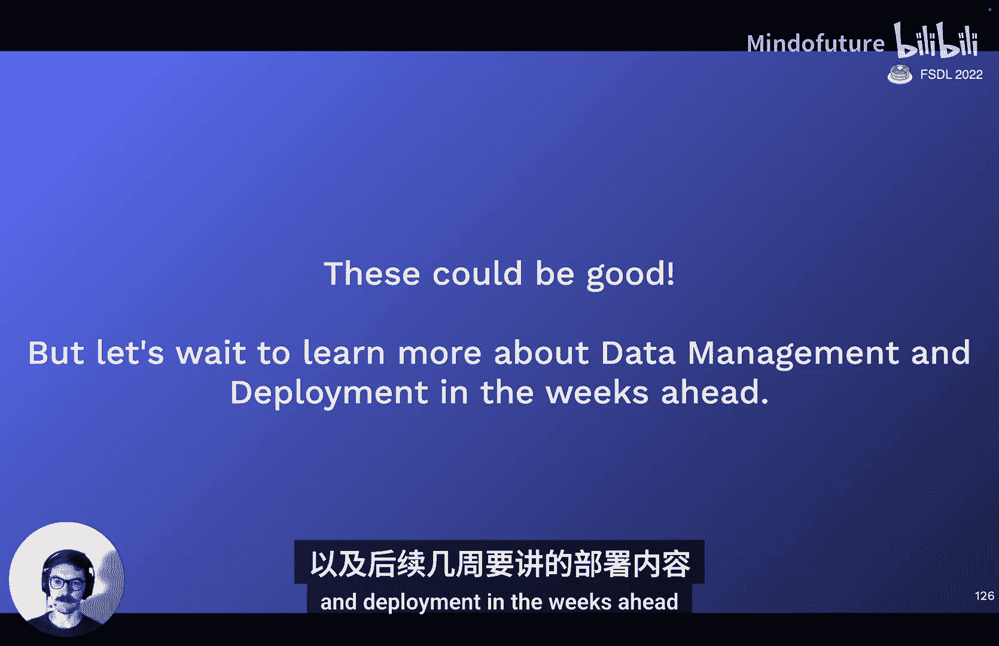

本节课我们一起学习了机器学习开发所需的基础设施和工具。我们从软件工程实践开始，探讨了 Python 环境管理、编辑器选择和 Jupyter Notebooks 的最佳实践。接着，我们深入了解了 PyTorch 等深度学习框架、应对大规模训练的分布式并行策略（数据并行、模型并行、分片并行），以及训练加速技巧。然后，我们分析了 GPU、TPU 等计算资源的选择，比较了云服务与本地机器的优劣，并介绍了管理这些资源的各种方式（从手动到 SLURM、Docker/Kubernetes，再到 SageMaker、Determined AI 等专用平台）。最后，我们学习了如何通过实验跟踪工具（如 Weights & Biases）和超参数优化来有效管理实验流程，并简要了解了一体化平台的概念。掌握这些工具和实践，将帮助你更高效、更系统地构建机器学习项目。