# 全栈深度学习：实验管理

## 概述

在本节课中，我们将学习为什么实验管理对于机器学习模型开发至关重要，以及如何在开发文本识别器的过程中应用实验管理。最后，我们将详细介绍如何使用一个名为 Weights & Biases 的工具进行机器学习模型开发的实验管理工作流。

---

## 为什么实验管理很重要

为了理解为什么实验管理对机器学习模型开发如此重要，让我们启动一个实验。这个单元会在一类新数据上训练一个新模型。当我们启动这个单元时，模型训练会立即开始，大量信息开始在命令行中打印出来。我们会看到关于机器运行状态、模型结构的信息，以及关于训练集和验证集性能的指标信息开始流入。

所有这些信息对于了解模型在训练过程中、从数据中学习时发生了什么，都是重要且有用的。但是，如果我们不对训练过程进行进一步的记录，所有这些信息都将丢失。我们可以看到，像损失这样的指标的打印值在训练过程中已经被覆盖了。如果我重启这个笔记本，输出就会消失。或者，如果我在命令行中运行并关闭了那个窗口，输出也会消失，我可能无法回忆起我传递给训练脚本的参数是什么。

我们确实需要保存所有这些信息，将其记录下来，并为这些日志附加额外的元数据，比如 Git 仓库的状态或测量值的时间戳，以便我们能够将测量值相互关联，长期保存它们，并维护实验过程的记录。

在过去，你可能只是用 Google Sheets 或其他临时解决方案来做这件事，或者自己编写代码。这需要花费大量时间和精力，而这些工作并非机器学习模型开发过程的核心。它对于实现该过程很重要，但与我们在模型开发中所做的事情没有直接联系。这正是我们希望使用已经包含了许多最佳实践和可靠工程的框架和库，并允许我们在项目之间更轻松地移植代码的那种事情。

---

## 经典工具：TensorBoard

用于跟踪机器学习实验过程的经典工具是 TensorBoard。事实上，我们在进行训练运行时已经在使用它了。我们一直在记录各种信息，以便可以通过 TensorBoard 访问。我们只是还没有查看它。这部分单元将介绍如何启动 TensorBoard 并查看我们实验中记录的一些信息。

TensorBoard 有点像 Jupyter，它独立于我们正在做的其他事情运行。它是一个我们启动的独立服务，然后从另一个进程查看。我们可以在笔记本内部使用一些 notebook 魔法来做到这一点，但相同的命令在终端中也有效，你只需要打开浏览器并指向适当的主机和端口。

TensorBoard 获取我们随时间记录的所有指标，并可以将它们显示为图表。通过查看，我们可以找到诸如训练集和验证集上的性能等信息。

TensorBoard 对于查看单个实验的结果效果很好。但是，一旦你开始尝试比较多个实验或对实验进行分组，用户体验就开始变得不那么理想。此外，因为它是一个独立的服务，我们需要进行很多管理工作。例如，这个单元旨在清理之前启动的 TensorBoard 进程。

实际上，使用 TensorBoard，你是在运行一个数据库来记录你的信息，然后在它上面运行一个具有良好图形用户界面的 Web 应用程序。这对于 Web 开发人员来说是一个相当常见的工作流，但它超出了大多数机器学习工程师的技能范围，最终会分散你对真正想做的事情的注意力，即开发好的机器学习驱动的产品和应用程序。

---

## 超越本地 TensorBoard

有许多不同的方法可以从仅本地运行的 TensorBoard 转向更全面的实验管理。本笔记本的这一部分详细介绍了其中一些选项，并讨论了它们的优缺点。

我们在全栈深度学习推荐的是一个名为 Weights & Biases 的工具。在我们看来，Weights & Biases 提供了最佳的用户体验，无论是在开发、记录和将其添加到代码库方面，还是在查看实验的图形界面方面。它还提供了与 PyTorch Lightning、Keras 甚至 TensorBoard 等其他工具的最佳集成，并提供了在团队中使用实验信息进行协作的最佳工具。

最大的好处之一是，如果你正在使用像 PyTorch Lightning、Hugging Face 或 Keras 这样的框架，相对于你获得的额外功能数量，将 Weights & Biases 添加到现有的实验运行代码中非常容易。这里的 4 或 5 行代码集合构成了我们与 Weights & Biases 集成的大部分内容。在本实验的其余部分，我们将通过一个已记录的实验来了解这些代码行的作用。

为了完成本笔记本的其余部分，你需要一个 Weights & Biases 账户。与 GitHub 类似，对于公开的工作，免费层级非常慷慨，文本识别器项目完全适合这个免费层级。但对于私有工作，除了学术账户外，限制可能会更多。同样，如果你对使用封闭治理和部分闭源工具感到不适，还有一些其他实验跟踪推荐，包括一个名为 `aflow` 的完全开放治理、开源项目。

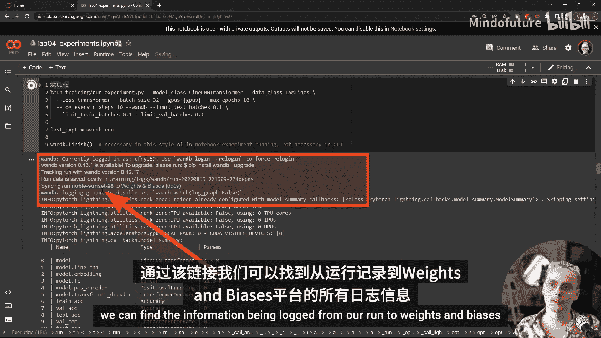

Weights & Biases 的易用性对于保持开发速度和不陷入日志记录工作细节非常重要。因此，我们建议你至少创建一个账户，并作为这些实验的一部分尝试一下。

你可以运行 `wandb login` 单元来获取创建账户的说明，或者如果你已经有一个账户，则提供你的 API 密钥。

---

## 使用 Weights & Biases 运行实验

在下一个单元中，我们将启动一个与我们刚刚用 TensorBoard 尝试的实验类似的实验，但将信息记录到 Weights & Biases。这个实验可能需要 3 到 10 分钟才能运行。在它运行时，请确保继续阅读笔记本的其余部分。

现在我们在输出中看到了一些新东西。有一些来自 Weights & Biases 的信息，特别是一个链接，指向我们可以在哪里找到从我们的运行记录到 Weights & Biases 的信息。让我们查看一下。在至少完成一个训练和验证周期后，我们将能够看到这些图表。你会看到我们已经记录了一些验证指标、训练指标以及模型的输入和输出。这些信息是实时流式传输的，因此我们可以在实验运行时在此仪表板中看到它更新。

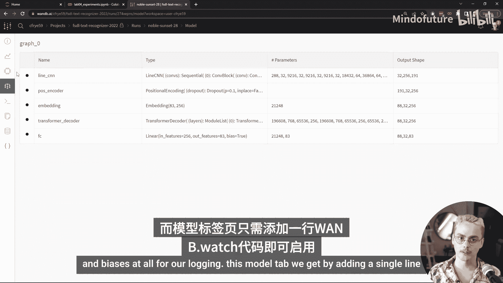

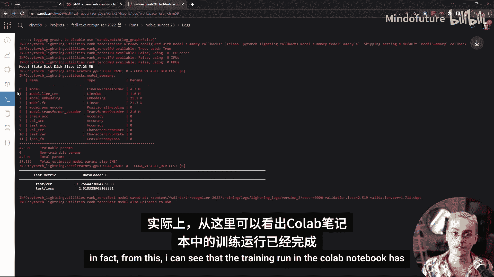

如你所见，有多个不同的选项卡用于查看单个实验的信息。让我们逐一浏览每个选项卡。我们首先进入了“图表”选项卡，但关于我们运行的高级信息实际上在“概览”选项卡中。

这个选项卡包含元数据信息，例如运行何时开始、持续了多长时间、我们使用的操作系统和 Python 版本、哪个 Git 仓库以及该 Git 仓库的状态。如果我们滚动到页面底部，还可以找到我们的配置信息，包括我们传入的所有命令行参数（其中包含我们的模型超参数和训练器参数），以及关于我们指标的一些摘要信息，例如最近的值或运行结束时的值。

还有一个“系统指标”选项卡。这不是关于我们的机器学习模型的直接指标，如准确性或在某些数据上的性能，而是关于我们运行训练的系统指标，例如 CPU 利用率或内存使用情况。最重要的是，对于加速的深度学习，有很多关于我们如何使用 GPU 的统计数据。这个系统只有一个 GPU，所以我们只能看到一条线，但对于具有多个 GPU 的系统，我们将同时看到所有 GPU 的利用率、温度、内存分配和其他指标。这对于快速发现性能回归非常有用。

下一个“模型”选项卡包含关于我们模型的信息。“概览”和“系统指标”是我们使用 Weights & Biases 进行日志记录时免费获得的。这个“模型”选项卡是我们通过向日志记录添加一行代码 `wandb.watch` 获得的。

下一个“日志”选项卡捕获终端中的输出。这对于捕获错误消息或警告消息非常有用，否则这些消息可能会在训练期间记录的输出中一闪而过。事实上，从这里我可以看到，Colab 笔记本中的训练运行实际上已经完成，因为测试结果已被记录。

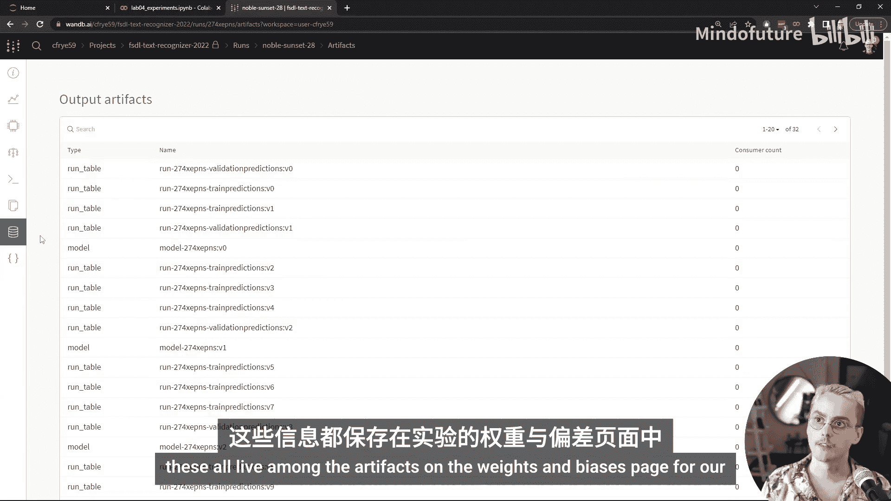

下一个“文件”选项卡包含一些好东西，比如一个 `requirements.txt` 文件。如果你在本地运行，还会看到一个 `environment.yaml` 文件。如果你编辑了相对于 Git 仓库的实验，还会看到一个 `git.patch` 文件，它代表了你的 Git 状态与已提交到版本控制系统的内容之间的差异。这对于捕获在开发模型、创建提交或拉取请求过程中引入的错误非常有帮助，它不止一次地救了我。

日志、文件、系统指标和概览都是我们通过在实验运行脚本中包含 Weights & Biases 完全免费获得的东西。但也有一些东西是我们通过添加一点额外代码获得的。“工件”选项卡就是其中之一。它包括我们在训练期间生成的所有二进制文件，其中包括模型检查点以及我们文本识别系统的输入和输出（即图像输入和文本输出）。这些都存在于我们实验的 Weights & Biases 页面上的工件中。

回到我们运行实验的笔记本，让我们看看这里的最终输出集。我们可以看到前几行是 Weights & Biases 记录的新内容，然后是一堆我们之前看到过的信息，在底部，我们会看到一个快速摘要，以及运行期间指标的历史记录，所有这些都在标准输出中。如果你在终端中运行，可能还会看到输出稍微不那么精美。我们还可以看到另一个链接，返回到我们可以在浏览器中查看实验结果的页面。

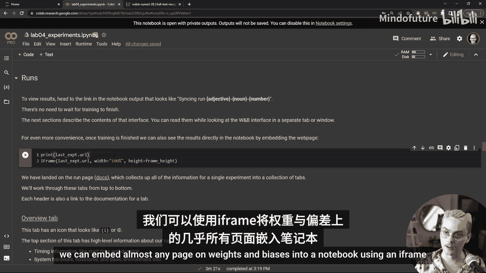

---

## 在笔记本中嵌入 Weights & Biases

本实验的这一部分逐步介绍了我在 Weights & Biases 界面中向你展示的所有内容：所有不同的选项卡、我们添加了什么代码来获得它们，以及它们有什么用。

我想指出的一点是，除了能够在 Weights & Biases 界面内部查看这些信息外，我们还可以在不离开笔记本的情况下查看。我们可以使用 iframe 将 Weights & Biases 上的几乎所有页面嵌入到笔记本中。让我们看看那是什么样子。这是同一个我们刚刚查看的运行页面，但现在它位于我们的 Colab 笔记本内部。这对于能够以编程方式共享信息、使用 Python 调整查看的内容，以及在查看结果时不必将上下文从笔记本切换到 Web 应用程序非常有用。任何时候，我们也可以点击右上角的“打开页面”在完整的浏览器窗口中查看。

另一个导航提示：如果我们点击所有这些可点击的链接并再次打开这些选项卡，在 Jupyter 笔记本内部，我们也可以使用顶部的这两个箭头向前和向后导航。

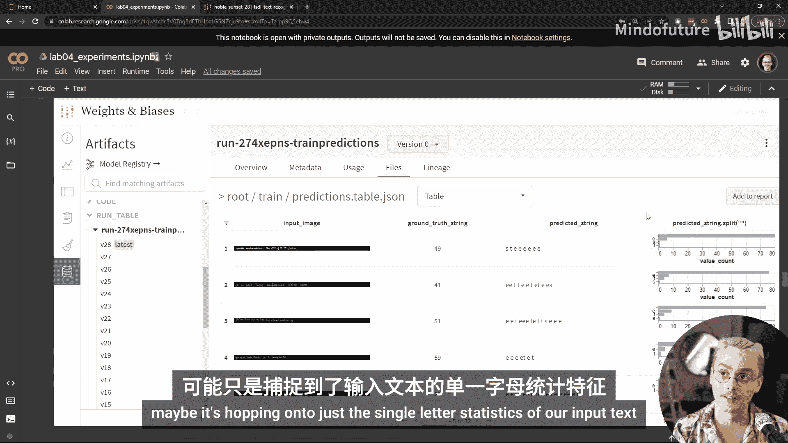

在本笔记本的这一部分，我们更仔细地查看了那些已保存到 Weights & Biases 的输入和输出。这些不仅仅是作为原始媒体记录的，而是以表格的形式关联输入图像、真实标签和模型输出。我们可以看到我们有三个列：输入图像、真实标签和预测标签。这个模型训练时间不长，所以预测效果不是很好。

我们可以调整表格的美观性，点击使图像变大，我们可以点击图像并更仔细地查看。这是一条相当难读的线。我看到的文字是“The writing of Don Juan”。看起来那实际上就是真实字符串。预测的字符串并不完全一样。

我们也可以在这个界面中进行一些探索性数据分析。例如，我可以获取这个真实字符串并计算其长度，或者我可以创建一个全新的列，比如计算字母在模型输出中出现的频率。看起来模型的输出包含字母 E、字母 T 和空格很多。也许它只是抓住了我们输入文本的单个字母统计信息。

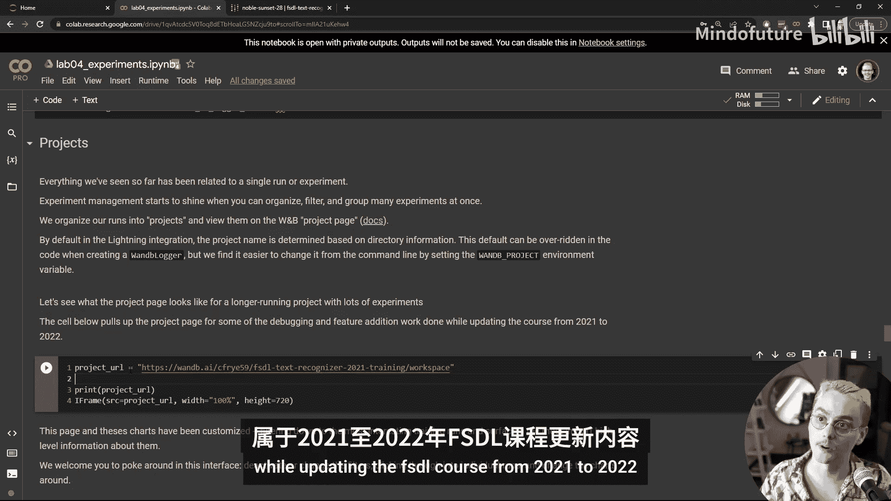

让这些表格工作需要一点额外的代码。我们之前看到的所有内容都是使用 PyTorch Lightning 和 PyTorch Lightning 与 Weights & Biases 集成中内置的功能。你可以查看我们如何在本笔记本的这一部分中实现这一点，该部分引入了相关的类和方法。

---

## 管理多个实验

实验管理工具相对于像 TensorBoard 这样的工具真正闪耀的地方是当你有很多很多与某个项目相关的实验时，比如训练这个文本识别系统，并且你希望能够对它们进行切片、切块、过滤、比较、长期跟踪信息并与他人共享这些结果。

因此，在这一部分，我们不仅查看在 Colab 中运行几分钟的一个实验，还查看一个运行时间更长的项目，该项目在多个 GPU 系统上进行了数小时的长时间训练运行。这个项目是 FSDL 课程从 2021 年更新到 2022 年期间的调试和功能添加工作的一部分。

让我们在左侧打开那个页面。你可以看到属于这个项目的所有不同运行。实际上，我们使用过滤器工具将它们过滤到仅限较长的训练运行。然后，我们在这里自定义图表，提取重要信息，比如哪个模型在测试集上的字符错误率性能如何，以及所有模型在测试集上的字符错误率和损失是多少。

继续滚动，我们还可以找到训练期间的指标随时间的变化，比如训练损失。此外，我们制作了自定义图表，从我们记录的内容中衍生出新的指标，比如这个泛化差距图表，它显示了训练损失和验证损失之间的差异。当这个值强烈为负时，意味着我们的模型严重过拟合。我们可以看到，我们的一些运行严重过拟合了训练集。

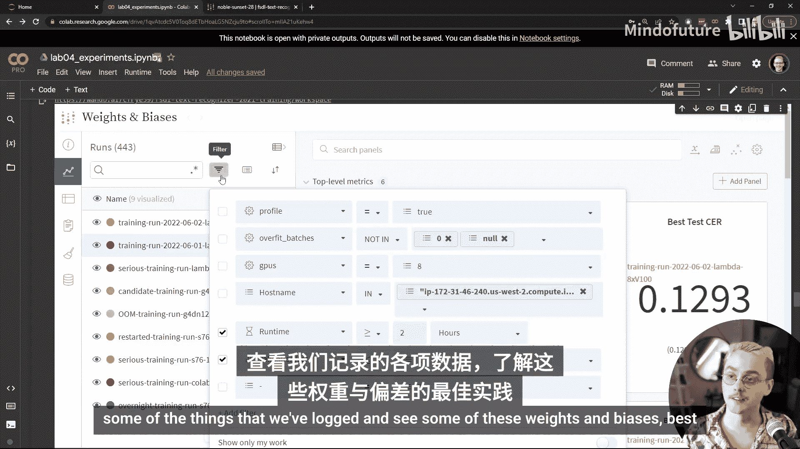

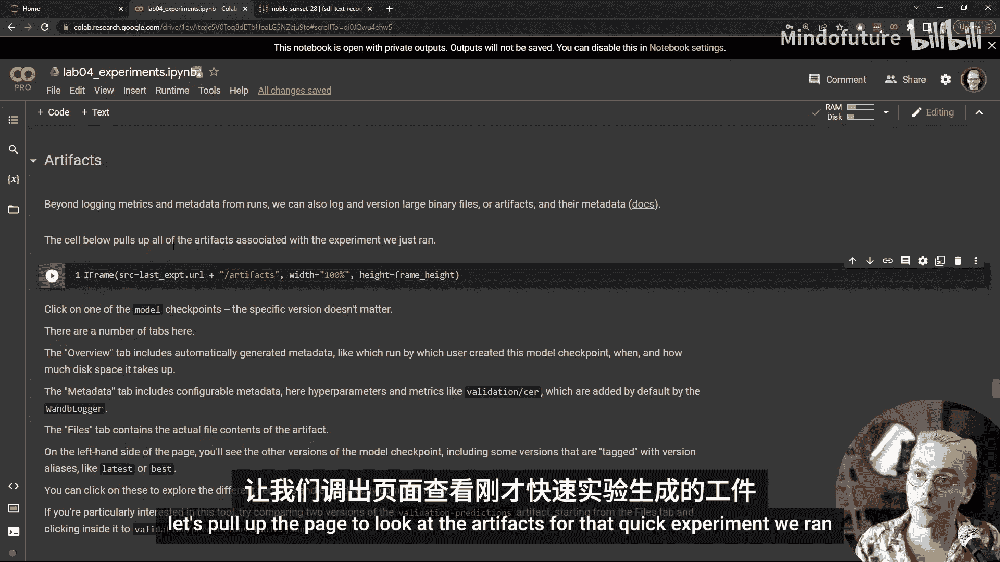

我们还可以查看并比较训练集和验证集上训练结束时的模型输入和输出。在这里，我们可以看到最终的文本识别器在训练集上表现相当好，其预测字符串与真实字符串非常接近。继续向下滚动并查看验证数据，我们看到它也很好地迁移到了验证集。

在浏览此界面的任何时候，我们也可以点击查看特定的运行。现在我们正在查看该单个运行的指标、图表和所有其他信息。因此，在查看一个运行、多个运行、进入并更改我们应用于查看不同类型运行的过滤器之间切换非常容易。因此，我们邀请你在这个项目内部进行探索，查看我们记录的一些内容，并在此部分中看到一些 Weights & Biases 最佳实践的实际应用。

---

## 存储和版本化大型文件

在这一部分，我们更详细地介绍了如何在 Weights & Biases 中存储和版本化大型二进制文件，包括像那些输入图像和模型检查点这样的媒体。

让我们打开页面查看我们运行的快速实验的工件，并继续查看我们的一个模型检查点。具体版本并不那么重要。像这样的单个工件页面包含关于我们记录到 Weights & Biases 的特定文件集合的单个版本的所有类型的信息。

因此，工件更像是一个目录，而不是一个包含模型检查点的单个文件。我们实际上只是保存一个文件，但一般来说，工件可以存储整个目录的目录和文件，然后它们被线性版本化，从版本 0（我们记录的第一个）一直到最新版本。通过 PyTorch Lightning 集成，它们还获得了一些有用的标签，比如 `best`，用于标识在我们跟踪的指标上表现最佳的模型，这仅仅是通过使用一个跨实验管理系统通用的 PyTorch Lightning 回调——模型检查点回调来实现的。

当我们查看工件的单个版本时，我们可以看到关于该工件的所有类型的额外元数据和数据。例如，我们可以看到谁创建了它、何时创建的、哪个跟踪实验与此工件的创建相关联——所有这些都可以在“概览”选项卡上找到。我们还可以自定义随工件记录的元数据。默认情况下，PyTorch Lightning 附加了我们所有的命令行超参数和指标值。

因此，在与此工件关联的各个文件和文件夹中，我们可以通过查看此图形视图（谱系视图）来查看关于哪些运行创建了哪些工件以及哪些运行使用了哪些工件的元数据。

工件存储作为 Weights & Biases 免费层级的一部分提供。截至 2022 年 8 月，存储限制覆盖 100 GB 的工件和实验数据。可以删除数据。因此，如果你有良好的实验习惯并编写一些脚本，可以删除未使用的工件，从而使这 100 GB 用得更远。还有一个很好的界面，你可以在其中查看存储了多少数据并与你在 W&B 上的限制进行比较。

---

## 编程访问与报告

除了在我们开始的漂亮浏览器界面中或在我们笔记本中这些嵌入的 iframe 中查看我们记录的信息外，我们还可以通过编程方式访问存储在 W&B 中的信息。我们将希望使用其 API 来实现这一点。这是一个非常强大和灵活的 API。

本实验有一整个部分介绍了如何使用此 API 执行一种 MLOps 工作流，即从运行在生产环境中的模型一直追溯到最终进入该模型的训练数据。但它也可以用于简单的事情，比如将我们刚刚在此单元中记录的数据作为 Pandas DataFrame 拉取下来，并计算一些值，也许还会绘制它们。

该 API 还为我们提供了对哪个运行创建了哪个工件、哪个运行使用了其他运行创建的哪个工件的图的编程访问。因为我们正在将训练期间从 PyTorch DataLoader 出来的数据记录到 Weights & Biases，所以通常短暂的信息（如数据的增强版本）被跟踪和存储，我们可以通过编程方式访问它。这对于检测数据增强管道中的问题、捕获这些问题并快速解决它们非常有用。

在记录时，尽可能多地包含信息非常重要。因此，我们记录了 Git 信息、系统信息以及从模型内部记录的特殊信息。记录所有这些信息很重要，因为如果你在拥有它时不记录它，它就会消失，你无法重新创建它，并且很难知道哪一条特定信息将成为解决某些错误、纠正中断或从根本上改进 ML 系统性能所需的关键信息。

这样做的缺点是，你记录的所有这些信息有时会让人不知所措，尤其是对于项目外部不了解所有这些数字和不同名称含义的人来说，这些信息并不特别有用。因此，为了使这些信息更易读，你需要使用一些东西来提取信息并重新格式化它。

Jupyter 笔记本结合了代码周围的额外媒体和文本来使代码更容易理解。Weights & Biases 中实现此功能的是“报告”。我们在将文本识别器从 2021 年更新时大量使用了报告。你可以在笔记本中的链接查看我们编写的一些报告，以跟踪我们所做的工作。

我们逐步介绍了几种不同类型的报告以及你如何在 ML 模型开发工作流中使用它们。我们看的第一个是“仪表板报告”，它只是从一个实验（也许是几个实验）的输出中提取一些结构化的子集。它旨在快速查看正在进行的实验的情况或快速比较实验之间的差异。

让我们看看我们一个训练运行的仪表板报告。你可以看到，与那些运行页面或项目页面相比，这里的信息少得多，并且尝试将其组织起来，以便快速看到差异，看到像上面这两行这样的基线模型与像下面这两行这样的当前模型之间的差异。我们可以看到，新模型的损失下降速度比基线模型快。这里的图表在这个仪表板中经过了大量自定义，例如我们采用了对数缩放，以便在值变低时更容易看到损失差异。我们还可以引入那些系统指标，以便比较和对比我们代码的系统级性能。

另一种类型的报告有点像对拉取请求的一点额外文档。当你进行拉取请求并更改大量模型训练代码或数据处理代码时，对于审查你代码的人来说，如果没有看到一些额外的媒体和图表，很难确信你所做的更改是好的，而这些媒体和图表并不总是适合放在拉取请求中。此外，如果你只是截图图表并将它们放在拉取请求中，那么可能很难发现这些信息，它们不再与你实验管理系统中记录的所有其他指标相关联。因此，我们可以使用 Weights & Biases 中的这些报告来保持所有这些信息在一起。

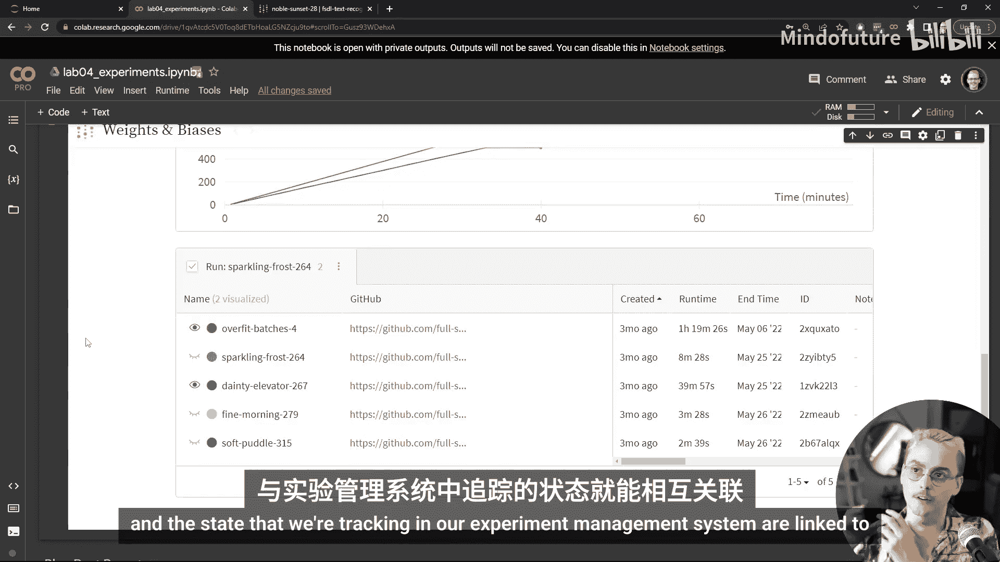

这是一个我添加到 FSDL 代码库 PR 中的报告示例，用于检查我在重构代码时没有改变我们拟合数据的能力，即训练损失在重构前后以几乎相同的方式下降。包括指向 GitHub 的链接（如右上角的链接），以及在我们向下滚动时指向记录到 Weights & Biases 的信息的链接，以便版本控制系统状态和我们在实验管理系统中跟踪的状态相互关联。

我们考虑的最后一类报告是那种包含大量额外文本、额外上下文和信息，并努力从记录的信息中制作出非常漂亮的图表的报告，以便我们不仅可以将信息传达给审查我们代码和拉取请求或检查我们项目状态的其他人，还可以传达给我们团队外部的人，也许是我们组织内部的其他利益相关者，甚至可能是更广泛的机器学习社区。因此，在 Weights & Biases 网站上有大量非常酷的这类报告示例。

我们在这里看的一个是关于 Dolly Mini 项目（现在称为 Cayon）的报告，它包含了大量关于 Dolly Mini 如何训练、训练期间的指标如何、输出看起来如何的非常详细的信息。所有这些都放在所有记录在那里的信息的背景下，你可以随时点击更仔细地查看已成为最受欢迎的开源机器学习模型之一的模型。

---

## 超参数优化

除了运行精心选择的单个实验（我们想在其中看到更改某个参数或某段代码的影响）之外，有时我们想运行大量实验。最常见的工作流是当我们想要优化机器学习系统的超参数时。这些是像学习率、批量大小、层数或我们系统中任何不通过梯度下降优化的可配置部分。

人们发现选择这些值的最佳方法是，你可以使用过去人们发现的接近值，你可以围绕这些值应该是什么仔细建立直觉，或者你可以在超参数值的大范围扫描中尝试大量值。一般来说，在 FSDL，我们建议你只使用其他工具中内置的超参数扫描工作流。因此，如果你使用 SageMaker，你可能会有相应的工具；如果你使用 Ray 来扩展分布式训练，Ray 中有用于超参数优化的工具；Weights & Biases 中也有用于参数优化的工具，这些工具非常容易使用。

为了使用 Weights & Biases 超参数优化工具，我们只需要编写一个 YAML 文件。实验中有一个这样的 YAML 文件示例，它有很多注释，这可能使它看起来比实际需要的更长、更复杂，但本质上我们需要指定要运行什么命令以及参数是什么。那个 YAML 文件基本上用于配置此超参数扫描的控制器。

这个控制器是一个轻量级进程，位于 Weights & Biases 服务器上，等待从执行实际训练模型和查看这些超参数效果工作的代理那里接收请求。因此，我们可以使用与训练模型完全相同的代码进行此超参数扫描，我们需要做的就是在我们拥有的任何用于参与此扫描的机器上启动一个代理。

让我们在这里启动一个。代理将只运行一组超参数，因为我们传递了参数 `count=1`，但一般来说，你可以不提供该参数，对于许多类型的超参数扫描，此代理将永远运行，尝试不同的值，你可以随时从机器或 Weights & Biases 界面终止它。

这种非常简单的方法进行超参数优化有很多巧妙的功能，其中之一是，在一台机器上启动两个独立的代理（每个 GPU 一个代理或每四个 GPU 一个代理）非常容易，只需在调用 `wandb agent` 命令之前更改环境变量即可。`CUDA_VISIBLE_DEVICES` 环境变量会更改哪些 GPU 对单个进程可见。因此，如果你打开两个终端，在一个中设置 `CUDA_VISIBLE_DEVICES=0`，在另一个中设置 `CUDA_VISIBLE_DEVICES=1`，那么你的两个 GPU 将为你运行独立的实验，你将能够以很少的精力使你的超参数优化速度提高一倍。

---

## 实验练习

有几个与此实验相关的练习。第一个也是最简单的一个是，你可以启动自己的代理，为我们在全栈深度学习这里启动的一个大型超参数扫描做出贡献，尝试为此文本行数据和 CNN-Transformer 架构寻找 1000 万个潜在的超参数组合。

如果我们运行这个单元，它将调出该超参数优化扫描的仪表板。如果我们查看 Weights & Biases 上的那个仪表板，我们可以看到一些漂亮的图表，显示了验证损失的最终值，还有一个简洁的小图表显示了哪些参数对该最终值影响最大。看起来在我们运行的前 200 个实验中，最有影响力的参数是学习率，尽管 Transformer 维度也显示为重要——更大的 Transformer 维度意味着更低的验证损失。

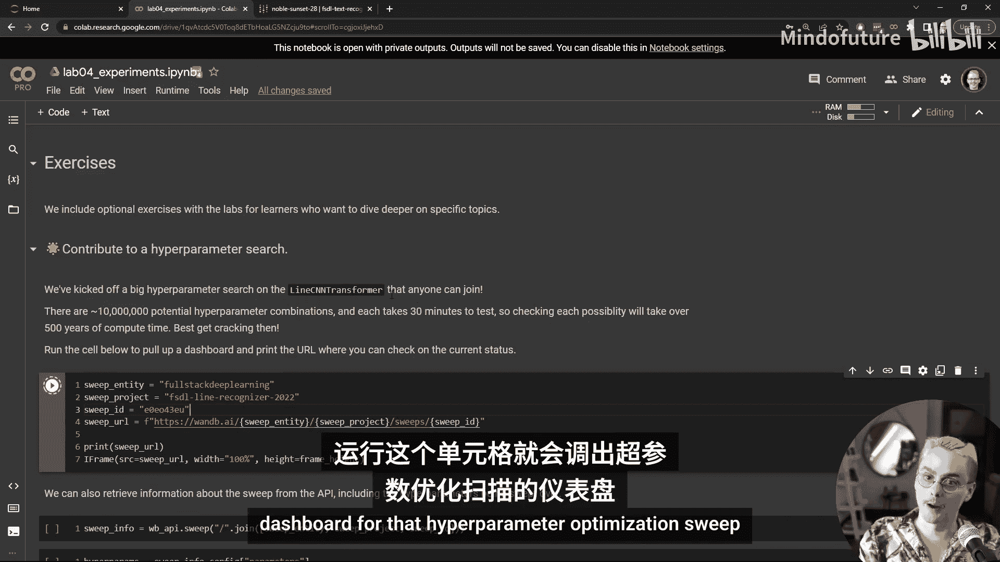

还有这些非常漂亮的平行坐标图，你可以在其中过滤运行，查看哪些具有最差的验证损失，哪些具有最佳的验证损失，你会看到上面的图表正在重新计算。因此，对于具有最高学习率的运行，假设我们只关心具有最高学习率的运行，那么什么参数成为改变损失值最重要的参数，这些参数有什么影响？这是一个非常好的界面，用于对超参数优化实验的结果进行快速探索性分析。然后，你可以拉取数据并进行严格的统计分析，或者直接说“YOLO”，选择性能最佳的参数，并开始一个大的训练运行。

要为该扫描做出贡献，只需更改此 `count` 的值。在扫描中运行一个单独的运行（检查一个超参数配置）大约需要 30 分钟，除非它由于内存不足错误在前 30 秒崩溃，这在某些系统上对于某些超参数组合会发生。

第二个练习要求你更熟悉 Python 中的 WandB SDK。我们在全栈深度学习文本识别器代码库中所做的一切几乎都使用与 PyTorch Lightning 的集成，但如果你有兴趣手动记录东西，比如在我们的结构化表格中重新创建图像和文本记录，或者如果你有兴趣将 Weights & Biases 与没有集成的不同框架一起使用，那么你将需要学习其中一些方法。

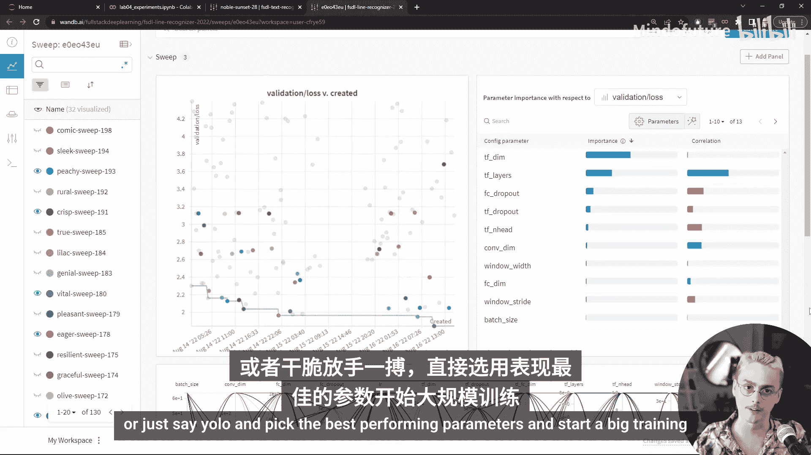

第三个练习邀请你尝试为 Line CNN-Transformer 找到自己的良好超参数。如果有人能找到一组比我们大型超参数优化扫描得出的更好的超参数，我尤其感兴趣。如果你在训练此 Line CNN-Transformer 时观察到任何有趣的现象，请获取这些图表，将它们放入 W&B 报告中，并与全栈深度学习社区的其他人在 YouTube 或 Twitter 上分享，或者如果你发现错误或一些奇怪的行为，请在 GitHub 上提交问题，包括你的 W&B 报告或运行页面，我们会查看。

最后一个练习需要最多的额外编码，涉及使用 `torchmetrics` 库添加一些关于张量的额外统计信息记录。你将有机会看看编写实际计算记录到实验管理系统的指标的代码是什么样子，并更深入地了解 PyTorch Lightning 和 `torchmetrics` 中的指标和记录。

---

## 总结

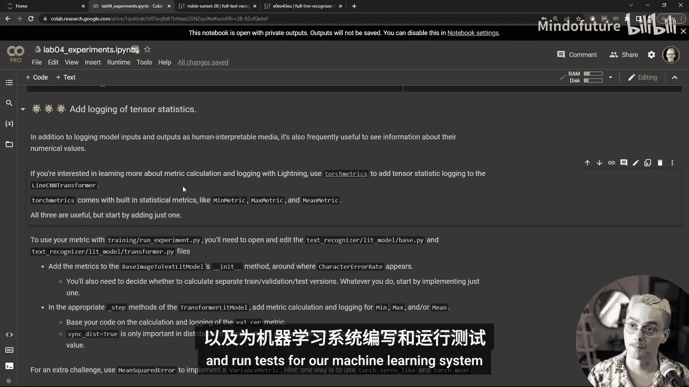

这就是本周关于实验管理的实验的全部内容。下次，我们将学习如何对深度神经网络的训练进行故障排除，如何在 ML 代码库中进行代码质量保证，以及如何为我们的机器学习系统编写和运行测试。我期待着它。下次见。