# Full Stack 深度学习 ｜ Full Stack Deep Learning   2022 p08 P08_Lecture_03-故障排除与测试 -BV1k4YXznEjw_p8-

Hey， folks， welcome to the third lecture of Fullt Deep Learning 2022。 I'm Charles Fry。

 Today I'll be talking about troubleshooting and testing high level outline of what we're going to cover today。

 We'll talk about testing software in general and the sort of standard tools and practices that you can use to derisk shipping software quickly。

 then we'll move on to special considerations for testing machine learning systems。

 the specific techniques and approaches that work best there。 and then lastly。

 we'll go through what you do when your models are failing their tests。

 how you troubleshoot your model。 First， let's covered concepts for testing software。

 So the general approach that we're going to take is that tests are going to help us ship faster with fewer bugs。

 but they aren't going to catch all of our bugs。 and that means though we're going to use testing tools we aren't going to try and achieve 100% coverage。

 Similarlyly， we're going to uselynting tools to try and improve the development experience but leave escape valves rather than pedantically just following our style guides。

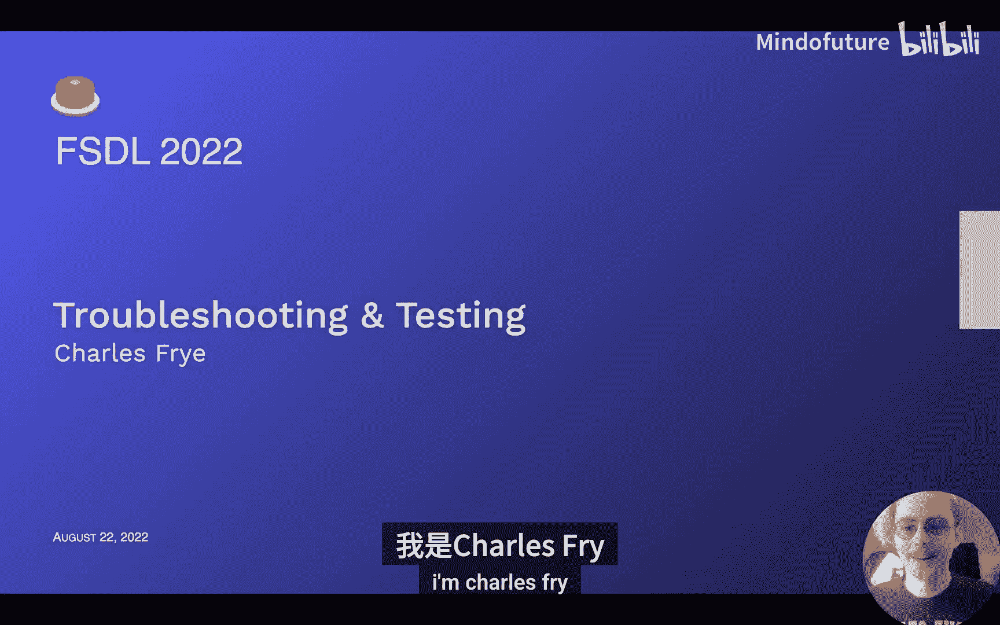

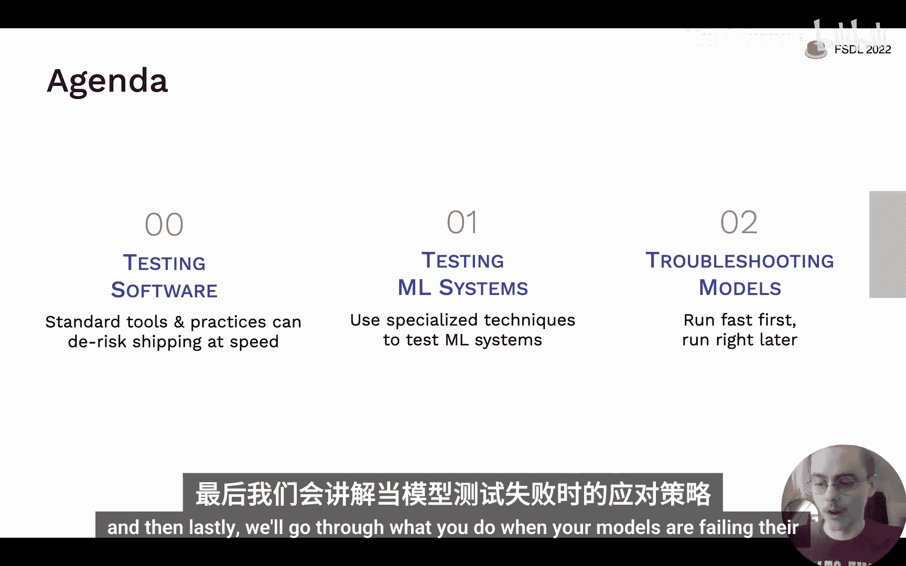

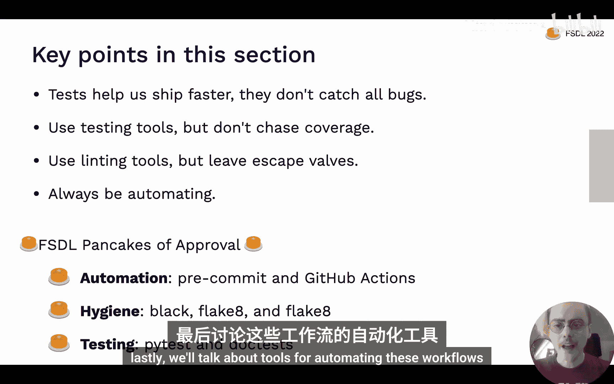

lyWe'll talk about tools for automating these workflows So first。

 why are we testing at all Test can help us ship faster even if they aren't catching all bugs before they go into production So reminder what even our tests tests are code be bright that's designed to fail in an intelligible way when our other code has bugs so for example this little test for the text recognize from the full stack deep learning codeb checks whether the output of the text on a particular input is the same as what was expected and raises an error if it's not and these kinds of tests can help catch some bugs before they merged into main or shipped into production but they can't catch all bugs and one reason why is that test suites in the tools we're using are not certificates of correctness in some formal systems tests like those can actually be used to prove that code is correct but we aren't working in one of those systems like AGda the theorem improvingrov language or Iris2 we're writing in Python and so really。

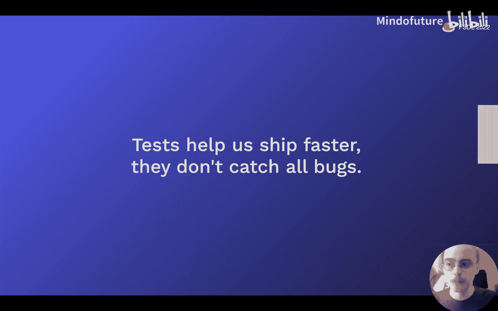

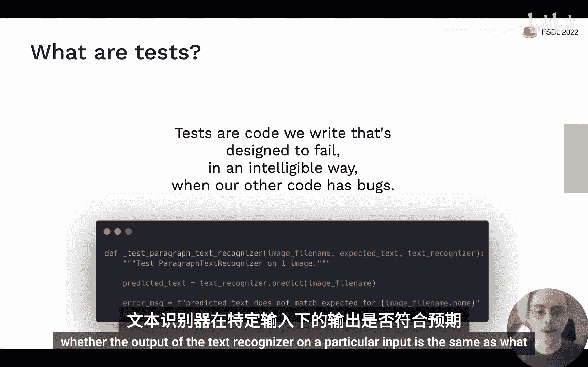

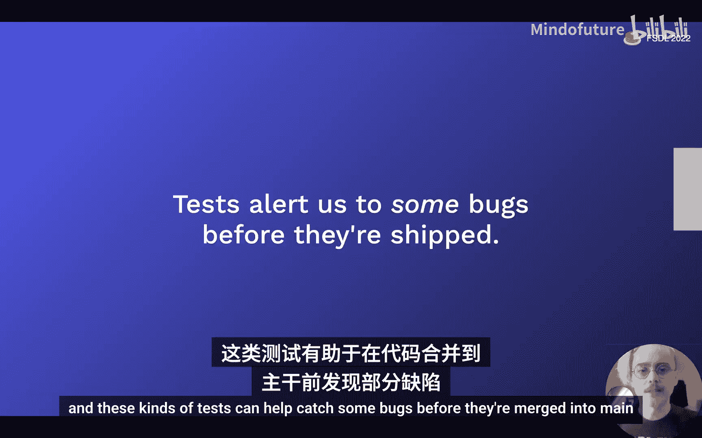

A loosey goosey language and all bets are off in terms of code correctness So if test suites aren't like certificates of correctness then what are they like I like this framing from Nelson Elhaga whos at anthropic AI who says so that we should think of test suites as being more like classifiers and sort of bring our intuition from working with classification algorithms and machine learning so the classification problem is does this commit have a bug or is it okay and what our classifier outputs is that the test pass or the test fails or our tests are our classifier of code and so we should think of that as a prediction of whether there's a bug this kind of frame shift suggests a different way of designing our test suites when we design classifiers we know that we need to trade off detection and false alarms lots of people are thinking about detection when they're designing their test suites they're trying to make sure that they will catch all of the possible bugs but in doing so we can inadvertently introduce。

False alarms so the classic signature of a false alarm is a failed test that's followed by a commit that fixes the test rather than the code so that's an example from the full stack deep learning code base So in order to avoid introducing too many false alarms it's useful to ask yourself too questions before adding a test the first question is which real bugs will this test catch what are some actual ways that the world might change around this code or that somebody might introduce a change to some part of the code base that this test will catch once you've listed a couple of those then ask yourself what are some false alarms that this test might raise。

 what are some ways that the world around the test or the code could change that still valid and good code but now this test will fail and if you can think of more examples for the latter case than the former then maybe you should reconsider whether you really need this test one caveat to this in some settings it actually is really important。

that you have a super high degree of confidence in the correctness of your code So this screenshot is from a deep learning diagnostic tool for cardiac ultrasounds by caption health that I worked on in an internship in that project we had a ton of concern about the correctness of the model the confidence people had in the model and regulators expected to see that kind of information So there's other cases where this level of correctness is needed self-driving cars is one example you also see this in banking and finance there are a couple of patterns that immediately arise here one is the presence of regulators and more generally high stakes if you're operating in a high stakes situation where errors have consequences for people's lives and livelihoods even if it's not regulated yet it might be regulated soon and in particular these are also all examples of those autonomous systems that class of low feasibility high impact machine learning project that we talked about in the first lecture is one of the。

Reasons for their low feasibility is because correctness becomes really important for these kinds of autonomous systems So what does this mindset mean for how we approach testing and quality assurance for our code。

 it means that we're going to use testing tools but we don't want to aim for complete coverage of our code So in terms of tools。

 Pyt is the standard tool for testing python code it is a very pythonic implementation and interface and it has also a ton of power features like marks for creating separate suites of tests sharing resources across tests and running tests in a variety of parameterized variations in addition to writing the kinds of separate test suites that are standard in lots of languages in Python there's a nice builtin tool called doc tests for testing the code inside of our doc strings and this helps make sure that our docstrs don't get out of sync with our code which builds trust in the content of those doc strings and makes them easier to maintain doc tests are really。

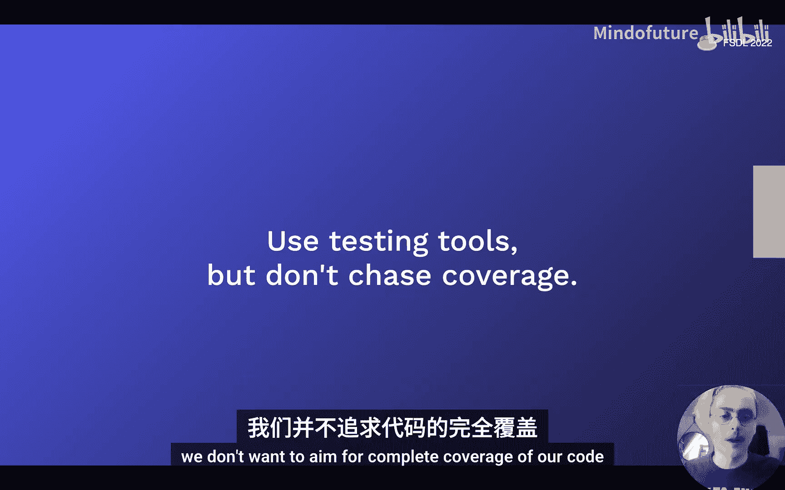

Nice but there are some limits there're framed around code snippets that could be run in a terminal and so they can only display what can be easily displayed in a terminal Notes on the other hand can display things like rich media charts。

 images and web pages also interleaved with code execution and text So for example with our data processing code we have some notebooks that have charts and images in them that explain choices in that data processing trouble is notebooks are hard to test we use a cheap and dirty solution we make sure that our notebooks run and to end then we add some assert statements and we use NB format to run the notebooks and flag when they fail so once you start adding lots of different types of tests and as your codebase grows you're going to want to have tooling for recording what kind of code is actually being checked or covered by the tests typically this is done in terms of lines of code but some tools can be a little bit more finer grained the tool that we recommend for this is called。

CCve， it generates a lot of really nice visualizations that you can use to drill down or get a highlevel overview of the current state of your testing so it's a great tool for helping you understand your testing at its state it can be incorporated into your testing effectively saying I'm going reject commits not only where test fail but also where test coverage goes down below some value or by a certain amount。

 but we actually recommend against that personal experience interviews and even some published research suggests that only a small fraction of the tests that you write are going to generate the majority of your value and so the right tactic engineering wise is to expend the limited engineering effort that we have on the highest impact test and making sure those are super high quality but if you set a coverage target then you're instead going write tests in order to meet that coverage target regardless of their quality so you end up spending more effort both write the tests in them to maintain。

And deal with their low quality In addition to checking that our code is correct。

 we're going to also want to check that our code is clean with linting tools。

 but with the caveat that we always want to make sure that there are  escape valves from these tools。

 when we say that code is clean what we mean is that it's of a uniform style and of a standard style So uniform style helps avoid a spending engineering time on arguments over style in pull request and code review it also helps improve the utility of our version control system by cutting down on unnecessary noisy components of dips and reducing their size。

 both of these things will make it easier for humans to visually parse the dips in our version control system and make it easier to build automation around them。

 and then we also generally want to adopt a standard style in whatever community is that we are writing our code if you're an open source repository this is going make it easier to accept contributions and even if you're working on。

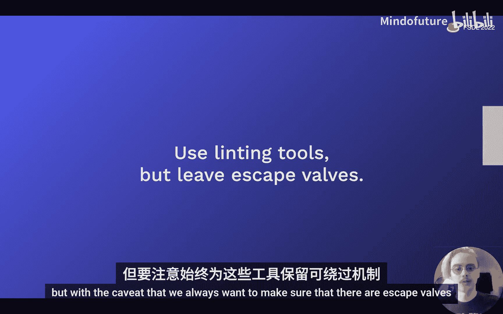

AC source team， if your new team members are familiar with this style that's standard in the community。

 they'll be faster to onboard one aspect of consistent styles consistent formatting of code things like whitespace。

 The standard tool for that in Python is the black Python format。

 It's a very opinionated tool but it has a fairly narrow scope in terms of style it focuses on things they can be fully automated so you can see it not only detects deviations from style。

 but also implements the fix so that's really nice integrated into your editor integrated into automated workflows and avoid engineers having to implement these things themselves for non-autable aspects of style。

 the tool we recommend is Fake8 nonauable aspects of style or things like missing doc strings We don't have good enough automation tools to reliably generate doc strings for code automatically So these are gonna to require engineers to intervene in order to fix them of the best。

Things about Fake8 is that it comes with tons of extensions and plugin so you can check things like docstream style and completeness like type hint and even for security issues and common bugs all via flake8 extensions so those cover your python code Ml code bases often have both python code and shell scripts in them She scripts are really powerful but they also have a lot of sharp edges so shellll check knows about all these kinds of weird behaviors of bash that often cause errors and issues that aren't immediately obvious and it also provides explanations for why it's raising a warning or an error it's a very fast to run tools so you can incorporate it into your editor and because it includes explanations you can often resolve the issue without having to to go to Google or stack overflow and switch context out of your editing environment So these tools are great in a uniform style is important but really pedantically enforcing style can be self-deing。

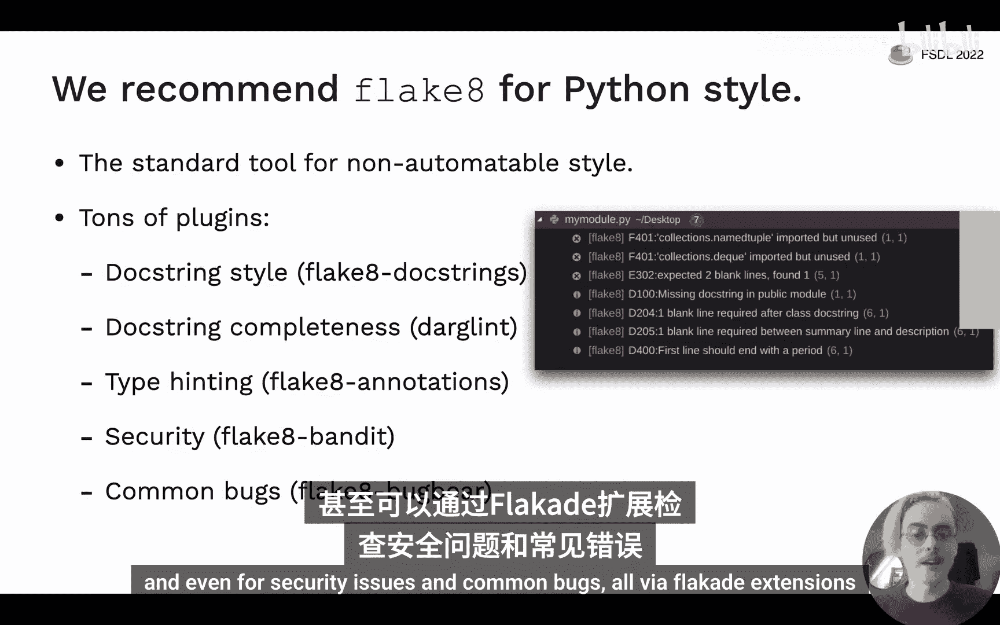

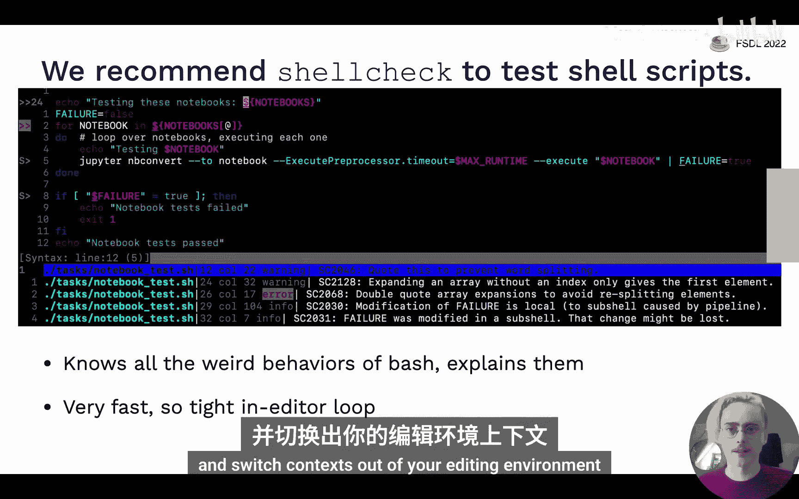

So I searched for the word slatecate on Gitthub and found over 100，000 commits。

 mentioning placating these kinds of automated style enforcement tools and all these commits sort of drip frustration from engineers who are spending time on this that they wish that they were not so to avoid frustration with code style and liing we recommend filtering your rules down to the minimal style that achieves the goals that we set of sticking with standards and of avoiding arguments and of keeping version control history clean Another suggestion is to have an opt in rather than an optout application of rules so by default many of these rules may not be applied to all files in the codebase but you can opt in and add rule through a particular file and then you can sort of grow this coverage over time and avoid these kinds of frustrations this is especially important for applying these kinds of style recommendations to existing codebs which may have thousands of lines of code that need to be fixed。

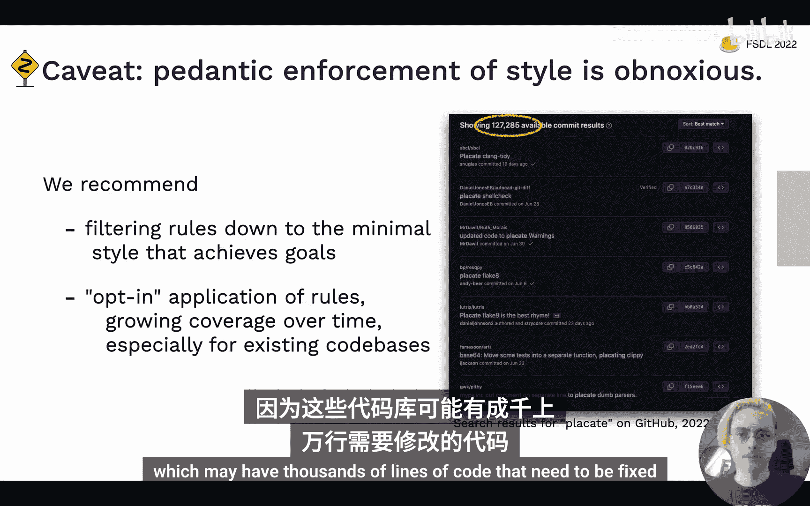

And in order to make best use of these testing and linting practices。

 you're going to want to embrace automation as much as possible in your development workflows for the things we've talked about already with testing and Liing you're going to want to automate these and connect them to your cloud version control system and run these tests in the cloud or otherwise outside of development environments So connecting diversion control state reduces friction when trying to reproduce or understand errors and running things outside of developer environments means that you can run these tests in parallel to other development work so you can kick off tests that might take 10 or 20 minutes and spend that time responding to Slack messages or moving on to other work one of the best places to learn about best practices for automation are popular open source repo so I checked out Ptorchches GiHub repository and found that they had tons and tons of automated workflows built into the。

They also followed what I think are some really nice practices like they have some workflows that are automatically running on every push and pull and these are mostly code related tasks that run for less than 10 minutes so that's things like Linting and maybe some of the quicker tests other tasks that aren't directly coderelated but maybe do things like check dependencies and any code related tasks that take more than 10 minutes to run are run on a schedule so we can see that。

 for example， closing stale pull requests is done on a schedule because it's not code related Pytorch also runs a periodic suite of tests that takes hours to run you don't want to run that every time that you push or pull so the tool that they use and that we recommend is Github actions This ties your automation entirely directly to your version control system and that has tons of benefits Also Github actions is really powerful it's really flexible there's a generous free tier it's performant and on top of all this。

Really easy to use It's got really great documentation configuring GitHub actions is done just using a Yal file and because of all these features it's been embraced by the open source community which has contributed lots and lots of Github actions that maybe already automate the workflow that you're interested in that's why we recommend Github actions there are other options precommitci circleci and Jenkins all great choices all automation tools that I've seen work but GiHub actions seems to have one hearts and minds in the open source community in the last couple years so that makes sure that these tests and links are being run in code before it's shipped or before it's merged into mainine but part of our goal was to keep our Virgin control history as clean as possible so we want to be able to run these locally as well and before committing and so for that we recommend a tool called precommit which can run all kinds of different tools and automations automatically before commits。

Extremely flexible and can run lots of stuff you will want to keep the total runtime to just a few seconds or you'll discourage engineers from committing which can lead to work getting lost precommits super easy to run locally in part because it separates out the environment for these linting tools from the rest of the development environment which avoids a bunch of really annoying tooling and system administration headaches they're also super easy to automate with Github actions Auto to ensure the quality and integrity of our software is a huge productivity enhancers broader than just CicCD which which is how you might hear tools like Github actions referred to automation helps you avoid context switching if a task is being run fully automatically then you don't have to switch context and remember the command line arguments that you need in order to run your tool It services issues more quickly than if these things were being run manually it's a huge force multiplier for small teams that can't just throw engineer hours at problems and it's better documented than manual process。

The script or artifact that you're using to automate a process serves as documentation for how a process is done if somebody wants to do it manually。

 The one caveat is that fully embracing automation requires really knowing your tools well knowing Docker well enough to use it is not the same as knowing Docker well enough to automate it and bad automation like bad tests can take more time away than it saves so organizationally that actually makes automation really good tasks for senior engineers who have knowledge of these tools have ownership over code and can make these kinds of decisions around automation perhaps with junior engineer mentees to actually write the implementations So in summary。

 automate tests with Github actions to reduce friction in development and move more quickly use the standard Python toolkit for testing and cleaning your projects and choose in that toolkit the testing and liing practices with 8020 principle for tests with shipping velocity and with usability and developer experience in mind that we've covered。

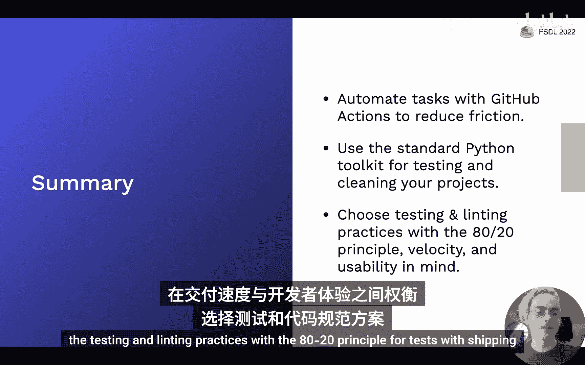

General ideas for testing software systems。 Let's talk about the specifics that we need for testing machine learning systems。

 The key point in this section is that testing ML is difficult。

 but if we adapt Mlspecific coding practices and focus on lowhan fruit to start than we can test our ML code and then additionally testing machine learning means testing and production but testing and production doesn't mean that you can just release bad code and let God sort it out So why is testing machine learning hard so software engineering is where a lot of testing practices have been developed and in software engineering we compile source code into programs so we write source code and a compiler turns that into a program that can take inputs and return outputs in machine learning training compiles in a sense data into a model and all of these components are harder to test in the machine learning case than in the software engineering case data is heavier and more inscrutable。

Source code training is more complex， less welldefined and less mature than compilation and models have worse tools for debugging an inspection than compiled programs So this means that Ml is the dark souls of software testing it's a notoriously difficult video game but just because something is difficult doesn't mean that it's impossible in the latest souls game Elden ring a player named let me solo her defeated one of the hardest bosses in the game wearing nothing but a jar on their head if testing machine learning code is the dark Sos of software testing than with practice and with the right techniques you can become the let me solo her of software testing and so in our recommendations in this section we're gonna focus mostly on what are sometimes called smoke tests which lets you know when something is on fire and help you resolve that issue so these tests are。

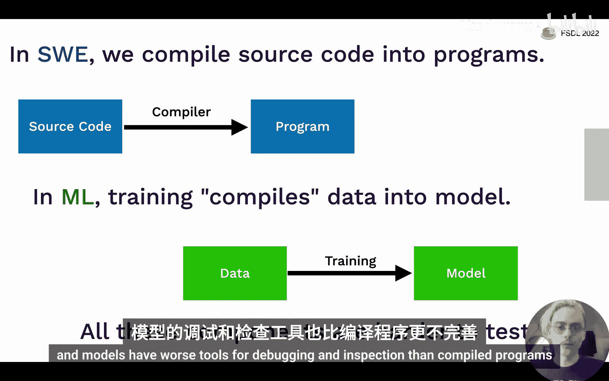

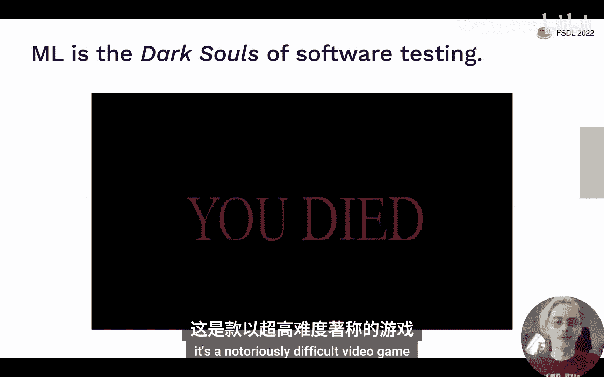

Easy to implement， but they are still very effective so they're among the 20% of tests that get us 80% of the value for data。

 the kind of smoke testing we recommend is expectation testing so we test our data by checking basic properties we express our expectations about the data which might be things like there are no nulls in this column the completion date is after the start date so with these you're going to want to start small checking only a few properties and grow them slowly and only test things that are worth raising alarms over worth sending people notifications worth bringing people in to try and resolve them so you might be tempted to say oh these are human heights they should be between four and8 feet but actually there are people between the heights of two and10 feet so loosening these expectations to avoid false positives is an important way to make them more useful so you can even say that heights should be not negative and less than 30 feet and that will catch somebody maybe be accident。

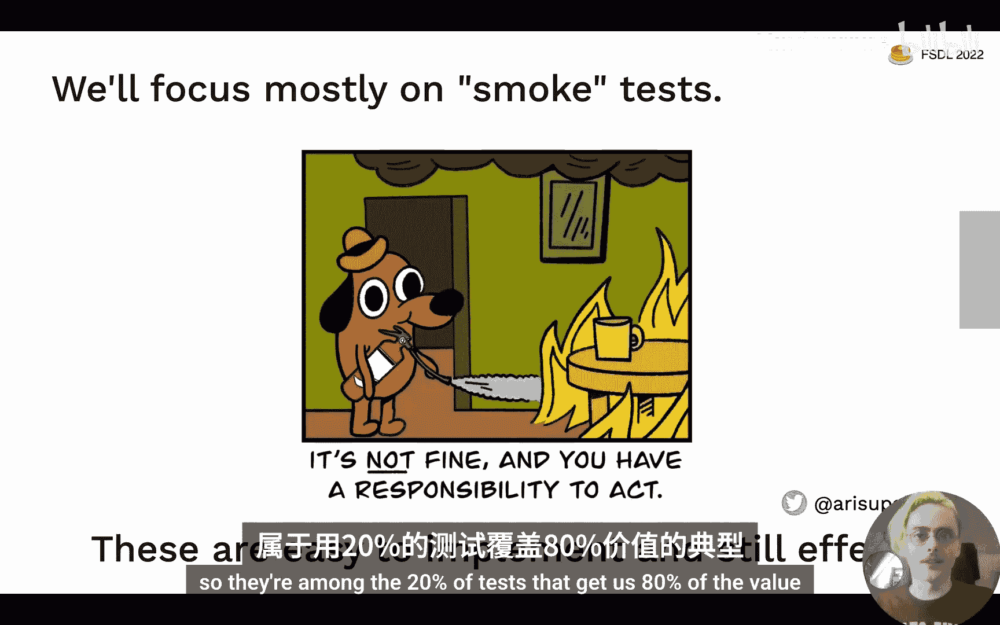

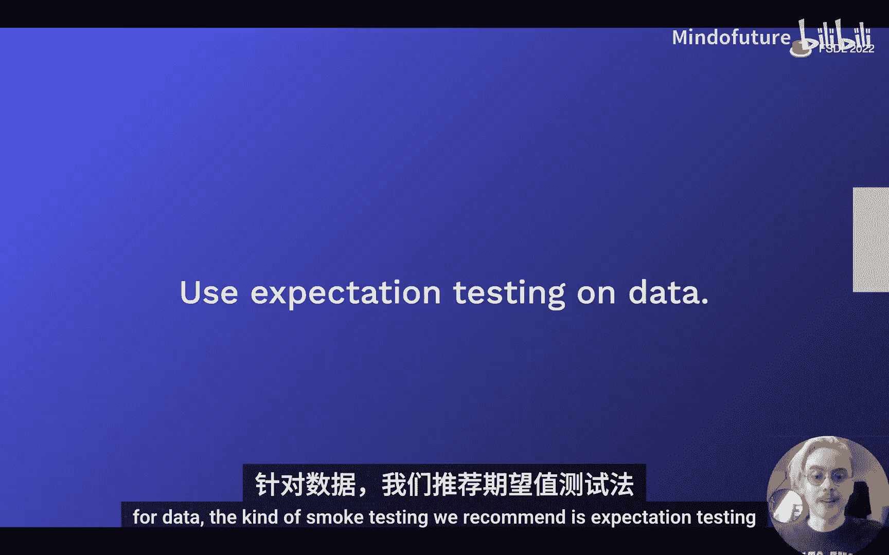

Entering a height in inches， but it doesn't express strong expectations about the statistical distribution of heights you could try and build something for expectation testing with a tool like Pi there's enough specifics and there's good enough tools that it's worth reaching for something else the tool we recommend is great in part because great expectation automatically generates documentation for your data and quality reports and has built in logging and learning design for expectation testing So we are going to go through this in the lab will go through a lot of the other tools that we've talked about in the lab this week so if you want to check out great we recommend the made withml tutorial on great by gokuma loose expectation testing is a is a great start for testing your data pipeline what do you do as you move forward from that the number one recommendation that I have is to stay as close to your data as possible So from top to bottom we have data annotation setups。

Going from furthest away from the model development team to closest one common pattern is that there's some benchmark data set with annotations that you're using。

 which is super common in academia， or there's an external annotation team which is very common in industry and in that case a lot of the detailed information about the data that you can learn by looking at it and using it yourself are going to be internalized into the organization。

 so one way that that sometimes does get internalized is that at the start of the project。

 some data will get annotated ad hoc by model developers。

 especially if you're not using some external benchmark data or you don't yet have budget for an external annotation team and that's an improvement。

 but if the model developers who are around at the start of the project move on and as more developers get onboarded that knowledge is diluted better than that is an internal annotation team that has regular information flow whether that's standups and syncs or exchange of documentation that information flow。

to the model developers but probably the best practice and one that I saw recommended by Sreya Shankar on Twitter is to have a regular oncall rotation where model developers annotate data themselves ideally fresh data so that all members of the team who are developing models know about the data and develop intuition and expertise in the data for testing our training code we're going to use memorization testing So memorization is the simplest form of learning deep neural networks are very good at memorizing data and so checking whether your model can memorize a very small fraction of the full data is a great smoke test for trading and if a model can't memorize then something is clearly very wrong only really gross issues with training are going to show up with this test so your gradients aren't being calculated correctly you have a numerical issue your labels have been shuffled and subtle bugs in your model or your data are not going to show up in this but you。

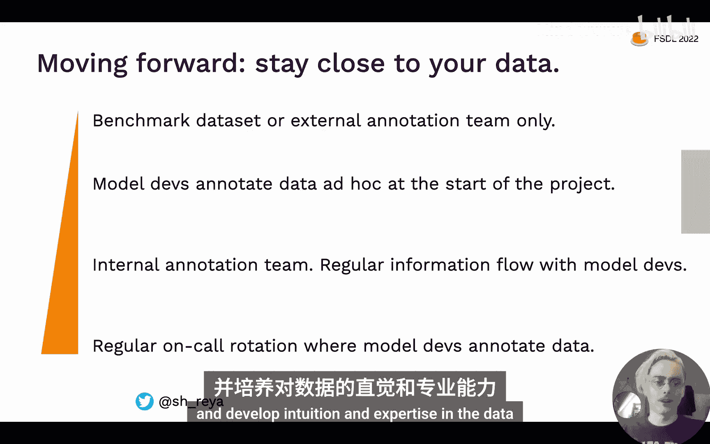

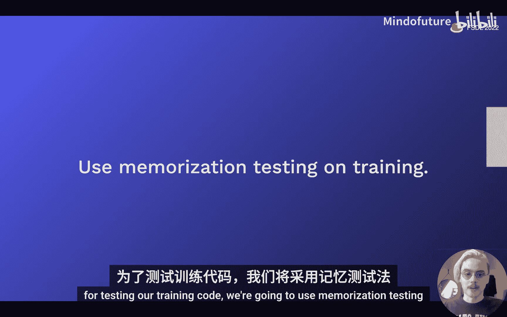

Prove the coverage of this test by including the runtime in the test because regressions there can reveal bugs that just checking whether you can eventually memorize a small dataset wouldn't reveal So if you're including the wall time that can catch performance regressions but also if you're including the number of steps or epochs required to hit some criterion value of the loss then you can catch some of these small issues that make learning harder but not impossible there's a nice feature of Pytors lighting overfit batches that can quickly implement this memorization test and if you design them correctly。

 you can incorporate these tests into endto end model deployment testing to check to make sure that the data that the model memorized in training is also something you can correctly respond to in production with these memorization tests you're going want to tune them to run quickly so that you can run them as often as possible if you can get them to under 10 minutes you might run them on every pull request or on every So this is something that we worked on in updating the course for 2022 so the simplest way to speed these jobs up is to simply by。

machines， but if you're already on the fastest machines possible or you don't have budget。

 then you can start by reducing the size of the data set that the model is memorizing down to the batch size that you want to use in training What you reduce the batch size below what's in training you're starting to step further and further away from the training process that you're trying to test and so going down this list we're getting further and further from the thing that we're actually testing but allowing our test to run more quickly the next step that can really speed up a memorization test is to turn off regularization which is meant to reduce overfitting and memorization is a form of overfitting so that means turning off dropout turning off augmentation you can also reduce the model size without reducing the architecture so reduce the number of layers reduce the widths of layers while keeping all of those components in place and if that's not enough you can remove some of the most expensive components and in the end you should end up with a tier of memorization tests which are more or less close to how you actually train。

In production that you can run on different timescales One recommendation you'll see moving forward and trying to move past just smoke testing by checking for memorization is to rerun old training jobs with new code so this is never something that you're gonna be able to run on every push probably not nightly either if you're looking at training jobs that run for multiple days and the fact that this takes a long time to run is one of the reasons why it's gonna to be really expensive no matter how you do it for example。

 if you're going to be doing this with C C you'll need GPU runners to execute your training jobs but those are only available in the enterprise level plan which is 24000 a year at a bare minimum I've seen some very large bills for running GPUs in C C Github actions on the other hand does not have GPU runners available so you'll need to host them yourself though it is on the roadmap to add GPU runners to Github actions and that means that you're probably gonna maybe double your training spend maybe you're adding an extra machine to rerun your training jobs or maybe you're adding。

to your cloud budget to pay for more cloud machines to run these jobs and all this expenditure here is only on testing code It doesn't have any connection to the actual models that we're trying to ship the best thing to do is to test training by regularly running training with new data that's coming in from production this is still going to be expensive because you're going to be running more training than you were previously but now that training spend is going to model development not code testing so it's easier to justify Having this set up requires the data flywheel that we talked about in lecture1 and that requires production monitoring tooling and all kinds of other things that we'll talk about in the monitoring and continual learning lecture Lastly for testing our models we're going adapt testing at a very base level models are effectively functions so we can test them like functions they take in inputs they produce outputs we can write down what those outputs should be for specific inputs and then test。

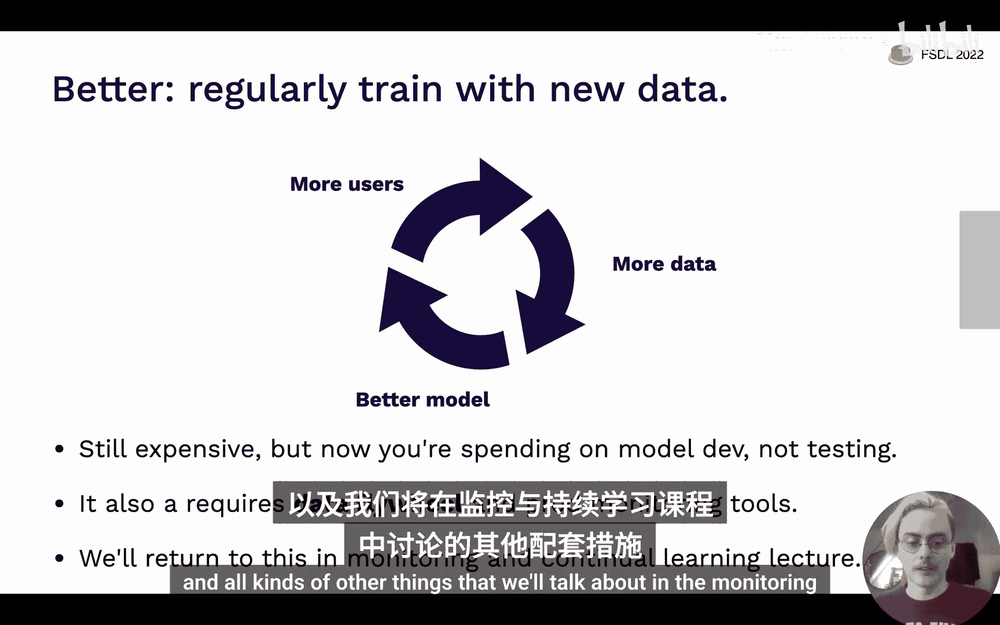

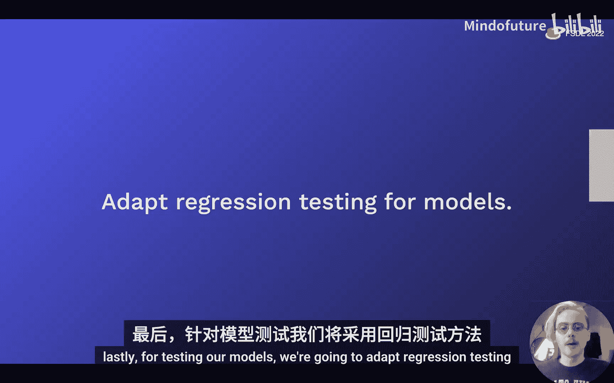

This is easiest for classification and other tests with simple output If you have really complex output like for example。

 a text recognizer that returns tests， then these tests can often become really flaky and hard to maintain but even for those kinds of outputs you can use these tests to check for differences between how the model is behaving in training and how it's behaving in production the better approach is still relatively straightforward is to use the values of the loss and your metrics to help build documented regression test suites out of your data out of the data you're using in training and the data you see in production the framing that I like to bring to this comes from test drivenven development so test driven development is a paradigm for testing that says first you write the test and that test fails because you haven't written any of the code that it's testing and then you write code until you pass the test this is straightforward to or incorporate into testing our models because in some sense we're already doing it think of the loss as like a fuzzy testing rather than simply failing or not failing。

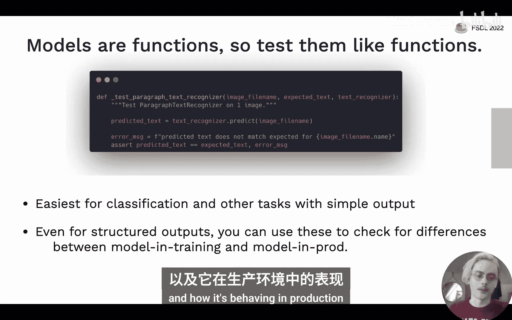

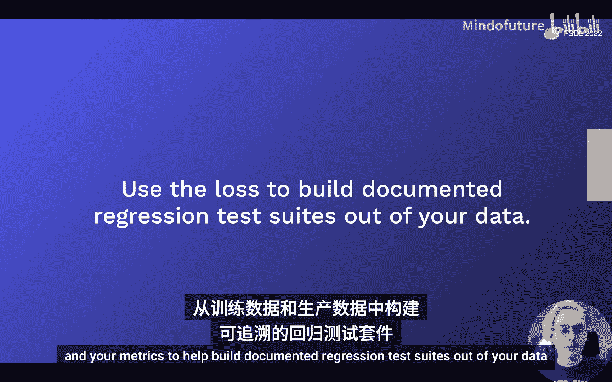

The loss tells us how badly a test was failed So how badly did we miss the expected output on this particular input and so just like in test driven development。

 that's a test that's written before that code writing process and during training our model is changing and it changes in order to do better on the test that we're providing and the model stops changing once it passes the test so in some sense gradient descent is already test driven development and maybe that is an explanation for the Carpathy quote that gradient descent writes better code than me but just because gradients is test driven development doesn't mean that we're done testing our models because what's missing here is that the loss and other metrics are telling us that we're failing but they aren't giving us actionable insights or a way to resolve that failure the simplest and most generic example is defined data points with the highest loss in your validation and test set or coming from production and put them in a sweet labeled。

Hard， but note that the problem isn't always going to be with the model searching for highlo examples does reveal issues about what your model is learning。

 but it also reveals issues in your data like bad labels so this doesn't just test models it also tests data and then we want to aggregate individual failures that we observe into named suites of specific types of failure so this is an example from a self-driving car task of detecting pedestrians cases where pedestrians were not detected it's much easier to incorporate this into your workflows if you already have a connection between your model development team and your annotation team reviewing these examples here we can see that what seems to be the same type of failure is occurring more than once In two examples there's a pedestrian who's not visible because they're covered by shadows and two examples there are reflections off of the windshield that are making it harder to see the pedestrian and then some of the examples come from night scenes so we can collect。

uppCre a data with that label and treat these as test suites to drive model development decisions。

 and so this is kind of like the machine learning version of a type of testing called regression testing。

 where you take bugs that you've observed in production and add them to your test suite to make sure that they don't come up again So the process that I described is very manual but there's some hope that this process might be automated in the near future a recent paper described a method called domino that uses much。

 much larger crossmodal embedding models so foundation models to understand what kinds of errors a smaller model like a specific model designed just to detect birds or pedestrians what kinds of mistakes is it making on images as your models get more mature and you understand their behavior in the data that they're operating on better you can start to test more features of your models so for more ways to test models with an emphasis on NLP see the checklist paper that talks about different ways to do behavioral testing of models In addition to test。

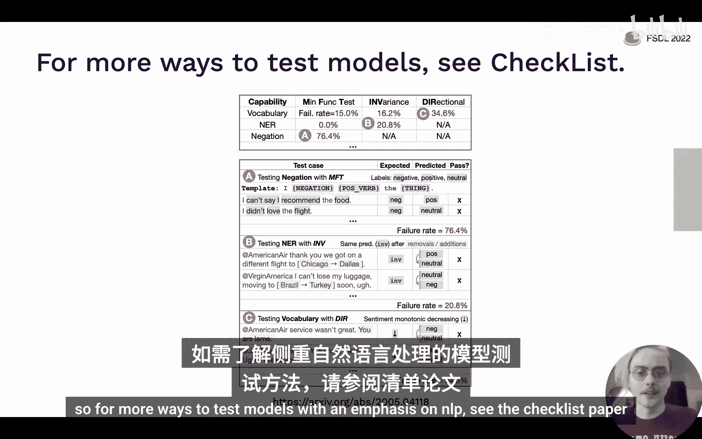

Data， training and models in our development environment we're also going to want to test in production and the reason why is that production environments differ from development environments This is something that is true for complex software systems outside of machine learning so charity majors of honeycomb has been a big proponent of testing and production on these grounds and this is especially true for machine learning models because data is an important component of both the production the development environments and it's very difficult to ensure that those two things are close to each other and so the solution in this case is to run our tests in production but testing in production doesn't mean only testing in production testing in production means monitoring production for errors and fixing them quickly as chipwin。

 the author of designing machine learning systems pointed out this means building infrastructure and tooling so that errors in production are quickly fixed doing this safely。

Effectively and ergonomically requires tooling to monitor production and a lot of that tooling is fairly new。

 especially tooling that can handle the particular type of production monitoring that we need in machine learning willll cover it along with monitoring and continual learning in that lecture so in summary we recommend focusing on some of the lowhan fruit when testing Ml and sticking to tests that can alert you alert you to when the system is on fire so that means expectation tests of simple properties of data memorization tests for training and database regression tests for models but what about as your codebase and your team matures one really nice rubric for organizing the testing or really mature M codebase is the ML test score so the ML test score came out of Google research and it's this really strict rubric for ML test quality so it includes tests for data models training infrastructure and production monitoring and it overlaps with but goes beyond some of the recommendations。

That we've given alreadyMaintain and automating all of these tests is really expensive。

 but it can be worth it for a really highs stakes or largescale machine learning system so we didn't use the ML test score to design the text recognizer code base but we can check what we implemented against it Some of the recommendations in the machine learning test score didn't end up being relevant for our model for example。

 some of the data tests are organized around tabular data for traditional machine learning rather than for deep learning but there's still lots of really great suggestions in the ML test score so you might be surprised to see we're only hitting a few of these criteria in each category that's a function of how strict this testing rubric is so they also provide some data on how teams doing M at Google did on this rubric and if we compare ourselves to that standard the text recognizer is。

In the middle， which is not so bad for a team not working with Google scale resources test alert us to the presence of bugs。

 but in order to resolve them will need to do some troubleshooting and one of the components of the machine learning pipeline that's going to need the most troubleshooting and which is going to require very specialized approaches is troubleshooting models So the key idea in this section is to take a threestep approach to troubleshooting your model first make it run by avoiding the common kinds of errors that can cause crashes shape issues out of memory errors and numerical problems then make your model fast by profiling it and removing any bottlenecks then lastly。

 make the model right improve its performance on test metrics by scaling out the model in the data and sticking with proven architectures First how do we make a model runLuckiily this step is actually relatively easy in that only a small portion of bugs in machine learning cause the kind of loud failure that we're tackling here。

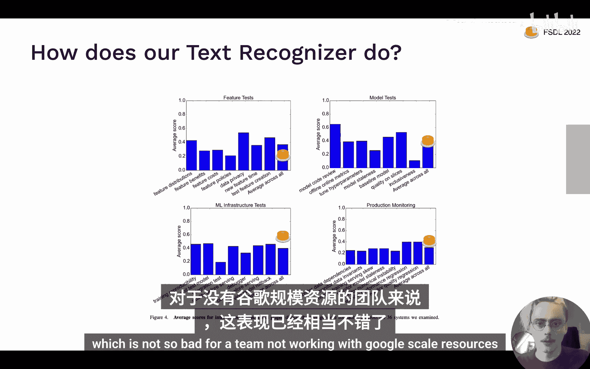

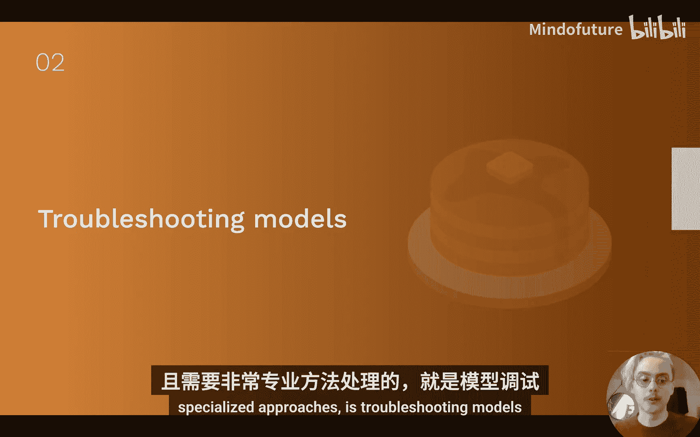

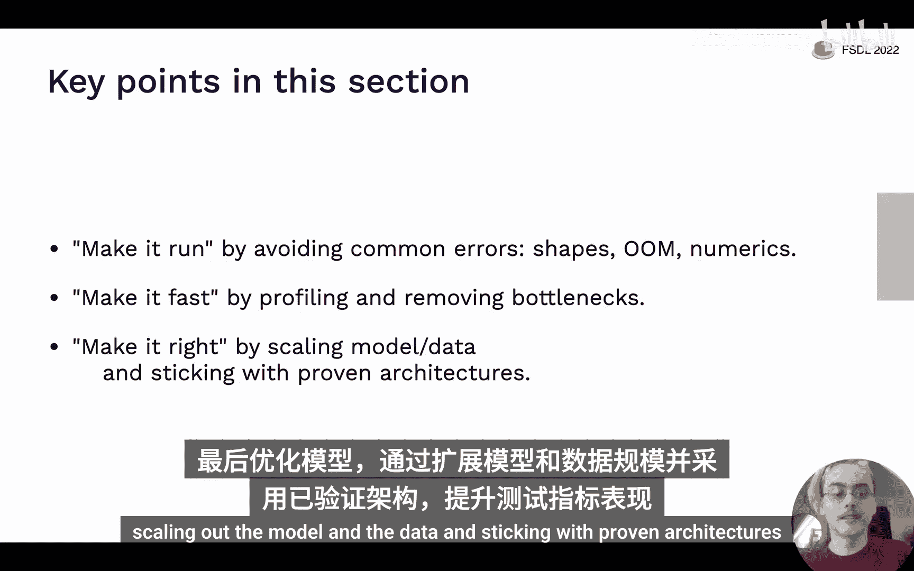

shapepe errors out of memory errors and numerical errors shapepe errors occur when the shapes of tensors don't match the shapes expected by the operations applied to them So while you're writing your pytorch code it's a good idea to keep notes on what you expect the shapes of your tensors to be to annotate those in the code as we do in the full stack deep learning code base and to even step through this code in a debugger checking the shapes as you go Another one of the most common errors and deep learning is out of memory when you try and push a tensor to the GPU that's too large to fit on it something of a ri of passage for deep learning engineeringLuckily Pytorch lighting has a bunch of really nice tools built into this first make sure you're using the lowest precision that your training can tolerate a good default is half precision floats or 16 bit floats a common culprit is that you're trying to run your model on too much data at once on too large of a batch so you can use the autoscale batch size。

Feaature in pytor lightning to pick a batch size that uses as much GPU memories you have but no more and if that batch size is too small to get you stable gradients that can be used for training。

 you can use gradient accumulation across batches also easily within lightning to get the same gradients that you would have gotten if you' calculated on a much larger batch if none of those work and you're already operating on GPUs with the maximum amount of RA then you'll have to look into manual techniques like tensor parallelism and gradient checkpointing another cause of crashes for machine learning models is numerical errors when tensors end up with Ns or infinite values in them Most commonly these numerical issues appear first in the gradient the gradients explode or shrink to zero and then the values of parameters or activations become infinite or no so you can observe some of these gradient spikes occurring in some of the experiments for the Dolly mini project that have been publicly posted Pytorch lightingning comes with a nice tool for。

Tracking gradient norms and logging them so that you can see them and correlate them with the appearance of Nans and infinities and crashes in your training。

 a nice debugging step to check what the cause might be。

 whether the causes due to precision issues or due to a more fundamental numerical issue is to switch to double precision floats that default floating point size and Python 64 bit floats and see if that causes these issues to go away if it doesn't then that means that there is some kind of issue with your numerical code and you'll want to find a numerically stable implementation to base your work off of or apply error analysis techniques and one of the most common causes of these kinds of numerical errors are the normalization layers like batch norm and layer norm that's what's involved in these gradient spikes in Dolly mini so you'll want to make sure to check carefully that you're using normalization in the way that's been found to work for the types of data and architectures that you're using once your battle can actually run and to end and calculate gradients correctly the next。

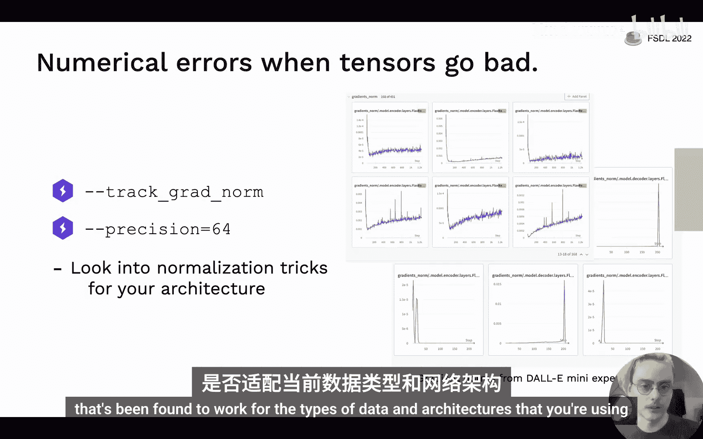

Step is to make it go fast This can be tricky because the performance of deep neural network training code is very counterintuitive。

 for example， with typical hyperpar choices transformer layers spend more time on the plain old MLLP component than they do on the intention component and as we saw in lecture2 for popular optimizes just keeping track of the optimizer state actually uses more GPU memory than any of the other things you might expect would take up that memory like model parameters or data and then furthermore。

 without careful parallelization what seem like fairly trivial components like loading data can end up dwarfing what would seem like the actual performance bottlenecks like the forwards and backwards passes and parameter updates The only solution here is to kind of roll up your sleeves and get your hands dirty and actually profile your code so we'll see this in the lab but the good news is that you can often find relatively lowhan fruit to speed up。

Training like making changes just in the regular python code and not in not any component of the model And lastly。

 once you've got a model that can run and that runs quickly it's time to make the model correct by reducing its loss on test or production data the normal recommendation for software engineering is make it run。

 make it right， make it fast So why is make it right last in this case and the reason why is that machine learning models are always wrong Product performance is never perfect and if we think of non-zero loss as a partial test failure for our models then our tests are always at least partially failing So it's never really possible to truly make it right and then the other reason that we want to put performance first is that can kind of solve all your problems with model correctness with scale So if your model is overfitting to the training data and your production loss is way higher then you can scale up your data if your model is underfitting and you can't get the training loss。

go down as much as you'd like then scale up your model If you have distribution shift。

 which means that your training and validation loss are both low。

 but your production or test loss is really high， then just scale up both folks at open AI and elsewhere have done work demonstrating that the performance benefits from scale can be very rigorously measured and predicted across compute budget data set size and parameter count generating these kinds of scaling law charts is an important component of open AIs workflows for deciding how to build models and how to run training but scaling cost money so what do you do if you can't afford the level of scale required to reach the performance that you want in that case。

 you're going to want to finet or make use of a model trained at scale for your tasks this is something we'll talk about in the building on foundation models lecture all the other advice around addressing overfitting addressing underfitting resolving distribution shift。

Go to be model and task specific and it's going to be hard to know what is going to work without trying it So this is just a selection of some of the advice I've seen given or been given about improving model performance and their mutually exclusive and many cases because they're so tied to the particular task and model and data that they're being applied to So the easiest way to resolve this is to stick as close as possible to working architectures and hyperparameter choices that you can get from places like the Huging face hubub or papers with code and in fact this is really how these hyperparameter choices and architectures at R it's via a slow evolutionary process of people building on techniques and hyperparameter choices that work rather than people designing things entirely from scratch so that brings us to the end of the troubleshooting and testing lecture we covered the general approach to testing software both tools and practices that you can use to ship more safely more quickly then we covered the specific things。

that you need in order to test ML systems， data sets， training procedures and models。

 both the most basic tests that you should implement at the beginning and then how to grow those into more sophisticated。

 more robust tests and then lastly we considered the workflows and techniques that you need to troubleshoot model performance so we'll see more on all these topics in the lab for this week if you'd like to learn more about any of these topics check out the slides online for a list of recommended Twitter follows project templates and medium to longform text resources to learn more about troubleshooting and testing that's all for this lecture thanks for listening and happy testing。

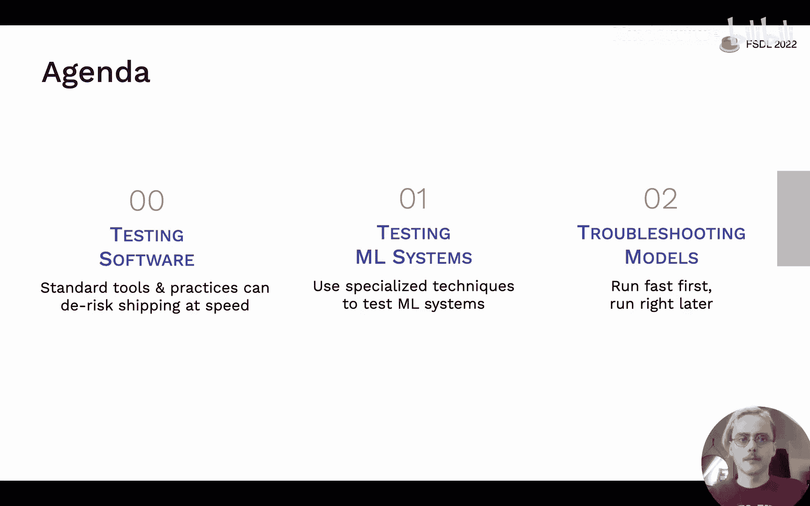

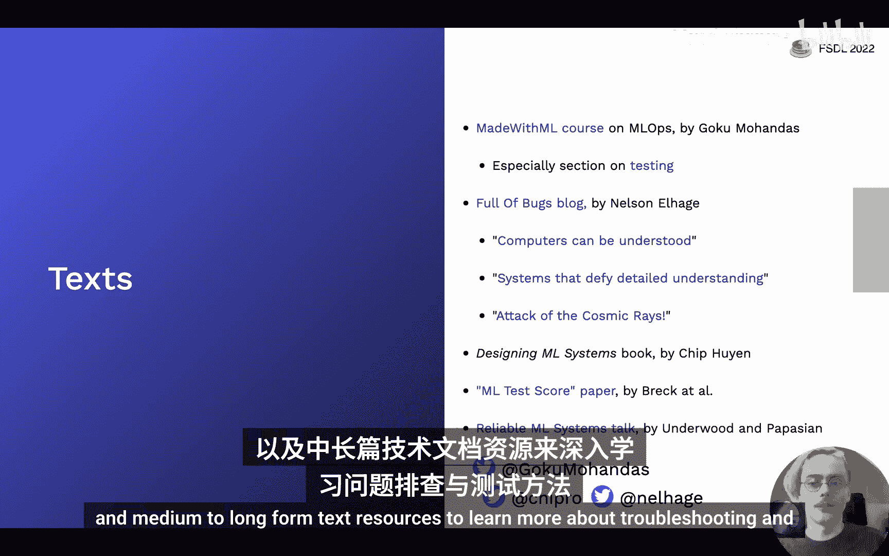

