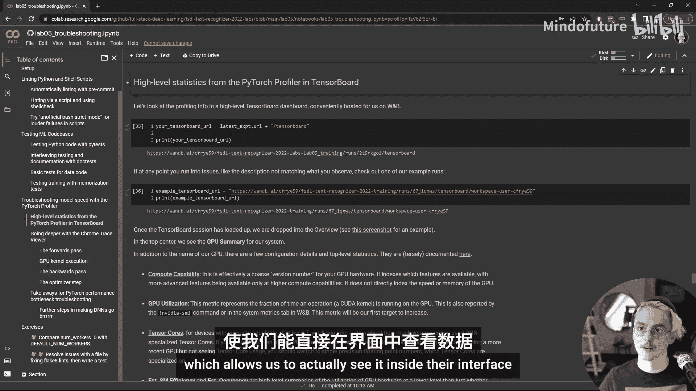
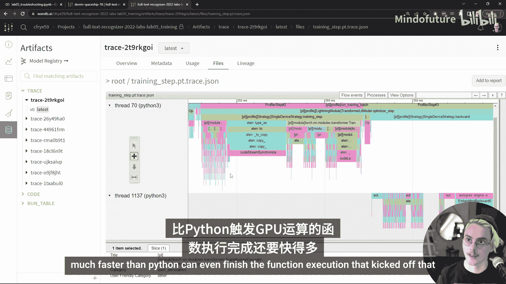
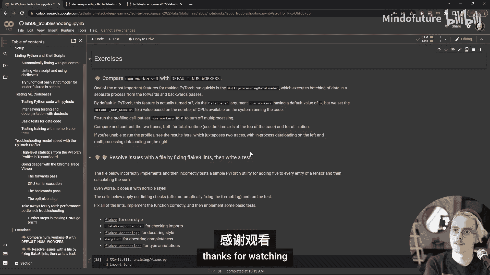

# Full Stack 深度学习：Lab 05：故障排除与测试 🐛🔍


在本教程中，我们将学习如何测试机器学习系统以及如何对深度学习模型的性能进行故障排除。我们将首先介绍测试和整理Python代码的通用实践与工具，然后探讨一些针对ML训练系统的特定测试。最后，我们将深入分析PyTorch中神经网络训练步骤的执行过程，学习如何利用性能剖析和追踪来优化模型性能。

## 概述 📋

本节课将分为三个主要部分：
1.  **代码整理与风格检查**：介绍自动化工具，确保代码质量和一致性。
2.  **代码与模型测试**：讲解如何为Python代码和机器学习训练流程编写测试。
3.  **性能剖析与优化**：学习如何使用剖析工具诊断和解决模型训练中的性能瓶颈。

我们将使用一个具体的代码库和笔记本进行演示，所有相关链接可在视频描述或GitHub仓库中找到。

## 代码整理与风格检查 🧹

上一节我们概述了课程内容，本节中我们来看看如何通过自动化工具保持代码的整洁与规范。手动检查代码风格既耗时又容易出错，因此我们应尽可能实现自动化。

为了实现这一目标，我们使用一个名为 `pre-commit` 的工具，将所有的代码整理和风格检查工具打包成一个命令。这个工具的好处在于，它会在独立的环境中安装所有检查工具的依赖，避免了与模型开发环境的潜在冲突。

以下是运行 `pre-commit` 检查的步骤和其检查的内容：

*   **首次运行**：需要几分钟安装所有工具。
*   **后续运行**：速度很快，只需几秒钟。
*   **检查内容**：`pre-commit` 会运行一系列钩子（hooks），并报告通过或失败。这些检查包括：
    *   基础规范：例如，确保没有在合并冲突中提交代码。
    *   Python特定检查：通过YAML文件配置，例如代码格式化工具 `black`、风格检查工具 `flake8` 及其扩展。
    *   Shell脚本检查：使用 `shellcheck` 工具。

配置这些工具时，关键是要设置“逃生阀”。这意味着不是盲目地对所有文件的所有行应用所有规则，而是可以忽略某些暂时不需要的检查。例如，我们可以通过 `extend-ignore` 配置项来关闭 `flake8` 的某些检查规则，以避免与开发进度冲突。

除了Python文件，检查Shell脚本也至关重要，因为它们是常见的错误来源。Shell脚本的某些行为对现代工程师来说可能出乎意料。

以下是处理Shell脚本问题的两种方法：

*   **使用检查工具**：`shellcheck` 是一个极佳的工具，它已集成到我们的 `pre-commit` 流程中。建议将其也集成到代码编辑器中，以便在编写时获得即时反馈。
*   **启用严格模式**：在编写脚本时，可以修改bash的默认设置，使错误更明显。通常，我们不希望一个错误导致登录会话退出，但在运行脚本时，我们恰恰希望脚本在失败时终止。这可以通过设置 `set -euo pipefail` 等选项来实现。

## 代码正确性测试 ✅

上一节我们介绍了如何保持代码风格一致，本节中我们来看看如何确保代码功能的正确性。基础方法是编写测试代码，以便在其他代码出现问题时（尤其是那些静默失败的问题）能够及时发现。

最初快速开发时，可能只是在代码中插入 `assert` 语句。如果条件为假，`assert` 会抛出错误。但这有一些局限性，例如断言语句分散在代码库中，难以管理和查找。

更好的做法是将测试收集到特定的、易于识别的测试函数和类中，然后连接到测试框架。Python的标准测试工具是 `pytest`。当你向 `pytest` 传递一个文件名时，它会查找所有以 `Test` 开头的类或以 `test_` 开头的函数并运行它们。

一个简单的测试示例如下，它测试字符错误率计算函数，并生成代码覆盖率报告：
```python
def test_character_error_rate():
    # 测试逻辑
    assert result == expected_value
```
代码覆盖率报告由 `pytest-cov` 插件生成，它能显示测试执行了代码库中的哪些行。

将测试函数与实现放在同一个文件中适合快速开发，但不利于测试的发现和管理。更好的实践是在模块或项目级别，将测试收集到一个独立的 `tests/` 文件夹中，并清晰命名测试文件。

在本实验的相应部分，我们详细设计了针对自定义PyTorch Lightning回调函数中错误处理组件的测试，并解释了为何选择这样的测试结构，以及哪些测试我们决定不实现——这与决定实现哪些测试同样重要。

除了测试实现代码，测试文档字符串（docstrings）中的示例代码也很重要。这能确保文档中的示例是正确且可运行的。我们可以使用Python标准库中的 `doctest` 模块，它可以与 `pytest` 集成，自动执行文档字符串中类似Python交互式会话的代码块并验证输出。

## 机器学习系统测试 🤖

到目前为止，我们讨论的主要是通用Python项目的测试实践。本节中，我们将关注一些机器学习特有的测试。

在实验笔记本中，我们介绍了测试数据和数据处理代码的基本思路，并更详细地探讨了训练过程的测试。其中最重要的一类测试是 **记忆测试**，也称为“过拟合单个批次”测试。这种测试用于检查模型是否能够记忆少量数据。

记忆测试的核心是使用特定的参数运行训练脚本，使其在真实数据上训练，但每个epoch只查看一个批次的数据。在PyTorch Lightning中，这可以通过 `Trainer` 的 `overfit_batches` 命令行参数来实现。PyTorch Lightning 还提供了如 `fast_dev_run` 这样的标志，可以简化训练脚本的基础测试。



将这些测试集成到持续集成（CI）中可能比较困难，因为大多数云服务不提供或仅以高价提供GPU加速。一个折中的方案是在开发机器上设置定期运行的任务，并确保测试尽可能快地运行。

控制测试运行时间的一个好方法是设置测试运行的epoch数，然后根据经验观察，预期在该epoch数内达到的损失值。这样，你就可以建立一系列记忆测试，从在普通GPU上运行5分钟，到在高端A100上运行一小时，根据预算和需求进行调整。

你可以在实验笔记本中运行一个记忆测试，只需将 `RUN_MEMORIZATION` 标志从 `False` 改为 `True`。在典型的业余硬件上，这大约需要10分钟，你可以在生成的Weights & Biases仪表板中查看结果。

## 性能剖析与优化 ⚡

测试很重要，但它只是成功的一半。当测试失败时，解决问题的故事才刚刚开始。对于深度神经网络来说，最棘手的问题之一就是性能问题，如速度、延迟和吞吐量。

解决性能问题至关重要。模型训练得越快，你就能越快了解任务、模型架构以及如何解决问题。代码性能越高，你就能在更大规模上操作。在深度学习领域，忽略问题的复杂性并通过扩展来解决问题已被证明是一种有效的策略。

对深度神经网络进行性能故障排除可能具有挑战性，但如果你知道如何运行剖析和追踪代码来寻找明显的瓶颈，通常可以找到一些容易解决的“低垂果实”。

本实验的这一部分包含两个组件。首先，我们开启剖析功能，运行一个epoch的模型训练。我们使用PyTorch和PyTorch Lightning的特性在代码库中添加了剖析。然后，我们通过两种方式查看剖析数据：
1.  **高级摘要**：查看训练期间的一些汇总统计，以发现可能存在的瓶颈。
2.  **深度追踪**：深入查看几个训练步骤执行的追踪信息，了解CPU和GPU上发生的一切。追踪查看器是优化代码、发现瓶颈以及更好理解模型训练过程的绝佳工具。

在不使用额外工具的情况下，仅使用Lightning内置的剖析，你会得到一个结果摘要表。通过练习，你可以利用这个摘要表并从中获得见解，但这并不是查看信息的最佳方式。

通过TensorBoard可以更友好地查看相同的信息。我们的训练脚本会将所需的剖析信息保存到Weights & Biases，而Weights & Biases集成了TensorBoard，允许我们在其界面内直接查看。

在TensorBoard的“Overview”标签页，我们可以快速了解训练步骤的情况。最重要的指标是 **GPU利用率**。它告诉你GPU实际工作的时间比例，我们希望这个数字尽可能高，最好在90%以上。GPU是我们训练系统中最昂贵的组件，也是执行最难优化工作的部分，因此我们希望确保它是瓶颈。

我们的目标是让右上角的饼图中，“kernel”（即在GPU上执行操作）部分占比尽可能大。在练习中，我们会建议你运行一些未优化的训练版本，以观察差异。

在底部（可能需要滚动才能看到），有一个“性能建议”部分。如果你的代码存在明显问题（例如未使用数据加载的多进程，或GPU利用率很低），这里会给出一些解决瓶颈的建议。但请注意，它无法发现所有问题，且有些建议比较通用。

要真正了解如何改进你的PyTorch代码性能，需要查看发生的细节，识别瓶颈并解决它们。为此，我喜欢使用 **追踪查看器**。它基于最初为Chromium浏览器开发的追踪查看工具。

因为我们把信息保存到了Weights & Biases，所以我们可以在其界面内查看，就像查看模型信息、输入输出和其他图表一样。我们也可以在笔记本中显示它，但在全屏查看和进行大量交互时，在WB界面中查看体验更佳。

追踪将所有在CPU和GPU上执行的操作按时间顺序（从左到右）排列，展示了几个训练步骤期间的情况。顶部是CPU操作，底部是GPU操作。初看可能信息量巨大，甚至有些吓人。

实验笔记本会指导你如何在这个视图中定位自己，并找到神经网络训练中熟悉的组成部分：前向传播、反向传播、参数更新。下面进行一个简要的视觉导览：

*   **CPU执行**：上半部分的彩色条堆栈是调用栈。顶层是最高层级的方法，其内部调用了其他方法。
*   **搜索功能**：右上角有一个搜索栏，你可以输入方法、类或组件的名称来高亮显示它们。例如，搜索“Resnet”或“convolution”。
*   **识别关键部分**：通过搜索“Resnet”和“transformer”，我们可以找到前向传播的开始和结束。通过搜索“backward”，可以轻松识别反向传播（它通常在一个单独的线程中运行）。
*   **缩放与平移**：使用浮动工具栏可以缩放和平移追踪视图。
*   **理解执行流程**：关注GPU上的活动。在数据加载结束后，可以看到第一个操作是将数据从CPU内存复制到GPU内存（mem copy）。关键点在于，CPU和GPU之间的活动是异步的。当CPU忙于将数据传输到GPU时，主Python进程已经在继续前进，计算接下来要对GPU数据执行的操作。
*   **识别瓶颈**：判断GPU是否在等待CPU的一个方法是查看GPU流（底部）中是否有大量灰色背景区域（表示空闲）。彩色的块表示GPU内核正在执行。如果灰色区域很多，说明GPU利用率低，存在瓶颈。例如，在优化器步骤（`adam step`）中，你可能会看到许多短小的彩色条夹杂着大块灰色区域，这就是一个潜在的优化目标。
*   **同步点**：另一个需要寻找的是CPU和GPU之间的同步点。此时CPU意识到它需要GPU的计算结果才能决定下一步做什么，因此必须等待GPU完成。这也会导致GPU空闲。例如，在我们的ResNet和Transformer组件交接处就可能发生这种情况。

通过这次导览，希望能帮助你更好地理解PyTorch代码中那些反直觉的特性，正是这些特性使得优化变得困难。能够更好地理解执行模型并阅读追踪，将帮助你编写出避免这些“尖锐边缘”的PyTorch代码，并在问题出现时解决它们。

我们最后给出了一些达到高GPU利用率的建议：
*   **使用更好的CPU**：你可能需要比预期更好的CPU来快速准备数据。
*   **遵循数据加载器最佳实践**：避免数据加载成为瓶颈。
*   **专注于前向传播优化**：前向传播更容易推理，且优化它通常也能改善反向传播。
*   **使用尽可能大的批次**：在不超过GPU显存的前提下，使用更大的批次可以分摊开销，提高效率。

根据经验，一次快速的性能审计通常可以发现那些只需修改一行Python代码就能带来20%到50%速度提升的问题。

## 练习与总结 🏁

我们有两个简单的练习建议：
1.  **深入研究追踪**：花些时间探索提供的追踪视图。如果你在自己的硬件上运行，可以与Colab上的结果进行比较，观察差异。
2.  **对比数据加载设置**：尝试将数据加载的工作进程数（`num_workers`）设置为0（这是PyTorch的默认值），与我们的默认设置进行对比。你会发现在大多数情况下，这会导致GPU利用率非常低。



此外，你也可以尝试使用这些代码整理工具，并为自己编写一个快速测试。

## 总结

在本节课中，我们一起学习了故障排除和测试的基础知识，涵盖了确保网络训练快速、运行正确以及代码整洁可维护的一些最高效的方法。我们介绍了：
*   使用 `pre-commit` 进行自动化代码检查和整理。
*   使用 `pytest` 和 `doctest` 进行代码正确性测试。
*   针对机器学习训练流程的记忆测试。
*   利用PyTorch Profiler和追踪查看器进行性能剖析，识别并解决训练瓶颈，特别是关注GPU利用率。



希望这些内容能帮助你构建更健壮、更高效的深度学习项目。如果你有任何问题，欢迎在评论区留言。祝你调试愉快！