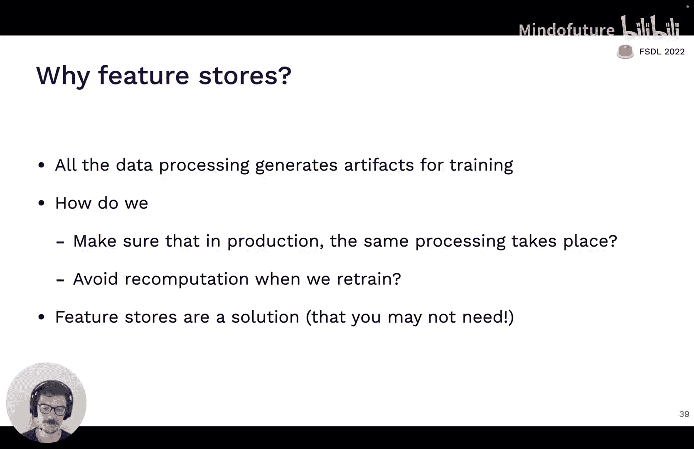
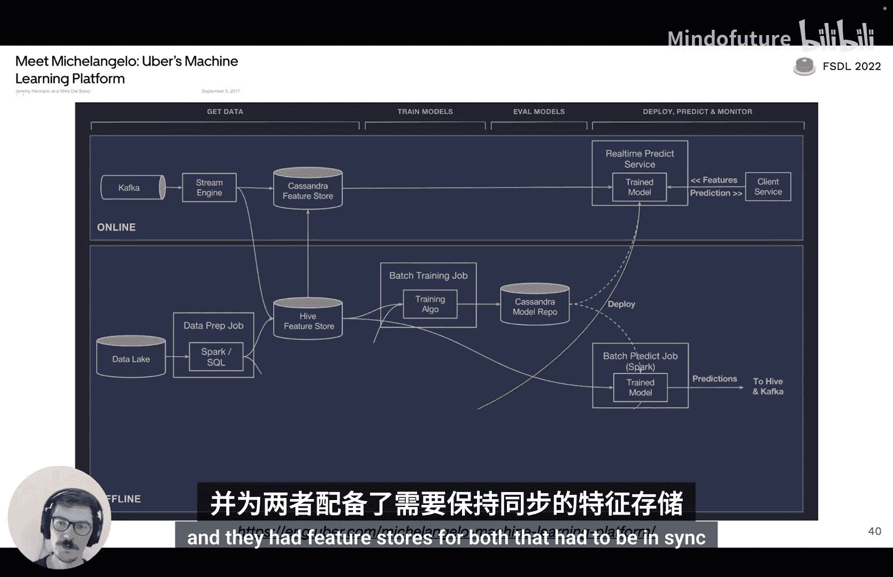
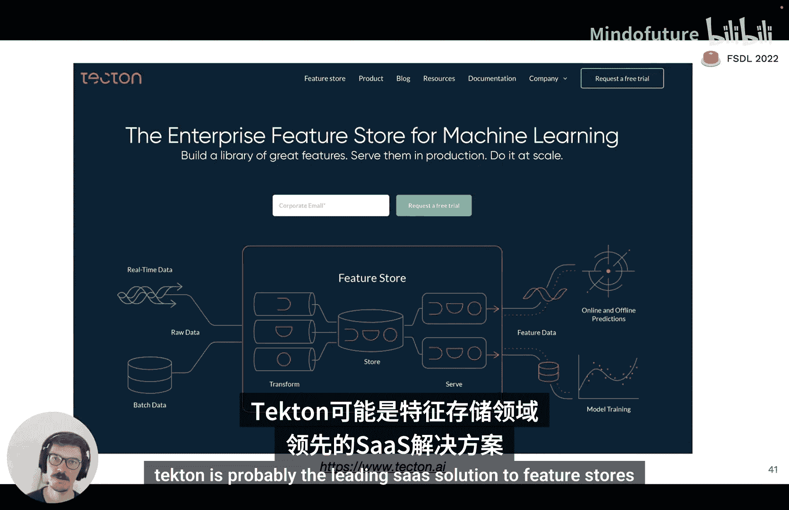
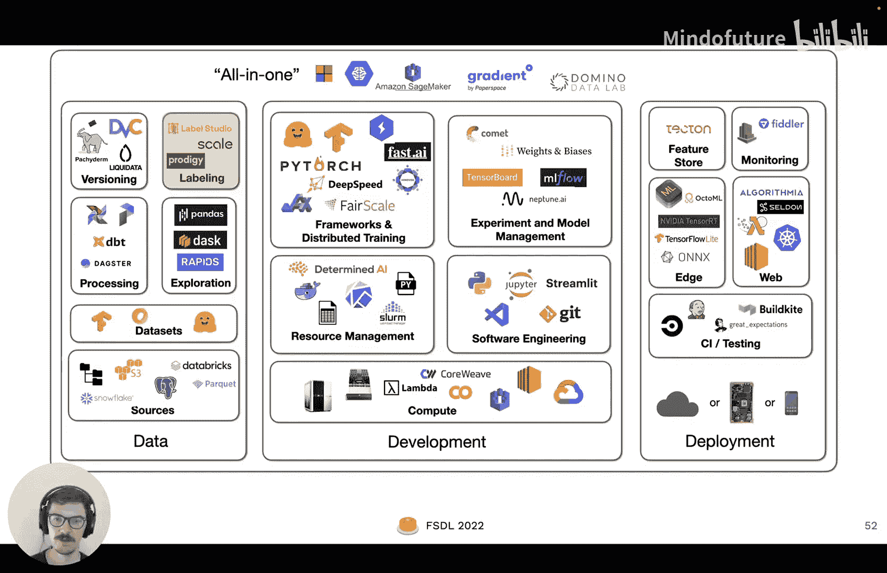
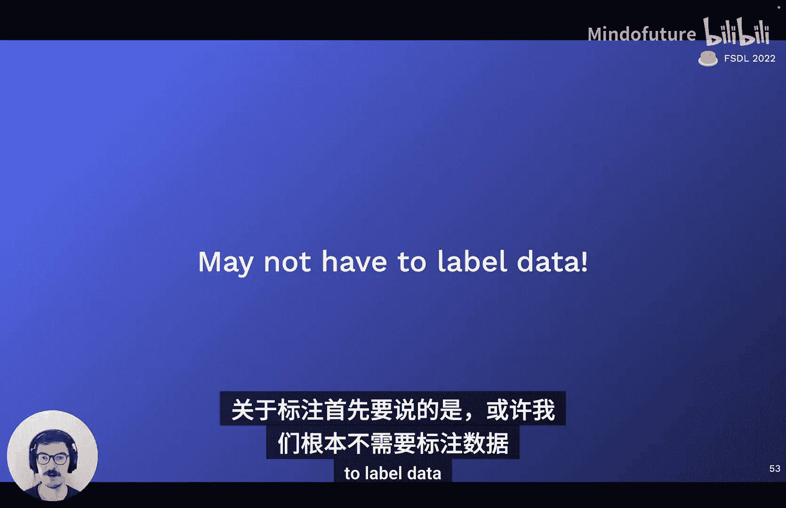
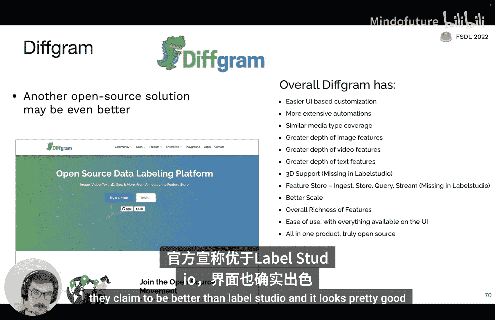
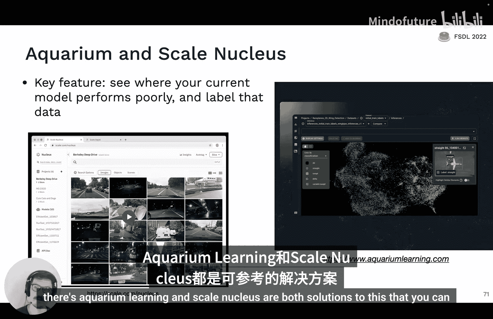
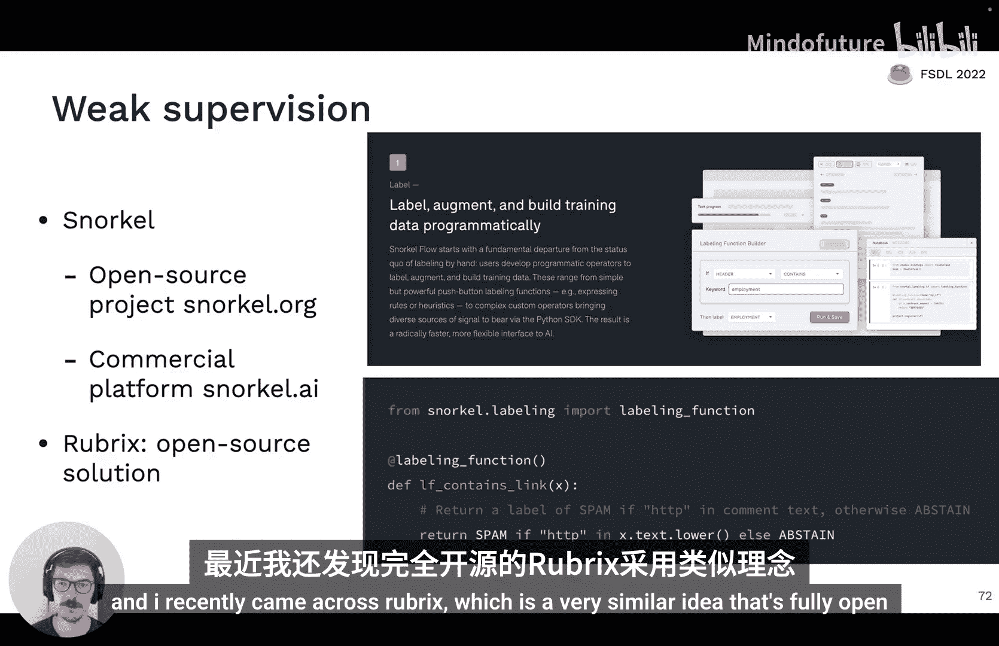
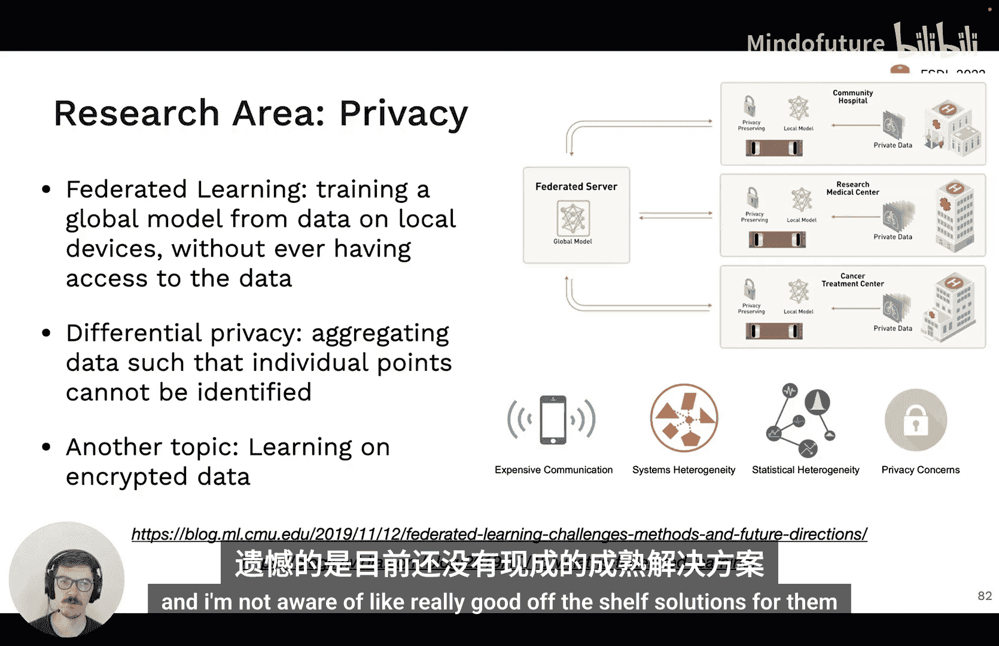

# 全栈深度学习：第4讲：数据管理 🗃️

在本节课中，我们将要学习机器学习项目中至关重要的一个环节：数据管理。我们将探讨如何获取、存储、处理、标注和版本化数据，并理解这些实践如何影响模型性能。

## 概述

数据管理是机器学习工作的核心，通常占据项目一半以上的精力。提升模型性能最有效的方法往往是修复或扩充数据集。本讲将介绍数据管理的核心概念与实用工具，并强调保持流程简单的重要性。

## 数据来源与存储基础

上一节我们介绍了数据管理的重要性，本节中我们来看看数据从何而来以及如何存储。

数据可能来自多种源头，如图像、文本文件、日志或数据库记录。在深度学习中，最终需要将数据置于GPU附近本地文件系统的磁盘上，以便高效训练。

存储数据的基础设施通常涉及文件系统、对象存储和数据库。

### 文件系统

文件系统是基础抽象，其基本单位是文件。文件可以是文本或二进制格式，通常不进行版本控制，且容易被覆盖或删除。本地磁盘的速度差异很大，从机械硬盘到NVMe固态硬盘，性能可能相差两个数量级。

理解数据访问延迟至关重要。以下是一个类比，将计算机操作时间按比例放大到人类可感知的尺度：

*   **L1缓存访问（0.5纳秒）**：如同1秒钟。
*   **GPU内存访问（~50纳秒）**：如同1.7分钟。
*   **从内存顺序读取1MB（250微秒）**：如同2.5天。
*   **从SATA SSD顺序读取1MB（1毫秒）**：如同1.5周。
*   **从机械硬盘顺序读取1MB（20毫秒）**：如同8个月。
*   **从加州到欧洲往返一个数据包（150毫秒）**：如同4.8年。

这个对比凸显了将数据放在靠近计算单元（如GPU）的快速存储上的重要性。

关于数据存储格式的建议如下：

*   **二进制数据（如图像、音频）**：使用标准压缩格式，如 **`.jpg`** 或 **`.mp3`**。
*   **元数据（如标签、表格、文本）**：使用压缩的JSON、文本文件，或高效的列式存储格式 **`Parquet`**。

### 对象存储

对象存储可以视为文件系统之上的一层API，其基本单位是对象（通常是二进制数据）。与文件不同，对象存储通常内置版本控制和冗余机制。亚马逊S3是最常见的例子。虽然不如本地文件系统快，但在云环境中速度足够。

### 数据库

数据库用于持久化、快速且可扩展地存储和检索结构化数据。一个有用的心智模型是：数据库将所有数据视为存储在内存中，但软件确保在计算机关闭时数据能安全持久化到磁盘。

关于数据库的核心建议：

*   **不要**在数据库中存储二进制数据（如图片），而应存储指向对象存储中二进制数据的URL。
*   **PostgreSQL** 是大多数情况下的正确选择，它是开源数据库，甚至支持对非结构化JSON进行查询。
*   对于小型项目，**SQLite** 是完全够用的自包含二进制数据库。

你应该考虑使用数据库。许多MLOps工具的核心本质就是数据库，例如：
*   Weights & Biases 是实验记录的数据库。
*   Hugging Face Model Hub 是模型的数据库。
*   Label Studio（后续会讨论）是标注的数据库。

### 数据仓库与数据湖

数据仓库用于在线分析处理（OLAP），而数据库通常用于在线事务处理（OLTP）。主要区别在于，OLAP通常是列式存储，便于分析查询和压缩；OLTP通常是行式存储，便于事务查询。

数据湖则是来自多个源的非结构化数据聚合。与数据仓库的“提取-转换-加载”（ETL）流程不同，数据湖采用“提取-加载-转换”（ELT）流程。当前趋势是统一数据湖和仓库。Snowflake和Databricks是这一领域的两大平台。

## 数据探索与处理

现在我们已经了解了数据存储，如果我们想探索数据，就必须掌握数据的语言。

数据的语言主要是SQL，并且越来越多地使用DataFrame（数据框）。

*   **SQL** 是查询结构化数据的标准接口，已存在数十年，值得学习。
*   在Python中，**Pandas** 是主要的数据框解决方案，允许你以类似SQL但更代码化的方式操作数据。

我们的建议是熟练掌握两者，这是与事务数据库、分析仓库及数据湖交互的方式。

如果Pandas在某些操作上较慢，可以尝试以下加速方案：

*   **Dask DataFrames**：提供相同接口，但能在多核甚至多机上进行并行操作。
*   **RAPIDS (cuDF)**：如果你有GPU可用，它能在GPU上执行Pandas操作的子集，速度显著提升。

### 数据处理流水线

谈论数据处理时，一个具体的例子会很有帮助。假设我们需要每晚训练一个“照片流行度预测模型”。对于每张照片，训练数据可能包括：
1.  照片元数据（如发布时间、标题、位置）。
2.  用户特征（需从日志计算）。
3.  照片内容分类器的输出（需运行分类器模型）。

这构成了一个有依赖关系的任务图。我们需要一个系统来定义任务、管理依赖、在任务完成后触发下游任务，并能将工作分发到多台机器上调度运行。

以下是用于构建此类工作流的工具：

*   **Apache Airflow**：Python中一个相当标准的解决方案，允许用Python代码定义任务的有向无环图（DAG）。
*   **Prefect**：一个旨在改进Airflow的、更现代的解决方案。
*   **Dagster**：另一个Airflow的竞争者。

核心建议是：**不要过度设计**。现代单机拥有众多CPU核心和大量内存。Unix命令行工具本身具有强大且高度优化的并行和流处理能力。

一个启示性的例子是：有人曾用Hadoop（一个分布式处理框架）完成一个简单的文本统计任务，耗时26分钟。而用一行Unix命令（结合 `grep`, `sort`, `uniq`）仅需70秒，并且通过 `xargs -P` 参数可以更高效地利用多核。

这并非说所有事都该用Unix命令完成，而是提醒我们，存在的复杂解决方案不一定适合你的场景。或许一个在32核PC上运行的Python脚本就足够了。

### 特征存储

你可能听说过特征存储。它要解决的问题是：我们在数据处理中生成的特征，在训练时和生产推理时需要保持一致，并且在重新训练时避免重复计算。

特征存储是此问题的一种解决方案，但**你可能并不需要它**。Uber在其机器学习平台Michelangelo的博客中首次详细描述了特征存储，用于同步离线训练和在线预测的特征。

如果你确实需要，可以考虑以下方案：
*   **SaaS服务**：Tecton是领先的解决方案。
*   **开源方案**：Feast是常见选择，FeatureForm也是一个看起来不错的项目。

## 机器学习数据集

现在，让我们看看专门用于机器学习训练的数据集。

Hugging Face Datasets 是一个极佳的数据集中心，拥有超过8000个数据集，涵盖视觉、NLP、语音等领域。其 `datasets` 库支持流式加载，无需下载全部数据即可查看样本。

以下是几个数据集示例及其存储格式：

1.  **GitHub Code**：超过1TB的代码文本，包含1.15亿个代码文件。底层是数千个约500MB的 **`Parquet`** 表。
2.  **REcap**：1200万张来自Reddit的图片及文本。数据本身是包含图片URL和文本的 **`JSON`** 文件，图片需另行下载。
3.  **Common Voice**：来自Mozilla，包含87种语言、14000小时的语音。格式为 **`.mp3`** 文件加转录文本文件。

另一个有趣的数据集解决方案是 **Activeloop**，它允许你探索数据、将数据流式传输到本地，甚至无需本地保存即可转换数据，并提供了一个很酷的数据查看器。

## 数据标注

接下来我们讨论数据标注。首先要说的是：**也许你根本不需要标注数据**。

### 避免标注：自监督学习

自监督学习是一个非常重要的思想，你可以利用数据的一部分来为另一部分生成标签。
*   **自然语言处理**：例如，遮盖句子的一部分，用其余部分预测被遮盖的内容。
*   **计算机视觉**：例如，提取图像块并预测块间关系。
*   **多模态**：例如，OpenAI的CLIP模型，通过对比学习使匹配的图像-文本对在嵌入空间中接近，不匹配的对远离。

### 数据增强

数据增强是训练视觉模型时必须进行的操作，包括改变亮度、对比度、裁剪、旋转、翻转等。这些变换不改变图像语义，但改变了像素。

有趣的是，增强本身可以替代标签。例如 **SimCLR** 论文，其学习目标是最大化同一图像不同增强视图之间嵌入的相似性，并最小化不同图像视图之间的相似性。仅通过数据增强和巧妙的目标函数，无需人工标签，就能学习到在监督任务上也表现良好的模型。

对于非视觉数据，也可以进行增强：
*   **表格数据**：随机删除部分单元格以模拟数据缺失。
*   **文本数据**：删除词语、替换同义词、调整语序。
*   **语音数据**：改变语速、插入静音、添加回声、滤除特定频段。

### 合成数据

合成数据是另一种获取“免费”标签的方式，因为你是用标签来生成数据的。这是一个常被低估但值得尝试的思路。例如，可以使用3D渲染引擎生成非常真实的视觉数据，并且你确切知道图像中所有内容的标签。

### 人工标注

如果确实需要人工标注，通常涉及边界框、关键点、文本词性标注、分类、描述等任务。关键在于**培训标注人员**，并提供完整的标注规则手册。质量保证也至关重要，因为不同人员执行规则的能力不同。

获取标注人员的途径：
1.  **全服务数据标注公司**：提供软件栈、劳动力和质量保证，可能是最省心的选择。
2.  **雇佣兼职标注员**：并提拔优秀者进行质量控制。
3.  **众包**：过去通过Amazon Mechanical Turk流行，但质量控制开销较大。

选择标注公司时，建议：首先自己标注一些数据以理解任务并建立“黄金标准”；与几家公司沟通或试用；获取工作样本并与你的标准对比；最后比较价格。**Scale AI** 是当前占主导地位的数据标注解决方案。

### 标注工具

以下是一些标注工具：
*   **Label Studio**：开源解决方案，可在自己的机器上通过Docker运行，支持多种数据类型和自定义界面，甚至能集成模型进行主动学习。我们将在实验中使用它。
*   **Diffgram**：另一个声称优于Label Studio的解决方案。
*   **Aquarium Learning / Scale Nucleus**：这类工具可以评估现有模型在数据上的表现，帮助你轻松选择需要进一步标注的数据子集或发现标注错误。

### 弱监督

如果你有大量数据需要标注，其中一部分可能很容易通过规则标注（例如，文本中包含“美妙”一词可判定为积极情感）。**Snorkel** 项目利用这种“弱监督”思想，让你编写多个标注函数，然后由软件智能地组合它们，从而快速处理大量数据。**Rubrix** 是一个类似理念的全开源项目。

**标注环节总结**：
1.  首先考虑能否通过自监督学习避免标注。
2.  如果需要标注，先使用标注软件，通过亲自标注一段时间来深入了解数据。
3.  之后，制定详细规则，并外包给全服务公司。
4.  如果不想或无法外包，建议雇佣兼职合同工，而非尝试众包。

## 数据版本控制

最后，我们来讨论数据版本控制。可以将其视为一个光谱：

*   **Level 0：无版本控制**：数据直接存放在文件系统、S3或数据库中。这是糟糕的做法，因为当模型性能下降时，你无法追溯到生成模型权重的确切数据状态。
*   **Level 1：快照**：每次训练时，对数据进行一次快照并存储。这可行，但不如代码版本控制那样方便。
*   **Level 2：类似代码的版本控制**：像版本控制代码一样版本控制数据。例如，将音频文件存储在S3，将标签（S3 URL + 转录文本）存储在一个Parquet或JSON文件中。即使这个元数据文件很大，也可以使用 **Git LFS**（大文件存储）来管理，用 `git add` 和 `git commit` 来版本化数据文件。**FSDL推荐，如果可行，优先使用此方案**。
*   **Level 3：专用数据版本控制解决方案**：当Level 2开始出现问题时，可以考虑专用工具。领先的解决方案是 **DVC**。它不仅可以像Git LFS一样管理大文件，还能记录数据血缘和流水线。

## 隐私敏感数据

我们经常在FSDL收到关于隐私敏感数据的问题。这仍然是一个研究领域，没有真正现成的解决方案可以推荐。相关研究方向包括：
*   **联邦学习**：在本地设备上训练全局模型，而训练过程无法访问本地原始数据。
*   **差分隐私**：以聚合数据的方式进行训练，使得无法从结果中识别出任何个体数据点。
*   **加密数据学习**：能否在数据保持加密的状态下进行机器学习。

## 总结

本节课中我们一起学习了数据管理的全貌。我们了解了数据存储的基础（文件系统、对象存储、数据库），掌握了探索和处理数据的工具（SQL、Pandas、工作流引擎），探讨了获取训练数据的策略（使用现有数据集、自监督学习、增强、合成、标注），并学习了数据版本控制的最佳实践。记住，从简单方案开始，只在必要时增加复杂性。数据是机器学习项目的命脉，有效管理数据是成功的关键。