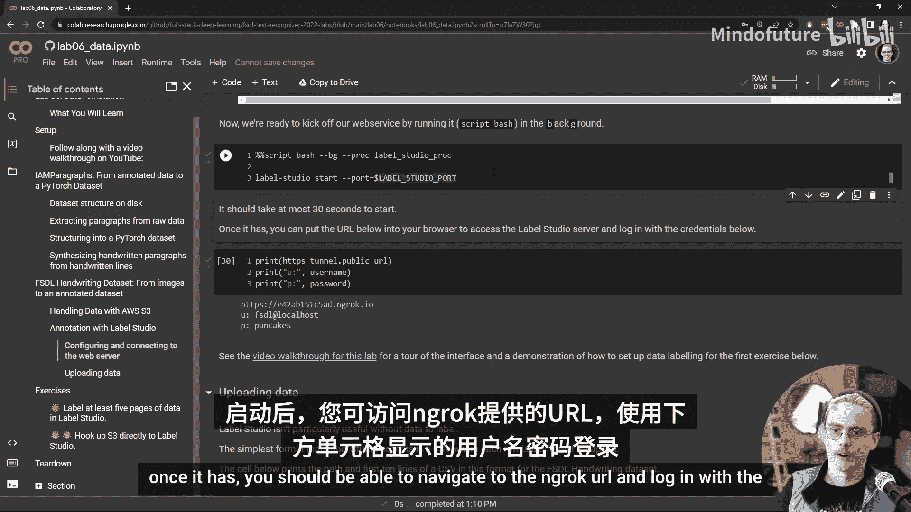
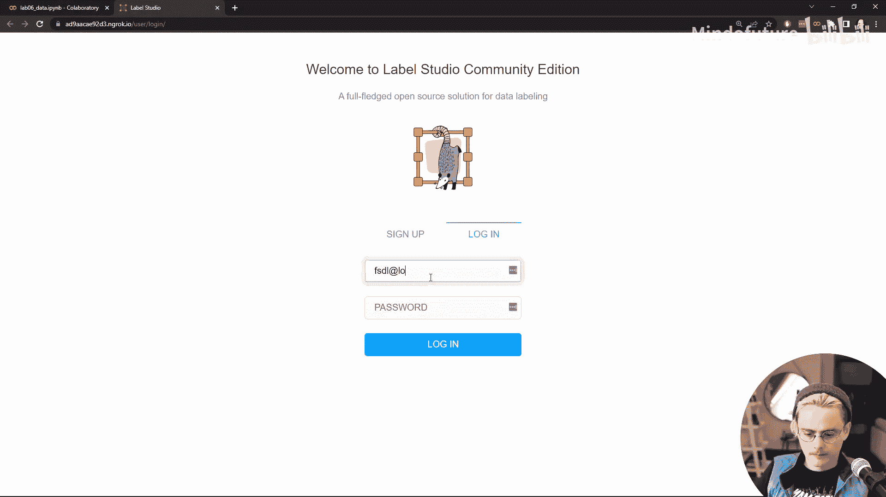
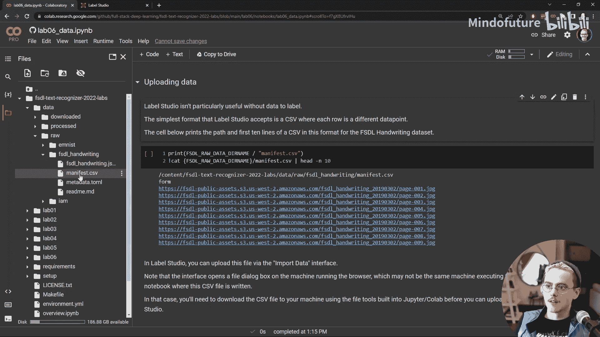
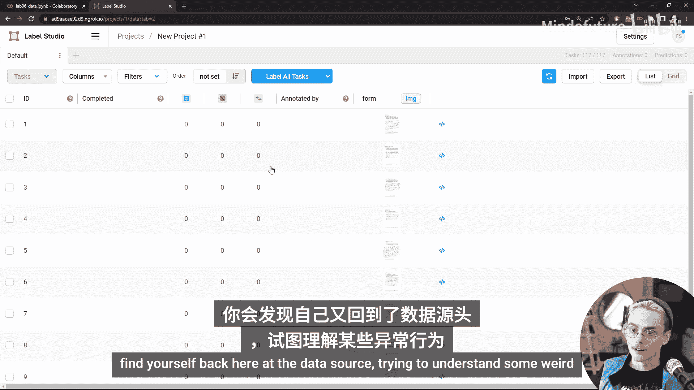
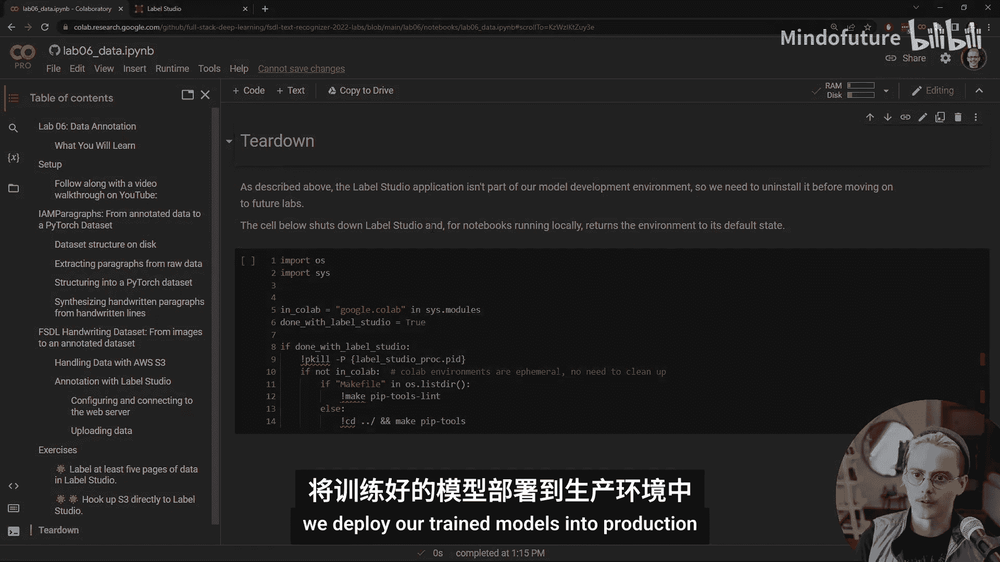

# 全栈深度学习：第6课：数据标注 📝


在本节课中，我们将学习数据标注的两个核心环节。首先，我们将了解如何将存储在磁盘上的原始数据，转换为PyTorch和PyTorch Lightning神经网络能够使用的格式。其次，我们将学习如何从现实世界收集的原始数据出发，通过标注流程，生成可用于训练机器学习算法的标注数据。

## 从数据到模型：理解数据管道 🔄

上一节我们介绍了课程的整体目标，本节中我们来看看数据管道的具体构成。在本次实验的第一部分，我们将详细探讨如何获取手写文本图像及其对应的标签，这些数据用于训练我们在之前实验中使用的神经网络。

这部分内容包含了许多关于特定案例中数据结构的具体细节。例如，如何使用XML格式的标注，以及如何将图像子组件的标注组合起来，得到整张图像的标注。

本部分的关键并非掌握所有关于XML或数据组合的具体细节，而是理解在特定案例中，原始数据的大致形态。这种形态的某些方面可能与你使用的其他数据集有共通之处，例如，标注通常以结构化文本格式存储，而输入则存储为常规图像文件。当然，具体的细节会因项目而异。

从这一部分得出的另一个重要通用原则是：**你需要为数据获取丰富的标注**。从为数据提供标签的人类那里收集的信息应尽可能丰富。例如，尽管我们的最终任务关注的是整段手写文本，但数据在单个行、甚至单个单词和字符级别上的标注实际上极其有用。我们利用这一点来构建合成数据，通过将来自不同段落的行组合成新的合成段落，以扩充数据集。

以下是一个合成段落的示例：
```
[合成段落图像示例]
```
我们的数据合成技术并非完美，但它足以帮助我们的模型从有限的可用数据中榨取更多学习价值。总的来说，数据合成是一项被低估的技术，对于在数据稀缺的初期阶段启动你的机器学习应用尤其重要。近期在图像和文本合成方面的进展，例如使用Stable Diffusion和GPT-3等模型，意味着合成技术只会成为机器学习模型训练中越来越重要的组成部分。

## 从原始数据到标注数据：实践标注流程 🏷️

在实验的前半部分，我们探讨了标注数据在磁盘上的形态，以及它如何转换为神经网络可训练的格式。然而，我们从现实世界收集的数据并非天生就是这种格式。例如，通过扫描和数字化页面来收集手写文本图像很容易，但标注工作必须手动完成。

我们将启动一个名为 **Label Studio** 的工具来完成这项工作。我们的目的有两个：一是了解设置这个Label Studio网络服务的过程；二是亲自实践数据标注。

很容易陷入一种思维定式，认为我们试图训练的任务非常简单，只是阅读文本，这很无聊，为什么要把时间花在这上面？我们更愿意把时间花在开发算法和部署应用上。但这是一个误区。深入了解你的数据将帮助你更好地理解你要求模型执行的任务，并且理解最终的机器学习应用场景和用户需求，对于制定能够生成最佳最终模型的标注规则和流程至关重要。数据标注绝对是全栈深度学习工程师应用其技能和对整个流程理解的绝佳领域。

在本节中，我们将使用在全栈深度学习课程先前版本中收集的一些额外手写文本数据。这些数据是公开可访问的，存储在S3上，它们只是一些带有打印文本提示和手写文本的表格扫描图像，类似于我们目前一直在使用的IAM数据集，但没有任何标注。

设置Label Studio并从笔记本中运行它，比我们之前做的一些事情要复杂一些。之前我们只是运行用于训练的基本Python脚本，或者指向URL来查看TensorBoard或W&B中的结果。而这里，我们将运行自己的网络服务。

以下是设置步骤：

首先，我们需要设置用户名和密码用于登录。Label Studio的设计非常注重安全性，因为许多人处理的数据要么非常敏感（例如用户数据、法律数据或健康数据），要么即使数据本身不敏感，但对高质量数据的访问也可能是机器学习应用成败的关键，甚至可能成为组织竞争优势的重要组成部分。

因为我们正在设置自己的网络服务，所以必须建立一种与该服务通信的方式。如果你习惯从命令行运行Label Studio命令并暴露端口，你可以自己完成。如果你之前有过这类网络配置经验，Label Studio本身并不复杂。但许多机器学习工程师在Web开发和运行服务方面经验不足。

因此，我们将使用一个工具来简化这个过程，这个工具叫做 **ngrok**。ngrok已被添加到本实验的要求中。如果你正在跟随课程直播并在自己的机器上进行本地开发（而不是使用Colab），请确保重新运行 `make pip-tools` 命令，以便获得包含ngrok库在内的最新环境。

除了引入库，我们还需要一个ngrok账户。它有一个不错的免费套餐，对服务运行时长和允许使用的URL类型有一些限制，但对于这次Label Studio的快速演示，免费套餐完全够用。

ngrok会建立一个隧道，使我们能够通过公共互联网与运行在我们机器上的服务通信，而无需担心防火墙、端口转发等问题。如果你不是网络专家，不熟悉这些配置，可能会在尝试与你运行的Web服务通信时陷入漫长而混乱的调试过程。



最后一步是安装Label Studio，仅用于在本实验中尝试。Label Studio更像是一个应用程序而非库，因此在实际环境中，我们会在一个与我们其他工作隔离的虚拟环境中设置它，或者甚至将其运行在Docker容器内。



完成所有这些后，我们可以运行相应的单元来启动Label Studio实例。启动大约需要30秒。启动后，你应该能够导航到ngrok提供的URL，并使用下面单元打印出的用户名和密码登录。

一旦我们点击该链接，就会打开Label Studio界面，并使用这些凭据登录。

现在，是时候通过导入一些数据来创建一个项目了。回到Jupyter界面，让我们看看如何上传数据。Label Studio的设计并非期望它与你的所有数据运行在同一台机器上。你的数据可能分布在多台机器上，并且在大多数情况下，会存储在某个云存储服务中，即使对于敏感数据，也可能是本地私有云。因此，通常你需要上传的是一个清单或指向数据的URL列表。

我们想将这个特定的文件上传到Label Studio，这个CSV文件包含了所有FSDL手写数据的URL。上传这个文件的简单方法是让该文件与你用于访问Label Studio的浏览器位于同一台机器上。如果你在本地开发，在运行浏览器的同一台机器上执行Jupyter笔记本，这很容易，只需导航到该路径并上传那个清单CSV文件。如果不是，例如你在Colab上运行实验，清单CSV文件位于云端机器上，你需要将其下载到运行浏览器的机器上，然后才能上传到Label Studio。

在Colab中，我们可以在“文件”选项卡中导航到 `fsdl-text-recognizer-2022/labs/data/raw/fsdl_handwriting` 目录，找到 `manifest.csv` 并下载它。回到Label Studio界面，点击“创建项目”，进入“数据导入”，上传我们的CSV文件。每个单独的标注在Label Studio中被称为一个“任务”，所以我们希望点击“将CSV视为任务列表”，然后点击“保存”以上传文件。



现在，我们所有数据的链接都已导入Label Studio。要开始标注，我们需要用Label Studio的格式描述标注任务。我们可以直接点击任何数据点，调出提示来开始。

Label Studio使用一种特定领域语言来描述标注界面，看起来有点像HTML。幸运的是，你不必从头开始编写整个内容。你可以使用他们的一个模板。这里有许多针对不同任务的选项。如果你的任务不在这里，你可以查看不同的模板并进行混合搭配，以创建适合你任务的东西。但我们将从“光学字符识别”模板开始。

默认情况下，我们现在有了这个标注界面。我们可以将图像区域标注为包含文本或手写文本。这不是我们感兴趣的区别，所以让我们去掉这两个标签，并添加我们自己的。我们希望标注者挑选出文本的每一行。我们看到这对于合成数据很有用。所以让我们添加一个“行”标签。

你可以看到这个界面有一些不错的功能：可以点击并拖动、旋转、放大，以便更精确地标注文本位置，然后在这个界面元素下方输入该区域的文本。这个界面有一些设置。我们可能确实希望允许人们缩放和旋转图像，所以让我们打开这些选项，然后保存我们的标注配置。

现在我们已经准备好开始，可以点击一个表格开始标注。

花一些时间调试你的标注用户界面非常重要，既要调试界面本身，也要观察任务存在哪些边界情况或模糊性，以便你能编写更清晰的标注说明。例如，当我试图高亮顶部的这一行时，“信息是消除不确定性的过程”。这里有一些重要的模糊性需要解决：

*   我们是否希望获取每个字母的顶部、底部、左侧和右侧边界，即使这意味着包含来自其他行的内容？
*   我们希望将标注区域旋转到什么程度，使其跟随文本行的走向？
*   在标注实际内容时，我们是否应该尽最大努力理解所写的文本？
*   如果我们不确定某个特定字母是什么，是否应该参考顶部的打印文本？
*   如果有拼写错误，我们是否应该纠正该拼写错误并使用顶部的打印文本？

许多这些问题只能由了解模型需要何种信息的模型开发者，或者从端到端思考整个问题的人来回答。我们的目标不是设计一个能够纠正人们拼写的神经网络，也不是设计一个给定人类在表格上书写的笔迹和打印提示，来推断该打印提示是什么的模型。我们希望训练一个模型，能够查看手写文本并确定实际存在哪些字母。因此，我们不希望纠正拼写，也不希望用打印文本来代替手写文本。并且，考虑到我们模型当前的设置（没有输出“不确定”的标记），我们希望我们的标注者尽最大努力标注每一个字母。

另外，观察这个界面，我注意到这里包含一个多边形区域选择器，允许标注者选择不仅仅是矩形，而是更精确的多边形来覆盖一行。这是一个有趣的情况，因为你可能会认为，拥有关于文本确切位置的更精细信息是有用的，并且你总是可以用覆盖它的最小矩形区域来替换多边形。但是，我们所有的数据处理代码都是基于我们将拥有矩形区域的假设编写的。所以，让我们继续在标注UI中移除这个选项。

回到设置和标注界面，让我们看看该界面的实际代码。即使不查阅实际文档，也很清楚多边形工具来自这里的第10行。让我们删除它。此外，你还会看到一个“说明”选项卡，你可以在那里开始编写标注说明，说明诸如“用你的标注覆盖所有文本”以及如何解决模糊性等问题。为了从你的标注员那里获得最高质量的标注，你需要在说明中非常精确。

因此，我强烈建议花15到20分钟点击浏览其中一些表格并进行标注，至少从头到尾完整标注两三个表格中的所有手写文本行，以便你能对整个任务有一个完整的感受。你还需要浏览更多数据，以发现一些在练习中提到的边界情况。建议你查看几个有特殊问题的特定表格。

如果你在开始构建模型、创建完整的机器学习应用之前，不花时间去了解你的数据，那么最终，作为调试模型问题、调试数据管道问题的一部分，你将会回到数据源头，试图理解一些奇怪的行为或细微的问题。

## 练习与总结 📚

以下是本实验的建议练习：



**练习一：实践标注**
建议你花时间亲自标注数据，以深入理解任务和潜在问题。

**练习二：连接云存储**
第二个练习建议尝试一种稍微复杂的方式将数据连接到Label Studio，即通过连接到S3云存储。这样做需要你创建一个AWS账户并按照Label Studio文档中的一些说明操作。这让你更接近实际生产应用中Label Studio的数据设置方式。

**最后，清理环境**
如果你在本地运行此笔记本，最后的清理单元很重要。它会从环境中移除Label Studio，让我们回到模型开发环境，这是我们在未来实验中需要的。它还会关闭那个Label Studio服务，确保你不会在快速演示之外，长时间运行一个指向公共互联网的Web服务器。



本节课中我们一起学习了数据标注的全过程。我们探讨了如何获取原始数据，通过启动自己的标注网络服务进行标注，然后将其转换为可供PyTorch神经网络使用的格式。下一课，我们将跳回到模型开发，看看如何将我们训练好的模型部署到生产环境中。