# Full Stack 深度学习：第5讲：模型部署 🚀


在本节课中，我们将要学习如何将机器学习模型部署到生产环境中。模型部署是构建机器学习驱动产品的关键环节，它不仅是产品上线的必要步骤，也是评估和改进模型真实性能的最佳方式。我们将从构建一个简单的原型开始，逐步深入到如何构建可扩展的模型服务，并最终探讨将模型部署到边缘设备的高级技术。

## 从原型开始 🎯

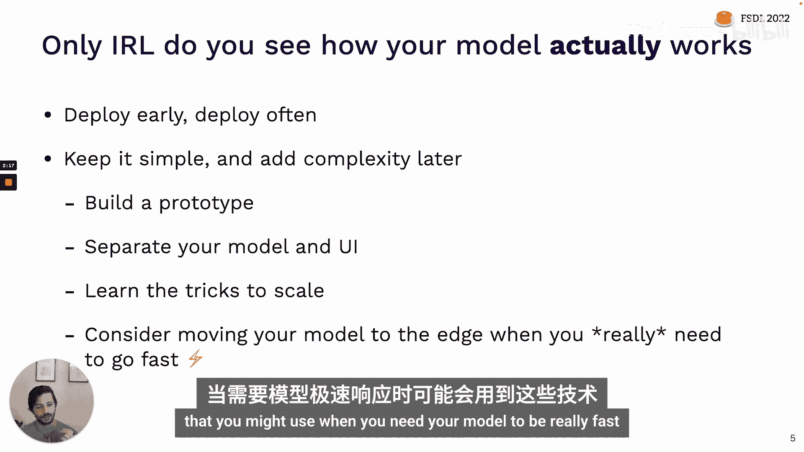

上一节我们介绍了模型部署的重要性，本节中我们来看看如何构建你的第一个生产模型原型。这个阶段的目标是创建一个可以自己试用并与朋友分享的简单演示。

幸运的是，现在有许多优秀的工具可以帮助快速构建模型原型。Hugging Face在其平台上提供了工具，最近还收购了Gradio，这是一个可以轻松为模型包装小型用户界面的库。Streamlit也是一个非常棒的工具，它提供了比Gradio或Hugging Face Spaces更多的灵活性，允许你使用Python构建相当复杂的UI。

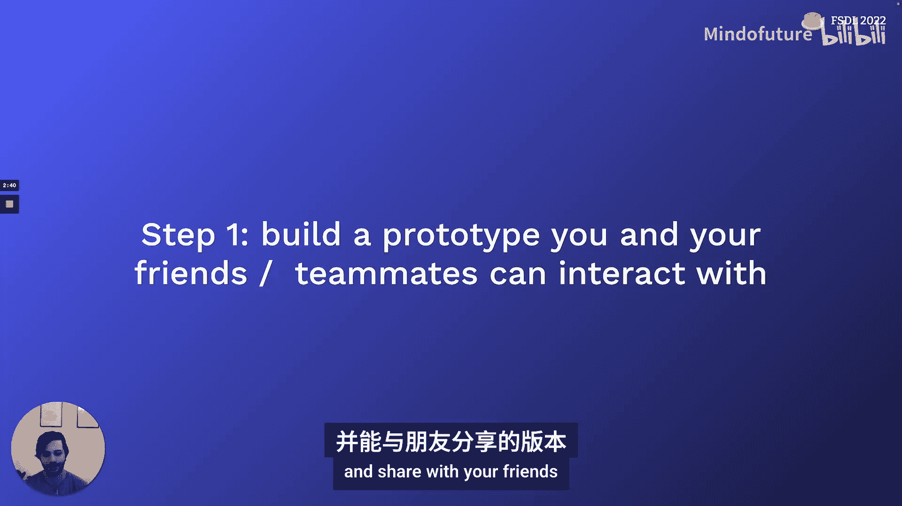

以下是构建原型模型时需要考虑的几个最佳实践：

*   **构建基础UI**：在此阶段，目标是试用模型并收集反馈。一个直观的UI（而不仅仅是一个API）对于你、同事或朋友与模型互动至关重要。Gradio和Streamlit是实现这一点的理想工具。
*   **部署到网络**：不要只在本地运行。将其部署到一个可以通过URL访问的网络服务上。这既便于分享以收集反馈，也能让你开始思考更复杂部署时的一些权衡（例如模型延迟）。Streamlit和Hugging Face都提供了云版本，使得这一步非常容易。
*   **保持简单快速**：这是一个原型，不应该花费太多时间。首次构建可能只需一天，熟练后甚至只需几个小时。不要在此阶段过度纠结细节。

## 原型方案的局限性 ⚠️

我们已经讨论了构建原型的第一步，接下来谈谈为什么这个方案不能作为最终的部署解决方案。

这些原型工具主要在两个方面存在局限：
1.  **UI灵活性有限**：虽然Streamlit提供了比Gradio更多的灵活性，但相比构建完全自定义的UI，它们仍然受限。随着产品发展，你最终会需要定制化的用户界面。
2.  **扩展性不足**：这些系统通常无法很好地扩展到处理大量并发请求。当只有你或几个朋友试用时没问题，但一旦用户量增加，很快就会遇到性能瓶颈。

这引出了一个更宏观的问题：如何构建机器学习驱动的应用程序，特别是模型在其中的位置。

## 应用架构概览 🏗️

一个典型的应用程序可能包含几个组件：左侧是**客户端**（用户使用的设备，如浏览器），它会通过网络与**服务器**通信。服务器通常与**数据库**交互以存储和检索数据。

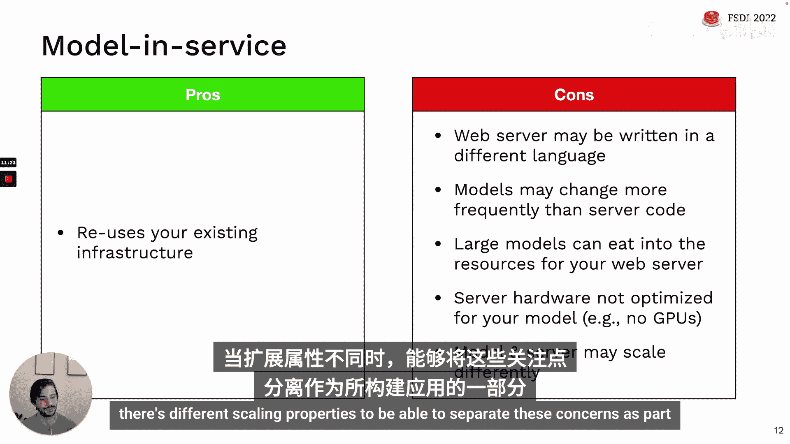

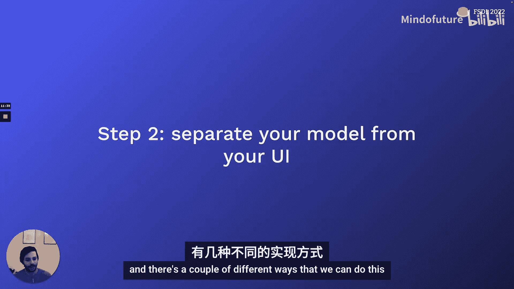

我们之前讨论的原型方案大多符合 **“模型在服务器中”** 的模式。在这种模式下，你托管的Web服务器内部打包了模型。例如，当你编写Streamlit或Gradio脚本时，该脚本会加载模型，同时构建UI并运行模型。

这种模式有其优缺点。

**优点**：
*   **非常容易实现**，尤其是在使用原型开发工具时。
*   如果是在公司现有应用架构上构建，可以**复用大量现有基础设施**，无需为尝试模型而设置很多新东西。

**缺点**：
*   **语言不匹配**：你的Web服务器可能使用Ruby、JavaScript等语言编写，而模型通常是Python，将模型集成进去可能很困难。
*   **更新频率不同**：在模型构建早期，模型代码的更新频率可能远高于服务器代码。如果每次模型更新都需要重新部署整个应用，会非常低效。
*   **扩展性差**：如果模型很大，在Web服务器上加载它会消耗大量资源，可能影响服务器上其他非模型相关功能的用户体验。
*   **硬件不匹配**：服务器硬件通常没有针对机器学习工作负载进行优化，例如很少配备GPU。
*   **扩展属性不同**：模型和应用程序的其他部分可能有非常不同的扩展需求，将它们捆绑在一起使得独立扩展变得困难。

当模型和应用的扩展属性不同时，将它们分离是明智的。这引出了我们的第二步：将模型从UI中分离出来。

## 分离模型与UI：批处理预测 📦

将模型从UI中分离出来有几种方法，我们先讨论第一种：**批处理预测**。

在这种模式下，模型不直接与UI交互，而是定期从数据库获取新数据，对每个数据点运行模型，然后将推理结果保存回数据库。

**工作原理**：
1.  定期（例如每小时、每天）获取新数据。
2.  对每个数据点运行模型推理。
3.  将预测结果存储到应用程序使用的数据库中。

这在某些场景下效果很好。例如，如果模型的潜在输入数量有限（如每个用户或客户一个预测），或者用于内部用例（如营销自动化，为每个销售线索打分），你可以定期为所有可能的输入运行预测并存储结果。

**如何实现**：
你可以使用上一讲中讨论的数据处理工作流工具（如Dagster、Airflow、Prefect）来实现。你需要重新运行数据预处理，加载模型，运行预测，并将结果存储到数据库。这正是一个有向无环图（DAG）工作流，这些工具就是为此设计的。像Metaflow这样更专注于机器学习用例的工具可能更容易上手。

**批处理预测的优缺点**：

**优点**：
*   **易于实现**：复用现有的批处理工具，无需托管新的Web服务。
*   **易于扩展**：数据库本身就是为了轻松扩展而设计和优化的。
*   **低延迟**：用户直接从数据库读取预测结果，延迟很低。
*   **成熟可靠**：这是许多大型公司在生产系统中使用的成熟模式，尤其在推荐系统等领域。

**缺点**：
*   **不适用于所有模型**：如果模型输入复杂或潜在输入空间巨大，无法枚举，则此方法无效。
*   **预测可能过时**：如果特征变化频繁（如每小时、每分钟），但批处理作业每天才运行一次，用户看到的预测可能不是最新的。
*   **模型可能陈旧**：如果批处理作业因故失败，新预测无法入库，问题可能难以检测。

## 分离模型与UI：模型即服务 🌐

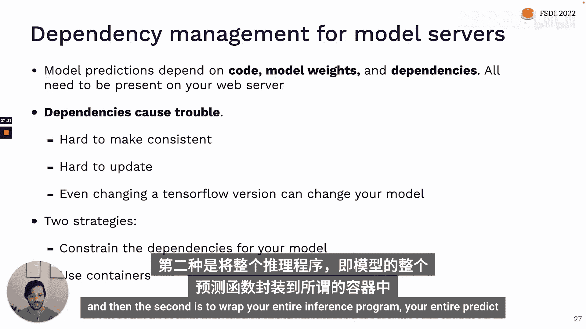

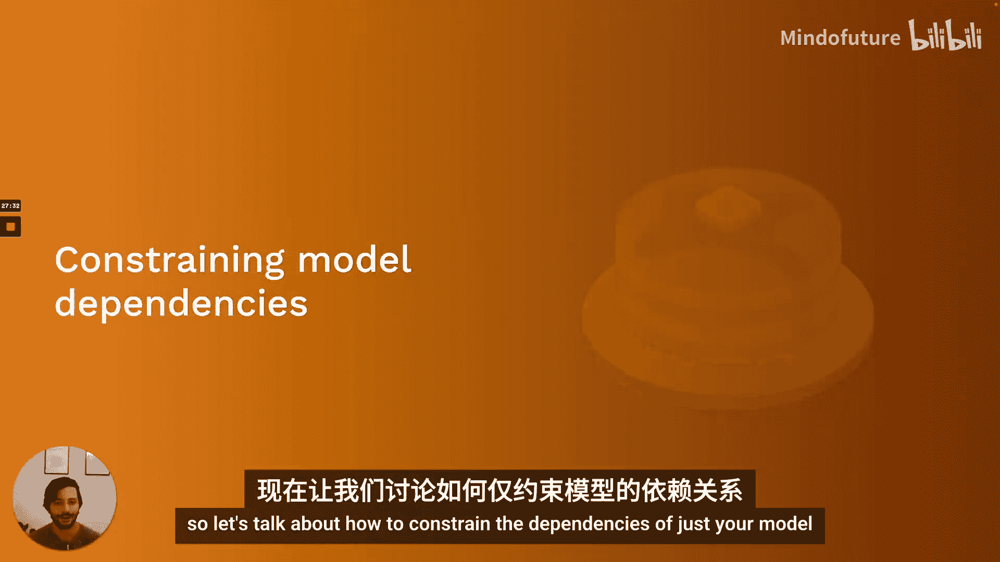

接下来我们讨论第二种模式：不将模型离线运行并存入数据库，而是将其作为一个**独立的在线服务**运行。

这个服务通过与后端或客户端直接交互来工作：它们向模型服务发送请求（“这个输入的预测是什么？”），并接收响应（“预测结果是X”）。

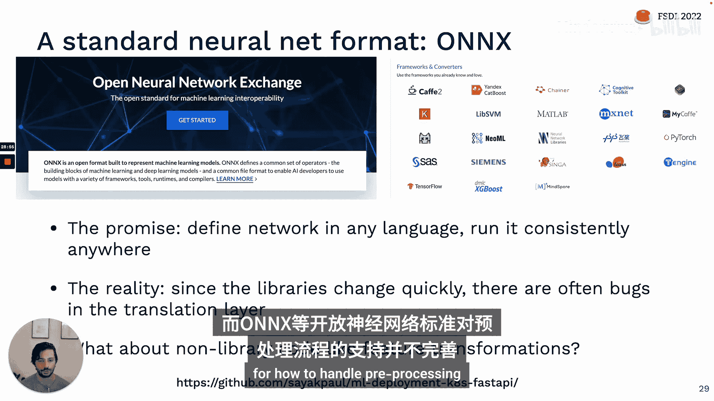

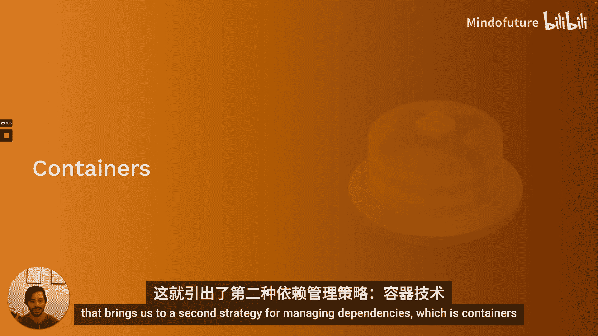

**模型即服务的优缺点**：

**优点**：
*   **可靠性**：如果模型有Bug，在Web服务器中直接运行可能会拖垮整个应用。作为独立服务，影响范围更小。
*   **可扩展性**：可以为模型本身选择最佳硬件和基础设施，独立于应用的其他部分进行扩展。
*   **灵活性**：一个模型服务可以轻松地被其他应用或同一应用的其他部分复用。

**缺点**：
*   **增加延迟**：由于是独立服务，客户端或服务器与模型交互时需要通过网络进行请求和响应，这会增加延迟。
*   **增加基础设施复杂性**：相对于其他技术，你现在需要负责托管和管理一个独立的服务。

对于许多机器学习团队来说，挑战在于：“我擅长训练模型，但不确定如何运行一个Web服务。”然而，这确实是大多数ML驱动产品的理想选择，因为其他方法的缺点太大。在大多数复杂用例中，你真的需要能够独立于应用本身来扩展模型。对于许多有趣的ML应用，我们没有一个可以每天枚举的有限输入空间，我们真的需要能够响应用户的任何请求。

在下一节中，我们将讨论如何构建模型服务的基础知识。

## 构建模型服务：基础 🛠️

构建模型服务涉及几个核心组件：REST API（服务与应用程序其他部分交互的语言）、依赖管理（处理PyTorch、TensorFlow等库的版本问题）、性能优化（如何使其运行更快、扩展更好）以及发布流程（如何将新版本模型部署到生产环境）。最后，我们还会讨论可以为你解决许多技术问题的托管选项。

### REST API

REST API通过规范格式的HTTP请求来提供预测。除了REST，还有其他协议，如gRPC（在Google产品如TensorFlow Serving中常见）和GraphQL（在Web开发中常见，但与构建模型服务关系不大）。

一个REST API请求示例如下：
```bash
POST https://api.fullstackdeeplearning.com/predict
{
  "input": "Your model input data here"
}
```
你向一个URL（API端点）发送数据，使用POST方法，并附带一个包含模型输入数据的JSON块。

一个常见的问题是：是否有发送模型输入数据的标准格式？不幸的是，目前还没有统一的标准。例如，Google Cloud、Azure和Amazon SageMaker各自期望的输入格式都有所不同。希望未来行业能朝着机器学习服务REST API调用的标准接口发展。

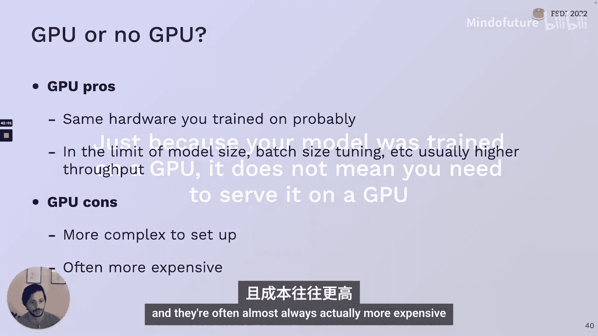

### 依赖管理

模型预测不仅依赖于你运行的模型权重，还依赖于将这些权重转化为预测的代码，包括预处理以及运行预测函数所需的特定库版本。所有这些依赖项都需要存在于你的Web服务器上。

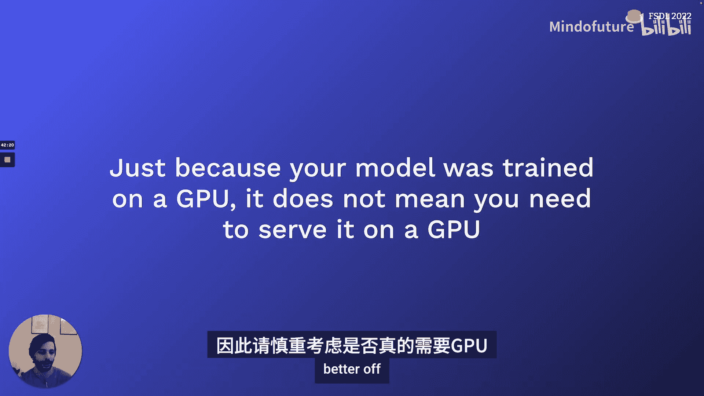

不幸的是，依赖项是Web应用（尤其是机器学习Web服务）中 notorious 的问题根源。原因在于：
1.  很难确保开发环境和服务器环境的一致性。
2.  更新困难，在一个环境中更新后需要在所有环境中更新。
3.  机器学习库更新迅速，TensorFlow或PyTorch版本的小改动都可能改变模型行为。

管理依赖主要有两种策略：
1.  **约束模型本身的依赖**：将模型保存为一种与运行环境无关的格式。
2.  **将整个推理程序打包到容器中**。

**策略一：约束模型依赖**
目前主要的方式是通过 **ONNX（开放神经网络交换）** 库。ONNX的目标成为机器学习模型的互操作性标准，让你能在任何地方一致地运行用任何语言定义的神经网络。然而，由于底层库变化迅速，这个转换层经常存在Bug，有时带来的问题比解决的问题还多。另一个问题是，它不能很好地处理非库代码（如特征转换、图像预处理等Python函数）。

**策略二：使用容器（如Docker）**
Docker是一种轻量级的虚拟化技术。与打包整个操作系统和应用程序的传统虚拟机（VM）不同，Docker将应用程序及其依赖库打包在一起，形成一个**容器**，由运行在主机操作系统上的Docker引擎来管理。

**Docker的优势**：
*   **轻量**：无需打包整个操作系统。
*   **灵活**：通常为应用程序的每个离散任务（如Web服务器、数据库、模型服务）启动一个独立的容器。
*   **强大的生态系统**：可以通过Docker Hub等 registry 轻松查找、拉取和分享公共或私有的Docker镜像。

**如何创建Docker容器**：
通过编写 **Dockerfile** 来定义构建环境。例如：
```dockerfile
FROM python:3.9-slim
COPY . /app
WORKDIR /app
RUN pip install -r requirements.txt
EXPOSE 80
CMD ["python", "app.py"]
```
然后使用 `docker build` 和 `docker run` 命令来构建和运行容器。

**简化机器学习的容器化**：
有一些开源包专门为简化机器学习模型的容器化而设计，例如 **Cog**、**BentoML** 和 **Truss**。它们通常提供：
1.  一种标准方式来定义你的预测服务（包装 `predict` 函数）。
2.  一个YAML文件来定义依赖和包版本。
最终，它们会打包成标准的Docker容器格式，可以部署在任何地方。如果你想获得Docker的优势但又不想学习其细节，这些库值得一试。

### 性能优化 ⚡

如何让模型运行得更快？我们需要回答几个问题：是否使用GPU进行推理？此外，我们还将讨论并发、模型蒸馏、量化、缓存、批处理、GPU共享以及自动化这些操作的库。

**是否使用GPU？**
*   **优点**：可能与训练硬件一致；对于非常大的模型和高流量，通常能获得最大吞吐量。
*   **缺点**：设置更复杂；几乎总是更昂贵。

**重要提示**：模型在GPU上训练，**并不意味**着必须在GPU上部署才能工作。仔细考虑是否真的需要GPU，尤其是在模型早期版本，在CPU上部署可能更好。

**并发**
在单台主机上，让模型的多个副本在不同的CPU或CPU核心上并行运行。关键技巧是**线程调优**，确保不同模型副本不会竞争机器上的线程。

**模型蒸馏**
训练一个更小的模型来模仿大型模型的行为，从而压缩知识到一个更小、更高效的模型中。这在实践中可能有些棘手，但像DistilBERT这样的流行模型的蒸馏版本是很好的例子。

**量化**
使用更低精度的数值表示（如16位浮点数、8位整数）来执行模型中的数学运算，以换取性能提升，同时精度损失通常有限。建议使用PyTorch、Hugging Face和TensorFlow Lite中的内置方法，而不是自己实现。Hugging Face的Optimum库让这变得非常容易。

**缓存**
如果某些用户请求的输入比其他的更常见，可以将这些常见请求的预测结果存储在缓存中，在运行昂贵的模型前向传播之前先检查缓存。Python的 `functools.lru_cache` 可以用于简单的缓存实现。

**批处理**
通常推理时批大小为1。批处理利用GPU可以并行处理一批输入以获得更高吞吐量的特性。你需要收集输入直到达到足够的批大小，运行预测，然后拆分结果。这需要在**吞吐量**（更大的批大小）和**延迟**（等待收集批数据的时间）之间进行权衡，并且需要一种机制在延迟过长时短路此过程。这很复杂，通常由专门的模型服务库内置支持。

**GPU共享**
如果你的模型没有完全利用GPU，可以在同一GPU上运行多个模型服务。这通常也很困难，建议使用开箱即用的模型服务解决方案。

**自动化库**
有许多库可以解决GPU托管问题，例如TensorFlow Serving、PyTorch Serve、NVIDIA Triton、Anyscale Ray Serve。Triton功能强大但可能难以入门；从与你的神经网络库对应的服务（如TorchServe）开始可能更容易。

## 水平扩展与编排 📈

我们已经讨论了如何优化单台服务器上模型的性能，但要扩展到大量用户，最终需要**水平扩展**：将流量分流到运行在不同服务器上的多个模型副本。

**水平扩展的工作原理**：
每台运行模型的机器都有自己独立的服务器副本，然后使用**负载均衡器**在它们之间路由流量。实践中，有两种常见方法：
1.  **容器编排**（如Kubernetes）：用于管理基础设施上作为应用程序一部分运行的大量容器。
2.  **无服务器**（Serverless）：非常适合机器学习模型。

**容器编排（以Kubernetes为例）**
Kubernetes与Docker紧密协作，构建和运行容器化的分布式应用。它帮助你解除“所有容器都在同一台机器上运行”的限制。对于只想部署ML模型的人来说，学习Kubernetes可能有些大材小用。有一些构建在Kubernetes之上的框架使其更易于用于模型部署，如KFServing和Seldon。

**无服务器函数**
你将应用程序代码和依赖打包到一个Docker容器中（该容器需要有一个单一的入口点函数，例如模型的 `predict` 函数），然后将其部署到AWS Lambda或类似的服务。该服务负责为你反复运行该函数，并处理扩展、负载均衡等所有问题。

**无服务器的优势**：
*   **按需付费**：只为实际运行模型的时间付费。
*   **无需管理基础设施**：非常适合快速入门，尤其当你不擅长基础设施时。
*   **自动扩展**：非常适合流量波动大的场景。

**无服务器的挑战**：
*   **包大小限制**：部署包的大小可能有限制。
*   **冷启动问题**：函数闲置后，第一个请求的响应时间可能较长。
*   **模型流水线**：对于复杂的模型链式调用，实现可能较困难。
*   **状态管理**：难以构建缓存等功能。
*   **部署工具**：部署新版本的工具可能有限。
*   **仅限CPU**：目前主流无服务器服务仅支持CPU，且执行时间有限制（但未来可能会改变）。

**发布管理**
发布管理涉及如何管理和更新这些模型服务。你可能需要能够：
*   **逐步发布新版本**：从1%的流量开始，逐步增加。
*   **快速回滚到旧版本**：如果新版本发现问题。
*   **分流流量**：用于A/B测试。
*   **影子部署**：让新模型在不影响用户的情况下处理真实流量，以测试其预测。

这是一个具有挑战性的基础设施问题。如果你使用托管选项或团队提供的基础设施，可能已经解决了这个问题。否则，考虑使用托管选项可能是个好主意。

## 托管选项 ☁️

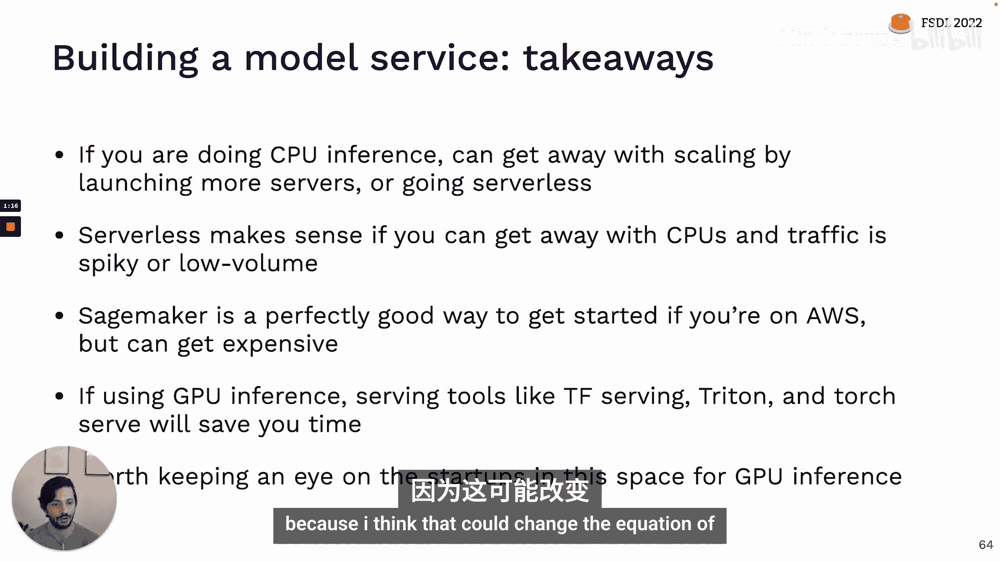


托管选项可以为你解决许多扩展和发布方面的挑战。云提供商和端到端ML平台都提供自己的托管选项，此外还有一些初创公司提供相关服务。

例如，**Amazon SageMaker** 是一个流行的托管服务。如果你的模型已经是Hugging Face或scikit-learn等可识别的格式，使用SageMaker的“快乐路径”非常简单：使用SageMaker的对应包装器，调用 `fit` 方法，然后调用 `deploy` 方法并指定实例数量和硬件类型。之后，你就可以调用 `predictor.predict` 进行预测了。

**SageMaker的主要权衡**：
*   **易用性**：对于标准模型，部署非常容易。
*   **灵活性**：对于更复杂的模型，仍然需要部署容器，其界面可能不如预期友好。
*   **成本**：部署到专用实例可能比原始EC2更昂贵，但无服务器选项的成本可能更具竞争力。

**构建模型服务的要点总结**：
1.  **你可能不需要GPU推理**：CPU推理配合水平扩展或无服务器通常就足够了。
2.  **无服务器是推荐起点**：尤其适合CPU推理、流量波动或低流量的场景。
3.  **SageMaker是一个不错的选择**：如果你已经在AWS上，它是一个很好的起点，尽管成本可能随着规模增长而增加。
4.  **如果需要GPU推理，请使用专业工具**：不要自己从头构建，投资于使用TensorFlow Serving或Triton这样的工具。
5.  **关注初创公司**：按需GPU推理领域的发展可能会改变游戏规则。

## 边缘部署 📱

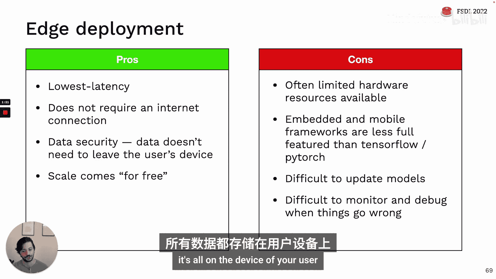

接下来我们将讨论将模型完全移出Web服务器，**推送到边缘**，即用户所在的位置。

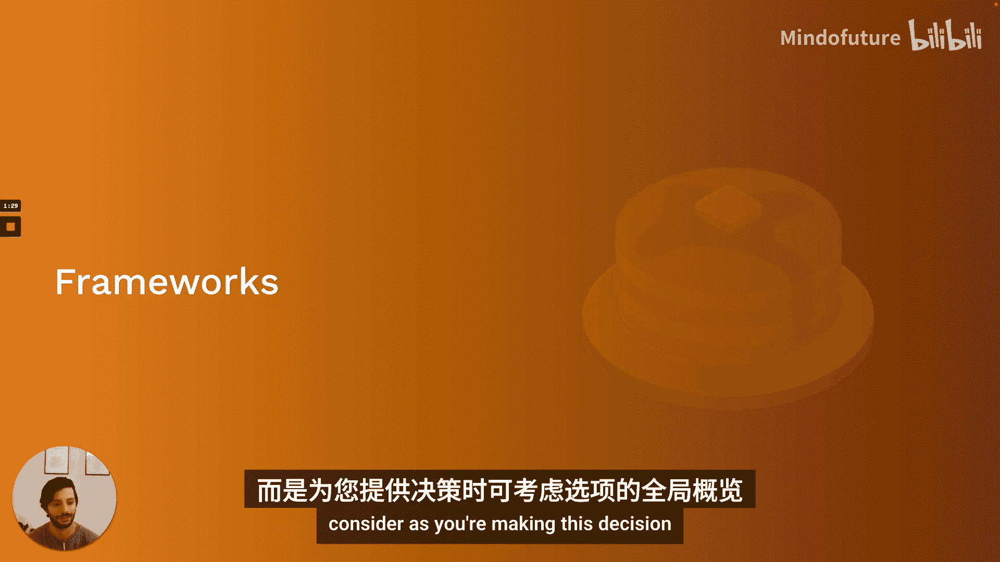

**何时考虑边缘部署？**
*   **显而易见的情况**：用户没有可靠的网络连接（如自动驾驶汽车），或有严格的数据安全/隐私要求。
*   **权衡延迟与准确性**：如果已经穷尽了减少模型预测时间的方法，或者延迟要求非常严格，以至于无法通过网络往返时间满足，那么即使有可靠的网络连接，也可能需要考虑边缘部署。

**边缘预测模型**
在这种模式下，模型本身在客户端设备上运行。客户端加载模型权重并直接与之交互。

**优点**：
*   **最低延迟**：是构建机器学习产品延迟最低的方式。
*   **无需网络连接**：适合机器人等设备。
*   **数据安全**：数据无需离开用户设备。
*   **免费扩展**：每个用户自带硬件运行模型，无需考虑服务端扩展。

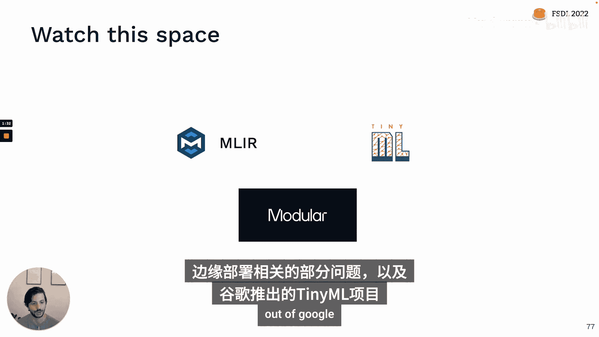

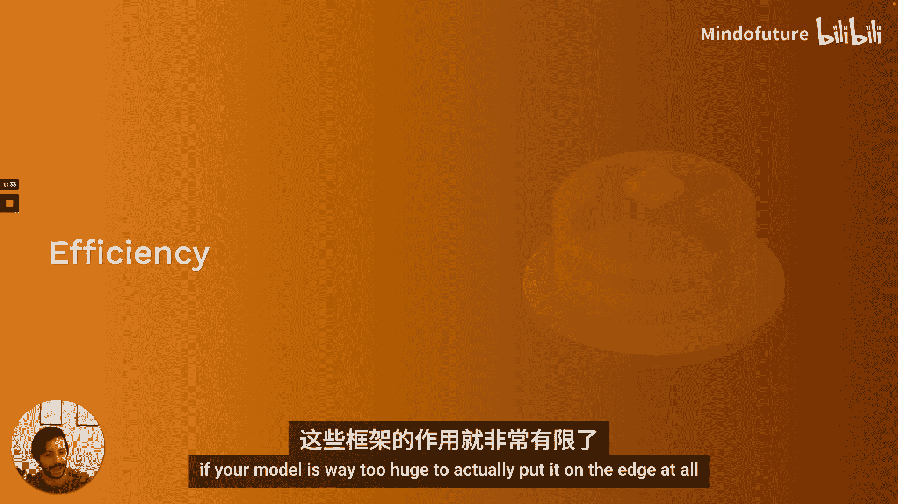

**缺点**：
*   **硬件资源有限**：边缘设备通常计算和内存资源有限。
*   **工具不成熟**：用于在有限硬件上运行模型的工具通常功能不全、更难使用、且Bug更多。
*   **模型更新困难**：向设备发送更新的模型权重，更新策略需要仔细考虑。
*   **调试困难**：模型出错时，由于原始数据在用户设备上，很难检测、修复和调试。

**边缘部署框架选择**
选择合适的框架取决于你如何训练模型以及目标部署设备：
*   **NVIDIA设备**：TensorRT。
*   **手机**：Apple Core ML（iOS），Android ML Kit（Android）。如果想跨平台，PyTorch Mobile（支持iOS和Android）或TensorFlow Lite（支持移动设备及其他边缘设备）。
*   **浏览器**：TensorFlow.js。
*   **多设备/跨平台**：考虑 **Apache TVM**，它是一个库无关、目标无关的模型编译工具。此外，可以关注相关初创公司如OctoML（基于TVM）和Modular。

**创建高效边缘模型**
如果模型太大无法放在边缘，我们需要创建更高效的模型。除了之前提到的**量化**和**蒸馏**，还有专门为移动或边缘设备设计的模型架构，例如 **MobileNets**。它用更便宜的操作（如1x1卷积）替换了典型卷积层中昂贵的操作。**DistilBERT** 是模型蒸馏的一个成功案例，它在保持性能的同时显著减小了模型尺寸和运行时间。

**边缘部署的关键思维模式**：
1.  **根据目标硬件选择架构**：不要先找完美架构再适配设备。通常，通过蒸馏、量化等技巧，你可能只能获得2-10倍的改进。如果你的模型比目标环境能承受的大10倍或慢10倍，可能就不该考虑这个架构。
2.  **在本地迭代**：一旦有一个能在边缘设备上工作的版本，可以在本地迭代，只要逐步增加模型大小或延迟。建议为模型大小和延迟添加指标或测试。
3.  **将设备调优视为额外风险**：始终在实际生产硬件上测试模型后再部署，因为边缘部署库可能不成熟，在设备上的行为可能与开发环境有细微差别。
4.  **构建回退机制**：在模型中构建回退机制，以防模型失败、意外发布错误版本或运行过慢。回退机制可以是旧版模型、更简单可靠的模型，甚至是基于规则的函数。

**边缘部署总结**：
1.  **Web部署比边缘部署容易得多**，只在真正需要时才使用边缘部署。
2.  **根据训练库和可用硬件选择框架**。如果需要更灵活，考虑Apache TVM。
3.  **在项目开始时就要考虑边缘部署的额外约束**，并据此选择架构和训练方法，不要等到最后才考虑。

## 总结 🎓

本节课中我们一起学习了机器学习模型部署的全过程。

部署模型是构建机器学习驱动产品的必要步骤，同时也是改进模型的宝贵途径，因为只有在真实场景中，你才能看到模型在真正关心的任务上表现如何。

我们鼓励你秉持以下心态：
*   **尽早部署，频繁部署**：以便尽快从真实世界收集反馈。
*   **保持简单，仅在需要时增加复杂度**：部署可能是一个复杂的无底洞，确保你真的需要那些复杂性。

我们的部署路径是：
1.  **从构建原型开始**。
2.  当需要扩展时，**将模型与UI分离**，通过批处理预测或构建模型服务来实现。
3.  当简单的部署方式无法扩展时，**学习扩展技巧**或使用**托管服务/云提供商选项**来处理扩展问题。
4.  最后，如果你确实需要在无法稳定联网的设备上运行模型、有严格的数据安全要求或对速度有极致追求，**考虑将模型移至边缘**，但要意识到这会增加大量复杂性并需要使用不太成熟的工具。

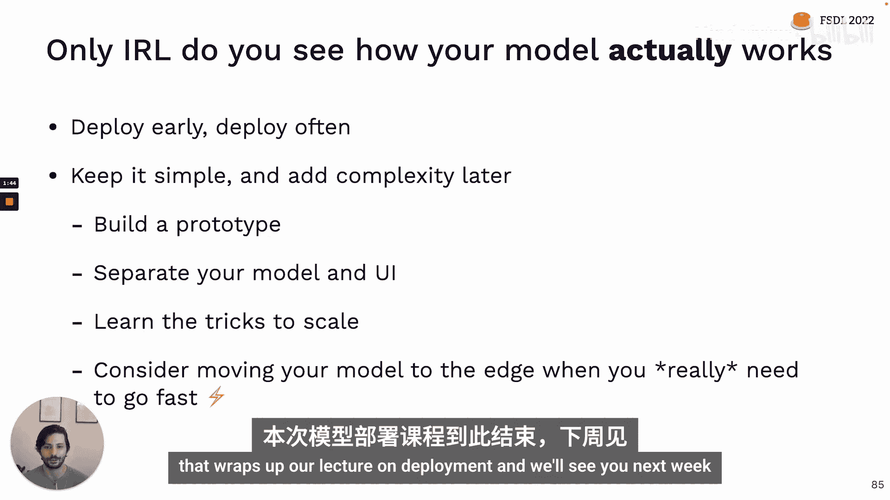

模型部署是将机器学习研究转化为实际价值的关键桥梁。掌握这些核心概念和实用路径，将帮助你更顺利地将智能模型交付到用户手中。