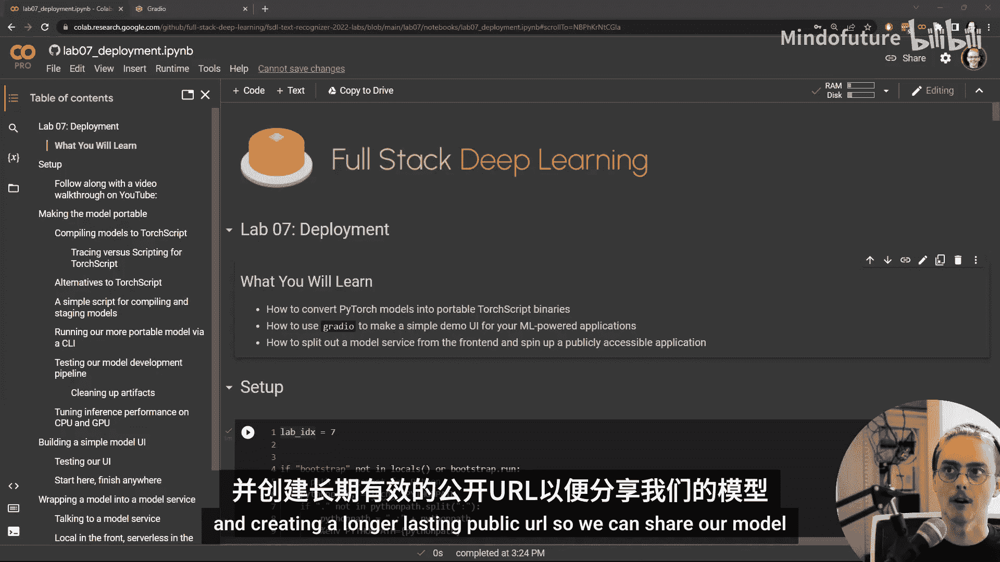
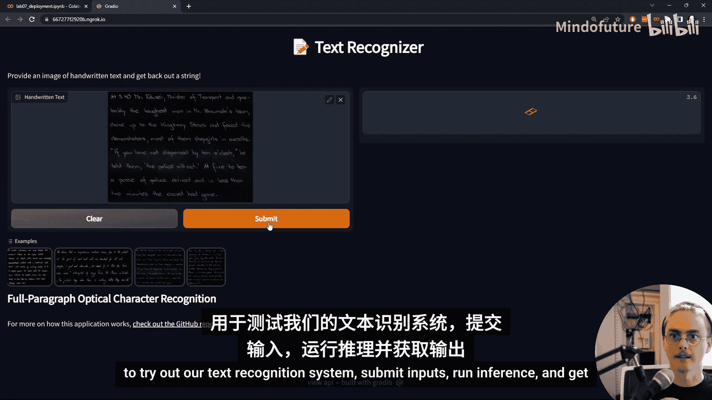
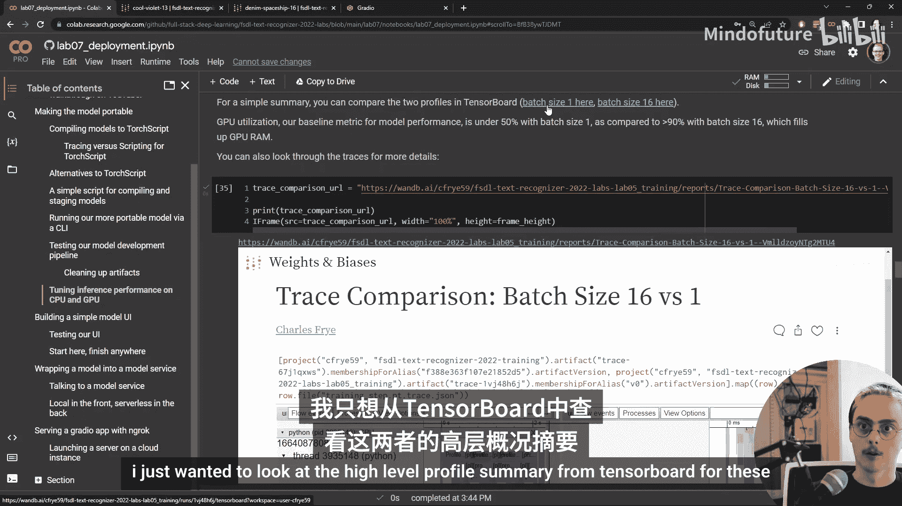
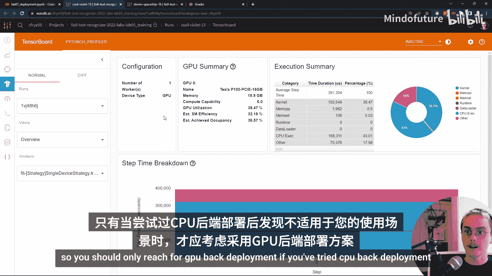
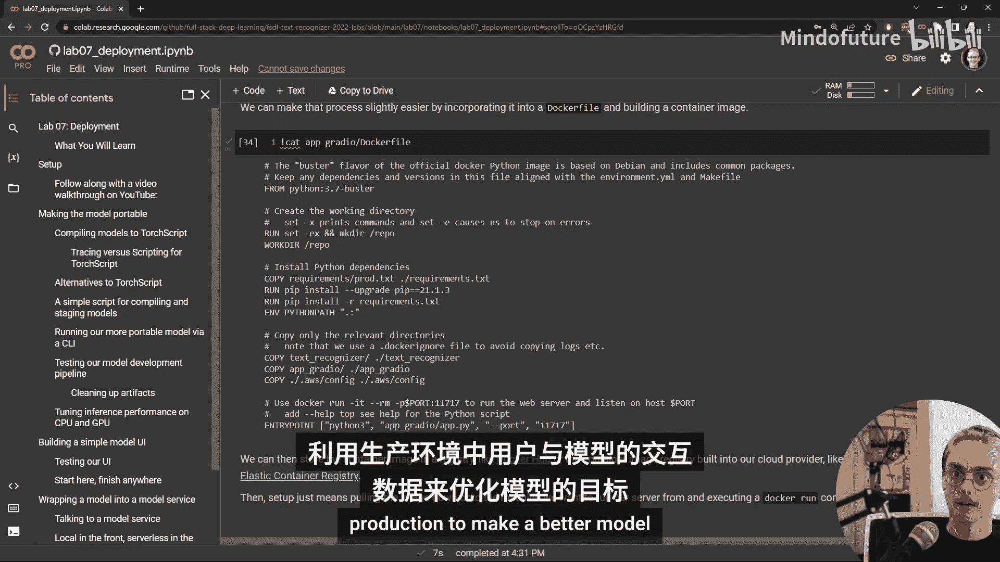

# Full Stack 深度学习 ｜ Full Stack Deep Learning   2022 p13 P13_Lab_07-Web部署 -BV1k4YXznEjw_p13-

Hey， folks， and welcome to the  seventhth lab in full stack deep learning on deployment。

 This is a really exciting lab because this is when we finally really start to move away from just building machine learning models and starting to actually build a machine learning powered application。

 So let's dive in in this lab。 we're going to first cover how to convert our pytorch models that we use during training into some more portable torch script finearies。

😊，And then we're going to talk about how we can use a library called Gdio to quickly create a user interface around our model that we can share。

 and then we'll take a one step further splitting out our model from our front end interface and creating a longer lasting public URL so we can share our model。

 So as a sneak preview， this is what we're going to end up with。

 we're going up with a URL that anyone can navigate to to try out our text recognition system。

 submit inputs run inference and get outputs so to get the text recognizer running。

We need some good model weights。 So we trained those on a nice8 GPU setup in the Lambda Las GPU cloud。

 and then we stored the checkpoints during training in WnB's artifact storage。

 So we need to pull those weights down。 They're in this checkpoint format。

 which is designed for restarting training， but we don't necessarily care about restarting training anymore。

 we just want to run the model。 So after we've reloaded that model into the a lightning module。

 just like we would， if we were trying to restart training。😊。

We'll call the two torch script method on it， which。Converts the model into this torch script format。

 Sos a lot lighter weight。 You only even need a python runtime in order to run a torchscript model。

 much less all the other heavy dependencies that we have for model development like W and B and pytorrch lightning and all the data science libraries that they depend on。

 Once a model has been converted to torch script， then we save it in W andB's cloud storage just like we do with our model checkpoints。

 So we wrap this entire process up into a little script stage model that does our handoff。

 basically from training to production。 Once it's stored。 you don't need to do any of those steps。

 you just need to pull the binary file down。 And so that's what we'll do inside this notebook。

 We run the stage model dot pi script。 and we fetch the compiled model from where it's stored in W and B's cloud storage。

 One advantage of using W and B not just to store information about training。

 but also to store some information about production is that we can connect。

The model that's running in production to the training runs。

 the experiments that we've logged to W andB。 So inside the W&B interface， what that looks like。

 we have a track execution in W&B that created this compiled torch script model that's production ready And if we look at that experiments and its artifacts we can see that it took in a model checkpoint and produced this production ready text recognizer and if we check out that model checkpoint。

 we can connect back to a model training run with all of our metrics and other information that we've stored when we're only running a few experiments。

 maybe only working with one or two versions of a model having all of this connecting metadata available in a UI or an API doesn't feel that important。

 It's easy to keep track， we haven't run that many 10 hour long experiments。

 so it's not that hard to find the one that trained the model that's in production。

But as the team grows， as the model and the application matures。

 being able to access this information programmatically is going to become really important。

 So there is a performance benefit to switching over to Torch script。

 But really the primary benefit here is that now our model is much more portable， easy to spin up。😊。

So we include a new Python module paragraph text recognizer with this paragraph text recognizer class in it。

 because this model is in the torch script format。 It's just one line to pull it in Torch dot Gt dot load。

 And then we just have to take our inputs and put them into the format that the model expects using this。

Stem component。 and then we take the model outputs， turn them into strings。

 And now we have an image to string model that does our text recognition。

 This is way simpler than the way that we were creating models in training and has a much lower code footprint。

 So with just that class， we can pass in an image or a path that points to an image and get out what the handwritten text content of that image is。

 As usual， we design this to work both as an importable python object。

 something that you can play around with a notebook and as a。😊，Simple command line interface。

 a simple script that takes in a file name that points to a file。 Maybe locally。

 maybe it's a file at a URL or in cloud storage and then runs the text recognizer on that input。

 We also add a quick little test for this model development process。Because it's so important。

So critical to what we're trying to do。 createreate a machine learning application。

 We want to make sure that changes that we make as we're iterating on the model don't break this process。

 So let's take a quick look at how this test works。 Our goal is to test end to end model development。

 Getting the data onto the machine， using it to generate gradients， update parameters。

 saveve that model， convert that model to torch script。

And then upload that model to W and B and then pull it back down。

 So all of these steps are run in this script。 And if any of them error out， then will fail。

 One important difference between what's happening in this lab and what's happened in previous labs is that we actually are no longer using the GPU。

So if you're running on coab and you check which runtime type you have。

 you'll find that you don't have a GPU accelerator。

 And that's because we don't necessarily need to have GPUus to accelerate our models once they're running inference。

 even if they're necessary during training。So we go through a couple of the reasons in this section of the lab。

 one that I wanted to just walk through in this video very quickly is。

That batching is actually really important to what makes GPUus efficient。During training。

 when our model is running in production， users are going to be sending requests。

 and they're all acting independently of each other。

 So we don't control when data comes in that we were on a run inference on。

 very much unlike during training。 And so the simplest way to。

Run our model is to do inference on a single input example at a time。

 But this is really terrible for GPU utilization。 GUs get more efficient and more effective。

 The more things they can do in parallel， and it's really easy to parallelize across a batch。

 And so having large batches really makes GPus much more efficient。

 So we link to a W and B report where you can compare side by side to traces from from a few steps of our text recognizer model running a batch size of 16 versus is running on a batch size of one。

 But in this video， I just wanted to look at the high level profile summary from tensor board for these two。

 So the batch size 16 example。 This looks a lot like what we saw in the performance troubleshooting lab where we saw super high GPU utilization。

 which means at almost all times during the model's execution。 something is happening on the GPU。

 This is our baseline metric that we optimized to make sure that we're making。😊。

Good use of those expensive GPU accelerators。If we look at the high level summary for the model running on a single input at a time on batch size1。

 we see that our GPU utilization is tanked is only 38%。 instead of above 90%。

 we can see that for a large fraction of the time。 what we're waiting on is actually things happening on the CPU We' bottlenecking almost as much on picking which kernels to run as we are on on running those kernels on the GP。

 While the details here might differ from application to application。

 It's always going to be the case that getting a lot out of your GPus in deployment is much more challenging than getting a lot out of them during training So you should only reach for GPU back deployment if you've tried CPU back deployment and found that it doesn't work in your use case。

 So we've made our model more portable we've created a command line interface for our models so it can run on input files that we pointed to no need to worry about Pythtorch data sets or data loaders but a command line。

is not really a good user interface for a deep learning model。

 Deep learning models often operate on the types of data that humans really care about， audio。

 text images， and for the same reasons that we like to use Jupiter notebooks so that we can see and play around with this rich data while we're developing our models。

 we also want to be able to see and play around with this rich data while we are using our models and to double down on a point from lecture。

 having a user interface like this available as early as possible during development is really important for designing high quality models。

😊，This is closer to the way your users are going to interact with your model。

 They're not going to be creating pytorch dataset sets and sending batches of inferences and calculating metrics on them。

 They're going to be sending data that matters to them from their phone。

 from their computer directly to your model and looking at one prediction at a time。

 And the closer that we can get to our user experience while we're doing our development。

 the better that user experience is going to be。 So we've added a new Python module app radio that builds a basic user interface around our model using a library called radioio Raio makes it really。

 really easy to wrap a simple user interface around a single Python function that takes in some inputs and produces some outputs。

😊，This is enough to get a minimum viable product for actually a pretty large number of ML powered applications。

 After all， the core machine learning models that we're training are functions that take in some input and return some output。

 So let's take a look at how we build our inner user interface with radio。

 So the core component is down here at the bottom where we generate this radio interface。

 We pass in a Python function that we want to be able to interact with through this user interface。

 So that's going to be like the predict method of our tax recognizer。😊。

And then we also say what kind of inputs and what kind of outputs does this model have that makes it possible for radio to create simple widgets for users to provide inputs for the model and in order to display the model's outputs。

 so we have image inputs and text outputs here。That's really the core of it。

 The rest of these things are mostly sort of presentation。 So giving it a nice title。

 including a description and a readme and adding some example inputs so that users can see the kinds of things we expect them to submit once we have that radio interface object。

 we can create a user interface that we can interact with just by running this launch method。

 And one of the nice things about radios that it's designed to be able to run in a notebook just as easily as it can run from the command line so we could take our app radiolash app top high script run it there。

 and we'd have this interface running from the command line。

 we can also take a look at it inside this notebook without having to leave。

 But we're not just running this inside the notebook。

 This is not just something that we have only inside of our special computational environment here。

 This is something that anybody can interact with。 The model is running inside of our coab notebook or on our。

😊，Local machine where we're running Jupiter。 But anyone can use this interface just by going to the URL that's been printed to the standard output。

 So let's check that out。 So here's our nice user interface where we can drag and drop images。

 upload images or choose one of these examples。And then submit them。

 We can even edit them with a simple image editor here and then click submit to get the model's inference on them。

 Not so bad。 When you run this notebook and you get that URL， try going to it from another device。

 maybe your phone or another computer。And play around with the model at the same time as we create this U I。

 this user interface， we also get an API， an application programming interface。

 something that we can interact with programmatically to sends data via your requests and get responses。

 So clicking the show API button at the bottom of your radio interface。

 will give you the URL for the API and the format that it expects。

 So the general format here is Json Javascript Object notation which is。😊，Basically。

 a generic standard for representing dictionaries across languages。

 So we show a quick demonstration here back in the notebook of how you might interact with this API via the command line。

 So the curl tool is a simple Uniix command line tool that can send Json formatted data。

 among other things， to APIs and collect the responses。

The one tricky bit is how do we encode our images in order to send them in our request to the model。

 So in these H T TP based rest APIs， the most common way of formatting binary data when we're communicating it over the network is in so called base 64 format。

 which uses numbers and letters from the ASII character set。To represent the binary data in base 64。

 So we don't have to do this ourselves。 There's things built into both Uniix and into languages like Python to handle this。

 but it is something that we have to take into account。So in the first line。

 we take one of our images and we encode it in base 64。

 wrap it up into the JSON format that our API expects。And then we send it to the model with curl。

 Once again， we've added a bunch of new functionality。

 And this is something that we want to make sure that we're not breaking as we're adding new features。

 changing things around。 So we again， add a simple quick test thoroughly testing web applications is really challenging。

 It's probably going to require tools outside of the Python toolki and especially as you're iterating quickly and developing your model。

 these tests are going to be more troubled than they're worth。

 So we just do the most simple test We just check that the things we just did in the notebook。

 creating the user interface and then pinging the API run without error。

 So we create our frontend based off of our paragraph text recognizer。

 and then we send a request and check that there was no error and that there that theres some data in the response。

😊，So the Python function that that radio interface was wrapping was just our paragraph text recognizer predict function。

 So that means when we spin up the server， we need to create the model and then the same process that is serving that user interface and responding to user clicks and interactions is also the one that is running the model。

 and this is perfectly fine when you're first getting started。 it's super straightforward。

 This is the model in server architecture that we saw in the deployment lecture。😊，But pretty quickly。

 we're gonna to want。We're going to want to separate out our model back end from our user interface front end and provide a model as a service。

 So a model service architecture。 There's lots of ways to do this。

The simplest way that's compatible with easily scaling up your model serving without having an entire infrastructure team is to use serverless cloud functions that are provided by all the major cloud providers。

😊，So unlike servers that are up 24，7 and that maintain a lot and manage a lot of state in user sessions。

 serverless cloud functions are only running when they're needed。

 So the serverless tool for Amazon Web services is called AWS Lambda。

And the Python code that goes into that serverless cloud function is in this API serverless new module in La 7。

 So let's take a look at that。 So once again， we're creating that paragraph text recognizer class。

 which is fundamentally based on the torch script version of our model。

 And then we write a handler function that wraps around that model and its predicts function。

 So the predict function is expecting to receive file names for images or images。

 But these cloud functions communicate via Json blobs。

 And so we need to take the Json blob that comes in this event and pull the image out of it。

 And then send that image to the model predict function。

 We've also got a little bit of logging code here that prints information about what's going on inside our function。

 This will get automatically collected for us in Aws。 Once we've got the model's outputs。

 the model outputs。😊，A string。 We've got to package that back up into something that AW S can turn into Json。

 So we package that up into a dictionary。 And that's what we finally return。

 And then part of what is provided by AWs Lambda is converting that into a proper HtP response that a tool like curl or a browser can understand。

 So setting up a serverless function requires an AWs account and setting up your credentials in configuration and can cost money。

 So rather than setting one up inside the lab， we just show you what it looks like to talk to one that's already been set up that's running on the full stack deep learning。

 AWs account。 So as of this year， this actually got a lot simpler。

 it used to be the case that AWs Lambdas could only be talked to via AWS。

 But now they all come with a URL， which means we can talk to them like we talk to any other。😊。

Web service， we can send a request directly。 So when we were talking to the radio API。

 we did it via the command line using Unix tools in this cell。

 we demonstrate what it looks like to use the Python request library。

 which is a much more ergonomic and easy to use way to write these kinds of HP requests and handle the responses。

 And we can just use this。 We don't need any special8 of US specific tools or anything。

 And so this cell demonstrates that we can send an image to this serverless cloud function and a few seconds later。

 get back the model's inference of what text is contained in it。

So our big win here is that we no longer are running the server and the model in the same place on the same hardware so we can develop those two things independently of each other。

 So for example， we can run a radio app locally here in this Jupiter notebook。

 which might be on coab， which might be on your own machine。

 but then run the model on Aws infrastructure。 We just swap out our predictor backend。

 No longer using the paragraph text recognizer class， but instead pointing it to a URL。

 And most of the work on this is done using this predict from endpoint method of that predictor backend class。

 Let's take a look at that。 So this basically does the exact same thing as that cell。

 we were just looking at getting an image ready to be posted as an HP request and then pulling the prediction out of the response。

 So now we call make front end。😊，The function that we're wrapping instead of being the whole model dot predict is instead just this request posting。

 and the end result isn't something that's going to look different as we interact with it and play with it inside the notebook。

 but you'll notice if you are on your own machine and take a look at the resource consumption that the models no longer running on the same machine as this user interface。

 So we've spun up a serverless model service， And we've created a UI for users to interact with that model service。

 So we almost done with setting up a reasonably professional Ml powered application。

 or at least the minimum viable reasonably professional M powered application that we can slowly iterate on scale out replace pieces and eventually end up with something really high quality。

 the one missing piece is that the URL for sharing this model。MoIs the URL controlled by radioio。

 So you'll notice they have five digit number in front and then doc radioio dot app。

And you may have also seen a warning that that URL is only good for 72 hours。

So what we need to do to finish this process is set up our own public U Rls and no longer rely on Grio to provide them for us。

 So importantly， Gradio is still doing about half of the work for us。

Here radioio creates a local URL that we can talk to from the same machine。

 So this local URL will have an IP address like 127。0。0。1。

 which is the IP address of the current machine depending on your configuration it might say local host instead。

 and like other I addresses， which point to specific machines。

 this always means whatever machine this code is running on right now。

 And so if we run tools like curl or a browser on the same machine。

 and we point them at that specific URL， then we can interact with our model。

 our user interface and our API。 But running it on some other machine will give us an error。

 So fundamentally what we need to do is take this service that is running on an I that's only available locally and make it available globally。

 And doing that right is a little bit tricky。 One of the trickiest。

 but also most important bits is that you'll want to use encrypted communication。😊。

HTTPS instead of H TTP and setting that up on your own can be kind of a headache。

 So we'll do what we did when we wanted to make label studio accessible via a public URL we'll use Encro。

 and the free tier of Ncro includes both public URLs and secure secure communication with H TTps。

 The biggest downside is that that URL will change every time you restart your service。

 maybe after an outage。 and there's effectively now not really a good way to get a free static public URL。

 but this is something that you can either pay for through a cloud provider or pay for Nro or a similar service so that you can have that branded static URL for your application。

 So once you logged into Encro， it's as simple as just connecting an Ncrooc tunnel to that port at the end of our。

Local URL。 and then you can head to that Encrooc do Io URL and you can share that URL with others and they can interact with your model。

 We've done all this， by the way， in the Jupiter notebook justca that's the easiest way to combine this code with explanations and visualizations but all this can absolutely be done from the command line that's the right way to do it when you're running a web service running a web server out of a Jupyter notebook is kind of crazy。

 And so these two commands down here， show you how to do that from the command line if you want。

 in addition to not running the server from a notebook。

 we probably also don't want to run it from our development machine。

 and we certainly don't want to run it from coab which shuts off automatically after a few hours or days。

 So we want instead a dedicated server for this application。

And the simplest way to do this is to spin of a machine in a cloud provider。

 So elastic compute cloud， A K， A E C 2 is the option for doing this in AW S。

 So then we need to replicate a bunch of stuff that has happened in this notebook on that machine。

 We need to get cloned to pull down the library。 We need to install the production requirements。

 Fetch a compiled model with that stage model script。 and then finally run app dot pi and Encrooc。😊。

To create the user interface and then create a public URL for it。

 And as you're first getting started， that's totally fine。

 manually setting up your own server doesn't take that long。

 But once you start responding to outages or working with more people in a team。

 you're going to want to automate this process of setup and simplify the management of all these requirements and how to execute all of these commands with which arguments and in which environment。

 And so the right way to do that is by creating a container that essentially automates all those steps that I described。

 We provide an example Docker file that can create a docker container that can run our model frontend。

 either with the model running inside the server or with the model running somewhere else maybe serverlessly。

 we can't build container images or run。😊，Containers inside of coabab。

 So we won't actually use this docker file in the lab。

 But let's go through it really quickly to get a flavor for how containers are built。

 Docker files are written in this domain specific language that has a couple of simple verbs in it or commands。

😊，Like from or run with each of them on a different line。

 So the first line from says which container image we're starting from。

And this usually is going to have at least the operating system that you're basing off of whichever Linux version you're using。

 Often it'll include things like GPU drivers。 If you're doing GPU based inference here。

 it's just got Python 3。7 in it。 Then we run a command to create a working directory called slash repo into which we can put all of the code that we need。

 And so then we copy our first piece of information from the machine we're using to set up our docker container into our docker container with this copy command。

 we bring in the requirements file for production。 And then we run Pip install to install them inside this container。

 So one tip for writing Docker files。 you want to put all of your heaviest slowest stuff as early as possible。

 So things like installing dependencies and environments because each line of a Docker file is cached independently。

😊，These are the layers of your container image。 And if you change a layer halfway down。

 when you rebuild your container rather than starting from scratch。

 you'll start from halfway down the bottom layers， the ones that come first in the Docker file should be the ones that change the slowest and take the longest to run。

 Once we've got our requirements we start copying over the things that we're gonna need。

 So our text recognizer code are radio app code and any configuration information。

 Note that we don't copy over our training code because we don't need to do that in production。

 And we can also use this dot Docker ignore file kind of like a dot getign file to say which files we don't want to bring over。

 We don't want to copy over。 And then finally， we define what happens when you call Docker run。

 That's this entry point command here at the bottom。

 We'll call Python on app radio slash app dot pi and set a fixed port for。

The server to run on Always a good idea to document your entry points and how you expect them to be used inside the Docker file。

 Note also that any other things that get included in the Docker run command will also get passed to that original Python script。

 So， for example， you can include dash dash help and you'll get the Python script help printed in the container。

 So which you've called Docker build on this Docker file somewhere。

 you can then push that container image to a container registry a place like Docker hubub kind of the Github for Docker containers or if you want a little bit of more control over access to a container registry inside your cloud service。

 and then you can set up just by pulling the image down to machine and running Docker run。

 So no need to worry about setting up environments making sure they don't conflict。

 they don't conflict with anything else running on that server or worrying about any of the configuration that's inside that entry point。

 So to recap， we took our pytorrch model and compiled it down to torch。

So that we could make it more portable， run in different places。

 We wrapped a radio UI around that torch script model so that we could play with it interactively via a graphical interface。

 And then we separated out that graphical interface from the model execution so that we'd be ready to scale them independently of each other。

 And that's the basic process for setting up a model service architecture for an M powered application。

😊，So this workflow is enough for you to start making your own M O powered applications on the basis of your own models。

 In the final lab in this series， we'll look at how to monitor and debug models that we've deployed and start to close the loop and get to the point where we can use what we've learned from our users interacting with our model in production to make a better model。

 I'm looking forward to it。 And I'll see you there。😊。

