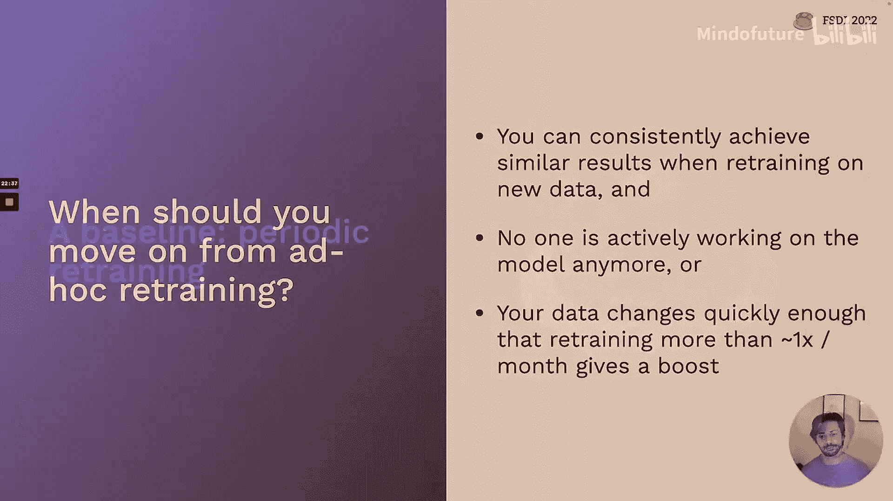
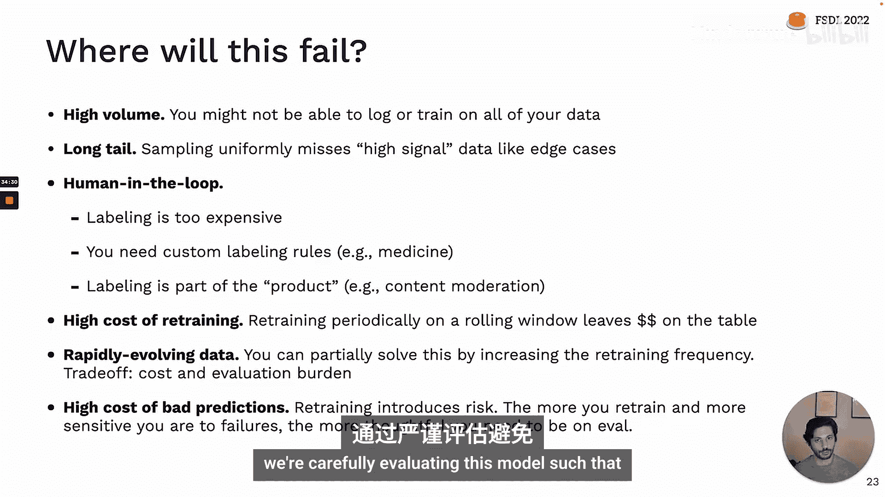
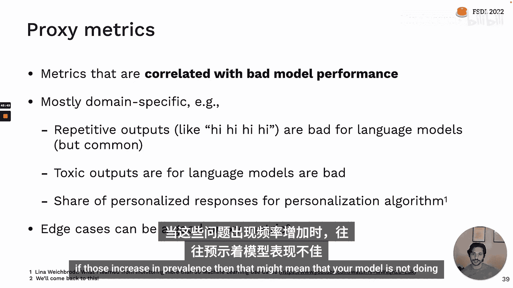
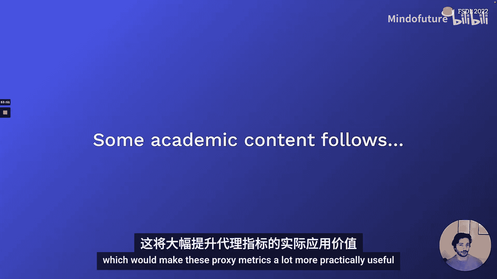
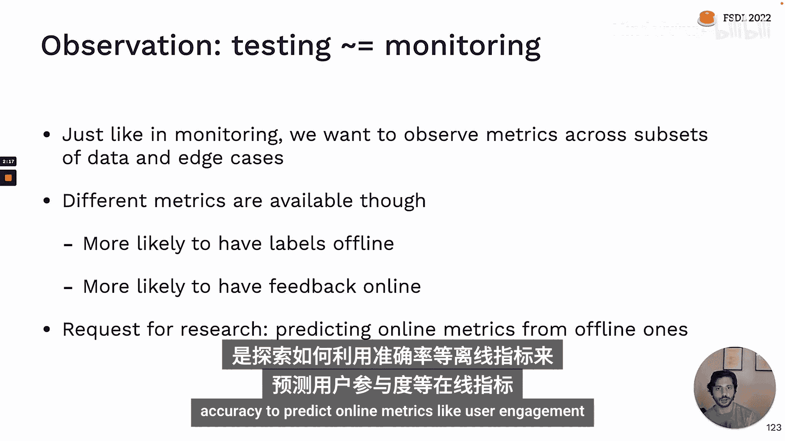
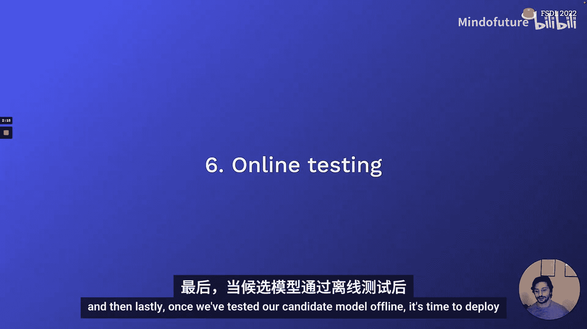
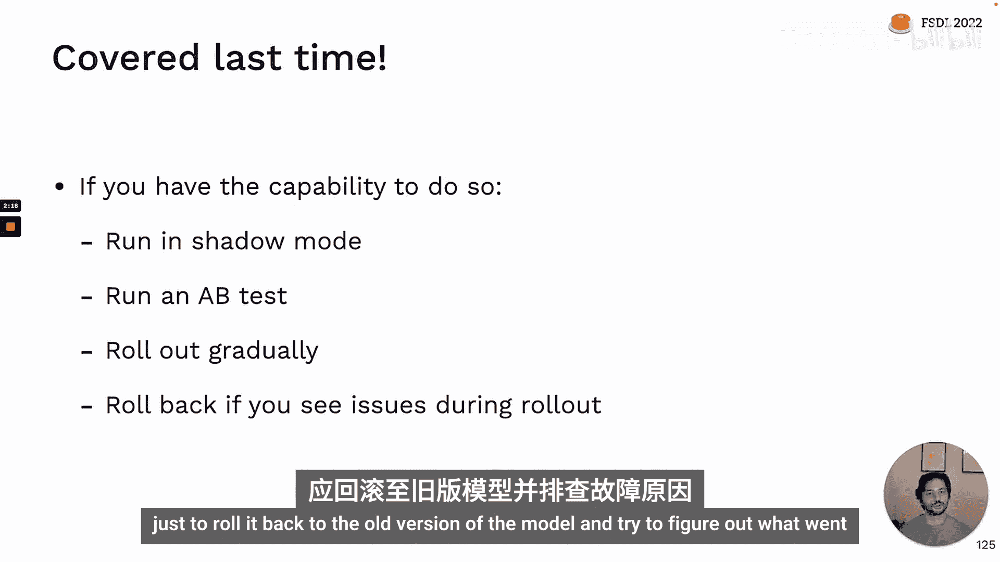
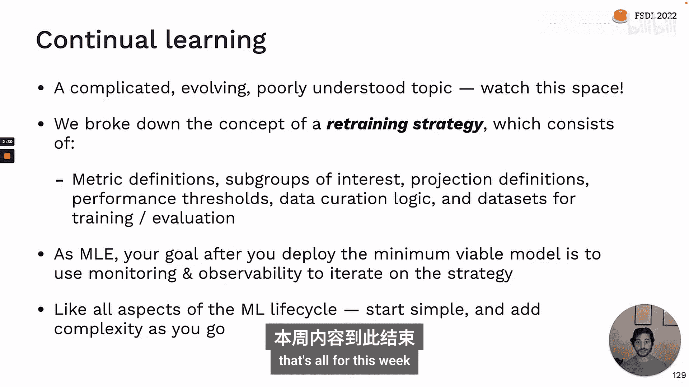

# 全栈深度学习：第6讲：持续学习 🚀

在本节课中，我们将要学习**持续学习**。持续学习描述了模型部署到生产环境后，对其进行迭代改进的过程。其核心是利用生产环境中的数据重新训练模型，以达到两个目的：一是让模型适应训练完成后现实世界发生的变化；二是利用真实世界的数据来普遍提升模型的性能。

## 持续学习的核心价值

上一节我们介绍了持续学习的定义，本节中我们来看看其核心价值。与学术界不同，在现实世界中，我们从不处理静态的数据分布。这意味着，如果你想在生产环境中使用机器学习，构建一个优秀的机器学习产品，你的目标应该是构建一个**持续学习系统**，而不仅仅是一个静态模型。

我们理想中的工作方式是之前课程中描述的**数据飞轮**：随着用户增多，他们会带来更多数据，你可以利用这些数据构建更好的模型，而更好的模型又能帮助你吸引更多用户，从而随着时间的推移构建出更好的模型。

最自动化、最乐观的版本被 Andrej Karpathy 称为“运维假期”：如果我们的持续学习系统足够好，那么它就能随着时间的推移自行改进，而我们作为机器学习工程师就可以去度假了，回来时模型会变得更好。

然而，现实情况却大不相同。通常，我们部署模型后，并没有很好的方法来衡量模型在生产环境中的实际表现。我们可能只是抽查一些预测结果，如果看起来没问题，就转向其他项目。直到问题出现——可能是业务用户或产品经理发现用户投诉或某个指标下降——才会引发调查。这已经给公司造成了损失。最终，问题被追溯到模型，而机器学习工程师可能需要进行一些临时分析，因为不清楚模型失败的原因。最终，可能需要重新训练并部署模型，如果幸运的话，可以进行 A/B 测试。但整个过程缺乏对模型在生产环境中表现的持续反馈。

因此，持续学习是生产机器学习生命周期中最不被理解的部分，目前很少有公司能真正做好。本讲座将分享我们对如何构建持续学习系统的观点，其中一部分是行业最佳实践，另一部分则是我们的看法。

## 持续学习循环与再训练策略 🎯

上一节我们探讨了持续学习的必要性，本节中我们来看看其核心框架。我们可以将持续学习定义为训练一系列能够适应生产环境中持续流入的数据流的模型。你可以将持续学习视为训练过程的一个**外循环**。

循环的一端是你的应用程序，包括一个**模型**以及与之交互的其他代码。用户通过提交请求、获取预测结果并反馈模型预测的好坏来与应用程序交互。

持续学习循环始于**日志记录**，这是我们获取所有数据进入循环的方式。接着是**数据管理**，用于触发再训练过程；**数据选择**，用于挑选实际用于再训练的数据；然后是**训练过程**本身。之后是**离线测试**，用于验证再训练后的模型是否足够好以投入生产。部署后，我们进行**在线测试**，然后将新版本的模型投入生产，从而重新开始整个循环。

每个阶段都会将输出传递给下一个阶段，而输出的定义是通过一组规则来完成的。所有这些规则共同构成了所谓的**再训练策略**。

接下来，我们将讨论再训练策略为每个阶段定义了哪些内容，以及输出是什么样子。

以下是再训练策略在每个阶段需要定义的关键规则和输出：

*   **日志记录阶段**：关键问题是“我们应该存储哪些数据？”。此阶段的输出是一个来自生产环境的、可能未标记的、可用于下游分析的**无限数据流**。
*   **数据管理阶段**：关键规则是“从那个无限数据流中，我们将优先标记哪些数据用于潜在的再训练？”。此阶段的输出是一个包含有限数量候选训练点的**数据池**，这些点已标记并完全准备好反馈到训练过程中。
*   **再训练触发阶段**：关键问题是“我们何时应该真正进行再训练？我们如何知道该按下再训练按钮了？”。此阶段的输出是**启动再训练作业的信号**。
*   **数据选择阶段**：关键规则是“从整个数据池中，对于这次特定的训练作业，我们实际要训练哪些具体的数据子集？”。你可以将此阶段的输出视为对训练数据池的一个**视图**，它指定了将进入本次训练作业的确切数据点。
*   **离线测试阶段**：关键规则是“对所有利益相关者来说，‘足够好’是什么样子？我们如何就这个模型已准备好部署达成一致？”。此阶段的输出类似于**模型的成绩单**，具有清晰的签核流程，一旦签核，新模型就会投入生产。
*   **部署与在线测试阶段**：关键规则是“我们如何实际知道这次部署是否成功？”。此阶段的输出是**将模型完全推广给所有用户的信号**。

在理想情况下，一旦我们部署了第一个版本的模型，我们作为机器学习工程师的角色不应是直接重新训练模型，而是**监督再训练策略**，并随着时间的推移尝试改进策略本身。我们不是日复一日地训练模型，而是查看关于策略运行效果的指标，看它如何有效地完成改进模型的任务。我们通过调整策略、改变构成策略的规则来提供输入，以帮助策略更好地完成任务。

然而，对于今天的大多数人来说，我们的工作感觉并非如此。在高层面上，大多数人的再训练策略只是“在我们觉得需要时”重新训练模型。这并不像看起来那么糟糕，临时再训练也能取得很好的效果。但当你开始能够获得非常一致的再训练结果，并且不再需要每天处理模型时，就值得开始添加一些自动化了。或者，如果你发现自己需要每周甚至更频繁地重新训练模型以应对现实世界的变化，那么投资自动化以节省时间也是值得的。

## 基线再训练策略：周期性再训练 ⏰

上一节我们介绍了再训练策略的概念，本节中我们来看看第一个基线策略。在从临时再训练过渡后，你应该考虑的第一个基线再训练策略就是**周期性再训练**，这也是你在近期大多数情况下最终会采用的方法。

让我们描述一下这个周期性再训练策略：

*   **日志记录阶段**：简单地记录所有数据。
*   **数据管理阶段**：从我们记录的数据中均匀随机抽样，直到达到我们能够处理、标记或训练的最大数据点数，然后使用自动化工具进行标记。
*   **再训练触发阶段**：周期性触发，例如每周训练一次，但使用上个月的数据。
*   **离线测试阶段**：每次训练后计算测试集准确率，为其设置阈值，或者更可能的是，每次手动审查结果并抽查一些预测。
*   **部署与在线测试阶段**：对已部署模型的一些个别预测进行抽查评估，以确保一切看起来正常，然后继续。

这个基线类似于大多数公司在现实世界中进行自动化再训练的做法。周期性再训练是一个相当好的基线，事实上，当你准备好开始自动化再训练时，我建议这样做。但它并非在所有情况下都有效。

## 周期性再训练的失效模式 ⚠️

上一节我们介绍了周期性再训练，本节中我们来看看它可能失效的情况。

第一类失效模式与**数据量过大**有关。如果你有大量数据，你可能需要更仔细地考虑抽样和丰富哪些数据，特别是在以下情况：
1.  数据来自**长尾分布**，你的模型需要在边缘案例上表现良好，但这些案例可能无法通过均匀随机抽样捕获。
2.  数据**标记成本高昂**，例如在需要自定义标记规则或标记是产品一部分的人机交互场景中。

在上述任一情况下，你可能需要更仔细地选择要记录和丰富的数据子集。

第二类失效模式与**管理再训练成本**有关。如果你的模型再训练成本非常高，那么周期性再训练可能不是最具成本效益的方式，特别是如果你每次都在滚动数据窗口上进行训练。例如，你每周重新训练模型，但你的数据实际上每天都在发生很大变化，那么不更频繁地再训练就会损失很多性能。你可以增加频率，每几小时重新训练一次，但这会进一步增加成本。

最后的失效模式是**错误预测成本高**的情况。你应该考虑到，每次重新训练模型都会引入风险。这种风险来自于训练模型的数据可能以某种方式出现问题——可能被破坏、可能受到攻击者攻击，或者可能不再代表模型需要表现良好的所有情况。因此，你重新训练得越频繁，对模型故障越敏感，你就需要越仔细地思考如何确保我们仔细评估这个模型，以免因频繁再训练而承担过多风险。

## 迭代再训练策略：监控与可观测性 🔍

上一节我们讨论了周期性再训练的局限性，本节中我们来看看如何迭代改进你的策略。当你准备好从周期性再训练过渡时，就该开始迭代你的策略了。这部分讲座将涵盖一系列工具，帮助你弄清楚如何迭代策略以及进行哪些更改。

本节的主要收获是：我们将使用**监控和可观测性**作为确定要对再训练策略进行哪些更改的方法。我们将通过监控真正最重要的指标来实现这一点，然后使用所有其他指标和信息在模型出现问题时进行调试。这可能导致重新训练我们的模型，但更广泛地说，我们可以将其视为对再训练策略的更改，例如更改再训练触发器、离线测试或抽样策略、用于可观测性的指标等。

最后，迭代策略的另一个原则是：随着你对监控越来越有信心，越来越确信能够捕获模型出现的问题，你就可以开始在系统中引入更多自动化。首先手动操作，然后随着对监控信心的增强，开始自动化它们。

## 如何监控和调试生产环境中的模型 🛠️

上一节我们提到了监控的重要性，本节中我们深入探讨具体方法。这里的要点是，像本讲座的许多部分一样，目前还没有真正的标准或最佳实践，而且也有很多不好的建议。

我们将遵循的主要原则是：**专注于监控真正重要且经验上容易出问题的事情**。我们也会计算你可能听说过的所有其他信号，如漂移等，但我们主要将这些用于调试和可观测性。

**监控生产环境中的模型**意味着什么？可以这样理解：你有一些用于评估模型质量的指标，比如准确率，你有一个该指标随时间变化的时间序列。你试图回答的问题是：这很糟糕还是可以接受？我需要关注这种退化吗？

我们需要回答的问题是：
1.  在进行监控时，我们应该关注哪些指标？
2.  我们如何判断这些指标是否糟糕并需要干预？
3.  最后，我们将讨论一些可帮助你完成此过程的工具。

### 选择要监控的指标

选择正确的监控指标可能是这个过程最重要的部分。以下是你可以查看的不同类型的指标或信号，按其价值高低排序：

1.  **用户结果数据或反馈**：如果你能获得这个信号，那么这是迄今为止最重要的。不幸的是，没有放之四海而皆准的方法，因为这很大程度上取决于你构建的产品的具体情况。
2.  **模型性能指标**：这些是你的离线模型指标，如准确率。这不如用户反馈有用的原因是**损失不匹配**。许多机器学习从业者都有这样的共同经历：花一个月时间试图将准确率提高一两个百分点，然后部署新版本的模型，结果发现用户并不在乎。
3.  **代理指标**：代理指标是仅与不良模型性能相关的指标。这些大多是领域特定的。例如，如果你正在构建带有语言模型的文本生成，那么两个例子是重复输出和有毒输出。如果你正在构建推荐系统，一个例子是个性化响应的比例。
4.  **数据质量测试**：数据质量测试是一组可用于衡量数据质量的规则。这涉及诸如数据反映现实的程度、全面性以及随时间的一致性等问题。数据质量测试的一些例子包括检查数据是否具有正确的模式、每列中的值是否在你期望的范围内、是否有足够的列、没有太多缺失数据等简单规则。
5.  **分布漂移**：尽管分布漂移不如用户反馈等信号有用，但能够衡量数据分布是否发生变化仍然非常重要。原因在于，只有当模型评估的数据与其训练数据来自相同分布时，其性能才有保证。
6.  **标准系统指标**：如 CPU 利用率或模型占用的 GPU 内存等。这些并不能真正告诉你模型的实际表现如何，但它们可以告诉你何时出现问题。

### 如何判断指标好坏

有几种不同的方法可以判断指标是好是坏。一种我不推荐的方法是**双样本统计检验**，如 KS 检验。原因是，当你有很多数据时，即使分布发生非常微小的偏移，也会得到非常小的 P 值，因为即使分布只有一点点不同，如果你有大量样本，你也能非常自信地说它们是不同的分布。但这实际上并不是我们关心的，因为模型对小范围的分布偏移具有鲁棒性。

比统计检验更好的选择包括：
*   **固定规则**：例如，此列中不应有任何空值。
*   **特定范围**：例如，准确率应始终在 90% 到 95% 之间。
*   **预测范围**：例如，准确率在现成的异常检测器认为合理的范围内。
*   **无监督检测**：仅检测此信号中的新模式。

在实践中最常用的是前两种：固定规则和指定范围。但通过异常检测的预测范围也可能非常有用，特别是如果你的数据存在季节性。

### 模型监控工具

关于模型监控的最后一个主题是可用的不同工具。第一类是**通用监控工具**。这是一个相当成熟的类别，有许多不同的公司参与其中。这些工具可帮助你检测任何软件系统的问题，而不仅仅是机器学习模型，它们提供在出现问题时设置警报的功能。

在机器学习特定工具方面，有一些开源工具，两个最流行的是 **Evidently AI** 和 **whylogs**。它们的主要限制是，它们不为你解决所有数据基础设施和规模问题，你仍然需要能够将所有数据获取到可以使用这些工具进行分析的地方。

最后，还有一堆不同的 SaaS 供应商提供机器学习监控和可观测性服务。

## 持续学习循环各阶段的进阶策略 🚀

上一节我们深入探讨了监控，本节中我们来看看如何利用监控信息来改进持续学习循环的各个阶段。

### 1. 日志记录阶段

作为提醒，日志记录的目标是将模型数据获取到可以分析的地方。关键问题是：我实际应该记录哪些数据？

对大多数人来说，最好的答案是**记录所有数据**。存储很便宜，有数据总比没有好。但有些情况下你无法做到这一点，例如：
*   模型流量太大，记录所有数据成本太高。
*   存在数据隐私问题，不允许查看用户数据。
*   在边缘运行模型，网络带宽不足，无法将所有数据传回。

如果你不能记录所有数据，可以采取两种方法：
1.  **分析**：不是在云端计算所有数据，而是在边缘计算数据的统计概要，描述你看到的数据分布。
2.  **抽样**：只取某些数据点发送回云端。

### 2. 数据管理阶段

数据管理的目标是将潜在的未标记的无限生产数据流，转化为具有所有所需丰富信息（如标签）的有限数据池，以便训练模型。这里需要回答的关键问题类似于在日志记录时抽样数据需要回答的问题：我们应该选择哪些数据进行丰富？

最基本的策略是**随机抽样数据**。但尤其是当你的模型变得更好时，你在生产中看到的大多数数据可能对改进模型没有太大帮助。如果你这样做，可能会错过稀有类别或事件。

改进随机抽样的一种方法是进行**分层抽样**。其思想是从各个子群体中按特定比例抽样数据点。

最先进和有趣的挑选数据以进行丰富的策略是**管理那些以某种方式对改进模型有趣的数据点**。有几种不同的方法：
1.  **用户驱动**：来自用户反馈和反馈循环。
2.  **手动定义**：通过定义错误案例或边缘案例。
3.  **算法选择**：使用称为**主动学习**的技术类别。

### 3. 再训练触发阶段

这里的主要收获是，转向自动化再训练并不总是必要的。在许多情况下，手动再训练就足够了。但它可以节省你的时间并带来更好的模型性能，因此值得了解何时进行这种转变是合理的。

转向自动化再训练的主要前提是能够在相当自动化的方式下重现再训练时的模型性能。如果你能做到这一点，并且不再非常积极地处理这个模型，那么可能值得实施一些自动化再训练。

当需要转向自动化训练时，主要建议是**保持简单并定期再训练**，例如每周一次，按该计划重新运行训练。主要问题是如何选择训练计划。我建议进行一些测量，以确定合理的再训练计划。

如果你更高级，那么可以考虑的另一件事是基于性能触发器的再训练。这看起来像是在准确率等指标上设置触发器，只有当该指标低于预定义阈值时才进行再训练。

### 4. 数据选择阶段

我们已经触发再训练，选择了将进入训练作业的数据点，训练了模型，运行了超参数扫描，并且有了一个我们认为已准备好投入生产的新候选模型。下一步是测试该模型。

此阶段的目标是生成一份团队可以签核的报告，回答这个新模型是否足够好或是否优于旧模型的问题。关键问题是：该报告应包含哪些内容？

同样，这里没有很多标准化，但我们在此的建议是：在所有你关心的指标、所有你标记为重要的数据切片或子集、所有你定义的边缘案例上，比较当前模型与先前版本的模型，并以一种调整了可能由管理策略引入的任何抽样偏差的方式进行。

### 5. 离线与在线测试

一旦我们离线测试了候选模型，就该部署它并在线评估它了。如果你有基础设施能力，那么你应该做诸如首先在影子模式下运行模型，然后运行 A/B 测试以确保用户对其反应比旧模型更好，然后在 A/B 测试成功后逐步推广给所有用户，最后如果在推广过程中发现问题，则回滚到旧版本的模型并尝试找出问题所在。

## 总结与工作流示例 📝

本节课我们一起学习了持续学习的各个方面。我们讨论了持续学习循环的各个阶段，从记录数据到管理数据、触发再训练、测试模型以及推广到生产环境。我们还讨论了监控和可观测性，这是关于为你提供一组规则，用于判断再训练策略是否需要更改。我们观察到，在许多不同的地方，你在监控中研究的基本要素，如投影、用户反馈和不确定性，对于持续学习过程的不同部分也很有用，这并非巧合。

最后，我想通过一个工作流示例来使这一点更具体一些，从检测模型中的问题到改变策略。这个部分描述了一种未来状态，在你大量投资基础设施之前，很难在实践中使其感觉如此无缝，但我想提一下，因为它为我们应该追求的持续学习工作流提供了一个美好的最终状态。

我们的示例持续改进循环从一个警报开始，例如用户反馈今天变差了。我们的工作是找出问题所在。接下来，我们将使用一些可观测性工具进行调查，可能会运行一些子组分析并查看一些原始数据，发现问题主要集中在新用户身上。然后我们可能会进行错误分析，查看这些新用户和他们发送给我们的数据点，并尝试推理为什么这些数据点表现更差。我们可能会发现，我们的模型训练时假设人们会写电子邮件，但现在用户提交的文本中包含通常不会在电子邮件中找到的内容，如表情符号，这导致了我们的模型出现问题。

这时我们可能会更改再训练策略：
1.  将新用户定义为一个感兴趣的队列。
2.  定义一个新的投影来帮助检测包含表情符号的数据，并将该投影添加到我们的可观测性指标中。
3.  在我们的数据池中搜索包含表情符号的历史示例，以便使用它们来改进模型。
4.  调整策略，将该数据子集添加为新的测试用例。
5.  管理这些示例并将其添加回训练集，并进行再训练。
6.  获得新训练的模型后，我们将获得新的模型比较报告，其中将包括我们在此过程中定义的新队列和新的表情符号边缘案例数据集。
7.  最后，如果我们进行逐步部署，就可以部署该模型，从而完成持续改进循环。

### 核心要点

持续学习是一个复杂、快速发展和理解不足的主题。因此，如果你有兴趣了解生产机器学习的尖端技术如何发展，这是一个值得关注的领域。

本讲座的主要收获是：我们分解了**再训练策略**的概念，它由许多不同的部分组成：指标定义、感兴趣的子组、帮助你分解和分析高维数据的投影、指标的性能阈值、管理新数据集的逻辑以及你将用于再训练和评估的特定数据集。

在高层面上，一旦我们部署了第一个版本的模型，我们可以将我们作为机器学习工程师的角色视为使用我们作为可观测性和监控套件一部分定义的规则来迭代策略。对于你们中的许多人来说，在短期内，这与仅使用该数据重新训练模型感觉不会有太大不同。然而，我认为将其视为你可以在更高层次上调整的策略，是理解它的一个富有成效的方式，因为你正朝着越来越自动化的再训练迈进。

最后，就像我们在本课程中讨论的机器学习生命周期的所有其他方面一样，我们在这里的主要建议是：**从简单开始，以后再增加复杂性**。在持续学习的背景下，这意味着开始时手动重新训练模型是可以的。随着你变得更高级，你可能想要自动化再训练，并且你可能想要更智能地思考如何抽样数据，以确保你获得对未来改进模型最有用的数据。

本周内容到此结束，下次见！

