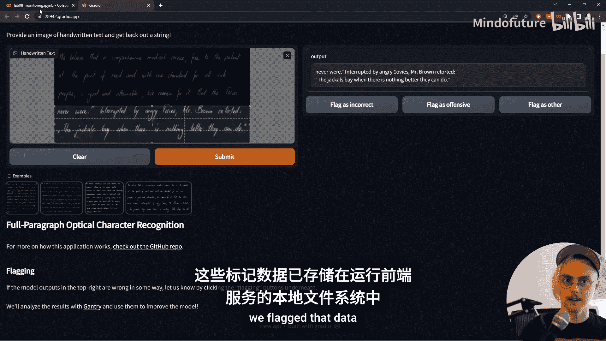
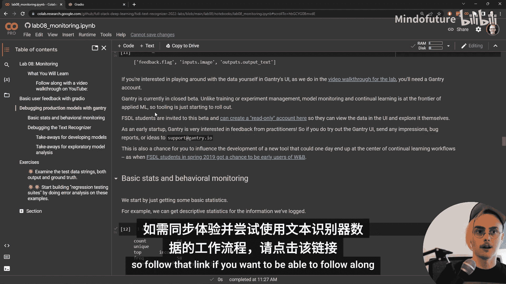
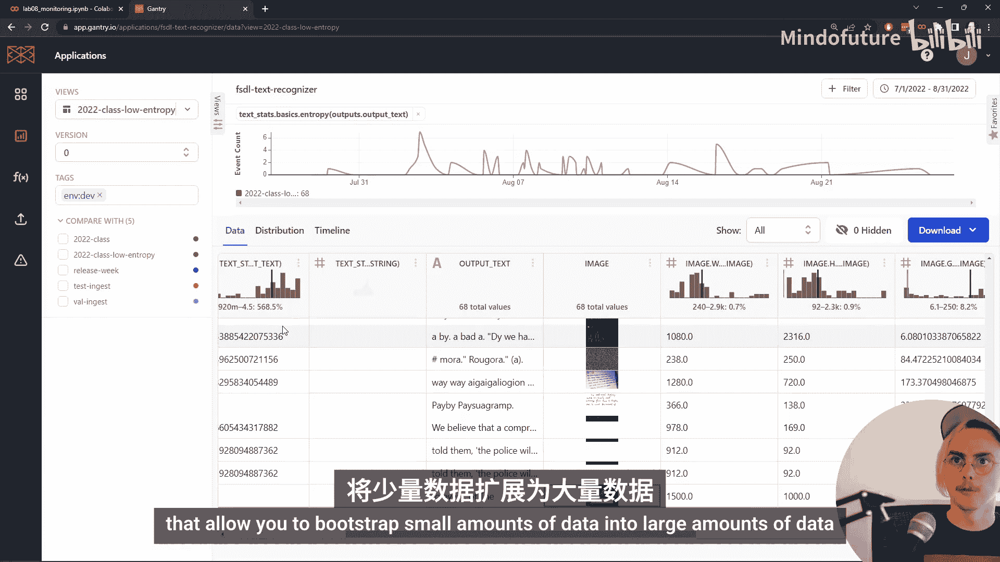
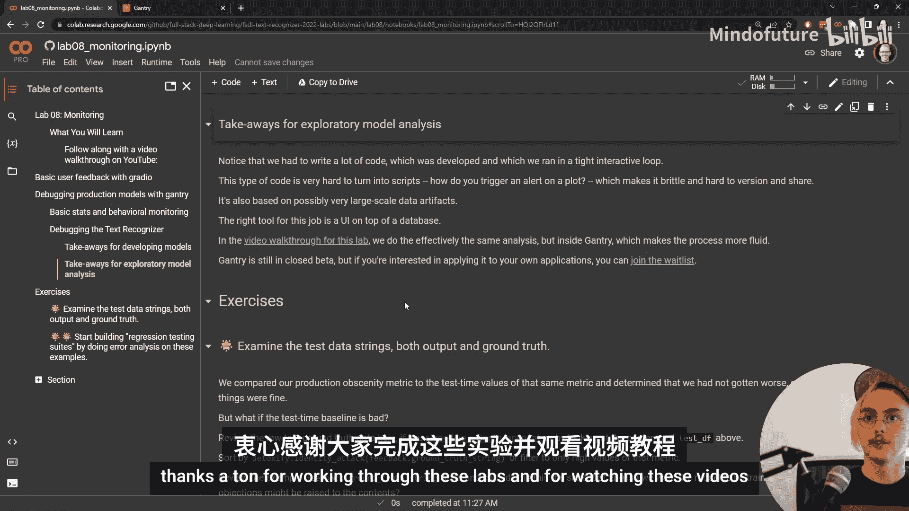

# 全栈深度学习：P15：模型监控与生产环境分析 🚀

在本节课中，我们将学习如何监控部署在生产环境中的深度学习模型，特别是我们之前构建的文本识别器。我们将探讨如何收集用户反馈、分析模型行为，并利用这些信息来发现和诊断模型在生产中可能遇到的问题。


---

欢迎回到全栈深度学习实验。我们现在进行最后一个实验。这是一个既令人兴奋又略带感伤的时刻。我们将学习如何监控模型，并确定我们构建的文本识别器在生产环境中是否正常工作。

在上一节实验中，我们为文本识别模型搭建了一个基本的用户界面，使得任何人都可以通过浏览器使用该模型。这很棒，但我们没有设置任何方法来了解模型的实际行为。我们有实验管理工具来监控训练期间的模型表现，现在我们也希望对生产环境中的模型进行类似的分析。

这与您可能为任何分布式应用程序所做的基础监控不同。在使用云服务提供商的情况下，我们通过E2服务器前端和无服务器Lambda后端设置，可以免费在AWS CloudWatch中获取实例运行状况和系统指标等信息。这对于响应传统故障很有帮助，但它无助于我们了解文本识别器在真实世界中的行为。如果模型预测出垃圾文本，它并不会崩溃，我们也不会像数据库写入失败或前端服务器崩溃那样收到警报。因此，我们必须构建一些专门用途的监控，以判断模型的预测是否良好。

## 用户反馈收集 🗳️



Gradio内置了基本的反馈收集功能。只需设置一个简单的标志即可启用此功能。

以下是启用用户反馈的代码示例：
```python
# 在Gradio接口中启用标记功能
interface = gr.Interface(..., flagging=True)
```

让我们看看当前通过Gradio可用的文本识别器应用版本。界面的变化很小，但在右侧，您会看到三个按钮：“标记为不正确”、“标记为冒犯性内容”和“标记为其他”。我们可以提交一个输入，然后标记其输出，以观察此功能如何工作。

当我们标记数据后，这些标记数据会存储在运行该前端服务器的机器的本地文件系统中。会生成一个CSV文件，其中包含输入、输出和一些其他元数据。我们可以使用像`pandas`这样的Python库来加载和操作这个CSV文件。

您会注意到，`handwritten_text`列（我们的输入图像）中存储的不是图像本身，而是对本地文件的引用。这是一种非常常见的模式：二进制数据与其他数据（如字符串、整数、时间戳）分开存储。如果我们想一起查看模型的输入和输出，就需要重新加载这些数据。

在这个阶段，您可以使用编辑器或上传自己的图像来测试模型。这种与模型的互动对于理解模型和领域至关重要。然而，即使是与了解领域的同事一起测试，也可能无法获得足够多样化的输入。为了真正了解模型，您需要真实的用户。

## 集中化日志记录与Gantry 📊

在本次课程中，我们并未将用户反馈数据保存在本地服务器，而是将其存储在名为Gantry的服务中。通常，本地日志记录不是一个好主意，因为大型本地日志会增加前端服务器的负担。

Gradio的标记机制支持通过使用标记回调类，将用户标记数据记录到您想要的任何后端。就像我们使用回调系统为PyTorch Lightning训练添加功能一样。我们可以在应用库中添加一个新的`flagging.py`文件，其中包含专门为处理图像转文本模型日志记录而设计的`GantryImageToTextLogger`。

查看该日志记录器的文档，我们可以看到其高级描述：它会将数据发送到AWS的云存储服务S3。代码分为两个阶段：首先将图像数据发送到S3，然后将该S3图像的URL连同模型输出、用户选择的标记等有用数据一起发送到Gantry。这遵循了我们在本地记录时看到的相同模式：将二进制数据与其他记录内容分开。

## 探索性模型分析 🔍

在实验笔记本的其余部分，我们将进行一种探索性模型分析，类似于探索性数据分析，通过观察模型行为来尝试理解其是否运行良好。



为此，我们需要从Gantry中提取我们记录的数据。我们使用`gantry.query`调用来实现，结果是一个pandas DataFrame。然后，我们可以使用典型的Python数据科学工具（如pandas和绘图库）对其进行分析。

我们也可以在Gantry用户界面中更轻松地进行相同的分析。Gantry是一个相对较新的初创工具，模型监控比我们之前使用的许多工具更处于前沿。模型部署本身就不如实验管理成熟，而实验管理又不如模型训练成熟。因此，这是我们课程中接触到的最前沿的工具之一。

登录Gantry UI后，我们可以看到显示从生产文本识别器记录的数据的仪表板。右上角显示了我查看的时间范围（2022年版本上线后的前两个月）。顶部有一个时间线视图，显示了用户反馈事件随时间流入的情况。

使用此类日志记录服务（无论是Gantry还是更传统的分布式系统监控工具）的一个巨大好处是它们会为您跟踪时间。处理日期时间本身可能非常麻烦，最好将其外包给库或应用程序。

## 监控模型行为与潜在危害 🛡️

滚动到屏幕底部，我们看到记录的内容之一是用户选择了哪个标记：模型不正确、行为冒犯性还是其他。悬停查看，最常见的类别似乎是“不正确”。因此，当用户抱怨我们的模型时，他们是在抱怨它错了，而不是它的行为具有冒犯性或令人不安。这是一个好迹象。

监控模型行为以确保它们不会做出令人不安的事情至关重要。由深度学习驱动的应用程序的一个定义性特征是它们处理人类真正关心的数据（图像、文本、音频）。因此，与数据库、计算器或电子邮件服务相比，深度学习应用程序更容易让人感到不安或伤害感情。这确实是您应该担心的P0级错误。

就像传统应用程序的服务级别协议中的指标（如第99百分位延迟）一样，它们可能看起来不那么重要，可能不影响与应用程序的大部分交互，但负面后果可能极其严重。这绝对是我们要追踪的事情。但就像内容审核一样，我们不想事后才发现问题。我们不想等到有人告诉我们模型做错了什么或让他们感到不安。我们想尝试自动发现这些问题。

## 使用投影进行自动化检测 📈

滚动回顶部，我们计算的一个指标是`detoxify`模型套件的“淫秽分数”，它试图判断文本是否淫秽。这确实属于我们在测试实验和讲座中讨论的“冒烟测试”类别。它们不会捕捉到模型可能淫秽或文本可能令人不安或为用户创造不良体验的所有方式，但会捕捉到一些最糟糕的例子和最容易发现的问题。

我们使用Gantry的一个称为“投影”的功能来计算此指标。投影的优点是，我们不需要提前考虑它们，因为它们是已记录数据的函数。我们可以在未来意识到某些事情重要时再运行它们。此外，我们可以在模型实际进行推理的环境之外运行它们。因此，我们可以做一些计算量很大的事情，比如在我们的文本上运行另一个自然语言处理模型。

除了检查身份攻击文本或淫秽文本的`detoxify`模型外，我们还可以计算更普通的指标，如文本长度、文本熵。我们可以将这些应用于真实标签字符串（如果我们有的话）和模型的输出文本以进行比较，也可以应用于输入而不仅仅是输出。我们还有一些处理图像的投影，例如计算像素强度值和图像大小。

## 比较分布与识别异常 📉

回到我们开始时的时间线视图，我们可以看到那个淫秽指标在某个时间点有所上升。出现了一个凸起。立即出现的问题是：这没问题，还是不好？例如，淫秽分数上升到0.03，这意味着我们的模型在到处说脏话，还是仅仅意味着用户提交了一张包含脏话的图片？

我们可以深入查看那个特定的数据点，稍后我们会做一些原始数据分析。但对于真正大量的数据，您需要做的是比较值的分布。将生产环境中未知模型行为是否正确的数据分布，与您信任模型行为的稳定基线（例如模型稳定运行时的过去行为）进行比较。

当模型首次部署时，就像我们现在看到的情况，您需要与之比较的是您在模型开发期间使用的数据，即验证集和测试集数据。我们也将这些数据导入了Gantry，以便进行比较。

转到分布选项卡，我们现在有两个分布：一个呈深栗色，另一个呈亮橙色。我们可以将这两个分布相互比较。橙色分布是在测试集上观察到的值，栗色分布是在生产环境中观察到的值。

左上角的图表显示了淫秽指标的值的分布。我们可以看到，如果有什么区别的话，测试环境中的淫秽值比生产环境中更高。因此，如果我们对模型在测试期间的行为感到满意，那么我们就没有理由认为模型在生产环境中的行为特别糟糕。

## 调试模型性能问题 🐛

监控模型是否会引起用户不满或导致不良后果非常重要，但了解模型是否做得好（而不仅仅是避免造成伤害）同样重要。因此，我们希望能够在同一界面中调试我们的模型。

在理想情况下，您拥有用户反馈，允许您计算训练期间使用的一些相同指标，例如准确率、字符错误率甚至损失。但这在生产中并不总是可能的。在训练中，我们可以访问真实标签，而在生产中，这几乎总是不具备的。设置让用户提供这些信息对于早期的机器学习产品来说可能是一个不错的选择，但最终，用户使用产品是为了自动化获取正确答案，而不是自己提供答案。

在您能够获取这些真实标签并计算您关心的训练指标之前，次优选择是计算与您关心的指标相关的值。这通常需要一些领域专业知识，以了解输入图像或输出文本的哪些特征对于检测模型中的错误可能很重要。

从Transformer模型的介绍到测试和模型监控讲座中多次提到的一点是，这些基于注意力的模型非常容易出现重复。重复的一个迹象是输出文本变得更容易预测。我们可以通过Gantry投影计算输出文本的熵来检查这一点。也存在文本模型可能产生熵过高的文本的情况（例如，字符均匀分布）。这个投影也会捕捉到这种情况。

查看这些分布，我们现在看到了一个更令人担忧的差异。我们看到生产环境（栗色分布）中低熵输出文本的数量比测试输出（橙色分布）中要多得多。在Gantry UI中，我们可以筛选出这些低熵输出，然后查看原始数据、输入图像和输出文本。

## 分析生产数据与测试数据的差异 🔎

添加筛选器后，我们转到数据选项卡查看原始数据。我们可以看到输入和输出数据、从生产应用程序记录的反馈标记，以及我们计算的所有投影。我们可以在这里进行典型的表格操作（筛选和排序），但我会重点关注一些原始数据点。

滚动查看，我们有输出文本和输入图像。在这些低熵输出示例中，我们确实看到了重复，更糟糕的是，它不是完整英语句子的重复，而是看起来完全是胡言乱语的重复。

这里有两种可能性：要么是我们的输出不好（这意味着输入-输出映射发生了变化，即测试环境中的模型与生产环境中的模型不完全相同），要么是输入存在差异。鉴于我们进行了一些测试来检查模型输出是否符合预期，我认为问题出在模型上的概率较低。因此，我首先要检查的是输入是否发生了变化。

让我们查看一下已导入的测试数据，看看是否能立即观察到测试数据与生产数据之间的明显差异。如果您通过长期使用测试数据而非常了解您的数据，或者对于正在运行的应用程序，如果您定期检查生产数据，那么您可以直接查看生产环境中的问题数据，并对差异可能是什么有很好的直觉。

点击这些图像放大查看。如果您一直跟着做这些实验，它们应该很熟悉：这是IAM手写数据库的图像。它们看起来都是深色背景、白色文字，尺寸完全相同（640x576）。它们的对比度也基本相同，总体上彼此非常相似。

让我们回到查看生产数据的视图，看看生产数据与测试数据在哪些方面不同。我立即注意到的一点是，许多用户输入是白色背景上带有深色文字。这回到了我们的数据预处理。当我们设置IAM手写数据集时，我们实际上反转了图像。这是为了在网络中获得更好的稳定性和更快的训练，但这一信息并没有一直传播到生产环境中运行的模型，因为它被视为数据预处理的一部分，而不是模型在训练期间所做的事情。

我们应尽可能避免使用那种会以用户不太可能提交的方式改变数据分布的预处理步骤，并且这些步骤没有纳入实际的模型代码中。我们可以尝试通过将反转步骤纳入我们的预处理来解决这个问题。但如果我们继续查看数据，会发现一些用户也上传了深色背景带有浅色文字的图像。从根本上说，文字的本质就是与背景形成高对比度以便阅读。因此，我们并不真的想将这个预处理步骤纳入我们的网络；我们想要的是训练一个能够处理具有各种不同背景的文字的网络。这将需要对我们的模型进行一些更改。

我们目前的模型仅处理灰度图像，这意味着如果我们有一张亮度完全相同但带有红色字母和蓝色背景的图像，我们的模型就会失败。这也可能意味着需要调整超参数，因为我们在处理数据分布更窄、数值差异更大的情况下选择了超参数。像素的数值可能会发生巨大变化，这可能影响优化稳定性、权重初始化值或许多其他差异。

解决这类错误具有挑战性，需要一些数据知识、领域专业知识，以及对输入图像特征的了解。确定正确的修复方法需要数据专业知识以及对模型和训练过程本身的理解。请注意，这些传入模型的浅色文字深色背景示例，模型在这里也表现不佳。这可能与IAM手写数据与用户提交的数据之间的其他差异有关。该数据是在同一时间、同一地点收集的，可能使用相似的书写工具和照明条件。而我们无法对产品的用户强制执行这些条件，否则产品将变得毫无用处。

我们通过进行不同的实验、构建更复杂的模型，成功地将模型的性能降低到了相当低的水平，但最终得到的模型只是在我们的基准测试中相同分布的数据上表现良好。然而，没有人真的想要一个纯粹只在某个基准测试上表现良好的模型。这是机器学习中的一个巨大问题，也可能是那些看起来很有前景的演示模型最终未能创造出有用产品的最常见原因之一。

## 从基准测试到实际产品 🎯

这种对基准测试（例如ImageNet分类挑战）的导向，以及对在保留数据上特定指标达到最先进水平的追求，激发了ML社区中一些非常有用的特性，如Kaggle和Papers with Code。这些在过去十年真正快速的技术进步和研究进展中，对于培养ML社区至关重要。但是，当涉及到制作有用的机器学习产品时，其中一些本能、习惯和文化倾向可能会失效。

这就是一个旨在捕获已知和未知问题的丰富日志记录系统的效用所在：记录大量数据，记录原始值（输入和输出），并将其放入ML工程师或其他利益相关者能够发现这些问题并研究如何解决它们的用户界面中。

## 在笔记本中进行原始数据分析 📓

我们也在笔记本界面中提供了一些查看原始数据的工具，并在练习中建议您浏览并发现常见的故障类型，以便构建我们在监控和测试讲座中讨论的那种回归测试套件。

我想现在介绍几个我注意到的故障模式，鼓励您尝试发现自己的问题。首先，相当多的用户发送打印或渲染的文本，而不仅仅是手写文本。许多工程师的本能反应是：“我只承诺了手写文本识别。那个输入组件叫做‘手写文本’。我说的是向这个模型提交手写文本并获得输出。”因此，告诉人们去“读该死的手册”。虽然在某些情况下这种回应确实有其道理，但在这种特定情况下，用户显然会感到非常惊讶：一个能识别手写文本的东西竟然不能识别打印文本。这对于能够阅读手写文本的人类来说并非如此。

关于这个问题的好消息是，实际上合成这种文本非常容易。打印文本可能稍微困难一些，获取带有注释的打印文本图像会很棘手，但渲染文本是许多应用程序和编程语言中最重要的功能之一。因此，我们应该能够以非常高质量的真实标签轻松合成这种文本。

其次，我们在段落上训练了我们的模型。我们训练的数据集叫做“IAM段落”。因此，实际上，我们只应期望我们的模型能够识别手写段落文本。但用户似乎希望能够从更复杂的文本空间排列中提取字符。例如，有人上传了我们文本识别器的架构图。这不是像段落那样组织的。因此，这将是一个更难解决的问题。我们可能需要对模型进行实质性的重新架构，此外还需要收集可用于学习如何处理具有更复杂空间分布的文本的数据。但这也是我们或许可以通过获取我们的行和段落数据并操纵它们以创建新型图像来解决的问题。

另一个出现的问题是，我们收到的文本包含超出我们字符集的符号，比如这个对勾。为了方便起见，我们基本上使用了ASCII字符集。但这对于处理用户输入到该模型的各种数据可能限制性太强。因此，这可能需要较小规模的模型重新架构以处理更广泛的输出，同样也需要收集或合成覆盖这些新型字符的额外数据。

最后，我们的用户上传的文本背景比训练中使用的纯色背景更加多样化。这可能是另一个可以通过数据合成解决的问题：我们可以从互联网上抓取通用图像，并将我们的文本放在上面（无论是文本图像、渲染文本还是合成文本），这应该有助于缩小这个差距。因此，这可能是一个纯粹通过数据合成和增强就可以解决的问题。

## 总结与展望 🌟

您可能已经注意到，在我对问题类型和解决方法的建议中出现了一些主题。总的来说，解决模型问题的方案将是改变您的数据。数据远比模型架构的改变，尤其是工程基础设施的改变，更能决定模型的质量。这就是为什么当您刚刚开始时，您真正想做的是尽可能多地使用预训练模型（例如，我们可以在我们的ResNet-Transformer中使用预训练的ResNet模型），并利用数据合成和其他技术，使您能够将少量数据引导为大量数据。



回到笔记本，在笔记本本身中，我们创建了一些类似的图表，并得出了与我们在Gantry用户界面中所做的相似的结论。在练习上方，我们总结了如何改进这个文本识别模型的一些要点。

如果您自己运行实验笔记本，直接操作生产和测试数据的数据框，您会注意到有很多相当脆弱和样板化的代码用于操作数据框和生成图表。您还会注意到，我们将整个数据作为单个数据框加载到内存中，这对于真正大规模的生产机器学习系统来说是无法扩展的。因此，尽管可以在笔记本中进行这种分析，但真正适合这项工作的工具是数据库之上的用户界面，比如Gantry。正如实验管理的正确工具不是一堆关于实验信息的数据框，而是像TensorBoard、MLflow或Weights & Biases这样的数据库之上的用户界面。

如果您有兴趣使用Gantry分析您自己的应用程序，而不仅仅是查看我们在这里记录的文本识别器数据，您需要申请加入完整测试版。

---

本节课中，我们一起学习了如何监控生产环境中的深度学习模型。我们从收集用户反馈开始，探讨了集中化日志记录的重要性，并利用Gantry工具进行了探索性模型分析。我们学习了如何比较数据分布以识别异常，如何调试模型性能问题，并分析了生产数据与测试数据之间的差异。最后，我们讨论了从追求基准测试性能转向构建实用产品的重要性，并总结了改进模型的关键在于数据的迭代与优化。



通过本课程的所有实验，我们从思考如何在PyTorch中编写神经网络、如何使用Lightning训练它们、如何设置模型架构、进行训练和实验管理，到注释、存储和处理数据，将生成的模型转化为非机器学习工程师也能实际使用的应用程序，最后迈出了闭环的关键一步：利用应用程序中发生的情况来驱动基于更好数据的更好模型的开发和改进。可以说，我们在这些实验的过程中经历了构建深度学习应用程序的全栈流程。希望您能将从这些实验中学到的知识，用于创建您自己的机器学习产品。祝您好运，构建愉快！