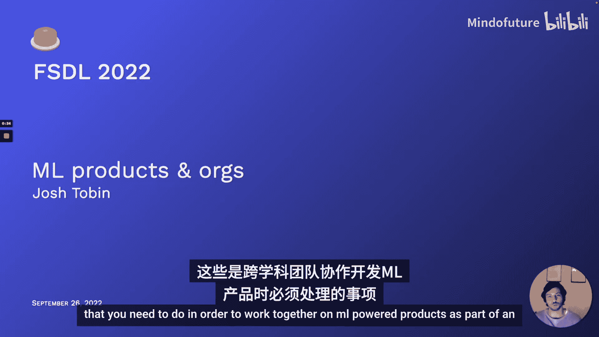
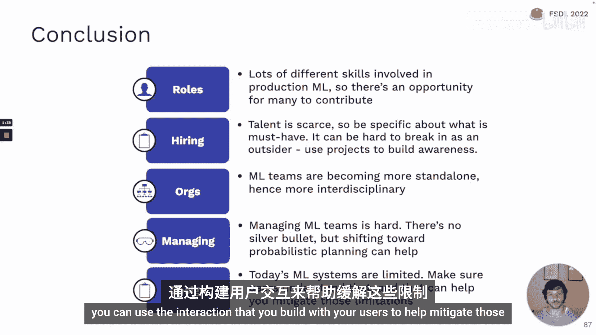
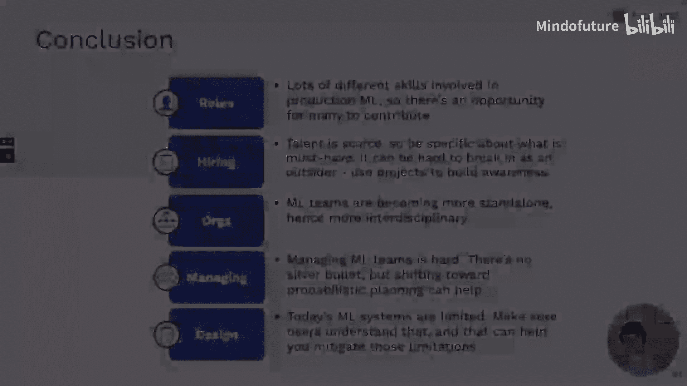

# 全栈深度学习：第8讲：机器学习团队与项目管理 🧠

在本节课中，我们将探讨如何作为跨学科团队的一员，共同构建由机器学习驱动的产品。我们将讨论构建此类产品时涉及的不同角色、招聘策略、团队组织结构、项目管理方法以及产品设计考量。

构建任何优秀产品都极具挑战性。你需要招聘优秀人才、有效管理团队、确保团队朝着共同目标努力、做出明智的长期技术决策、管理技术债务，并管理组织内外的期望。

机器学习为这一过程增添了更多复杂性。机器学习人才稀缺且昂贵，团队通常是跨学科的，项目时间线不明确且不确定性高，技术发展迅速，技术债务积累快。此外，组织领导者可能对机器学习了解不深，这使得帮助他们理解技术的实际能力和预期成果变得困难。

## 机器学习中的角色 👥

上一节我们介绍了构建机器学习产品面临的挑战，本节中我们来看看参与其中的不同角色。

最常见的机器学习角色包括：机器学习产品经理、MLOps/ML平台工程师、机器学习工程师、机器学习研究员/科学家以及数据科学家。这些角色在构建机器学习产品过程中承担不同的职能。

以下是这些角色的主要职责和产出：

*   **机器学习产品经理**：与机器学习团队、业务团队、用户及其他利益相关者合作，确定项目优先级并确保执行良好以满足组织需求。产出包括设计文档、线框图和工作计划。
*   **MLOps/ML平台团队**：专注于构建基础设施，使模型部署更简单、更具可扩展性，并减少机器学习贡献者的工作量。产出是可供公司内各机器学习团队使用的共享工具和基础设施。
*   **机器学习工程师**：负责训练、部署和维护为机器学习产品提供支持的预测模型。他们需要掌握从模型训练到生产部署和维护的全流程技能。
*   **机器学习研究员**：专注于模型训练阶段，产出训练好的模型以及描述模型功能、使用方法和结果复现性的报告或代码库。他们的工作通常在模型生产化之前。
*   **数据科学家**：这个术语在不同组织含义不同。可能指代上述任何角色，也可能特指使用数据分析回答业务问题的职能。

## 角色所需技能与背景 📊

了解了不同角色后，我们来看看成功胜任这些角色需要哪些技能。

我们可以用一个二维图来分析：X轴代表所需的机器学习技能深度，Y轴代表所需的软件工程技能，气泡大小代表对沟通或技术写作能力的要求。

以下是各角色的技能分布和典型背景：

*   **MLOps/ML平台工程师**：主要需要软件工程技能，通常来自传统软件工程或数据工程背景，或由对工具构建感兴趣的机器学习工程师转岗。
*   **机器学习工程师**：需要机器学习技能和软件工程技能的罕见结合。常见路径包括自学机器学习的软件工程师，或拥有机器学习背景后转向软件工程的人。
*   **机器学习研究员**：是机器学习专家，通常拥有研究生学位或通过工业研究项目获得相关经验。
*   **数据科学家**：背景多样，可能来自本科数据科学专业或拥有科学博士学位。
*   **机器学习产品经理**：通常来自传统产品管理背景，但需要对机器学习开发流程有深刻理解，可能源于长期与机器学习团队合作或自身对机器学习的浓厚兴趣。

另一个重要区分是**任务型机器学习工程师**和**平台型机器学习工程师**。前者负责特定机器学习流水线的端到端工作，后者则专注于构建跨团队的自动化工具和平台。

## 招聘机器学习人才 💼

我们介绍了构建机器学习产品所需的角色和技能，现在来看看如何招聘这些人才，或者作为求职者如何脱颖而出。

首先需要认识到**人工智能人才缺口**依然存在，尤其是在拥有生产经验的人才方面。招聘时，对于机器学习产品经理或MLOps工程师，核心仍是其本职技能，但拥有与生产机器学习系统团队合作的经验至关重要。

对于机器学习工程师和研究员，存在正确和错误的招聘方式。错误的方式是寻找“全能独角兽”，要求同时具备顶尖研究能力、深厚数学功底、基础设施构建、数据管道开发和生产部署监控等所有技能。

正确的招聘机器学习工程师的方式是：

1.  **明确实际需求**：专注于招聘软件工程技能强，同时对机器学习有基础和浓厚兴趣的人。机器学习技能可以在工作中培养。
2.  **招聘初级人才**：许多计算机科学本科毕业生已具备一定的机器学习理论基础和实践经验。
3.  **具体化岗位要求**：并非每个机器学习工程师都需要是DevOps专家或能从零实现新论文。许多岗位的核心是使用成熟库训练模型并将其部署到生产环境。

招聘机器学习研究员时，应关注**发表质量而非数量**，寻找对解决重要问题有独立见解的研究者。在已有成熟研究团队的情况下，也可以考虑招聘来自物理、统计等相邻领域的顶尖人才并加以培养。值得注意的是，如今从事机器学习研究并不一定需要博士学位。

## 寻找与吸引候选人 🔍

知道了如何评估候选人，接下来看看如何找到他们并吸引他们加入你的公司。

寻找候选人的标准渠道如LinkedIn和招聘人员都有效。此外，可以关注arXiv上新发布的论文或顶级会议上的优秀工作，联系第一作者。关注热门论文的高质量代码复现者也是发现人才的好方法。

由于人才短缺，吸引候选人同样重要。许多机器学习从业者看重以下几点：使用尖端工具和技术、在激动人心的领域积累知识、与优秀的人共事、处理有趣的数据集、从事有意义的工作。

你可以通过以下方式让你的公司脱颖而出：

*   **研究导向项目**：即使团队主要目标是支持公司业务，开展可公开发表的研究工作也能展示技术前沿性。
*   **开源与学习文化**：开源库、内部阅读小组、学习日、专业发展预算和会议预算都能吸引注重成长的候选人。
*   **打造明星团队**：招聘一位高知名度专家可以吸引更多人才。帮助现有团队成员发表博客和论文也能提升团队知名度。
*   **强调独特数据**：如果你在特定领域拥有独特且丰富的数据集，应在招聘材料中重点强调。
*   **宣扬公司使命**：阐述机器学习如何对公司使命产生重大影响。

## 机器学习面试 📝

上一节讨论了如何寻找和吸引人才，本节我们来看看机器学习面试的具体内容。

面试时应**测试候选人的优势领域，同时确保在其他方面达到最低要求**，以避免陷入寻找“全能独角兽”的陷阱。

对于研究员，确保他们能创造性地思考新的机器学习问题，并至少具备基本的软件工程知识和编写合格代码的能力。对于工程师，确保他们至少对机器学习有基本了解并充满热情，这表明他们能在工作中快速学习。

机器学习面试可能包含以下评估形式：

*   背景和文化契合度面试
*   白板编码面试
*   结对编程
*   **结对调试**：与面试官一起运行机器学习代码并查找错误。
*   数学谜题（尤其是线性代数相关）
*   带回家项目
*   **应用型机器学习问题**：讨论如何用机器学习解决某个问题，包括算法选择和支持系统。
*   **深挖过往项目**：询问简历中列出的项目细节、尝试过的方法、成功与失败原因，以评估思考深度和实际贡献。
*   **机器学习理论问题**

推荐阅读Chip Huyen的《机器学习面试入门》一书，它对准备机器学习面试非常有帮助。

## 求职建议 🎯

如果你是求职者，希望进入机器学习领域，以下是一些建议。

寻找机器学习工作的标准渠道如LinkedIn和招聘人员都有效。机器学习研究会议也是绝佳场所，可以直接与展台人员交流。由于人才缺口，直接向公司申请也可能比想象中更有效。

要想脱颖而出，可以采取以下方式，按效果递增排序：

1.  **展示兴趣**：参加课程、会议，表明你正在进入这个领域。
2.  **证明软件工程能力**：对许多公司来说，强大的软件工程能力可能比机器学习技能更重要。
3.  **展示广泛的机器学习知识**：撰写综合某个研究领域的博客文章，或以新颖、有说服力的方式阐述算法。
4.  **展示实施机器学习项目的能力**：通过**业余项目**来实现，可以是论文复现或课程项目。
5.  **证明创造性思维能力**：在Kaggle竞赛中获胜或发表论文，这会将你的简历置于前列。

## 机器学习团队的组织结构 🏢

我们讨论了构建机器学习产品涉及的角色以及招聘策略，现在来看看机器学习团队在组织中的不同结构模式。

由于技术仍处于早期应用阶段，尚无最佳团队结构的共识。我们可以将其视为一个从最不成熟到最成熟的“攀登”过程。

以下是五种常见的组织结构原型：

*   **萌芽或临时型**：公司刚开始接触机器学习，可能由分析团队或产品团队临时进行一些尝试。优点是机会多，缺点是支持少、基础设施缺乏、招聘难、领导层可能未完全认同。
*   **机器学习研发型**：公司设立专门的机器学习研发团队，通常由研究员或博士组成，专注于内部原型开发或对外研究。优点是可以专注于长期目标，缺点是难以获取所需数据，且通常难以转化为商业价值。
*   **嵌入式机器学习团队**：机器学习人员嵌入到业务或产品团队中，与软件或分析团队并肩工作。优点是成功交付的项目能直接转化为商业价值，反馈周期短。缺点是难以招聘和培养顶尖人才，获取资源（基础设施、数据、算力）可能较难，且可能与软件团队的运作方式产生冲突。
*   **独立的机器学习职能部门**：公司设立向高级领导层（如CEO、CTO）汇报的机器学习部门，这表明公司对机器学习进行了重大投资。通常会出现机器学习产品经理和平台角色。优点是资源获取能力强，易于招聘顶尖人才和建立工具、基础设施及文化。缺点是可能导致工作交接，增加模型投产的摩擦。
*   **机器学习优先型组织**：组织上下都认同并投资机器学习。既有中央机器学习部门处理最具挑战性的长期项目，又在各业务线配备机器学习专家以实现快速收益。这是许多大型科技公司和以机器学习为核心的初创公司的模式。优点很多，主要是最容易从机器学习中获得价值。缺点是对非此出身的组织而言，转型困难、昂贵且耗时。

## 团队设计选择 ⚙️

了解了组织结构，我们来看看构建机器学习团队时需要做出的具体设计选择，这些选择取决于组织所属的原型。

主要设计选择涉及三个方面：

1.  **软件工程与研究**：团队在多大程度上负责构建软件，而不仅仅是训练模型？
2.  **数据所有权**：团队是否负责创建和发布数据，还是仅从其他团队消费数据？
3.  **模型所有权**：团队是否负责将模型投入生产并维护？

不同原型的团队在这些选择上各有侧重：

*   **机器学习研发型**：优先研究技能，不拥有数据或模型生产化职责。
*   **嵌入式机器学习团队**：优先软件工程技能，研究员也需具备较强工程能力；不拥有数据，但通常负责维护自己部署的模型。
*   **独立的机器学习职能部门**：需要软件工程、研究和数据技能的强混合；团队规模较大；在数据治理中有发言权，并有强大的内部数据工程职能；可能将模型移交给用户，但维护责任界限模糊。
*   **机器学习优先型组织**：研究团队与工程团队紧密合作；机器学习团队可能拥有公司级数据基础设施；由于用户具备基本机器学习技能，模型可能由用户维护。

## 机器学习团队与项目管理 📈

我们探讨了机器学习团队的组织结构，现在来看看如何管理这些团队和项目。

机器学习项目管理和团队管理充满挑战。首先，**难以提前判断项目的难易程度**，初期进展迅速可能具有误导性。其次，**进展往往是非线性的**，项目可能因想法无效或数据问题而停滞数周。此外，在项目早期很难规划和时间估计。总之，生产级机器学习介于研究和工程之间。

另一个挑战是**研究与工程组织之间存在文化差异**。两者背景、培训、价值观和目标可能不同，在不良文化中可能产生冲突。

此外，管理者还需要**向上管理**，帮助不了解机器学习的领导层理解项目进展和前景。

## 改进机器学习项目管理 🛠️

面对这些挑战，我们可以采取一些方法来改进机器学习项目管理。

第一种方法是**概率性项目规划**。传统软件项目规划像瀑布，有明确的任务、时间估计和依赖关系。但在机器学习中，每个任务失败的概率更高。

在概率性规划中，我们为每个任务分配完成概率，并并行探索可达成相同依赖关系的替代任务。这样，当某个方法行不通或耗时超出预期时，可以调整时间线，并根据实际情况规划后续任务。

这种方法的一个推论是：**不应有任何完全依赖于研究的关键路径**。研究项目失败率很高。应该愿意尝试多种方法解决问题，可以在团队内开展友好的创意竞赛。

另一个推论是：在进行绩效管理时，不应只关注谁的想法最终奏效。在数周或一个季度的时间尺度上，应关注项目执行的好坏，而不是项目本身是否恰好成功。

## 成功关键与组织教育 🎓

除了概率规划，成功管理机器学习团队还有其他关键点。

要避免隐含地认为工程比研究更重要（反之亦然），这会导致资源分配不均。解决方案是让工程师和研究员紧密协作，有时甚至共同负责同一代码库。

争取**快速获胜**，先交付能工作的东西证明可行性，然后迭代改进，而不是追求完美模型。

如果你担任机器学习团队的产品经理或工程经理，需要**投入比想象中更多的精力来教育组织其他成员**。许多人对机器学习的实际应用、模型有效性的评估方式、机器学习固有的概率性（意味着生产环境必然会有失败）以及机器学习项目需要不同管理方式缺乏了解。

可以向领导层推荐一些资源，如Peter B.的UC伯克利商学院AI战略课程，或谷歌的《AI人员指南》。

## 机器学习产品经理的角色 🤝

在组织教育中，**机器学习产品经理**扮演着关键角色。我们可以类比两种机器学习工程师，来描述两种典型的机器学习产品经理。

*   **任务型机器学习产品经理**：负责严重依赖机器学习的特定产品或功能。需要对机器学习及其应用领域有专门知识，例如负责信任与安全产品或推荐产品的产品经理。这是目前行业中更常见的类型。
*   **平台型机器学习产品经理**：当组织拥有中央机器学习团队时出现。他们负责管理进出机器学习团队的工作流：过滤低优先级或不适合机器学习的项目；主动寻找可能对产品或公司有重大影响的项目；向机器学习团队传达优先级，并向组织其他部门沟通进展。这需要广泛的机器学习知识，以理解在组织所有业务中，机器学习可以在哪里、应该在哪里以及不应该在哪里应用。他们还在向组织其他部门传播机器学习知识和文化方面扮演关键角色，并帮助降低“模型建好了但组织不用”的风险。

## 机器学习项目管理方法论 🔄

关于机器学习产品管理，一个常见问题是：是否存在类似敏捷开发那样成熟的、可即插即用的机器学习项目管理方法论？

答案是，有几种新兴的方法论：

*   **CRISP-DM**：一种较老的方法论，最初专注于数据挖掘，后来应用于数据科学和机器学习。
*   **团队数据科学流程**：来自微软，提供更结构化的角色、职责和模板。

这两种方法论的共同点是将机器学习项目阶段描述为一个循环：从理解业务问题开始，到数据获取、模型构建、评估，最后部署。

使用这些方法论的主要原因是希望标准化项目生命周期的不同阶段。TDSP更结构化，CRISP-DM更宏观。

一般来说，如果你面临大规模协调问题，或者首次尝试让大型机器学习团队成功协作，使用这些方法论是合理的。否则，可能会拖慢进度，因为它们更侧重于传统数据挖掘或数据科学流程。

## 机器学习产品设计 🎨

最后，我们来讨论如何设计适合由机器学习驱动的产品。

根本挑战在于**用户对AI产品的期望与实际得到的存在差距**。用户往往将其心智模型建立在“比人类更智能的硅基智能”上，而当前机器学习系统的更好比喻是“一只被训练来解决谜题的狗”。它能在特定领域表现出色，但也会以奇怪且意想不到的方式失败，容易分心，难以泛化到新领域，需要反馈才能学习，并且如果无人看管可能会行为不当。

因此，优秀机器学习产品设计的目标是**弥合用户期望与现实之间的差距**。这包括几个方面：帮助用户理解他们实际得到的是什么以及系统的局限性；优雅地处理不可避免的故障；构建反馈循环以利用用户数据改进系统。

## 产品设计最佳实践 ✨

以下是机器学习产品设计的一些最佳实践。

**第一，向用户解释系统的优势和局限性。** 专注于产品为用户解决的实际问题，而不是强调它由AI驱动。用户界面越开放、越像人类，用户就越可能以对待人类的方式对待它，从而暴露出系统仍存在的故障模式。应该向用户说明模型的局限性，并考虑将这些限制作为防护栏构建到产品中。

**第二，不要过度依赖自动化，尽可能设计“人在回路”的体验。** 糟糕的自动化比没有自动化更糟。即使你知道正确答案，也应添加低摩擦的方式让用户确认预测。例如，Facebook的人脸识别建议标签功能，并没有直接分配标签，而是让用户点击确认。为了减轻错误预测的影响，可以设计让用户接管控制的机制（如自动驾驶汽车的方向盘），或者根据模型置信度谨慎地只展示高置信度的响应。

**第三，构建与用户的反馈循环。** 反馈类型多样，其收集难度和对模型的直接可用性各不相同。

以下是不同类型的用户反馈：

*   **间接隐式反馈**：收集用户行为信号作为模型性能的代理（如用户是否流失）。易于收集，对应重要业务结果，但难以归因于模型。
*   **直接隐式反馈**：收集衡量预测对用户直接有用性的信号（如是否点击推荐）。通常可以直接用于训练，但可能需要重新设计产品来收集。
*   **显式反馈**：直接要求用户提供反馈。
    *   **二元反馈**：如“赞/踩”按钮。用户操作简单，可作为不错的训练信号。
    *   **分类反馈**：让用户帮助分类反馈（如标记为不正确、冒犯性等）。对调试有用，但难以直接用于训练。
    *   **自由输入反馈**：用户通过支持工单等形式提供自由文本反馈。用户付出多，解析难，但信号价值可能很高。
    *   **纠正预测**：让用户直接纠正模型的预测。这是黄金标准，如果能在产品工作流中自然实现则非常理想（如教师纠正自动匹配的学生姓名）。

设计显式反馈时，需考虑用户的动机。最可靠的方式是将反馈集成到现有用户工作流中。如果目标是让模型变得更好，则应明确说明反馈将如何改善用户体验，且反馈与体验改善之间的时间间隔越短，越能形成正向循环。

## 总结 📚

本节课我们一起学习了如何以团队形式构建机器学习产品。

首先，我们探讨了**机器学习中的各种角色**，认识到生产级机器学习本质上是跨学科的，需要多种技能组合。由于人才稀缺，招聘时需要明确具体需求，而作为外部人员，通过项目展示能力是进入该领域的好方法。

其次，我们分析了**机器学习团队在组织中的不同结构模式**，从临时型到机器学习优先型，并了解了团队如何变得更加独立和跨学科。

接着，我们讨论了**管理机器学习团队和项目的挑战**。虽然没有银弹，但概率性项目规划有助于缓解时间估计的困难。

最后，我们深入探讨了**机器学习产品设计**。关键在于认识到当前的机器学习系统并非通用人工智能，存在诸多限制。因此，必须确保用户理解这一点，并通过设计“人在回路”的交互和防护栏来缓解这些限制，同时利用用户反馈构建强大的改进循环。

---
**本节课中我们一起学习了机器学习团队组建、招聘、组织结构、项目管理以及产品设计的核心概念与实践，为在真实组织中协作开发机器学习产品奠定了基础。**